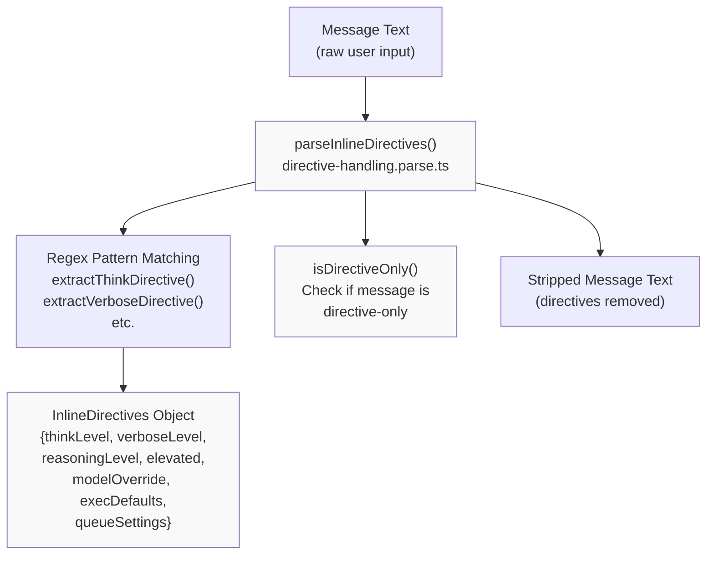
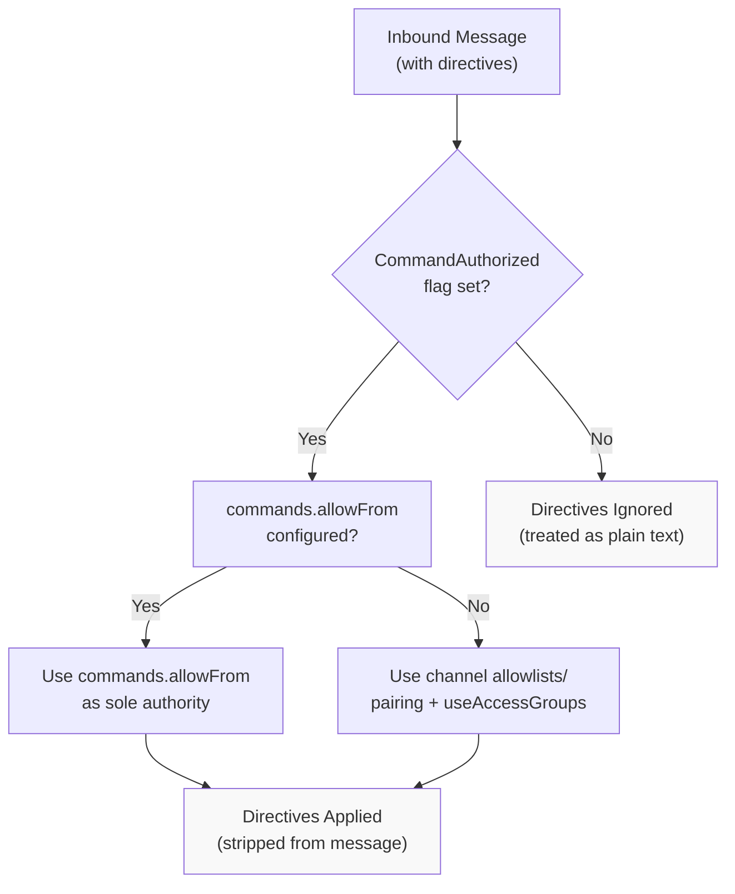
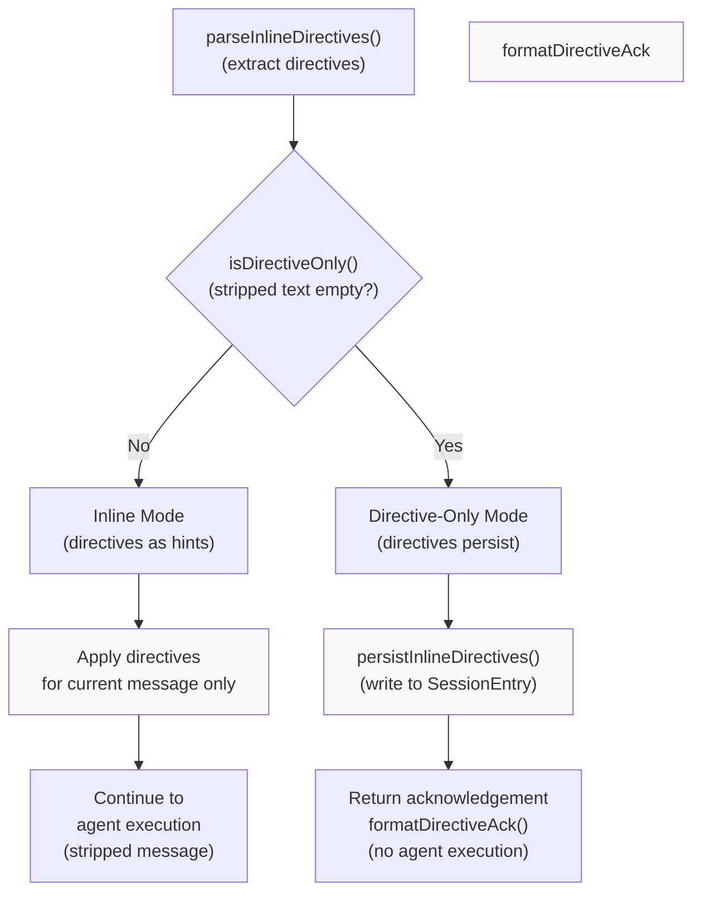
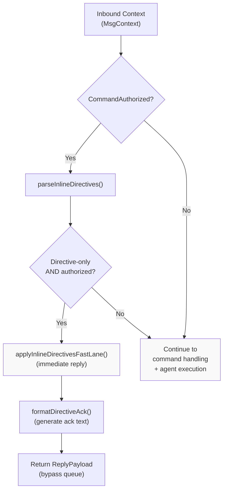

# Page: Directives

# Directives

<details>
<summary>Relevant source files</summary>

The following files were used as context for generating this wiki page:

- [docs/tools/slash-commands.md](docs/tools/slash-commands.md)
- [src/auto-reply/command-detection.ts](src/auto-reply/command-detection.ts)
- [src/auto-reply/commands-args.ts](src/auto-reply/commands-args.ts)
- [src/auto-reply/commands-registry.data.ts](src/auto-reply/commands-registry.data.ts)
- [src/auto-reply/commands-registry.test.ts](src/auto-reply/commands-registry.test.ts)
- [src/auto-reply/commands-registry.ts](src/auto-reply/commands-registry.ts)
- [src/auto-reply/commands-registry.types.ts](src/auto-reply/commands-registry.types.ts)
- [src/auto-reply/group-activation.ts](src/auto-reply/group-activation.ts)
- [src/auto-reply/reply.ts](src/auto-reply/reply.ts)
- [src/auto-reply/reply/commands-core.ts](src/auto-reply/reply/commands-core.ts)
- [src/auto-reply/reply/commands-status.ts](src/auto-reply/reply/commands-status.ts)
- [src/auto-reply/reply/commands-subagents.ts](src/auto-reply/reply/commands-subagents.ts)
- [src/auto-reply/reply/commands.test.ts](src/auto-reply/reply/commands.test.ts)
- [src/auto-reply/reply/commands.ts](src/auto-reply/reply/commands.ts)
- [src/auto-reply/reply/directive-handling.ts](src/auto-reply/reply/directive-handling.ts)
- [src/auto-reply/reply/subagents-utils.test.ts](src/auto-reply/reply/subagents-utils.test.ts)
- [src/auto-reply/reply/subagents-utils.ts](src/auto-reply/reply/subagents-utils.ts)
- [src/auto-reply/send-policy.ts](src/auto-reply/send-policy.ts)
- [src/auto-reply/status.test.ts](src/auto-reply/status.test.ts)
- [src/auto-reply/status.ts](src/auto-reply/status.ts)
- [src/auto-reply/templating.ts](src/auto-reply/templating.ts)

</details>


## Purpose and Scope

Directives are inline hints embedded in user messages that control agent behavior without being seen by the model. They use a colon-prefix syntax (`:think`, `:verbose`, `:reasoning`, etc.) and can either apply temporarily to a single message or persist to the session depending on context. This page covers directive syntax, parsing, authorization, persistence, and integration with agent execution.

For standalone control commands (like `/status`, `/reset`, `/config`), see [Command Reference](#9.1). For command authorization policies, see [Command Authorization](#9.2).

---

## Directive Types and Syntax

OpenClaw supports seven directive types, each controlling a specific aspect of agent execution:

| Directive | Syntax | Effect | Session Field |
|-----------|--------|--------|---------------|
| `:think` | `:think <level>` | Sets thinking/extended thinking level | `thinkingLevel` |
| `:verbose` | `:verbose` or `:verbose on\|off\|full` | Controls verbose tool output | `verboseLevel` |
| `:reasoning` | `:reasoning` or `:reasoning on\|off\|stream` | Controls reasoning visibility | `reasoningLevel` |
| `:elevated` | `:elevated` or `:elevated on\|off\|ask\|full` | Controls elevated tool access | `elevatedLevel` |
| `:model` | `:model <name>` | Overrides model selection | `modelOverride`, `providerOverride` |
| `:exec` | `:exec host=<...> security=<...> ask=<...>` | Sets exec tool defaults | `execDefaults` |
| `:queue` | `:queue <mode> [options]` | Adjusts queue behavior | `queueDebounceMs`, `queueCap`, `queueDrop` |

Directives are case-insensitive and can appear anywhere in the message text. Multiple directives can be combined in a single message.

**Sources:** [docs/tools/slash-commands.md:15-20](), [src/auto-reply/status.ts:6]()

---

## Parsing and Detection

### Parsing Pipeline



**Diagram: Directive Parsing Flow**

The `parseInlineDirectives()` function extracts directives from message text and returns both the parsed directives and the stripped message body. Each directive type has a dedicated extraction function.

**Sources:** [src/auto-reply/reply/directive-handling.parse.ts](), [src/auto-reply/reply/directives.ts:1-12]()

### Extraction Functions

Each directive type is extracted by a specific function that uses regex pattern matching:

- `extractThinkDirective()` - Matches `:think <level>` or `:thinking <level>` or `:t <level>`
- `extractVerboseDirective()` - Matches `:verbose` (on/off/full) or `:v`
- `extractReasoningDirective()` - Matches `:reasoning` (on/off/stream) or `:reason`
- `extractElevatedDirective()` - Matches `:elevated` (on/off/ask/full) or `:elev`
- `extractExecDirective()` - Matches `:exec host=... security=... ask=...`
- `extractQueueDirective()` - Matches `:queue <mode> [options]`
- Model directive - Extracted within `parseInlineDirectives()` using pattern `/:model\s+([^\s]+)/i`

**Sources:** [src/auto-reply/reply/directives.ts:1-10]()

### Directive-Only Detection

A message is considered "directive-only" if, after stripping directives and whitespace, no substantive content remains:

```typescript
function isDirectiveOnly(text: string, stripped: string): boolean {
  // Message is directive-only if stripped text is empty or whitespace-only
  // after removing directives
}
```

Directive-only messages receive special handling:
- Directives persist to the session
- An acknowledgement reply is generated
- The message does not continue to agent execution

**Sources:** [src/auto-reply/reply/directive-handling.parse.ts](), [docs/tools/slash-commands.md:17-21]()

---

## Authorization and Security

### Authorization Requirements



**Diagram: Directive Authorization Flow**

Directives are only processed for authorized senders. Authorization is determined by:

1. **`commands.allowFrom`** (if configured): Acts as the sole authority for directive authorization. Provider-specific keys override the `"*"` default.
2. **Channel allowlists + `commands.useAccessGroups`** (default): Uses channel-specific allowlists (`channels.<provider>.allowFrom`) combined with pairing and access group policies.

Unauthorized senders see directive tokens as plain text in the message body sent to the model.

**Sources:** [docs/tools/slash-commands.md:21-23](), [docs/tools/slash-commands.md:63-66]()

### Computing CommandAuthorized

The `CommandAuthorized` flag in `MsgContext` controls whether directives are processed. Channel monitors must compute this flag before directive parsing:

```typescript
// Directive detection (fast path, may have false positives)
const hasDirectives = hasInlineCommandTokens(messageBody);
if (hasDirectives) {
  ctx.CommandAuthorized = await checkAuthorization(...);
}
```

The `hasInlineCommandTokens()` function provides coarse detection using regex `/(?:^|\s)[/!][a-z]/i` to avoid expensive authorization checks for messages without any directive-like patterns.

**Sources:** [src/auto-reply/command-detection.ts:74-80](), [src/auto-reply/command-detection.ts:82-88]()

---

## Persistence Behavior

### Inline vs Directive-Only Messages



**Diagram: Directive Persistence Decision Flow**

**Inline Mode (Normal Messages with Directives)**

When a message contains both directives and substantive content, directives are applied as temporary hints for that message only. They do not persist to `SessionEntry` and will not affect subsequent messages.

Example:
```
User: "explain the codebase :verbose :think high"
→ Directives apply to this message only
→ Next message uses default session settings
```

**Directive-Only Mode (Standalone Directive Messages)**

When a message contains only directives (after stripping whitespace), the directives persist to the session and an acknowledgement is returned. The message does not proceed to agent execution.

Example:
```
User: ":think high :verbose on"
→ SessionEntry updated (thinkingLevel="high", verboseLevel="on")
→ Reply: "⚙️ think high · verbose on"
→ No agent execution
```

**Sources:** [docs/tools/slash-commands.md:17-21](), [src/auto-reply/reply/directive-handling.persist.ts](), [src/auto-reply/reply/directive-handling.shared.ts]()

### Persistence Implementation

The `persistInlineDirectives()` function writes directive values to the session store:

```typescript
async function persistInlineDirectives(params: {
  directives: InlineDirectives;
  sessionEntry: SessionEntry;
  storePath: string;
  cfg: OpenClawConfig;
}): Promise<void>
```

Fields updated in `SessionEntry`:
- `thinkingLevel` - `:think` directive value
- `verboseLevel` - `:verbose` directive value
- `reasoningLevel` - `:reasoning` directive value
- `elevatedLevel` - `:elevated` directive value
- `modelOverride` - Model name from `:model` directive
- `providerOverride` - Provider name from `:model` directive
- `execDefaults` - Parsed exec settings from `:exec`
- `queueDebounceMs`, `queueCap`, `queueDrop` - Queue settings from `:queue`
- `updatedAt` - Timestamp of last update

**Sources:** [src/auto-reply/reply/directive-handling.persist.ts]()

---

## Directive Processing Pipeline

### Fast Lane Processing



**Diagram: Directive Fast Lane Processing**

The fast lane provides immediate acknowledgement for directive-only messages without entering the queue or agent execution pipeline. This is implemented by `applyInlineDirectivesFastLane()` which:

1. Parses directives from message text
2. Checks if message is directive-only and authorized
3. Persists directives to session
4. Generates and returns acknowledgement
5. Bypasses queue and model execution

**Sources:** [src/auto-reply/reply/directive-handling.fast-lane.ts](), [src/auto-reply/reply/directive-handling.impl.ts]()

### Integration Points

Directives integrate with the reply flow at multiple points:

1. **Command Detection** - `shouldComputeCommandAuthorized()` checks for directive patterns
2. **Fast Lane** - `applyInlineDirectivesFastLane()` handles directive-only messages before queueing
3. **Agent Execution** - Inline directives override default session settings for the current run
4. **Status Display** - `/status` command shows current directive settings

**Sources:** [src/auto-reply/command-detection.ts:82-88](), [src/auto-reply/reply/directive-handling.fast-lane.ts]()

---

## Directive Effects on Agent Execution

### Think Directive (`:think`)

Controls the thinking/extended thinking level passed to the model provider. Valid levels depend on the provider and model:

- **Anthropic Claude**: `off`, `minimal`, `low`, `medium`, `high`, `xhigh`
- **OpenAI/Gemini**: `off`, `low`, `medium`, `high`

The directive maps to the `thinking` parameter in agent execution and affects token budgets for extended thinking.

**Session Field:** `thinkingLevel`

**Sources:** [src/auto-reply/thinking.ts](), [src/agents/thinking.js]()

### Verbose Directive (`:verbose`)

Controls whether tool call/result pairs are included in the chat context. Options:

- `on` - Include tool calls and results
- `off` - Exclude tool calls/results (default)
- `full` - Include detailed tool output

When enabled, users see tool execution details in the response or as separate messages (depending on channel capabilities).

**Session Field:** `verboseLevel`

**Sources:** [src/auto-reply/status.ts:6]()

### Reasoning Directive (`:reasoning`)

Controls visibility of reasoning tokens (for models that support extended thinking):

- `on` - Send reasoning as separate message prefixed "Reasoning:"
- `off` - Hide reasoning (default)
- `stream` - Stream reasoning to Telegram draft (Telegram only)

**Session Field:** `reasoningLevel`

**Sources:** [docs/tools/slash-commands.md:96]()

### Elevated Directive (`:elevated`)

Controls elevated tool access and exec approval behavior:

- `on` - Enable elevated tools, require approval (default)
- `off` - Disable elevated tools
- `ask` - Always prompt for approval
- `full` - Skip all approval prompts (dangerous)

Elevated tools include `exec`, `process`, and `bash` which can execute arbitrary code.

**Session Field:** `elevatedLevel`

**Sources:** [docs/tools/slash-commands.md:97]()

### Model Directive (`:model`)

Overrides the model selection for the session. Accepts:

- Provider/model format: `:model anthropic/claude-opus-4-5`
- Alias: `:model opus` (if configured)
- Short form: `:model openai/gpt-5.2`

The directive resolves to `modelOverride` and `providerOverride` fields in the session.

**Session Fields:** `modelOverride`, `providerOverride`

**Sources:** [src/auto-reply/reply/directive-handling.persist.ts](), [docs/tools/slash-commands.md:148-151]()

### Exec Directive (`:exec`)

Sets default parameters for the `exec` tool:

- `host=<sandbox|gateway|node>` - Execution environment
- `security=<deny|allowlist|full>` - Security level
- `ask=<off|on-miss|always>` - Approval mode
- `node=<id>` - Target node identifier

Example: `:exec host=gateway security=full ask=off`

**Session Field:** `execDefaults` (object with host, security, ask, node keys)

**Sources:** [docs/tools/slash-commands.md:98]()

### Queue Directive (`:queue`)

Adjusts message queue behavior for the session:

- `<mode>` - Queue mode: `steer`, `interrupt`, `followup`, `collect`, `steer-backlog`
- `debounce:<duration>` - Debounce interval (e.g., `2s`, `500ms`)
- `cap:<number>` - Maximum queue depth
- `drop:<policy>` - Drop policy: `old`, `new`, `summarize`

Example: `:queue collect debounce:2s cap:10 drop:old`

**Session Fields:** `queueDebounceMs`, `queueCap`, `queueDrop`

**Sources:** [docs/tools/slash-commands.md:100](), [src/auto-reply/reply/queue.ts]()

---

## Directive Acknowledgement Format

### Acknowledgement Generation

When a directive-only message is processed, an acknowledgement reply is generated by `formatDirectiveAck()`. The format varies by directive type:

```
⚙️ think high · verbose on
⚙️ Model: anthropic/claude-opus-4-5
⚙️ Queue: collect (debounce 2s · cap 10)
⚙️ elevated on
```

The acknowledgement confirms the new session settings and is sent immediately without agent execution.

**Sources:** [src/auto-reply/reply/directive-handling.shared.ts]()

---

## Usage Examples

### Example 1: Temporary Verbose Mode

```
User: "explain the codebase :verbose"
→ Agent runs with verbose=on for this message only
→ Next message uses default verbose=off
```

### Example 2: Persistent Settings

```
User: ":think high :verbose on"
→ Session updated (thinkingLevel="high", verboseLevel="on")
→ Reply: "⚙️ think high · verbose on"
→ All subsequent messages use these settings
```

### Example 3: Combined Directives

```
User: "review this code :model opus :think high :elevated full"
→ All three directives apply to current message
→ No persistence (message has substantive content)
```

### Example 4: Model Switching

```
User: ":model openai/gpt-5.2"
→ Session updated (modelOverride="gpt-5.2", providerOverride="openai")
→ Reply: "⚙️ Model: openai/gpt-5.2"
```

### Example 5: Queue Configuration

```
User: ":queue collect debounce:2s cap:5 drop:summarize"
→ Session updated with queue settings
→ Reply: "⚙️ Queue: collect (debounce 2s · cap 5 · drop summarize)"
```

**Sources:** [docs/tools/slash-commands.md:15-23]()

---

## Implementation Details

### Key Files and Functions

| File | Key Functions | Purpose |
|------|---------------|---------|
| `directive-handling.parse.ts` | `parseInlineDirectives()`, `isDirectiveOnly()` | Extract directives from text |
| `directive-handling.persist.ts` | `persistInlineDirectives()`, `resolveDefaultModel()` | Write directives to session |
| `directive-handling.impl.ts` | Implementation helpers | Core directive logic |
| `directive-handling.fast-lane.ts` | `applyInlineDirectivesFastLane()` | Fast path for directive-only |
| `directive-handling.shared.ts` | `formatDirectiveAck()` | Generate acknowledgements |
| `directives.ts` | `extractThinkDirective()`, `extractVerboseDirective()`, etc. | Individual extraction functions |

**Sources:** [src/auto-reply/reply/directive-handling.ts:1-7](), [src/auto-reply/reply/directives.ts:1-12]()

### Related Configuration

Directive authorization is controlled by:

```json5
{
  commands: {
    allowFrom: {
      "*": ["user1"],           // Global directive authorization
      discord: ["user:123"],    // Provider-specific override
    },
    useAccessGroups: true,      // Use channel allowlists when allowFrom unset
  }
}
```

**Sources:** [docs/tools/slash-commands.md:63-66]()

---

## Security Considerations

1. **Authorization is Required**: Unauthorized users cannot use directives. Directive tokens appear as plain text to the model.

2. **Elevated Directive Risk**: `:elevated full` disables all exec approvals. This is dangerous in group settings or with untrusted users.

3. **Verbose/Reasoning Leak Risk**: These directives may expose tool output or internal reasoning in group chats. Use with caution in shared contexts.

4. **Model Override Abuse**: `:model` can override cost controls if allowlists permit expensive models. Consider restricting model allowlists for untrusted users.

5. **Group Settings**: Directive persistence affects all subsequent messages in a session. In group chats, this can impact other users' experience.

**Sources:** [docs/tools/slash-commands.md:119-120]()

---

## Differences from Commands

| Aspect | Directives | Commands |
|--------|-----------|----------|
| Syntax | `:think`, `:verbose`, `:model` | `/status`, `/reset`, `/help` |
| Purpose | Modify agent behavior | Trigger actions |
| Visibility | Stripped from model input | May trigger standalone responses |
| Persistence | Context-dependent (inline vs standalone) | N/A (actions are immediate) |
| Authorization | Requires `CommandAuthorized` | Requires `CommandAuthorized` |
| Examples | `:think high`, `:model opus` | `/status`, `/new`, `/config` |

Directives are hints that modify execution parameters. Commands are actions that trigger specific behaviors (status display, session reset, etc.). Some commands (like `/model`) are implemented as directive wrappers for consistency.

**Sources:** [docs/tools/slash-commands.md:15-23]()

---