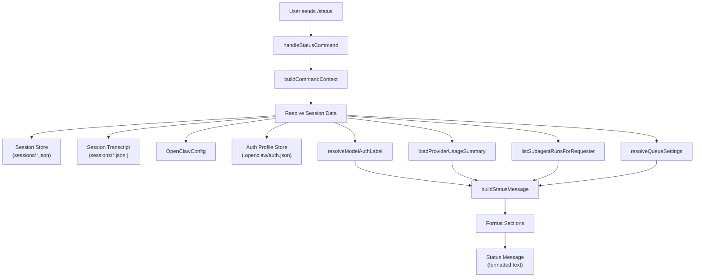
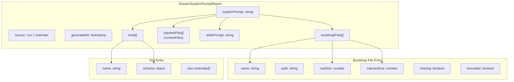
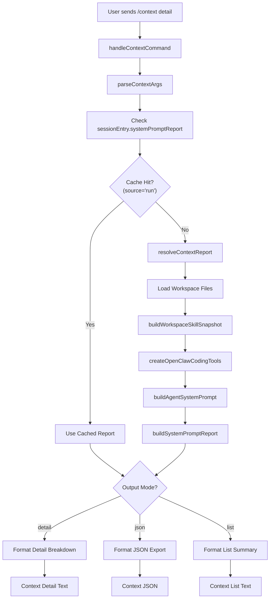

# Page: Status and Context Reporting

# Status and Context Reporting

<details>
<summary>Relevant source files</summary>

The following files were used as context for generating this wiki page:

- [docs/concepts/system-prompt.md](docs/concepts/system-prompt.md)
- [docs/gateway/cli-backends.md](docs/gateway/cli-backends.md)
- [docs/reference/token-use.md](docs/reference/token-use.md)
- [docs/tools/slash-commands.md](docs/tools/slash-commands.md)
- [src/agents/auth-profiles/oauth.fallback-to-main-agent.test.ts](src/agents/auth-profiles/oauth.fallback-to-main-agent.test.ts)
- [src/agents/auth-profiles/oauth.ts](src/agents/auth-profiles/oauth.ts)
- [src/agents/cli-backends.ts](src/agents/cli-backends.ts)
- [src/agents/cli-runner.test.ts](src/agents/cli-runner.test.ts)
- [src/agents/cli-runner.ts](src/agents/cli-runner.ts)
- [src/agents/cli-runner/helpers.ts](src/agents/cli-runner/helpers.ts)
- [src/agents/pi-embedded-runner/compact.ts](src/agents/pi-embedded-runner/compact.ts)
- [src/agents/pi-embedded-runner/run/attempt.ts](src/agents/pi-embedded-runner/run/attempt.ts)
- [src/agents/pi-embedded-runner/system-prompt.ts](src/agents/pi-embedded-runner/system-prompt.ts)
- [src/agents/system-prompt-params.ts](src/agents/system-prompt-params.ts)
- [src/agents/system-prompt-report.ts](src/agents/system-prompt-report.ts)
- [src/agents/system-prompt.test.ts](src/agents/system-prompt.test.ts)
- [src/agents/system-prompt.ts](src/agents/system-prompt.ts)
- [src/auto-reply/command-detection.ts](src/auto-reply/command-detection.ts)
- [src/auto-reply/commands-args.ts](src/auto-reply/commands-args.ts)
- [src/auto-reply/commands-registry.data.ts](src/auto-reply/commands-registry.data.ts)
- [src/auto-reply/commands-registry.test.ts](src/auto-reply/commands-registry.test.ts)
- [src/auto-reply/commands-registry.ts](src/auto-reply/commands-registry.ts)
- [src/auto-reply/commands-registry.types.ts](src/auto-reply/commands-registry.types.ts)
- [src/auto-reply/group-activation.ts](src/auto-reply/group-activation.ts)
- [src/auto-reply/reply.ts](src/auto-reply/reply.ts)
- [src/auto-reply/reply/agent-runner.heartbeat-typing.runreplyagent-typing-heartbeat.retries-after-compaction-failure-by-resetting-session.test.ts](src/auto-reply/reply/agent-runner.heartbeat-typing.runreplyagent-typing-heartbeat.retries-after-compaction-failure-by-resetting-session.test.ts)
- [src/auto-reply/reply/commands-context-report.ts](src/auto-reply/reply/commands-context-report.ts)
- [src/auto-reply/reply/commands-core.ts](src/auto-reply/reply/commands-core.ts)
- [src/auto-reply/reply/commands-status.ts](src/auto-reply/reply/commands-status.ts)
- [src/auto-reply/reply/commands-subagents.ts](src/auto-reply/reply/commands-subagents.ts)
- [src/auto-reply/reply/commands.test.ts](src/auto-reply/reply/commands.test.ts)
- [src/auto-reply/reply/commands.ts](src/auto-reply/reply/commands.ts)
- [src/auto-reply/reply/directive-handling.ts](src/auto-reply/reply/directive-handling.ts)
- [src/auto-reply/reply/subagents-utils.test.ts](src/auto-reply/reply/subagents-utils.test.ts)
- [src/auto-reply/reply/subagents-utils.ts](src/auto-reply/reply/subagents-utils.ts)
- [src/auto-reply/send-policy.ts](src/auto-reply/send-policy.ts)
- [src/auto-reply/status.test.ts](src/auto-reply/status.test.ts)
- [src/auto-reply/status.ts](src/auto-reply/status.ts)
- [src/auto-reply/templating.ts](src/auto-reply/templating.ts)
- [src/gateway/gateway-cli-backend.live.test.ts](src/gateway/gateway-cli-backend.live.test.ts)
- [src/telegram/group-migration.test.ts](src/telegram/group-migration.test.ts)
- [src/telegram/group-migration.ts](src/telegram/group-migration.ts)

</details>


This document covers the `/status` and `/context` commands, which provide visibility into agent session state, token usage, cost estimates, and context window consumption.

For information about other slash commands, see [Commands and Directives](#9). For session management and compaction, see [Session Management](#5.3) and [Context Overflow and Auto-Compaction](#5.5).

---

## Overview

OpenClaw provides two primary commands for monitoring agent runtime state:

- **`/status`**: Shows current session state, token usage, cost estimates, model configuration, and runtime options
- **`/context`**: Explains what consumes context window space, with optional detailed breakdown of files, tools, and skills

Both commands are "fast path" - they execute immediately without queueing or model invocation, and work as inline shortcuts (e.g., `hey /status what model are we using?` will trigger status output and pass the remainder to the model).

Sources: [src/auto-reply/status.ts:309-468](), [src/auto-reply/reply/commands-context-report.ts:181-299](), [docs/tools/slash-commands.md:69-80]()

---

## Status Command (`/status`)

### Status Message Structure

The `/status` command returns a multi-line report with the following sections:

| Section | Content | Example |
|---------|---------|---------|
| Version | OpenClaw version and commit hash | `🦞 OpenClaw 2025.1.3 (a1b2c3d)` |
| Time | Current timestamp (when available) | `🕐 Monday, Jan 6, 2025 — 3:26 PM` |
| Model | Provider/model and auth mode | `🧠 Model: anthropic/claude-opus-4-5 · 🔑 api-key` |
| Usage | Input/output token counts and cost | `🧮 Tokens: 1.2k in / 800 out · 💵 Cost: $0.0020` |
| Context | Total tokens vs context limit | `📚 Context: 16k/32k (50%) · 🧹 Compactions: 2` |
| Media | Media understanding results | `📎 Media: image ok (openai/gpt-5.2)` |
| Provider Usage | Provider quota/usage (when tracked) | `📊 Usage: Claude 80% left (5h)` |
| Session | Session key and last update time | `🧵 Session: agent:main:main · updated 10m ago` |
| Subagents | Count of active subagents | `🤖 Subagents: 2 active` |
| Options | Runtime mode and toggles | `⚙️ Runtime: direct · Think: medium · elevated` |
| Voice | TTS configuration | `🔊 Voice: inbound · provider=openai · limit=500` |
| Activation | Group activation mode | `👥 Activation: mention · 🪢 Queue: collect (depth 3)` |

Sources: [src/auto-reply/status.ts:309-468](), [src/auto-reply/reply/commands-status.ts:110-173]()

---

### Status Command Data Flow



**Status Command Data Flow**

The status command aggregates data from multiple sources: session store for cached state, transcript logs for actual token usage, auth store for credential metadata, and live registries for subagent counts and queue depth.

Sources: [src/auto-reply/reply/commands-status.ts:110-173](), [src/auto-reply/status.ts:309-468]()

---

### Token and Cost Calculation

#### Token Resolution Strategy

Token counts are resolved with the following priority:

1. **Transcript logs** (`readUsageFromSessionLog`): Reads the session JSONL file and sums `usage.cacheRead`, `usage.input`, and `usage.output` from the most recent message
2. **Session store cache** (`sessionEntry.inputTokens`, `sessionEntry.outputTokens`, `sessionEntry.totalTokens`): Fallback when transcript is unavailable
3. **Estimated tokens**: When both sources are missing, context tokens are estimated at 4 chars/token

The `/status` command prefers transcript usage when `includeTranscriptUsage: true` is set, since session store may not capture cached prompt tokens accurately.

Sources: [src/auto-reply/status.ts:165-232](), [src/auto-reply/reply/commands-status.ts:110-173]()

#### Cost Estimation

Cost is calculated when:
- Auth mode is `api-key` or `mixed` (OAuth/AWS SDK usage is not metered by OpenClaw)
- Model cost config is defined (`models.providers[provider].models[].cost`)

Cost formula:
```
cost = (inputTokens * costConfig.input / 1M) +
       (outputTokens * costConfig.output / 1M) +
       (cacheReadTokens * costConfig.cacheRead / 1M) +
       (cacheWriteTokens * costConfig.cacheWrite / 1M)
```

Sources: [src/auto-reply/status.ts:418-438](), [src/utils/usage-format.ts:1-50]()

---

### Provider Usage Tracking

When provider usage tracking is enabled (e.g., for Claude via Anthropic API), the status message includes a usage summary line:

```
📊 Usage: Claude 80% left (5h)
```

This data comes from `loadProviderUsageSummary`, which:
1. Resolves the provider usage ID (e.g., `anthropic:default` for the default Anthropic auth profile)
2. Reads cached usage data from `~/.openclaw/usage/<providerId>.json`
3. Formats remaining quota percentage and time window

Provider usage is tracked separately and updated when the model is invoked. See [Model Selection and Failover](#5.4) for details.

Sources: [src/auto-reply/reply/commands-status.ts:124-144](), [src/infra/provider-usage.ts:1-300]()

---

## Context Command (`/context`)

### Context Breakdown Modes

The `/context` command supports multiple output modes:

| Mode | Command | Output |
|------|---------|--------|
| Help | `/context` or `/context help` | Usage instructions |
| List | `/context list` | Compact breakdown by category |
| Detail | `/context detail` | Per-file, per-tool, per-skill sizes |
| JSON | `/context json` | Machine-readable JSON export |

Sources: [src/auto-reply/reply/commands-context-report.ts:181-299](), [docs/tools/slash-commands.md:78]()

---

### Context Report Data Structure



**Context Report Data Structure**

The `SessionSystemPromptReport` captures all components that consume context window space, including their raw and injected sizes. Bootstrap files track truncation; tools track schema overhead.

Sources: [src/config/sessions/types.ts:1-100](), [src/agents/system-prompt-report.ts:1-200]()

---

### Context Breakdown Categories

The `/context detail` output groups context consumers by category:

#### System Prompt Sections

- Core prompt text (identity, tooling, safety, runtime)
- Skills guidance (when skills are available)
- Memory recall instructions (when `memory_search` tool is enabled)
- Documentation references
- Heartbeat and silent reply instructions
- Time/timezone information
- Sandbox information (when sandboxed)

#### Bootstrap Files

Workspace files injected into every prompt:
- `AGENTS.md`, `SOUL.md`, `TOOLS.md`, `IDENTITY.md`, `USER.md`, `HEARTBEAT.md`
- `MEMORY.md` and/or `memory.md` (when present)
- `BOOTSTRAP.md` (new workspaces only)

Each file shows:
- Raw size (before truncation)
- Injected size (after truncation and markdown wrapping)
- Truncation status (when truncated via `agents.defaults.bootstrapMaxChars`)

#### Tool Schemas

Each tool contributes schema overhead based on its parameter definitions. The context report estimates tool schema size by serializing the tool definition and counting characters.

Top tools by schema size are listed (default: top 10).

#### Skills

The skills prompt (`formatSkillsForPrompt`) lists available skills with descriptions and file paths. Total size is reported, with per-skill breakdown in detail mode.

Sources: [src/auto-reply/reply/commands-context-report.ts:181-299](), [src/agents/system-prompt-report.ts:1-200]()

---

### Context Command Flow



**Context Command Flow**

The context command reuses the cached `systemPromptReport` from the last run when available, falling back to rebuilding the report by loading workspace files, building skill snapshots, creating tool definitions, and assembling the system prompt.

Sources: [src/auto-reply/reply/commands-context-report.ts:52-179](), [src/agents/system-prompt-report.ts:1-200]()

---

## Data Sources

### Session Store

The session store (`~/.openclaw/agents/<agentId>/sessions/<sessionId>.json`) caches per-session metadata:

```typescript
type SessionEntry = {
  sessionId: string;
  updatedAt: number;
  inputTokens?: number;
  outputTokens?: number;
  totalTokens?: number;
  contextTokens?: number;
  compactionCount: number;
  providerOverride?: string;
  modelOverride?: string;
  elevatedLevel?: "on" | "off" | "ask" | "full";
  thinkingLevel?: ThinkLevel;
  verboseLevel?: VerboseLevel;
  groupActivation?: "mention" | "always";
  systemPromptReport?: SessionSystemPromptReport;
  // ... other fields
};
```

The `systemPromptReport` is populated after each run and reused by `/context` to avoid expensive recomputation.

Sources: [src/config/sessions/types.ts:1-200](), [src/auto-reply/reply/commands-context-report.ts:52-179]()

---

### Session Transcript Logs

Session transcripts (`~/.openclaw/agents/<agentId>/sessions/<sessionId>.jsonl`) record every turn with full usage metadata:

```json
{"type":"message","message":{"role":"assistant","model":"claude-opus-4-5","usage":{"input":1200,"output":800,"cacheRead":14000,"cacheWrite":0,"totalTokens":16000}}}
```

The status command parses the last line to extract accurate token counts, including cached prompt tokens which may not appear in the session store.

Sources: [src/auto-reply/status.ts:165-232]()

---

### Configuration Data

Status and context reporting read runtime configuration from `OpenClawConfig`:

- `agents.defaults.model`: Default model selection
- `agents.defaults.contextTokens`: Context window size override
- `agents.defaults.bootstrapMaxChars`: Per-file truncation limit (default: 20000)
- `models.providers[].models[].cost`: Cost per million tokens
- `agents.defaults.userTimezone`: User timezone for time display
- `agents.defaults.timeFormat`: Time format (`12` | `24` | `auto`)

Sources: [src/auto-reply/status.ts:309-468](), [src/agents/system-prompt-params.ts:1-100]()

---

## Token Estimation

Token estimation uses a 4:1 character-to-token ratio as a rough heuristic:

```typescript
function estimateTokensFromChars(chars: number): number {
  return Math.ceil(Math.max(0, chars) / 4);
}
```

This is used when:
- Displaying estimated token counts in context breakdown
- Comparing raw vs injected file sizes
- Estimating tool schema overhead

Actual token counts from model responses are always preferred when available.

Sources: [src/auto-reply/reply/commands-context-report.ts:19-29]()

---

## Status Command Implementation Details

### Model Authentication Display

The status command resolves auth mode labels by:

1. Checking for OAuth profiles in auth store
2. Checking for API key profiles
3. Checking for environment variable API keys
4. Checking for custom provider configs
5. Falling back to `unknown` when none are found

OAuth profiles show expiration time when available. API keys show a redacted snippet (first 6 + last 6 chars).

Sources: [src/auto-reply/reply/commands-status.ts:35-75]()

---

### Subagent Status

When subagents are active, the status message includes a subagent line:

```
🤖 Subagents: 2 active (1 running, 1 idle)
```

This data comes from `listSubagentRunsForRequester`, which filters the global subagent registry for runs spawned by the current session.

Sources: [src/auto-reply/reply/commands-status.ts:150-160](), [src/agents/subagent-registry.ts:1-200]()

---

### Queue Status Display

Queue settings are resolved from:
1. Session-specific overrides (when `/queue` was used)
2. Agent config defaults
3. Global defaults

The status line shows:
- Queue mode (`none`, `collect`, `summarize`)
- Current depth (number of queued messages)
- Debounce delay (when non-zero)
- Cap and drop policy (when overridden)

Example: `🪢 Queue: collect (depth 3 · debounce 2s · cap 5 · drop old)`

Sources: [src/auto-reply/status.ts:138-163](), [src/auto-reply/reply/queue.ts:1-500]()

---

## Context Breakdown Output Examples

### `/context list`

```
🧠 Context Breakdown

System prompt: 2,431 chars (~608 tok)

Injected workspace files:
- AGENTS.md: 412 chars (~103 tok)
- IDENTITY.md: 287 chars (~72 tok)
- MEMORY.md: 1,205 chars (~302 tok) ⚠️ Consumes tokens on every turn

Skills: 1,843 chars (~461 tok)

Top 10 tools (schema size):
- exec: 524 chars (~131 tok)
- read: 318 chars (~80 tok)
- write: 289 chars (~73 tok)
(7 more tools omitted)

Total estimated context: ~6,500 tokens (20% of 32k limit)
```

Sources: [src/auto-reply/reply/commands-context-report.ts:200-250]()

---

### `/context detail`

The detail mode expands all sections, showing:
- Full list of bootstrap files (raw size → injected size)
- Full list of tools with schema sizes
- Full list of skills with prompt contributions
- System prompt sections breakdown
- Truncation warnings for files exceeding `bootstrapMaxChars`

Sources: [src/auto-reply/reply/commands-context-report.ts:250-299]()

---

### `/context json`

JSON export includes the full `SessionSystemPromptReport` structure, suitable for programmatic analysis:

```json
{
  "source": "run",
  "generatedAt": 1704571200000,
  "sessionId": "abc123",
  "provider": "anthropic",
  "model": "claude-opus-4-5",
  "systemPrompt": "...",
  "bootstrapFiles": [...],
  "injectedFiles": [...],
  "skillsPrompt": "...",
  "tools": [...]
}
```

Sources: [src/auto-reply/reply/commands-context-report.ts:270-280]()

---

## Authorization and Access Control

Both `/status` and `/context` are always available to authorized senders (they bypass `commands.allowFrom` restrictions). This ensures operators can always check session state regardless of command authorization policy.

For command authorization details, see [Command Authorization](#9.2).

Sources: [docs/tools/slash-commands.md:69-125](), [src/auto-reply/reply/commands-core.ts:1-200]()

---