# Page: Subagent Management

# Subagent Management

<details>
<summary>Relevant source files</summary>

The following files were used as context for generating this wiki page:

- [docs/tools/slash-commands.md](docs/tools/slash-commands.md)
- [src/auto-reply/command-detection.ts](src/auto-reply/command-detection.ts)
- [src/auto-reply/commands-args.ts](src/auto-reply/commands-args.ts)
- [src/auto-reply/commands-registry.data.ts](src/auto-reply/commands-registry.data.ts)
- [src/auto-reply/commands-registry.test.ts](src/auto-reply/commands-registry.test.ts)
- [src/auto-reply/commands-registry.ts](src/auto-reply/commands-registry.ts)
- [src/auto-reply/commands-registry.types.ts](src/auto-reply/commands-registry.types.ts)
- [src/auto-reply/group-activation.ts](src/auto-reply/group-activation.ts)
- [src/auto-reply/reply.ts](src/auto-reply/reply.ts)
- [src/auto-reply/reply/commands-core.ts](src/auto-reply/reply/commands-core.ts)
- [src/auto-reply/reply/commands-status.ts](src/auto-reply/reply/commands-status.ts)
- [src/auto-reply/reply/commands-subagents.ts](src/auto-reply/reply/commands-subagents.ts)
- [src/auto-reply/reply/commands.test.ts](src/auto-reply/reply/commands.test.ts)
- [src/auto-reply/reply/commands.ts](src/auto-reply/reply/commands.ts)
- [src/auto-reply/reply/directive-handling.ts](src/auto-reply/reply/directive-handling.ts)
- [src/auto-reply/reply/subagents-utils.test.ts](src/auto-reply/reply/subagents-utils.test.ts)
- [src/auto-reply/reply/subagents-utils.ts](src/auto-reply/reply/subagents-utils.ts)
- [src/auto-reply/send-policy.ts](src/auto-reply/send-policy.ts)
- [src/auto-reply/status.test.ts](src/auto-reply/status.test.ts)
- [src/auto-reply/status.ts](src/auto-reply/status.ts)
- [src/auto-reply/templating.ts](src/auto-reply/templating.ts)

</details>


This page documents the `/subagents` command system for managing long-running subagent processes. Subagents are background agent sessions spawned by the main agent to handle specific tasks independently. The `/subagents` command provides actions to list, stop, inspect logs, view details, and send messages to these processes.

For information about spawning subagents and the tool invocation system, see [Tools and Skills](#6). For general command authorization, see [Command Authorization](#9.2).

## Command Overview

The `/subagents` command is a text-only command with native support enabled through the command registry. It is classified as a "management" category command and requires sender authorization.

**Command Definition:**

| Property | Value |
|----------|-------|
| Text alias | `/subagents` |
| Native name | `subagents` |
| Scope | `both` (text and native) |
| Category | `management` |
| Args parsing | `positional` |
| Menu support | `auto` |

The command accepts three positional arguments:

1. **action** - `list | stop | log | info | send` (with choices menu)
2. **target** - Run id, index, or session key
3. **value** - Additional input (limit for log, message for send, captureRemaining)

**Sources:** [src/auto-reply/commands-registry.data.ts:249-275]()

## Subagent Run Registry

Subagent runs are tracked in a global registry maintained by the `subagent-registry` module. Each run is represented by a `SubagentRunRecord` with lifecycle timestamps and metadata.


**Key Registry Functions:**

- `listSubagentRunsForRequester(requesterSessionKey)` - Returns all runs spawned by a requester
- `resolveInternalSessionKey()` - Normalizes session keys for registry lookups
- `resolveMainSessionAlias()` - Resolves the main session key alias

**Sources:** [src/auto-reply/reply/commands-subagents.ts:5-23](), [src/agents/subagent-registry.js]()

## Command Actions

The `/subagents` command implements five core actions, each handled through the `handleSubagentsCommand` function.


**Sources:** [src/auto-reply/reply/commands-subagents.ts:168-421]()

### List Action

Lists all subagent runs for the current session, grouped by status (active vs done).

**Usage:** `/subagents list`

**Output format:**
- Header with active/done counts
- Numbered list with status, label, runtime, runId prefix, and session key
- Runs sorted by newest start/created time (via `sortSubagentRuns`)

**Example output:**
```
🧭 Subagents (current session)
Active: 2 · Done: 1
1) running · Process logs · 5m · run 12ab34cd · agent:main:subagent:abc
2) running · Analyze data · 3m · run 56ef78gh · agent:main:subagent:def
3) done · Generate report · 2m · run 90ij12kl · agent:main:subagent:xyz
```

**Sources:** [src/auto-reply/reply/commands-subagents.ts:200-221]()

### Stop Action

Stops a running subagent by aborting its execution and clearing queued messages.

**Usage:** `/subagents stop <id|#|all>`

**Stopping mechanisms:**
1. Calls `abortEmbeddedPiRun(sessionId)` to abort the agent runtime
2. Calls `clearSessionQueues([childKey, sessionId])` to clear followup and lane queues
3. Sets `entry.abortedLastRun = true` in the session store
4. Updates `entry.updatedAt` timestamp

**Special target:**
- `all` or `*` - Stops all active subagents for the requester via `stopSubagentsForRequester`

**Sources:** [src/auto-reply/reply/commands-subagents.ts:223-277]()

### Info Action

Displays detailed metadata about a specific subagent run.

**Usage:** `/subagents info <id|#>`

**Information displayed:**

| Field | Source | Format |
|-------|--------|--------|
| Status | `formatRunStatus(run)` | `running | done | timeout | error` |
| Label | `formatRunLabel(run)` | Truncated task/label |
| Task | `run.task` | Full task description |
| Run | `run.runId` | Full UUID |
| Session | `run.childSessionKey` | Full session key |
| SessionId | `sessionEntry?.sessionId` | JSONL transcript id |
| Transcript | `sessionEntry?.sessionFile` | File path |
| Runtime | `formatDurationCompact(endedAt - startedAt)` | `45s | 2m30s` |
| Created | `formatTimestampWithAge(run.createdAt)` | ISO + relative time |
| Started | `formatTimestampWithAge(run.startedAt)` | ISO + relative time |
| Ended | `formatTimestampWithAge(run.endedAt)` | ISO + relative time |
| Cleanup | `run.cleanup` | `keep | archive | delete` |
| Archive | `formatTimestampWithAge(run.archiveAtMs)` | When cleanup scheduled |
| Outcome | `run.outcome.status + error` | Status with optional error |

**Sources:** [src/auto-reply/reply/commands-subagents.ts:279-319]()

### Log Action

Retrieves and displays the conversation history from a subagent's session transcript.

**Usage:** `/subagents log <id|#> [limit] [tools]`

**Parameters:**
- **limit** - Number of messages to retrieve (default: 20, max: 200)
- **tools** - Include tool messages (by default they are stripped via `stripToolMessages`)

**Flow:**



```mermaid
sequenceDiagram
    participant User
    participant Handler as handleSubagentsCommand
    participant Gateway as callGateway
    participant History as chat.history
    participant Format as formatLogLines
    
    User->>Handler: /subagents log 1 50 tools
    Handler->>Handler: resolveSubagentTarget("1")
    Handler->>Gateway: method: chat.history
    Gateway->>History: sessionKey, limit: 50
    History-->>Gateway: {messages: [...]}
    Gateway-->>Handler: messages array
    Handler->>Handler: stripToolMessages (if no tools flag)
    Handler->>Format: extractMessageText per message
    Format-->>Handler: ["User: text", "Assistant: text"]
    Handler-->>User: 📜 Subagent log: label\n...
```

**Message extraction:**
- Calls `extractMessageText(message)` to normalize content
- Sanitizes assistant messages via `sanitizeTextContent` (removes thinking/tool markers)
- Handles both string content and content block arrays
- Filters out empty or non-text blocks

**Sources:** [src/auto-reply/reply/commands-subagents.ts:321-348](), [src/auto-reply/reply/commands-subagents.ts:104-159]()

### Send Action

Sends a message to a subagent and waits for completion.

**Usage:** `/subagents send <id|#> <message>`

**Flow:**



```mermaid
sequenceDiagram
    participant User
    participant Handler as handleSubagentsCommand
    participant Gateway as callGateway
    participant Agent as agent method
    participant Wait as agent.wait method
    participant History as chat.history
    
    User->>Handler: /subagents send 1 analyze this
    Handler->>Handler: resolveSubagentTarget("1")
    Handler->>Gateway: method: agent<br/>params: {message, sessionKey,<br/>idempotencyKey, deliver: false,<br/>channel: INTERNAL_MESSAGE_CHANNEL,<br/>lane: AGENT_LANE_SUBAGENT}
    Gateway->>Agent: Execute agent run
    Agent-->>Gateway: {runId: "uuid"}
    Gateway-->>Handler: {runId}
    Handler->>Gateway: method: agent.wait<br/>params: {runId, timeoutMs: 30000}
    Gateway->>Wait: Wait for completion
    Wait-->>Gateway: {status: "ok|timeout|error"}
    Gateway-->>Handler: wait response
    alt Success
        Handler->>Gateway: method: chat.history<br/>limit: 50
        Gateway->>History: Fetch messages
        History-->>Gateway: messages
        Gateway-->>Handler: messages
        Handler->>Handler: extractAssistantText
        Handler-->>User: Assistant response
    else Timeout
        Handler-->>User: ⏳ Still running
    else Error
        Handler-->>User: ⚠️ Error message
    end
```

**Key parameters:**
- `deliver: false` - Response not sent to channel, returned only
- `channel: INTERNAL_MESSAGE_CHANNEL` - Marks as internal communication
- `lane: AGENT_LANE_SUBAGENT` - Routes to subagent execution lane
- `idempotencyKey` - Prevents duplicate execution on retry

**Wait timeout:** 30 seconds (30000ms)

**Sources:** [src/auto-reply/reply/commands-subagents.ts:350-421]()

## Target Resolution

Subagent targets can be specified in three ways, resolved by `resolveSubagentTarget`:


**Resolution examples:**

| Input | Resolution Method | Example Match |
|-------|------------------|---------------|
| `1`, `2`, `3` | List index (1-indexed) | From sorted list |
| `last` | Most recent run | `runs[0]` after sort |
| `agent:main:subagent:abc` | Full session key (exact) | Matches `childSessionKey` |
| `12ab34cd` | RunId prefix | Matches `runId.startsWith("12ab34cd")` |

**Error cases:**
- Missing target: `"Missing subagent id."`
- Invalid index: `"Invalid subagent index: {token}"`
- Unknown session: `"Unknown subagent session: {token}"`
- Ambiguous prefix: `"Ambiguous run id prefix: {token}"`
- Unknown id: `"Unknown subagent id: {token}"`

**Sources:** [src/auto-reply/reply/commands-subagents.ts:56-88]()

## Status Integration

Subagent counts appear in the `/status` command output when verbose mode is enabled or when subagents are active.

**Status line construction:**

```mermaid
graph LR
    Status["/status command"]
    Resolve["resolveMainSessionAlias<br/>resolveInternalSessionKey"]
    List["listSubagentRunsForRequester"]
    Count["Filter active<br/>(no endedAt)"]
    
    subgraph "Output Modes"
        Verbose["Verbose: on<br/>🤖 Subagents: N active (labels) · M done"]
        Normal["Verbose: off<br/>🤖 Subagents: N active"]
    end
    
    Status --> Resolve
    Resolve --> List
    List --> Count
    Count --> Verbose
    Count --> Normal
    
    style Status fill:#f9f9f9
    style Verbose fill:#f9f9f9
    style Normal fill:#f9f9f9
```



**Status line format:**

| Verbose Level | Format | Example |
|---------------|--------|---------|
| `off` | `🤖 Subagents: {active} active` | `🤖 Subagents: 2 active` |
| `on` | `🤖 Subagents: {active} active ({labels}) · {done} done` | `🤖 Subagents: 2 active (Process logs, Analyze data) · 3 done` |

**Label truncation:**
- Maximum 3 labels shown in verbose mode
- Labels resolved via `resolveSubagentLabel(entry, "")`
- Empty labels filtered out

**Omission rules:**
- No status line when `runs.length === 0`
- Only active count shown when `verbose === "off"` and `active.length > 0`

**Sources:** [src/auto-reply/reply/commands-status.ts:187-207](), [src/auto-reply/status.ts:461]()

## Requester Session Key Resolution

The command determines which session's subagents to list by resolving the requester session key.

**Resolution priority:**


**Key normalization:**
- Resolves `mainKey` and `alias` from config via `resolveMainSessionAlias(cfg)`
- Calls `resolveInternalSessionKey({key, alias, mainKey})` to handle session scope aliases
- Ensures consistent key format for registry lookups

**Context fields used:**
- `params.sessionKey` - The current command execution session
- `params.ctx.CommandTargetSessionKey` - Target session for native commands (e.g., Slack slash commands)

**Native command routing:**
- Native commands execute in isolated sessions (e.g., `agent:main:slack:slash:userId`)
- `CommandTargetSessionKey` points to the actual chat session (e.g., `agent:main:main`)
- This allows native commands to list subagents for the target session, not the command session

**Sources:** [src/auto-reply/reply/commands-subagents.ts:47-54]()

## Utility Functions

### Label Formatting

**`resolveSubagentLabel(entry, fallback)`** - Extracts display label
- Priority: `entry.label?.trim()` → `entry.task?.trim()` → `fallback`
- Default fallback: `"subagent"`

**`formatRunLabel(entry, options)`** - Formats label with truncation
- Default max length: 72 characters
- Truncates via `truncateUtf16Safe` and appends `…`
- UTF-16 safe (avoids breaking emoji/surrogate pairs)

**Sources:** [src/auto-reply/reply/subagents-utils.ts:4-16]()

### Status Formatting

**`formatRunStatus(entry)`** - Converts run state to status string

| Condition | Return Value |
|-----------|-------------|
| `!entry.endedAt` | `"running"` |
| `entry.outcome?.status === "ok"` | `"done"` |
| `entry.outcome?.status === "timeout"` | `"timeout"` |
| `entry.outcome?.status === "error"` | `"error"` |
| `entry.outcome?.status` (other) | Raw status value |

**Sources:** [src/auto-reply/reply/subagents-utils.ts:18-24]()

### Run Sorting

**`sortSubagentRuns(runs)`** - Sorts by newest first

```javascript
return [...runs].toSorted((a, b) => {
  const aTime = a.startedAt ?? a.createdAt ?? 0;
  const bTime = b.startedAt ?? b.createdAt ?? 0;
  return bTime - aTime;
});
```

- Uses `startedAt` if available, otherwise `createdAt`
- Descending order (newest first)
- Creates new sorted array (immutable)

**Sources:** [src/auto-reply/reply/subagents-utils.ts:26-32]()

## Authorization

The `/subagents` command requires authorized senders. Unauthorized attempts are silently ignored with a logged warning.

**Authorization check:**

```javascript
if (!params.command.isAuthorizedSender) {
  logVerbose(`Ignoring /subagents from unauthorized sender: ${params.command.senderId || "<unknown>"}`);
  return { shouldContinue: false };
}
```

Authorization derives from:
1. `commands.allowFrom` config (if set, exclusive allowlist)
2. Channel allowlists + pairing (when `commands.allowFrom` not set)
3. `commands.useAccessGroups` flag (default: true)

For details on command authorization, see [Command Authorization](#9.2).

**Sources:** [src/auto-reply/reply/commands-subagents.ts:176-181]()

---