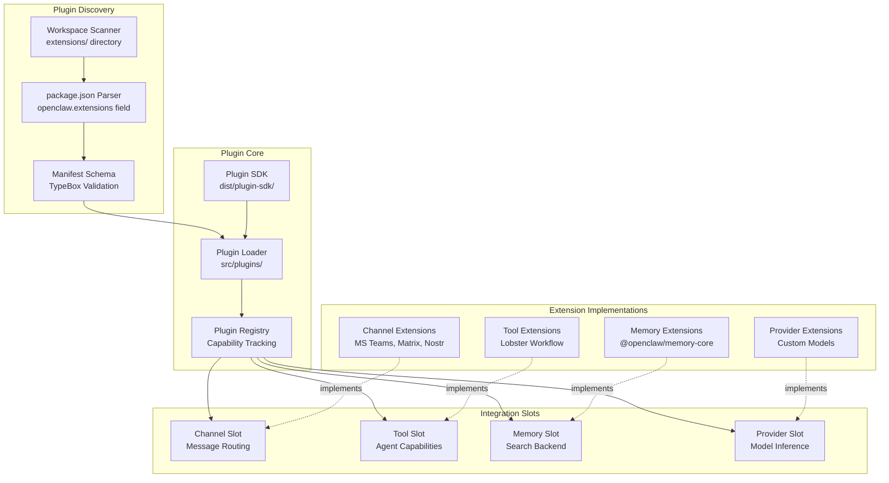
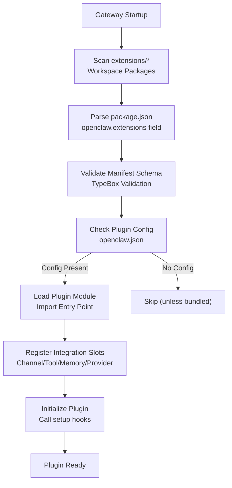
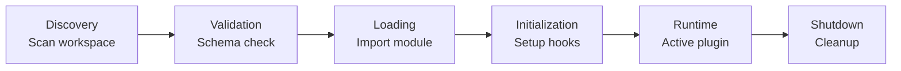

# Page: Extensions and Plugins

# Extensions and Plugins

<details>
<summary>Relevant source files</summary>

The following files were used as context for generating this wiki page:

- [extensions/copilot-proxy/package.json](extensions/copilot-proxy/package.json)
- [extensions/google-antigravity-auth/package.json](extensions/google-antigravity-auth/package.json)
- [extensions/google-gemini-cli-auth/package.json](extensions/google-gemini-cli-auth/package.json)
- [extensions/matrix/CHANGELOG.md](extensions/matrix/CHANGELOG.md)
- [extensions/matrix/package.json](extensions/matrix/package.json)
- [extensions/memory-lancedb/package.json](extensions/memory-lancedb/package.json)
- [extensions/msteams/CHANGELOG.md](extensions/msteams/CHANGELOG.md)
- [extensions/msteams/package.json](extensions/msteams/package.json)
- [extensions/voice-call/CHANGELOG.md](extensions/voice-call/CHANGELOG.md)
- [extensions/voice-call/package.json](extensions/voice-call/package.json)
- [extensions/zalo/CHANGELOG.md](extensions/zalo/CHANGELOG.md)
- [extensions/zalo/package.json](extensions/zalo/package.json)
- [extensions/zalouser/package.json](extensions/zalouser/package.json)
- [package.json](package.json)
- [pnpm-lock.yaml](pnpm-lock.yaml)

</details>


## Purpose and Scope

This document covers OpenClaw's plugin architecture, which provides extensibility through four primary integration types: **channels** (messaging platform integrations), **tools** (agent capabilities), **providers** (AI model inference), and **memory** (search backends). This page explains the plugin system's architecture, the manifest structure, built-in extensions, and how to create custom plugins.

For information about configuring individual channel integrations, see the Channel-specific documentation. For agent tool configuration, see [Tools and Skills](#6). For model provider setup, see [Model Selection and Failover](#5.4).

---

## Plugin System Architecture

The plugin system consists of four core components that work together to discover, validate, and integrate extensions into the Gateway.

### Architecture Diagram



**Sources**: [CHANGELOG.md:1-430](), Diagram 5 from high-level architecture overview

### Plugin Loader

The Plugin Loader scans the `extensions/` workspace directory and discovers extensions by reading their `package.json` manifest files. Extensions are identified by the `openclaw.extensions` field, which declares the plugin's entry point and metadata.

**Key responsibilities**:
- Scan workspace packages in `extensions/*` directory
- Parse and validate plugin manifests
- Initialize plugins with appropriate context
- Provide Plugin SDK to extensions for type safety

**Sources**: [CHANGELOG.md:395-408](), [pnpm-workspace.yaml:1-15]()

### Plugin Registry

The Plugin Registry maintains a catalog of loaded plugins and their capabilities. It maps plugins to their integration slots (channel, tool, memory, provider) and exposes them to the appropriate Gateway subsystems.

**Key responsibilities**:
- Track loaded plugin capabilities
- Route plugin hooks to Gateway components
- Manage plugin lifecycle (enable/disable)
- Coordinate slot assignments

**Sources**: [CHANGELOG.md:406-408](), Diagram 5 from high-level architecture overview

### Plugin SDK

The Plugin SDK (`dist/plugin-sdk/`) provides TypeScript types, validation utilities, and helper functions for plugin development. It is exported as a separate package entry point and can be imported by plugins via `openclaw/plugin-sdk`.

**Key exports**:
- TypeScript interfaces for plugin contracts
- Schema validation helpers (TypeBox)
- Gateway RPC method types
- Configuration utilities

**Sources**: [package.json:9-10](), [CHANGELOG.md:400-408]()

---

## Plugin Types and Integration Slots

OpenClaw defines four integration slot types. Each plugin implements one or more slots to extend specific Gateway capabilities.

### Integration Slot Overview

| Slot Type | Purpose | Examples |
|-----------|---------|----------|
| **Channel** | Messaging platform integrations | MS Teams, Matrix, Nostr, LINE, Tlon, Zalo |
| **Tool** | Agent capabilities and actions | Lobster workflow, LLM task |
| **Memory** | Search backend providers | @openclaw/memory-core, LanceDB |
| **Provider** | AI model inference | Custom model endpoints |

**Sources**: [CHANGELOG.md:395-408](), Diagram 5 from high-level architecture overview

### Channel Extensions

Channel extensions integrate messaging platforms with OpenClaw's message routing and auto-reply system. They implement platform-specific authentication, message sending/receiving, and media handling.

**Implementation requirements**:
- Message inbound handler
- Message outbound sender
- Authentication flow
- Media upload/download
- Optional: native commands, reactions, threading

**Built-in channel extensions**:
- `extensions/msteams` - Microsoft Teams (Bot Framework + Graph API)
- `extensions/matrix` - Matrix protocol (matrix-bot-sdk, E2EE support)
- `extensions/nostr` - Nostr protocol (nostr-tools)
- `extensions/line` - LINE Messaging API
- `extensions/tlon` - Tlon/Urbit (http-api)
- `extensions/zalo` - Zalo messaging
- `extensions/bluebubbles` - BlueBubbles (iMessage relay)

**Sources**: [CHANGELOG.md:147-154](), [CHANGELOG.md:389-404](), [README.md:19-23](), [extensions/memory-core/package.json:1-17]()

### Tool Extensions

Tool extensions add new capabilities that agents can invoke during execution. These appear in the agent's tool registry and can be allowlisted/denylisted like built-in tools.

**Implementation requirements**:
- Tool schema definition (parameters, description)
- Execution handler
- Optional: approval requirements, security policies

**Built-in tool extensions**:
- `extensions/lobster` - Typed workflow tool with approval gates
- `extensions/llm-task` - JSON-only task execution

**Sources**: [CHANGELOG.md:232-233](), [CHANGELOG.md:405-406]()

### Memory Extensions

Memory extensions provide alternative search backends for the memory system. They implement indexing, embedding generation, and hybrid search.

**Implementation requirements**:
- Indexing API (add/update/remove documents)
- Search API (vector + keyword hybrid)
- Embedding generation
- Storage backend

**Built-in memory extensions**:
- `extensions/memory-core` - Core SQLite + FTS5 + vector search
- `extensions/memory-lancedb` - LanceDB backend (optional)

**Sources**: [CHANGELOG.md:379-385](), [extensions/memory-core/package.json:1-17]()

### Provider Extensions

Provider extensions add support for custom AI model endpoints that aren't built into pi-ai. They implement the streaming inference protocol and handle provider-specific authentication.

**Implementation requirements**:
- Model catalog declaration
- Streaming inference handler
- Authentication flow
- Optional: usage tracking, rate limiting

**Sources**: [CHANGELOG.md:400-408](), Diagram 5 from high-level architecture overview

---

## Plugin Manifest System

Plugins declare themselves via the `openclaw.extensions` field in their `package.json`. The manifest specifies entry points, configuration schemas, and capability metadata.

### Manifest Structure Example

```json
{
  "name": "@openclaw/memory-core",
  "version": "2026.1.27-beta.1",
  "type": "module",
  "openclaw": {
    "extensions": [
      "./index.ts"
    ]
  },
  "peerDependencies": {
    "openclaw": ">=2026.1.26"
  }
}
```

**Sources**: [extensions/memory-core/package.json:1-17]()

### Manifest Fields

| Field | Type | Required | Description |
|-------|------|----------|-------------|
| `openclaw.extensions` | `string[]` | Yes | Array of entry point file paths |
| `openclaw.configSchema` | `object` | No | TypeBox schema for plugin config |
| `openclaw.slots` | `string[]` | No | Integration slot types (channel, tool, memory, provider) |
| `openclaw.catalog` | `object` | No | Channel/tool/provider catalog metadata |

**Validation**: All manifests undergo schema validation during plugin loading. Invalid manifests trigger warnings and prevent plugin initialization.

**Sources**: [CHANGELOG.md:395-397](), [extensions/memory-core/package.json:1-17]()

### Configuration Schema

Plugins can declare a TypeBox schema for their configuration section. This enables type-safe config validation and IDE autocomplete for plugin settings in `openclaw.json`.

**Example schema declaration**:
```typescript
export const configSchema = Type.Object({
  enabled: Type.Boolean({ default: true }),
  apiKey: Type.Optional(Type.String()),
  endpoint: Type.Optional(Type.String())
});
```

The Gateway validates plugin configuration against the declared schema before initialization. Missing required fields or type mismatches trigger config errors.

**Sources**: [CHANGELOG.md:395-397]()

---

## Plugin Discovery and Loading

The plugin system automatically discovers extensions in the workspace and loads them based on configuration presence.

### Discovery Flow



**Sources**: [CHANGELOG.md:395-408]()

### Auto-Enabling Behavior

**Bundled plugins** (channel and provider extensions in `extensions/`) are automatically enabled when their configuration section is present in `openclaw.json`. For example, if `channels.matrix` exists in the config, the Matrix plugin loads automatically.

**Custom plugins** (installed via npm) must be explicitly enabled by adding them to the plugin allowlist or by having their configuration present.

**Sources**: [CHANGELOG.md:406-407]()

### Plugin Synchronization

The Gateway synchronizes plugin sources during specific operations:

- **Channel switches** trigger plugin source sync
- `openclaw update` updates npm-installed plugins
- `openclaw plugins update` manually updates all plugins

**Sources**: [CHANGELOG.md:407-408]()

---

## Built-in Extensions Catalog

OpenClaw ships with 20+ bundled extensions covering messaging platforms, workflows, and advanced features.

### Messaging Platform Extensions

| Extension | Platform | Key Features | Package |
|-----------|----------|--------------|---------|
| MS Teams | Microsoft Teams | Bot Framework, Graph API, adaptive cards, file uploads | `extensions/msteams` |
| Matrix | Matrix protocol | E2EE (matrix-sdk-crypto), DMs, groups, media | `extensions/matrix` |
| Nostr | Nostr | Profile management, DMs, group mentions | `extensions/nostr` |
| LINE | LINE Messaging | Rich replies, quick replies, media | `extensions/line` |
| Tlon | Urbit/Tlon | DMs, group mentions, thread replies | `extensions/tlon` |
| Zalo | Zalo | Messaging platform integration | `extensions/zalo` |
| BlueBubbles | iMessage (relay) | iMessage via BlueBubbles server | `extensions/bluebubbles` |
| Voice Call | Twilio | Voice conversation automation | `extensions/voice-call` |

**Sources**: [CHANGELOG.md:147-154](), [CHANGELOG.md:223-224](), [CHANGELOG.md:389-394](), [README.md:19-23]()

### Tool Extensions

| Extension | Purpose | Key Features | Package |
|-----------|---------|--------------|---------|
| Lobster | Workflow automation | Typed workflows, approval gates, file args | `extensions/lobster` |
| LLM Task | Structured output | JSON-only task execution | `extensions/llm-task` |

**Sources**: [CHANGELOG.md:232-233](), [CHANGELOG.md:321-322]()

### Memory Extensions

| Extension | Backend | Key Features | Package |
|-----------|---------|--------------|---------|
| Memory Core | SQLite + FTS5 | Hybrid BM25 + vector search, embedding cache, OpenAI batch indexing | `extensions/memory-core` |
| LanceDB | LanceDB | Alternative vector store backend | `extensions/memory-lancedb` |

**Sources**: [CHANGELOG.md:379-385](), [extensions/memory-core/package.json:1-17]()

### Additional Extensions

Additional bundled extensions include:

- `extensions/diagnostics-otel` - OpenTelemetry observability
- `extensions/google-antigravity-auth` - Antigravity OAuth
- `extensions/google-gemini-cli-auth` - Gemini CLI authentication
- `extensions/copilot-proxy` - GitHub Copilot proxy
- `extensions/open-prose` - Prose output formatting
- `extensions/mattermost` - Mattermost integration
- `extensions/nextcloud-talk` - Nextcloud Talk
- `extensions/twitch` - Twitch chat integration

**Sources**: [pnpm-lock.yaml:265-458]()

---

## Creating Custom Plugins

Custom plugins can be developed as separate npm packages or workspace extensions. They must follow the plugin manifest structure and implement the appropriate slot interfaces.

### Basic Plugin Structure

```
my-plugin/
├── package.json           # Manifest with openclaw.extensions
├── index.ts              # Entry point
├── config-schema.ts      # Configuration schema (optional)
└── implementation.ts     # Slot implementation
```

### Minimal Channel Plugin Example

**package.json**:
```json
{
  "name": "@my-org/openclaw-custom-channel",
  "version": "1.0.0",
  "type": "module",
  "openclaw": {
    "extensions": ["./index.ts"],
    "slots": ["channel"]
  },
  "peerDependencies": {
    "openclaw": ">=2026.1.26"
  }
}
```

**index.ts**:
```typescript
import type { ChannelPlugin } from "openclaw/plugin-sdk";

export const plugin: ChannelPlugin = {
  id: "custom-channel",
  name: "Custom Channel",
  
  async init(context) {
    // Setup channel connection
  },
  
  async sendMessage(target, text, options) {
    // Send message to platform
  },
  
  async onInbound(handler) {
    // Register inbound message handler
  }
};
```

**Sources**: [extensions/memory-core/package.json:1-17](), [CHANGELOG.md:405-408]()

### Development Workflow

1. **Create plugin package**: Initialize a new package in `extensions/` or as standalone npm package
2. **Define manifest**: Add `openclaw.extensions` field to `package.json`
3. **Implement slot interface**: Use Plugin SDK types for type safety
4. **Add configuration schema**: Define TypeBox schema for config validation (optional)
5. **Test plugin**: Add to workspace and configure in `openclaw.json`
6. **Publish**: Publish to npm or use as workspace-local plugin

**Sources**: [CHANGELOG.md:405-408](), [pnpm-workspace.yaml:1-15]()

### Plugin SDK Usage

The Plugin SDK provides TypeScript types and utilities for plugin development:

```typescript
import type {
  ChannelPlugin,
  ToolPlugin,
  MemoryPlugin,
  ProviderPlugin
} from "openclaw/plugin-sdk";

import { validateConfig } from "openclaw/plugin-sdk";
```

**Key SDK exports**:
- Plugin interface types (ChannelPlugin, ToolPlugin, etc.)
- Configuration validation helpers
- Gateway RPC method types
- Shared utility functions

**Sources**: [package.json:9-10](), [CHANGELOG.md:400-408]()

### Best Practices

1. **Use peer dependencies**: Specify `openclaw` as a peer dependency to avoid version conflicts
2. **Validate configuration**: Provide TypeBox schema for config validation
3. **Handle errors gracefully**: Don't crash the Gateway on plugin errors
4. **Document requirements**: List external dependencies (API keys, services) in README
5. **Follow naming conventions**: Use `@org/openclaw-*` naming pattern for published plugins
6. **Test with Gateway**: Test plugin loading and execution within full Gateway context

**Sources**: [extensions/memory-core/package.json:1-17](), [CHANGELOG.md:395-408]()

---

## Plugin Configuration Integration

Plugin configuration integrates with the main `openclaw.json` config file. Each plugin can define its own configuration section, and the Gateway validates it against the plugin's declared schema.

### Configuration Example

```json5
{
  // Core Gateway config
  gateway: {
    port: 18789
  },
  
  // Built-in channel configs (auto-enable plugins)
  channels: {
    matrix: {
      homeserverUrl: "https://matrix.org",
      accessToken: "...",
      userId: "@bot:matrix.org"
    }
  },
  
  // Custom plugin config sections
  plugins: {
    "my-custom-plugin": {
      enabled: true,
      apiKey: "...",
      endpoint: "https://api.example.com"
    }
  }
}
```

**Auto-enabling**: Bundled plugins (channels, providers) automatically enable when their config section exists. Custom plugins require explicit configuration in the `plugins` section.

**Sources**: [CHANGELOG.md:406-408]()

---

## Plugin Lifecycle Management

The Gateway manages plugin lifecycle through several phases: discovery, validation, loading, initialization, and runtime.

### Lifecycle Phases



**Discovery**: Workspace packages in `extensions/*` are scanned for `openclaw.extensions` manifest field

**Validation**: Manifest schema is validated, config is checked against plugin's declared schema

**Loading**: Plugin module is imported, SDK is provided to plugin context

**Initialization**: Plugin setup hooks are called, integration slots are registered

**Runtime**: Plugin is active and integrated with Gateway subsystems

**Shutdown**: Plugin cleanup hooks are called on Gateway shutdown

**Sources**: [CHANGELOG.md:395-408](), [pnpm-workspace.yaml:1-15]()

---

## Plugin Update and Maintenance

Plugins can be updated independently of the main OpenClaw installation. The update strategy depends on whether the plugin is bundled or external.

### Bundled Plugin Updates

Bundled plugins (in `extensions/`) are updated with the main OpenClaw release:

```bash
openclaw update
```

**Sources**: [CHANGELOG.md:407-408]()

### External Plugin Updates

External plugins (installed via npm) can be updated separately:

```bash
openclaw plugins update
```

This command updates all npm-installed plugins to their latest compatible versions.

**Sources**: [CHANGELOG.md:407-408]()

### Workspace Plugin Development

During development, workspace plugins in `extensions/` are automatically synced:

```bash
pnpm install  # Syncs workspace dependencies
pnpm build    # Rebuilds all workspace packages
```

**Sources**: [pnpm-workspace.yaml:1-15]()

---