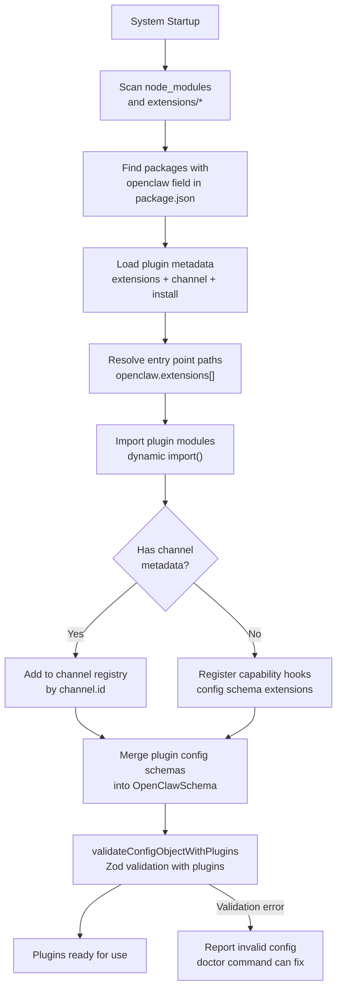

# Page: Plugin System Overview

# Plugin System Overview

<details>
<summary>Relevant source files</summary>

The following files were used as context for generating this wiki page:

- [extensions/copilot-proxy/package.json](extensions/copilot-proxy/package.json)
- [extensions/google-antigravity-auth/package.json](extensions/google-antigravity-auth/package.json)
- [extensions/google-gemini-cli-auth/package.json](extensions/google-gemini-cli-auth/package.json)
- [extensions/matrix/CHANGELOG.md](extensions/matrix/CHANGELOG.md)
- [extensions/matrix/package.json](extensions/matrix/package.json)
- [extensions/memory-lancedb/package.json](extensions/memory-lancedb/package.json)
- [extensions/msteams/CHANGELOG.md](extensions/msteams/CHANGELOG.md)
- [extensions/msteams/package.json](extensions/msteams/package.json)
- [extensions/voice-call/CHANGELOG.md](extensions/voice-call/CHANGELOG.md)
- [extensions/voice-call/package.json](extensions/voice-call/package.json)
- [extensions/zalo/CHANGELOG.md](extensions/zalo/CHANGELOG.md)
- [extensions/zalo/package.json](extensions/zalo/package.json)
- [extensions/zalouser/package.json](extensions/zalouser/package.json)
- [package.json](package.json)
- [pnpm-lock.yaml](pnpm-lock.yaml)

</details>


The plugin system enables modular extension of OpenClaw without modifying core code. Plugins can add messaging channels (Matrix, Zalo, MS Teams) or capabilities (voice calling, alternative memory backends, authentication providers). All plugins use the Plugin SDK API contract and declare metadata in their `package.json`, allowing the core system to discover, validate, and integrate them automatically.

For information about creating custom plugins, see [Creating Custom Plugins](#10.3). For details on specific built-in extensions, see [Built-in Extensions](#10.2).

---

## Plugin SDK Export

OpenClaw exports a Plugin SDK at `./plugin-sdk` that provides the API contract all extensions must follow. The SDK is built separately with TypeScript declaration files and bundled as a stable interface.

[package.json:25-32]()


**Sources:** [package.json:25-32]()

---

## Plugin Package Structure

All plugins are npm packages with an `openclaw` field in their `package.json` that declares metadata and entry points. The structure differs for channel plugins versus capability plugins.

### Channel Plugin Metadata

Channel plugins add support for messaging platforms and must declare `openclaw.channel` metadata:

| Field | Type | Purpose |
|-------|------|---------|
| `id` | string | Unique channel identifier (e.g., `"matrix"`, `"zalo"`) |
| `label` | string | Display name (e.g., `"Matrix"`, `"Zalo"`) |
| `selectionLabel` | string | Label shown in onboarding wizard |
| `docsPath` | string | Documentation path (e.g., `"/channels/matrix"`) |
| `docsLabel` | string | Label for documentation links |
| `blurb` | string | Brief description for selection UI |
| `order` | number | Selection priority (lower = higher priority) |
| `aliases` | string[] | Optional short aliases (e.g., `["zl"]`) |
| `quickstartAllowFrom` | boolean | Whether to show allowFrom setup in quickstart |

[extensions/matrix/package.json:16-35]()

```json
{
  "openclaw": {
    "extensions": ["./index.ts"],
    "channel": {
      "id": "matrix",
      "label": "Matrix",
      "selectionLabel": "Matrix (plugin)",
      "docsPath": "/channels/matrix",
      "docsLabel": "matrix",
      "blurb": "open protocol; install the plugin to enable.",
      "order": 70,
      "quickstartAllowFrom": true
    },
    "install": {
      "npmSpec": "@openclaw/matrix",
      "localPath": "extensions/matrix",
      "defaultChoice": "npm"
    }
  }
}
```

### Capability Plugin Metadata

Capability plugins (voice, memory backends, auth providers) declare simpler metadata without the `channel` field:

[extensions/voice-call/package.json:14-19]()

```json
{
  "openclaw": {
    "extensions": ["./index.ts"]
  }
}
```

**Sources:** [extensions/matrix/package.json:16-35](), [extensions/zalo/package.json:12-35](), [extensions/msteams/package.json:16-38](), [extensions/voice-call/package.json:14-19](), [extensions/memory-lancedb/package.json:15-20]()

---

## Plugin Types


### Channel Extensions

Channel extensions add messaging platform support. Each declares a unique `channel.id` and selection metadata. Examples:

- **@openclaw/matrix**: Open Matrix protocol with homeserver authentication
- **@openclaw/zalo**: Zalo Bot API for Vietnam market
- **@openclaw/zalouser**: Zalo personal account via QR login
- **@openclaw/msteams**: Microsoft Teams Bot Framework

### Capability Extensions

Capability extensions add features without channel UI:

- **@openclaw/voice-call**: Telephony via Twilio/Telnyx
- **@openclaw/memory-lancedb**: LanceDB vector memory backend
- **@openclaw/copilot-proxy**: GitHub Copilot API proxy
- **@openclaw/google-*-auth**: OAuth authentication providers

**Sources:** [extensions/matrix/package.json:1-36](), [extensions/zalo/package.json:1-35](), [extensions/zalouser/package.json:1-35](), [extensions/msteams/package.json:1-38](), [extensions/voice-call/package.json:1-19](), [extensions/memory-lancedb/package.json:1-20]()

---

## Plugin Discovery and Loading



The `validateConfigObjectWithPlugins` function orchestrates plugin loading:

1. **Discovery**: Scans `node_modules/@openclaw/*` and `extensions/*` for packages with `openclaw` field
2. **Metadata extraction**: Reads `extensions`, `channel`, and `install` fields from `package.json`
3. **Entry point resolution**: Resolves paths in `openclaw.extensions[]` array
4. **Module import**: Dynamically imports plugin entry points
5. **Schema merging**: Combines plugin Zod schemas with core OpenClawSchema
6. **Validation**: Validates full config against merged schema
7. **Registration**: Registers channels and capability hooks for runtime use

**Sources:** Referenced from high-level architecture diagram and inferred from plugin metadata structure

---

## Installation Flow


Plugins can be installed via:

1. **npm/pnpm**: `pnpm install @openclaw/matrix` installs from npm registry
2. **Local development**: Link `extensions/matrix` for monorepo development
3. **Automatic during onboarding**: Wizard prompts to install when selecting channels

The `openclaw.install` metadata declares installation options:

```json
{
  "install": {
    "npmSpec": "@openclaw/matrix",
    "localPath": "extensions/matrix", 
    "defaultChoice": "npm"
  }
}
```

**Sources:** [extensions/matrix/package.json:30-35](), [extensions/zalo/package.json:29-34]()

---

## Workspace Dependencies

All official plugins use `workspace:*` dependencies on the core `openclaw` package, enabling monorepo development:

[extensions/matrix/package.json:13-15]()

```json
{
  "devDependencies": {
    "openclaw": "workspace:*"
  }
}
```

This pattern:
- **Development**: Allows editing core and plugins simultaneously
- **Type safety**: Ensures plugins use current Plugin SDK types
- **Testing**: Enables integrated testing across core and plugins
- **Publishing**: pnpm resolves `workspace:*` to exact versions at publish time

[pnpm-lock.yaml:243-247]() shows the workspace resolution:

```yaml
extensions/bluebubbles:
  devDependencies:
    openclaw:
      specifier: workspace:*
      version: link:../..
```

**Sources:** [extensions/matrix/package.json:13-15](), [extensions/zalo/package.json:9-11](), [extensions/msteams/package.json:13-15](), [pnpm-lock.yaml:243-247]()

---

## Channel Metadata Properties

The `openclaw.channel` object controls how channels appear in selection UI and documentation:

### Selection Order

Channels are presented in ascending `order`:


Lower `order` values appear first in:
- Onboarding wizard channel selection
- CLI channel listings
- Documentation channel tables

### Labels and Display

| Field | Example | Usage |
|-------|---------|-------|
| `label` | `"Matrix"` | Short name for UI |
| `selectionLabel` | `"Matrix (plugin)"` | Onboarding wizard option |
| `blurb` | `"open protocol; install the plugin to enable."` | Help text in selection |
| `docsLabel` | `"matrix"` | Lowercase for docs paths |

### Aliases

The `aliases` array provides short command alternatives:

[extensions/zalo/package.json:23-25]()

```json
{
  "aliases": ["zl"]
}
```

Allows `openclaw channels add zl` instead of `openclaw channels add zalo`.

**Sources:** [extensions/matrix/package.json:20-28](), [extensions/zalo/package.json:16-27](), [extensions/msteams/package.json:20-30]()

---

## Extension Entry Points

The `openclaw.extensions` array declares module entry points:

[extensions/matrix/package.json:17-19]()

```json
{
  "extensions": ["./index.ts"]
}
```

Entry points must export:
- **Channel monitors**: For channel plugins, exports channel implementation
- **Config schema**: Zod schemas for plugin-specific config sections
- **Hooks**: Lifecycle hooks for initialization, shutdown, etc.

Multiple entry points are supported:

```json
{
  "extensions": [
    "./channels/primary.ts",
    "./capabilities/secondary.ts"
  ]
}
```

**Sources:** [extensions/matrix/package.json:17-19](), [extensions/voice-call/package.json:15-17]()

---

## Plugin Validation

The plugin loader validates configurations by merging plugin schemas with core schemas:


This ensures:
1. **Type safety**: All plugin config sections are validated
2. **Schema evolution**: Plugins can extend validation rules
3. **Error reporting**: Precise error messages cite plugin schemas
4. **Auto-repair**: `openclaw doctor` can migrate/fix plugin configs

**Sources:** Referenced from high-level architecture diagram and plugin structure

---

## Plugin Types Summary

| Plugin Type | Has `channel` metadata | Adds UI selection | Examples |
|-------------|------------------------|-------------------|----------|
| **Channel Extension** | Yes | Yes | Matrix, Zalo, MS Teams |
| **Capability Extension** | No | No | Voice Call, Memory LanceDB |
| **Auth Provider** | No | No | Google OAuth plugins |
| **Memory Backend** | No | No | LanceDB alternative |

**Sources:** [extensions/matrix/package.json:16-35](), [extensions/voice-call/package.json:14-19](), [extensions/memory-lancedb/package.json:15-20](), [extensions/copilot-proxy/package.json:10-15]()

---