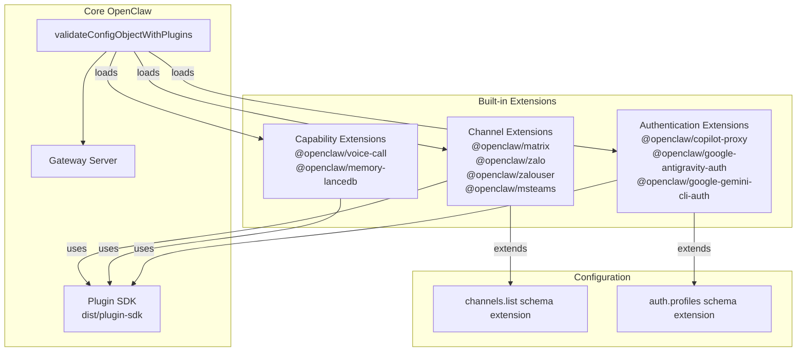
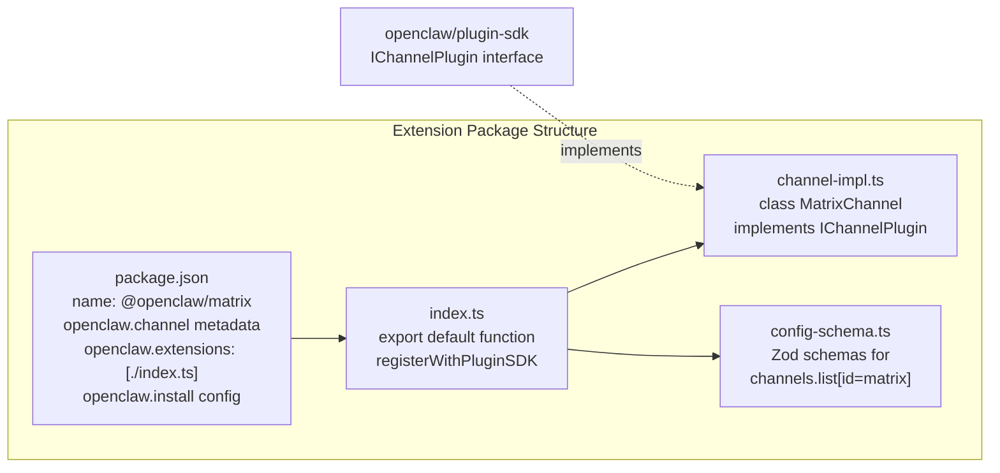
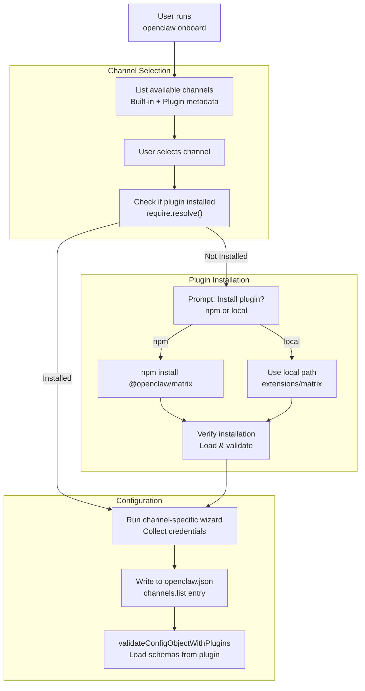
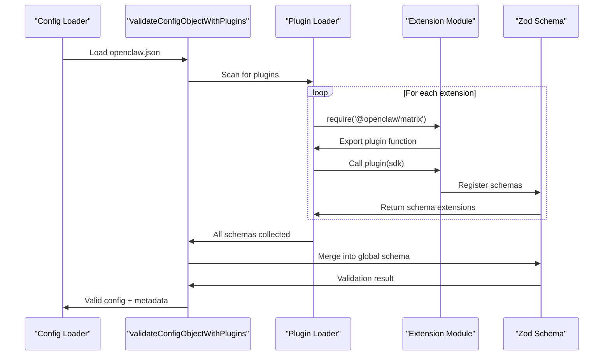

# Page: Built-in Extensions

# Built-in Extensions

<details>
<summary>Relevant source files</summary>

The following files were used as context for generating this wiki page:

- [extensions/copilot-proxy/package.json](extensions/copilot-proxy/package.json)
- [extensions/google-antigravity-auth/package.json](extensions/google-antigravity-auth/package.json)
- [extensions/google-gemini-cli-auth/package.json](extensions/google-gemini-cli-auth/package.json)
- [extensions/matrix/CHANGELOG.md](extensions/matrix/CHANGELOG.md)
- [extensions/matrix/package.json](extensions/matrix/package.json)
- [extensions/memory-lancedb/package.json](extensions/memory-lancedb/package.json)
- [extensions/msteams/CHANGELOG.md](extensions/msteams/CHANGELOG.md)
- [extensions/msteams/package.json](extensions/msteams/package.json)
- [extensions/voice-call/CHANGELOG.md](extensions/voice-call/CHANGELOG.md)
- [extensions/voice-call/package.json](extensions/voice-call/package.json)
- [extensions/zalo/CHANGELOG.md](extensions/zalo/CHANGELOG.md)
- [extensions/zalo/package.json](extensions/zalo/package.json)
- [extensions/zalouser/package.json](extensions/zalouser/package.json)
- [package.json](package.json)
- [pnpm-lock.yaml](pnpm-lock.yaml)

</details>


This page documents the official extensions distributed with OpenClaw that add channel integrations and extended capabilities beyond the core built-in channels. These extensions are published as separate npm packages under the `@openclaw/` namespace and can be installed via npm or used from the local monorepo during development.

For information about the plugin system architecture, SDK, and how extensions are loaded, see [Plugin System Overview](#10.1). For guidance on creating your own custom plugins, see [Creating Custom Plugins](#10.3).

---

## Extension Categories

OpenClaw extensions fall into three functional categories:

| Category | Purpose | Examples |
|----------|---------|----------|
| **Channel Extensions** | Add messaging platform integrations | Matrix, Zalo, MS Teams, Zalo Personal |
| **Capability Extensions** | Extend system functionality | Voice Call, Memory LanceDB |
| **Authentication Extensions** | Provide OAuth or auth flows for AI providers | Google Antigravity Auth, Gemini CLI Auth, Copilot Proxy |

**Extension Taxonomy**



Sources: [package.json:1-217](), [extensions/matrix/package.json:1-37](), [extensions/zalo/package.json:1-36](), [extensions/msteams/package.json:1-39](), [extensions/voice-call/package.json:1-20]()

---

## Channel Extensions

Channel extensions add support for messaging platforms not included in OpenClaw's core. They integrate into the channel routing system and appear in the onboarding wizard alongside built-in channels.

### Extension Metadata Structure

Channel extensions declare metadata in their `package.json` using the `openclaw.channel` field:

| Field | Type | Description |
|-------|------|-------------|
| `id` | string | Unique channel identifier (e.g., `"matrix"`) |
| `label` | string | Display name shown in UIs |
| `selectionLabel` | string | Label shown in onboarding channel selection |
| `docsPath` | string | Path to documentation page |
| `docsLabel` | string | Label for documentation links |
| `blurb` | string | Short description shown in wizard |
| `aliases` | string[] | Alternative short names for CLI commands |
| `order` | number | Sort order in selection lists (higher = later) |
| `quickstartAllowFrom` | boolean | Whether to show allowFrom setup in quickstart |

**Channel Extension Package Structure**



Sources: [extensions/matrix/package.json:16-35](), [extensions/zalo/package.json:12-35](), [extensions/msteams/package.json:16-38]()

### Matrix

**Package:** `@openclaw/matrix`  
**Channel ID:** `matrix`  
**Selection Order:** 70

Matrix is an open-source federated messaging protocol. The extension supports homeserver connections with access token or password authentication.

**Features:**
- Direct message support with pairing/allowlist/open/disabled policies
- Group/room support with per-room configuration overrides
- Thread handling with configurable reply modes (`off`/`inbound`/`always`)
- Text message chunking (Matrix message size limits)
- Media upload/download with size caps
- Reactions (add, remove, list)
- Message editing and deletion
- Typing indicators
- Polls (creation, voting)
- Room actions: pin/unpin messages, member info, room info
- Auto-join invites with allowlist support

**Configuration Requirements:**
```typescript
{
  channels: {
    list: [
      {
        id: "matrix",
        homeserver: "https://matrix.org",
        userId: "@bot:matrix.org",
        // Either:
        accessToken: "syt_...",
        // Or:
        password: "...",
        deviceName: "OpenClaw Bot"
      }
    ]
  }
}
```

**Dependencies:**
- `@vector-im/matrix-bot-sdk`: Matrix client library
- `@matrix-org/matrix-sdk-crypto-nodejs`: E2E encryption support
- `markdown-it`: Markdown formatting
- `music-metadata`: Audio file metadata extraction

Sources: [extensions/matrix/package.json:1-37](), [extensions/matrix/CHANGELOG.md:101-112]()

### Zalo (Bot API)

**Package:** `@openclaw/zalo`  
**Channel ID:** `zalo`  
**Aliases:** `zl`  
**Selection Order:** 80

Zalo is a Vietnam-focused messaging platform. This extension uses the Zalo Bot API for official business bot accounts.

**Features:**
- Direct message support only (DMs)
- Security policies: pairing, allowlist, open, disabled
- Polling and webhook delivery modes
- Text messaging with 2000-character chunking
- Image uploads with size caps
- Multi-account support (multiple bot accounts)

**Configuration Requirements:**
```typescript
{
  channels: {
    list: [
      {
        id: "zalo",
        appId: "...",
        accessToken: "...", // or from env/file
        // Optional:
        deliveryMode: "polling", // or "webhook"
        pollingInterval: 3000
      }
    ]
  }
}
```

**Token Sources:**
The extension searches for tokens in this priority order:
1. `accessToken` field in config
2. `ZALO_ACCESS_TOKEN` environment variable
3. `~/.openclaw/.zalo-token` file

Sources: [extensions/zalo/package.json:1-36](), [extensions/zalo/CHANGELOG.md:106-113]()

### Zalo Personal

**Package:** `@openclaw/zalouser`  
**Channel ID:** `zalouser`  
**Aliases:** `zlu`  
**Selection Order:** 85

Zalo Personal Account extension uses QR code authentication to connect a personal Zalo account via the `zca-cli` tool.

**Features:**
- Personal account login via QR code
- Similar DM policies to Zalo Bot API
- Direct message support

**Prerequisites:**
Requires `zca-cli` to be installed separately (not bundled).

**Configuration Requirements:**
```typescript
{
  channels: {
    list: [
      {
        id: "zalouser",
        // QR authentication flow during login
      }
    ]
  }
}
```

Sources: [extensions/zalouser/package.json:1-36]()

### Microsoft Teams

**Package:** `@openclaw/msteams`  
**Channel ID:** `msteams`  
**Aliases:** `teams`  
**Selection Order:** 60

Microsoft Teams integration using the Azure Bot Framework. Supports enterprise Teams deployments with full webhook infrastructure.

**Features:**
- Direct messages, group chats, channels, and threads
- Bot Framework gateway with Express server and JWT authentication
- Configurable webhook path/port with `/api/messages` fallback
- DM pairing/allowlist enforcement
- Group policies with per-team/channel overrides
- Mention gating for group messages
- Inbound debounce with history context
- Proactive messaging via stored conversation references (file store with TTL/size pruning)
- Markdown text chunking (4k character limit)
- Media handling: split/inline media, attachment placeholders, HTML summaries
- Adaptive Card polls: build cards, parse votes, persist poll state
- Media downloads with host allowlist and auth scope fallback
- Graph API integration for `hostedContents` and `attachments`
- Retry/backoff on transient/throttled sends with error classification

**Configuration Requirements:**
```typescript
{
  channels: {
    list: [
      {
        id: "msteams",
        appId: "...",          // Azure Bot app ID
        appPassword: "...",    // Azure Bot app password
        // Optional webhook config:
        webhookPath: "/api/messages",
        webhookPort: 3978
      }
    ]
  }
}
```

**Azure Bot Setup:**
1. Create Azure Bot in Azure Portal
2. Configure messaging endpoint to point to OpenClaw webhook
3. Grant necessary Graph API permissions for media access

Sources: [extensions/msteams/package.json:1-39](), [extensions/msteams/CHANGELOG.md:94-108]()

---

## Capability Extensions

Capability extensions add new functionality to OpenClaw that isn't tied to a specific messaging channel.

### Voice Call

**Package:** `@openclaw/voice-call`  
**Private:** No

The Voice Call extension enables phone-based interactions with agents using telephony providers and real-time speech processing.

**Providers Supported:**
- **Twilio:** Programmable Voice + Media Streams
- **Telnyx:** Call Control v2
- **Mock Provider:** Local development/testing

**Features:**

**Call Flows:**
- Outbound notify mode (one-way announcements)
- Outbound conversation mode (multi-turn dialogues)
- Inbound handling with policy controls (disabled/allowlist/open)
- Configurable auto-hangup timeouts
- Multi-turn continuation

**Speech Processing:**
- OpenAI Realtime API for streaming STT over media WebSocket
- Partial and final transcript handling
- OpenAI TTS (model/voice/instructions configurable)
- Twilio `<Say>` fallback for basic TTS
- ElevenLabs TTS support
- Edge TTS ignored for telephony (loopback only)

**Infrastructure:**
- Built-in webhook server with configurable bind/port/path
- `publicUrl` override for custom reverse proxies
- Exposure helpers: ngrok and Tailscale serve/funnel
- Dev-only signature bypass for ngrok free tier (loopback only)

**Tooling:**
- `voice_call` tool with actions: `initiate`, `continue`, `speak`, `end`, `status`
- Gateway RPC methods: `voicecall.initiate|continue|speak|end|status`
- CLI commands: `openclaw voicecall call/start/continue/speak/end/status/tail/expose`

**Observability:**
- JSONL call logs for each call
- `voicecall tail` command for live inspection
- Status reporting for active calls

**Response Controls:**
```typescript
{
  voiceCall: {
    provider: "twilio", // or "telnyx" or "mock"
    twilio: {
      accountSid: "...",
      authToken: "...",
      phoneNumber: "+1234567890"
    },
    webhook: {
      bind: "0.0.0.0",
      port: 5050,
      path: "/voice"
    },
    inbound: {
      policy: "allowlist", // or "open" or "disabled"
      allowFrom: ["+1234567890"],
      greeting: "Hello, this is OpenClaw."
    },
    responseModel: "gpt-4o",
    responseSystemPrompt: "You are a helpful voice assistant.",
    responseTimeoutMs: 30000
  }
}
```

**TTS Configuration:**
Voice Call TTS now uses the core `messages.tts` configuration. Plugin-specific TTS config deep-merges with core config. OpenAI and ElevenLabs are supported for telephony; Edge TTS is ignored for calls.

Sources: [extensions/voice-call/package.json:1-20](), [extensions/voice-call/CHANGELOG.md:114-133]()

### Memory LanceDB

**Package:** `@openclaw/memory-lancedb`  
**Private:** Yes (internal extension)

An alternative memory backend using LanceDB instead of the built-in SQLite-based memory system. Provides vector database capabilities with auto-recall and capture features.

**Features:**
- LanceDB vector database storage
- Auto-recall: automatically search and inject relevant memories into context
- Auto-capture: automatically extract and store important information from conversations
- OpenAI embeddings integration

**Dependencies:**
- `@lancedb/lancedb`: Vector database library
- `openai`: Embeddings API client

**Note:** This extension is marked private and is primarily for internal experimentation with alternative memory backends. The core memory system (page [7](#7)) uses SQLite with sqlite-vec for most deployments.

Sources: [extensions/memory-lancedb/package.json:1-20]()

---

## Authentication Extensions

Authentication extensions provide OAuth flows and authentication mechanisms for AI model providers that require complex authentication beyond simple API keys.

### Copilot Proxy

**Package:** `@openclaw/copilot-proxy`  
**Private:** Yes

Enables using GitHub Copilot API access as an AI provider backend. Proxies requests through Copilot's authentication layer.

**Use Case:** Allows developers with GitHub Copilot subscriptions to use Copilot models for agent interactions.

Sources: [extensions/copilot-proxy/package.json:1-16]()

### Google Antigravity Auth

**Package:** `@openclaw/google-antigravity-auth`  
**Private:** Yes

Provides OAuth authentication flow for Google's Antigravity AI platform.

**Purpose:** Handles OAuth token acquisition and refresh for accessing Google Antigravity models.

Sources: [extensions/google-antigravity-auth/package.json:1-16]()

### Google Gemini CLI Auth

**Package:** `@openclaw/google-gemini-cli-auth`  
**Private:** Yes

Provides CLI-based OAuth authentication for Google Gemini API access.

**Purpose:** Enables interactive OAuth flow for Gemini models when API keys are not available or preferred.

Sources: [extensions/google-gemini-cli-auth/package.json:1-16]()

---

## Installation and Discovery

**Installation Flow**



Sources: [extensions/matrix/package.json:29-35](), [extensions/zalo/package.json:28-34]()

### Installation Methods

**1. NPM Installation (Production)**

Extensions are published to npm and can be installed like regular packages:

```bash
npm install @openclaw/matrix
# or
pnpm add @openclaw/matrix
```

The `openclaw.install.npmSpec` field in each extension's `package.json` specifies the npm package name.

**2. Local Development (Monorepo)**

During development, extensions can be used from the monorepo:

```bash
# Extensions already linked via workspace:* dependencies
pnpm install
```

The `openclaw.install.localPath` field specifies the relative path within the monorepo (e.g., `extensions/matrix`).

**3. Onboarding Wizard Auto-Install**

The onboarding wizard detects when a selected channel requires a plugin and prompts for installation:

```
? Matrix requires plugin @openclaw/matrix. Install it?
  › npm (recommended)
    local (development)
    skip
```

Sources: [extensions/matrix/package.json:30-35](), [extensions/zalo/package.json:29-34](), [extensions/msteams/package.json:32-37]()

### Plugin Discovery

OpenClaw discovers installed plugins through two mechanisms:

**1. Package Scanning**

The config loader attempts to `require()` package names from the `node_modules` tree. Extensions declare their package name in `openclaw.install.npmSpec`.

**2. Workspace Protocol**

In the monorepo, all extensions use `workspace:*` dependencies, which pnpm resolves to local paths during development.

```typescript
{
  "devDependencies": {
    "openclaw": "workspace:*"
  }
}
```

This ensures extensions always use the current development version of core OpenClaw.

Sources: [extensions/matrix/package.json:14-15](), [extensions/zalo/package.json:10-11](), [pnpm-lock.yaml:245-247]()

---

## Extension Package Structure

All built-in extensions follow a consistent package structure:

**Common Package Fields**

| Field | Purpose | Example |
|-------|---------|---------|
| `name` | npm package name | `"@openclaw/matrix"` |
| `version` | Synced with core OpenClaw | `"2026.2.12"` |
| `type` | Module type | `"module"` |
| `dependencies` | Runtime dependencies | Provider SDKs, schema libs |
| `devDependencies` | Core OpenClaw reference | `"openclaw": "workspace:*"` |
| `openclaw.extensions` | Entry point paths | `["./index.ts"]` |

**Channel-Specific Fields**

Channel extensions add `openclaw.channel` and `openclaw.install` metadata as documented above.

**Version Alignment**

Extension versions are kept in sync with core OpenClaw releases. The `pnpm plugins:sync` script updates all extension versions to match the core package.

Sources: [extensions/matrix/package.json:1-37](), [extensions/voice-call/package.json:1-20](), [package.json:74]()

---

## Extension Loading and Validation

**Plugin Loading Flow**



**Key Functions:**

- `validateConfigObjectWithPlugins`: [src/config/validation.ts]() - Main validation entry point that discovers and loads plugins
- Plugin SDK exports: [src/plugin-sdk/index.ts]() - Provides `IChannelPlugin` and other interfaces
- Channel metadata registration: Each extension's `index.ts` - Registers schemas and capabilities

**Schema Extension:**

Extensions contribute Zod schemas that merge into the global `OpenClawSchema`. For channel plugins, this typically extends the `channels.list` array schema to accept new channel types.

```typescript
// Pseudocode showing schema extension
const baseChannelsSchema = z.array(z.union([
  TelegramChannelSchema,
  WhatsAppChannelSchema,
  // ... built-in channels
]));

// After loading Matrix plugin:
const extendedChannelsSchema = z.array(z.union([
  TelegramChannelSchema,
  WhatsAppChannelSchema,
  MatrixChannelSchema, // Added by plugin
  // ... other channels
]));
```

Sources: [package.json:28-30](), [extensions/matrix/package.json:17-19]()

---

## Extension Development Guidelines

**Workspace Dependencies:**

All extensions MUST use `workspace:*` for the core `openclaw` dependency:

```json
{
  "devDependencies": {
    "openclaw": "workspace:*"
  }
}
```

This ensures type compatibility during development and allows the monorepo to use local builds.

**Version Synchronization:**

Extension versions are automatically synchronized with core OpenClaw by the `pnpm plugins:sync` script. When cutting a release, run:

```bash
pnpm plugins:sync
```

This updates all `extensions/*/package.json` versions to match the root package version.

**Publishing:**

Channel extensions (`matrix`, `zalo`, `msteams`, `zalouser`) are published to npm and can be installed by users. Authentication and capability extensions marked `private: true` are not published.

Sources: [package.json:74](), [extensions/matrix/package.json:14-15](), [extensions/memory-lancedb/package.json:4]()

---