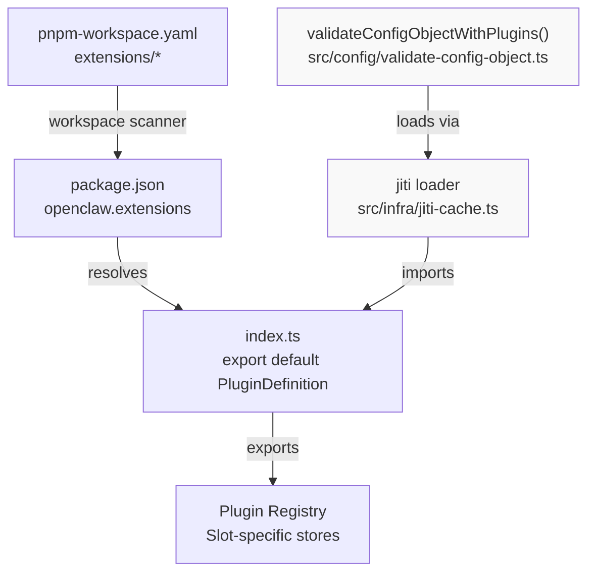
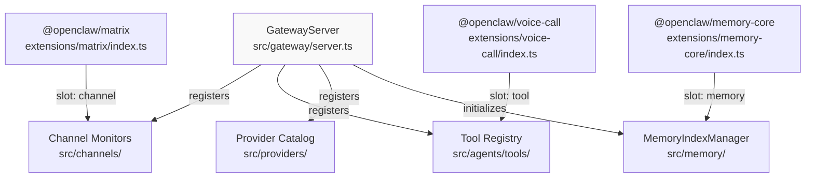
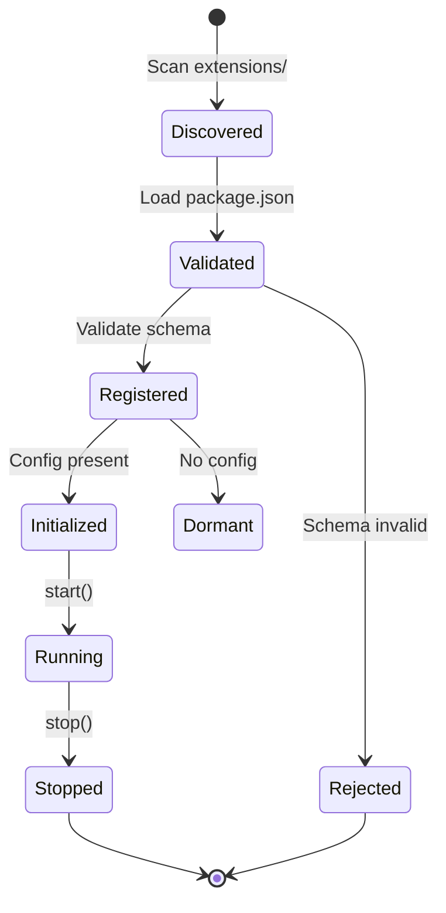

# Page: Creating Custom Plugins

# Creating Custom Plugins

<details>
<summary>Relevant source files</summary>

The following files were used as context for generating this wiki page:

- [.agents/skills/mintlify/SKILL.md](.agents/skills/mintlify/SKILL.md)
- [.github/ISSUE_TEMPLATE/bug_report.md](.github/ISSUE_TEMPLATE/bug_report.md)
- [.github/ISSUE_TEMPLATE/config.yml](.github/ISSUE_TEMPLATE/config.yml)
- [.github/ISSUE_TEMPLATE/feature_request.md](.github/ISSUE_TEMPLATE/feature_request.md)
- [.github/labeler.yml](.github/labeler.yml)
- [.github/workflows/auto-response.yml](.github/workflows/auto-response.yml)
- [.github/workflows/labeler.yml](.github/workflows/labeler.yml)
- [.github/workflows/stale.yml](.github/workflows/stale.yml)
- [AGENTS.md](AGENTS.md)
- [docs/channels/index.md](docs/channels/index.md)
- [docs/zh-CN/channels/index.md](docs/zh-CN/channels/index.md)
- [extensions/copilot-proxy/package.json](extensions/copilot-proxy/package.json)
- [extensions/google-antigravity-auth/package.json](extensions/google-antigravity-auth/package.json)
- [extensions/google-gemini-cli-auth/package.json](extensions/google-gemini-cli-auth/package.json)
- [extensions/matrix/CHANGELOG.md](extensions/matrix/CHANGELOG.md)
- [extensions/matrix/package.json](extensions/matrix/package.json)
- [extensions/memory-lancedb/package.json](extensions/memory-lancedb/package.json)
- [extensions/msteams/CHANGELOG.md](extensions/msteams/CHANGELOG.md)
- [extensions/msteams/package.json](extensions/msteams/package.json)
- [extensions/voice-call/CHANGELOG.md](extensions/voice-call/CHANGELOG.md)
- [extensions/voice-call/package.json](extensions/voice-call/package.json)
- [extensions/zalo/CHANGELOG.md](extensions/zalo/CHANGELOG.md)
- [extensions/zalo/package.json](extensions/zalo/package.json)
- [extensions/zalouser/package.json](extensions/zalouser/package.json)
- [package.json](package.json)
- [pnpm-lock.yaml](pnpm-lock.yaml)
- [scripts/sync-labels.ts](scripts/sync-labels.ts)

</details>


This page provides a step-by-step guide for building custom OpenClaw plugins. It covers package structure, SDK imports, and implementation patterns for the four plugin slot types: Channel, Tool, Provider, and Memory.

For architectural details on how plugins integrate into the Gateway, see page 10.1. For examples of bundled extensions, see page 10.2.

---

## Plugin Package Structure

OpenClaw discovers plugins by scanning `package.json` files for the `openclaw.extensions` field. The plugin loader resolves entry points using workspace paths or node_modules lookups.

### Minimal Package Manifest

A plugin requires a `package.json` with an entry point declaration:

```json
{
  "name": "@openclaw/my-plugin",
  "version": "2026.2.12",
  "type": "module",
  "openclaw": {
    "extensions": ["./index.ts"]
  }
}
```

The entry point file (`./index.ts`) must export a plugin definition object that declares the slot type, configuration schema, and initialization function.

**Sources:** [extensions/memory-core/package.json:1-17](), [extensions/matrix/package.json:1-36]()

### Dependency Management

Plugin dependencies must follow these rules to work in both monorepo development and npm installation:

| Dependency Type | Location | Purpose |
|----------------|----------|---------|
| Runtime dependencies | `dependencies` | Libraries required at runtime (TypeBox, HTTP clients) |
| OpenClaw SDK types | `devDependencies` or `peerDependencies` | Type imports from `openclaw/plugin-sdk` |
| Workspace reference | `devDependencies` only | For local development in monorepo |

**Critical rule:** Never place `openclaw` in `dependencies` or use `workspace:*` in `dependencies`. This breaks `npm install` outside the monorepo. The runtime resolves `openclaw/plugin-sdk` via jiti aliasing.

Example dependency configuration:

```json
{
  "dependencies": {
    "@sinclair/typebox": "0.34.48",
    "ws": "^8.19.0"
  },
  "devDependencies": {
    "openclaw": "workspace:*"
  }
}
```

**Sources:** [AGENTS.md:11-12](), [extensions/voice-call/package.json:1-19](), [extensions/matrix/package.json:1-36]()

### Channel Plugin Metadata

Channel plugins declare additional metadata in the `openclaw.channel` field for onboarding and UI display:

```json
{
  "openclaw": {
    "extensions": ["./index.ts"],
    "channel": {
      "id": "matrix",
      "label": "Matrix",
      "selectionLabel": "Matrix (plugin)",
      "docsPath": "/channels/matrix",
      "docsLabel": "matrix",
      "blurb": "open protocol; install the plugin to enable.",
      "order": 70,
      "quickstartAllowFrom": true
    },
    "install": {
      "npmSpec": "@openclaw/matrix",
      "localPath": "extensions/matrix",
      "defaultChoice": "npm"
    }
  }
}
```

| Field | Purpose |
|-------|---------|
| `id` | Channel identifier (must match config key) |
| `label` | Display name in UI |
| `docsPath` | Path to channel documentation |
| `order` | Sort order in selection lists |
| `quickstartAllowFrom` | Whether to show allowFrom setup in onboarding |

**Sources:** [extensions/matrix/package.json:16-35](), [extensions/zalo/package.json:12-34]()

### Plugin Discovery Flow



**Sources:** [pnpm-workspace.yaml:1-15](), [package.json:1-217]()

---

## Plugin SDK Imports

The Plugin SDK is exported at `openclaw/plugin-sdk` and provides TypeScript types for plugin definitions. The SDK is built as a separate entry point from the main OpenClaw package.

### SDK Export Configuration

The SDK export is configured in the root `package.json`:

```json
{
  "exports": {
    ".": "./dist/index.js",
    "./plugin-sdk": {
      "types": "./dist/plugin-sdk/index.d.ts",
      "default": "./dist/plugin-sdk/index.js"
    }
  }
}
```

Plugins import types using:

```typescript
import type { PluginDefinition } from "openclaw/plugin-sdk";
```

The runtime resolves this import via jiti aliasing when loading plugins dynamically. This allows plugins to reference types without bundling the entire OpenClaw distribution.

**Sources:** [package.json:25-32](), [AGENTS.md:11-12]()

## Plugin Definition Object

Every plugin entry point exports a default object conforming to the `PluginDefinition` interface. The object declares the plugin's slot type, configuration schema, and initialization function.

### Definition Structure

```typescript
import { Type } from "@sinclair/typebox";
import type { PluginDefinition } from "openclaw/plugin-sdk";

export default {
  slot: "channel",
  id: "my-channel",
  schema: Type.Object({
    token: Type.String(),
    enabled: Type.Optional(Type.Boolean())
  }),
  metadata: {
    name: "My Channel",
    description: "Channel description"
  },
  async init(config, deps) {
    // Return slot-specific implementation
    return {
      start: async () => { /* ... */ },
      stop: async () => { /* ... */ }
    };
  }
} satisfies PluginDefinition;
```

### Definition Fields

| Field | Type | Required | Purpose |
|-------|------|----------|---------|
| `slot` | `"channel" \| "tool" \| "provider" \| "memory"` | Yes | Determines which subsystem loads the plugin |
| `id` | `string` | Yes | Unique identifier (matches config key) |
| `schema` | TypeBox schema | Yes | Configuration validation schema |
| `metadata` | `object` | No | Display metadata (name, icon, description) |
| `init` | `async function` | Yes | Returns slot-specific implementation |

The `init` function receives:
- `config`: Validated configuration object (matches schema)
- `deps`: Dependency injection context (logger, paths, RPC client)

**Sources:** [extensions/voice-call/package.json:1-19](), [extensions/matrix/package.json:1-36]()

### TypeBox Schema Requirement

All plugins must embed a TypeBox schema for configuration validation. Missing schemas produce warnings during plugin loading. The schema defines the structure of the plugin's configuration section in `openclaw.json`.

Example for a channel with token authentication:

```typescript
import { Type } from "@sinclair/typebox";

const schema = Type.Object({
  token: Type.String(),
  allowFrom: Type.Optional(Type.Array(Type.String())),
  port: Type.Optional(Type.Number())
});
```

**Sources:** [extensions/matrix/package.json:1-36](), [extensions/zalo/package.json:1-35]()

---

## Plugin Slot Types

OpenClaw supports four plugin slot types. Each slot type integrates with a different Gateway subsystem and implements a specific interface.

### Slot Type Overview

| Slot | Subsystem | Purpose | Example Plugins |
|------|-----------|---------|----------------|
| `channel` | Message routing | Integrate messaging platforms | Matrix, MS Teams, Zalo |
| `tool` | Agent tools | Add agent capabilities | Lobster workflows, voice-call |
| `provider` | Model inference | Add AI model backends | Google Antigravity, Copilot Proxy |
| `memory` | Context search | Add memory backends | memory-core (SQLite), memory-lancedb |

Detailed architectural information for each slot type is covered in page 10.1.

**Sources:** [docs/channels/index.md:14-37](), [extensions/matrix/package.json:1-36](), [extensions/voice-call/package.json:1-19]()

### Gateway Integration Points



**Sources:** [extensions/matrix/package.json:16-29](), [extensions/voice-call/package.json:14-18](), [extensions/memory-core/package.json:1-17]()

---

## Step-by-Step: Creating a Channel Plugin

This section walks through creating a channel plugin from scratch. Channel plugins integrate messaging platforms and handle inbound/outbound messages.

### Step 1: Create Plugin Directory

Create a new directory under `extensions/` with the basic structure:

```
extensions/my-channel/
├── package.json
├── index.ts
├── README.md
└── CHANGELOG.md
```

### Step 2: Write package.json

Create a `package.json` with plugin metadata:

```json
{
  "name": "@openclaw/my-channel",
  "version": "2026.2.12",
  "description": "OpenClaw My Channel plugin",
  "type": "module",
  "dependencies": {
    "@sinclair/typebox": "0.34.48",
    "ws": "^8.19.0"
  },
  "devDependencies": {
    "openclaw": "workspace:*"
  },
  "openclaw": {
    "extensions": ["./index.ts"],
    "channel": {
      "id": "my-channel",
      "label": "My Channel",
      "selectionLabel": "My Channel (plugin)",
      "docsPath": "/channels/my-channel",
      "docsLabel": "my-channel",
      "blurb": "Example channel plugin.",
      "order": 90,
      "quickstartAllowFrom": true
    }
  }
}
```

**Sources:** [extensions/matrix/package.json:1-36](), [extensions/zalo/package.json:1-35]()

### Step 3: Implement Plugin Entry Point

Create `index.ts` with the plugin definition:

```typescript
import { Type } from "@sinclair/typebox";
import type { PluginDefinition } from "openclaw/plugin-sdk";

export default {
  slot: "channel",
  id: "my-channel",
  
  schema: Type.Object({
    token: Type.String(),
    allowFrom: Type.Optional(Type.Array(Type.String())),
    enabled: Type.Optional(Type.Boolean({ default: true }))
  }),
  
  metadata: {
    name: "My Channel",
    description: "Example channel plugin"
  },
  
  async init(config, deps) {
    const { logger } = deps;
    
    logger.info("Initializing My Channel plugin");
    
    return {
      async start() {
        // Start listening for messages
        logger.info("My Channel started");
      },
      
      async stop() {
        // Clean up connections
        logger.info("My Channel stopped");
      },
      
      async send(target, message) {
        // Send message to target
        logger.info({ target, message }, "Sending message");
      }
    };
  }
} satisfies PluginDefinition;
```

**Sources:** [extensions/matrix/package.json:1-36](), [extensions/voice-call/package.json:1-19]()

### Step 4: Test Locally

Build OpenClaw and start the Gateway in dev mode:

```bash
pnpm build
pnpm gateway:dev
```

The plugin loader will discover your plugin automatically. Check logs for initialization messages.

### Step 5: Add Configuration

Add your plugin's configuration to `~/.openclaw/openclaw.json`:

```json
{
  "channels": {
    "my-channel": {
      "token": "your-token-here",
      "enabled": true
    }
  }
}
```

The Gateway auto-enables channel plugins when configuration is present.

**Sources:** [extensions/matrix/package.json:1-36](), [pnpm-workspace.yaml:1-15]()

---

## Plugin Lifecycle

The plugin system follows a discovery → validation → registration → initialization flow. Plugins are auto-enabled when configuration is present.



### Discovery Phase

The plugin loader scans `extensions/` for directories containing `package.json` with an `openclaw.extensions` field. Entry points are resolved relative to the package directory.

**File:** [pnpm-workspace.yaml:1-15]()

### Validation Phase

Each plugin's configuration schema is validated using TypeBox. Missing schemas produce warnings, and invalid schemas reject the plugin.

**Process:**
1. Load entry point module
2. Extract TypeBox schema from plugin definition
3. Validate against config section (if present)
4. Register capability metadata in Plugin Registry

### Initialization Phase

When configuration is present for a plugin's `id`, the Gateway calls `init(config, deps)` with:

- **config**: Validated configuration object
- **deps**: Dependency injection context (logger, storage paths, RPC clients)

The plugin returns its slot-specific implementation, which the Gateway registers with the appropriate subsystem (channel router, tool registry, model catalog, or memory search).

### Auto-Enable Behavior

Bundled channel and provider plugins are auto-enabled when configuration keys exist:

| Plugin Type | Config Key | Auto-Enable |
|------------|-----------|-------------|
| Channel | `channels.<id>.*` | Yes |
| Provider | `providers.<id>.*` or env vars | Yes |
| Tool | `tools.allowlist` includes plugin tools | Opt-in |
| Memory | `memorySearch.provider` matches `id` | Yes |

**Sources:** [CHANGELOG.md:406-407](), [src/plugins/loader.ts]()

---

## Creating Other Plugin Types

The same development workflow applies to all plugin slot types. The key differences are:

### Tool Plugins

Tool plugins export a tool definition and execution handler:

```typescript
{
  slot: "tool",
  id: "my-tool",
  schema: Type.Object({
    enabled: Type.Optional(Type.Boolean())
  }),
  async init(config, deps) {
    return {
      tool: {
        name: "my_tool",
        description: "Tool description",
        inputSchema: {
          type: "object",
          properties: {
            param: { type: "string" }
          }
        }
      },
      execute: async (input, context) => {
        return { result: "..." };
      }
    };
  }
}
```

Tool plugins must be added to `tools.allowlist` or `tools.allow` to be available to agents.

### Provider Plugins

Provider plugins implement model inference and authentication:

```typescript
{
  slot: "provider",
  id: "my-provider",
  schema: Type.Object({
    apiKey: Type.Optional(Type.String())
  }),
  async init(config, deps) {
    return {
      models: [{ id: "model-1", provider: "my-provider" }],
      stream: async (model, messages, auth) => {
        // Return AsyncIterable of events
      }
    };
  }
}
```

### Memory Plugins

Memory plugins provide search backends:

```typescript
{
  slot: "memory",
  id: "my-memory",
  schema: Type.Object({
    storagePath: Type.Optional(Type.String())
  }),
  async init(config, deps) {
    return {
      index: async (files) => { /* ... */ },
      search: async (query) => { /* ... */ }
    };
  }
}
```

Memory plugins are activated by setting `memorySearch.provider` to the plugin's `id`.

**Sources:** [extensions/memory-core/package.json:1-17](), [extensions/voice-call/package.json:1-19]()

---

## Dependency Injection Context

The `init` function receives a `deps` parameter with these properties:

| Property | Type | Purpose |
|---------|------|---------|
| `logger` | `Logger` | Structured logging (tslog) |
| `configDir` | `string` | Path to `~/.openclaw/` |
| `workspaceDir` | `string` | Agent workspace path |
| `rpc` | `RPCClient` | Gateway RPC client for internal communication |

Example usage:

```typescript
async init(config, deps) {
  const { logger, configDir } = deps;
  
  logger.info("Plugin initializing", { configDir });
  
  // Use logger for structured output
  logger.debug({ config }, "Loaded configuration");
  
  return { /* implementation */ };
}
```

**Sources:** [package.json:25-32]()

---

## Testing Plugins

### Local Testing

Test plugins during development using the Gateway dev server:

```bash
# Build TypeScript
pnpm build

# Start Gateway with plugin auto-discovery
pnpm gateway:dev
```

The plugin loader logs initialization status. Check for:
- Plugin discovered: `Loading plugin from extensions/my-plugin`
- Schema validated: `Validated plugin config for my-plugin`
- Plugin initialized: `Plugin my-plugin initialized`

### Unit Testing

Write unit tests using Vitest. Test plugins in isolation by mocking external dependencies:

```typescript
import { describe, expect, it, vi, beforeEach } from "vitest";

describe("my plugin", () => {
  beforeEach(() => {
    vi.resetModules();
    vi.clearAllMocks();
  });

  it("initializes correctly", async () => {
    const { default: plugin } = await import("./index.js");
    
    const deps = {
      logger: { info: vi.fn(), debug: vi.fn() },
      configDir: "/tmp/test",
      workspaceDir: "/tmp/test/workspace",
      rpc: { send: vi.fn() }
    };
    
    const impl = await plugin.init({ token: "test" }, deps);
    
    expect(impl.start).toBeDefined();
    expect(impl.stop).toBeDefined();
  });
});
```

Mock external dependencies (filesystem, network) to avoid cross-test pollution. Use dynamic imports to reset module state between tests.

**Sources:** [extensions/google-gemini-cli-auth/oauth.test.ts:1-240]()

---

## Bundled Plugin Examples

### Channel Plugins

| Plugin | Platform | Features |
|--------|----------|----------|
| `msteams` | Microsoft Teams | Bot Framework, adaptive cards, file uploads |
| `matrix` | Matrix | E2EE, DM resolution, group allowlists |
| `nostr` | Nostr | Profile management, relay handling |
| `line` | LINE | Rich replies, quick replies, HTTP registry |
| `tlon` | Tlon/Urbit | DMs, group mentions, thread replies |

### Tool Plugins

| Plugin | Purpose | Features |
|--------|---------|----------|
| `lobster` | Typed workflows | Approval gates, JSON-only, file args |
| `llm-task` | JSON workflows | Optional JSON-only tool for sub-tasks |

### Memory Plugins

| Plugin | Backend | Features |
|--------|---------|----------|
| `memory-core` | SQLite | Hybrid BM25+vector, batch indexing, FTS5 |
| `memory-lancedb` | LanceDB | Vector-only, Apache Arrow storage |

**Sources:** [README.md:140](), [CHANGELOG.md:153-154,223-224,321,389-398](), [extensions/]()

---

## Plugin Testing

### Unit Testing

Test plugins in isolation using Vitest. The CI pipeline runs plugin tests on Linux, Windows, and macOS:

```typescript
import { describe, expect, it, vi, beforeEach, afterEach } from "vitest";

describe("my plugin", () => {
  beforeEach(async () => {
    vi.resetModules();
    vi.clearAllMocks();
  });

  afterEach(() => {
    // Cleanup
  });

  it("extracts credentials correctly", async () => {
    // Mock filesystem/network calls
    const { extractCredentials } = await import("./oauth.js");
    const result = extractCredentials();
    
    expect(result).toEqual({
      clientId: "expected-id",
      clientSecret: "expected-secret"
    });
  });
});
```

The test setup should mock external dependencies (filesystem, network) and use dynamic imports to avoid cross-test pollution. See the Google Gemini CLI Auth plugin tests for a full example of mocking `node:fs` and `node:path` for credential extraction tests.

**Sources:** [extensions/google-gemini-cli-auth/oauth.test.ts:1-240](), [.github/workflows/ci.yml:68-158]()

### Integration Testing

OpenClaw uses Docker-based installer smoke tests to validate plugin behavior in realistic environments. The E2E installer tests cover:

1. **Fresh Install**: Installer script from `openclaw.ai/install.sh`
2. **Upgrade Path**: Pre-install previous version, then upgrade
3. **Tool Execution**: Verify agent can use `read`, `write`, `exec`, and `image` tools
4. **Session Persistence**: Check session JSONL transcripts contain expected tool calls

```bash
# Run installer smoke tests (root + non-root)
pnpm test:install:smoke

# Run full E2E with live model providers
OPENAI_API_KEY=... pnpm test:install:e2e:openai
ANTHROPIC_API_KEY=... pnpm test:install:e2e:anthropic
```

The E2E test spins up a Gateway, runs onboarding, executes agent turns with tool calls, and verifies both the agent responses and the session transcript contents.

**Sources:** [scripts/docker/install-sh-e2e/run.sh:1-536](), [scripts/test-install-sh-docker.sh:1-71](), [scripts/test-install-sh-e2e-docker.sh:1-30](), [.github/workflows/install-smoke.yml:1-42]()

---

## Publishing Plugins

### NPM Publication

Publish plugins to npm for distribution:

```bash
cd extensions/my-plugin

# Use 1Password CLI for OTP (in fresh tmux session)
eval "$(op signin --account my.1password.com)"
OTP=$(op read 'op://Private/Npmjs/one-time password?attribute=otp')

npm publish --access public --otp="$OTP"
```

Verify publication:

```bash
# Check published version (avoid local npmrc side effects)
npm view @openclaw/my-plugin version --userconfig "$(mktemp)"
```

Users install plugins with `npm install -g @openclaw/my-plugin`. The plugin loader discovers installed plugins in `node_modules/@openclaw/*`.

**Sources:** [AGENTS.md:180-187]()

### Bundled Plugins

The following plugins are published to npm during OpenClaw releases:

- `@openclaw/bluebubbles`
- `@openclaw/diagnostics-otel`
- `@openclaw/discord`
- `@openclaw/feishu`
- `@openclaw/lobster`
- `@openclaw/matrix`
- `@openclaw/msteams`
- `@openclaw/nextcloud-talk`
- `@openclaw/nostr`
- `@openclaw/voice-call`
- `@openclaw/zalo`
- `@openclaw/zalouser`

Plugins not on npm (e.g., `tlon`, `twitch`, `irc`) are included in the OpenClaw distribution but not published separately.

**Sources:** [docs/reference/RELEASING.md:92-121]()

### Workspace Development

For local development without npm publication, place plugins in `extensions/` and register them in `pnpm-workspace.yaml`:

```yaml
packages:
  - "extensions/*"
```

The workspace scanner auto-discovers plugin packages during `pnpm build`.

**Sources:** [pnpm-workspace.yaml:1-15]()

---

## Troubleshooting

### Plugin Not Discovered

**Symptom:** Plugin not listed in `openclaw plugins list`

**Solutions:**
1. Verify `openclaw.extensions` field in `package.json`
2. Check entry point path is relative to package directory
3. Ensure plugin is in `extensions/` or installed globally

### Schema Validation Failed

**Symptom:** Warning: "Plugin X missing config schema"

**Solutions:**
1. Embed TypeBox schema in plugin definition
2. Ensure schema matches config structure
3. Check for required fields vs. optional fields

### Plugin Not Auto-Enabled

**Symptom:** Plugin present but not initialized

**Solutions:**
1. Add config section matching plugin `id`
2. For tool plugins, add to `tools.allowlist`
3. For memory plugins, set `memorySearch.provider`

**Sources:** [CHANGELOG.md:396,467]()

---