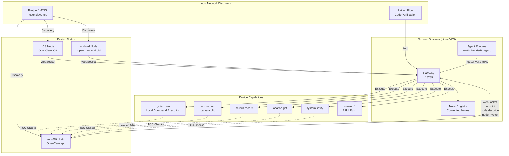
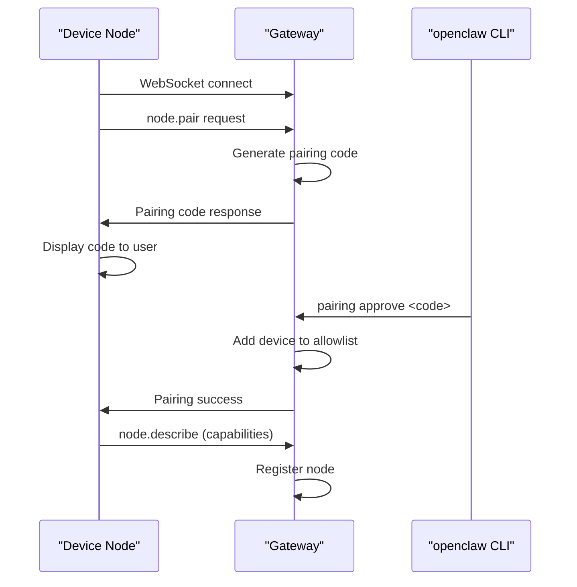
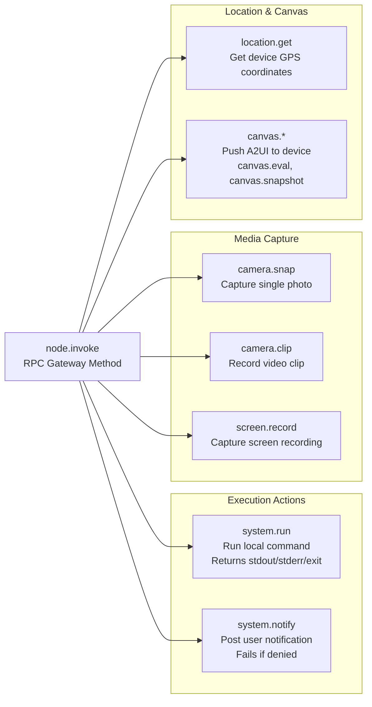
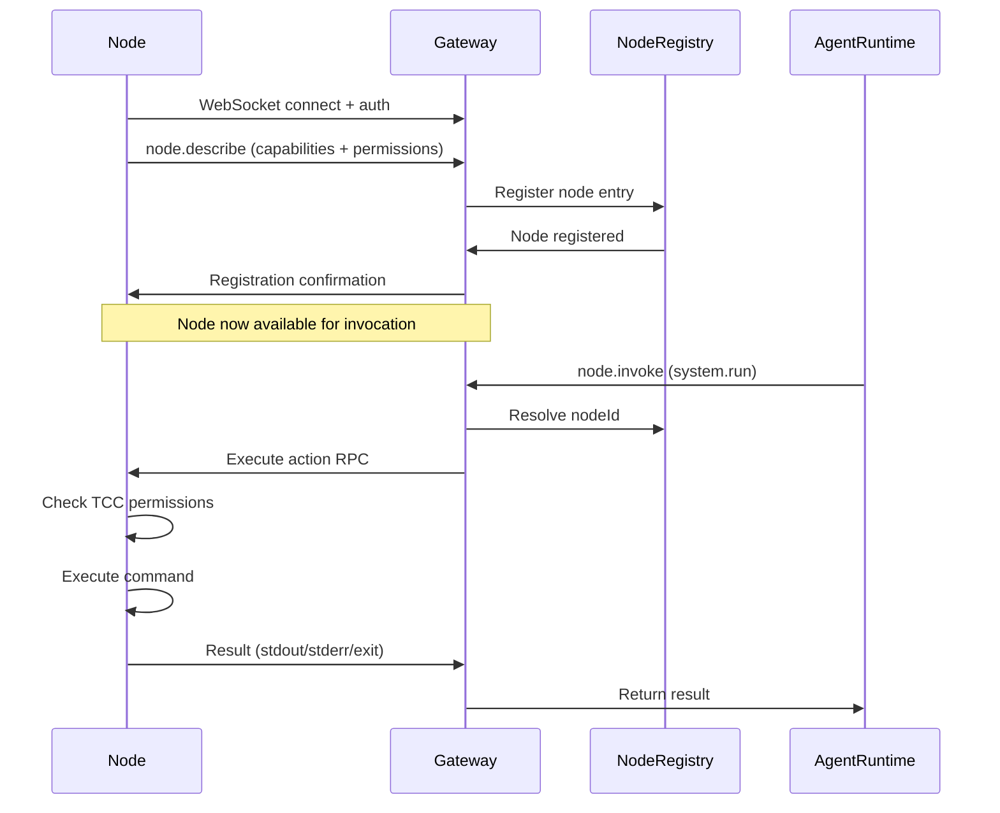
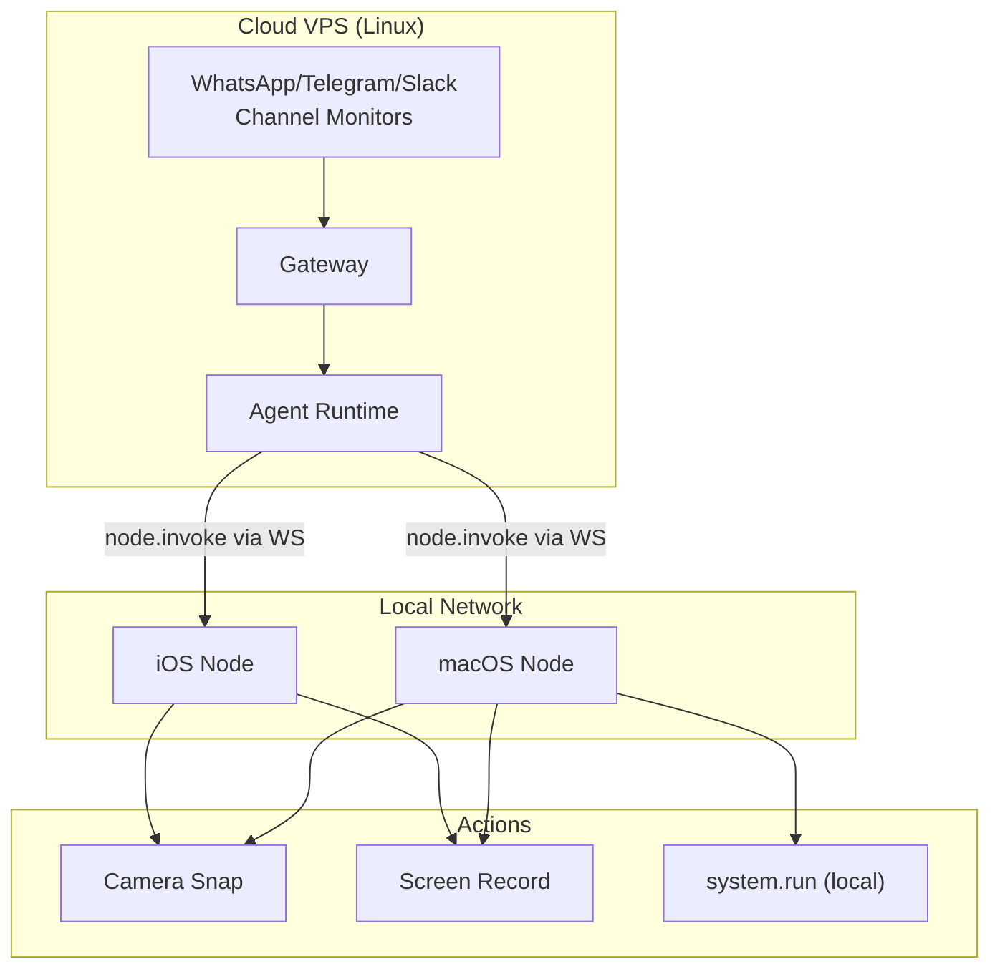

# Page: Device Nodes

# Device Nodes

<details>
<summary>Relevant source files</summary>

The following files were used as context for generating this wiki page:

- [README.md](README.md)
- [assets/avatar-placeholder.svg](assets/avatar-placeholder.svg)
- [docs/channels/zalo.md](docs/channels/zalo.md)
- [docs/channels/zalouser.md](docs/channels/zalouser.md)
- [scripts/clawtributors-map.json](scripts/clawtributors-map.json)
- [scripts/update-clawtributors.ts](scripts/update-clawtributors.ts)
- [scripts/update-clawtributors.types.ts](scripts/update-clawtributors.types.ts)
- [src/cli/nodes-cli.ts](src/cli/nodes-cli.ts)
- [src/cli/nodes-screen.test.ts](src/cli/nodes-screen.test.ts)
- [src/cli/nodes-screen.ts](src/cli/nodes-screen.ts)
- [src/cli/program.ts](src/cli/program.ts)
- [src/config/config.ts](src/config/config.ts)
- [src/index.test.ts](src/index.test.ts)
- [src/index.ts](src/index.ts)
- [tsconfig.json](tsconfig.json)
- [ui/src/styles.css](ui/src/styles.css)
- [ui/src/styles/layout.mobile.css](ui/src/styles/layout.mobile.css)

</details>


## Purpose and Scope

Device Nodes are companion applications for macOS, iOS, and Android that extend OpenClaw with device-local capabilities. They allow the Gateway to run on a remote server (e.g., Linux VPS) while still providing access to device-specific actions like camera capture, screen recording, local command execution, and system notifications. Nodes connect to the Gateway via WebSocket and advertise their capabilities and permissions through the protocol.

For information about the Gateway WebSocket protocol itself, see [Gateway Protocol](#3.2). For remote Gateway deployment patterns, see [Remote Access](#3.4).

---

## Architecture Overview

Device Nodes operate as WebSocket clients that connect to the Gateway control plane and expose device-local actions through the `node.invoke` protocol method. The Gateway remains the central orchestration point, but execution happens on the device where the Node runs.



**Sources:** [README.md:224-248](), [README.md:150-156]()

---

## Discovery and Pairing

### Bonjour/mDNS Advertisement

Device Nodes advertise their presence on the local network using Bonjour (mDNS) service discovery. The Gateway publishes a `_openclaw._tcp` service that nodes discover automatically. This enables zero-configuration discovery when both Gateway and Node are on the same network.

The discovery system is configurable to reduce information disclosure:

| Discovery Mode | Behavior |
|---|---|
| `minimal` (default) | Only advertise on loopback and local subnets |
| `full` | Advertise on all network interfaces |

**Sources:** [README.md:412](), [CHANGELOG.md:412]()

### Pairing Flow

When a Node discovers a Gateway, it initiates a pairing flow to establish trust:

1. Node connects to Gateway WebSocket endpoint
2. Gateway generates a short pairing code
3. User approves the pairing code via CLI: `openclaw pairing approve <channel> <code>`
4. Gateway adds the Node's device identity to an allowlist
5. Node receives confirmation and registers its capabilities



**Sources:** [README.md:431]()

### Protocol Methods

Nodes use three primary protocol methods:

| Method | Purpose | Parameters |
|---|---|---|
| `node.list` | Query all connected nodes | None |
| `node.describe` | Get capabilities and permissions for a specific node | `nodeId` |
| `node.invoke` | Execute an action on a node | `nodeId`, `action`, `params` |

**Sources:** [README.md:236-240]()

---

## Node Capabilities

### Available Actions

Device Nodes expose the following actions through `node.invoke`:



**Sources:** [README.md:236-240]()

#### system.run

Executes a local shell command on the device and returns stdout, stderr, and exit code. On macOS, this action requires explicit permission configuration and respects TCC (Transparency, Consent, and Control) requirements:

- Set `needsScreenRecording: true` to require screen-recording permission
- Returns `PERMISSION_MISSING` if required permissions are not granted
- Works independently of the Gateway's `exec` tool (which runs on the Gateway host)

**Sources:** [README.md:236-240]()

#### system.notify

Posts a user notification on the device. Fails immediately if notification permissions are denied. This is separate from the Gateway's own notification capabilities.

#### camera.snap / camera.clip

Captures a single photo (`camera.snap`) or a video clip (`camera.clip`) using the device camera. Requires camera permission on iOS/Android and TCC camera access on macOS.

#### screen.record

Captures a screen recording on the device. Requires screen recording permission (TCC on macOS, accessibility permissions on Android).

#### location.get

Retrieves the device's current GPS coordinates. Requires location permission.

#### canvas.*

Pushes A2UI (Agent-to-UI) visual content to the device's Canvas surface. Available actions include:

- `canvas.push` — render new UI content
- `canvas.reset` — clear current content
- `canvas.eval` — evaluate script in Canvas context
- `canvas.snapshot` — capture current Canvas state

**Sources:** [README.md:126-127](), [README.md:153-154]()

---

## Permission System

### macOS TCC Integration

The macOS Node integrates with TCC (Transparency, Consent, and Control) to gate access to sensitive capabilities:

| Capability | TCC Permission Required |
|---|---|
| `system.run` (with screen data) | Screen Recording |
| `system.notify` | Notifications |
| `camera.*` | Camera |
| `screen.record` | Screen Recording |
| `location.get` | Location Services |

The Node queries permission status before executing actions and returns explicit error codes when permissions are missing.

**Sources:** [README.md:236-240]()

### Permission Status Response

When calling `node.describe`, the Gateway receives a permission map showing the current status of each capability:

```json
{
  "nodeId": "macos-primary",
  "capabilities": ["system.run", "camera.snap", "screen.record"],
  "permissions": {
    "screenRecording": true,
    "camera": true,
    "notifications": false
  }
}
```

---

## Platform Implementations

### macOS Node Mode

The macOS app (`OpenClaw.app`) can run in **node mode**, exposing device capabilities while the Gateway runs elsewhere. The macOS implementation includes:

- **Discovery:** `OpenClawDiscovery` target provides Bonjour/mDNS advertisement [apps/macos/Package.swift:33-41]()
- **IPC:** `OpenClawIPC` target handles WebSocket communication [apps/macos/Package.swift:27-32]()
- **Executable:** Main app target registers as a node [apps/macos/Package.swift:42-67]()

The macOS app also includes a `openclaw-mac` CLI tool for headless node operation [apps/macos/Package.swift:68-78]().

**Sources:** [apps/macos/Package.swift](), [README.md:283-290]()

### iOS Node

The iOS companion app pairs via Bonjour and exposes:

- Voice Wake (speech trigger forwarding)
- Canvas surface for A2UI rendering
- Camera capture (snap/clip)
- Screen recording
- Location services

**Sources:** [README.md:292-298]()

### Android Node

The Android companion app provides similar capabilities to iOS:

- Canvas surface
- Camera capture
- Screen recording
- Optional SMS integration (requires additional permissions)

**Sources:** [README.md:300-305]()

---

## Protocol Integration

### Node Registration Flow

When a Node connects to the Gateway, it follows this registration sequence:



**Sources:** [README.md:236-240]()

### WebSocket Transport

Nodes maintain a persistent WebSocket connection to the Gateway. The connection supports:

- Heartbeat/keepalive for connection monitoring
- Bidirectional RPC (Gateway can invoke actions, Node can send events)
- Multi-node concurrency (Gateway tracks multiple connected nodes)

The Gateway exposes node actions to the agent runtime through tool definitions, allowing the agent to invoke node capabilities as part of its execution flow.

**Sources:** [README.md:224-232]()

---

## Use Cases

### Remote Gateway with Local Device Access

The primary use case for Device Nodes is running the Gateway on a remote server while maintaining local device capabilities:



This architecture allows:
- Reliable Gateway uptime (VPS with good connectivity)
- Channel monitors running 24/7
- Device-local actions executed only when needed
- No need to run Gateway on macOS for iMessage/BlueBubbles

**Sources:** [README.md:224-232]()

### Elevated Execution vs Node Execution

OpenClaw separates **host execution** (on the Gateway machine) from **node execution** (on device nodes):

| Execution Type | Where | How | Use Case |
|---|---|---|---|
| Host `exec` tool | Gateway machine | Directly on Gateway host or in sandbox | Server-side scripts, git operations |
| Node `system.run` | Device Node | Via `node.invoke` RPC | Local file operations, open apps, device-specific commands |
| Elevated mode | Gateway machine | Host permissions, allowlist-gated | Privileged Gateway operations |

**Sources:** [README.md:242-246]()

---

## Configuration

Device Nodes do not require Gateway configuration changes — they auto-discover and pair dynamically. However, the Gateway supports node-related settings:

```json5
{
  "gateway": {
    "discovery": {
      "mode": "minimal"  // "minimal" (default) or "full"
    }
  }
}
```

**Sources:** [CHANGELOG.md:412]()

---

## CLI Operations

### List Connected Nodes

```bash
openclaw nodes list
```

### Describe Node Capabilities

```bash
openclaw nodes describe <nodeId>
```

### Approve Node Pairing

```bash
openclaw pairing approve node <code>
```

**Sources:** [README.md:236-240]()

---