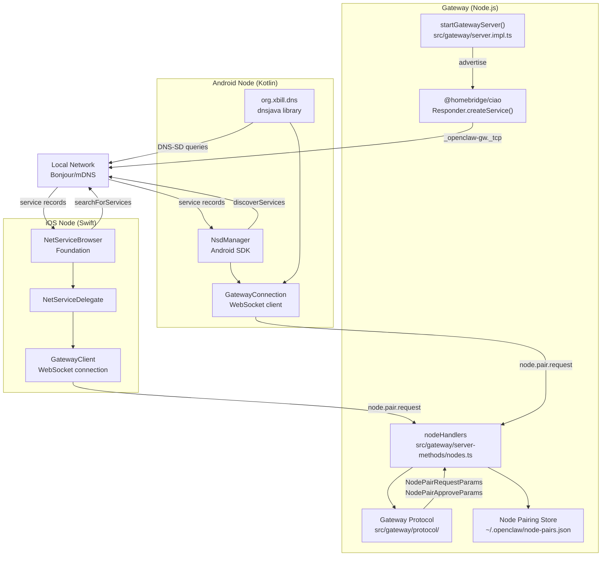
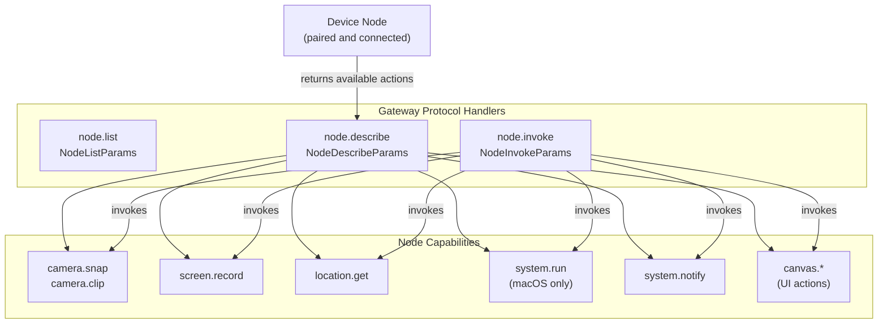

# Page: Node Pairing and Discovery

# Node Pairing and Discovery

<details>
<summary>Relevant source files</summary>

The following files were used as context for generating this wiki page:

- [src/cli/nodes-cli.ts](src/cli/nodes-cli.ts)
- [src/cli/nodes-screen.test.ts](src/cli/nodes-screen.test.ts)
- [src/cli/nodes-screen.ts](src/cli/nodes-screen.ts)
- [src/cli/program.ts](src/cli/program.ts)

</details>


**Purpose:** This page explains how device nodes (iOS, Android, macOS) discover OpenClaw gateways on the network and establish authenticated connections. For information about node capabilities and the actions nodes can execute, see [Node Capabilities](#11.2). For gateway configuration and network binding, see [Gateway Configuration](#3.1).

---

## Overview

Device nodes (iOS, Android, macOS) discover OpenClaw gateways on the local network using **Bonjour/mDNS** and **DNS-SD** (DNS-based Service Discovery). Once discovered, nodes establish a WebSocket connection to the gateway and complete a pairing flow using the gateway's protocol methods. After pairing approval, nodes register their capabilities and remain connected to execute device-local actions via `node.invoke`.

**Service discovery:**
- Service type: `_openclaw-gw._tcp`
- Default port: `18789` (configurable via `gateway.port`)
- Platforms: iOS (native Bonjour), Android (dnsjava/NsdManager), macOS (native Bonjour)

**Pairing protocol methods:**
- `node.pair.request` - Initiate pairing from node
- `node.pair.approve` - Operator approves pairing (CLI/UI)
- `node.pair.reject` - Operator rejects pairing
- `node.pair.verify` - Node verifies pairing status
- `node.pair.list` - List pending/approved pairings

**Node management methods:**
- `node.list` - List all registered nodes
- `node.describe` - Get node capabilities and status
- `node.rename` - Update node display name
- `node.invoke` - Execute action on node
- `node.invoke.result` - Node returns action result
- `node.event` - Node-initiated events (e.g., wake triggers)

**Sources:**  
[src/gateway/protocol/schema/nodes.ts:1-111]()  
[src/gateway/server-methods-list.ts:54-69]()  
[package.json:163]()

---

## Discovery Flow

### mDNS Service Advertisement

**Title:** Gateway Discovery via Bonjour/mDNS

```mermaid
sequenceDiagram
    participant GW["startGatewayServer()<br/>src/gateway/server.impl.ts"]
    participant Ciao["@homebridge/ciao<br/>Responder"]
    participant Network["Local Network<br/>_openclaw-gw._tcp"]
    participant Node["Device Node<br/>NSNetServiceBrowser (iOS)<br/>NsdManager (Android)"]
    
    GW->>GW: "Bind to gateway.port (18789)"
    GW->>Ciao: "createService(_openclaw-gw._tcp)"
    Ciao->>Network: "Advertise service"
    Note over Network: "TXT records:<br/>- host<br/>- port<br/>- version"
    
    Node->>Network: "Browse for _openclaw-gw._tcp"
    Network-->>Node: "Service found event"
    Node->>Network: "Resolve service details"
    Network-->>Node: "IP, port, TXT records"
    
    Node->>Node: "Display in gateway picker UI"
```

The gateway uses `@homebridge/ciao` (a Bonjour/mDNS responder) to advertise the `_openclaw-gw._tcp` service on the local network. Nodes browse for this service using platform-native APIs:

| Platform | Discovery API | Implementation |
|----------|---------------|----------------|
| iOS | `NetServiceBrowser` (Foundation) | Native Bonjour browser |
| Android | `NsdManager` (Android SDK) | Android Network Service Discovery |
| Android | `dnsjava` library | DNS-SD for Tailscale networks |
| macOS | `NetServiceBrowser` (Foundation) | Native Bonjour browser |

**Sources:**  
[package.json:163]()  
[apps/android/app/build.gradle.kts:115-116]()  
[README.md:223-229]()

---

### DNS-SD on Tailscale Networks

For Tailscale networks, DNS-SD queries use unicast DNS rather than multicast mDNS. This allows discovery across Tailscale tailnets where traditional mDNS broadcast packets don't propagate.

**Android implementation:** Uses `dnsjava` library for unicast DNS-SD queries against Tailscale DNS servers.

**Sources:**  
[apps/android/app/build.gradle.kts:115-116]()

---

## Pairing Flow

### Pairing Protocol Flow

**Title:** Node Pairing via Gateway WebSocket Protocol

```mermaid
sequenceDiagram
    participant User
    participant Node["Device Node<br/>(iOS/Android/macOS)"]
    participant WS["Gateway WebSocket<br/>startGatewayServer()"]
    participant Handler["nodeHandlers<br/>server-methods/nodes.ts"]
    participant Store["Pairing Store<br/>~/.openclaw/node-pairs.json"]
    
    User->>Node: "Select gateway from discovery"
    Node->>WS: "WebSocket connect(ws://IP:18789)"
    WS-->>Node: "Connection established"
    
    Node->>WS: "RequestFrame(method=node.pair.request)"
    Note over Node,WS: "NodePairRequestParams:<br/>- deviceId<br/>- deviceName<br/>- platform<br/>- capabilities[]"
    
    WS->>Handler: "handleNodePairRequest()"
    Handler->>Store: "Generate pairing code + expiry"
    Store-->>Handler: "Pairing pending"
    Handler-->>WS: "ResponseFrame(ok=true)"
    Handler->>User: "EventFrame(event=node.pair.requested)"
    
    User->>WS: "openclaw nodes approve <code>"
    WS->>Handler: "node.pair.approve"
    Handler->>Store: "Mark approved + generate token"
    Handler-->>WS: "ResponseFrame(ok=true)"
    Handler->>Node: "EventFrame(event=node.pair.resolved)"
    
    Note over Node: "Store credentials in Keychain/<br/>EncryptedSharedPreferences"
    
    Node->>WS: "node.list (verify connection)"
    WS-->>Node: "ResponseFrame(nodes=[])"
    
    Note over Node,WS: "Connection persists for node.invoke calls"
```

**Key protocol methods:**

| Method | Direction | Schema | Role |
|--------|-----------|--------|------|
| `node.pair.request` | Node → Gateway | `NodePairRequestParams` | Initiate pairing |
| `node.pair.list` | Operator → Gateway | `NodePairListParams` | List pending/approved pairs |
| `node.pair.approve` | Operator → Gateway | `NodePairApproveParams` | Approve pending pairing |
| `node.pair.reject` | Operator → Gateway | `NodePairRejectParams` | Reject pending pairing |
| `node.pair.verify` | Node → Gateway | `NodePairVerifyParams` | Verify pairing status |
| `node.rename` | Operator → Gateway | `NodeRenameParams` | Update node display name |

**Event notifications:**

| Event | Trigger | Payload |
|-------|---------|---------|
| `node.pair.requested` | New pairing request received | Pairing code, device info |
| `node.pair.resolved` | Pairing approved/rejected | Device ID, approval status |

**Sources:**  
[src/gateway/protocol/schema/nodes.ts:1-111]()  
[src/gateway/protocol/index.ts:236-249]()  
[src/gateway/server-methods-list.ts:54-64]()

---

## Code Entities

### Code Entity Map: Discovery and Pairing

**Title:** Code Components for Node Discovery and Pairing



**Key code entities:**

| Entity | Location | Role |
|--------|----------|------|
| `startGatewayServer()` | [src/gateway/server.impl.ts]() | Gateway WebSocket server initialization |
| `@homebridge/ciao` | [package.json:163]() | Bonjour/mDNS responder library |
| `nodeHandlers` | [src/gateway/server-methods/nodes.ts]() | Node protocol method handlers |
| `NodePairRequestParams` | [src/gateway/protocol/schema/nodes.ts:8-14]() | Pairing request schema |
| `NodePairApproveParams` | [src/gateway/protocol/schema/nodes.ts:28-32]() | Pairing approval schema |
| `validateNodePairRequestParams` | [src/gateway/protocol/index.ts:236-238]() | Request validation |
| `NetServiceBrowser` | iOS Foundation | iOS Bonjour discovery API |
| `NsdManager` | Android SDK | Android Network Service Discovery |
| `dnsjava` | [apps/android/app/build.gradle.kts:116]() | DNS-SD resolver for Tailscale |

**Sources:**  
[src/gateway/server.impl.ts]()  
[src/gateway/server-methods/nodes.ts]()  
[src/gateway/protocol/schema/nodes.ts:1-111]()  
[src/gateway/protocol/index.ts:236-249]()  
[package.json:163]()  
[apps/android/app/build.gradle.kts:115-116]()

---

## Node Registration

After successful pairing, nodes register with the gateway and advertise their available capabilities.

### Node Capability Registration

**Title:** Node Capability Advertisement via `node.describe`



After pairing, nodes remain connected and respond to `node.describe` requests with their capability map. Each capability includes:

**Capability metadata:**

| Field | Type | Description |
|-------|------|-------------|
| `action` | `string` | Action identifier (e.g., `camera.snap`, `system.run`) |
| `available` | `boolean` | Whether the action is currently available |
| `permissionStatus` | `string` | `"granted"` / `"denied"` / `"not-determined"` |
| `platform` | `string` | Platform constraint (e.g., `"macOS"`, `"iOS"`) |

**Protocol methods for capability discovery:**

| Method | Parameters | Returns | Usage |
|--------|------------|---------|-------|
| `node.list` | `NodeListParams` | Array of connected nodes | List all paired nodes |
| `node.describe` | `NodeDescribeParams` | Node details + capability map | Query node capabilities |
| `node.invoke` | `NodeInvokeParams` | Invocation ID | Execute action on node |
| `node.invoke.result` | `NodeInvokeResultParams` | Action result | Node returns result to gateway |

**Sources:**  
[src/gateway/protocol/schema/nodes.ts:50-111]()  
[src/gateway/server-methods-list.ts:65-68]()  
[README.md:223-229]()

---

## Managing Nodes via CLI

### List Registered Nodes

```bash
openclaw nodes list
```

Sends `node.list` to the gateway and displays all paired nodes with their connection state, platform, and device name.

**Gateway method:** `node.list` → `NodeListParams`

### Describe Node Capabilities

```bash
openclaw nodes describe <node-id>
```

Sends `node.describe` to query a specific node's capability map, permission status, and available actions.

**Gateway method:** `node.describe` → `NodeDescribeParams`

### Approve/Reject Pairing

```bash
# Approve pending pairing
openclaw nodes approve <pairing-code>

# Reject pending pairing
openclaw nodes reject <pairing-code>

# List pending pairings
openclaw nodes list --pending
```

These commands interact with the pairing store to approve or reject incoming pairing requests.

**Gateway methods:**
- `node.pair.approve` → `NodePairApproveParams`
- `node.pair.reject` → `NodePairRejectParams`
- `node.pair.list` → `NodePairListParams`

### Rename Node

```bash
openclaw nodes rename <node-id> --name "Living Room iPad"
```

Updates the display name for a paired node.

**Gateway method:** `node.rename` → `NodeRenameParams`

**Sources:**  
[src/gateway/protocol/schema/nodes.ts:1-111]()  
[src/gateway/server-methods-list.ts:54-69]()  
[README.md:223-229]()

---

## Security and Authentication

### Pairing Approval Flow

Pairing requires explicit operator approval via CLI or Control UI. The gateway generates a short-lived pairing code that the operator must approve before the node is permanently paired.

**Security properties:**
- Pairing codes expire after 5 minutes (configurable)
- Operator must explicitly approve each device via `openclaw nodes approve <code>`
- Approved pairings stored in `~/.openclaw/node-pairs.json`
- Node credentials stored securely:
  - **iOS:** Keychain Services
  - **Android:** EncryptedSharedPreferences
  - **macOS:** Keychain Services
- Nodes authenticate on reconnection using stored credentials

**Pairing store format:**

```json
{
  "version": 1,
  "pairs": {
    "<device-id>": {
      "deviceId": "...",
      "deviceName": "...",
      "platform": "iOS",
      "approvedAt": 1234567890000,
      "token": "..."
    }
  }
}
```

**Sources:**  
[src/gateway/protocol/schema/nodes.ts:8-32]()  
[README.md:197-210]()

### Gateway Binding Modes

Node discovery respects gateway binding configuration:

| Bind Mode | Discovery Scope |
|-----------|----------------|
| `loopback` | Nodes cannot discover (gateway bound to 127.0.0.1) |
| `lan` | Local network discovery via mDNS |
| `tailnet` | Tailscale network discovery via DNS-SD |
| `auto` | Prefers `loopback`, falls back to `lan` if Tailscale/remote |

**Recommendation:** Use `bind: loopback` with SSH tunnels or Tailscale Serve for secure remote access. Enable `bind: lan` or `bind: tailnet` only when device nodes need to discover the gateway directly.

**Sources:**  
[README.md:197-210]()  
[docs/platforms/fly.md:40-88]()

---

## Troubleshooting Discovery

### Node Not Finding Gateway

**Check:**
1. **Gateway binding mode:** Ensure `gateway.bind` is set to `lan` or `tailnet` (not `loopback`)
   - `loopback` prevents mDNS advertisement
   - `lan` advertises on local network
   - `tailnet` advertises on Tailscale network
2. **Firewall rules:** Allow inbound TCP on port 18789 (or custom `gateway.port`)
3. **mDNS traffic:** Verify mDNS is not blocked by network policy (common in enterprise networks)
4. **iOS permissions:** Confirm Local Network permission is granted
   - Declared in Info.plist: `NSLocalNetworkUsageDescription`
5. **Android permissions:** Confirm Local Network Usage permission (Android 14+)
6. **Gateway running:** Verify gateway is active with `openclaw gateway status`

**Sources:**  
[README.md:197-210]()  
[docs/platforms/fly.md:40-88]()

### Discovery on Tailscale Networks

Tailscale networks use DNS-SD (unicast DNS) instead of mDNS (multicast). To enable node discovery on Tailscale:

**Gateway configuration:**
- Set `gateway.tailscale.mode` to `serve` (tailnet-only) or `funnel` (public)
- Alternatively, set `gateway.bind` to `tailnet`

**Node behavior:**
- **Android:** Uses `dnsjava` for unicast DNS-SD queries to Tailscale DNS servers
- **iOS/macOS:** Uses native Bonjour with Tailscale DNS integration

**Tailscale DNS-SD advertisement:**
```
_openclaw-gw._tcp.local
→ _openclaw-gw._tcp.<tailnet-name>.ts.net
```

**Sources:**  
[apps/android/app/build.gradle.kts:115-116]()  
[README.md:197-210]()  
[docs/platforms/fly.md:235-248]()

### Pairing Code Expiration

If pairing codes expire before operator approval:
- **Default timeout:** 300 seconds (5 minutes)
- **Configuration:** Set `gateway.pairing.timeout` to extend timeout
- **Check logs:** Gateway logs show `node.pair.request` events with device info
- **Verify connectivity:** Node must maintain WebSocket connection during approval
- **Retry pairing:** Node can retry by disconnecting and reconnecting

**Protocol event sequence:**
1. Node sends `node.pair.request`
2. Gateway emits `node.pair.requested` event (visible in logs/UI)
3. Operator runs `openclaw nodes approve <code>` within timeout
4. Gateway emits `node.pair.resolved` event
5. Node stores credentials and maintains connection

**Sources:**  
[src/gateway/protocol/schema/nodes.ts:8-32]()  
[docs/platforms/fly.md:235-248]()

**Sources:**  
[docs/platforms/fly.md:235-248]()  
[README.md:197-210]()

---

## Platform-Specific Notes

### iOS

- Uses native `NetServiceBrowser` for mDNS discovery
- Requires Local Network permission (declared in Info.plist)
- Credentials stored in Keychain

**Sources:**  
[apps/ios/Sources/Info.plist:30-37]()

### Android

- Uses `dnsjava` library for DNS-SD resolution
- Supports both mDNS and unicast DNS-SD (Tailscale)
- Credentials stored in EncryptedSharedPreferences

**Sources:**  
[apps/android/app/build.gradle.kts:115-116]()

### macOS

- Menu bar app can run in "node mode" alongside gateway
- Advertises node capabilities when gateway is remote
- Uses native Bonjour APIs

**Sources:**  
[README.md:273-277]()  
[AGENTS.md:120-129]()

---

## Related Topics

- **[Node Capabilities](#11.2):** Actions nodes can execute (camera, screen, location, system commands)
- **[Gateway Configuration](#3.1):** Binding modes, ports, and network settings
- **[Gateway Protocol](#3.2):** WebSocket RPC protocol and Bridge Protocol details
- **[Remote Access](#3.4):** SSH tunnels and Tailscale Serve for remote gateway access

---