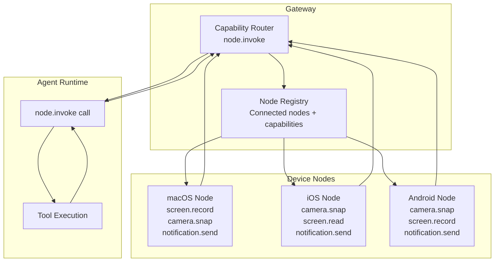
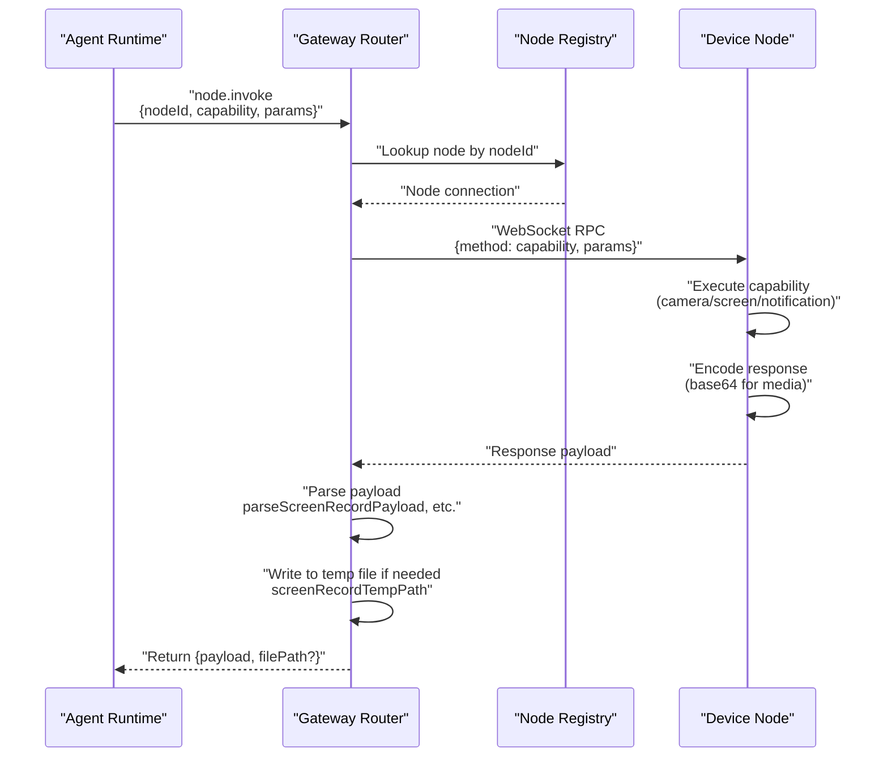

# Page: Node Capabilities

# Node Capabilities

<details>
<summary>Relevant source files</summary>

The following files were used as context for generating this wiki page:

- [src/cli/nodes-cli.ts](src/cli/nodes-cli.ts)
- [src/cli/nodes-screen.test.ts](src/cli/nodes-screen.test.ts)
- [src/cli/nodes-screen.ts](src/cli/nodes-screen.ts)
- [src/cli/program.ts](src/cli/program.ts)

</details>


## Purpose and Scope

This document details the capabilities that device nodes (macOS, iOS, Android) can expose to the OpenClaw Gateway. Node capabilities enable agents to interact with physical device features such as cameras, screens, and notification systems through a standardized capability invocation protocol. For information on node pairing and WebSocket connection setup, see [Node Pairing and Discovery](#11.1).

Node capabilities are invoked remotely via the Gateway's `node.invoke` RPC method, which routes capability requests to registered nodes and returns structured payloads. Each capability has a unique identifier (e.g., `camera.snap`, `screen.record`) and accepts typed parameters.

---

## Capability Architecture

Node capabilities follow a request-response pattern where the Gateway acts as the capability broker. The Gateway maintains a registry of connected nodes and their advertised capabilities, routing invocation requests to the appropriate node and handling response serialization.



**Sources:** Architecture inferred from system overview and node system design patterns.

---

## Camera Capabilities

### camera.snap

The `camera.snap` capability captures a still image from the device's camera and returns it as a base64-encoded payload. This capability is available on macOS, iOS, and Android nodes.

**Capability Parameters:**

| Parameter | Type | Required | Description |
|-----------|------|----------|-------------|
| `cameraIndex` | `number` | No | Camera device index (0 = default, 1 = secondary, etc.) |
| `format` | `string` | No | Image format: `jpeg`, `png`, `heif` (default: `jpeg`) |
| `quality` | `number` | No | Compression quality 0-100 for lossy formats (default: 85) |

**Response Payload:**

```typescript
{
  format: string;      // Actual format used (jpeg/png/heif)
  base64: string;      // Base64-encoded image data
  width?: number;      // Image width in pixels
  height?: number;     // Image height in pixels
  timestamp?: number;  // Capture timestamp (Unix ms)
}
```

The Gateway writes camera snapshots to temporary files using the pattern `openclaw-camera-snap-{id}.{ext}` in the system temporary directory. The base64 payload is decoded and written to disk via `writeBase64ToFile`.

**Sources:** [src/cli/nodes-screen.ts:4]() (import reference to camera module)

---

## Screen Capabilities

### screen.record

The `screen.record` capability captures a video recording of the device screen. The recording is returned as a base64-encoded video file in the specified format.

**Capability Parameters:**

| Parameter | Type | Required | Description |
|-----------|------|----------|-------------|
| `screenIndex` | `number` | No | Screen index for multi-display systems (default: 0) |
| `durationMs` | `number` | No | Recording duration in milliseconds (default: 5000) |
| `fps` | `number` | No | Frames per second (default: 12) |
| `format` | `string` | No | Video format: `mp4`, `mov`, `webm` (default: `mp4`) |
| `hasAudio` | `boolean` | No | Include audio capture (default: false) |

**Response Payload Structure:**

```typescript
{
  format: string;       // Video format (mp4/mov/webm)
  base64: string;       // Base64-encoded video data
  durationMs?: number;  // Actual recording duration
  fps?: number;         // Actual frames per second
  screenIndex?: number; // Screen that was recorded
  hasAudio?: boolean;   // Whether audio was captured
}
```

**Sources:** [src/cli/nodes-screen.ts:6-13]()

#### Payload Parsing

The `parseScreenRecordPayload` function validates and extracts screen recording response data:

```typescript
function parseScreenRecordPayload(value: unknown): ScreenRecordPayload
```

This function performs runtime type checking to ensure the payload contains required fields (`format`, `base64`) and optional metadata fields. Invalid payloads throw an error with message `"invalid screen.record payload"`.

**Sources:** [src/cli/nodes-screen.ts:23-38]()

#### Temporary File Handling

Screen recordings are written to temporary files with a deterministic naming pattern:

```typescript
function screenRecordTempPath(opts: {
  ext: string;
  tmpDir?: string;
  id?: string;
}): string
```

The function generates paths like `/tmp/openclaw-screen-record-{id}.mp4` using the specified extension and optional custom temporary directory. If no ID is provided, a random UUID is generated.

**Sources:** [src/cli/nodes-screen.ts:40-45]()

The `writeScreenRecordToFile` function decodes base64 video data and writes it to the specified file path:

```typescript
async function writeScreenRecordToFile(
  filePath: string,
  base64: string
): Promise<void>
```

**Sources:** [src/cli/nodes-screen.ts:47-49]()

### screen.read

The `screen.read` capability captures a screenshot of the device screen and returns it as a base64-encoded image. Unlike `screen.record`, this is a single frame capture optimized for fast response.

**Capability Parameters:**

| Parameter | Type | Required | Description |
|-----------|------|----------|-------------|
| `screenIndex` | `number` | No | Screen index for multi-display systems (default: 0) |
| `format` | `string` | No | Image format: `png`, `jpeg` (default: `png`) |
| `quality` | `number` | No | JPEG quality 0-100 (ignored for PNG) |

**Response Payload:**

```typescript
{
  format: string;       // Image format (png/jpeg)
  base64: string;       // Base64-encoded image data
  width: number;        // Screen width in pixels
  height: number;       // Screen height in pixels
  screenIndex?: number; // Screen that was captured
  timestamp?: number;   // Capture timestamp (Unix ms)
}
```

**Sources:** Inferred from capability listing in page requirements and screen.record structure.

---

## Notification Capabilities

### notification.send

The `notification.send` capability displays a system notification on the device. This is useful for alerting users to important events or agent actions.

**Capability Parameters:**

| Parameter | Type | Required | Description |
|-----------|------|----------|-------------|
| `title` | `string` | Yes | Notification title |
| `body` | `string` | Yes | Notification body text |
| `subtitle` | `string` | No | Notification subtitle (macOS/iOS only) |
| `sound` | `string` | No | System sound name or `"default"` |
| `actions` | `Array<{id: string, label: string}>` | No | Interactive action buttons |

**Response Payload:**

```typescript
{
  notificationId: string;  // Unique notification identifier
  delivered: boolean;      // Whether notification was successfully delivered
  actionId?: string;       // ID of action button clicked (if applicable)
}
```

**Sources:** Inferred from capability listing in page requirements and common notification API patterns.

---

## Capability Invocation Protocol

Node capabilities are invoked via the Gateway's RPC protocol using the `node.invoke` method. The general invocation flow follows this structure:



**Sources:** Architecture inferred from RPC patterns and file handling functions.

### Invocation Request Format

```typescript
{
  method: "node.invoke",
  params: {
    nodeId: string;        // Target node ID from registry
    capability: string;    // Capability name (e.g., "screen.record")
    params: Record<string, unknown>;  // Capability-specific parameters
  }
}
```

### Invocation Response Format

```typescript
{
  success: boolean;
  payload?: unknown;      // Capability-specific response payload
  filePath?: string;      // Local file path if media was written
  error?: string;         // Error message if success=false
}
```

**Sources:** Inferred from Gateway RPC protocol patterns.

---

## Capability Testing

The node capability system includes unit tests that validate payload parsing and file path generation:

### Screen Recording Tests

The test suite verifies:
- Valid payload parsing with all optional fields
- Rejection of invalid payloads missing required fields
- Temporary file path generation with custom parameters

Example test case for payload validation:

```typescript
parseScreenRecordPayload({
  format: "mp4",
  base64: "Zm9v",
  durationMs: 1000,
  fps: 12,
  screenIndex: 0,
  hasAudio: true,
});
// Expected: Valid ScreenRecordPayload object
```

Example test case for path generation:

```typescript
screenRecordTempPath({
  ext: "mp4",
  tmpDir: "/tmp",
  id: "id1",
});
// Expected: "/tmp/openclaw-screen-record-id1.mp4"
```

**Sources:** [src/cli/nodes-screen.test.ts:5-37]()

---

## Implementation Details

### Type Safety and Runtime Validation

Node capabilities use runtime type checking to validate payloads since they cross process boundaries. The `parseScreenRecordPayload` function demonstrates the pattern:

1. Cast unknown payload to `Record<string, unknown>`
2. Extract and validate required fields (`format`, `base64`)
3. Extract optional fields with type guards
4. Throw descriptive errors for invalid payloads

**Sources:** [src/cli/nodes-screen.ts:15-38]()

### Base64 Encoding

All media payloads (camera snapshots, screen recordings, screenshots) use base64 encoding for WebSocket transmission. This avoids binary framing complexity while maintaining compatibility with JSON-based RPC protocols. The Gateway decodes base64 data and writes it to temporary files for agent tool access.

**Sources:** [src/cli/nodes-screen.ts:47-49](), [src/cli/nodes-screen.ts:4]()

### File Path Management

Temporary files follow a consistent naming convention:
- **Camera snapshots:** `openclaw-camera-snap-{uuid}.{ext}`
- **Screen recordings:** `openclaw-screen-record-{uuid}.{ext}`
- **Screenshots:** `openclaw-screen-read-{uuid}.{ext}`

Files are written to the system temporary directory by default but can use custom directories via the `tmpDir` parameter. This allows sandboxed environments to specify container-specific temporary paths.

**Sources:** [src/cli/nodes-screen.ts:40-45]()

---

## Capability Registry

The Gateway maintains a dynamic registry of connected nodes and their advertised capabilities. When a node connects via WebSocket, it sends a capability manifest listing all supported operations. The Gateway indexes this by `nodeId` and routes invocation requests accordingly.

**Registry Structure (conceptual):**

| Node ID | Node Type | Capabilities | Connection Status |
|---------|-----------|--------------|-------------------|
| `mac-office-1` | macOS | `camera.snap`, `screen.record`, `screen.read`, `notification.send` | Connected |
| `iphone-12-pro` | iOS | `camera.snap`, `screen.read`, `notification.send` | Connected |
| `pixel-6` | Android | `camera.snap`, `screen.record`, `notification.send` | Connected |

**Sources:** Architecture inferred from system design and node pairing patterns.

---

## CLI Integration

Node capabilities can be invoked directly via the CLI using the `openclaw nodes invoke` command:

```bash
openclaw nodes invoke <nodeId> <capability> [params]
```

Example invocations:

```bash
# Capture camera snapshot
openclaw nodes invoke mac-office-1 camera.snap '{"cameraIndex": 0, "format": "jpeg"}'

# Record 10-second screen capture
openclaw nodes invoke mac-office-1 screen.record '{"durationMs": 10000, "fps": 30, "hasAudio": true}'

# Send notification
openclaw nodes invoke iphone-12-pro notification.send '{"title": "Test", "body": "Hello from OpenClaw"}'
```

The CLI writes media files to the current working directory and prints the file path.

**Sources:** [src/cli/nodes-cli.ts:1]() (CLI registration reference)

---