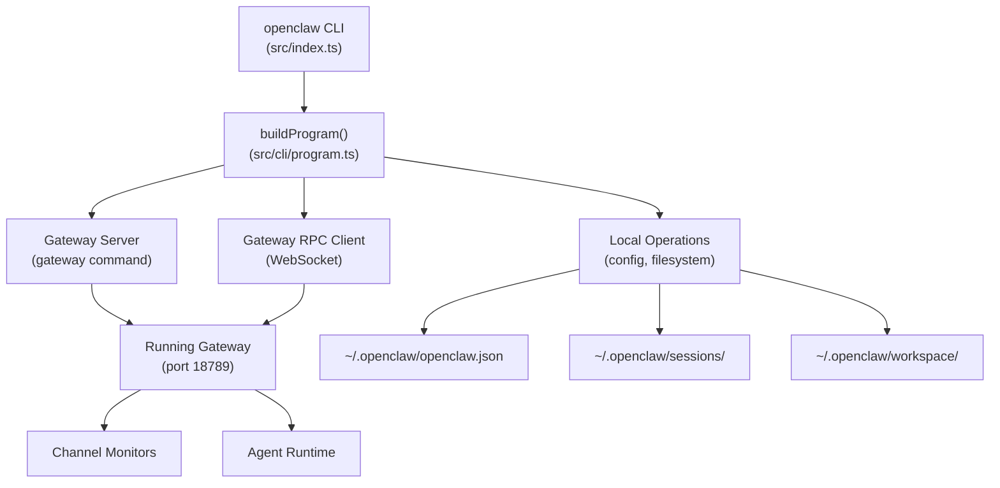
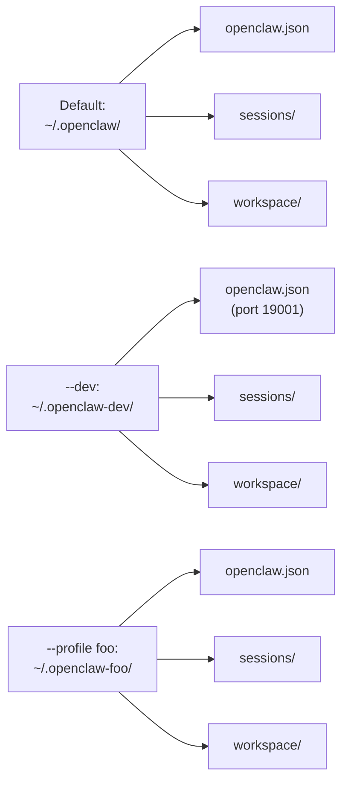
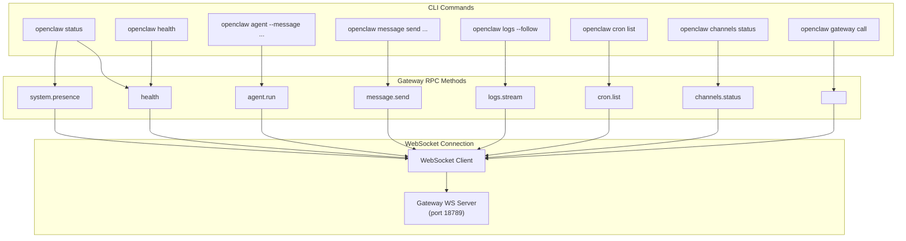
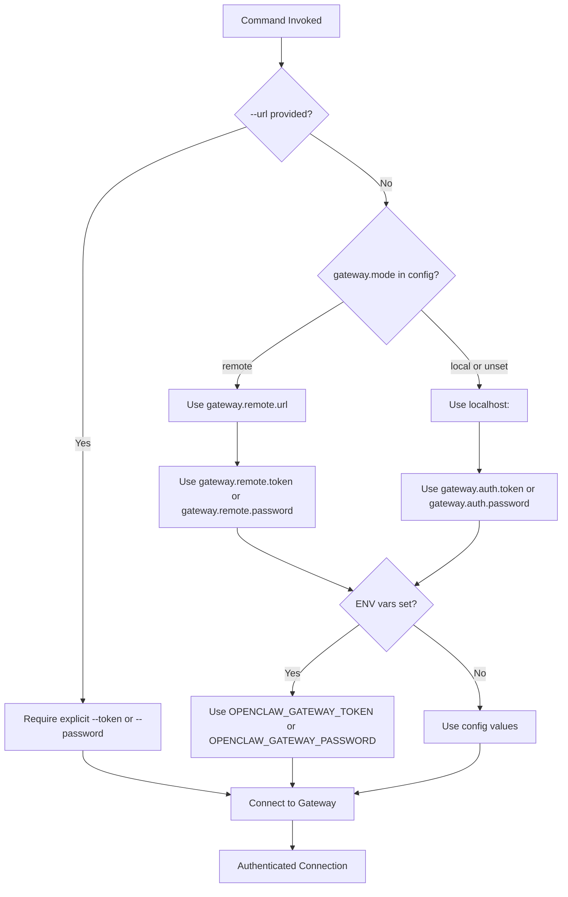
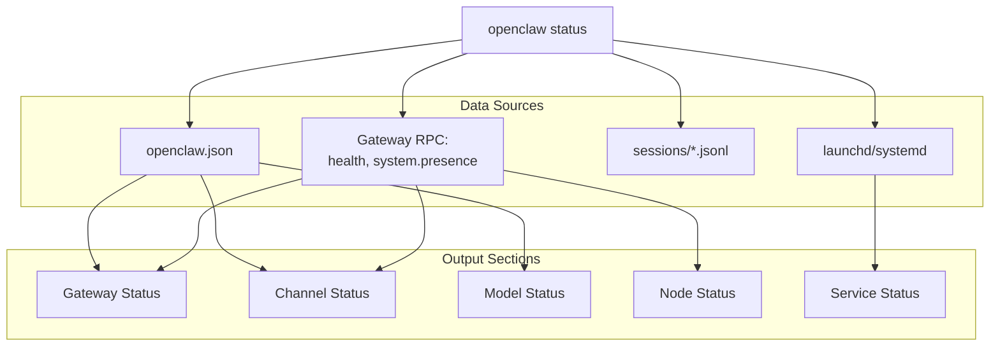

# Page: CLI Reference

# CLI Reference

<details>
<summary>Relevant source files</summary>

The following files were used as context for generating this wiki page:

- [README.md](README.md)
- [assets/avatar-placeholder.svg](assets/avatar-placeholder.svg)
- [docs/channels/zalo.md](docs/channels/zalo.md)
- [docs/channels/zalouser.md](docs/channels/zalouser.md)
- [docs/cli/index.md](docs/cli/index.md)
- [docs/docs.json](docs/docs.json)
- [docs/gateway/index.md](docs/gateway/index.md)
- [docs/gateway/troubleshooting.md](docs/gateway/troubleshooting.md)
- [docs/index.md](docs/index.md)
- [docs/start/getting-started.md](docs/start/getting-started.md)
- [docs/start/hubs.md](docs/start/hubs.md)
- [docs/start/onboarding.md](docs/start/onboarding.md)
- [docs/start/wizard.md](docs/start/wizard.md)
- [scripts/clawtributors-map.json](scripts/clawtributors-map.json)
- [scripts/update-clawtributors.ts](scripts/update-clawtributors.ts)
- [scripts/update-clawtributors.types.ts](scripts/update-clawtributors.types.ts)
- [src/config/config.ts](src/config/config.ts)
- [src/index.test.ts](src/index.test.ts)
- [src/index.ts](src/index.ts)
- [tsconfig.json](tsconfig.json)
- [ui/src/styles.css](ui/src/styles.css)
- [ui/src/styles/layout.mobile.css](ui/src/styles/layout.mobile.css)

</details>


The OpenClaw CLI provides a command-line interface to the Gateway and all subsystems. Commands are organized by functional category: gateway lifecycle, agent execution, channel management, model configuration, diagnostics, automation, and memory operations.

For detailed documentation of specific command groups, see:
- Gateway commands: [Gateway Commands](#12.1)
- Agent commands: [Agent Commands](#12.2)
- Channel commands: [Channel Commands](#12.3)
- Model commands: [Model Commands](#12.4)
- Configuration commands: [Configuration Commands](#12.5)
- Diagnostic commands: [Diagnostic Commands](#12.6)
- Memory commands: [Memory Commands](#12.7)
- Automation commands: [Automation Commands](#12.8)

For concepts related to the Gateway itself, see [Gateway](#3).

---

## CLI Architecture

The CLI is the primary operator interface for OpenClaw. All commands execute as a Node.js process that either:
1. Starts a long-running Gateway server
2. Performs local filesystem operations (config, sessions, workspace)
3. Invokes Gateway RPC methods over WebSocket



**Command Dispatch Flow**

Sources: [src/index.ts:1-94](), [src/cli/program.ts](), [docs/cli/index.md:1-54]()

---

## Global Flags and Environment

All commands support global flags that modify runtime behavior:

| Flag | Purpose | Default |
|------|---------|---------|
| `--dev` | Isolate state to `~/.openclaw-dev/`, shift ports by 1000 | disabled |
| `--profile <name>` | Isolate state to `~/.openclaw-<name>/` | none |
| `--no-color` | Disable ANSI color output | enabled in TTY |
| `--json` | Output structured JSON (where supported) | human-readable |
| `--verbose` | Enable verbose logging | disabled |
| `-V`, `--version`, `-v` | Print version and exit | - |

### State Isolation

The `--dev` and `--profile` flags modify the base directory for all state files:



**State Directory Resolution**

Sources: [src/config/paths.ts](), [src/infra/env.ts:19-21](), [docs/cli/index.md:56-61]()

---

## Command Structure and Hierarchy

Commands are organized into functional groups. Each group provides subcommands for specific operations.

### Root Commands

| Command | Purpose | Type |
|---------|---------|------|
| `setup` | Initialize config and workspace | Local |
| `onboard` | Interactive wizard for first-time setup | Local + RPC |
| `configure` | Interactive configuration editor | Local + RPC |
| `gateway` | Start Gateway server or manage service | Server/Service |
| `agent` | Execute single agent turn | RPC |
| `message` | Send messages via channels | RPC |
| `status` | Show system health and diagnostics | RPC |
| `health` | Query Gateway health endpoint | RPC |
| `doctor` | Diagnose and repair config/state issues | Local |

### Service Management Commands

| Command | Purpose | Supervisor |
|---------|---------|------------|
| `gateway install` | Install Gateway as system service | launchd/systemd/schtasks |
| `gateway start` | Start service | launchd/systemd/schtasks |
| `gateway stop` | Stop service | launchd/systemd/schtasks |
| `gateway restart` | Restart service | launchd/systemd/schtasks |
| `gateway status` | Show service and runtime status | launchd/systemd/schtasks |
| `gateway uninstall` | Remove service | launchd/systemd/schtasks |

Sources: [docs/cli/index.md:88-238](), [docs/gateway/index.md:90-99]()

---

## Command to RPC Method Mapping

Many CLI commands invoke Gateway RPC methods over WebSocket. The following diagram shows the mapping between CLI commands and RPC methods:



**CLI to Gateway RPC Layer**

The `gateway call` command provides direct access to any RPC method:

```bash
# Query config
openclaw gateway call config.get

# Apply config update
openclaw gateway call config.apply --params '{"config": {...}, "baseHash": "..."}'

# Trigger update
openclaw gateway call update.run --params '{"channel": "stable"}'
```

Sources: [docs/cli/index.md:720-735](), [docs/gateway/protocol.md](), [docs/gateway/index.md:196-207]()

---

## Authentication and Connection

Commands that interact with the Gateway require authentication. The CLI resolves credentials and connection details in the following order:



**Authentication Resolution Flow**

### Explicit URL Override

When `--url` is provided, no automatic credential resolution occurs:

```bash
# Must provide explicit auth
openclaw health --url ws://192.168.1.10:18789 --token abc123

# Error: missing credentials
openclaw health --url ws://192.168.1.10:18789
```

### Environment Variables

| Variable | Purpose |
|----------|---------|
| `OPENCLAW_GATEWAY_TOKEN` | Override gateway token |
| `OPENCLAW_GATEWAY_PASSWORD` | Override gateway password |
| `OPENCLAW_GATEWAY_PORT` | Override gateway port |
| `OPENCLAW_CONFIG_PATH` | Override config file path |
| `OPENCLAW_STATE_DIR` | Override state directory |
| `OPENCLAW_HOME` | Override home directory resolution |

Sources: [docs/cli/index.md:654-724](), [docs/gateway/authentication.md](), [docs/help/environment.md]()

---

## Output Formats

Commands support multiple output formats optimized for different use cases:

### Human-Readable (Default)

TTY sessions receive styled output with ANSI colors, progress indicators, and OSC-8 hyperlinks (where supported):

```bash
$ openclaw status
✓ Gateway: running (ws://127.0.0.1:18789)
  Uptime: 2h 34m
  Config: ~/.openclaw/openclaw.json
  Workspace: ~/.openclaw/workspace
  
✓ Channels
  whatsapp: connected (default)
  telegram: connected (default)
  
✓ Model: anthropic/claude-opus-4-6
  Provider: anthropic
  Auth: OAuth (expires in 89d)
```

### JSON Output

Machine-readable JSON for scripting and automation:

```bash
$ openclaw status --json
{
  "gateway": {
    "status": "running",
    "url": "ws://127.0.0.1:18789",
    "uptime": 9240000,
    "config": "/Users/user/.openclaw/openclaw.json"
  },
  "channels": {
    "whatsapp": { "status": "connected", "account": "default" },
    "telegram": { "status": "connected", "account": "default" }
  },
  "model": {
    "id": "anthropic/claude-opus-4-6",
    "provider": "anthropic"
  }
}
```

### Plain Text

Minimal output for piping and scripting:

```bash
$ openclaw models list --plain
anthropic/claude-opus-4-6
anthropic/claude-sonnet-4
openai/gpt-4.5-turbo
openai/o1
```

Sources: [docs/cli/index.md:63-70](), [src/terminal/palette.ts]()

---

## Command Categories

### Configuration Management

Commands for managing `~/.openclaw/openclaw.json`:

| Command | Purpose | Examples |
|---------|---------|----------|
| `config get <path>` | Read config value | `openclaw config get gateway.port` |
| `config set <path> <value>` | Write config value | `openclaw config set gateway.port 18790` |
| `config unset <path>` | Remove config value | `openclaw config unset channels.telegram` |
| `configure` | Interactive config wizard | `openclaw configure --section channels` |

Sources: [docs/cli/index.md:349-359](), [src/config/config.ts:1-15]()

### Session Management

Commands for inspecting conversation sessions:

| Command | Purpose |
|---------|---------|
| `sessions` | List all sessions with activity |
| `sessions --active 60` | Sessions active in last 60 minutes |
| `sessions --store <path>` | Use alternate session store |

Sessions are stored as JSONL transcripts in `~/.openclaw/sessions/`:

```bash
$ ls ~/.openclaw/sessions/
main.jsonl
group-discord-guild-123456.jsonl
whatsapp:+15555550123.jsonl
```

Sources: [docs/cli/index.md:605-615](), [docs/concepts/session.md](), [src/config/sessions.ts]()

### Gateway Operations

Commands for Gateway lifecycle and diagnostics:

| Command | Purpose | Output |
|---------|---------|--------|
| `gateway status` | Service and runtime status | Service state, RPC probe, config paths |
| `gateway status --deep` | Extended diagnostics | + System service scan |
| `gateway status --no-probe` | Skip RPC probe | Service state only |
| `gateway install` | Install service | Service label, plist/unit path |
| `gateway restart` | Restart service | Action confirmation |

Sources: [docs/cli/index.md:654-699](), [docs/gateway/index.md:56-99]()

### Agent Execution

Execute agent turns directly from the CLI:

```bash
# Single turn, print to stdout
openclaw agent --message "List open PRs" --thinking high

# Execute and deliver to channel
openclaw agent --message "Deploy status?" --to +15555550123 --deliver

# Use specific session
openclaw agent --message "Continue" --session-id "project-review"

# Local execution (no Gateway)
openclaw agent --message "Summarize CHANGELOG" --local
```

Sources: [docs/cli/index.md:499-515](), [docs/tools/agent-send.md]()

### Messaging

Send messages and perform channel actions:

```bash
# Send text message
openclaw message send --target +15555550123 --message "Hello"

# React to message
openclaw message react --channel discord --target channel:123 --message-id 456 --emoji "👍"

# Create thread
openclaw message thread create --channel discord --target channel:123 --name "Bug Discussion"

# Poll
openclaw message poll --channel discord --target channel:123 \
  --poll-question "Lunch?" \
  --poll-option "Pizza" \
  --poll-option "Sushi"
```

Sources: [docs/cli/index.md:474-496](), [docs/cli/message.md]()

---

## Diagnostic Commands

### Status Command

The `status` command provides a comprehensive system overview:



**Status Command Data Flow**

Options:
- `--json`: Machine-readable output
- `--all`: Full diagnosis (includes service scan)
- `--deep`: Probe channels with live checks
- `--usage`: Include provider usage/quota
- `--verbose`: Extended diagnostic output

Sources: [docs/cli/index.md:562-593](), [docs/gateway/health.md]()

### Doctor Command

The `doctor` command performs automated diagnostics and repairs:

```bash
# Basic health check
openclaw doctor

# Deep scan (includes service audit)
openclaw doctor --deep

# Auto-fix without prompts
openclaw doctor --yes --non-interactive

# Skip workspace suggestions
openclaw doctor --no-workspace-suggestions
```

Doctor checks:
- Config file validity and schema compliance
- Legacy config migration
- Gateway service configuration
- Port conflicts
- Authentication configuration
- Channel credential integrity
- Session store integrity

Sources: [docs/cli/index.md:360-370](), [docs/gateway/doctor.md]()

---

## Model and Provider Commands

### Model Selection

```bash
# Set primary model
openclaw models set anthropic/claude-opus-4-6

# Set image model
openclaw models set-image openai/gpt-4.5-turbo

# List available models
openclaw models list --provider anthropic

# Status with auth check
openclaw models status --probe
```

### Auth Management

```bash
# Interactive auth setup
openclaw models auth add

# Setup OAuth token (recommended for Anthropic)
openclaw models auth setup-token --provider anthropic

# Paste manual token
openclaw models auth paste-token --provider anthropic --profile-id manual --expires-in 90d

# Profile ordering
openclaw models auth order get --provider anthropic
openclaw models auth order set --provider anthropic profile1 profile2
```

Sources: [docs/cli/index.md:747-859](), [docs/concepts/models.md](), [docs/concepts/oauth.md]()

---

## Automation Commands

### Cron Jobs

Schedule periodic agent executions:

```bash
# List jobs
openclaw cron list

# Add job
openclaw cron add --name "morning-brief" \
  --at "08:00" \
  --message "Daily briefing" \
  --target +15555550123

# Run job immediately
openclaw cron run <id> --force

# View run history
openclaw cron runs --id <id> --limit 20
```

Sources: [docs/cli/index.md:895-910](), [docs/automation/cron-jobs.md]()

### Webhooks

```bash
# Setup Gmail Pub/Sub
openclaw webhooks gmail setup \
  --account user@example.com \
  --project my-project \
  --topic openclaw-gmail

# Run webhook listener
openclaw webhooks gmail run --port 8080
```

Sources: [docs/cli/index.md:455-463](), [docs/automation/webhook.md](), [docs/automation/gmail-pubsub.md]()

---

## Channel Commands

### Channel Management

```bash
# List configured channels
openclaw channels list

# Status with live probes
openclaw channels status --probe

# Add channel (interactive)
openclaw channels add

# Add channel (non-interactive)
openclaw channels add --channel telegram --token $BOT_TOKEN

# Login (WhatsApp QR)
openclaw channels login --channel whatsapp

# View logs
openclaw channels logs --channel telegram --lines 100
```

Sources: [docs/cli/index.md:373-427](), [docs/channels/index.md]()

### Pairing Approval

For channels with `dmPolicy: "pairing"`:

```bash
# List pending approvals
openclaw pairing list whatsapp

# Approve sender
openclaw pairing approve whatsapp ABC123 --notify
```

Sources: [docs/cli/index.md:446-454](), [docs/channels/pairing.md]()

---

## Memory Commands

Vector search over workspace memory files:

```bash
# Index memory files
openclaw memory index

# Search
openclaw memory search "authentication implementation"

# Status
openclaw memory status
```

Memory files:
- `~/.openclaw/workspace/MEMORY.md`
- `~/.openclaw/workspace/memory/*.md`

Sources: [docs/cli/index.md:260-267](), [docs/concepts/memory.md]()

---

## Node Commands

Manage device nodes (macOS/iOS/Android):

```bash
# List paired nodes
openclaw nodes status

# Node capabilities
openclaw nodes describe --node <id>

# Invoke node capability
openclaw nodes invoke --node <id> --capability camera.snap

# Approvals
openclaw approvals get --node <id>
openclaw approvals set --node <id> --exec-policy prompt
```

Sources: [docs/cli/index.md:913-920](), [docs/nodes/index.md]()

---

## Browser Commands

Control the OpenClaw browser instance:

```bash
# Start browser
openclaw browser start --profile openclaw

# Status
openclaw browser status

# List tabs
openclaw browser tabs

# Navigate
openclaw browser navigate --url https://example.com

# Screenshot
openclaw browser screenshot --output screenshot.png
```

Sources: [docs/cli/index.md:192-221](), [docs/tools/browser.md]()

---

## Examples and Common Patterns

### Complete Setup Flow

```bash
# 1. Install
npm install -g openclaw@latest

# 2. Onboard
openclaw onboard --install-daemon

# 3. Verify
openclaw gateway status
openclaw status --deep

# 4. Send test message
openclaw agent --message "System check" --verbose
```

### Remote Gateway Access

```bash
# Configure remote mode
openclaw config set gateway.mode remote
openclaw config set gateway.remote.url ws://192.168.1.10:18789
openclaw config set gateway.remote.token abc123

# Verify connection
openclaw health
openclaw status
```

### Multi-Agent Setup

```bash
# Add isolated agent
openclaw agents add work-assistant \
  --workspace ~/.openclaw/workspace-work \
  --model anthropic/claude-opus-4-6 \
  --bind whatsapp:work

# List agents
openclaw agents list --bindings
```

### Diagnostics Workflow

```bash
# 1. Quick check
openclaw status

# 2. Channel probe
openclaw channels status --probe

# 3. Deep diagnosis
openclaw doctor --deep

# 4. View logs
openclaw logs --follow
```

Sources: [docs/cli/index.md:1-240](), [docs/start/getting-started.md:30-77](), [README.md:58-76]()

---

## Plugin Commands

Extensions can add top-level commands:

```bash
# Example: voice-call plugin
openclaw voicecall status
openclaw voicecall dial --number +15555550123

# Plugin management
openclaw plugins list
openclaw plugins install @openclaw/voice-call
openclaw plugins enable voice-call
```

Sources: [docs/cli/index.md:249-259](), [docs/tools/plugin.md]()

---

## Exit Codes

The CLI uses standard exit codes:

| Code | Meaning |
|------|---------|
| `0` | Success |
| `1` | General error |
| `2` | Invalid arguments or configuration |

For scripting, use `--json` output and check exit codes:

```bash
if openclaw health --json > /dev/null 2>&1; then
  echo "Gateway is healthy"
else
  echo "Gateway is down"
  exit 1
fi
```

Sources: [src/index.ts:84-92]()

---