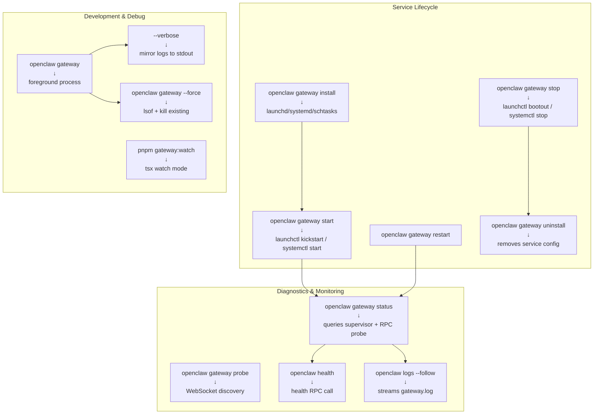
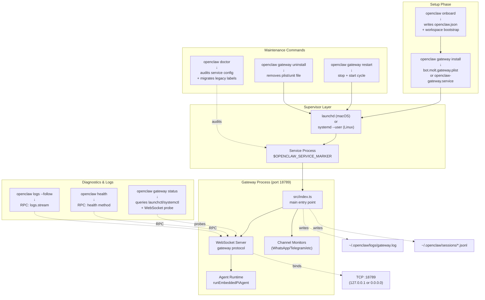
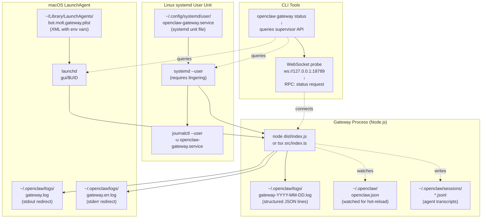
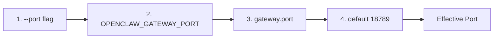

# Page: Gateway Commands

# Gateway Commands

<details>
<summary>Relevant source files</summary>

The following files were used as context for generating this wiki page:

- [README.md](README.md)
- [assets/avatar-placeholder.svg](assets/avatar-placeholder.svg)
- [docs/channels/zalo.md](docs/channels/zalo.md)
- [docs/channels/zalouser.md](docs/channels/zalouser.md)
- [docs/cli/index.md](docs/cli/index.md)
- [docs/docs.json](docs/docs.json)
- [docs/gateway/index.md](docs/gateway/index.md)
- [docs/gateway/troubleshooting.md](docs/gateway/troubleshooting.md)
- [docs/index.md](docs/index.md)
- [docs/start/getting-started.md](docs/start/getting-started.md)
- [docs/start/hubs.md](docs/start/hubs.md)
- [docs/start/onboarding.md](docs/start/onboarding.md)
- [docs/start/wizard.md](docs/start/wizard.md)
- [scripts/clawtributors-map.json](scripts/clawtributors-map.json)
- [scripts/update-clawtributors.ts](scripts/update-clawtributors.ts)
- [scripts/update-clawtributors.types.ts](scripts/update-clawtributors.types.ts)
- [src/config/config.ts](src/config/config.ts)
- [src/index.test.ts](src/index.test.ts)
- [src/index.ts](src/index.ts)
- [tsconfig.json](tsconfig.json)
- [ui/src/styles.css](ui/src/styles.css)
- [ui/src/styles/layout.mobile.css](ui/src/styles/layout.mobile.css)

</details>


This page documents the `openclaw gateway` subcommands for managing the Gateway service lifecycle, including installation, supervision, status checks, and debugging. For Gateway server internals and protocol details, see [Gateway Configuration](#3.1) and [Gateway Protocol](#3.2). For general diagnostic commands, see [Diagnostic Commands](#12.6).

## Command Overview

The `openclaw gateway` command group manages the Gateway process, which is the always-on hub for channels, agents, and the control plane. The Gateway binds to a WebSocket/HTTP port (default 18789) and handles all messaging channel connections, agent execution requests, and Control UI access.

**Key responsibilities:**
- Service installation and supervision (launchd/systemd/schtasks)
- Process lifecycle management (start, stop, restart)
- Health monitoring and diagnostics
- Network binding and auth validation

Related command groups:
- **Session/agent runtime**: [Agent Commands](#12.2)
- **Channel setup**: [Channel Commands](#12.3)
- **Configuration editing**: [Configuration Commands](#12.5)

## Command Categories



**Command-to-Code Mapping:**

| Command | Code Entry Points | Config Keys |
|---------|------------------|-------------|
| `gateway install` | [src/cli/program.ts]() service setup | `gateway.port`, `gateway.bind` |
| `gateway start/stop/restart` | [src/cli/program.ts]() supervisor calls | Service metadata env vars |
| `gateway status` | [src/cli/program.ts]() → status RPC | `gateway.mode`, `gateway.remote.url` |
| `gateway` (foreground) | [src/index.ts:75-93]() main entry | `gateway.reload.mode` |
| `logs --follow` | [src/cli/program.ts]() → logs RPC | Log file paths in state dir |

Sources: [docs/gateway/index.md:88-100](), [src/index.ts:75-93](), [docs/cli/index.md:136-147]()

## Service Lifecycle Commands

### `openclaw gateway install`

Installs the Gateway as a supervised service. Creates platform-specific service definitions and sets up automatic restart on failure.

**Platform behaviors:**
- **macOS**: Writes `~/Library/LaunchAgents/bot.molt.<profile>.plist` (or `bot.molt.gateway` for default profile). Legacy `com.openclaw.*` labels are migrated automatically.
- **Linux/WSL2**: Writes `~/.config/systemd/user/openclaw-gateway[-<profile>].service` and enables user lingering.
- **Windows**: Creates a scheduled task `OpenClaw Gateway (<profile>)`.

**Options:**
| Flag | Purpose | Notes |
|------|---------|-------|
| `--force` | Reinstall service | Rewrites service config with current defaults |
| `--profile <name>` | Install for named profile | Uses profile-specific state dir and service label |
| `--dev` | Install dev instance | Uses `~/.openclaw-dev` state and port 19001 |

**Service metadata** (embedded in service configs):
- `OPENCLAW_SERVICE_MARKER=openclaw`
- `OPENCLAW_SERVICE_KIND=gateway`
- `OPENCLAW_SERVICE_VERSION=<version>`

**Examples:**
```bash
# Default install (main profile)
openclaw gateway install

# Named profile install
openclaw --profile rescue gateway install

# Force reinstall after config changes
openclaw gateway install --force

# Dev profile
openclaw --dev gateway install
```

**Post-install steps:**
1. Verify service state: `openclaw gateway status`
2. Check logs: `openclaw logs --follow`
3. Confirm Gateway RPC: `openclaw health`

**Lingering (Linux only):**
The installer enables systemd lingering (`loginctl enable-linger`) so the user service survives logout. May prompt for sudo. This is required for user services to remain active after the user logs out.

**Service markers:**
The installer embeds metadata in service configs for diagnostics:
- `OPENCLAW_SERVICE_MARKER=openclaw` (identifies as OpenClaw service)
- `OPENCLAW_SERVICE_KIND=gateway` (distinguishes from node services)
- `OPENCLAW_SERVICE_VERSION=<version>` (tracks install version)

The `openclaw doctor` command uses these markers to detect and repair service config drift.

Sources: [docs/gateway/index.md:122-149](), [docs/gateway/index.md:198-245]()

---

### `openclaw gateway start`

Starts the supervised Gateway service. No-op if already running. The CLI delegates to the platform-specific supervisor.

**Platform implementations:**

| Platform | Supervisor | Command | Notes |
|----------|------------|---------|-------|
| macOS | launchd | `launchctl kickstart -k gui/$UID/bot.molt.gateway` | `-k` flag forces restart if already loaded |
| Linux/WSL2 | systemd | `systemctl --user start openclaw-gateway.service` | User service requires lingering |
| Windows | Task Scheduler | `schtasks /Run /TN "OpenClaw Gateway (main)"` | Runs scheduled task immediately |

**Validation behavior:**
The command blocks until the supervisor reports the process state as "running". It does **not** wait for the Gateway WebSocket to be reachable. Use `openclaw gateway status` to confirm RPC connectivity.

**Startup sequence:**
1. CLI resolves service label from profile (e.g., `bot.molt.gateway` for default)
2. CLI calls platform supervisor API to start service
3. Supervisor launches process with service env vars
4. Gateway process binds to configured port
5. Gateway initializes channels and starts monitoring

If startup fails, check:
- `openclaw logs --follow` for bind errors or config issues
- `openclaw gateway status` for supervisor state vs. RPC probe mismatch
- `openclaw doctor` for service config drift

Sources: [docs/gateway/index.md:122-149](), [docs/gateway/troubleshooting.md:95-120]()

---

### `openclaw gateway stop`

Stops the supervised Gateway service. Sends `SIGTERM` to the process and waits for clean shutdown.

**Platform commands (reference):**
```bash
# macOS
launchctl bootout gui/$UID/bot.molt.gateway

# Linux
systemctl --user stop openclaw-gateway.service

# Windows
schtasks /End /TN "OpenClaw Gateway (main)"
```

**Shutdown behavior:**
- Gateway emits `shutdown` event to connected clients with `reason` and optional `restartExpectedMs`.
- Active agent runs receive abort signals.
- WebSocket connections close gracefully.

**Force stop (manual):**
If the service is unresponsive, find the PID and send `SIGKILL`:
```bash
lsof -nP -iTCP:18789 -sTCP:LISTEN
kill -9 <PID>
```

Sources: [docs/gateway/index.md:636-658](), [docs/gateway/index.md:213-223]()

---

### `openclaw gateway restart`

Restarts the supervised Gateway service. Equivalent to `stop` followed by `start`.

**Use cases:**
- Apply config changes that require full restart (bind address, port, auth mode)
- Recover from hung state
- Force reconnection of all channels

**In-process restart alternative:**
For config hot-reloads, the Gateway supports `SIGUSR1` for in-process restart when authorized. The service automatically triggers this for safe config changes when `gateway.reload.mode="hybrid"` (default).

Sources: [docs/gateway/index.md:213-223](), [docs/gateway/index.md:27-33]()

---

### `openclaw gateway uninstall`

Removes the supervised service. Stops the process and deletes service configuration files. Does **not** delete workspace, sessions, or credentials.

**Platform cleanup:**
- **macOS**: Removes `~/Library/LaunchAgents/bot.molt.<profile>.plist`
- **Linux**: Disables and removes `openclaw-gateway[-<profile>].service`
- **Windows**: Deletes scheduled task

**Manual cleanup (if needed):**
```bash
# macOS - remove all OpenClaw LaunchAgents
launchctl bootout gui/$UID/bot.molt.gateway
rm ~/Library/LaunchAgents/bot.molt.*.plist

# Linux - remove all OpenClaw user services
systemctl --user stop openclaw-gateway*.service
systemctl --user disable openclaw-gateway*.service
rm ~/.config/systemd/user/openclaw-gateway*.service
```

Sources: [docs/gateway/index.md:213-237]()

## Diagnostics Commands

### `openclaw gateway status`

Reports Gateway service state, RPC reachability, and config/probe targets. This is the **primary diagnostic command** for Gateway health checks.

**Output sections:**

| Section | Content | Purpose | Source |
|---------|---------|---------|--------|
| **Runtime** | Supervisor state (running/stopped/not installed), PID, exit code | Confirms service process is alive | launchd/systemd query |
| **Config (cli)** | Port, bind mode, auth, state dir resolved by CLI | Shows what the CLI expects | Config resolution from `~/.openclaw/openclaw.json` |
| **Config (service)** | Port, bind mode, auth, state dir used by service | Shows what the service actually uses | Service env vars (plist/unit file) |
| **Probe target** | URL the CLI probed | Clarifies localhost vs LAN IP | Derived from `gateway.bind` + `gateway.port` |
| **RPC probe** | Success/failure of `status` RPC call | Confirms Gateway WebSocket is reachable | WebSocket connect + RPC response |
| **Last gateway error** | Last logged error from Gateway (when port is closed but service running) | Root cause for bind failures | Tail of `gateway.log` or `gateway.err.log` |

**Flags:**

| Flag | Purpose | Behavior |
|------|---------|----------|
| `--deep` | Run health checks | Calls `health` RPC, includes provider probes |
| `--no-probe` | Skip RPC probe | Useful when networking is down |
| `--json` | Stable JSON output | For scripts and automation |
| `--url <url>` | Override probe target | Test specific Gateway instance |
| `--profile <name>` | Check named profile | Targets profile-specific service |

**Example output:**
```
Runtime: running (PID 12345)
Config (cli):    port=18789 bind=loopback auth=token stateDir=~/.openclaw
Config (service): port=18789 bind=loopback auth=token stateDir=~/.openclaw
Probe target: ws://127.0.0.1:18789
RPC probe: ok (status call succeeded)
```

**Common issues detected:**
- **Config mismatch**: CLI and service use different ports/state dirs (profile confusion)
- **Port closed, service running**: Last gateway error shows bind failure or auth refusal
- **Supervisor issues**: Service config outdated (run `openclaw doctor` to fix)

**Diagnostic workflow:**
```mermaid
sequenceDiagram
    participant CLI["CLI<br/>(src/cli/program.ts)"]
    participant Supervisor["Supervisor<br/>(launchctl/systemctl)"]
    participant Gateway["Gateway Process<br/>(port 18789)"]
    participant LogFile["~/.openclaw/logs/<br/>gateway.log"]
    
    CLI->>Supervisor: "Query service state"
    Supervisor-->>CLI: "PID 12345, running"
    
    CLI->>CLI: "Resolve config paths<br/>~/.openclaw/openclaw.json"
    CLI->>CLI: "Parse service env vars<br/>from plist/unit file"
    
    CLI->>Gateway: "WebSocket connect<br/>ws://127.0.0.1:18789"
    CLI->>Gateway: "RPC: status request"
    
    alt "RPC success"
        Gateway-->>CLI: "{ ok: true, uptime: 3600 }"
        CLI->>CLI: "Display: RPC probe: ok"
    else "RPC failure (ECONNREFUSED)"
        CLI->>LogFile: "tail -n 1 gateway.log"
        LogFile-->>CLI: "refusing to bind gateway ... without auth"
        CLI->>CLI: "Display: Last error +<br/>diagnosis hint"
    end
    
    CLI->>CLI: "Compare cli vs service config"
    alt "Mismatch detected"
        CLI->>CLI: "Warn: profile mismatch<br/>or stale service config"
    end
```

**Exit code behavior:**
- **0**: All checks passed (service running, RPC reachable)
- **1**: Service stopped or RPC unreachable (error details in stderr)
- **JSON mode** (`--json`): Always exits 0, check `status` field in output

Sources: [docs/gateway/index.md:213-237](), [docs/gateway/troubleshooting.md:16-32](), [docs/gateway/troubleshooting.md:196-230]()

---

### `openclaw gateway probe`

Discovers and probes Gateway instances on the network. Reports reachability for local and remote targets.

**Discovery mechanisms:**
- **Loopback**: Checks `127.0.0.1:<port>` (from config or default 18789)
- **LAN**: Resolves bind addresses (`lan`/`tailnet`/`custom` modes)
- **Remote**: Tests configured `gateway.remote.url`
- **Bonjour (macOS)**: Discovers `_openclaw._tcp` mDNS services

**Probe flow:**
1. Resolve potential Gateway URLs from config
2. Attempt WebSocket connect to each target
3. Call `status` RPC to verify protocol compatibility
4. Report latency and version for reachable instances

**Output format:**
```
Target                          | Status | Latency | Version
ws://127.0.0.1:18789            | ok     | 2ms     | 0.5.0
ws://192.168.1.100:18789        | fail   | -       | -
ws://gateway.example.com        | ok     | 45ms    | 0.5.0
```

**Use cases:**
- **Multi-instance setup**: Confirm which Gateway the CLI is targeting
- **Remote debugging**: Verify tunnel or Tailscale connectivity
- **Profile confusion**: Distinguish between overlapping Gateway ports

Sources: [docs/gateway/troubleshooting.md:25](), [docs/gateway/index.md:103-109]()

## Development Commands

### `openclaw gateway [options]`

Runs the Gateway in foreground mode (no supervisor). Useful for development, debugging, and quick tests without installing a service. This invokes the main Gateway entry point at [src/index.ts:75-93]().

**Process lifecycle:**
1. Loads config from `~/.openclaw/openclaw.json` (or `OPENCLAW_CONFIG_PATH`)
2. Resolves port/bind/auth from config + env + flags
3. Validates `gateway.mode=local` (unless `--allow-unconfigured`)
4. Starts WebSocket server on resolved port
5. Initializes channel monitors
6. Enters event loop (blocks until SIGTERM/SIGINT)

**Options:**

| Flag | Purpose | Precedence/Behavior | Code Reference |
|------|---------|---------------------|----------------|
| `--port <port>` | Override listen port | `--port` > `OPENCLAW_GATEWAY_PORT` > `gateway.port` > 18789 | [src/index.ts]() port resolution |
| `--verbose` | Mirror debug logs to stdout | Streams `gateway.log` to console in real-time | [src/logging.ts]() console capture |
| `--force` | Kill existing listeners | Runs `lsof -nP -iTCP:<port>` + SIGTERM on found PIDs | [src/infra/ports.ts]() |
| `--allow-unconfigured` | Skip `gateway.mode` check | Bypasses local mode validation (dev/testing only) | Config validation |
| `--bind <mode>` | Override bind mode | `loopback` \| `lan` \| `tailnet` \| `custom` | [src/config/types.ts]() |
| `--token <token>` | Override auth token | Sets `gateway.auth.token` at runtime | Auth override |
| `--tailscale <mode>` | Tailscale exposure | `off` \| `serve` \| `funnel` | [docs/gateway/tailscale.md]() |

**Port precedence hierarchy:**


**Examples:**
```bash
# Default foreground run
openclaw gateway --port 18789

# Verbose debug output
openclaw gateway --verbose

# Force kill listeners and start
openclaw gateway --force

# Dev mode (bypass mode check)
openclaw --dev gateway --allow-unconfigured
```

**Signal handling:**

| Signal | Handler | Behavior | Exit Code |
|--------|---------|----------|-----------|
| **SIGTERM** | Graceful shutdown | Emits `shutdown` WS event, closes channels, waits for in-flight requests | 143 (normal) |
| **SIGINT** | Graceful shutdown | Same as SIGTERM (triggered by Ctrl-C in foreground) | 130 |
| **SIGUSR1** | In-process restart | Hot-reload config when `gateway.reload.mode` allows (no port rebind) | N/A (continues) |
| **SIGHUP** | Ignored | No-op (prevents accidental exit on shell disconnect) | N/A |

**Shutdown sequence:**
1. Stop accepting new WebSocket connections
2. Broadcast `shutdown` event to connected clients with `reason` and `restartExpectedMs`
3. Cancel in-progress agent runs (emit `agent` events with `status:"cancelled"`)
4. Close channel monitors (WhatsApp/Telegram/Discord graceful disconnect)
5. Flush logs
6. Exit with code 0 (clean) or 1 (error during shutdown)

**Exit code 143** is the standard exit code for SIGTERM (128 + 15) and is **not a crash**. Supervisors (launchd/systemd) expect this on stop.

Sources: [docs/gateway/index.md:18-47](), [src/index.ts:84-92]()

---

### `openclaw gateway --force`

Terminates existing processes listening on the Gateway port before starting. Useful when stale processes block the port or during rapid dev iteration.

**Implementation:**
1. Runs `lsof -nP -iTCP:<port> -sTCP:LISTEN` to enumerate PIDs on target port
2. For each PID found:
   - Logs process name and PID
   - Sends `SIGTERM` (graceful) to PID
   - Waits 2 seconds for process to exit
   - If still alive, sends `SIGKILL` (forceful)
3. Verifies port is free with `ensurePortAvailable()`
4. Proceeds with normal Gateway startup

**Code path:** [src/infra/ports.ts]() `handlePortError()` and `ensurePortAvailable()`

**Failure modes:**

| Condition | Behavior | Exit Code |
|-----------|----------|-----------|
| `lsof` not found | Prints error + fallback instructions | 1 |
| Multiple listeners | Terminates all (warns if count > 1) | Continues |
| Permission denied (other user) | Cannot kill, suggests `sudo lsof` + manual kill | 1 |
| Port still blocked after kill | Prints `EADDRINUSE` error + retry suggestion | 1 |

**Safety notes:**
- Terminates **any** process on the port, not just OpenClaw (use `lsof` output to verify target)
- Supervised services (launchd/systemd) will respawn killed processes (stop service first with `openclaw gateway stop`)
- Prefer `openclaw gateway stop` for supervised instances (cleaner shutdown)

**Common use cases:**
- Dev workflow: `openclaw gateway --force` after crash leaves port open
- Hung process: `openclaw gateway --force` when `stop` command times out
- Port conflict: `openclaw gateway --force` when another app grabbed the port

Sources: [docs/gateway/index.md:41-43](), [src/infra/ports.ts:24-51]()

---

### `pnpm gateway:watch`

Runs the Gateway with automatic reload on TypeScript changes. Development-only workflow for rapid iteration without reinstalling the service.

**Requirements:**
- Repo clone with `pnpm install` complete
- TypeScript build tools available (`tsx`, `tsc`)

**Implementation:**
Uses `tsx watch` to monitor `src/**/*.ts` files. On changes:
1. Sends SIGTERM to current Gateway process
2. Waits for clean shutdown
3. Rebuilds TypeScript (if watch mode configured)
4. Restarts Gateway with same flags

**Behavior:**
- Watches `src/**/*.ts` for changes (debounced 300ms)
- Rebuilds and restarts Gateway on file save
- **Does not preserve** WebSocket connections (full restart)
- Preserves session state (JSONL transcripts unchanged)

**Alternatives for quick restarts:**

| Approach | Command | Pros | Cons |
|----------|---------|------|------|
| Manual kill + restart | `pkill -TERM -f "openclaw gateway" && openclaw gateway --verbose` | Full control | Manual |
| SIGUSR1 in-process reload | `kill -USR1 <gateway-pid>` | Keeps WS connections | Only reloads config, not code |
| Supervisor restart | `openclaw gateway restart` | Uses service mgmt | Slower than manual |

**Dev workflow example:**
```bash
# Terminal 1: Watch mode
pnpm gateway:watch

# Terminal 2: Test changes
openclaw health
openclaw message send --target +15555550123 --message "test"

# Edit src/index.ts → auto-restarts in Terminal 1
```

Sources: [docs/gateway/index.md:101-102](), [package.json]() scripts section

## Command Flow Diagram

**Lifecycle: Setup → Runtime → Maintenance**



Sources: [docs/gateway/index.md:18-298](), [src/index.ts:75-93]()

## Service Management Architecture

**Platform-Specific Supervisor Integration**



**Service Config Keys:**

| Platform | Config Path | Environment Variables | Restart Behavior |
|----------|-------------|----------------------|------------------|
| macOS | `~/Library/LaunchAgents/bot.molt.gateway.plist` | `OPENCLAW_SERVICE_MARKER=openclaw`<br/>`OPENCLAW_SERVICE_KIND=gateway` | KeepAlive + ThrottleInterval |
| Linux | `~/.config/systemd/user/openclaw-gateway.service` | `Environment="OPENCLAW_SERVICE_MARKER=openclaw"`<br/>`Environment="OPENCLAW_SERVICE_KIND=gateway"` | Restart=on-failure<br/>RestartSec=5 |
| Windows | Task Scheduler entry | Embedded in task XML | On failure, restart delay 1 min |

Sources: [docs/gateway/index.md:198-298](), [docs/gateway/index.md:122-149]()

## Environment and Configuration

### Port Resolution

The Gateway resolves its listen port using this precedence chain:



Sources: [docs/gateway/index.md:47]()

### Profile Isolation

```mermaid
graph TB
    subgraph "Default Profile"
        defaultState["~/.openclaw/"]
        defaultConfig["openclaw.json"]
        defaultService["bot.molt.gateway"]
        defaultPort["port: 18789"]
    end
    
    subgraph "Named Profile (rescue)"
        rescueState["~/.openclaw-rescue/"]
        rescueConfig["openclaw.json"]
        rescueService["bot.molt.rescue"]
        rescuePort["port: 19789"]
    end
    
    subgraph "Dev Profile (--dev)"
        devState["~/.openclaw-dev/"]
        devConfig["openclaw.json"]
        devService["bot.molt.dev"]
        devPort["port: 19001"]
    end
    
    CLI["openclaw"]
    CLIRescue["openclaw --profile rescue"]
    CLIDev["openclaw --dev"]
    
    CLI -.reads.-> defaultState
    CLIRescue -.reads.-> rescueState
    CLIDev -.reads.-> devState
    
    defaultService -.runs.-> defaultPort
    rescueService -.runs.-> rescuePort
    devService -.runs.-> devPort
```



**Profile selection:**
- **Default**: No flags, uses `~/.openclaw/`
- **Named**: `--profile <name>` uses `~/.openclaw-<name>/`
- **Dev**: `--dev` shortcut for `~/.openclaw-dev/` with port 19001

**Service naming:**
- macOS: `bot.molt.<profile>` (legacy: `com.openclaw.<profile>`)
- Linux: `openclaw-gateway-<profile>.service`
- Windows: `OpenClaw Gateway (<profile>)`

Sources: [docs/gateway/index.md:59-127]()

## Common Workflows

### Initial Setup

```bash
# 1. Install OpenClaw
npm install -g openclaw

# 2. Run onboarding (creates config + installs service)
openclaw onboard --install-daemon

# 3. Verify service is running
openclaw gateway status

# 4. Check Gateway health
openclaw health
```

### Troubleshooting Non-Responsive Service

```bash
# 1. Check service state + last error
openclaw gateway status

# 2. Read recent logs
openclaw logs --limit 100

# 3. If config mismatch detected, run doctor
openclaw doctor

# 4. Force reinstall service with current config
openclaw gateway install --force

# 5. Restart service
openclaw gateway restart

# 6. Confirm RPC reachability
openclaw gateway status
```

### Dev Instance Setup

```bash
# 1. Create isolated dev profile
openclaw --dev setup

# 2. Install dev service (port 19001)
openclaw --dev gateway install

# 3. Start dev Gateway in foreground for debugging
openclaw --dev gateway --verbose

# 4. Check dev status
openclaw --dev status
```

### Rescue Bot Pattern

For a second Gateway instance that runs alongside the main instance:

```bash
# 1. Create rescue profile
openclaw --profile rescue onboard

# 2. Edit config: use port 19789, separate workspace
openclaw --profile rescue config set gateway.port 19789
openclaw --profile rescue config set agents.defaults.workspace ~/.openclaw/workspace-rescue

# 3. Install rescue service
openclaw --profile rescue gateway install

# 4. Verify both instances
openclaw gateway status
openclaw --profile rescue gateway status

# 5. Test rescue via control UI
open http://127.0.0.1:19789/
```

Sources: [docs/gateway/index.md:59-127]()

## Exit Codes and Signals

| Exit Code | Meaning | Action |
|-----------|---------|--------|
| 0 | Clean shutdown | No action needed |
| 1 | General error | Check logs for details |
| 143 | SIGTERM received | Normal supervisor stop, not a crash |

| Signal | Behavior | Use Case |
|--------|----------|----------|
| SIGTERM | Graceful shutdown | Supervisor stop, manual kill |
| SIGINT | Graceful shutdown | Ctrl-C in foreground |
| SIGUSR1 | In-process restart | Config reload (when authorized) |

Sources: [docs/gateway/index.md:43-45]()

## Platform-Specific Notes

### macOS

**LaunchAgent location:** `~/Library/LaunchAgents/bot.molt.<profile>.plist`

**Service control:**
```bash
# Load/start
launchctl load ~/Library/LaunchAgents/bot.molt.gateway.plist
launchctl kickstart -k gui/$UID/bot.molt.gateway

# Unload/stop
launchctl bootout gui/$UID/bot.molt.gateway

# Check if loaded
launchctl list | grep bot.molt
```

**Logs:**
- **stdout**: `~/.openclaw/logs/gateway.log`
- **stderr**: `~/.openclaw/logs/gateway.err.log`
- **File log**: `/tmp/openclaw/openclaw-YYYY-MM-DD.log`

**Legacy label migration:**
Services installed with old `com.openclaw.*` labels are automatically migrated to `bot.molt.*` by `openclaw doctor`.

Sources: [docs/gateway/index.md:198-245]()

### Linux/WSL2

**systemd user unit location:** `~/.config/systemd/user/openclaw-gateway[-<profile>].service`

**Service control:**
```bash
# Enable and start
systemctl --user enable --now openclaw-gateway.service

# Stop
systemctl --user stop openclaw-gateway.service

# Restart
systemctl --user restart openclaw-gateway.service

# Status
systemctl --user status openclaw-gateway.service
```

**Logs:**
```bash
# Live tail
journalctl --user -u openclaw-gateway.service -f

# Last 200 lines
journalctl --user -u openclaw-gateway.service -n 200 --no-pager
```

**Lingering requirement:**
User services require lingering to survive logout:
```bash
sudo loginctl enable-linger $USER
```

The installer runs this automatically during onboarding (may prompt for sudo).

**System service alternative:**
For always-on or multi-user servers, create a system unit in `/etc/systemd/system/` instead of a user unit:
```bash
sudo systemctl enable --now openclaw-gateway.service
```

Sources: [docs/gateway/index.md:246-298]()

### Windows (WSL2)

**Recommended:** Run WSL2 and follow the Linux instructions above.

**Native Windows:** Scheduled task `OpenClaw Gateway (<profile>)` created by installer. Control via `schtasks`:
```powershell
# Query status
schtasks /Query /TN "OpenClaw Gateway (main)" /V /FO LIST

# Run manually
schtasks /Run /TN "OpenClaw Gateway (main)"

# End
schtasks /End /TN "OpenClaw Gateway (main)"
```

Sources: [docs/gateway/index.md:301](), [docs/gateway/troubleshooting.md:118]()

## Related Commands

- **`openclaw logs`**: Stream or tail Gateway logs ([Diagnostic Commands](#12.6))
- **`openclaw health`**: Run Gateway health checks ([Diagnostic Commands](#12.6))
- **`openclaw status`**: System-wide status including Gateway ([Diagnostic Commands](#12.6))
- **`openclaw doctor`**: Audit and repair service configs ([Diagnostic Commands](#12.6))
- **`openclaw onboard`**: Interactive setup wizard ([Configuration Commands](#12.5))
- **`openclaw configure`**: Reconfigure Gateway settings ([Configuration Commands](#12.5))

Sources: [docs/gateway/index.md:213-323]()

---