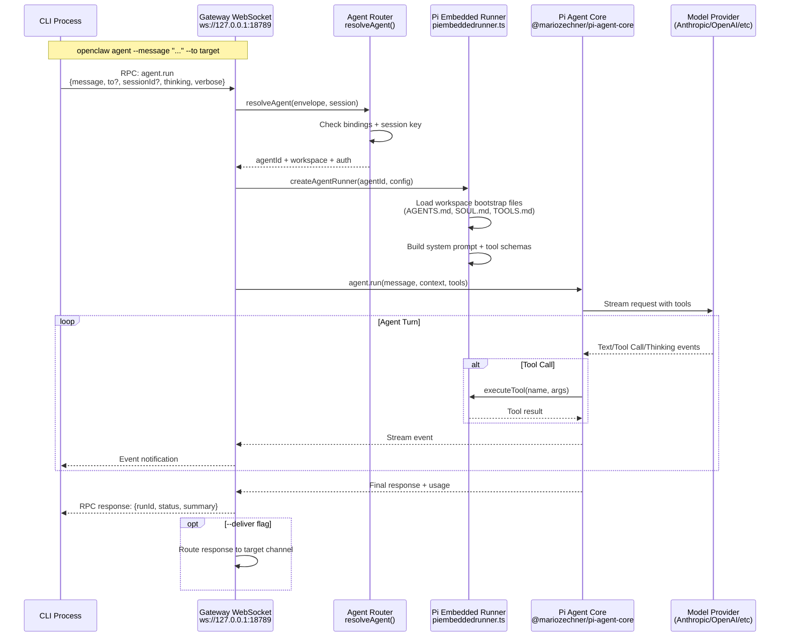
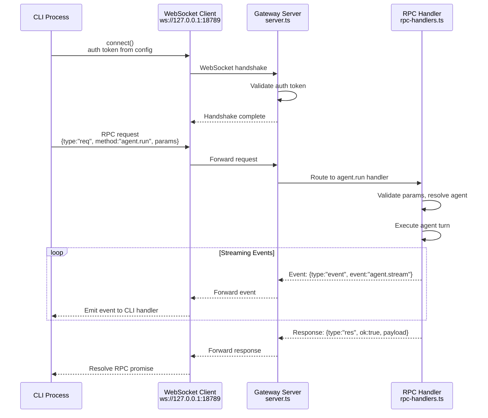

# Page: Agent Commands

# Agent Commands

<details>
<summary>Relevant source files</summary>

The following files were used as context for generating this wiki page:

- [README.md](README.md)
- [assets/avatar-placeholder.svg](assets/avatar-placeholder.svg)
- [docs/channels/zalo.md](docs/channels/zalo.md)
- [docs/channels/zalouser.md](docs/channels/zalouser.md)
- [scripts/clawtributors-map.json](scripts/clawtributors-map.json)
- [scripts/update-clawtributors.ts](scripts/update-clawtributors.ts)
- [scripts/update-clawtributors.types.ts](scripts/update-clawtributors.types.ts)
- [src/commands/agent.test.ts](src/commands/agent.test.ts)
- [src/commands/agent.ts](src/commands/agent.ts)
- [src/config/config.ts](src/config/config.ts)
- [src/cron/isolated-agent.ts](src/cron/isolated-agent.ts)
- [src/cron/run-log.test.ts](src/cron/run-log.test.ts)
- [src/cron/run-log.ts](src/cron/run-log.ts)
- [src/cron/store.ts](src/cron/store.ts)
- [src/gateway/protocol/index.ts](src/gateway/protocol/index.ts)
- [src/gateway/protocol/schema.ts](src/gateway/protocol/schema.ts)
- [src/gateway/protocol/schema/agents-models-skills.ts](src/gateway/protocol/schema/agents-models-skills.ts)
- [src/gateway/protocol/schema/protocol-schemas.ts](src/gateway/protocol/schema/protocol-schemas.ts)
- [src/gateway/protocol/schema/types.ts](src/gateway/protocol/schema/types.ts)
- [src/gateway/server-methods-list.ts](src/gateway/server-methods-list.ts)
- [src/gateway/server-methods.ts](src/gateway/server-methods.ts)
- [src/gateway/server-methods/agents.ts](src/gateway/server-methods/agents.ts)
- [src/gateway/server.ts](src/gateway/server.ts)
- [src/index.test.ts](src/index.test.ts)
- [src/index.ts](src/index.ts)
- [tsconfig.json](tsconfig.json)
- [ui/src/styles.css](ui/src/styles.css)
- [ui/src/styles/layout.mobile.css](ui/src/styles/layout.mobile.css)

</details>


## Purpose and Scope

This page documents the CLI commands for agent operations: executing agent turns (`openclaw agent`), managing multi-agent configurations (`openclaw agents`), sending direct messages (`openclaw message send`), and viewing session state (`openclaw sessions`). These commands provide direct control over agent execution and routing.

For agent execution internals and the Pi agent runtime architecture, see [Agent System](#5). For configuring agent behavior, model selection, and multi-agent routing policies, see [Multi-Agent Configuration](#4.3).

## Overview

Agent commands interact with the Gateway control plane to execute agent turns, manage isolated agent configurations, and control message routing. The Gateway routes inbound messages to agents based on channel bindings and session keys, while CLI commands provide direct programmatic access to agent execution and configuration management.

**Command categories:**

| Command | Purpose |
|---------|---------|
| `openclaw agent` | Execute a single agent turn (immediate execution) |
| `openclaw agents list/add/delete` | Manage isolated agent configurations with dedicated workspaces and auth |
| `openclaw message send` | Send messages directly to channels (bypasses agent execution) |
| `openclaw sessions` | View and query stored conversation state |

Sources: [docs/cli/index.md:438-510](), [README.md:438-480]()

---

## Agent Command Flow



**Execution modes:**
- **Gateway mode (default)**: CLI sends RPC request to Gateway; Gateway coordinates execution
- **Local mode** (`--local`): CLI runs embedded agent directly without Gateway (development/testing)
- **Embedded runner**: [src/agents/piembeddedrunner.ts]() wraps Pi Agent Core for OpenClaw integration

Sources: [docs/cli/index.md:438-480](), [src/agents/piembeddedrunner.ts:1-500]()

---

## `openclaw agent` - Execute Agent Turns

### Purpose

Execute a single agent turn via the Gateway (or embedded locally). The agent processes the message, invokes tools as needed, and returns a response. Optionally deliver the response back to a messaging channel.

### Command Syntax

```bash
openclaw agent --message <text> [options]
```

### Required Arguments

| Argument | Description |
|----------|-------------|
| `--message <text>` | Input message for the agent to process |

### Options

| Option | Description | Default |
|--------|-------------|---------|
| `--to <dest>` | Target for session key derivation and optional delivery | `main` session |
| `--session-id <id>` | Explicit session ID (overrides `--to` derivation) | Derived from `--to` |
| `--thinking <level>` | Extended thinking level: `off\|minimal\|low\|medium\|high\|xhigh` | Per-session default |
| `--verbose <mode>` | Verbose mode: `on\|full\|off` | Per-session default |
| `--channel <name>` | Channel for session key derivation: `whatsapp\|telegram\|discord\|slack\|signal\|imessage` | `whatsapp` |
| `--local` | Run embedded agent locally without Gateway | `false` (use Gateway) |
| `--deliver` | Deliver response to target channel after execution | `false` (return only) |
| `--json` | Output JSON response | `false` (human-readable) |
| `--timeout <seconds>` | RPC timeout for gateway calls | `120` |

### Session Key Resolution

The `--to` flag determines the session key for context isolation:

```bash
# DM session (main key by default)
openclaw agent --message "Hello" --to +15555550123

# Group session (isolated from DM sessions)
openclaw agent --message "Status check" --to whatsapp:group:12345@g.us --channel whatsapp

# Explicit session ID (advanced)
openclaw agent --message "Continue" --session-id "main"
```

**Session key patterns** (see [Session Management](#5.3)):
- `main` - Default direct interaction session
- `dm:<channel>:<id>` - Channel-specific DM sessions (when `session.dmScope` is enabled)
- `group:<channel>:<id>` - Group chat sessions

Sources: [docs/cli/index.md:462-477](), [src/config/sessions.ts:1-100]()

### Examples

**Basic agent execution:**

```bash
# Simple query (no delivery)
openclaw agent --message "What's the current time?"

# With extended thinking (GPT-5.2/Codex models)
openclaw agent --message "Analyze this codebase" --thinking high

# Verbose output with full tool traces
openclaw agent --message "Debug the gateway" --verbose full
```

**Execution with delivery:**

```bash
# Execute and send response to WhatsApp contact
openclaw agent --message "Send status report" --to +15555550123 --deliver

# Execute in group context and reply back
openclaw agent --message "Summarize discussion" \
  --to whatsapp:group:12345@g.us \
  --channel whatsapp \
  --deliver
```

**Local embedded execution (development):**

```bash
# Run without Gateway (uses local config + embedded Pi runtime)
openclaw agent --local --message "Test agent response"
```

**JSON output (automation):**

```bash
# Machine-readable response
openclaw agent --message "List files" --json
```

Sources: [docs/cli/index.md:462-477](), [docs/start/getting-started.md:186-194]()

### Local vs Gateway Execution

| Mode | Gateway Connection | Use Case |
|------|-------------------|----------|
| **Gateway (default)** | Connects to running Gateway via WebSocket | Production use, multi-channel routing, session persistence |
| **Local** (`--local`) | Embedded Pi runtime, no Gateway | Development, testing, offline execution |

**Gateway execution:**
- Requires running Gateway: `openclaw gateway status`
- Uses Gateway's agent routing and session management
- Respects multi-agent bindings and workspace isolation
- Supports delivery to channels (`--deliver`)

**Local execution:**
- No Gateway required
- Uses CLI process environment and config
- Limited to single agent (no multi-agent routing)
- No channel delivery support

Sources: [docs/cli/index.md:462-477](), [src/agents/piembeddedrunner.ts:1-100]()

---

## `openclaw agents` - Multi-Agent Management

### Purpose

Manage isolated agent configurations with dedicated workspaces, authentication profiles, and channel bindings. Each agent has its own:
- **Workspace directory** (`agents.list[].workspace`) containing `AGENTS.md`, `SOUL.md`, `TOOLS.md`, skills
- **Auth profiles** (`~/.openclaw/agents/<agentId>/agent/auth-profiles.json`) with OAuth tokens and API keys
- **Session store** (`~/.openclaw/agents/<agentId>/sessions/`) for conversation history
- **Channel bindings** (`agents.bindings[]`) to route inbound messages

Multi-agent routing enables scenarios like:
- Work vs personal agent isolation
- Per-customer agent instances
- Dedicated rescue/fallback agents

Sources: [docs/cli/index.md:479-510](), [docs/start/wizard.md:162-180]()

### Agent Configuration Structure

```mermaid
graph TB
    subgraph "Gateway Agent Router"
        Envelope[Inbound Message Envelope<br/>channel + accountId + sender]
        Router[resolveAgent<br/>routing/agents.ts]
        Bindings[agents.bindings[]<br/>channel:account patterns]
        Fallback[Fallback to 'main' agent]
    end
    
    subgraph "Agent 'main'"
        MainWorkspace[Workspace<br/>~/.openclaw/workspace]
        MainAuth[Auth Profiles<br/>agents/main/agent/auth-profiles.json]
        MainSessions[Sessions<br/>agents/main/sessions/]
        MainConfig[Agent Config<br/>agents.defaults.*]
    end
    
    subgraph "Agent 'work'"
        WorkWorkspace[Workspace<br/>~/.openclaw/workspace-work]
        WorkAuth[Auth Profiles<br/>agents/work/agent/auth-profiles.json]
        WorkSessions[Sessions<br/>agents/work/sessions/]
        WorkConfig[Agent Override<br/>agents.list[id=work].*]
    end
    
    Envelope --> Router
    Router --> Bindings
    Bindings -->|"Match: whatsapp:biz"| WorkWorkspace
    Bindings -->|"No match"| Fallback
    Fallback --> MainWorkspace
    
    WorkWorkspace --> WorkAuth
    WorkWorkspace --> WorkSessions
    WorkWorkspace --> WorkConfig
    
    MainWorkspace --> MainAuth
    MainWorkspace --> MainSessions
    MainWorkspace --> MainConfig
```

**Binding resolution:**
1. Gateway extracts `channel` + `accountId` from inbound envelope
2. Matches against `agents.bindings[].bind` patterns (e.g., `whatsapp:biz`)
3. Routes to matched agent or falls back to `main`
4. Agent-specific workspace and auth are loaded

Sources: [docs/start/wizard.md:162-180](), [src/routing/agents.ts:1-200]()

---

## `openclaw agents list` - List Configured Agents

### Purpose

Display all configured agents with their workspace paths, bindings, and configuration overrides.

### Command Syntax

```bash
openclaw agents list [options]
```

### Options

| Option | Description |
|--------|-------------|
| `--json` | Output JSON (includes full config details) |
| `--bindings` | Show channel bindings for each agent |

### Output Fields

| Field | Description |
|-------|-------------|
| Agent ID | Unique identifier (e.g., `main`, `work`, `personal`) |
| Workspace | Workspace directory path |
| Model | Configured model (if overridden from defaults) |
| Bindings | Channel routing patterns (when `--bindings` is set) |

### Examples

```bash
# List all agents (human-readable)
openclaw agents list

# Show with channel bindings
openclaw agents list --bindings

# JSON output (for automation)
openclaw agents list --json
```

**Sample output:**

```
Agents:
  main
    Workspace: ~/.openclaw/workspace
    Model: anthropic/claude-opus-4-5
    
  work
    Workspace: ~/.openclaw/workspace-work
    Model: openai/gpt-5.2
    Bindings: whatsapp:biz, telegram:work
```

Sources: [docs/cli/index.md:479-488]()

---

## `openclaw agents add` - Create New Agents

### Purpose

Create a new isolated agent with a dedicated workspace, optional model configuration, and channel bindings. The command runs an interactive wizard unless non-interactive flags are provided.

### Command Syntax

```bash
openclaw agents add [name] [options]
```

### Arguments

| Argument | Description |
|----------|-------------|
| `[name]` | Agent identifier (e.g., `work`, `personal`) |

### Options

| Option | Required (non-interactive) | Description |
|--------|----------------------------|-------------|
| `--workspace <dir>` | Yes | Workspace directory path |
| `--model <id>` | No | Override default model (e.g., `openai/gpt-5.2`) |
| `--agent-dir <dir>` | No | Agent state directory (default: `~/.openclaw/agents/<name>`) |
| `--bind <pattern>` | No | Channel binding (repeatable) |
| `--non-interactive` | No | Skip wizard (requires `--workspace`) |
| `--json` | No | Output JSON result |

### Channel Binding Patterns

Bindings use the format `channel[:accountId]`:

| Pattern | Matches |
|---------|---------|
| `whatsapp` | Default WhatsApp account |
| `whatsapp:biz` | WhatsApp account with ID `biz` |
| `telegram:alerts` | Telegram account with ID `alerts` |
| `discord:work` | Discord bot with ID `work` |

**Multiple bindings:**
- Use `--bind` multiple times: `--bind whatsapp:biz --bind telegram:work`
- Agent receives all inbound messages from matched channels

Sources: [docs/cli/index.md:489-502](), [docs/start/wizard.md:162-180]()

### Examples

**Interactive wizard (recommended for first-time setup):**

```bash
# Guided setup with prompts
openclaw agents add work
```

The wizard prompts for:
1. Workspace location (default: `~/.openclaw/workspace-<name>`)
2. Model override (or inherit from defaults)
3. Channel bindings (optional)
4. Confirmation

**Non-interactive (automation/scripts):**

```bash
# Minimal agent with workspace only
openclaw agents add work \
  --workspace ~/.openclaw/workspace-work \
  --non-interactive

# Agent with model override
openclaw agents add personal \
  --workspace ~/agents/personal \
  --model anthropic/claude-opus-4-5 \
  --non-interactive

# Agent with channel bindings
openclaw agents add work \
  --workspace ~/.openclaw/workspace-work \
  --model openai/gpt-5.2 \
  --bind whatsapp:biz \
  --bind telegram:work \
  --non-interactive \
  --json
```

**Configuration written:**

The command writes to `~/.openclaw/openclaw.json`:

```json
{
  "agents": {
    "list": [
      {
        "id": "work",
        "workspace": "~/.openclaw/workspace-work",
        "model": "openai/gpt-5.2"
      }
    ],
    "bindings": [
      {
        "bind": "whatsapp:biz",
        "agent": "work"
      },
      {
        "bind": "telegram:work",
        "agent": "work"
      }
    ]
  }
}
```

Sources: [docs/cli/index.md:489-502](), [docs/start/wizard.md:162-180]()

### Workspace Initialization

When creating an agent, the workspace is seeded with bootstrap files:

| File | Purpose |
|------|---------|
| `AGENTS.md` | Agent identity and behavior guidelines |
| `SOUL.md` | Personality and tone instructions |
| `TOOLS.md` | Available tool descriptions and usage examples |
| `skills/` | Optional skill modules (installed separately) |

These files are injected into the system prompt by the Pi Embedded Runner during agent execution.

Sources: [src/agents/piembeddedrunner.ts:100-200](), [docs/reference/templates/AGENTS]()

---

## `openclaw agents delete` - Remove Agents

### Purpose

Delete an agent configuration and optionally remove its workspace and state directories.

### Command Syntax

```bash
openclaw agents delete <id> [options]
```

### Arguments

| Argument | Required | Description |
|----------|----------|-------------|
| `<id>` | Yes | Agent identifier to delete |

### Options

| Option | Description |
|--------|-------------|
| `--force` | Skip confirmation prompt |
| `--json` | Output JSON result |

### Deletion Scope

**Config cleanup:**
- Removes agent from `agents.list[]`
- Removes associated bindings from `agents.bindings[]`
- Preserves workspace and state directories by default

**Optional workspace/state removal:**
- The command prompts whether to delete workspace and agent state
- Use `--force` to auto-confirm without prompts

### Examples

```bash
# Delete agent (interactive confirmation)
openclaw agents delete work

# Force delete without prompt
openclaw agents delete work --force

# JSON output
openclaw agents delete work --force --json
```

**Sample interaction:**

```
Delete agent 'work'?
  Config: ~/.openclaw/openclaw.json
  Workspace: ~/.openclaw/workspace-work
  State: ~/.openclaw/agents/work

Remove workspace and state? [y/N]: y
Agent 'work' deleted.
```

Sources: [docs/cli/index.md:504-510]()

---

## Multi-Agent Binding Resolution

```mermaid
flowchart TD
    Start[Inbound Message Envelope] --> Extract[Extract channel + accountId<br/>from envelope]
    Extract --> LoadBindings[Load agents.bindings[]]
    LoadBindings --> MatchLoop{For each binding}
    
    MatchLoop -->|bind pattern| CheckPattern{Pattern matches<br/>channel:accountId?}
    CheckPattern -->|Yes| AgentMatch[Agent: binding.agent]
    CheckPattern -->|No| NextBinding[Try next binding]
    NextBinding --> MatchLoop
    
    MatchLoop -->|No bindings left| FallbackMain[Agent: 'main'<br/>default fallback]
    
    AgentMatch --> LoadAgent[Load agent config<br/>agents.list or agents.defaults]
    FallbackMain --> LoadAgent
    
    LoadAgent --> Workspace[Resolve workspace path<br/>~/.openclaw/workspace-*]
    LoadAgent --> Auth[Load auth profiles<br/>~/.openclaw/agents/*/agent/auth-profiles.json]
    LoadAgent --> Sessions[Load session store<br/>~/.openclaw/agents/*/sessions/]
    
    Workspace --> Execute[Execute agent turn]
    Auth --> Execute
    Sessions --> Execute
```

**Binding precedence:**
1. **Exact match**: `whatsapp:biz` matches channel `whatsapp` with account ID `biz`
2. **Channel-only match**: `telegram` matches any Telegram account
3. **Fallback**: No matches → use `main` agent

**Example routing table:**

| Inbound Message | Binding Match | Agent |
|-----------------|---------------|-------|
| WhatsApp account `default` from +1234567890 | No explicit binding | `main` |
| WhatsApp account `biz` from +0987654321 | `whatsapp:biz` → `work` | `work` |
| Telegram bot `alerts` from user 12345 | `telegram:alerts` → `personal` | `personal` |
| Discord bot `work` from guild 67890 | `discord:work` → `work` | `work` |

Sources: [src/routing/agents.ts:1-200](), [docs/start/wizard.md:162-180]()

---

## `openclaw message send` - Direct Messaging

### Purpose

Send messages directly to channels without invoking agent execution. Useful for:
- Testing channel connectivity
- Sending notifications/alerts
- Delivering pre-formatted content
- Bypassing agent processing

This is distinct from `openclaw agent --deliver`, which executes the agent first then delivers the response.

### Command Syntax

```bash
openclaw message send --target <target> --message <text> [options]
```

### Required Arguments

| Argument | Description |
|----------|-------------|
| `--target <target>` | Destination identifier (phone number, channel ID, username) |
| `--message <text>` | Message text to send |

### Options

See [Message Commands](#12.3) for the full `openclaw message` command reference including advanced options like reactions, editing, attachments, and channel-specific actions.

### Examples

```bash
# Send to WhatsApp contact
openclaw message send --target +15555550123 --message "Hello from OpenClaw"

# Send to Telegram chat
openclaw message send --channel telegram --target 123456789 --message "Alert: Service restarted"

# Send to Discord channel
openclaw message send --channel discord --target channel:1234567890 --message "Status update"
```

Sources: [docs/cli/index.md:438-460](), [README.md:189-194]()

---

## `openclaw sessions` - Session Management

### Purpose

List and query stored conversation sessions with filtering by activity, agent, and session type.

### Command Syntax

```bash
openclaw sessions [options]
```

### Options

| Option | Description | Default |
|--------|-------------|---------|
| `--json` | Output JSON | Human-readable |
| `--verbose` | Include full session metadata | Summary only |
| `--store <path>` | Explicit session store path | Per-agent default |
| `--active <minutes>` | Filter to sessions active within N minutes | All sessions |

### Output Fields

| Field | Description |
|-------|-------------|
| Session Key | Session identifier (e.g., `main`, `dm:whatsapp:+1234567890`, `group:telegram:12345`) |
| Agent | Associated agent ID |
| Last Activity | Timestamp of most recent message |
| Message Count | Total messages in session |
| Context Size | Approximate token count (if available) |

### Session Key Patterns

| Pattern | Description | Example |
|---------|-------------|---------|
| `main` | Default direct interaction session | `main` |
| `dm:<channel>:<id>` | Channel-specific DM session | `dm:telegram:123456789` |
| `group:<channel>:<id>` | Group chat session | `group:whatsapp:12345@g.us` |

**Session isolation:**
- Each agent has a separate session store
- DM and group sessions are isolated by channel and identifier
- Sessions persist across Gateway restarts

Sources: [docs/cli/index.md:551-558](), [src/config/sessions.ts:1-100]()

### Examples

```bash
# List all sessions
openclaw sessions

# Show verbose session details
openclaw sessions --verbose

# Filter to recently active sessions (last 60 minutes)
openclaw sessions --active 60

# JSON output for automation
openclaw sessions --json
```

**Sample output:**

```
Sessions:
  main (agent: main)
    Last activity: 2 minutes ago
    Messages: 45
    Context: ~12K tokens
    
  dm:telegram:123456789 (agent: personal)
    Last activity: 1 hour ago
    Messages: 23
    Context: ~8K tokens
    
  group:whatsapp:12345@g.us (agent: work)
    Last activity: 5 hours ago
    Messages: 78
    Context: ~24K tokens (compacted)
```

Sources: [docs/cli/index.md:551-558]()

### Session Store Location

Sessions are stored per-agent under `~/.openclaw/agents/<agentId>/sessions/`:

```
~/.openclaw/agents/
├── main/
│   └── sessions/
│       ├── main.json
│       ├── dm_telegram_123456789.json
│       └── group_whatsapp_12345@g.us.json
└── work/
    └── sessions/
        ├── main.json
        └── group_discord_67890.json
```

**Session persistence:**
- JSON files contain message history, context state, and metadata
- Sessions are loaded on-demand during agent execution
- Automatic compaction when context exceeds model limits

Sources: [src/config/sessions.ts:1-100](), [docs/concepts/session.md]()

---

## Integration with Gateway RPC

All agent commands communicate with the Gateway via WebSocket RPC when Gateway mode is used (default). The CLI establishes a connection, sends requests, and receives responses/events.



**Authentication:**
- Gateway auth token: `gateway.auth.token` or `OPENCLAW_GATEWAY_TOKEN`
- CLI loads token from config or environment
- Tailscale Serve identity bypass: `gateway.auth.allowTailscale`

**RPC methods used:**
- `agent.run` - Execute agent turn
- `agents.list` - List configured agents
- `agents.add` - Create new agent
- `agents.delete` - Remove agent
- `message.send` - Send direct message
- `sessions.list` - Query sessions

Sources: [src/gateway/server.ts:1-200](), [docs/gateway/protocol.md]()

---

## Error Handling and Troubleshooting

### Common Issues

| Issue | Cause | Solution |
|-------|-------|----------|
| "No auth configured for provider" | Missing API keys or OAuth tokens in agent's auth store | Run `openclaw models auth setup-token` or re-run onboarding |
| "Gateway not responding" | Gateway not running or connection failure | Check `openclaw gateway status`, verify port and token |
| "Session not found" | Invalid session ID or key | Use `openclaw sessions` to list valid sessions |
| "Agent 'work' not found" | Agent ID doesn't exist in config | Verify with `openclaw agents list` |
| "Binding pattern already exists" | Duplicate binding in `agents.bindings[]` | Remove duplicate or modify pattern |

### Diagnostic Commands

```bash
# Check Gateway connectivity
openclaw gateway status
openclaw gateway probe

# Verify agent configuration
openclaw agents list --bindings --json

# Check session state
openclaw sessions --verbose

# View recent logs
openclaw logs --follow

# Full system status
openclaw status --all
```

Sources: [docs/gateway/troubleshooting.md:1-100](), [docs/cli/index.md:514-527]()

---

## See Also

- [Gateway Commands](#12.1) - Gateway service management and control
- [Channel Commands](#12.3) - Channel setup and message routing
- [Agent System](#5) - Agent execution flow and internals
- [Multi-Agent Configuration](#4.3) - Configuring isolated agents
- [Session Management](#5.3) - Session lifecycle and context handling

---