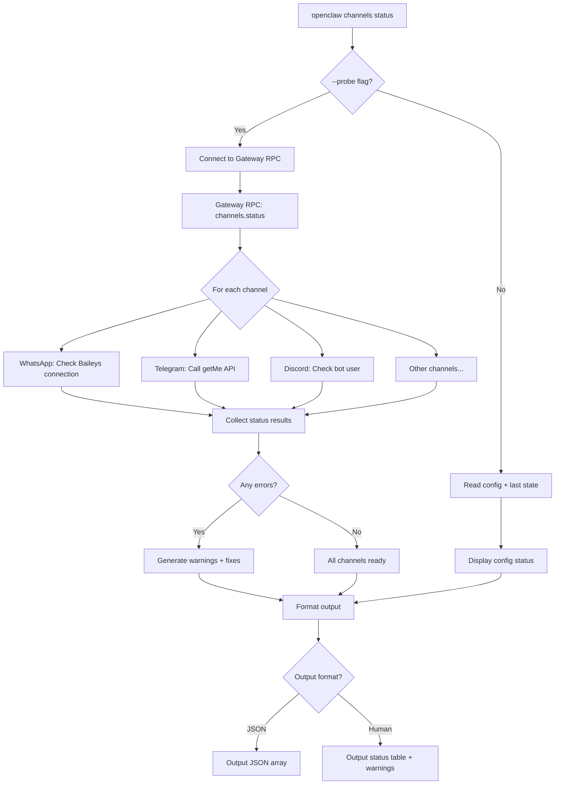
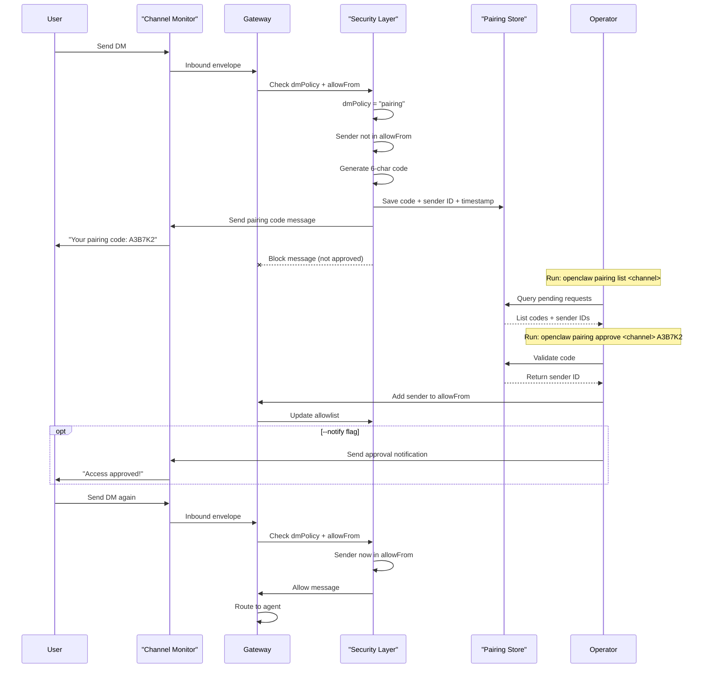
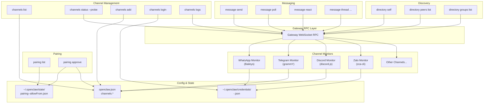

# Page: Channel Commands

# Channel Commands

<details>
<summary>Relevant source files</summary>

The following files were used as context for generating this wiki page:

- [README.md](README.md)
- [assets/avatar-placeholder.svg](assets/avatar-placeholder.svg)
- [docs/channels/zalo.md](docs/channels/zalo.md)
- [docs/channels/zalouser.md](docs/channels/zalouser.md)
- [docs/cli/index.md](docs/cli/index.md)
- [docs/docs.json](docs/docs.json)
- [docs/gateway/index.md](docs/gateway/index.md)
- [docs/gateway/troubleshooting.md](docs/gateway/troubleshooting.md)
- [docs/index.md](docs/index.md)
- [docs/start/getting-started.md](docs/start/getting-started.md)
- [docs/start/hubs.md](docs/start/hubs.md)
- [docs/start/onboarding.md](docs/start/onboarding.md)
- [docs/start/wizard.md](docs/start/wizard.md)
- [scripts/clawtributors-map.json](scripts/clawtributors-map.json)
- [scripts/update-clawtributors.ts](scripts/update-clawtributors.ts)
- [scripts/update-clawtributors.types.ts](scripts/update-clawtributors.types.ts)
- [src/config/config.ts](src/config/config.ts)
- [src/index.test.ts](src/index.test.ts)
- [src/index.ts](src/index.ts)
- [tsconfig.json](tsconfig.json)
- [ui/src/styles.css](ui/src/styles.css)
- [ui/src/styles/layout.mobile.css](ui/src/styles/layout.mobile.css)

</details>


This page documents CLI commands for managing messaging channels, handling pairing approvals, sending messages, and discovering channel entities. For general CLI reference, see [CLI Reference](#12). For channel configuration and setup guides, see [Channels](/channels).

Related pages:
- Gateway commands: [Gateway Commands](#12.1)
- Agent commands: [Agent Commands](#12.2)
- Channel configuration: [Configuration](/gateway/configuration)
- Channel pairing system: [Pairing](/channels/pairing)

---

## Command Categories

OpenClaw provides four categories of channel-related commands:

| Category | Commands | Purpose |
|----------|----------|---------|
| **Channel Management** | `channels list`, `channels status`, `channels add`, `channels remove`, `channels login`, `channels logout`, `channels logs` | Configure and monitor channel connections |
| **Pairing** | `pairing list`, `pairing approve` | Manage DM access control via pairing codes |
| **Messaging** | `message send`, `message poll`, `message react`, `message thread`, etc. | Send messages and perform channel-specific actions |
| **Directory** | `directory self`, `directory peers`, `directory groups` | Discover channel entities (users, groups) and their IDs |

**Sources:** [docs/cli/index.md:372-456]()

---

## Channel Management Commands

### `channels list`

Display all configured channels and their account details.

```bash
openclaw channels list
openclaw channels list --json
openclaw channels list --no-usage
```

**Options:**

| Option | Description |
|--------|-------------|
| `--json` | Output structured JSON (includes usage unless `--no-usage` is set) |
| `--no-usage` | Skip OAuth/API usage snapshot lookups |

**Output includes:**
- Channel names and account IDs
- Display names
- Connection status
- Token/credential summary
- OAuth profile expiry (when applicable)

**Example output:**
```
Channels:
  whatsapp:default (enabled)
  telegram:default (enabled, token configured)
  discord:work (enabled, bot token configured)
  
OAuth profiles:
  anthropic:main (expires in 3d 4h)
```

**Sources:** [docs/cli/index.md:405-409]()

---

### `channels status`

Check Gateway reachability and channel health. This command probes the Gateway RPC endpoint and optionally performs live channel checks.

```bash
openclaw channels status
openclaw channels status --probe
openclaw channels status --json
```

**Options:**

| Option | Description |
|--------|-------------|
| `--probe` | Run live connectivity checks for each channel |
| `--json` | Output structured JSON |

**Status indicators:**
- `ready` — channel connected and operational
- `disabled` — channel not enabled in config
- `not_configured` — missing required credentials
- `error` — connection failed or credential invalid

**Behavior:**
- Without `--probe`: Reports config status and last known state
- With `--probe`: Actively tests each channel's API connectivity
- Prints warnings with suggested fixes for common misconfigurations
- Points to `openclaw doctor` for automated repairs

**Example:**
```bash
$ openclaw channels status --probe
Gateway: running (ws://127.0.0.1:18789)

Channels:
  whatsapp:default   ready (connected)
  telegram:default   ready (bot active)
  discord:work       error (invalid token)
  
Warnings:
  - discord:work token appears invalid; run: openclaw channels add --channel discord --account work
```

**Sources:** [docs/cli/index.md:380-382](), [docs/gateway/troubleshooting.md:122-151]()

---

#### Channel Status Flow Diagram



**Sources:** [docs/cli/index.md:380-382](), [docs/gateway/troubleshooting.md:122-151]()

---

### `channels logs`

Display recent channel-related log entries from the Gateway log file.

```bash
openclaw channels logs
openclaw channels logs --channel telegram
openclaw channels logs --lines 500
openclaw channels logs --json
```

**Options:**

| Option | Description |
|--------|-------------|
| `--channel <name\|all>` | Filter by channel name (default: `all`) |
| `--lines <n>` | Number of recent lines to fetch (default: `200`) |
| `--json` | Output line-delimited JSON |

**Supported channels:** `whatsapp`, `telegram`, `discord`, `slack`, `googlechat`, `mattermost`, `signal`, `imessage`, `msteams`, `matrix`, `zalo`, `zalouser`, `bluebubbles`, `web`

**Example:**
```bash
$ openclaw channels logs --channel telegram --lines 50
[2025-01-15 14:32:10] [telegram] bot connected: @mybot
[2025-01-15 14:32:15] [telegram] received message from user 123456789
[2025-01-15 14:32:16] [telegram] sent reply to user 123456789
```

**Sources:** [docs/cli/index.md:410-413]()

---

### `channels add`

Add or configure a channel account. Launches an interactive wizard when run without flags; flags enable non-interactive mode.

```bash
# Interactive mode (wizard)
openclaw channels add

# Non-interactive mode
openclaw channels add --channel telegram --account alerts \
  --name "Alerts Bot" --token $TELEGRAM_BOT_TOKEN

openclaw channels add --channel discord --account work \
  --name "Work Bot" --token $DISCORD_BOT_TOKEN
```

**Common options:**

| Option | Description |
|--------|-------------|
| `--channel <name>` | Channel type (required for non-interactive) |
| `--account <id>` | Account identifier (default: `default`) |
| `--name <label>` | Display name for the account |
| `--token <token>` | Bot token or API key (channel-specific) |

**Channel-specific options:**

| Channel | Additional Options |
|---------|-------------------|
| **WhatsApp** | `--allow-from <phone>` (repeatable) |
| **Telegram** | `--webhook-url <url>`, `--webhook-secret <secret>` |
| **Discord** | `--guilds <id>` (repeatable), `--dm-policy <pairing\|allowlist\|open>` |
| **Slack** | `--app-token <token>`, `--signing-secret <secret>` |

**Behavior:**
- Without flags: Launches guided setup with prompts
- With flags: Applies settings directly to config
- Validates credentials when possible
- Writes to `channels.<channel>.accounts.<account>` or top-level channel config

**Example session:**
```bash
$ openclaw channels add
? Select channel type: Telegram
? Account ID [default]: alerts
? Display name: Alerts Bot
? Bot token: ****************************************
? Enable webhook mode? No
✓ Added telegram:alerts
```

**Sources:** [docs/cli/index.md:384-385](), [docs/cli/index.md:418-426](), [README.md:335-397]()

---

### `channels remove`

Disable or delete a channel account.

```bash
# Disable (default)
openclaw channels remove --channel discord --account work

# Delete from config
openclaw channels remove --channel discord --account work --delete
```

**Options:**

| Option | Description |
|--------|-------------|
| `--channel <name>` | Channel type |
| `--account <id>` | Account identifier (default: `default`) |
| `--delete` | Remove config entry instead of just disabling |

**Behavior:**
- Default: Sets `enabled: false` for the account
- With `--delete`: Removes the account entry entirely from config
- Prompts for confirmation unless `--yes` is passed

**Sources:** [docs/cli/index.md:385]()

---

### `channels login`

Perform interactive login for channels that require QR code or OAuth flows (currently WhatsApp and Zalo Personal).

```bash
# WhatsApp Web QR login
openclaw channels login
openclaw channels login --channel whatsapp --account default

# Zalo Personal QR login (requires zca-cli)
openclaw channels login --channel zalouser
```

**Options:**

| Option | Description |
|--------|-------------|
| `--channel <name>` | Channel type (default: `whatsapp`) |
| `--account <id>` | Account identifier (default: `default`) |
| `--verbose` | Show detailed connection logs |

**Supported channels:**
- `whatsapp` / `web` — Baileys QR code flow
- `zalouser` — zca-cli QR code flow (requires plugin)

**Login process:**
1. Command generates or requests a QR code
2. User scans QR code with mobile app
3. Credentials are saved to `~/.openclaw/credentials/<channel>-<account>.json`
4. Gateway can reconnect using saved credentials

**Example:**
```bash
$ openclaw channels login --channel whatsapp
Connecting to WhatsApp Web...
Scan this QR code with your phone:

█████████████████████████████
█████████████████████████████
████ ▄▄▄▄▄ █▀ █▀▀██ ▄▄▄▄▄ ████
████ █   █ █▀ █  ▀█ █   █ ████
[QR code displayed]

✓ Connected as +1234567890
Credentials saved to ~/.openclaw/credentials/whatsapp-default.json
```

**Sources:** [docs/cli/index.md:395-399](), [docs/channels/whatsapp.md](), [docs/channels/zalouser.md:32-34]()

---

### `channels logout`

Log out of a channel session (removes credentials for channels that support logout).

```bash
openclaw channels logout --channel whatsapp
openclaw channels logout --channel zalouser --account personal
```

**Options:**

| Option | Description |
|--------|-------------|
| `--channel <name>` | Channel type (default: `whatsapp`) |
| `--account <id>` | Account identifier (default: `default`) |

**Behavior:**
- Disconnects active session
- Removes credential file from `~/.openclaw/credentials/`
- Requires re-login before channel can be used again

**Sources:** [docs/cli/index.md:400-403]()

---

## Pairing Commands

Pairing commands manage DM access control when `dmPolicy: "pairing"` is configured. Unknown senders receive a short pairing code; messages are blocked until the code is approved.

For detailed pairing system documentation, see [Pairing](/channels/pairing).

---

### `pairing list`

Display pending pairing requests for a channel.

```bash
openclaw pairing list telegram
openclaw pairing list whatsapp --json
```

**Output includes:**
- Sender identifier (phone number, user ID, username)
- Generated pairing code
- Request timestamp
- Expiration time (codes expire after 1 hour)

**Example:**
```bash
$ openclaw pairing list telegram
Pending pairing requests:

  User: @alice (ID: 123456789)
  Code: A3B7K2
  Requested: 2 minutes ago
  Expires: in 58 minutes
  
  User: @bob (ID: 987654321)
  Code: F8L2M9
  Requested: 15 minutes ago
  Expires: in 45 minutes
```

**Sources:** [docs/cli/index.md:451-453](), [README.md:113-119]()

---

### `pairing approve`

Approve a pending pairing request, adding the sender to the channel's allowlist.

```bash
openclaw pairing approve telegram A3B7K2
openclaw pairing approve whatsapp F8L2M9 --notify
```

**Options:**

| Option | Description |
|--------|-------------|
| `--notify` | Send approval notification to the sender |

**Behavior:**
1. Validates the pairing code
2. Adds sender ID to `channels.<channel>.allowFrom` in config
3. Persists pairing to `~/.openclaw/state/pairing-<channel>-allowFrom.json`
4. Optionally sends confirmation message to sender

**Example:**
```bash
$ openclaw pairing approve telegram A3B7K2 --notify
✓ Approved @alice (ID: 123456789)
✓ Added to telegram allowlist
✓ Sent approval notification
```

**Sources:** [docs/cli/index.md:453](), [README.md:113-119](), [docs/channels/pairing.md]()

---

#### Pairing Workflow Diagram



**Sources:** [docs/channels/pairing.md](), [docs/cli/index.md:446-453]()

---

## Message Commands

The `message` command tree provides unified outbound messaging and channel-specific actions. For complete documentation, see [Message CLI](/cli/message).

### Core message operations

#### `message send`

Send a text or media message to a channel target.

```bash
openclaw message send --target +15555550123 --message "Hello"
openclaw message send --channel telegram --target 123456789 --message "Hi"
openclaw message send --channel discord --target channel:987654321 \
  --message "Deployment complete" --thread-id 111222333
```

**Options:**

| Option | Description |
|--------|-------------|
| `--target <id>` | Target identifier (phone, user ID, channel ID) |
| `--message <text>` | Message content |
| `--channel <name>` | Channel type (auto-detected from target when possible) |
| `--account <id>` | Channel account (default: `default`) |
| `--thread-id <id>` | Send to specific thread (Discord, Slack) |
| `--image <path>` | Attach image file |
| `--file <path>` | Attach file |

**Target formats by channel:**

| Channel | Target Format | Examples |
|---------|--------------|----------|
| **WhatsApp** | E.164 phone number | `+15555550123` |
| **Telegram** | Numeric user/chat ID | `123456789`, `-1001234567890` |
| **Discord** | `channel:ID` or `user:ID` | `channel:987654321`, `user:123` |
| **Slack** | Channel ID or user ID | `C01234ABCD`, `U56789EFGH` |
| **Google Chat** | Space name | `spaces/AAAA` |

**Sources:** [docs/cli/index.md:474-495](), [README.md:69-73]()

---

#### `message poll`

Create a poll in a channel that supports polls (Discord, Telegram, Slack).

```bash
openclaw message poll --channel discord --target channel:123 \
  --poll-question "Lunch choice?" \
  --poll-option Pizza \
  --poll-option Sushi \
  --poll-option Tacos
```

**Options:**

| Option | Description |
|--------|-------------|
| `--poll-question <text>` | Poll question |
| `--poll-option <text>` | Poll option (repeatable) |
| `--poll-multiple` | Allow multiple selections |
| `--poll-anonymous` | Hide voter identities |
| `--poll-duration <minutes>` | Auto-close after duration |

**Sources:** [docs/cli/index.md:496]()

---

#### `message react`

Add a reaction to a message.

```bash
openclaw message react --channel telegram --target 123456789 \
  --message-id 42 --emoji "👍"
  
openclaw message react --channel discord --target channel:987 \
  --message-id 111222333444 --emoji "🎉"
```

**Sources:** [docs/cli/index.md:482]()

---

### Thread operations

```bash
# Create thread
openclaw message thread create --channel discord --target channel:123 \
  --name "Bug Discussion" --message-id 987654

# List threads
openclaw message thread list --channel discord --target channel:123

# Reply to thread
openclaw message thread reply --channel discord --target channel:123 \
  --thread-id 111222 --message "Fixed in PR #42"
```

**Sources:** [docs/cli/index.md:483]()

---

### Channel management actions

```bash
# Get channel info
openclaw message channel info --channel discord --target channel:123

# List channels
openclaw message channel list --channel discord

# Get member info
openclaw message member info --channel discord --target user:456 --context channel:123

# Timeout member (Discord, Slack)
openclaw message timeout --channel discord --target channel:123 \
  --user 456 --duration 60

# Kick member
openclaw message kick --channel discord --target channel:123 --user 456

# Ban member
openclaw message ban --channel discord --target channel:123 --user 456 \
  --reason "Spam"
```

**Sources:** [docs/cli/index.md:482-490]()

---

## Directory Commands

Directory commands discover and list channel entities (users, groups) and their IDs. This is essential for configuring allowlists and finding targets for message delivery.

Available for channels: `zalouser`, `whatsapp` (when supported)

---

### `directory self`

Display the bot's own identity information.

```bash
openclaw directory self --channel zalouser
openclaw directory self --channel whatsapp --account default
```

**Output:**
- User ID
- Display name
- Phone number (when applicable)
- Account metadata

**Example:**
```bash
$ openclaw directory self --channel zalouser
Account: zalouser:default
User ID: 123456789012
Name: OpenClaw Bot
Phone: +1234567890
```

**Sources:** [docs/channels/zalouser.md:64-70]()

---

### `directory peers list`

List direct message contacts (friends, recent DM partners).

```bash
openclaw directory peers list --channel zalouser
openclaw directory peers list --channel zalouser --query "alice"
openclaw directory peers list --channel zalouser --json
```

**Options:**

| Option | Description |
|--------|-------------|
| `--query <text>` | Filter by name or ID |
| `--json` | Output structured JSON |
| `--limit <n>` | Maximum results |

**Output includes:**
- User ID
- Display name
- Last interaction timestamp (when available)

**Example:**
```bash
$ openclaw directory peers list --channel zalouser --query "work"
Peers:

  alice_work
  ID: 1234567890
  Name: Alice (Work)
  
  bob_workplace
  ID: 9876543210
  Name: Bob from Workplace
```

**Sources:** [docs/channels/zalouser.md:64-70]()

---

### `directory groups list`

List group chats the account is a member of.

```bash
openclaw directory groups list --channel zalouser
openclaw directory groups list --channel zalouser --query "team"
openclaw directory groups list --channel zalouser --json
```

**Options:**

| Option | Description |
|--------|-------------|
| `--query <text>` | Filter by group name |
| `--json` | Output structured JSON |
| `--limit <n>` | Maximum results |

**Output includes:**
- Group ID
- Group name
- Member count (when available)
- Admin status

**Example:**
```bash
$ openclaw directory groups list --channel zalouser --query "dev"
Groups:

  Dev Team
  ID: 123-456-789
  Members: 12
  Role: member
  
  DevOps Squad
  ID: 987-654-321
  Members: 8
  Role: admin
```

**Usage:** Use discovered group IDs in `channels.<channel>.groups` allowlists.

**Sources:** [docs/channels/zalouser.md:64-70]()

---

## Command Interaction Flow



**Sources:** [docs/cli/index.md:372-495](), [docs/gateway/protocol.md](), [docs/channels/]()

---

## Common Workflows

### Initial Channel Setup

```bash
# 1. Add channel with wizard
openclaw channels add

# OR add non-interactively
openclaw channels add --channel telegram --account default \
  --name "Main Bot" --token "$TELEGRAM_BOT_TOKEN"

# 2. Check status
openclaw channels status --probe

# 3. View logs if issues arise
openclaw channels logs --channel telegram
```

---

### Managing DM Access with Pairing

```bash
# 1. Configure pairing mode (in openclaw.json)
# channels.telegram.dmPolicy: "pairing"

# 2. Wait for inbound DM (sender gets pairing code)

# 3. List pending requests
openclaw pairing list telegram

# 4. Approve sender
openclaw pairing approve telegram A3B7K2 --notify
```

---

### Discovering Group IDs for Allowlists

```bash
# 1. List groups
openclaw directory groups list --channel zalouser

# Output:
# Dev Team
# ID: 123-456-789

# 2. Add to config
# channels.zalouser.groups:
#   "123-456-789": { allow: true }
```

---

### Sending Scheduled Messages via Cron

```bash
# 1. Discover target ID
openclaw directory peers list --channel telegram --query "alice"

# Output: User ID: 123456789

# 2. Create cron job
openclaw cron add --name "daily-standup" --every "0 9 * * 1-5" \
  --message-channel telegram --message-target 123456789 \
  --message-text "Daily standup starts in 15 minutes!"
```

**Sources:** [docs/automation/cron-jobs.md](), [docs/cli/index.md:896-908]()

---

## Configuration Examples

### Multi-Account Telegram

```json5
{
  channels: {
    telegram: {
      enabled: true,
      defaultAccount: "main",
      accounts: {
        main: {
          botToken: "123456:ABC-DEF",
          name: "Main Bot",
          dmPolicy: "pairing",
        },
        alerts: {
          botToken: "789012:GHI-JKL",
          name: "Alert Bot",
          dmPolicy: "allowlist",
          allowFrom: ["alice_id", "bob_id"],
        },
      },
    },
  },
}
```

---

### WhatsApp with Allowlist

```json5
{
  channels: {
    whatsapp: {
      enabled: true,
      dmPolicy: "allowlist",
      allowFrom: ["+15555550123", "+15555550124"],
      groups: {
        "*": { requireMention: true },
      },
    },
  },
}
```

**Sources:** [README.md:335-373](), [docs/gateway/configuration.md]()

---

## Troubleshooting

### Channels not appearing in `channels list`

**Cause:** Channel not enabled or credentials missing.

**Fix:**
```bash
openclaw channels status --probe
openclaw doctor
openclaw channels add --channel <name>
```

---

### `channels status --probe` shows errors

**Common causes:**
- Invalid token/credentials
- Network connectivity issues
- Channel API downtime
- Missing required config fields

**Diagnostic steps:**
```bash
# 1. Check detailed logs
openclaw channels logs --channel <name> --lines 500

# 2. Verify config
openclaw config get channels.<channel>

# 3. Re-authenticate
openclaw channels login --channel <name>

# 4. Run doctor
openclaw doctor
```

**Sources:** [docs/gateway/troubleshooting.md:122-151]()

---

### Pairing codes not working

**Cause:** Code expired (1 hour TTL) or invalid.

**Fix:**
```bash
# 1. List pending requests
openclaw pairing list <channel>

# 2. Check expiration time in output

# 3. Request new code (ask sender to message again)

# 4. Approve promptly
openclaw pairing approve <channel> <code>
```

---

### Message send fails with "target not found"

**Cause:** Invalid target ID or format.

**Fix:**
```bash
# 1. Discover correct ID
openclaw directory peers list --channel <name> --query <name>
openclaw directory groups list --channel <name> --query <name>

# 2. Verify target format for channel type
# WhatsApp: +15555550123
# Telegram: 123456789 (numeric)
# Discord: channel:987654321 or user:123

# 3. Test with correct format
openclaw message send --channel <name> --target <correct-id> --message "test"
```

**Sources:** [docs/cli/index.md:474-495]()

---

## Summary

Channel commands provide comprehensive control over messaging platform integrations:

- **Management:** Configure, monitor, and troubleshoot channel connections
- **Security:** Pairing system enforces DM access control without exposing credentials
- **Discovery:** Directory commands map human-readable names to technical IDs
- **Automation:** Message commands enable scripted outbound messaging and cron integrations

All commands interact with the Gateway via RPC or directly with config/state files, ensuring consistent behavior across local and remote Gateway deployments.

**Sources:** [docs/cli/index.md:372-495](), [docs/channels/](), [docs/gateway/protocol.md]()

---