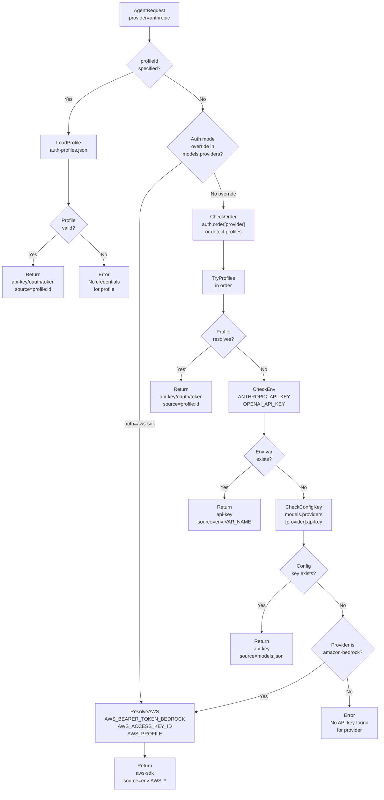
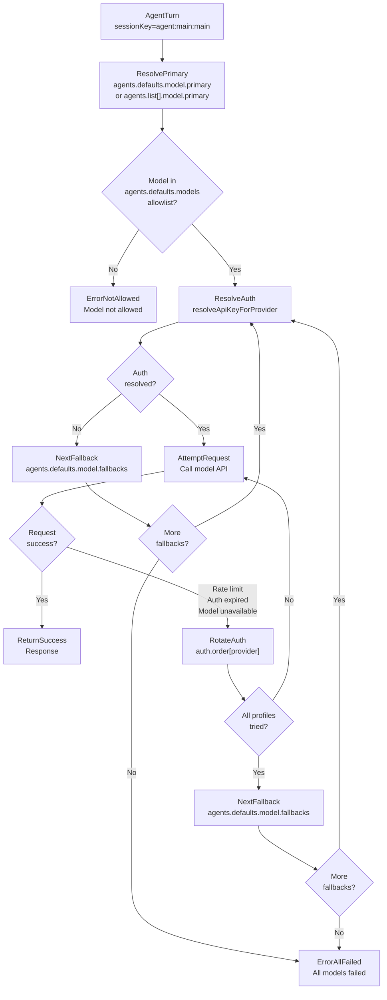
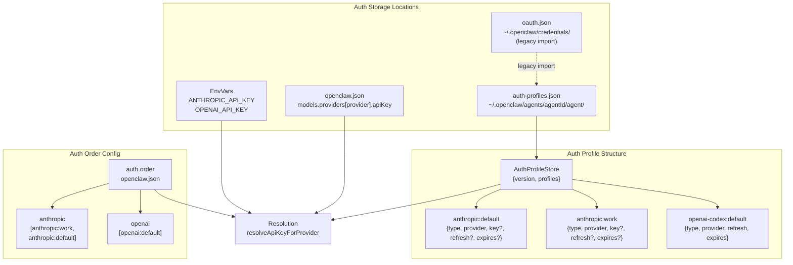

# Page: Model Commands

# Model Commands

<details>
<summary>Relevant source files</summary>

The following files were used as context for generating this wiki page:

- [README.md](README.md)
- [assets/avatar-placeholder.svg](assets/avatar-placeholder.svg)
- [docs/channels/zalo.md](docs/channels/zalo.md)
- [docs/channels/zalouser.md](docs/channels/zalouser.md)
- [docs/cli/index.md](docs/cli/index.md)
- [docs/docs.json](docs/docs.json)
- [docs/gateway/index.md](docs/gateway/index.md)
- [docs/gateway/troubleshooting.md](docs/gateway/troubleshooting.md)
- [docs/index.md](docs/index.md)
- [docs/start/getting-started.md](docs/start/getting-started.md)
- [docs/start/hubs.md](docs/start/hubs.md)
- [docs/start/onboarding.md](docs/start/onboarding.md)
- [docs/start/wizard.md](docs/start/wizard.md)
- [scripts/clawtributors-map.json](scripts/clawtributors-map.json)
- [scripts/update-clawtributors.ts](scripts/update-clawtributors.ts)
- [scripts/update-clawtributors.types.ts](scripts/update-clawtributors.types.ts)
- [src/config/config.ts](src/config/config.ts)
- [src/index.test.ts](src/index.test.ts)
- [src/index.ts](src/index.ts)
- [tsconfig.json](tsconfig.json)
- [ui/src/styles.css](ui/src/styles.css)
- [ui/src/styles/layout.mobile.css](ui/src/styles/layout.mobile.css)

</details>


## Purpose and Scope

This page documents the `openclaw models` CLI commands for managing AI model providers, authentication profiles, model selection, aliases, and fallback chains. These commands control which models the agent uses for text generation and image understanding tasks, and how authentication credentials are resolved across multiple providers.

For agent-level model configuration (per-agent overrides), see [Agent Commands](#12.2). For configuration file structure, see [Configuration File Structure](#4.1). For model provider concepts and failover behavior, see the system architecture diagrams.

---

## Command Overview

The `openclaw models` command family manages model providers and authentication:

| Command | Purpose | Config Key Modified |
|---------|---------|---------------------|
| `models` or `models status` | Show auth status and current model config | *(read-only)* |
| `models list` | List available models from catalog | *(read-only)* |
| `models set <model>` | Set primary text model | `agents.defaults.model.primary` |
| `models set-image <model>` | Set primary image model | `agents.defaults.imageModel.primary` |
| `models aliases list\|add\|remove` | Manage model shorthand aliases | `agents.defaults.models.<ref>.alias` |
| `models fallbacks list\|add\|remove\|clear` | Manage text model fallbacks | `agents.defaults.model.fallbacks` |
| `models image-fallbacks list\|add\|remove\|clear` | Manage image model fallbacks | `agents.defaults.imageModel.fallbacks` |
| `models scan` | Probe providers and select best model | `agents.defaults.model.primary` |
| `models auth add\|setup-token\|paste-token` | Add authentication credentials | Auth profiles |
| `models auth order get\|set\|clear` | Manage auth profile rotation order | `auth.order.<provider>` |

**Sources:** [docs/cli/index.md:746-860](), [README.md:40-44]()

---

## Model Auth Resolution Flow



**Diagram:** Model authentication resolution flow showing the cascade from explicit profile ID → auth order → environment variables → config file → provider-specific fallbacks (AWS SDK).

**Sources:** [src/config/config.ts:1-15](), [README.md:40-44]()

---

## Model Selection and Fallback Cascade



**Diagram:** Model selection flow showing primary model attempt → auth profile rotation → fallback cascade → exhaustion.

**Sources:** [src/config/config.ts:1-15](), [README.md:40-44]()

---

## `openclaw models` / `openclaw models status`

Shows the current model configuration, authentication status, and OAuth token expiry.

### Usage

```bash
openclaw models
openclaw models status
openclaw models status --json
openclaw models status --plain
openclaw models status --check
```

### Options

| Flag | Description |
|------|-------------|
| `--json` | Output structured JSON (includes auth profiles, expiry, configured models) |
| `--plain` | Plain text output (no styling, safe for scripts) |
| `--check` | Exit with non-zero code if auth is expired or missing (exit 1=expired/missing, 2=expiring soon) |
| `--probe` | Run live requests to validate auth (may consume tokens and trigger rate limits) |
| `--probe-provider <name>` | Limit probing to specific provider |
| `--probe-profile <id>` | Limit probing to specific profile(s) (comma-separated or repeat flag) |
| `--probe-timeout <ms>` | Timeout per probe request (default varies by provider) |
| `--probe-concurrency <n>` | Max concurrent probe requests |
| `--probe-max-tokens <n>` | Max tokens per probe request |

### Output Sections

The `models status` command displays:

1. **Primary Model:** `agents.defaults.model.primary` (with alias if defined)
2. **Image Model:** `agents.defaults.imageModel.primary` (if configured)
3. **Fallbacks:** `agents.defaults.model.fallbacks` array
4. **Image Fallbacks:** `agents.defaults.imageModel.fallbacks` array
5. **Auth Profiles:** Per-provider auth profile list with:
   - Profile ID
   - Auth mode (api-key, oauth, token, aws-sdk)
   - Expiry timestamp (OAuth/token only)
   - Status: active, expired, expiring, disabled
6. **Auth Order:** `auth.order.<provider>` arrays showing profile rotation order

### Exit Codes (with `--check`)

| Code | Meaning |
|------|---------|
| 0 | All auth profiles valid |
| 1 | Auth expired or missing |
| 2 | Auth expiring within threshold (default 7 days) |

### Examples

```bash
# Basic status overview
openclaw models status

# Check if auth is valid (script-friendly)
openclaw models status --check || echo "Auth needs refresh"

# JSON output for parsing
openclaw models status --json | jq '.authProfiles.anthropic[]'

# Probe live credentials (consumes tokens)
openclaw models status --probe --probe-provider anthropic

# Check specific profile
openclaw models status --probe --probe-profile "anthropic:work"
```

**Sources:** [docs/cli/index.md:776-791](), [README.md:40-44]()

---

## `openclaw models list`

Lists available models from the model catalog with filtering and formatting options.

### Usage

```bash
openclaw models list
openclaw models list --all
openclaw models list --provider anthropic
openclaw models list --json
```

### Options

| Flag | Description |
|------|-------------|
| `--all` | Include all catalog models (default shows only recommended/recent) |
| `--local` | Filter to locally-available models (Ollama, LM Studio) |
| `--provider <name>` | Filter to specific provider (anthropic, openai, google, etc.) |
| `--json` | Output JSON array of model objects |
| `--plain` | Plain text output (no ANSI styling) |

### Output Fields

Each model entry includes:
- **Model Reference:** `provider/model-id` (e.g., `anthropic/claude-opus-4-5`)
- **Name:** Human-readable model name
- **Context Window:** Token limit for input context
- **Max Output:** Maximum output tokens
- **Cost:** Input/output/cache-read/cache-write cost per million tokens
- **Reasoning:** Whether the model supports extended thinking/reasoning
- **Input Types:** Supported input modalities (text, image, audio, video)

### Examples

```bash
# List Anthropic models
openclaw models list --provider anthropic

# List all models with JSON output
openclaw models list --all --json

# List local models only
openclaw models list --local

# Pipe to jq for filtering
openclaw models list --json | jq '.[] | select(.reasoning == true)'
```

**Sources:** [docs/cli/index.md:767-775]()

---

## `openclaw models set <model>`

Sets the primary text model for agent responses. Writes to `agents.defaults.model.primary` in the config file.

### Usage

```bash
openclaw models set anthropic/claude-opus-4-5
openclaw models set openai/gpt-5.2
openclaw models set minimax/MiniMax-M2.1
```

### Arguments

| Argument | Description |
|----------|-------------|
| `<model>` | Model reference in `provider/model-id` format or alias |

### Behavior

1. Validates the model exists in the catalog or allowlist
2. Writes `agents.defaults.model.primary` to `~/.openclaw/openclaw.json`
3. Does **not** restart the gateway automatically (use `openclaw gateway restart`)

### Per-Agent Override

To set a model for a specific agent, use:
```bash
openclaw config set agents.list[<index>].model.primary "provider/model-id"
```

Or edit the config directly:
```json
{
  "agents": {
    "list": [
      {
        "id": "work",
        "model": {
          "primary": "openai/gpt-5.2",
          "fallbacks": ["anthropic/claude-opus-4-5"]
        }
      }
    ]
  }
}
```

### Examples

```bash
# Set Claude Opus 4.5 as primary
openclaw models set anthropic/claude-opus-4-5

# Set using alias (if defined)
openclaw models set opus

# Restart gateway to apply
openclaw gateway restart
```

**Sources:** [docs/cli/index.md:793-795]()

---

## `openclaw models set-image <model>`

Sets the primary image model for vision tasks (image analysis, OCR, etc.). Writes to `agents.defaults.imageModel.primary`.

### Usage

```bash
openclaw models set-image anthropic/claude-sonnet-4
openclaw models set-image openai/gpt-5.2-vision
openclaw models set-image google/gemini-2.5-flash
```

### Arguments

| Argument | Description |
|----------|-------------|
| `<model>` | Model reference supporting image input (`"image"` in `input` array) |

### Behavior

1. Validates the model supports image input
2. Writes `agents.defaults.imageModel.primary` to config
3. Falls back to primary text model if image model fails

### Examples

```bash
# Set Claude Sonnet 4 for images
openclaw models set-image anthropic/claude-sonnet-4

# Use the same model for text and images
openclaw models set anthropic/claude-opus-4-5
openclaw models set-image anthropic/claude-opus-4-5
```

**Sources:** [docs/cli/index.md:797-799]()

---

## Model Aliases

Model aliases provide shorthand references for frequently-used models. Aliases are stored in `agents.defaults.models.<model-ref>.alias`.

### `openclaw models aliases list`

Lists all configured aliases.

```bash
openclaw models aliases list
openclaw models aliases list --json
openclaw models aliases list --plain
```

**Output:**
```
opus     → anthropic/claude-opus-4-5
sonnet   → anthropic/claude-sonnet-4
gpt      → openai/gpt-5.2
```

### `openclaw models aliases add <alias> <model>`

Adds or updates an alias.

```bash
openclaw models aliases add opus anthropic/claude-opus-4-5
openclaw models aliases add fast google/gemini-2.5-flash
```

**Config written:**
```json
{
  "agents": {
    "defaults": {
      "models": {
        "anthropic/claude-opus-4-5": {
          "alias": "opus"
        }
      }
    }
  }
}
```

### `openclaw models aliases remove <alias>`

Removes an alias.

```bash
openclaw models aliases remove opus
```

### Alias Resolution

Aliases can be used anywhere a model reference is accepted:
- `openclaw models set opus` → resolves to `anthropic/claude-opus-4-5`
- `/model opus` (chat command) → switches to aliased model
- Config: `"primary": "opus"` → resolves at runtime

**Sources:** [docs/cli/index.md:801-808]()

---

## Model Fallbacks

Fallback chains define model retry behavior when the primary model fails (rate limits, auth expired, model unavailable). The agent attempts models in order until one succeeds or all fail.

### `openclaw models fallbacks list`

Lists the current fallback chain.

```bash
openclaw models fallbacks list
openclaw models fallbacks list --json
```

**Output:**
```
Primary:   anthropic/claude-opus-4-5
Fallbacks: openai/gpt-5.2
           google/gemini-2.5-pro
```

### `openclaw models fallbacks add <model>`

Appends a model to the fallback chain.

```bash
openclaw models fallbacks add openai/gpt-5.2
openclaw models fallbacks add google/gemini-2.5-pro
```

**Config written:**
```json
{
  "agents": {
    "defaults": {
      "model": {
        "primary": "anthropic/claude-opus-4-5",
        "fallbacks": ["openai/gpt-5.2", "google/gemini-2.5-pro"]
      }
    }
  }
}
```

### `openclaw models fallbacks remove <model>`

Removes a model from the fallback chain.

```bash
openclaw models fallbacks remove openai/gpt-5.2
```

### `openclaw models fallbacks clear`

Removes all fallbacks (primary-only mode).

```bash
openclaw models fallbacks clear
```

### Fallback Behavior

1. **Primary attempt:** Resolves auth via [auth resolution flow](#model-auth-resolution-flow)
2. **Auth profile rotation:** If primary auth fails, tries next profile in `auth.order[provider]`
3. **Fallback cascade:** If all auth profiles for primary fail, tries first fallback model
4. **Exhaustion:** If all fallbacks fail, returns error to user

### Per-Agent Fallback Overrides

To disable fallbacks for a specific agent:
```json
{
  "agents": {
    "list": [
      {
        "id": "work",
        "model": {
          "primary": "openai/gpt-5.2",
          "fallbacks": []
        }
      }
    ]
  }
}
```

**Important:** An explicitly empty `fallbacks` array **disables global fallbacks** for that agent. Omitting `fallbacks` inherits the global chain.

**Sources:** [docs/cli/index.md:810-816]()

---

## Image Model Fallbacks

Image model fallbacks work identically to text fallbacks but apply to vision tasks. Stored in `agents.defaults.imageModel.fallbacks`.

### Commands

```bash
openclaw models image-fallbacks list [--json] [--plain]
openclaw models image-fallbacks add <model>
openclaw models image-fallbacks remove <model>
openclaw models image-fallbacks clear
```

### Example Configuration

```json
{
  "agents": {
    "defaults": {
      "imageModel": {
        "primary": "anthropic/claude-sonnet-4",
        "fallbacks": ["openai/gpt-5.2-vision", "google/gemini-2.5-flash"]
      }
    }
  }
}
```

**Sources:** [docs/cli/index.md:818-826]()

---

## `openclaw models scan`

Scans available providers, probes authentication, and selects the best available model based on configurable criteria (parameter count, recency, cost, performance).

### Usage

```bash
openclaw models scan
openclaw models scan --yes
openclaw models scan --set-default
openclaw models scan --set-image
```

### Options

| Flag | Description |
|------|-------------|
| `--min-params <b>` | Minimum parameter count in billions (e.g., `70` for 70B+) |
| `--max-age-days <days>` | Maximum model age in days (e.g., `180` for models released in last 6 months) |
| `--provider <name>` | Limit scan to specific provider |
| `--max-candidates <n>` | Limit candidates displayed (default varies) |
| `--timeout <ms>` | Timeout per probe request |
| `--concurrency <n>` | Max concurrent probes |
| `--no-probe` | Skip live probing (use catalog metadata only) |
| `--yes` | Accept recommendation without prompting |
| `--no-input` | Non-interactive mode (requires `--yes`) |
| `--set-default` | Set as primary model after scan |
| `--set-image` | Set as image model after scan |
| `--json` | Output JSON scan results |

### Scan Behavior

1. **Load catalog:** Reads model definitions from `@mariozechner/pi-ai` and provider overrides
2. **Filter:** Applies `--min-params`, `--max-age-days`, `--provider` filters
3. **Auth probe:** Tests authentication for each provider (unless `--no-probe`)
4. **Rank:** Scores models by parameter count, recency, cost, and availability
5. **Present:** Shows top candidates with interactive selection (or auto-selects with `--yes`)
6. **Write:** Updates config if `--set-default` or `--set-image` passed

### Examples

```bash
# Interactive scan and selection
openclaw models scan

# Auto-select best model (non-interactive)
openclaw models scan --yes --set-default

# Scan recent large models only
openclaw models scan --min-params 70 --max-age-days 90

# Scan Anthropic models only
openclaw models scan --provider anthropic --yes
```

### Scan Output

```
Scanning models...
✓ anthropic: 3 models available (auth: ok)
✓ openai: 2 models available (auth: ok)
✗ google: no valid authentication

Top candidates:
 1. anthropic/claude-opus-4-5    (200B, 2025-01-01, $15/$75/M)
 2. openai/gpt-5.2               (175B, 2024-12-15, $10/$50/M)
 3. anthropic/claude-sonnet-4    (50B,  2024-11-20, $3/$15/M)

Select model: [1-3] or Enter to keep current
```

**Sources:** [docs/cli/index.md:828-843]()

---

## Authentication Management

The `openclaw models auth` commands manage provider authentication credentials and profile rotation order.

### Auth Storage Structure



**Diagram:** Auth profile storage and resolution structure showing multi-layered credential sources and profile-based rotation.

**Sources:** [src/config/config.ts:1-15](), [README.md:40-44]()

---

### Auth Modes

| Mode | Description | Source | Example |
|------|-------------|--------|---------|
| `api-key` | Static API key | Profile, env, or config | `ANTHROPIC_API_KEY=sk-ant-...` |
| `oauth` | OAuth2 with refresh token | Profile (stored via setup-token or OAuth flow) | Anthropic setup-token, OpenAI Codex OAuth |
| `token` | Long-lived token (non-refreshable) | Profile (pasted manually) | Anthropic `claude setup-token` output |
| `aws-sdk` | AWS credential chain | AWS SDK default chain (env, config, IAM role) | Bedrock models |

**Sources:** [src/config/config.ts:1-15]()

---

### `openclaw models auth add`

Interactive auth helper that guides through provider selection and credential input.

```bash
openclaw models auth add
```

**Behavior:**
1. Prompts for provider (anthropic, openai, google, etc.)
2. Prompts for auth method (API key, OAuth, setup-token)
3. Walks through credential input/OAuth flow
4. Writes to `~/.openclaw/agents/<agentId>/agent/auth-profiles.json`
5. Optionally adds to `auth.order[provider]` rotation

**Sources:** [docs/cli/index.md:845-850]()

---

### `openclaw models auth setup-token`

Paste a setup-token from `claude setup-token` (or equivalent) for Anthropic authentication.

```bash
openclaw models auth setup-token --provider anthropic
openclaw models auth setup-token --provider anthropic --yes
```

#### Options

| Flag | Description |
|------|-------------|
| `--provider <name>` | Provider ID (default: `anthropic`) |
| `--yes` | Skip confirmation prompts |

#### Flow

1. Runs `claude setup-token` on the gateway host (or another machine)
2. Copies the output token
3. Runs `openclaw models auth setup-token --provider anthropic`
4. Pastes the token when prompted
5. Token is validated and stored in `auth-profiles.json` with expiry

#### Setup-Token vs OAuth

| Method | Pros | Cons |
|--------|------|------|
| **Setup-token** | Simple, no browser flow, works headless | Manual refresh when expired |
| **OAuth** | Auto-refresh, long-lived | Requires browser, complex setup |

**Recommendation:** Use setup-token for production deployments. OAuth is legacy.

**Sources:** [docs/cli/index.md:845-850](), [docs/start/wizard.md:66-77](), [README.md:40-44]()

---

### `openclaw models auth paste-token`

Manually paste a token obtained elsewhere (useful for headless setups or when the token generation happened on a different machine).

```bash
openclaw models auth paste-token --provider anthropic
openclaw models auth paste-token --provider anthropic --profile-id anthropic:prod --expires-in 365d
```

#### Options

| Flag | Description |
|------|-------------|
| `--provider <name>` | Provider ID |
| `--profile-id <id>` | Custom profile ID (default: `<provider>:manual`) |
| `--expires-in <duration>` | Expiry duration (e.g., `365d`, `12h`, `30d`) |

#### Examples

```bash
# Paste Anthropic token with 1-year expiry
openclaw models auth paste-token --provider anthropic --expires-in 365d

# Paste with custom profile ID
openclaw models auth paste-token --provider anthropic --profile-id anthropic:backup
```

**Sources:** [docs/cli/index.md:845-850]()

---

### `openclaw models auth order get|set|clear`

Manages auth profile rotation order for multi-profile setups. When a request fails (rate limit, expired token), the system tries the next profile in the order.

#### `openclaw models auth order get`

Shows the current rotation order.

```bash
openclaw models auth order get --provider anthropic
openclaw models auth order get --provider anthropic --agent work
openclaw models auth order get --provider anthropic --json
```

**Output:**
```
Provider: anthropic
Order:    anthropic:work, anthropic:default, anthropic:backup
```

#### `openclaw models auth order set`

Sets the rotation order.

```bash
openclaw models auth order set --provider anthropic anthropic:work anthropic:default
openclaw models auth order set --provider openai openai:personal openai:work
openclaw models auth order set --provider anthropic --agent work anthropic:work anthropic:fallback
```

**Config written:**
```json
{
  "auth": {
    "order": {
      "anthropic": ["anthropic:work", "anthropic:default"]
    }
  }
}
```

**Per-agent override:**
```json
{
  "agents": {
    "list": [
      {
        "id": "work",
        "auth": {
          "order": {
            "anthropic": ["anthropic:work", "anthropic:fallback"]
          }
        }
      }
    ]
  }
}
```

#### `openclaw models auth order clear`

Removes the rotation order (falls back to profile detection).

```bash
openclaw models auth order clear --provider anthropic
openclaw models auth order clear --provider anthropic --agent work
```

#### Rotation Behavior

When a model request fails with a retryable error (rate limit, 401 Unauthorized, 503 Service Unavailable):

1. **Current profile fails:** Request returns error
2. **Check order:** Load `auth.order[provider]` (or agent override)
3. **Try next profile:** Resolve auth for next profile in order
4. **Retry request:** Attempt same request with new credentials
5. **Repeat:** Continue until success or all profiles exhausted
6. **Fallback model:** If all profiles fail, try next model in `agents.defaults.model.fallbacks`

**Sources:** [docs/cli/index.md:852-860](), [src/config/config.ts:1-15]()

---

## Common Workflows

### First-Time Model Setup

```bash
# 1. Add Anthropic API key
openclaw models auth add
# → Select: anthropic
# → Select: API key
# → Paste key

# 2. Set primary model
openclaw models set anthropic/claude-opus-4-5

# 3. Add fallbacks
openclaw models fallbacks add openai/gpt-5.2
openclaw models fallbacks add google/gemini-2.5-pro

# 4. Verify
openclaw models status

# 5. Restart gateway
openclaw gateway restart
```

**Sources:** [docs/start/getting-started.md:78-102](), [docs/start/wizard.md:62-77]()

---

### Multi-Provider Setup with Rotation

```bash
# 1. Add multiple Anthropic profiles
openclaw models auth paste-token --provider anthropic --profile-id anthropic:primary --expires-in 365d
openclaw models auth paste-token --provider anthropic --profile-id anthropic:backup --expires-in 365d

# 2. Set rotation order
openclaw models auth order set --provider anthropic anthropic:primary anthropic:backup

# 3. Add OpenAI as fallback provider
openclaw models auth add
# → Select: openai
# → Paste API key

# 4. Configure fallback chain
openclaw models set anthropic/claude-opus-4-5
openclaw models fallbacks add openai/gpt-5.2

# 5. Verify
openclaw models status
```

**Sources:** [docs/cli/index.md:852-860]()

---

### Per-Agent Model Configuration

```bash
# 1. Add new agent
openclaw agents add work --workspace ~/.openclaw/workspace-work

# 2. Configure work agent with different model
openclaw config set agents.list[1].model.primary "openai/gpt-5.2"
openclaw config set agents.list[1].model.fallbacks '["google/gemini-2.5-pro"]'

# 3. Copy auth profiles to work agent
cp ~/.openclaw/agents/main/agent/auth-profiles.json \
   ~/.openclaw/agents/work/agent/auth-profiles.json

# 4. Verify
openclaw models status
openclaw status
```

**Sources:** [docs/cli/index.md:516-558](), [docs/start/wizard.md:84-98]()

---

### Token Expiry and Refresh

```bash
# Check expiry
openclaw models status --check
echo $?  # Exit code: 0=ok, 1=expired, 2=expiring

# Refresh expired token (Anthropic)
claude setup-token
openclaw models auth setup-token --provider anthropic
# → Paste new token

# Or paste token generated elsewhere
openclaw models auth paste-token --provider anthropic --expires-in 365d

# Verify
openclaw models status

# Restart gateway
openclaw gateway restart
```

**Sources:** [docs/gateway/troubleshooting.md:164-213](), [docs/cli/index.md:776-791]()

---

### Model Scanning and Auto-Selection

```bash
# Scan all providers and select interactively
openclaw models scan

# Auto-select best available (non-interactive)
openclaw models scan --yes --set-default

# Scan for large, recent models only
openclaw models scan --min-params 70 --max-age-days 90 --yes --set-default

# Scan Anthropic only
openclaw models scan --provider anthropic --yes

# Scan without probing (metadata only)
openclaw models scan --no-probe
```

**Sources:** [docs/cli/index.md:828-843]()

---

## Troubleshooting

### "No API key found for provider"

**Symptom:** Agent turns fail with "No API key found for provider 'anthropic'"

**Diagnosis:**
```bash
openclaw models status
openclaw models status --probe --probe-provider anthropic
```

**Fix:**
```bash
# Option 1: Add API key
openclaw models auth add

# Option 2: Paste setup-token
openclaw models auth setup-token --provider anthropic

# Option 3: Copy auth profiles from main agent
cp ~/.openclaw/agents/main/agent/auth-profiles.json \
   ~/.openclaw/agents/<your-agent>/agent/auth-profiles.json
```

**Sources:** [docs/gateway/troubleshooting.md:32-58]()

---

### "OAuth token refresh failed"

**Symptom:** Gateway logs show "OAuth token refresh failed" or "401 Unauthorized"

**Diagnosis:**
```bash
openclaw models status --check
```

**Fix (recommended: switch to setup-token):**
```bash
# On gateway host
claude setup-token
openclaw models auth setup-token --provider anthropic
openclaw gateway restart
```

**Or paste token generated elsewhere:**
```bash
openclaw models auth paste-token --provider anthropic --expires-in 365d
```

**Sources:** [docs/gateway/troubleshooting.md:184-213]()

---

### "Agent failed before reply: Unknown model"

**Symptom:** Model name rejected with "Unknown model: anthropic/claude-haiku-3-5"

**Cause:** Model deprecated or not in catalog

**Fix:**
```bash
# List available models
openclaw models list --provider anthropic

# Update to supported model
openclaw models set anthropic/claude-opus-4-5

# Or scan for best available
openclaw models scan --provider anthropic --yes --set-default
```

**Sources:** [docs/gateway/troubleshooting.md:244-319]()

---

### All Models Failing

**Symptom:** "All models failed" in agent response

**Diagnosis checklist:**
```bash
# 1. Check auth status
openclaw models status --check

# 2. Probe live credentials
openclaw models status --probe

# 3. Check gateway logs
openclaw logs --limit 50 | grep -i "model\|auth\|error"

# 4. Verify config
openclaw config get agents.defaults.model
openclaw config get agents.defaults.model.fallbacks
```

**Common causes:**
- All auth profiles expired
- Rate limits hit on all providers
- Model refs in fallback chain are invalid
- Network connectivity issues

**Fix:**
```bash
# Refresh auth
openclaw models auth setup-token --provider anthropic

# Verify fallback chain
openclaw models fallbacks list

# Add working fallbacks
openclaw models fallbacks add openai/gpt-5.2
openclaw models fallbacks add google/gemini-2.5-pro

# Restart gateway
openclaw gateway restart
```

**Sources:** [docs/gateway/troubleshooting.md:32-243]()

---

## Related Commands

- **Agent configuration:** `openclaw agents add` for per-agent model overrides ([Agent Commands](#12.2))
- **Config manipulation:** `openclaw config get/set` for direct config edits ([Configuration Commands](#12.5))
- **Status checks:** `openclaw status --usage` for provider usage/quota ([Diagnostic Commands](#12.6))
- **Gateway operations:** `openclaw gateway restart` to apply model changes ([Gateway Commands](#12.1))

**Sources:** [docs/cli/index.md:1-763]()

---