# Page: Configuration Commands

# Configuration Commands

<details>
<summary>Relevant source files</summary>

The following files were used as context for generating this wiki page:

- [README.md](README.md)
- [assets/avatar-placeholder.svg](assets/avatar-placeholder.svg)
- [docs/channels/zalo.md](docs/channels/zalo.md)
- [docs/channels/zalouser.md](docs/channels/zalouser.md)
- [docs/cli/index.md](docs/cli/index.md)
- [docs/docs.json](docs/docs.json)
- [docs/gateway/doctor.md](docs/gateway/doctor.md)
- [docs/gateway/index.md](docs/gateway/index.md)
- [docs/gateway/troubleshooting.md](docs/gateway/troubleshooting.md)
- [docs/index.md](docs/index.md)
- [docs/start/getting-started.md](docs/start/getting-started.md)
- [docs/start/hubs.md](docs/start/hubs.md)
- [docs/start/onboarding.md](docs/start/onboarding.md)
- [docs/start/wizard.md](docs/start/wizard.md)
- [scripts/clawtributors-map.json](scripts/clawtributors-map.json)
- [scripts/update-clawtributors.ts](scripts/update-clawtributors.ts)
- [scripts/update-clawtributors.types.ts](scripts/update-clawtributors.types.ts)
- [src/agents/bash-tools.test.ts](src/agents/bash-tools.test.ts)
- [src/agents/pi-tools-agent-config.test.ts](src/agents/pi-tools-agent-config.test.ts)
- [src/agents/sandbox-skills.test.ts](src/agents/sandbox-skills.test.ts)
- [src/commands/configure.gateway.test.ts](src/commands/configure.gateway.test.ts)
- [src/commands/configure.gateway.ts](src/commands/configure.gateway.ts)
- [src/commands/configure.ts](src/commands/configure.ts)
- [src/commands/doctor.ts](src/commands/doctor.ts)
- [src/commands/onboard-helpers.test.ts](src/commands/onboard-helpers.test.ts)
- [src/commands/onboard-helpers.ts](src/commands/onboard-helpers.ts)
- [src/commands/onboard-interactive.ts](src/commands/onboard-interactive.ts)
- [src/config/config.ts](src/config/config.ts)
- [src/config/merge-config.ts](src/config/merge-config.ts)
- [src/index.test.ts](src/index.test.ts)
- [src/index.ts](src/index.ts)
- [src/wizard/onboarding.gateway-config.test.ts](src/wizard/onboarding.gateway-config.test.ts)
- [src/wizard/onboarding.gateway-config.ts](src/wizard/onboarding.gateway-config.ts)
- [src/wizard/onboarding.ts](src/wizard/onboarding.ts)
- [src/wizard/onboarding.types.ts](src/wizard/onboarding.types.ts)
- [tsconfig.json](tsconfig.json)
- [ui/src/styles.css](ui/src/styles.css)
- [ui/src/styles/layout.mobile.css](ui/src/styles/layout.mobile.css)

</details>


This page documents the CLI commands for managing OpenClaw configuration: initializing, editing, repairing, and resetting the configuration file at `~/.openclaw/openclaw.json`. These commands provide both interactive and non-interactive interfaces for configuration management.

For general CLI reference, see [CLI Reference](#12). For channel-specific configuration, see [Channel Commands](#12.3). For model configuration, see [Model Commands](#12.4). For diagnostic and repair operations beyond configuration, see [Diagnostic Commands](#12.6).

---

## Overview

OpenClaw provides seven primary configuration commands, each implemented as a separate CLI subcommand registered in the program builder:

| Command | Purpose | Mode | Config File Required | Entry Point |
|---------|---------|------|---------------------|-------------|
| `openclaw setup` | Initialize minimal configuration | Interactive/Non-interactive | No | [src/commands/setup.ts]() |
| `openclaw onboard` | Full guided setup wizard | Interactive/Non-interactive | No | [src/commands/onboard.ts]() |
| `openclaw configure` | Reconfigure specific sections | Interactive | Optional | [src/commands/configure.ts]() |
| `openclaw config` | Direct key manipulation | Non-interactive | Yes | [src/commands/config.ts]() |
| `openclaw doctor` | Validate and repair configuration | Interactive/Non-interactive | Optional | [src/commands/doctor.ts]() |
| `openclaw reset` | Remove configuration and state | Interactive/Non-interactive | Optional | [src/commands/reset.ts]() |
| `openclaw uninstall` | Remove service and state | Interactive/Non-interactive | Optional | [src/commands/uninstall.ts]() |

All commands write to `CONFIG_PATH` (default `~/.openclaw/openclaw.json`) via `writeConfigFile()` and respect the `--dev` and `--profile` flags for state isolation. Configuration is validated against `OpenClawSchema` using Zod before writing.

**Sources**: [docs/cli/index.md:87-102](), [src/commands/doctor.ts:1-314](), [src/config/config.ts:14]()

---

## Configuration File Lifecycle

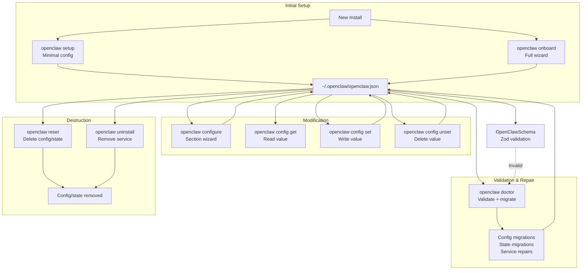

**Diagram**: Configuration file lifecycle showing command relationships and data flow

**Sources**: [docs/start/wizard.md:1-322](), [docs/gateway/doctor.md:1-224](), [src/commands/doctor.ts:58-306]()

---

## Setup Command

### Purpose

`openclaw setup` initializes a minimal configuration file, creating the necessary directory structure and a starter config. It does not run the full onboarding wizard unless `--wizard` is passed.

### Implementation

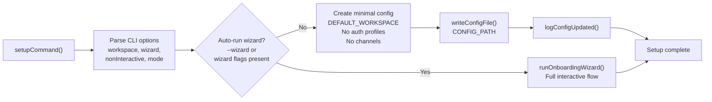

**Diagram**: `setupCommand()` execution flow with automatic wizard detection

**Sources**: [src/commands/setup.ts](), [src/wizard/onboarding.ts:89-470](), [src/config/config.ts:38]()

### Options

| Flag | Type | Description | Default |
|------|------|-------------|---------|
| `--workspace <dir>` | string | Agent workspace path | `~/.openclaw/workspace` |
| `--wizard` | boolean | Run onboarding wizard | `false` |
| `--non-interactive` | boolean | Skip prompts | `false` |
| `--mode <local\|remote>` | string | Wizard mode | - |
| `--remote-url <url>` | string | Remote Gateway URL | - |
| `--remote-token <token>` | string | Remote Gateway token | - |

**Sources**: [docs/cli/index.md:276-289](), [src/wizard/onboarding.ts:87-451]()

---

## Onboard Command

### Purpose

`openclaw onboard` runs the comprehensive onboarding wizard, configuring model authentication, gateway settings, channels, workspace, skills, and optionally installing the background service.

### Architecture

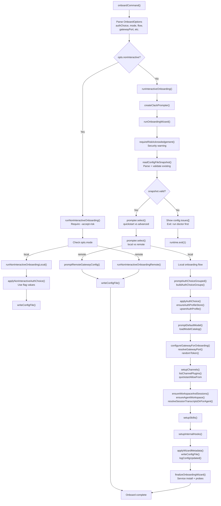

**Diagram**: `onboardCommand()` execution flow showing actual function names and config validation path

**Sources**: [src/commands/onboard.ts](), [src/wizard/onboarding.ts:89-470](), [src/commands/onboard-non-interactive.ts:10-37](), [src/commands/onboard-helpers.ts:29-106]()

### Interactive Flow Sections

The wizard walks through these sections in sequence (for local mode):

1. **Risk Acknowledgement**: Security warning about agent capabilities
2. **Existing Config Handling**: Keep/Modify/Reset options
3. **Flow Selection**: QuickStart (defaults) or Advanced (full control)
4. **Mode Selection**: Local gateway or Remote connection
5. **Auth Configuration**: Model provider authentication (OAuth/API key)
6. **Model Selection**: Primary model and optional fallbacks
7. **Gateway Configuration**: Port, bind mode, auth mode, Tailscale exposure
8. **Channels Configuration**: WhatsApp/Telegram/Discord/Signal/etc setup
9. **Workspace Setup**: Create workspace directory and bootstrap files
10. **Skills Setup**: Install optional dependencies for skills
11. **Hooks Setup**: Configure session memory hooks
12. **Service Installation**: Install and start background service (optional)
13. **Health Check**: Verify gateway reachability

**Sources**: [src/wizard/onboarding.ts:46-451](), [docs/start/wizard.md:48-149]()

### Non-Interactive Mode

When `--non-interactive` is passed, the wizard requires all configuration via CLI flags:

```bash
openclaw onboard --non-interactive \
  --mode local \
  --auth-choice apiKey \
  --anthropic-api-key "$ANTHROPIC_API_KEY" \
  --gateway-port 18789 \
  --gateway-bind loopback \
  --install-daemon \
  --daemon-runtime node
```

Implementation branches at [src/commands/onboard-non-interactive.ts:10-37]():

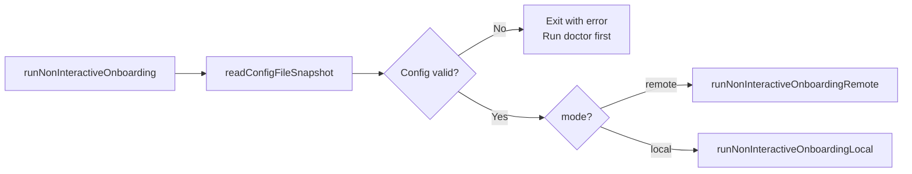

**Diagram**: Non-interactive onboarding branch selection

**Sources**: [src/commands/onboard-non-interactive.ts:1-37](), [docs/start/wizard.md:183-274]()

### Auth Choice Flow

Authentication configuration is handled by `applyAuthChoice()` from [src/commands/auth-choice.apply.js](), which dispatches to provider-specific handlers:

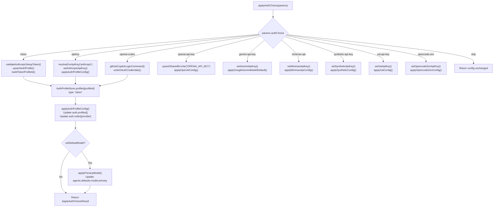

**Diagram**: `applyAuthChoice()` dispatch logic showing actual storage functions

| Auth Choice | Provider | Storage Location | Store Function |
|-------------|----------|------------------|----------------|
| `token` | `anthropic` | `auth-profiles.json` | `upsertAuthProfile()` with `type: 'token'` |
| `apiKey` | `anthropic` | `auth-profiles.json` | `setAnthropicApiKey()` |
| `openai-codex` | `openai-codex` | `auth-profiles.json` | `writeOAuthCredentials()` |
| `openai-api-key` | `openai` | `.env` via `upsertSharedEnvVar()` | N/A (env-based) |
| `github-copilot` | `github-copilot` | `auth-profiles.json` | `writeOAuthCredentials()` |
| `gemini-api-key` | `google` | `auth-profiles.json` | `setGeminiApiKey()` |
| `minimax-api` | `minimax` | `auth-profiles.json` | `setMinimaxApiKey()` |
| `synthetic-api-key` | `synthetic` | `auth-profiles.json` | `setSyntheticApiKey()` |
| `xai-api-key` | `xai` | `auth-profiles.json` | `setXaiApiKey()` |
| `opencode-zen` | `opencode` | `auth-profiles.json` | `setOpencodeZenApiKey()` |
| `chutes` | `chutes` | `auth-profiles.json` | `writeOAuthCredentials()` |
| `skip` | - | - | No-op |

The system groups these choices by provider using `buildAuthChoiceGroups()` for easier selection in the UI [src/commands/auth-choice-options.ts:236-260]().

**Sources**: [src/commands/auth-choice.apply.js](), [src/commands/auth-choice-options.ts:139-260](), [src/commands/onboard-auth.credentials.ts:9-219](), [src/agents/auth-profiles.ts]()

---

## Configure Command

### Purpose

`openclaw configure` provides an interactive section-based configuration editor. It presents a menu of configuration domains and guides the user through editing each section.

### Available Sections

The sections are defined in `CONFIGURE_WIZARD_SECTIONS` constant exported from [src/commands/configure.shared.js]():

```typescript
export type WizardSection = 
  | "models" 
  | "gateway" 
  | "channels" 
  | "skills" 
  | "web" 
  | "security";
```

| Section | Configuration Domain | Handler Function | Purpose |
|---------|---------------------|------------------|---------|
| `models` | Model providers and authentication | `configureModelsSection()` | Add/edit model auth profiles via `models auth add` |
| `gateway` | Gateway server settings | `configureGatewaySection()` | Port, bind, auth mode, Tailscale exposure |
| `channels` | Messaging channel integrations | `configureChannelsSection()` | Add/configure WhatsApp, Telegram, Discord, etc. |
| `skills` | Skill dependencies | `configureSkillsSection()` | Install skill requirements via `npx clawhub` |
| `web` | Web tools (search, fetch) | `configureWebToolsSection()` | API keys for `web_search`, `web_fetch` |
| `security` | Security audit and fixes | `configureSecuritySection()` | Run `openclaw security audit --fix` |

When invoked without `--section`, `configureCommand()` calls `configureCommandWithSections()` which presents a menu via `prompter.select()` to choose which section to edit.

### Usage

```bash
# Interactive menu
openclaw configure

# Direct to specific section
openclaw configure --section models
openclaw configure --section gateway
openclaw configure --section channels
openclaw configure --section web
```

**Sources**: [src/commands/configure.ts:1-5](), [docs/cli/index.md:334-340]()

---

## Config Command

### Purpose

`openclaw config` provides non-interactive direct manipulation of configuration values using dot/bracket notation paths.

### Subcommands

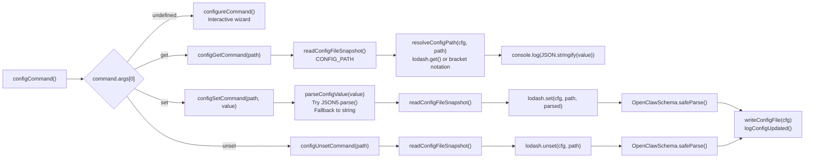

**Diagram**: `configCommand()` subcommand dispatch with actual path resolution functions

**Sources**: [src/commands/config.ts](), [src/config/config.ts:14-38]()

### Examples

```bash
# Get a value
openclaw config get gateway.port
openclaw config get agents.defaults.model.primary

# Set a value (JSON5 or string)
openclaw config set gateway.port 19000
openclaw config set agents.defaults.model.primary "anthropic/claude-opus-4"
openclaw config set tools.allow '["read", "write", "exec"]'

# Delete a key
openclaw config unset gateway.auth.password
openclaw config unset channels.telegram.botToken
```

### Path Syntax

The config commands support both dot notation and bracket notation for nested paths:

- Dot notation: `gateway.port`, `agents.defaults.workspace`
- Bracket notation: `channels["whatsapp"].allowFrom[0]`
- Mixed: `agents.list[0].workspace`

**Sources**: [docs/cli/index.md:337-345](), [src/config/config.ts:14]()

---

## Doctor Command

### Purpose

`openclaw doctor` performs comprehensive health checks, configuration validation, state migrations, and repairs. It detects and fixes common configuration issues, migrates legacy formats, and ensures system integrity.

### Execution Flow

```mermaid
graph TB
    Entry["doctorCommand(runtime, options)"] --> Header["printWizardHeader(runtime)"]
    Header --> UpdateCheck["maybeOfferUpdateBeforeDoctor()<br/>resolveOpenClawPackageRoot()"]
    UpdateCheck --> UiProtocol["maybeRepairUiProtocolFreshness()<br/>Compare protocol versions"]
    UiProtocol --> SourceIssues["noteSourceInstallIssues(root)<br/>Check pnpm workspace"]
    SourceIssues --> DeprecatedEnv["noteDeprecatedLegacyEnvVars()<br/>Warn about old env vars"]
    
    DeprecatedEnv --> LoadConfig["loadAndMaybeMigrateDoctorConfig()<br/>readConfigFileSnapshot()<br/>applyConfigMigrations()"]
    LoadConfig --> CheckGatewayMode{"cfg.gateway?.mode<br/>defined?"}
    CheckGatewayMode -->|No| WarnMode["note('gateway.mode is unset')<br/>Gateway start blocked"]
    CheckGatewayMode -->|Yes| AuthHealth["noteAuthProfileHealth()<br/>ensureAuthProfileStore()<br/>Check OAuth expiry"]
    WarnMode --> AuthHealth
    
    AuthHealth --> CheckAnthropicProfile["maybeRepairAnthropicOAuthProfileId()<br/>Fix legacy profile IDs"]
    CheckAnthropicProfile --> RemoveCli["maybeRemoveDeprecatedCliAuthProfiles()<br/>Remove *:cli profiles"]
    RemoveCli --> GatewayAuth{"resolveMode(cfg) === 'local'<br/>&& missing token?"}
    GatewayAuth -->|Yes| OfferToken["prompter.confirmRepair()<br/>'Generate gateway token?'"]
    OfferToken --> GenToken["randomToken()<br/>Update cfg.gateway.auth.token"]
    GatewayAuth -->|No| LegacyState["detectLegacyStateMigrations({cfg})<br/>Scan sessions/, agent/, credentials/"]
    GenToken --> LegacyState
    
    LegacyState --> CheckMigrations{"preview.length > 0?"}
    CheckMigrations -->|Yes| RunMigrations["runLegacyStateMigrations()<br/>moveLegacySessions()<br/>moveLegacyAgent()<br/>migrateLegacyWhatsAppAuth()"]
    CheckMigrations -->|No| StateIntegrity["noteStateIntegrity()<br/>Check CONFIG_DIR permissions<br/>Check session JSONL files"]
    RunMigrations --> StateIntegrity
    
    StateIntegrity --> SandboxCheck["maybeRepairSandboxImages()<br/>detectDockerImages()<br/>buildDockerImage()"]
    SandboxCheck --> SandboxWarn["noteSandboxScopeWarnings(cfg)<br/>Check sandbox.scope config"]
    SandboxWarn --> ExtraServices["maybeScanExtraGatewayServices()<br/>options.deep === true<br/>scanSystemServices()"]
    ExtraServices --> ServiceConfig["maybeRepairGatewayServiceConfig()<br/>resolveGatewayService()<br/>compareServiceConfig()"]
    ServiceConfig --> MacOverrides["noteMacLaunchAgentOverrides()<br/>Check LaunchAgent EnvironmentVariables"]
    MacOverrides --> Security["noteSecurityWarnings(cfg)<br/>Check channels.*.allowFrom"]
    
    Security --> HooksModel["Check cfg.hooks?.gmail?.model<br/>resolveHooksGmailModel()<br/>getModelRefStatus()"]
    HooksModel --> Linger["ensureSystemdUserLingerInteractive()<br/>platform === 'linux'<br/>checkLingerStatus()"]
    Linger --> WorkspaceStatus["noteWorkspaceStatus(cfg)<br/>Detect ~/openclaw vs workspace"]
    WorkspaceStatus --> HealthCheck["checkGatewayHealth()<br/>buildGatewayConnectionDetails()<br/>callGateway('health')"]
    HealthCheck --> DaemonRepair["maybeRepairGatewayDaemon()<br/>Restart prompt if unhealthy"]
    
    DaemonRepair --> WriteCheck{"prompter.shouldRepair ||<br/>configResult.shouldWriteConfig?"}
    WriteCheck -->|Yes| WriteConfig["applyWizardMetadata(cfg)<br/>writeConfigFile(cfg)<br/>logConfigUpdated(runtime)"]
    WriteCheck -->|No| SkipWrite["Log 'run doctor --fix'"]
    WriteConfig --> WorkspaceTips["noteWorkspaceBackupTip()<br/>shouldSuggestMemorySystem()<br/>MEMORY_SYSTEM_PROMPT"]
    SkipWrite --> WorkspaceTips
    WorkspaceTips --> ValidateFinal["readConfigFileSnapshot()<br/>Report snapshot.issues[]"]
    ValidateFinal --> Done["outro('Doctor complete')"]
```

**Diagram**: `doctorCommand()` execution flow with actual function names and migration checks

**Sources**: [src/commands/doctor.ts:65-313](), [src/commands/doctor-config-flow.ts](), [src/commands/doctor-state-migrations.ts](), [src/commands/doctor-auth.ts]()

### Key Repair Operations

#### 1. Config Migrations

Doctor migrates legacy configuration keys to current schema via `applyConfigMigrations()` in [src/commands/doctor-config-flow.ts]():

```mermaid
graph LR
    OldConfig["Old config keys"] --> DetectLegacy["applyConfigMigrations(cfg)"]
    DetectLegacy --> CheckRouting{"cfg.routing<br/>exists?"}
    CheckRouting -->|Yes| MigrateRouting["routing.allowFrom → channels.whatsapp.allowFrom<br/>routing.groupChat.* → messages.groupChat.*<br/>routing.bindings → top-level bindings"]
    CheckRouting -->|No| CheckAgent{"cfg.agent<br/>exists?"}
    
    MigrateRouting --> CheckAgent
    CheckAgent -->|Yes| MigrateAgent["agent.model → agents.defaults.model<br/>agent.tools → tools.*<br/>agent.elevated → tools.elevated<br/>agent.exec → tools.exec"]
    CheckAgent -->|No| CheckIdentity{"cfg.identity<br/>exists?"}
    
    MigrateAgent --> CheckIdentity
    CheckIdentity -->|Yes| MigrateIdentity["identity → agents.list[0].identity"]
    CheckIdentity -->|No| CheckBindings{"cfg.bindings[]<br/>has accountID?"}
    
    MigrateIdentity --> CheckBindings
    CheckBindings -->|Yes| FixAccountId["bindings[].match.accountID → accountId"]
    CheckBindings -->|No| Done["Return migrated config"]
    FixAccountId --> Done
```

**Diagram**: Config migration flow through `applyConfigMigrations()`

Key migrations performed:
- `routing.allowFrom` → `channels.whatsapp.allowFrom`
- `routing.groupChat.*` → `messages.groupChat.*` + channel-specific overrides
- `routing.bindings` → top-level `bindings`
- `routing.agents` → `agents.list` with `default: true` flag
- `agent.*` → `agents.defaults.*` and `tools.*`
- `identity` → `agents.list[].identity`
- `bindings[].match.accountID` → `bindings[].match.accountId`

**Sources**: [src/commands/doctor-config-flow.ts](), [src/config/migrations.ts]()

#### 2. State Migrations

Migrates on-disk state to current directory structure via functions in [src/commands/doctor-state-migrations.ts]():

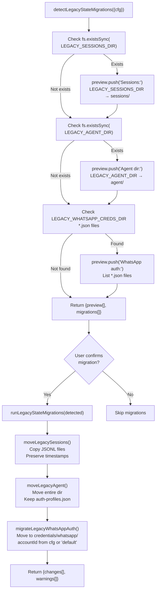

**Diagram**: Legacy state migration detection and execution flow

Migration paths:
- **Sessions**: `~/.openclaw/sessions/` → `~/.openclaw/agents/<agentId>/sessions/`
- **Agent dir**: `~/.openclaw/agent/` → `~/.openclaw/agents/<agentId>/agent/`
- **WhatsApp auth**: `~/.openclaw/credentials/*.json` (except `oauth.json`) → `~/.openclaw/credentials/whatsapp/<accountId>/`

The migrations are idempotent and preserve original files as backups.

**Sources**: [src/commands/doctor-state-migrations.ts](), [src/config/sessions.ts]()

#### 3. Auth Profile Health

Checks OAuth token expiry and can refresh expiring tokens [src/commands/doctor-auth.ts]():

- Anthropic OAuth: Check refresh token expiry, prompt for refresh
- OpenAI Codex: Check access token expiry
- Deprecated CLI profiles: Remove legacy `*:cli` profiles

#### 4. Gateway Service Repair

Updates service configuration to match current defaults [src/commands/doctor-gateway-services.ts]():

- LaunchAgent (macOS): Update program path, environment, ports
- systemd (Linux): Update exec path, environment, working directory
- schtasks (Windows): Update command, arguments

#### 5. Sandbox Image Repair

Ensures Docker images exist when sandboxing is enabled [src/commands/doctor-sandbox.ts]():

- Pull `openclaw/coding-agent` base image
- Build custom images if Dockerfile present

**Sources**: [src/commands/doctor.ts:65-306](), [docs/gateway/doctor.md:1-224]()

### Command Options

| Flag | Description | Default |
|------|-------------|---------|
| `--yes` | Accept defaults without prompting | `false` |
| `--non-interactive` | Skip prompts, apply safe migrations only | `false` |
| `--repair` | Apply recommended repairs without prompting | `false` |
| `--force` | Apply aggressive repairs (overwrites custom configs) | `false` |
| `--deep` | Scan system services for extra gateway installs | `false` |
| `--no-workspace-suggestions` | Disable workspace memory hints | `false` |

**Sources**: [docs/cli/index.md:346-354](), [docs/gateway/doctor.md:14-56]()

---

## Reset Command

### Purpose

`openclaw reset` removes configuration, credentials, sessions, and optionally workspace files. It provides granular control over what to delete.

### Reset Scopes

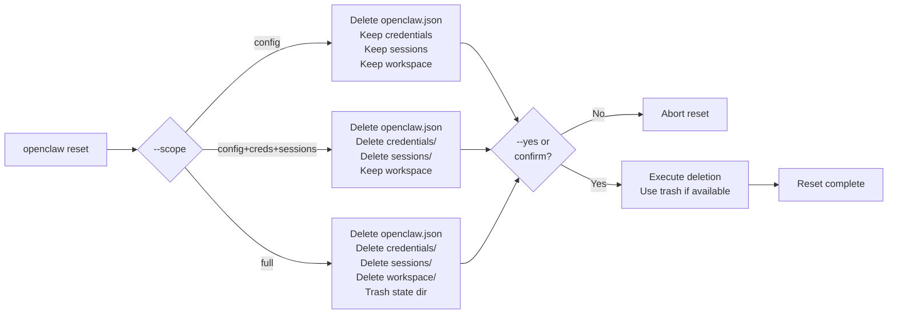

**Diagram**: Reset command scope selection and execution

### Options

| Flag | Description | Required |
|------|-------------|----------|
| `--scope <scope>` | Reset scope | Yes (in non-interactive) |
| `--yes` | Skip confirmation | No |
| `--non-interactive` | Require explicit flags | No |
| `--dry-run` | Show what would be deleted | No |

**Scope values**: `config`, `config+creds+sessions`, `full`

### Safety

- Uses `trash` (macOS/Linux) when available to enable recovery
- Falls back to `rm -rf` if trash is unavailable
- Requires explicit confirmation unless `--yes` passed
- Non-interactive mode requires both `--scope` and `--yes`

**Sources**: [docs/cli/index.md:561-571]()

---

## Uninstall Command

### Purpose

`openclaw uninstall` removes the gateway service, state directory, workspace, and optionally the macOS app. It provides granular control over what to remove.

### Uninstall Targets

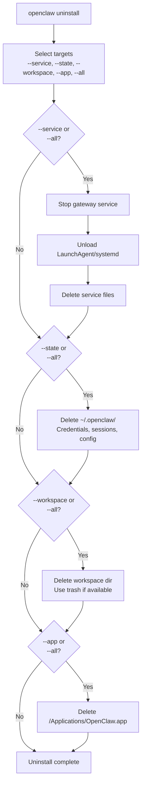

**Diagram**: Uninstall command target selection and execution order

### Options

| Flag | Description | Default |
|------|-------------|---------|
| `--service` | Remove gateway service | `false` |
| `--state` | Remove state directory | `false` |
| `--workspace` | Remove workspace | `false` |
| `--app` | Remove macOS app | `false` |
| `--all` | Remove everything | `false` |
| `--yes` | Skip confirmation | `false` |
| `--non-interactive` | Require explicit flags | `false` |
| `--dry-run` | Show what would be removed | `false` |

### Safety

- Uses `trash` for workspace/state when available
- Requires explicit target flags or `--all` in non-interactive mode
- Non-interactive mode requires both explicit targets and `--yes`
- Stops service before deletion to prevent file locks

**Sources**: [docs/cli/index.md:573-588]()

---

## Configuration Validation

All configuration commands validate the config against `OpenClawSchema` using Zod [src/config/config.ts:14]():

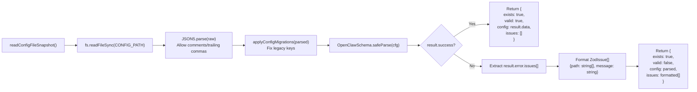

**Diagram**: `readConfigFileSnapshot()` validation flow with Zod schema checking

When validation fails, the snapshot includes `issues[]` array with detailed error paths:

```typescript
interface ConfigIssue {
  path: string[];      // e.g. ["agents", "defaults", "model", "primary"]
  message: string;     // e.g. "Expected string, received number"
}
```

Commands like `doctorCommand()` check `snapshot.valid` and exit with error message if false, prompting user to run `openclaw doctor` for auto-repair [src/commands/doctor.ts:96-116]().

The Gateway also auto-runs migrations on startup via `loadAndMaybeMigrateConfig()` to ensure stale configs are repaired without manual intervention.

**Sources**: [src/config/config.ts:14-38](), [src/commands/doctor.ts:93-116](), [src/config/migrations.ts]()

---

## Configuration Precedence

Configuration values are resolved with this precedence (highest to lowest):

1. **Command-line flags**: `--port`, `--bind`, etc.
2. **Environment variables**: `OPENCLAW_GATEWAY_PORT`, `OPENCLAW_GATEWAY_TOKEN`, etc.
3. **Config file**: `~/.openclaw/openclaw.json` (or `$OPENCLAW_CONFIG_PATH`)
4. **System defaults**: Hardcoded in [src/config/config.ts]()

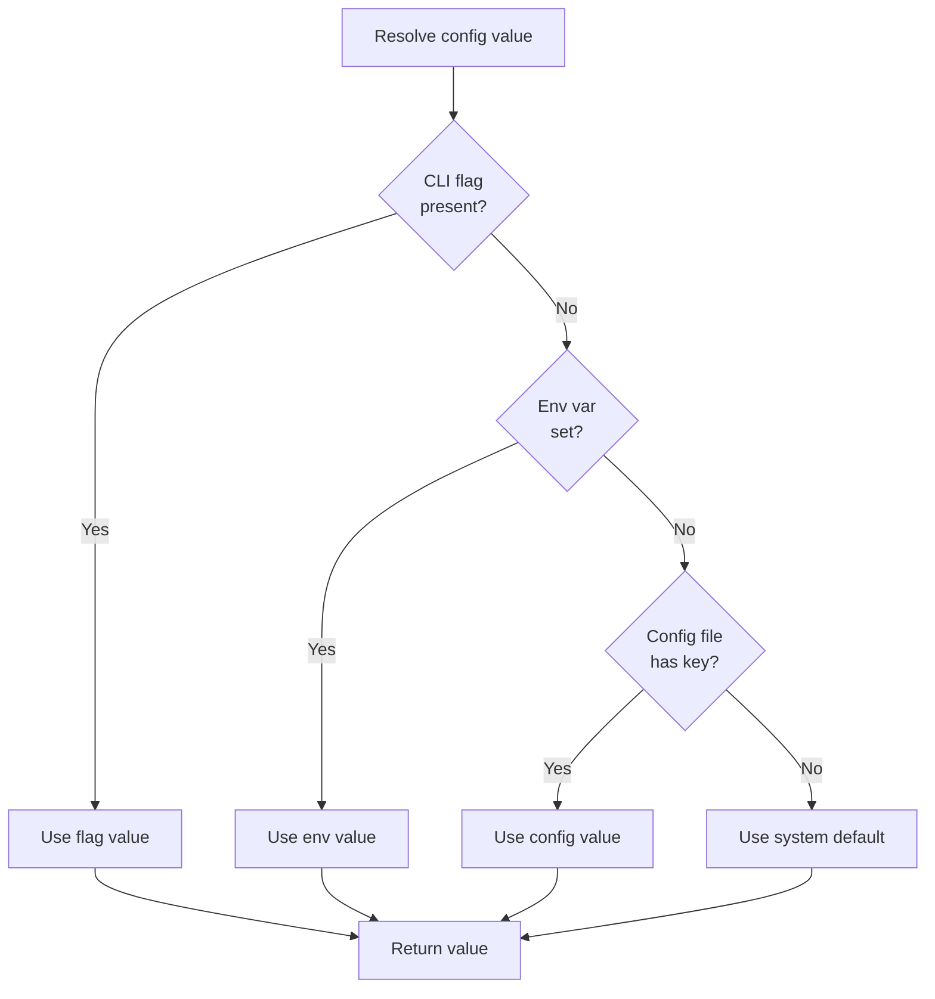

**Diagram**: Configuration value resolution precedence

**Sources**: [src/config/config.ts:14](), [docs/gateway/index.md:42]()

---

## Wizard Metadata

All wizard commands (`setup`, `onboard`, `configure`) write metadata to track when and how the configuration was created via `applyWizardMetadata()` [src/commands/onboard-helpers.ts:91-107]():

```typescript
function applyWizardMetadata(
  cfg: OpenClawConfig,
  params: { command: string; mode: OnboardMode }
): OpenClawConfig {
  const commit = process.env.GIT_COMMIT?.trim() || 
                 process.env.GIT_SHA?.trim() || 
                 undefined;
  return {
    ...cfg,
    wizard: {
      ...cfg.wizard,
      lastRunAt: new Date().toISOString(),
      lastRunVersion: VERSION,
      lastRunCommit: commit,
      lastRunCommand: params.command,
      lastRunMode: params.mode,
    },
  };
}
```

Example metadata written to config:

```json
{
  "wizard": {
    "lastRunAt": "2024-01-15T10:30:00.000Z",
    "lastRunVersion": "1.2.3",
    "lastRunCommit": "abc123def",
    "lastRunCommand": "onboard",
    "lastRunMode": "local"
  }
}
```

This metadata helps `doctorCommand()` understand the configuration origin and decide which migrations to apply. The `VERSION` constant is imported from [src/version.ts]().

**Sources**: [src/commands/onboard-helpers.ts:91-107](), [src/version.ts](), [docs/start/wizard.md:293-309]()

---

## Related Commands

For other configuration-adjacent operations:

- **Gateway service management**: [Gateway Commands](#12.1) - `gateway install`, `gateway start`, `gateway status`
- **Channel configuration**: [Channel Commands](#12.3) - `channels add`, `channels remove`
- **Model configuration**: [Model Commands](#12.4) - `models auth`, `models set`, `models fallbacks`
- **System health**: [Diagnostic Commands](#12.6) - `status`, `health`, `logs`

**Sources**: [docs/cli/index.md:1-919]()

---