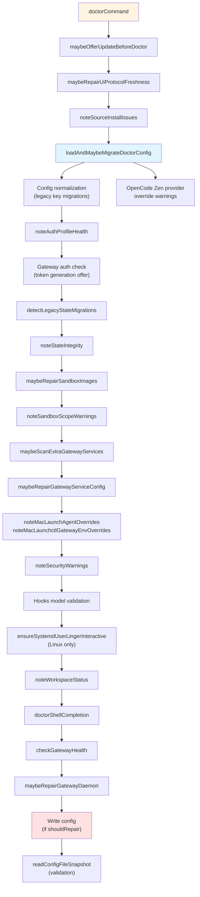
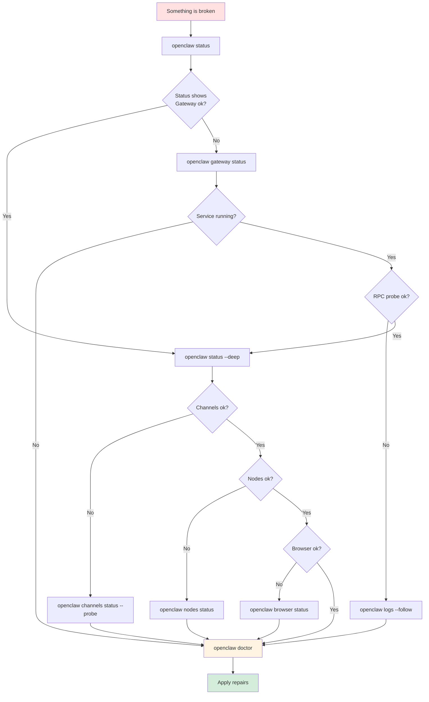

# Page: Diagnostic Commands

# Diagnostic Commands

<details>
<summary>Relevant source files</summary>

The following files were used as context for generating this wiki page:

- [docs/cli/index.md](docs/cli/index.md)
- [docs/docs.json](docs/docs.json)
- [docs/gateway/doctor.md](docs/gateway/doctor.md)
- [docs/gateway/index.md](docs/gateway/index.md)
- [docs/gateway/troubleshooting.md](docs/gateway/troubleshooting.md)
- [docs/index.md](docs/index.md)
- [docs/start/getting-started.md](docs/start/getting-started.md)
- [docs/start/hubs.md](docs/start/hubs.md)
- [docs/start/onboarding.md](docs/start/onboarding.md)
- [docs/start/wizard.md](docs/start/wizard.md)
- [src/agents/bash-tools.test.ts](src/agents/bash-tools.test.ts)
- [src/agents/pi-tools-agent-config.test.ts](src/agents/pi-tools-agent-config.test.ts)
- [src/agents/sandbox-skills.test.ts](src/agents/sandbox-skills.test.ts)
- [src/commands/configure.gateway.test.ts](src/commands/configure.gateway.test.ts)
- [src/commands/configure.gateway.ts](src/commands/configure.gateway.ts)
- [src/commands/configure.ts](src/commands/configure.ts)
- [src/commands/doctor.ts](src/commands/doctor.ts)
- [src/commands/onboard-helpers.test.ts](src/commands/onboard-helpers.test.ts)
- [src/commands/onboard-helpers.ts](src/commands/onboard-helpers.ts)
- [src/commands/onboard-interactive.ts](src/commands/onboard-interactive.ts)
- [src/config/merge-config.ts](src/config/merge-config.ts)
- [src/wizard/onboarding.gateway-config.test.ts](src/wizard/onboarding.gateway-config.test.ts)
- [src/wizard/onboarding.gateway-config.ts](src/wizard/onboarding.gateway-config.ts)
- [src/wizard/onboarding.ts](src/wizard/onboarding.ts)
- [src/wizard/onboarding.types.ts](src/wizard/onboarding.types.ts)

</details>


This page documents the CLI commands used to diagnose OpenClaw's operational state: `status`, `health`, `doctor`, `browser status/start`, and `nodes status/invoke`. These commands inspect Gateway connectivity, service health, configuration validity, channel readiness, and node/browser tool availability.

For general troubleshooting workflows, see [Troubleshooting](#14.3). For Gateway operations, see [Gateway Commands](#12.1). For configuration management, see [Configuration Commands](#12.5).

---

## Overview

OpenClaw provides five core diagnostic surfaces:

| Command | Purpose | Checks | Output |
|---------|---------|--------|--------|
| `status` | Comprehensive system state | Gateway RPC, channels, sessions, recent recipients, optional provider usage | Human-readable or JSON |
| `health` | Gateway liveness probe | RPC endpoint reachability and health snapshot | Human-readable or JSON |
| `doctor` | Automated repair + migration | Config validity, state integrity, service health, auth profiles, sandbox images | Interactive prompts or headless |
| `gateway status` | Service lifecycle + RPC probe | Runtime state, service supervisor, config paths, port/URL probe | Human-readable or JSON |
| `browser status` | Browser tool readiness | CDP connection, profile state, extension relay | Human-readable |
| `nodes status` | Node pairing + capabilities | Connected nodes, last-seen timestamps, capability list | Human-readable or JSON |

Sources: [docs/cli/index.md:28-42](), [docs/gateway/troubleshooting.md:14-25]()

---

## Diagnostic Flow

```mermaid
graph TB
    User["User"] -->|"openclaw status"| StatusCmd["statusCommand"]
    User -->|"openclaw health"| HealthCmd["healthCommand"]
    User -->|"openclaw doctor"| DoctorCmd["doctorCommand"]
    User -->|"openclaw gateway status"| GatewayStatusCmd["gateway status"]
    User -->|"openclaw browser status"| BrowserStatusCmd["browser status"]
    User -->|"openclaw nodes status"| NodesStatusCmd["nodes status"]
    
    StatusCmd --> BuildDetails["buildGatewayConnectionDetails"]
    StatusCmd --> ProbeGateway["probeGatewayReachable"]
    StatusCmd --> ChannelsProbe["channels.status RPC"]
    StatusCmd --> SessionsProbe["sessions.list RPC"]
    
    HealthCmd --> CallGateway["callGateway(health)"]
    
    DoctorCmd --> ConfigMigration["loadAndMaybeMigrateDoctorConfig"]
    DoctorCmd --> AuthHealth["noteAuthProfileHealth"]
    DoctorCmd --> GatewayHealthCheck["checkGatewayHealth"]
    DoctorCmd --> ServiceRepair["maybeRepairGatewayServiceConfig"]
    DoctorCmd --> SandboxRepair["maybeRepairSandboxImages"]
    
    GatewayStatusCmd --> ServiceStatus["resolveGatewayService().status()"]
    GatewayStatusCmd --> RPCProbe["callGateway(health)"]
    
    BrowserStatusCmd --> BrowserRPC["browser.status RPC"]
    NodesStatusCmd --> NodesRPC["nodes.status RPC"]
    
    ProbeGateway --> HealthRPC["callGateway(health)"]
    
    style StatusCmd fill:#fff4e1
    style DoctorCmd fill:#ffe1e1
    style CallGateway fill:#e1f5ff
```



**Diagnostic Command Dispatch Flow**

The five diagnostic commands fan out to distinct code paths: `status` aggregates multi-source state, `health` is a minimal RPC probe, `doctor` runs migrations + repairs, `gateway status` inspects service lifecycle + RPC, and `browser`/`nodes status` query tool-specific RPC endpoints.

Sources: [src/commands/doctor.ts:65-313](), [docs/cli/index.md:562-604]()

---

## `openclaw status`

Comprehensive system state report combining Gateway RPC, channel readiness, recent sessions, and optional provider usage/quota.

### Syntax

```bash
openclaw status [OPTIONS]
```

### Options

| Flag | Description |
|------|-------------|
| `--json` | Output JSON instead of human-readable format |
| `--all` | Full diagnosis snapshot (read-only, pasteable) |
| `--deep` | Probe channels via Gateway RPC |
| `--usage` | Show model provider usage/quota when OAuth/API credentials are available |
| `--timeout <ms>` | RPC timeout (default from config) |
| `--verbose` / `--debug` | Verbose output with extra diagnostics |

### What It Checks

1. **Gateway Connection**: Calls `buildGatewayConnectionDetails()` to resolve URL/token/password from config and environment, then probes `callGateway(health)`.
2. **Channels**: When `--deep` is passed, calls `channels.status` RPC method with probe mode.
3. **Sessions**: Calls `sessions.list` RPC to report recent activity.
4. **Provider Usage**: When `--usage` is passed and matching OAuth/API credentials exist, queries provider usage endpoints (Anthropic, OpenAI, Gemini, GitHub Copilot).

### Example Output

```bash
$ openclaw status --deep

Gateway: ws://127.0.0.1:18789 (RPC: ok)
Channels:
  whatsapp:default - connected (last activity: 2m ago)
  telegram:default - connected (last activity: 5m ago)
Sessions:
  agent:main:whatsapp:sender:+15555550123 (12 turns, last: 2m ago)
  agent:main:telegram:dm:123456789 (8 turns, last: 5m ago)
```

Sources: [docs/cli/index.md:562-593](), [src/commands/onboard-helpers.ts:360-382]()

---

## `openclaw health`

Minimal Gateway liveness probe that calls the `health` RPC method and returns the Gateway's health snapshot.

### Syntax

```bash
openclaw health [OPTIONS]
```

### Options

| Flag | Description |
|------|-------------|
| `--json` | Output JSON |
| `--timeout <ms>` | RPC timeout |
| `--verbose` | Include extra diagnostic context |

### What It Returns

The `health` RPC method returns a snapshot with:
- `uptimeMs`: Gateway uptime in milliseconds
- `stateVersion`: Incremental state version counter
- `channels`: Channel connection state map
- `presence`: Active presence entries (nodes, devices)
- `constraints`: Rate limits and policy boundaries

### Code Path

`healthCommand` → `callGateway({ method: "health" })` → Gateway `health` RPC handler

Sources: [docs/cli/index.md:595-604](), [src/commands/onboard-helpers.ts:360-382]()

---

## `openclaw doctor`

Automated health checks, config migrations, and repair prompts. Detects legacy config keys, missing state directories, stale auth profiles, sandbox image drift, and service misconfigurations.

### Syntax

```bash
openclaw doctor [OPTIONS]
```

### Options

| Flag | Description |
|------|-------------|
| `--yes` | Accept defaults without prompting (includes restart/service/sandbox repairs) |
| `--repair` | Apply recommended repairs without prompting (safe repairs + restarts) |
| `--repair --force` | Apply aggressive repairs (overwrites custom supervisor configs) |
| `--non-interactive` | Run without prompts; only apply safe migrations (config normalization, on-disk state moves). Skips restart/service/sandbox actions requiring human confirmation. |
| `--deep` | Scan system services for extra gateway installs (launchd/systemd/schtasks) |
| `--no-workspace-suggestions` | Disable workspace memory hints |

### What It Does



**Doctor Command Execution Pipeline**

Doctor runs a multi-phase pipeline: config migration → auth health → state integrity → sandbox/service repairs → workspace checks → gateway health → final config write.

### Migration Examples

**Legacy Config Keys**

Doctor auto-migrates deprecated config structures:

```json5
// Before
{
  "routing": {
    "allowFrom": ["+15555550123"],
    "groupChat": { "requireMention": true }
  }
}

// After
{
  "channels": {
    "whatsapp": {
      "allowFrom": ["+15555550123"],
      "groups": { "*": { "requireMention": true } }
    }
  }
}
```

**Legacy State Layout**

Doctor migrates on-disk paths:
- `~/.openclaw/sessions/` → `~/.openclaw/agents/<agentId>/sessions/`
- `~/.openclaw/agent/` → `~/.openclaw/agents/<agentId>/agent/`
- `~/.openclaw/credentials/*.json` → `~/.openclaw/credentials/whatsapp/<accountId>/`

Sources: [src/commands/doctor.ts:65-313](), [docs/gateway/doctor.md:59-84]()

---

## `openclaw gateway status`

Inspects Gateway service lifecycle (launchd/systemd/schtasks), runtime state, config paths, and RPC probe.

### Syntax

```bash
openclaw gateway status [OPTIONS]
```

### Options

| Flag | Description |
|------|-------------|
| `--no-probe` | Skip RPC health probe |
| `--deep` | Scan for extra/legacy gateway services on the system |
| `--json` | Output JSON |
| `--url <url>` | Override Gateway URL (requires `--token` or `--password`) |
| `--token <token>` | Gateway auth token (when using `--url`) |
| `--password <password>` | Gateway auth password (when using `--url`) |

### What It Reports

1. **Service Supervisor**: Detects launchd (macOS), systemd (Linux), or schtasks (Windows) and queries service status.
2. **Runtime State**: Reports `running` or `stopped` based on service supervisor + port listener.
3. **Config Paths**: Shows CLI config path vs service config path (may differ if service uses custom env vars).
4. **RPC Probe**: Calls `callGateway(health)` and reports `ok` or failure detail.
5. **Extra Services**: When `--deep` is passed, scans for legacy or duplicate gateway services.

### Example Output

```bash
$ openclaw gateway status

Gateway Service (launchd)
  Label: ai.openclaw.gateway
  Runtime: running
  PID: 12345
  
Config (cli): ~/.openclaw/openclaw.json
Config (service): ~/.openclaw/openclaw.json (resolved from env)

Probe Target: ws://127.0.0.1:18789
RPC probe: ok (uptime: 2h 15m)
```

Sources: [docs/cli/index.md:682-723](), [docs/gateway/index.md:89-99]()

---

## `openclaw browser status` / `openclaw browser start`

Browser tool diagnostics for CDP (Chrome DevTools Protocol) connection and profile state.

### Syntax

```bash
openclaw browser status [OPTIONS]
openclaw browser start [OPTIONS]
```

### Options

| Flag | Description |
|------|-------------|
| `--browser-profile <name>` | Target browser profile (default: `openclaw`) |
| `--url <url>` | Gateway URL override |
| `--token <token>` | Gateway auth token |
| `--json` | Output JSON |

### What `browser status` Checks

1. **CDP Connection**: Whether the configured browser is running and reachable via CDP.
2. **Profile State**: Profile name, executable path, CDP URL, attach-only mode.
3. **Extension Relay**: For `profile="chrome"`, checks if the extension relay tab is attached.

### Example Output

```bash
$ openclaw browser status

Browser Profile: openclaw
  Executable: /Applications/Brave Browser.app/Contents/MacOS/Brave Browser
  CDP URL: http://127.0.0.1:9222
  Status: running
  Tabs: 3
```

Sources: [docs/cli/index.md:969-1013](), [docs/gateway/troubleshooting.md:216-240]()

---

## `openclaw nodes status` / `openclaw nodes invoke`

Node pairing diagnostics and capability inspection for iOS/Android/macOS nodes.

### Syntax

```bash
openclaw nodes status [OPTIONS]
openclaw nodes invoke --node <id|name|ip> --command <cmd> [OPTIONS]
```

### Options (status)

| Flag | Description |
|------|-------------|
| `--connected` | Filter to only connected nodes |
| `--last-connected <duration>` | Filter by last-connected window (e.g., `5m`, `1h`) |
| `--json` | Output JSON |
| `--url <url>` | Gateway URL override |
| `--token <token>` | Gateway auth token |

### What `nodes status` Reports

1. **Pairing State**: Node ID, display name, IP address, platform.
2. **Connection State**: Online/offline, last-connected timestamp.
3. **Capabilities**: Available commands (`camera.snap`, `screen.record`, `system.run`, etc.).
4. **Permissions**: OS permission grants (camera, mic, location, screen recording).

### Example Output

```bash
$ openclaw nodes status

Paired Nodes:
  ios-main (iPhone 15 Pro, 100.64.0.50) - online (1m ago)
    Capabilities: camera.snap, camera.clip, screen.record, location.get
    Permissions: camera ✓, mic ✓, location ✓, screen ✗
```

Sources: [docs/cli/index.md:927-967](), [docs/gateway/troubleshooting.md:184-210]()

---

## Diagnostic Command Ladder

Common triage sequence when investigating issues:



**Diagnostic Triage Flow**

Start with `status` for a high-level view. If Gateway is unreachable, check `gateway status` and `logs`. If channels/nodes/browser are failing, drill into their specific status commands. End with `doctor` to apply automated repairs.

Sources: [docs/gateway/troubleshooting.md:14-25](), [docs/gateway/index.md:89-99]()

---

## Code Entity Map

| Natural Language | Code Entity | Location |
|------------------|-------------|----------|
| Status command | `statusCommand()` | CLI command handler |
| Health command | `healthCommand()` | CLI command handler |
| Doctor command | `doctorCommand()` | [src/commands/doctor.ts:65]() |
| Gateway probe | `probeGatewayReachable()` | [src/commands/onboard-helpers.ts:360]() |
| Gateway connection details | `buildGatewayConnectionDetails()` | [src/gateway/call.ts]() |
| RPC call | `callGateway()` | [src/gateway/call.ts]() |
| Config migration | `loadAndMaybeMigrateDoctorConfig()` | [src/commands/doctor-config-flow.ts]() |
| Auth profile health | `noteAuthProfileHealth()` | [src/commands/doctor-auth.ts]() |
| Gateway health check | `checkGatewayHealth()` | [src/commands/doctor-gateway-health.ts]() |
| Service repair | `maybeRepairGatewayServiceConfig()` | [src/commands/doctor-gateway-services.ts]() |
| Sandbox repair | `maybeRepairSandboxImages()` | [src/commands/doctor-sandbox.ts]() |
| Gateway service | `resolveGatewayService()` | [src/daemon/service.ts]() |

Sources: [src/commands/doctor.ts:1-313](), [src/commands/onboard-helpers.ts:360-416]()

---

## Related Pages

- [Gateway Commands](#12.1) - `gateway start/stop/restart`, service management
- [Channel Commands](#12.3) - `channels status/login`, pairing
- [Troubleshooting](#14.3) - Symptom-first runbooks with exact command sequences
- [Health Monitoring](#14.1) - Gateway health endpoints and operational metrics
- [Doctor Command Guide](#14.2) - Detailed doctor capabilities and migration reference

---