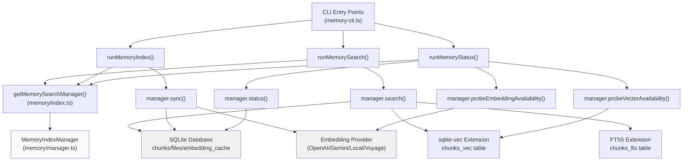
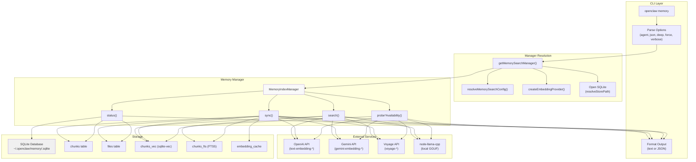

# Page: Memory Commands

# Memory Commands

<details>
<summary>Relevant source files</summary>

The following files were used as context for generating this wiki page:

- [CHANGELOG.md](CHANGELOG.md)
- [docs/cli/memory.md](docs/cli/memory.md)
- [docs/cli/sandbox.md](docs/cli/sandbox.md)
- [docs/concepts/memory.md](docs/concepts/memory.md)
- [docs/gateway/configuration.md](docs/gateway/configuration.md)
- [docs/gateway/sandbox-vs-tool-policy-vs-elevated.md](docs/gateway/sandbox-vs-tool-policy-vs-elevated.md)
- [docs/gateway/sandboxing.md](docs/gateway/sandboxing.md)
- [docs/platforms/mac/skills.md](docs/platforms/mac/skills.md)
- [docs/tools/elevated.md](docs/tools/elevated.md)
- [docs/tools/index.md](docs/tools/index.md)
- [docs/tools/skills-config.md](docs/tools/skills-config.md)
- [src/agents/memory-search.test.ts](src/agents/memory-search.test.ts)
- [src/agents/memory-search.ts](src/agents/memory-search.ts)
- [src/agents/sandbox-explain.test.ts](src/agents/sandbox-explain.test.ts)
- [src/agents/sandbox.ts](src/agents/sandbox.ts)
- [src/cli/memory-cli.test.ts](src/cli/memory-cli.test.ts)
- [src/cli/memory-cli.ts](src/cli/memory-cli.ts)
- [src/cli/models-cli.test.ts](src/cli/models-cli.test.ts)
- [src/config/schema.ts](src/config/schema.ts)
- [src/config/types.tools.ts](src/config/types.tools.ts)
- [src/config/types.ts](src/config/types.ts)
- [src/config/zod-schema.agent-runtime.ts](src/config/zod-schema.agent-runtime.ts)
- [src/config/zod-schema.ts](src/config/zod-schema.ts)
- [src/memory/embeddings.test.ts](src/memory/embeddings.test.ts)
- [src/memory/embeddings.ts](src/memory/embeddings.ts)
- [src/memory/manager.ts](src/memory/manager.ts)

</details>


## Purpose and Scope

This page documents the `openclaw memory` CLI commands for inspecting and managing the semantic memory index. These commands allow you to check index status, manually trigger reindexing, and perform searches from the command line.

For memory system architecture and configuration, see [Memory System](#7). For memory search configuration options, see [Memory Configuration](#7.1). For indexing pipeline details, see [Memory Indexing](#7.2).

---

## Overview

The memory CLI provides three primary commands:

| Command | Purpose |
|---------|---------|
| `openclaw memory status` | Display index metadata, provider info, and readiness checks |
| `openclaw memory index` | Manually trigger a full reindex of memory sources |
| `openclaw memory search <query>` | Search the memory index from the command line |

All memory commands are implemented in [src/cli/memory-cli.ts]() and delegate to `MemoryIndexManager` [src/memory/manager.ts:111-632]().

**Sources:** [src/cli/memory-cli.ts:1-591](), [docs/cli/memory.md:1-46]()

---

## Command Architecture



**Sources:** [src/cli/memory-cli.ts:243-591](), [src/memory/manager.ts:111-632]()

---

## `openclaw memory status`

Display memory index status, including file/chunk counts, provider configuration, vector/FTS availability, and optional deep probes.

### Syntax

```bash
openclaw memory status [options]
```

### Options

| Option | Description |
|--------|-------------|
| `--agent <id>` | Scope to a specific agent (default: all configured agents) |
| `--deep` | Probe vector extension and embedding provider availability |
| `--index` | Perform a full reindex if the index is dirty (implies `--deep`) |
| `--force` | Skip up-to-date checks when reindexing |
| `--json` | Output raw JSON instead of formatted text |
| `--verbose` | Enable verbose logging during probes and indexing |

### Behavior

When `--deep` is not specified, `status` performs a lightweight check:
- Reads index metadata from SQLite [src/memory/manager.ts:469-564]()
- Reports file/chunk counts per source
- Shows configured provider and model
- Indicates whether the index is dirty

When `--deep` is specified, additional probes run:
- **Vector probe**: attempts to load the sqlite-vec extension and verify vector table availability [src/memory/manager.ts:791-846]()
- **Embedding probe**: tests a sample embedding request to the configured provider [src/memory/manager.ts:848-922]()

When `--index` is specified along with `--deep`, the command automatically triggers a full reindex if the index is marked dirty or if `--force` is provided.

### Multi-Agent Support

If `--agent` is omitted, the command iterates over all configured agents in `agents.list` (or defaults to `"main"` if no agents are configured). Each agent's memory index is checked independently.

**Sources:** [src/cli/memory-cli.ts:243-361](), [src/memory/manager.ts:469-564]()

---

## Status Output Format

### Text Output (Default)

```
Memory Index: main

  Indexed: 3/4 files · 45 chunks
  Workspace: ~/.openclaw/workspace
  Store: ~/.openclaw/memory/main.sqlite
  Provider: openai (text-embedding-3-small)
  Backend: builtin

  Sources:
    memory: 3 files · 42 chunks
    sessions: 1 file · 3 chunks

  Additional paths:
    ~/notes

  Vector: ready
    Vector dims: 1536
    Vector path: /opt/homebrew/lib/sqlite-vec.dylib

  FTS: ready

  Embedding cache: enabled (125 entries, max 50000)

  Embeddings: ready

  Batch: disabled
```

### Key Fields

| Field | Source | Description |
|-------|--------|-------------|
| `Indexed` | `manager.status()` | Files and chunks currently in the index |
| `Workspace` | `status.workspaceDir` | Agent workspace root |
| `Store` | `status.dbPath` | SQLite database path |
| `Provider` | `status.provider`, `status.model` | Active embedding provider and model |
| `Backend` | `status.backend` | `"builtin"` or `"qmd"` |
| `Sources` | `status.sourceCounts` | Per-source file/chunk breakdown |
| `Additional paths` | `status.extraPaths` | Extra paths from `memorySearch.extraPaths` |
| `Vector` | `status.vector` | sqlite-vec extension status and dimensions |
| `FTS` | `status.fts` | Full-text search availability |
| `Embedding cache` | `status.cache` | Cache enablement and entry count |
| `Embeddings` | `probeEmbeddingAvailability()` | Embedding provider connectivity (deep only) |
| `Batch` | `status.batch` | Batch API status and failure count |

**Sources:** [src/cli/memory-cli.ts:339-591](), [src/memory/manager.ts:469-564]()

---

## `openclaw memory index`

Manually trigger a full reindex of the memory sources.

### Syntax

```bash
openclaw memory index [options]
```

### Options

| Option | Description |
|--------|-------------|
| `--agent <id>` | Scope to a specific agent (default: all configured agents) |
| `--force` | Force reindex even if the index is up-to-date |
| `--verbose` | Emit detailed logs during indexing (file discovery, embedding batches, chunk counts) |
| `--json` | Output raw JSON status after indexing |

### Behavior

The `index` command invokes `manager.sync({ reason: "cli", force: <bool>, progress: <fn> })` [src/memory/manager.ts:390-403](), which:

1. **Discovers files**: Lists all Markdown files from memory sources (workspace `MEMORY.md`, `memory/*.md`, extra paths, and optionally session transcripts) [src/memory/internal.ts:191-248]()
2. **Checks cache**: Compares file modification times and hashes against the index [src/memory/manager.ts:954-1036]()
3. **Chunks files**: Splits modified files into ~400 token chunks with 80-token overlap [src/memory/internal.ts:122-188]()
4. **Generates embeddings**: 
   - If cache is enabled, checks `embedding_cache` table by content hash [src/memory/manager.ts:1210-1263]()
   - Otherwise, batches chunks and calls the embedding provider [src/memory/manager.ts:1144-1209]()
5. **Stores embeddings**: Writes to `chunks` table (and `chunks_vec` if sqlite-vec is available) [src/memory/manager.ts:1265-1330]()
6. **Builds FTS index**: Populates `chunks_fts` for keyword search [src/memory/manager.ts:1332-1358]()

Progress updates are streamed to the console via `withProgressTotals()` [src/cli/progress.ts:96-204]().

**Sources:** [src/cli/memory-cli.ts:593-674](), [src/memory/manager.ts:390-403](), [src/memory/manager.ts:924-1358]()

---

## Index Progress Output

When `--verbose` is enabled, the indexing process emits detailed logs:

```
Indexing memory…

  Provider: openai (text-embedding-3-small)
  Model: text-embedding-3-small
  Sources: memory, sessions
  Batch API: disabled

  Phase: Discovering files…
  Phase: Checking cache…
  Phase: Chunking files…
  Phase: Generating embeddings (45 chunks)…
    Embedding batch 1/2 (25 chunks)
    Embedding batch 2/2 (20 chunks)
  Phase: Storing embeddings…
  Phase: Building FTS index…

Memory index complete.
```

Without `--verbose`, a simple progress bar displays:

```
Indexing memory… ████████████████████████████ 100% (45/45)
Memory index complete.
```

**Sources:** [src/cli/memory-cli.ts:593-674](), [src/cli/progress.ts:96-204]()

---

## `openclaw memory search`

Perform a semantic search against the memory index.

### Syntax

```bash
openclaw memory search <query> [options]
```

### Options

| Option | Description |
|--------|-------------|
| `--agent <id>` | Scope to a specific agent (default: main) |
| `--max-results <n>` | Maximum results to return (default: from config or 6) |
| `--min-score <n>` | Minimum relevance score (0.0-1.0, default: from config or 0.35) |
| `--json` | Output raw JSON result array |
| `--verbose` | Enable verbose logging |

### Behavior

The `search` command:
1. Resolves the target agent [src/cli/memory-cli.ts:676-691]()
2. Obtains the memory manager via `getMemorySearchManager()` [src/memory/index.ts:38-48]()
3. Calls `manager.search(query, { maxResults, minScore })` [src/memory/manager.ts:266-314]()
4. Formats and displays results [src/cli/memory-cli.ts:719-794]()

Internally, `manager.search()` performs:
- **Query embedding**: Embeds the query text using the configured provider [src/memory/manager.ts:1421-1453]()
- **Vector search**: Retrieves top candidates by cosine similarity (via sqlite-vec or in-memory) [src/memory/manager-search.ts:15-110]()
- **Keyword search**: (If hybrid mode enabled) Retrieves top candidates by BM25 rank from `chunks_fts` [src/memory/manager-search.ts:112-180]()
- **Hybrid merge**: Combines and reranks vector + keyword results [src/memory/hybrid.ts:18-82]()
- **Filtering**: Applies `minScore` threshold and returns top `maxResults` [src/memory/manager.ts:305-313]()

**Sources:** [src/cli/memory-cli.ts:676-794](), [src/memory/manager.ts:266-314](), [src/memory/manager-search.ts:15-180]()

---

## Search Result Format

### Text Output (Default)

```
Memory search: "kubernetes deployment config"

  1. memory/2026-02-10.md:45-52 (score: 0.87)
     "Kubernetes deployment updated to use rolling updates
     with maxSurge=1 and maxUnavailable=0 for zero-downtime
     deployments. Configuration stored in k8s/deployment.yaml."

  2. MEMORY.md:123-128 (score: 0.72)
     "Project uses Kubernetes for container orchestration.
     Cluster managed via kubectl and Helm charts."

  3. memory/2026-01-15.md:89-94 (score: 0.68)
     "Deployment strategy: blue-green for production,
     rolling updates for staging."

3 results in 142ms
```

### JSON Output

```json
[
  {
    "path": "memory/2026-02-10.md",
    "startLine": 45,
    "endLine": 52,
    "score": 0.87,
    "source": "memory",
    "snippet": "Kubernetes deployment updated to use rolling updates..."
  },
  {
    "path": "MEMORY.md",
    "startLine": 123,
    "endLine": 128,
    "score": 0.72,
    "source": "memory",
    "snippet": "Project uses Kubernetes for container orchestration..."
  }
]
```

**Sources:** [src/cli/memory-cli.ts:719-794](), [src/memory/types.ts:42-49]()

---

## Memory CLI Data Flow



**Sources:** [src/cli/memory-cli.ts:243-794](), [src/memory/index.ts:38-48](), [src/memory/manager.ts:169-248]()

---

## Common Options and Patterns

### Multi-Agent Workflows

When managing memory across multiple agents, omit the `--agent` flag to iterate over all configured agents:

```bash
# Status for all agents
openclaw memory status

# Reindex all agents
openclaw memory index --force

# Deep probe all agents
openclaw memory status --deep
```

To scope to a specific agent:

```bash
openclaw memory status --agent work
openclaw memory index --agent work
openclaw memory search "kubernetes" --agent work
```

**Sources:** [src/cli/memory-cli.ts:245-247](), [src/cli/memory-cli.ts:68-78]()

---

### Verbose Mode

Enable `--verbose` to see detailed internal operations:

```bash
# See embedding provider, model, and batch activity
openclaw memory index --verbose

# See probe attempts and fallback behavior
openclaw memory status --deep --verbose
```

Verbose output includes:
- File discovery paths and counts
- Cache hit/miss statistics
- Embedding batch composition and timing
- Provider selection and fallback reasons
- Vector/FTS probe results

**Sources:** [src/cli/memory-cli.ts:244](), [src/cli/memory-cli.ts:285-309]()

---

### Force Reindex

The `--force` flag bypasses the dirty check and always reindexes:

```bash
# Force reindex even if files haven't changed
openclaw memory index --force

# Force reindex as part of deep status check
openclaw memory status --deep --index --force
```

Without `--force`, the sync operation compares file modification times and content hashes against the index metadata, skipping files that haven't changed since the last index.

**Sources:** [src/cli/memory-cli.ts:282](), [src/memory/manager.ts:390-403]()

---

### JSON Output

The `--json` flag outputs raw JSON for programmatic consumption:

```bash
# Machine-readable status
openclaw memory status --json > status.json

# Machine-readable search results
openclaw memory search "query" --json | jq '.[] | .path'
```

JSON output includes all fields from `manager.status()` or `manager.search()`, unformatted.

**Sources:** [src/cli/memory-cli.ts:334-336](), [src/cli/memory-cli.ts:784-786]()

---

## Error Handling and Manager Lifecycle

All memory CLI commands follow this lifecycle pattern [src/cli/memory-cli.ts:256-332]():

1. **Resolution**: Call `getMemorySearchManager({ cfg, agentId })` [src/memory/index.ts:38-48]()
2. **Null check**: If the manager is `null` (memory search disabled), log an error and exit [src/cli/cli-utils.ts:217-250]()
3. **Operation**: Execute the command-specific logic (`status()`, `sync()`, `search()`)
4. **Cleanup**: Call `await manager.close()` to release resources (SQLite connection, watchers, timers) [src/memory/manager.ts:710-789]()
5. **Error logging**: If cleanup fails, log the error but do not fail the command [src/cli/cli-utils.ts:241-247]()

The `withManager()` helper [src/cli/cli-utils.ts:217-250]() encapsulates this pattern:

```typescript
await withManager<MemoryManager>({
  getManager: () => getMemorySearchManager({ cfg, agentId }),
  onMissing: (error) => defaultRuntime.log(error ?? "Memory search disabled."),
  onCloseError: (err) => 
    defaultRuntime.error(`Memory manager close failed: ${formatErrorMessage(err)}`),
  close: async (manager) => {
    await manager.close?.();
  },
  run: async (manager) => {
    // Command-specific logic
  },
});
```

**Sources:** [src/cli/memory-cli.ts:256-332](), [src/cli/cli-utils.ts:217-250](), [src/memory/manager.ts:710-789]()

---

## Configuration Integration

Memory CLI commands respect the agent's memory search configuration [src/agents/memory-search.ts:120-198]():

- `agents.defaults.memorySearch.enabled` - controls availability
- `agents.defaults.memorySearch.provider` - embedding provider (`openai`, `gemini`, `voyage`, `local`, `auto`)
- `agents.defaults.memorySearch.model` - embedding model ID
- `agents.defaults.memorySearch.store.path` - SQLite database path (supports `{agentId}` token)
- `agents.defaults.memorySearch.store.vector.enabled` - sqlite-vec usage
- `agents.defaults.memorySearch.query.maxResults` - default max results
- `agents.defaults.memorySearch.query.minScore` - default min score
- `agents.defaults.memorySearch.query.hybrid.enabled` - hybrid (vector + BM25) search

Per-agent overrides are supported via `agents.list[].memorySearch.*`.

For full configuration reference, see [Memory Configuration](#7.1).

**Sources:** [src/agents/memory-search.ts:120-198](), [src/config/types.tools.ts:224-332]()

---

## Common Workflows

### Initial Setup Verification

After configuring memory search, verify the setup:

```bash
# Check provider and model resolution
openclaw memory status

# Probe embedding connectivity
openclaw memory status --deep

# Force initial index
openclaw memory index --force --verbose
```

### Debugging Index Staleness

If search results seem stale:

```bash
# Check if index is dirty
openclaw memory status

# Force reindex
openclaw memory index --force
```

### Testing Embedding Provider Changes

After switching embedding providers or models:

```bash
# Check new provider
openclaw memory status --deep

# Reindex with new embeddings
openclaw memory index --force
```

The index automatically resets when the provider, model, or endpoint changes [src/memory/manager.ts:954-995]().

### Inspecting Cache Efficiency

To see cache hit rates:

```bash
# Show cache entry count
openclaw memory status

# Reindex with verbose to see cache hits/misses
openclaw memory index --verbose
```

Cache entries are keyed by `{provider}/{model}/{contentHash}` [src/memory/manager.ts:1210-1263]().

**Sources:** [src/cli/memory-cli.ts:243-794](), [src/memory/manager.ts:954-995](), [src/memory/manager.ts:1210-1263]()

---

## Related CLI Commands

- **`openclaw status`** - includes a summary of memory index status for the default agent
- **`openclaw doctor`** - checks memory configuration and suggests fixes
- **`openclaw agent --message "..."` with memory tools** - agents use `memory_search` and `memory_get` tools at runtime

**Sources:** [src/cli/memory-cli.ts:1-794]()

---