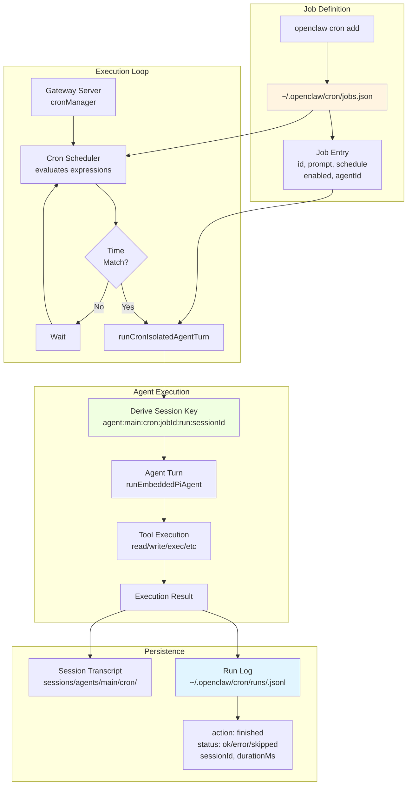
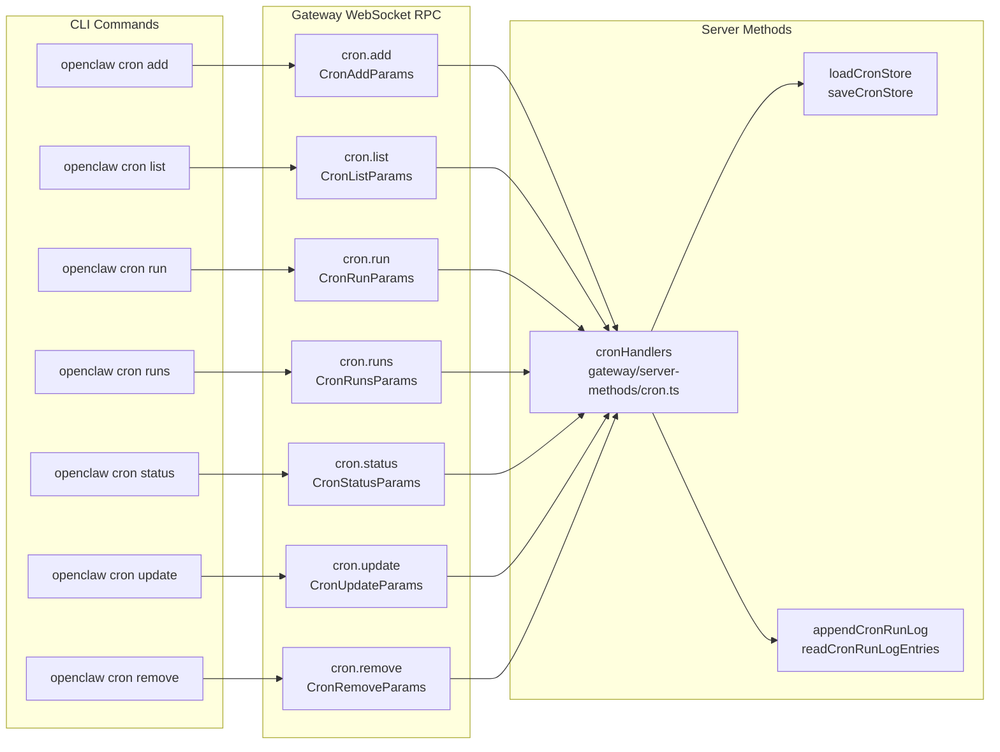
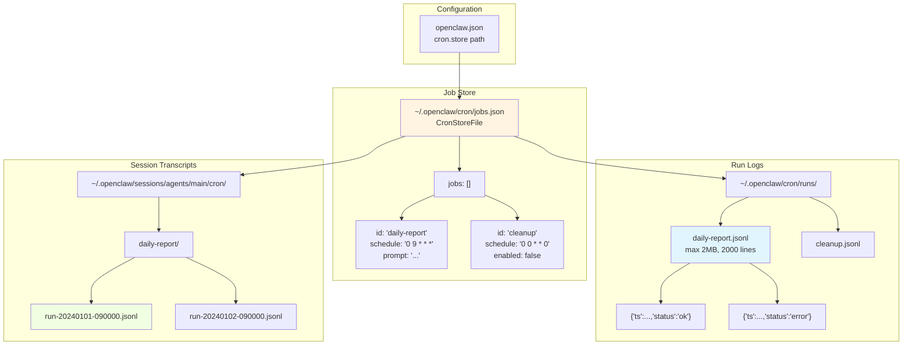

# Page: Automation Commands

# Automation Commands

<details>
<summary>Relevant source files</summary>

The following files were used as context for generating this wiki page:

- [README.md](README.md)
- [assets/avatar-placeholder.svg](assets/avatar-placeholder.svg)
- [docs/channels/zalo.md](docs/channels/zalo.md)
- [docs/channels/zalouser.md](docs/channels/zalouser.md)
- [scripts/clawtributors-map.json](scripts/clawtributors-map.json)
- [scripts/update-clawtributors.ts](scripts/update-clawtributors.ts)
- [scripts/update-clawtributors.types.ts](scripts/update-clawtributors.types.ts)
- [src/commands/agent.test.ts](src/commands/agent.test.ts)
- [src/commands/agent.ts](src/commands/agent.ts)
- [src/config/config.ts](src/config/config.ts)
- [src/cron/isolated-agent.ts](src/cron/isolated-agent.ts)
- [src/cron/run-log.test.ts](src/cron/run-log.test.ts)
- [src/cron/run-log.ts](src/cron/run-log.ts)
- [src/cron/store.ts](src/cron/store.ts)
- [src/gateway/protocol/index.ts](src/gateway/protocol/index.ts)
- [src/gateway/protocol/schema.ts](src/gateway/protocol/schema.ts)
- [src/gateway/protocol/schema/agents-models-skills.ts](src/gateway/protocol/schema/agents-models-skills.ts)
- [src/gateway/protocol/schema/protocol-schemas.ts](src/gateway/protocol/schema/protocol-schemas.ts)
- [src/gateway/protocol/schema/types.ts](src/gateway/protocol/schema/types.ts)
- [src/gateway/server-methods-list.ts](src/gateway/server-methods-list.ts)
- [src/gateway/server-methods.ts](src/gateway/server-methods.ts)
- [src/gateway/server-methods/agents.ts](src/gateway/server-methods/agents.ts)
- [src/gateway/server.ts](src/gateway/server.ts)
- [src/index.test.ts](src/index.test.ts)
- [src/index.ts](src/index.ts)
- [tsconfig.json](tsconfig.json)
- [ui/src/styles.css](ui/src/styles.css)
- [ui/src/styles/layout.mobile.css](ui/src/styles/layout.mobile.css)

</details>


This page documents CLI commands for managing scheduled tasks, webhooks, and system event automation in OpenClaw. For general CLI usage and other command categories, see [CLI Reference](#12).

**Scope:**
- Cron job management (schedule, execute, monitor)
- Webhook configuration and delivery
- System event hooks (Gmail Pub/Sub, custom triggers)

**Related pages:**
- For runtime agent execution, see [Agent Commands](#12.2)
- For gateway service management, see [Gateway Commands](#12.1)

---

## Overview

OpenClaw provides three automation mechanisms:

| Mechanism | Purpose | Storage | Trigger |
|-----------|---------|---------|---------|
| **Cron Jobs** | Scheduled agent tasks | `~/.openclaw/cron/jobs.json` | Time-based (cron expressions) |
| **Webhooks** | External HTTP triggers | Gateway config | HTTP POST to gateway endpoint |
| **System Events** | Platform integrations | Channel-specific config | Gmail Pub/Sub, channel events |

All automation uses the same agent execution pipeline as interactive commands, with isolated sessions and full tool access (subject to sandbox policies).

**Sources:** [src/gateway/server-methods-list.ts:73-79](), [README.md:163]()

---

## Cron Job Architecture



**Diagram: Cron Job Lifecycle**

Cron jobs are stored in a JSON file and evaluated by the gateway's cron manager. When a schedule matches, the job spawns an isolated agent session with a deterministic session key. All execution history is logged to JSONL files per job, and full transcripts are stored in the agent's sessions directory.

**Sources:** [src/cron/store.ts:1-62](), [src/cron/run-log.ts:1-122](), [src/cron/isolated-agent.ts:1-2]()

---

## Cron Job Management

### Add a Cron Job

```bash
openclaw cron add \
  --id "daily-report" \
  --schedule "0 9 * * *" \
  --prompt "Generate daily status report" \
  --agent main \
  --enabled
```

**Options:**
- `--id <string>`: Unique job identifier (required)
- `--schedule <cron>`: Cron expression (5-field format: `min hour day month weekday`)
- `--prompt <string>`: Agent prompt to execute (required)
- `--agent <agentId>`: Target agent (default: `main`)
- `--enabled`: Enable immediately (default: true)
- `--timeout <seconds>`: Execution timeout (default: from config)
- `--session-key <key>`: Explicit session key (advanced)

**Session key derivation:** If not specified, jobs use `agent:<agentId>:cron:<jobId>:run:<sessionId>`. Each run generates a new `sessionId` but maintains the job's history under the same `jobId` namespace.

**Storage location:** Jobs are persisted to `~/.openclaw/cron/jobs.json` (configurable via `cron.store` in config).

**Sources:** [src/gateway/protocol/schema/cron.ts:1-80](), [src/cron/store.ts:22-48]()

---

### List Cron Jobs

```bash
openclaw cron list
```

**Output:** JSON array of job definitions:

```json
{
  "jobs": [
    {
      "id": "daily-report",
      "schedule": "0 9 * * *",
      "prompt": "Generate daily status report",
      "agentId": "main",
      "enabled": true,
      "createdAt": 1704067200000,
      "updatedAt": 1704067200000
    }
  ]
}
```

**Fields:**
- `id`: Job identifier
- `schedule`: Cron expression
- `prompt`: Agent prompt
- `agentId`: Target agent
- `enabled`: Whether job is active
- `createdAt`, `updatedAt`: Timestamps (milliseconds since epoch)
- `nextRunAtMs`: Next scheduled execution (if calculated)

**Sources:** [src/gateway/protocol/schema/cron.ts:1-80](), [src/gateway/server-methods-list.ts:73]()

---

### Run a Cron Job

```bash
openclaw cron run --id "daily-report"
```

**Options:**
- `--id <string>`: Job identifier (required)
- `--wait`: Block until execution completes

**Behavior:**
1. Loads job definition from store
2. Generates new session ID for this run
3. Invokes agent with job's prompt
4. Logs result to `~/.openclaw/cron/runs/<jobId>.jsonl`
5. Stores full transcript in agent sessions directory

**Session isolation:** Each run creates a fresh agent context. To maintain state across runs, use the `read`/`write` tools to persist data in the workspace.

**Sources:** [src/cron/isolated-agent.ts:1-2](), [src/gateway/server-methods-list.ts:78]()

---

### View Run History

```bash
openclaw cron runs --id "daily-report" --limit 10
```

**Options:**
- `--id <string>`: Job identifier (required)
- `--limit <number>`: Maximum entries to return (default: 200, max: 5000)

**Output:** Array of run log entries:

```json
[
  {
    "ts": 1704067200000,
    "jobId": "daily-report",
    "action": "finished",
    "status": "ok",
    "sessionId": "cron-daily-report-20240101-090000",
    "sessionKey": "agent:main:cron:daily-report:run:cron-daily-report-20240101-090000",
    "runAtMs": 1704067200000,
    "durationMs": 3420,
    "nextRunAtMs": 1704153600000
  }
]
```

**Log entry fields:**
- `ts`: Log timestamp
- `jobId`: Job identifier
- `action`: Always `"finished"`
- `status`: `"ok"` | `"error"` | `"skipped"`
- `error`: Error message (if `status === "error"`)
- `summary`: Agent-generated summary (if available)
- `sessionId`, `sessionKey`: Session identifiers
- `runAtMs`: Scheduled execution time
- `durationMs`: Execution duration
- `nextRunAtMs`: Next scheduled run

**Log storage:** Stored in `~/.openclaw/cron/runs/<jobId>.jsonl` with automatic pruning (max 2MB, 2000 lines by default).

**Sources:** [src/cron/run-log.ts:64-122](), [src/gateway/protocol/schema/cron.ts:1-80]()

---

### Check Cron Status

```bash
openclaw cron status
```

**Output:** System-wide cron status:

```json
{
  "enabled": true,
  "jobCount": 5,
  "activeJobs": 3,
  "nextRunAtMs": 1704067200000,
  "lastEvaluatedAtMs": 1704067100000
}
```

**Fields:**
- `enabled`: Whether cron scheduler is running
- `jobCount`: Total jobs in store
- `activeJobs`: Jobs with `enabled: true`
- `nextRunAtMs`: Next scheduled execution across all jobs
- `lastEvaluatedAtMs`: Last time scheduler checked for triggers

**Sources:** [src/gateway/server-methods-list.ts:74](), [src/gateway/protocol/schema/cron.ts:1-80]()

---

### Update a Cron Job

```bash
openclaw cron update \
  --id "daily-report" \
  --schedule "0 10 * * *" \
  --enabled false
```

**Options:**
- `--id <string>`: Job identifier (required)
- `--schedule <cron>`: New cron expression
- `--prompt <string>`: New prompt
- `--agent <agentId>`: Change target agent
- `--enabled <boolean>`: Enable/disable job

**Note:** Only specified fields are updated; others remain unchanged.

**Sources:** [src/gateway/protocol/schema/cron.ts:1-80](), [src/gateway/server-methods-list.ts:76]()

---

### Remove a Cron Job

```bash
openclaw cron remove --id "daily-report"
```

**Options:**
- `--id <string>`: Job identifier (required)
- `--delete-logs`: Also delete run history (default: false)

**Behavior:**
1. Removes job definition from store
2. Optionally deletes `~/.openclaw/cron/runs/<jobId>.jsonl`
3. Preserves session transcripts (managed separately)

**Sources:** [src/gateway/protocol/schema/cron.ts:1-80](), [src/gateway/server-methods-list.ts:77]()

---

## Gateway Protocol Methods



**Diagram: CLI to Gateway Protocol Mapping**

All cron CLI commands communicate with the gateway via WebSocket RPC. The gateway validates parameters using TypeBox schemas and delegates to handler functions.

**Authorization:** Cron management requires `operator.admin` scope. Read operations (`list`, `status`, `runs`) accept `operator.read` scope.

**Sources:** [src/gateway/server-methods.ts:1-220](), [src/gateway/server-methods-list.ts:73-79](), [src/gateway/protocol/schema/cron.ts:1-80]()

---

## Cron Storage Architecture



**Diagram: Cron Storage Hierarchy**

Cron jobs maintain three persistent data stores:
1. **Job definitions** in `jobs.json` (single file, atomic updates)
2. **Run logs** in `runs/<jobId>.jsonl` (per-job, auto-pruned)
3. **Session transcripts** in agent sessions directory (full agent history)

**Backup considerations:** `jobs.json` is automatically backed up to `jobs.json.bak` on each write. Run logs are expendable (can be regenerated from transcripts if needed). Session transcripts follow the same backup policy as interactive sessions.

**Sources:** [src/cron/store.ts:1-62](), [src/cron/run-log.ts:1-122]()

---

## Webhooks

Webhooks allow external systems to trigger agent actions via HTTP POST requests.

**Configuration:**

```json5
{
  gateway: {
    webhooks: {
      enabled: true,
      secret: "your-webhook-secret",
      allowedOrigins: ["https://trusted.example.com"]
    }
  }
}
```

**Endpoint:** `POST https://gateway:18789/webhook/<hookId>`

**Authentication:** `Authorization: Bearer <secret>` header required.

**Payload:**

```json
{
  "prompt": "Process incoming data",
  "data": { "key": "value" },
  "agentId": "main",
  "sessionKey": "agent:main:webhook:hookId"
}
```

**Delivery:** Webhook requests spawn agent sessions with the specified prompt. The `data` field is available to tools via context.

**Sources:** [README.md:422]()

---

## System Event Hooks

### Gmail Pub/Sub Integration

OpenClaw can react to Gmail events via Google Cloud Pub/Sub.

**Setup:**
1. Configure Google Cloud Pub/Sub topic and subscription
2. Set credentials in config or environment
3. Enable the integration:

```json5
{
  integrations: {
    gmail: {
      enabled: true,
      pubsubProject: "your-project-id",
      pubsubSubscription: "gmail-notifications",
      onMessage: {
        prompt: "Process new email",
        agentId: "main"
      }
    }
  }
}
```

**Event flow:**
1. Gmail sends notification to Pub/Sub topic
2. Gateway subscription receives event
3. Agent session spawned with email metadata
4. Agent can use Gmail tools to read/reply

**Sources:** [README.md:423](), [README.md:476]()

---

## Channel-Specific Event Hooks

Some channels expose event hooks for automation:

### Telegram Webhooks

```json5
{
  channels: {
    telegram: {
      webhookUrl: "https://gateway:18789/telegram/webhook",
      webhookSecret: "telegram-secret"
    }
  }
}
```

Telegram events (messages, callbacks, inline queries) trigger agent sessions immediately without polling.

**Sources:** [README.md:345]()

### Zalo Webhooks

```json5
{
  channels: {
    zalo: {
      webhookUrl: "https://gateway:18789/zalo/webhook",
      webhookSecret: "zalo-secret"
    }
  }
}
```

Webhook mode is mutually exclusive with long-polling (getUpdates).

**Sources:** [docs/channels/zalo.md:111-119]()

---

## Configuration Reference

```json5
{
  cron: {
    enabled: true,
    store: "~/.openclaw/cron/jobs.json",
    maxRunLogBytes: 2000000,
    maxRunLogLines: 2000,
    evaluationIntervalMs: 60000
  },
  gateway: {
    webhooks: {
      enabled: false,
      secret: "webhook-secret",
      allowedOrigins: [],
      maxPayloadSize: 1048576
    }
  },
  integrations: {
    gmail: {
      enabled: false,
      pubsubProject: "",
      pubsubSubscription: "",
      onMessage: {
        prompt: "",
        agentId: "main",
        sessionKey: ""
      }
    }
  }
}
```

**Cron options:**
- `enabled`: Start cron scheduler with gateway (default: true)
- `store`: Path to jobs.json (default: `~/.openclaw/cron/jobs.json`)
- `maxRunLogBytes`: Per-job log size limit (default: 2MB)
- `maxRunLogLines`: Per-job log line limit (default: 2000)
- `evaluationIntervalMs`: Scheduler check interval (default: 60000ms)

**Webhook options:**
- `enabled`: Accept webhook requests (default: false)
- `secret`: Shared secret for authentication
- `allowedOrigins`: CORS origins for webhook requests
- `maxPayloadSize`: Maximum request body size (default: 1MB)

**Sources:** [src/cron/store.ts:8-20](), [src/cron/run-log.ts:54-59]()

---

## Security Considerations

### Cron Job Isolation

Cron jobs execute with the same security model as interactive sessions:

- **Sandbox mode:** Jobs respect `agents.defaults.sandbox.mode` settings
- **Tool policies:** Jobs inherit tool restrictions from agent configuration
- **Session keys:** Jobs use deterministic keys (`agent:*:cron:*`) for audit trails

**Recommendation:** For untrusted cron prompts, enable sandboxing:

```json5
{
  agents: {
    defaults: {
      sandbox: {
        mode: "non-main",
        allowedTools: ["read", "write", "memory_search"]
      }
    }
  }
}
```

### Webhook Authentication

Webhooks require `Authorization: Bearer <secret>` header. The secret is validated before processing requests.

**Best practices:**
- Use a strong, randomly generated secret (>32 characters)
- Rotate secrets periodically
- Restrict `allowedOrigins` to known sources
- Monitor webhook access logs

**Sources:** [README.md:331-333]()

---

## Troubleshooting

### Cron job not executing

1. **Check if scheduler is running:**
   ```bash
   openclaw cron status
   ```
   Verify `enabled: true` and recent `lastEvaluatedAtMs`.

2. **Validate cron expression:**
   Ensure 5-field format: `minute hour day month weekday`
   - Valid: `0 9 * * *` (9 AM daily)
   - Invalid: `0 9 * * * *` (6-field format not supported)

3. **Check job is enabled:**
   ```bash
   openclaw cron list
   ```
   Verify `enabled: true` in job definition.

4. **Review run logs:**
   ```bash
   openclaw cron runs --id <jobId> --limit 5
   ```
   Check for `status: "error"` entries.

### Webhook not triggering

1. **Verify webhook is enabled:**
   Check `gateway.webhooks.enabled: true` in config.

2. **Test authentication:**
   ```bash
   curl -X POST \
     -H "Authorization: Bearer your-secret" \
     -H "Content-Type: application/json" \
     -d '{"prompt":"test"}' \
     https://gateway:18789/webhook/test
   ```

3. **Check CORS settings:**
   Ensure requesting origin is in `allowedOrigins`.

4. **Review gateway logs:**
   ```bash
   openclaw logs --follow --grep webhook
   ```

### Gmail Pub/Sub not receiving events

1. **Verify subscription is active:**
   Check Google Cloud Console for subscription status.

2. **Test credentials:**
   Ensure service account has Pub/Sub subscriber role.

3. **Check gateway logs for Pub/Sub errors:**
   ```bash
   openclaw logs --follow --grep pubsub
   ```

**Sources:** [README.md:425]()

---

## Examples

### Daily Status Report

```bash
openclaw cron add \
  --id "daily-status" \
  --schedule "0 9 * * 1-5" \
  --prompt "Generate daily team status report and post to #status channel"
```

### Weekly Cleanup

```bash
openclaw cron add \
  --id "weekly-cleanup" \
  --schedule "0 0 * * 0" \
  --prompt "Archive old transcripts older than 30 days"
```

### Hourly Monitoring

```bash
openclaw cron add \
  --id "system-monitor" \
  --schedule "0 * * * *" \
  --prompt "Check system health and alert if disk usage > 90%"
```

### On-Demand Execution

```bash
# Run a job immediately (outside schedule)
openclaw cron run --id "daily-status" --wait
```

### View Recent Failures

```bash
# Show last 10 runs with errors
openclaw cron runs --id "system-monitor" --limit 10 | \
  jq '.[] | select(.status == "error")'
```

**Sources:** [README.md:163]()

---