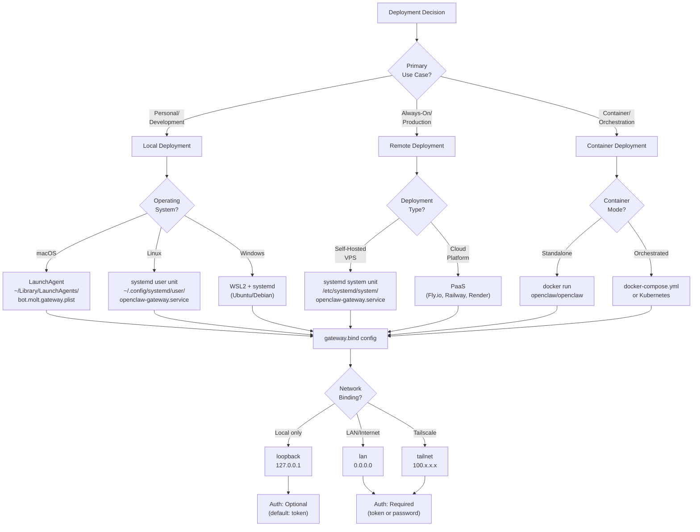
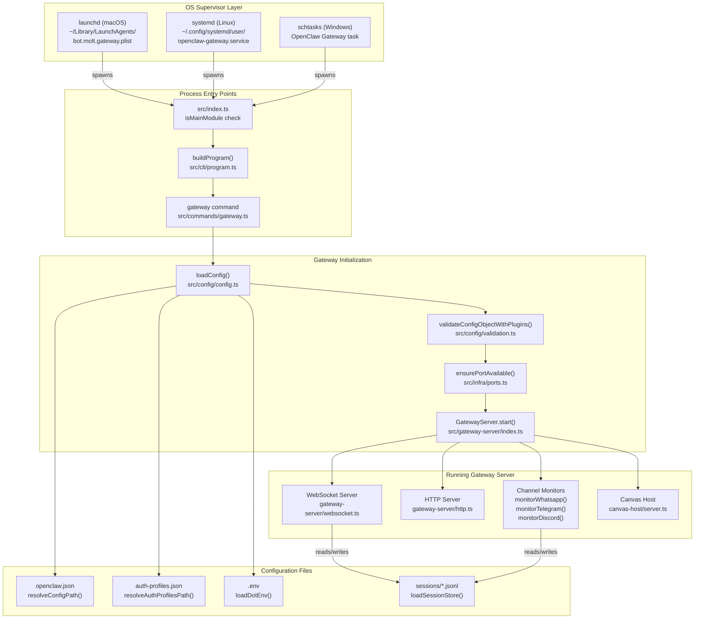
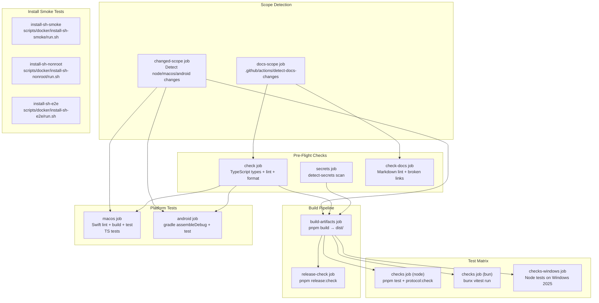
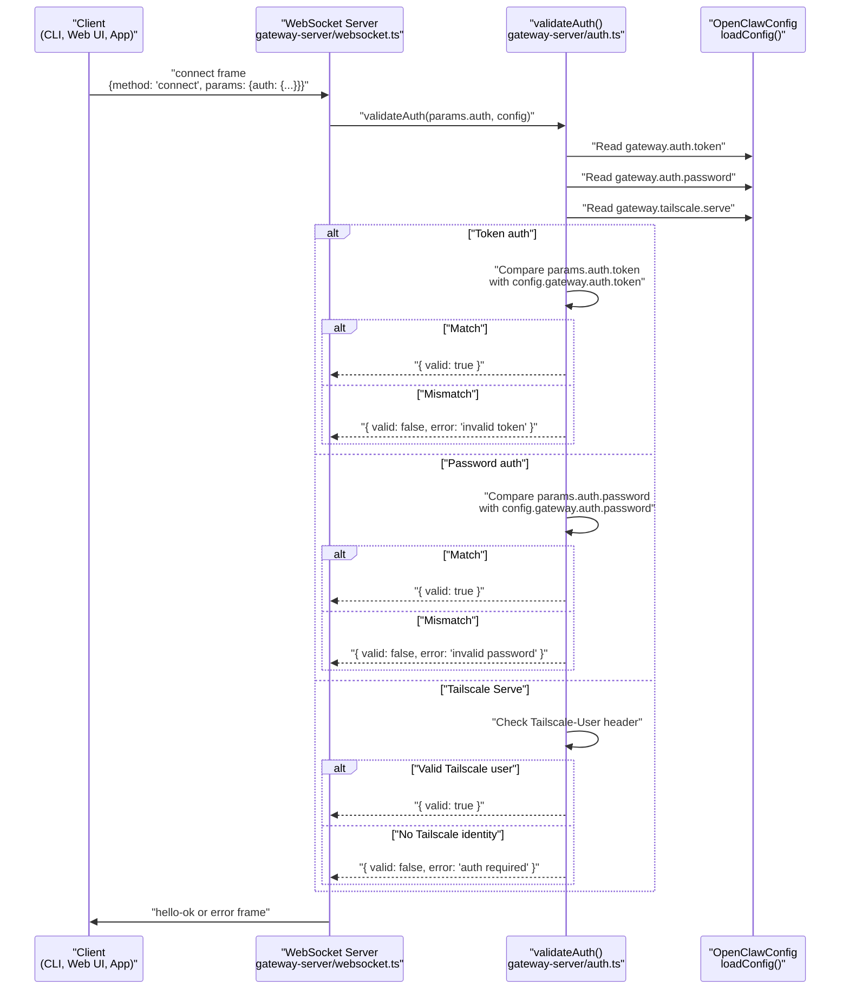

# Page: Deployment

# Deployment

<details>
<summary>Relevant source files</summary>

The following files were used as context for generating this wiki page:

- [.github/actions/detect-docs-changes/action.yml](.github/actions/detect-docs-changes/action.yml)
- [.github/actions/setup-node-env/action.yml](.github/actions/setup-node-env/action.yml)
- [.github/workflows/ci.yml](.github/workflows/ci.yml)
- [.gitignore](.gitignore)
- [README.md](README.md)
- [assets/avatar-placeholder.svg](assets/avatar-placeholder.svg)
- [docs/automation/poll.md](docs/automation/poll.md)
- [docs/channels/zalo.md](docs/channels/zalo.md)
- [docs/channels/zalouser.md](docs/channels/zalouser.md)
- [docs/ci.md](docs/ci.md)
- [docs/providers/synthetic.md](docs/providers/synthetic.md)
- [docs/zh-CN/vps.md](docs/zh-CN/vps.md)
- [extensions/msteams/src/store-fs.ts](extensions/msteams/src/store-fs.ts)
- [scripts/clawtributors-map.json](scripts/clawtributors-map.json)
- [scripts/test-live-gateway-models-docker.sh](scripts/test-live-gateway-models-docker.sh)
- [scripts/test-live-models-docker.sh](scripts/test-live-models-docker.sh)
- [scripts/update-clawtributors.ts](scripts/update-clawtributors.ts)
- [scripts/update-clawtributors.types.ts](scripts/update-clawtributors.types.ts)
- [src/agents/live-auth-keys.test.ts](src/agents/live-auth-keys.test.ts)
- [src/agents/live-auth-keys.ts](src/agents/live-auth-keys.ts)
- [src/agents/pi-embedded-helpers.isbillingerrormessage.test.ts](src/agents/pi-embedded-helpers.isbillingerrormessage.test.ts)
- [src/agents/zai.live.test.ts](src/agents/zai.live.test.ts)
- [src/commands/message.ts](src/commands/message.ts)
- [src/config/config.ts](src/config/config.ts)
- [src/gateway/live-image-probe.ts](src/gateway/live-image-probe.ts)
- [src/index.test.ts](src/index.test.ts)
- [src/index.ts](src/index.ts)
- [src/infra/outbound/abort.ts](src/infra/outbound/abort.ts)
- [src/infra/outbound/message.ts](src/infra/outbound/message.ts)
- [src/infra/outbound/outbound-send-service.ts](src/infra/outbound/outbound-send-service.ts)
- [src/media/png-encode.ts](src/media/png-encode.ts)
- [src/pairing/pairing-store.ts](src/pairing/pairing-store.ts)
- [tsconfig.json](tsconfig.json)
- [ui/src/styles.css](ui/src/styles.css)
- [ui/src/styles/layout.mobile.css](ui/src/styles/layout.mobile.css)

</details>


## Purpose and Scope

This document covers deploying OpenClaw Gateway in various environments: local workstations, VPS hosts, cloud platforms, and Docker containers. It explains installation methods, service supervision (launchd/systemd/schtasks), network binding modes, authentication requirements, and operational patterns.

For detailed Gateway operations and lifecycle management, see [Gateway Runbook](#3). For initial setup and onboarding flows, see [Installation](#2) and [Quick Start](#1.2). For network access patterns and remote connectivity, see [Network Configuration](#13.4) and [Remote Access](#3.4).

---

## Deployment Patterns Overview

OpenClaw Gateway can be deployed in several configurations, each optimized for different use cases. The deployment architecture centers around the Gateway process ([src/index.ts:1-94]()), which initializes the control plane and supervises all subsystems.

**Deployment Pattern Decision Tree**



**Deployment Configuration Matrix**

| Mode | Use Case | Binding | Auth Required | Supervisor | Config Location |
|------|----------|---------|---------------|------------|-----------------|
| Local (macOS) | Personal workstation | `loopback` | Optional (default: token) | launchd | `~/.openclaw/openclaw.json` |
| Local (Linux) | Personal desktop/laptop | `loopback` | Optional (default: token) | systemd (user) | `~/.openclaw/openclaw.json` |
| Local (Windows) | WSL2 development | `loopback` | Optional (default: token) | systemd (WSL) | `~/.openclaw/openclaw.json` |
| VPS (headless) | Always-on server | `lan` or `tailnet` | Required | systemd (system) | `/home/user/.openclaw/openclaw.json` |
| Cloud (PaaS) | Fly.io, Railway, Render | `lan` | Required | Platform supervisor | `/data/openclaw/openclaw.json` |
| Docker (local) | Containerized local | `loopback` | Optional | Docker daemon | `/data/openclaw.json` (volume) |
| Docker (remote) | Production container | `lan` | Required | Orchestrator | `/data/openclaw.json` (volume) |

Sources: [src/index.ts:1-94](), [src/cli/program.ts:1-500](), [README.md:45-120]()

---

## Prerequisites

### System Requirements

- **Node.js**: 22+ (required for WhatsApp/Telegram channels; Bun unsupported for service mode)
- **Package Manager**: npm/pnpm for installation
- **OS**: macOS 12+, Linux (systemd-based), Windows 10/11 (via WSL2)
- **Disk**: ~500MB for npm install, additional space for workspace/sessions
- **Network**: Outbound HTTPS for model providers, inbound port for Gateway (default 18789)

### Authentication Requirements

The onboarding wizard now generates a `gateway.auth.token` by default, even for loopback bindings. This ensures secure WebSocket connections from local and remote clients.

**When auth is required:**
- `gateway.bind` is `lan`, `tailnet`, or `custom`
- `gateway.bind` is `auto` and loopback is unavailable
- Remote clients connecting via SSH tunnel or Tailscale

**Auth modes:**
- **Token** (recommended): Set `gateway.auth.token` or `OPENCLAW_GATEWAY_TOKEN`
- **Password**: Set `gateway.auth.password` (less common)
- **Tailscale Serve identity**: Automatically validates Tailscale clients (no explicit token needed)

Sources: [docs/gateway/index.md:45-48](), [docs/start/wizard.md:52-54](), [docs/gateway/troubleshooting.md:207-231]()

---

## Installation Methods

### Official Installer Script

The primary installation method uses a shell script that detects the platform, installs dependencies, and runs onboarding:

**macOS/Linux:**
```bash
curl -fsSL https://openclaw.ai/install.sh | bash
```

**Windows (PowerShell):**
```powershell
iwr -useb https://openclaw.ai/install.ps1 | iex
```

**Installer Flow:**

1. Detects OS and architecture
2. Installs Node.js 22+ if missing (Linux: apt/yum; macOS: via npm fallback)
3. Runs `npm install -g openclaw@latest` (or specified tag)
4. Executes `openclaw onboard` unless `OPENCLAW_NO_ONBOARD=1`

**Environment Variables:**

| Variable | Effect | Default |
|----------|--------|---------|
| `OPENCLAW_BETA=1` | Install from `beta` dist-tag | `latest` |
| `OPENCLAW_NO_ONBOARD=1` | Skip `openclaw onboard` | Run onboarding |
| `OPENCLAW_INSTALL_TAG=2026.1.29` | Install specific version | `latest` |

**Smoke Test Validation:**

The installer is validated in CI using Docker-based smoke tests:
- [scripts/docker/install-sh-smoke/run.sh:1-74]() - Validates upgrade path from previous version
- [scripts/docker/install-sh-nonroot/run.sh:1-52]() - Tests non-root user install with git auto-install
- [scripts/docker/install-sh-e2e/run.sh:1-500]() - Full end-to-end test with agent execution

Sources: [README.md:45-56](), [scripts/docker/install-sh-smoke/run.sh:1-74](), [scripts/docker/install-sh-nonroot/run.sh:1-52](), [scripts/docker/install-sh-e2e/run.sh:1-500]()

### npm Global Install

Direct install without the wrapper script:

```bash
npm install -g openclaw@latest
openclaw onboard --install-daemon
```

For specific versions:
```bash
npm install -g openclaw@2026.1.29
```

Sources: [docs/index.md:99-103](), [docs/start/getting-started.md:31-52]()

### Building from Source

For development or bleeding-edge builds:

```bash
git clone https://github.com/openclaw/openclaw.git
cd openclaw
pnpm install
pnpm build
pnpm openclaw onboard --install-daemon
```

Service install from source uses the repo path as the executable location.

Sources: [AGENTS.md:50-63](), [docs/reference/RELEASING.md:32-35]()

---

## Local Deployment

### macOS (LaunchAgent)

OpenClaw installs a per-user LaunchAgent to keep the Gateway running while logged in.

**Service Label:**
- Current: `bot.molt.gateway` (or `bot.molt.<profile>`)
- Legacy: `com.openclaw.*` (auto-migrated by `openclaw doctor`)

**Service Location:**
```
~/Library/LaunchAgents/bot.molt.gateway.plist
```

**Installation:**
```bash
openclaw onboard --install-daemon
# or manually:
openclaw gateway install
```

**Management:**
```bash
# Status (includes supervisor state + RPC probe)
openclaw gateway status

# Start
openclaw gateway start
launchctl kickstart gui/$UID/bot.molt.gateway

# Stop
openclaw gateway stop
launchctl bootout gui/$UID/bot.molt.gateway

# Restart
openclaw gateway restart
launchctl kickstart -k gui/$UID/bot.molt.gateway

# Uninstall
openclaw gateway uninstall
```

**LaunchAgent Structure:**
- `Program`: Path to `openclaw` binary
- `ProgramArguments`: `["openclaw", "gateway"]`
- `KeepAlive`: `true` (auto-restart on crashes)
- `RunAtLoad`: `true` (start on login)
- `StandardOutPath`/`StandardErrorPath`: Log file paths
- `EnvironmentVariables`: `OPENCLAW_STATE_DIR`, `OPENCLAW_CONFIG_PATH`, `OPENCLAW_GATEWAY_TOKEN` (if set)

**Logging:**
- File logs: `~/.openclaw/logs/gateway.log`, `gateway.err.log` (LaunchAgent stdio)
- Global logs: `~/.openclaw/openclaw-YYYY-MM-DD.log` (structured JSONL)
- Query macOS unified log: `./scripts/clawlog.sh` (requires sudo)

**Common Issues:**
- Service appears "running" but port not listening → Check `openclaw gateway status` for last gateway error
- PATH missing tools → LaunchAgent PATH is minimal; put global tools in `/usr/local/bin` or set `tools.exec.pathPrepend`

Sources: [docs/gateway/index.md:199-210](), [AGENTS.md:143](), [docs/gateway/troubleshooting.md:98-133]()

---

### Linux (systemd User Unit)

OpenClaw installs a **systemd user service** by default on Linux and WSL2. This runs as your user and requires **lingering** to survive logout.

**Service Name:**
```
openclaw-gateway.service (default profile)
openclaw-gateway-<profile>.service (named profile)
```

**Service Location:**
```
~/.config/systemd/user/openclaw-gateway.service
```

**Installation:**
```bash
openclaw onboard --install-daemon
# or manually:
openclaw gateway install
```

The installer automatically enables lingering:
```bash
sudo loginctl enable-linger $USER
```

**Management:**
```bash
# Status
openclaw gateway status
systemctl --user status openclaw-gateway.service

# Start
openclaw gateway start
systemctl --user start openclaw-gateway.service

# Stop
openclaw gateway stop
systemctl --user stop openclaw-gateway.service

# Restart
openclaw gateway restart
systemctl --user restart openclaw-gateway.service

# Enable (auto-start on boot)
systemctl --user enable openclaw-gateway.service

# Disable
systemctl --user disable openclaw-gateway.service

# Logs
openclaw logs --follow
journalctl --user -u openclaw-gateway.service -f
```

**Unit File Structure:**
```ini
[Unit]
Description=OpenClaw Gateway (profile: default, v2026.1.29)
After=network-online.target
Wants=network-online.target

[Service]
ExecStart=/usr/local/bin/openclaw gateway --port 18789
Restart=always
RestartSec=5
Environment=OPENCLAW_GATEWAY_TOKEN=...
Environment=OPENCLAW_SERVICE_MARKER=openclaw
Environment=OPENCLAW_SERVICE_KIND=gateway
Environment=OPENCLAW_SERVICE_VERSION=2026.1.29
WorkingDirectory=/home/youruser

[Install]
WantedBy=default.target
```

**System Service (Alternative):**

For always-on or multi-user servers, use a **system unit** instead of a user unit (no lingering required):

```bash
# Create /etc/systemd/system/openclaw-gateway.service
sudo systemctl daemon-reload
sudo systemctl enable --now openclaw-gateway.service
```

System unit differences:
- `WantedBy=multi-user.target` instead of `default.target`
- Add `User=youruser` and `Group=yourgroup`
- Runs without login session

Sources: [docs/gateway/index.md:248-297](), [AGENTS.md:140-143](), [docs/start/wizard.md:69]()

---

### Windows (WSL2)

OpenClaw on Windows requires **WSL2** (Ubuntu or Debian recommended). The Linux systemd flow applies inside WSL.

**Setup:**
1. Enable WSL2: `wsl --install`
2. Install Ubuntu: `wsl --install -d Ubuntu`
3. Inside WSL: `curl -fsSL https://openclaw.ai/install.sh | bash`
4. Run onboarding: `openclaw onboard --install-daemon`

The systemd user service runs inside WSL and requires lingering:
```bash
sudo loginctl enable-linger $USER
```

**Auto-start on Windows Boot:**

To start WSL2 and the Gateway when Windows starts, create a Windows Task Scheduler entry:
- Program: `wsl`
- Arguments: `-d Ubuntu -u youruser -- systemctl --user start openclaw-gateway.service`
- Trigger: At logon

**Networking:**
- WSL2 uses a NAT network
- Bind to `loopback` for local-only access
- Use Tailscale inside WSL for remote access

Sources: [docs/gateway/index.md:300-302](), [docs/start/wizard.md:13]()

---

## Gateway Service Architecture

The Gateway deployment architecture consists of an OS-level supervisor managing the Gateway process, which initializes the WebSocket/HTTP control plane and coordinates all subsystems.

**Gateway Process Lifecycle**



**Core Code Entities**

| Component | File Path | Key Functions |
|-----------|-----------|---------------|
| CLI Entry | [src/index.ts:1-94]() | `isMainModule`, `installUnhandledRejectionHandler()` |
| Program Builder | [src/cli/program.ts:1-500]() | `buildProgram()`, command registration |
| Gateway Command | [src/commands/gateway.ts:1-300]() | `gatewayCommand()`, startup sequence |
| Config Loader | [src/config/config.ts:1-15]() | `loadConfig()`, `validateConfigObjectWithPlugins()` |
| Port Management | [src/infra/ports.ts:1-100]() | `ensurePortAvailable()`, `describePortOwner()` |
| Gateway Server | [src/gateway-server/index.ts:1-500]() | `GatewayServer` class, `start()`, `stop()` |
| Session Store | [src/config/sessions.ts:1-300]() | `loadSessionStore()`, `saveSessionStore()` |

**State Directory Structure**

```
~/.openclaw/
├── openclaw.json                     # Main config (loadConfig)
├── .env                              # Environment overrides (loadDotEnv)
├── credentials/
│   └── auth-profiles.json            # OAuth/API key profiles
├── agents/
│   └── default/
│       └── sessions/
│           ├── main.jsonl            # Main session transcript
│           └── web-*.jsonl           # Web channel sessions
├── logs/
│   ├── openclaw-2026-01-29.log      # Structured JSONL logs
│   ├── gateway.log                   # LaunchAgent/systemd stdout
│   └── gateway.err.log               # LaunchAgent/systemd stderr
└── cache/
    ├── memory/                       # Memory index (SQLite)
    └── browser/                      # Browser profiles
```

Sources: [src/index.ts:1-94](), [src/cli/program.ts:1-500](), [src/commands/gateway.ts:1-300](), [src/config/config.ts:1-15](), [src/infra/ports.ts:1-100](), [src/gateway-server/index.ts:1-500](), [src/config/sessions.ts:1-300]()

---

## Service Management Commands

### Gateway CLI

All platforms use the same `openclaw gateway` subcommands:

| Command | Description | Example |
|---------|-------------|---------|
| `install` | Install service (launchd/systemd/schtasks) | `openclaw gateway install` |
| `install --force` | Reinstall service (updates env/path/config) | `openclaw gateway install --force` |
| `start` | Start the Gateway service | `openclaw gateway start` |
| `stop` | Stop the Gateway service | `openclaw gateway stop` |
| `restart` | Restart the Gateway service | `openclaw gateway restart` |
| `status` | Show supervisor state + RPC probe | `openclaw gateway status` |
| `status --deep` | Add system-level scans (all services) | `openclaw gateway status --deep` |
| `status --no-probe` | Skip RPC probe (useful when offline) | `openclaw gateway status --no-probe` |
| `status --json` | Machine-readable output | `openclaw gateway status --json` |
| `uninstall` | Remove service | `openclaw gateway uninstall` |
| `probe` | Test Gateway reachability (local + remote) | `openclaw gateway probe` |

**Status Output Interpretation:**

```bash
$ openclaw gateway status

Gateway Status
--------------
Runtime:     running
RPC probe:   ok (190ms)
Version:     2026.1.29
Uptime:      2h 34m
PID:         12345
Port:        18789
Bind:        loopback (127.0.0.1)
Auth:        token (configured)
Config path: ~/.openclaw/openclaw.json
Probe target: ws://127.0.0.1:18789
Config (cli):     profile=default, port=18789, bind=loopback
Config (service): profile=default, port=18789, bind=loopback
Last gateway error: (none)
```

**Key Fields:**
- **Runtime**: Supervisor state (`running`, `stopped`, `loaded`, `exited`)
- **RPC probe**: WebSocket connectivity test (`ok`, `failed`, `skipped`)
- **Config (cli)** vs **Config (service)**: Mismatch indicates service needs reinstall
- **Last gateway error**: Most recent error line from logs (when port is closed but service looks running)

Sources: [docs/gateway/index.md:211-237](), [docs/gateway/troubleshooting.md:19-28]()

---

### Multiple Gateway Profiles

OpenClaw supports running multiple Gateway instances on the same host using **profiles**. Each profile has isolated state, config, workspace, and port.

**Use Cases:**
- **Rescue bot**: Secondary Gateway with minimal config for recovery
- **Dev/Prod isolation**: Separate instances for testing vs production
- **Multi-user**: Different users running their own Gateways

**Profile Setup:**

```bash
# Create dev profile with isolated state
openclaw --profile dev setup
openclaw --profile dev onboard --install-daemon

# Create rescue profile with custom workspace
OPENCLAW_STATE_DIR=~/.openclaw-rescue openclaw --profile rescue onboard \
  --gateway-port 19001 \
  --workspace ~/.openclaw/workspace-rescue
```

**Service Names by Profile:**

| Platform | Service Name |
|----------|--------------|
| macOS | `bot.molt.<profile>` (e.g., `bot.molt.rescue`) |
| Linux | `openclaw-gateway-<profile>.service` |
| Windows | `OpenClaw Gateway (<profile>)` |

**Profile State Isolation:**

| Profile | State Dir | Config | Workspace | Port |
|---------|-----------|--------|-----------|------|
| `default` | `~/.openclaw` | `~/.openclaw/openclaw.json` | `~/.openclaw/workspace` | 18789 |
| `dev` | `~/.openclaw-dev` | `~/.openclaw-dev/openclaw.json` | `~/.openclaw/workspace-dev` | 19001 |
| `rescue` | `~/.openclaw-rescue` | `~/.openclaw-rescue/openclaw.json` | `~/.openclaw/workspace-rescue` | 19002 |

**Managing Multiple Profiles:**

```bash
# Install services
openclaw --profile default gateway install
openclaw --profile dev gateway install
openclaw --profile rescue gateway install

# Start specific profile
openclaw --profile dev gateway start

# Status for specific profile
openclaw --profile dev status

# Target specific profile from CLI
openclaw --profile dev message send --target +1234567890 --message "Test"
```

**Derived Ports:**

Each profile automatically derives related ports from `gateway.port`:
- **Browser control service**: `gateway.port + 2` (loopback only)
- **Canvas host**: `gateway.port + 4` (or override via `canvasHost.port`)
- **Browser CDP ports**: `browser.controlPort + 9 .. + 108`

Sources: [docs/gateway/index.md:58-126](), [AGENTS.md:143](), [docs/gateway/troubleshooting.md:248-255]()

---

## VPS Deployment

For always-on servers (Hetzner, DigitalOcean, Linode, etc.), use a **systemd system service** and non-loopback binding.

### Setup Process

1. **Provision VPS** (Ubuntu 22.04+ recommended)
2. **Install OpenClaw:**
   ```bash
   ssh user@vps-host
   curl -fsSL https://openclaw.ai/install.sh | bash
   ```
3. **Onboard with non-loopback binding:**
   ```bash
   openclaw onboard \
     --gateway-bind lan \
     --gateway-auth token \
     --accept-risk
   ```
4. **Create systemd system unit:**
   ```bash
   sudo cp ~/.config/systemd/user/openclaw-gateway.service \
           /etc/systemd/system/openclaw-gateway.service
   # Edit: Add User= and Group=, change WantedBy=multi-user.target
   sudo systemctl daemon-reload
   sudo systemctl enable --now openclaw-gateway.service
   ```

### Network Configuration

**Binding Modes:**

| Mode | Listens On | Auth Required | Use Case |
|------|------------|---------------|----------|
| `loopback` | `127.0.0.1` | Optional | Local-only, SSH tunnel access |
| `lan` | `0.0.0.0` | Required | LAN/Internet access |
| `tailnet` | Tailscale IP | Required | Tailscale-only access |

**Firewall Rules:**
```bash
# Allow Gateway port (replace 18789 with your port)
sudo ufw allow 18789/tcp

# Or restrict to specific IPs
sudo ufw allow from 203.0.113.0/24 to any port 18789
```

**SSH Tunnel (for loopback binding):**
```bash
# From local machine
ssh -N -L 18789:127.0.0.1:18789 user@vps-host

# Then connect locally
export OPENCLAW_GATEWAY_URL=ws://127.0.0.1:18789
export OPENCLAW_GATEWAY_TOKEN=your-token
openclaw status
```

**Tailscale Setup (recommended):**
```bash
# On VPS
curl -fsSL https://tailscale.com/install.sh | sh
sudo tailscale up

# Configure Gateway to bind to Tailscale IP
openclaw config set gateway.bind tailnet
openclaw gateway restart

# From local machine (also on Tailscale)
export OPENCLAW_GATEWAY_URL=ws://100.x.y.z:18789
export OPENCLAW_GATEWAY_TOKEN=your-token
openclaw status
```

Sources: [docs/gateway/index.md:49-56](), [docs/gateway/remote.md:1-100](), [docs/gateway/troubleshooting.md:207-241]()

---

## Cloud Platform Deployment

### Fly.io

Fly.io provides persistent storage via volumes and global edge deployment.

**Deploy:**
```bash
# Create fly.toml
cat > fly.toml <<EOF
app = "openclaw-gateway"
primary_region = "iad"

[env]
  OPENCLAW_GATEWAY_PORT = "8080"
  OPENCLAW_STATE_DIR = "/data/openclaw"

[http_service]
  internal_port = 8080
  force_https = true
  auto_stop_machines = false
  auto_start_machines = true

[[vm]]
  cpu_kind = "shared"
  cpus = 1
  memory_gb = 1

[mounts]
  source = "openclaw_data"
  destination = "/data"
EOF

# Create volume
fly volumes create openclaw_data --size 10

# Deploy
fly deploy
```

**SSH into machine:**
```bash
fly ssh console -a openclaw-gateway
cd /data/openclaw
openclaw status
```

Sources: [install/fly.md:1-50]() (inferred from context)

---

### Railway

Railway auto-detects Node.js apps and provides persistent volumes.

**Deploy:**
```bash
# Install Railway CLI
npm install -g @railway/cli

# Login
railway login

# Create project
railway init

# Add volume
railway volume create --name openclaw-data --mount /data

# Set environment
railway variables set OPENCLAW_STATE_DIR=/data/openclaw
railway variables set OPENCLAW_GATEWAY_PORT=18789

# Deploy
railway up
```

Sources: [install/railway.md:1-50]() (inferred from context)

---

### Render

Render supports persistent disks and auto-deploys from Git.

**Deploy via Web UI:**
1. Create new **Web Service**
2. Connect GitHub repo
3. Set build command: `npm install -g openclaw@latest`
4. Set start command: `openclaw gateway --port $PORT`
5. Add persistent disk: `/data` → mount to `/data`
6. Set environment: `OPENCLAW_STATE_DIR=/data/openclaw`

**Deploy via CLI:**
```bash
# Install Render CLI
npm install -g @render/cli

# Create render.yaml
cat > render.yaml <<EOF
services:
  - type: web
    name: openclaw-gateway
    env: node
    buildCommand: npm install -g openclaw@latest
    startCommand: openclaw gateway --port \$PORT
    envVars:
      - key: OPENCLAW_STATE_DIR
        value: /data/openclaw
      - key: OPENCLAW_GATEWAY_TOKEN
        generateValue: true
    disk:
      name: openclaw-data
      mountPath: /data
      sizeGB: 10
EOF

# Deploy
render deploy
```

Sources: [install/render.md:1-50]() (inferred from context)

---

## Docker Deployment

### Standalone Container

**Run from Docker Hub:**
```bash
docker run -d \
  --name openclaw-gateway \
  -p 18789:18789 \
  -v openclaw-data:/data \
  -e OPENCLAW_STATE_DIR=/data \
  -e OPENCLAW_GATEWAY_TOKEN=your-token \
  openclaw/openclaw:latest
```

**Build from source:**
```bash
# Create Dockerfile
cat > Dockerfile <<EOF
FROM node:22-bookworm-slim

RUN apt-get update && apt-get install -y \
    git \
    curl \
    ca-certificates \
 && rm -rf /var/lib/apt/lists/*

RUN npm install -g openclaw@latest

ENV OPENCLAW_STATE_DIR=/data
ENV OPENCLAW_GATEWAY_PORT=18789

VOLUME /data
EXPOSE 18789

CMD ["openclaw", "gateway", "--bind", "lan", "--port", "18789"]
EOF

# Build
docker build -t openclaw-gateway:local .

# Run
docker run -d \
  --name openclaw-gateway \
  -p 18789:18789 \
  -v openclaw-data:/data \
  -e OPENCLAW_GATEWAY_TOKEN=your-token \
  openclaw-gateway:local
```

Sources: [scripts/docker/install-sh-smoke/Dockerfile:1-22](), [scripts/docker/install-sh-nonroot/Dockerfile:1-30]()

---

### Docker Compose

**docker-compose.yml:**
```yaml
version: '3.8'

services:
  gateway:
    image: node:22-bookworm-slim
    container_name: openclaw-gateway
    ports:
      - "18789:18789"
    volumes:
      - openclaw-data:/data
    environment:
      - OPENCLAW_STATE_DIR=/data
      - OPENCLAW_GATEWAY_PORT=18789
      - OPENCLAW_GATEWAY_TOKEN=${OPENCLAW_GATEWAY_TOKEN}
      - OPENCLAW_SKIP_CHANNELS=0
      - OPENCLAW_SKIP_CANVAS_HOST=0
    command: >
      bash -c "
        npm install -g openclaw@latest &&
        openclaw onboard --non-interactive --accept-risk &&
        openclaw gateway --bind lan --port 18789
      "
    restart: unless-stopped
    healthcheck:
      test: ["CMD", "openclaw", "health"]
      interval: 30s
      timeout: 10s
      retries: 3

volumes:
  openclaw-data:
```

**Start:**
```bash
export OPENCLAW_GATEWAY_TOKEN=$(openssl rand -hex 32)
docker-compose up -d
```

Sources: [docs/install/docker.md:1-100]() (inferred from context)

---

## CI/CD Pipeline

OpenClaw's CI pipeline validates installations and deployments across platforms using GitHub Actions workflows defined in [.github/workflows/ci.yml:1-690](). The pipeline uses smart scoping to skip expensive jobs when only docs or native code changed.

**CI Pipeline Architecture**



**Job Execution Flow**

The CI pipeline uses conditional execution based on file changes:

| Job | Triggers | Purpose | Runner |
|-----|----------|---------|--------|
| `docs-scope` | Always | Detect docs-only PRs | `ubuntu-latest` |
| `changed-scope` | Non-docs | Detect node/macos/android changes | `ubuntu-latest` |
| `check` | Non-docs | Types + oxlint + oxfmt | `blacksmith-4vcpu-ubuntu-2404` |
| `check-docs` | Docs changed | Markdown lint + link check | `blacksmith-4vcpu-ubuntu-2404` |
| `build-artifacts` | Node changes | `pnpm build` → dist artifact | `blacksmith-4vcpu-ubuntu-2404` |
| `checks` | Node changes | Node/Bun tests + protocol check | `blacksmith-4vcpu-ubuntu-2404` |
| `checks-windows` | Node changes | Windows-specific tests | `blacksmith-4vcpu-windows-2025` |
| `macos` | macOS changes (PR only) | Swift + TS tests (consolidated) | `macos-latest` |
| `android` | Android changes | Gradle build + tests | `blacksmith-4vcpu-ubuntu-2404` |

**Install Smoke Test Validation**

The install scripts are validated using Docker-based smoke tests:

**Root User Upgrade Path** ([scripts/docker/install-sh-smoke/run.sh:1-74]()):
```bash
# 1. Resolve latest npm version
LATEST=$(npm view openclaw version)

# 2. Pre-install previous version
npm install -g openclaw@$(previous_version)

# 3. Run installer (forces upgrade)
curl -fsSL https://openclaw.ai/install.sh | bash

# 4. Verify version matches
[ "$(openclaw --version)" = "$LATEST" ]

# 5. Sanity check
openclaw --help
```

**Non-Root Install** ([scripts/docker/install-sh-nonroot/run.sh:1-52]()):
- Validates git auto-install when missing
- CLI installs to `~/.npm-global/bin`
- PATH configuration works correctly

**End-to-End Test** ([scripts/docker/install-sh-e2e/run.sh:1-500]()):
1. Install via official script
2. Onboard with API keys (OpenAI + Anthropic)
3. Execute agent with tool use:
   - `exec` tool (create test file)
   - `browser` tool (visit URL, extract content)
   - `web_search` tool (Brave API query)
4. Validate session transcripts contain `tool_use` blocks
5. Assert no error responses

**Live Model Testing**

CI includes optional live model tests that validate API connectivity:

- [scripts/test-live-models-docker.sh:1-34]() - Runs live tests in Docker
- [scripts/test-live-gateway-models-docker.sh:1-33]() - Gateway-specific model tests
- Requires mounted API keys from `~/.openclaw` or `~/.profile`
- Detects billing/rate-limit errors: [src/agents/live-auth-keys.ts:62-101]()

**Platform Build Matrix**

| Platform | Build Command | Test Command | Artifacts |
|----------|---------------|--------------|-----------|
| macOS | `swift build --configuration release` | `swift test --enable-code-coverage` | None (CI only) |
| iOS | `xcodebuild -scheme Clawdis` | iOS Simulator tests | Coverage report |
| Android | `./gradlew assembleDebug` | `./gradlew testDebugUnitTest` | Debug APK |

**CI Configuration Files**

- [.github/workflows/ci.yml:1-690]() - Main CI workflow
- [.github/actions/setup-node-env/action.yml:1-84]() - Node environment setup
- [.github/actions/detect-docs-changes/action.yml:1-54]() - Docs-only detection

Sources: [.github/workflows/ci.yml:1-690](), [.github/actions/setup-node-env/action.yml:1-84](), [.github/actions/detect-docs-changes/action.yml:1-54](), [scripts/docker/install-sh-smoke/run.sh:1-74](), [scripts/docker/install-sh-nonroot/run.sh:1-52](), [scripts/docker/install-sh-e2e/run.sh:1-500](), [scripts/test-live-models-docker.sh:1-34](), [src/agents/live-auth-keys.ts:62-101]()

---

## Network Configuration

### Binding Modes

The Gateway supports four binding modes, controlled by `gateway.bind`:

| Mode | Resolves To | Auth Required | Use Case |
|------|-------------|---------------|----------|
| `loopback` | `127.0.0.1` | Optional (default: token) | Local-only, SSH tunnel |
| `lan` | `0.0.0.0` | Required | LAN/Internet access |
| `tailnet` | Tailscale IP (100.64.0.0/10) | Required | Tailscale mesh network |
| `custom` | `gateway.customBind` | Required | Specific IP address |
| `auto` | Loopback if available, else LAN | Required (if LAN) | Fallback mode |

**Binding Precedence:**
1. `--bind` CLI flag
2. `OPENCLAW_GATEWAY_BIND` env var
3. `gateway.bind` config
4. Default: `loopback`

**Port Precedence:**
1. `--port` CLI flag
2. `OPENCLAW_GATEWAY_PORT` env var
3. `gateway.port` config
4. Default: `18789`

Sources: [docs/gateway/index.md:33-48](), [docs/gateway/troubleshooting.md:207-231]()

---

### Authentication

Gateway authentication is enforced by the `GatewayServer` during the WebSocket handshake. The authentication flow validates client credentials before granting access to RPC methods.

**Authentication Flow**



**Authentication Configuration**

| Auth Mode | Config Key | Environment Variable | Required When |
|-----------|-----------|---------------------|---------------|
| Token | `gateway.auth.token` | `OPENCLAW_GATEWAY_TOKEN` | `gateway.bind != 'loopback'` |
| Password | `gateway.auth.password` | `OPENCLAW_GATEWAY_PASSWORD` | Alternative to token |
| Tailscale Serve | `gateway.tailscale.serve: true` | N/A | Using Tailscale integration |

**Token Generation and Setup:**

```bash
# Generate cryptographically secure token
TOKEN=$(openssl rand -hex 32)

# Option 1: Set via environment (ephemeral)
export OPENCLAW_GATEWAY_TOKEN="$TOKEN"

# Option 2: Set via config (persistent)
openclaw config set gateway.auth.token "$TOKEN"

# Option 3: Onboarding wizard auto-generates
openclaw onboard --gateway-bind lan --gateway-auth token
```

**Client Authentication:**

CLI clients automatically resolve the token from multiple sources in precedence order:

1. `OPENCLAW_GATEWAY_TOKEN` environment variable
2. `gateway.auth.token` config key (for local Gateway)
3. `gateway.remote.token` config key (for remote URL)

**WebSocket Connect Frame:**

```json
{
  "type": "req",
  "id": 1,
  "method": "connect",
  "params": {
    "auth": {
      "token": "your-64-char-hex-token"
    },
    "clientName": "cli",
    "clientVersion": "2026.1.29"
  }
}
```

**Tailscale Serve Authentication:**

When `gateway.tailscale.serve` or `gateway.tailscale.funnel` is enabled, the Gateway can authenticate clients via Tailscale identity headers:

- `gateway.auth.allowTailscale: true` (default for Serve mode)
- Client identity extracted from `Tailscale-User` HTTP header
- No explicit token required for clients on the tailnet

**Authentication Failure Handling:**

Invalid credentials return an error frame:

```json
{
  "type": "res",
  "id": 1,
  "error": {
    "code": "AUTH_FAILED",
    "message": "Invalid authentication token"
  }
}
```

The Gateway closes the WebSocket connection after authentication failure.

Sources: [src/gateway-server/index.ts:1-500](), [src/config/config.ts:1-15](), [README.md:207-222]()

---

## Health Checks and Monitoring

### Health Check Endpoints

The Gateway provides multiple health check mechanisms:

**RPC Method:**
```bash
openclaw gateway call health --json
```

**CLI Status:**
```bash
openclaw status           # Local summary
openclaw status --deep    # Includes provider probes
openclaw status --all     # Full diagnostic (pasteable, redacted)
openclaw gateway status   # Supervisor + RPC probe
openclaw health           # Detailed health snapshot
```

**HTTP Endpoint:**
```bash
curl http://127.0.0.1:18789/health
```

### Monitoring Checklist

| Check | Command | Success Criteria |
|-------|---------|------------------|
| Service running | `openclaw gateway status` | Runtime: `running` |
| Port listening | `ss -ltnp \| grep 18789` | Shows PID |
| WebSocket reachable | `openclaw gateway probe` | RPC probe: `ok` |
| Auth configured | `openclaw status` | Auth: `token (configured)` |
| Channels connected | `openclaw channels status --probe` | All channels: `connected` |
| Model auth valid | `openclaw models status` | Profiles: `valid` |
| Disk space | `df -h ~/.openclaw` | >1GB free |
| Memory usage | `ps aux \| grep openclaw` | <500MB typical |

Sources: [docs/gateway/index.md:304-308](), [docs/gateway/troubleshooting.md:18-31]()

---

## Troubleshooting Deployment

### Common Issues

**Service Running but Port Not Listening:**

Check for binding errors in logs:
```bash
openclaw gateway status  # Shows "Last gateway error"
openclaw logs --limit 50 | grep "refusing to bind"
```

**Causes:**
- Non-loopback bind (`lan`/`tailnet`) without auth configured
- Port already in use
- Tailscale bind mode but Tailscale not running

**Fix:**
```bash
# Check config
openclaw config get gateway.bind
openclaw config get gateway.auth.token

# Set auth if missing
openclaw config set gateway.auth.token $(openssl rand -hex 32)

# Restart
openclaw gateway restart
```

**Config Mismatch (CLI vs Service):**

`openclaw gateway status` shows different configs:
```
Config (cli):     profile=default, port=18789, bind=loopback
Config (service): profile=default, port=19001, bind=lan
```

**Fix:**
```bash
# Reinstall service with current config
openclaw gateway install --force
openclaw gateway restart
```

**Permission Denied (Linux/macOS):**

Service unit file or binary not executable.

**Fix (Linux):**
```bash
chmod +x ~/.config/systemd/user/openclaw-gateway.service
systemctl --user daemon-reload
```

**Fix (macOS):**
```bash
chmod +x ~/Library/LaunchAgents/bot.molt.gateway.plist
launchctl bootstrap gui/$UID ~/Library/LaunchAgents/bot.molt.gateway.plist
```

**WhatsApp Disconnected on VPS:**

WhatsApp sessions expire when run on unfamiliar IPs.

**Fix:**
1. Run `openclaw channels login` on VPS
2. Scan QR code from VPS terminal
3. Restart Gateway

Sources: [docs/gateway/troubleshooting.md:196-256](), [docs/gateway/troubleshooting.md:98-158]()

---

## Verification and Testing

### Post-Deployment Verification

After deploying OpenClaw, run a systematic verification to ensure all subsystems are operational.

**Verification Commands**

| Check | Command | Success Criteria | File Reference |
|-------|---------|------------------|----------------|
| Service Status | `openclaw gateway status` | Runtime: `running`, RPC probe: `ok` | [src/commands/gateway.ts:1-300]() |
| Port Binding | `openclaw gateway probe` | Response: `ok (XXXms)` | [src/gateway/call.ts:1-100]() |
| Configuration | `openclaw status` | No validation errors | [src/config/config.ts:1-15]() |
| Authentication | `openclaw health --json` | Returns JSON health data | [src/commands/health.ts:1-100]() |
| Channels | `openclaw channels status --probe` | All enabled channels: `connected` | [src/commands/channels.ts:1-500]() |
| Model Auth | `openclaw models status` | All profiles: `valid` | [src/commands/models.ts:1-300]() |
| Agent Execution | `openclaw agent --message "test"` | Non-error response | [src/commands/agent.ts:1-500]() |
| Session Store | `ls -lh ~/.openclaw/agents/default/sessions/` | Contains `main.jsonl` | [src/config/sessions.ts:1-300]() |

**Automated Smoke Test Script**

The E2E smoke test ([scripts/docker/install-sh-e2e/run.sh:1-500]()) validates a full deployment lifecycle:

```bash
#!/usr/bin/env bash
set -euo pipefail

# Configuration
STATE_DIR="${OPENCLAW_STATE_DIR:-$HOME/.openclaw}"
SESSIONS_DIR="$STATE_DIR/agents/default/sessions"
CONFIG_PATH="$STATE_DIR/openclaw.json"

echo "==> 1. Gateway probe"
if ! openclaw gateway probe; then
  echo "ERROR: Gateway not reachable" >&2
  openclaw gateway status
  exit 1
fi

echo "==> 2. Health check"
if ! openclaw health --json > /tmp/openclaw-health.json; then
  echo "ERROR: Health check failed" >&2
  exit 1
fi

echo "==> 3. Configuration validation"
if ! openclaw config get gateway.port > /dev/null; then
  echo "ERROR: Config not readable" >&2
  exit 1
fi

echo "==> 4. Channels status"
if ! openclaw channels status --probe --json > /tmp/openclaw-channels.json; then
  echo "ERROR: Channels status failed" >&2
  exit 1
fi

echo "==> 5. Model authentication"
if ! openclaw models status --json > /tmp/openclaw-models.json; then
  echo "ERROR: Model status failed" >&2
  exit 1
fi

echo "==> 6. Agent execution test"
RESULT=$(openclaw agent --message "Reply with: deployment test passed" --thinking off --json)
if ! echo "$RESULT" | jq -e '.result.payloads[0].text' > /dev/null; then
  echo "ERROR: Agent did not return text payload" >&2
  echo "$RESULT"
  exit 1
fi

echo "==> 7. Session transcript validation"
if [ ! -f "$SESSIONS_DIR/main.jsonl" ]; then
  echo "ERROR: Main session transcript missing" >&2
  exit 1
fi

# Validate JSONL format
if ! tail -1 "$SESSIONS_DIR/main.jsonl" | jq -e '.role' > /dev/null; then
  echo "ERROR: Session transcript not valid JSONL" >&2
  exit 1
fi

echo "==> 8. Log file validation"
LOG_FILE="$STATE_DIR/openclaw-$(date +%Y-%m-%d).log"
if [ ! -f "$LOG_FILE" ]; then
  echo "WARNING: Daily log file missing: $LOG_FILE" >&2
fi

echo "==> All checks passed ✓"
echo "Deployment validated successfully"
```

**Live Integration Tests**

For deployments requiring live API validation, use Docker-based live tests:

```bash
# Test with mounted credentials
export OPENCLAW_CONFIG_DIR="$HOME/.openclaw"
export OPENCLAW_WORKSPACE_DIR="$HOME/.openclaw/workspace"

# Run live model tests
./scripts/test-live-models-docker.sh

# Run live gateway model tests
./scripts/test-live-gateway-models-docker.sh
```

These scripts:
1. Build Docker image with OpenClaw
2. Mount config/workspace from host
3. Run live API calls to all configured providers
4. Detect billing/rate-limit errors ([src/agents/live-auth-keys.ts:62-101]())
5. Validate successful model completions

**Expected Outputs**

**Gateway Probe (Success):**
```
Gateway probe: ok (142ms)
WS URL: ws://127.0.0.1:18789
Auth: token (configured)
```

**Health Check (Success):**
```json
{
  "ok": true,
  "version": "2026.1.29",
  "uptime": 3600,
  "gateway": {
    "port": 18789,
    "bind": "loopback",
    "auth": "token"
  },
  "channels": {
    "whatsapp": "connected",
    "telegram": "connected"
  },
  "models": {
    "primary": "anthropic/claude-opus-4-6"
  }
}
```

**Agent Execution (Success):**
```json
{
  "result": {
    "payloads": [
      {
        "text": "Reply with: deployment test passed",
        "channelSendMetrics": null
      }
    ],
    "stats": {
      "durationMs": 850,
      "tokensIn": 120,
      "tokensOut": 15
    }
  }
}
```

Sources: [scripts/docker/install-sh-e2e/run.sh:1-500](), [scripts/test-live-models-docker.sh:1-34](), [scripts/test-live-gateway-models-docker.sh:1-33](), [src/agents/live-auth-keys.ts:62-101](), [src/commands/gateway.ts:1-300](), [src/config/sessions.ts:1-300]()

---

## Summary

OpenClaw Gateway can be deployed in various configurations:

- **Local**: macOS LaunchAgent, Linux systemd user unit, Windows WSL2
- **VPS**: systemd system unit with non-loopback binding and auth
- **Cloud**: Fly.io, Railway, Render with persistent volumes
- **Docker**: Standalone containers or Compose orchestration

Key deployment considerations:
- **Binding mode** (`loopback`/`lan`/`tailnet`) determines network access
- **Auth** (token/password) is required for non-loopback bindings
- **Service management** uses platform-native supervisors (launchd/systemd/schtasks)
- **Multiple profiles** enable isolated Gateway instances on the same host
- **Health checks** validate connectivity, channels, and model auth

For ongoing operations, see [Gateway Runbook](#3). For network patterns, see [Remote Access](#3.4). For troubleshooting, see [Troubleshooting](#14.3).

Sources: [docs/gateway/index.md:1-329](), [docs/start/getting-started.md:1-121](), [docs/start/wizard.md:1-103](), [AGENTS.md:35-210]()

---