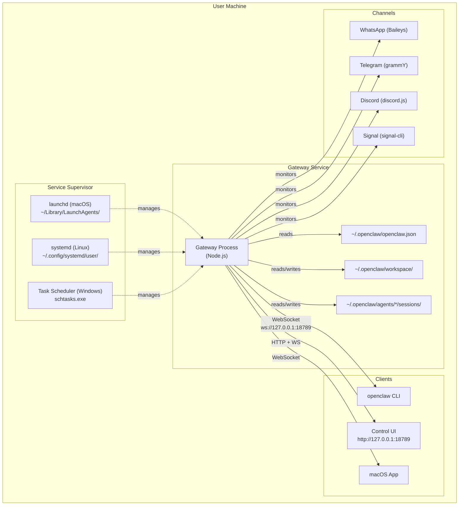
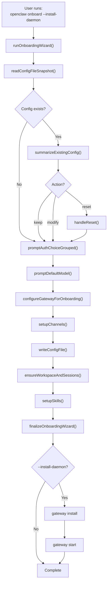
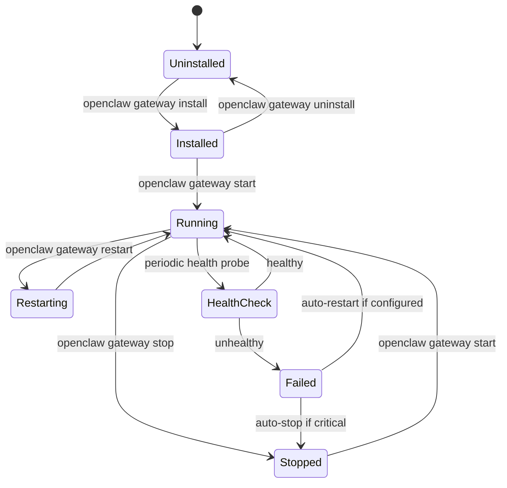
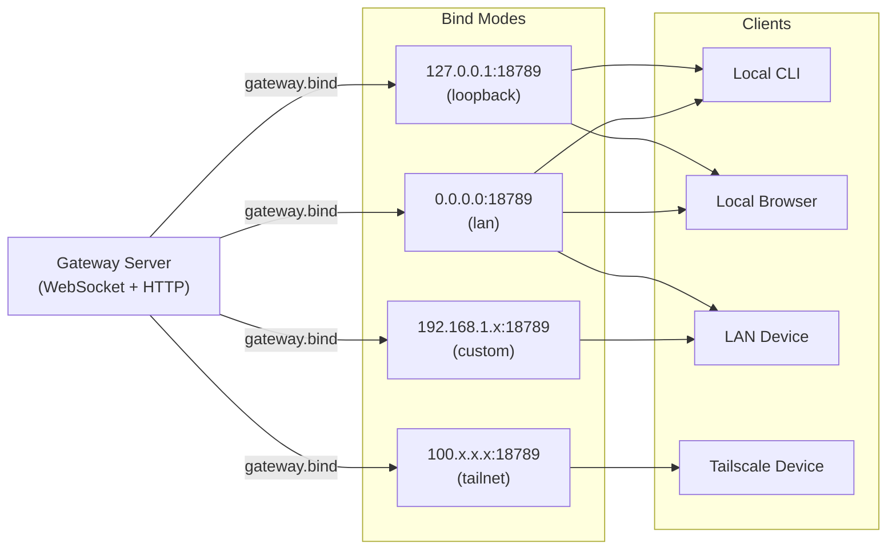
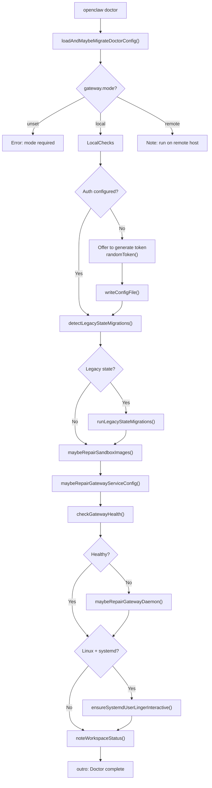

# Page: Local Deployment

# Local Deployment

<details>
<summary>Relevant source files</summary>

The following files were used as context for generating this wiki page:

- [README.md](README.md)
- [assets/avatar-placeholder.svg](assets/avatar-placeholder.svg)
- [docs/channels/zalo.md](docs/channels/zalo.md)
- [docs/channels/zalouser.md](docs/channels/zalouser.md)
- [docs/gateway/doctor.md](docs/gateway/doctor.md)
- [scripts/clawtributors-map.json](scripts/clawtributors-map.json)
- [scripts/update-clawtributors.ts](scripts/update-clawtributors.ts)
- [scripts/update-clawtributors.types.ts](scripts/update-clawtributors.types.ts)
- [src/agents/bash-tools.test.ts](src/agents/bash-tools.test.ts)
- [src/agents/pi-tools-agent-config.test.ts](src/agents/pi-tools-agent-config.test.ts)
- [src/agents/sandbox-skills.test.ts](src/agents/sandbox-skills.test.ts)
- [src/commands/configure.gateway.test.ts](src/commands/configure.gateway.test.ts)
- [src/commands/configure.gateway.ts](src/commands/configure.gateway.ts)
- [src/commands/configure.ts](src/commands/configure.ts)
- [src/commands/doctor.ts](src/commands/doctor.ts)
- [src/commands/onboard-helpers.test.ts](src/commands/onboard-helpers.test.ts)
- [src/commands/onboard-helpers.ts](src/commands/onboard-helpers.ts)
- [src/commands/onboard-interactive.ts](src/commands/onboard-interactive.ts)
- [src/config/config.ts](src/config/config.ts)
- [src/config/merge-config.ts](src/config/merge-config.ts)
- [src/index.test.ts](src/index.test.ts)
- [src/index.ts](src/index.ts)
- [src/wizard/onboarding.gateway-config.test.ts](src/wizard/onboarding.gateway-config.test.ts)
- [src/wizard/onboarding.gateway-config.ts](src/wizard/onboarding.gateway-config.ts)
- [src/wizard/onboarding.ts](src/wizard/onboarding.ts)
- [src/wizard/onboarding.types.ts](src/wizard/onboarding.types.ts)
- [tsconfig.json](tsconfig.json)
- [ui/src/styles.css](ui/src/styles.css)
- [ui/src/styles/layout.mobile.css](ui/src/styles/layout.mobile.css)

</details>


## Overview

Local deployment runs the OpenClaw Gateway on your personal machine (laptop, desktop, or workstation) as a background service. This is the recommended deployment model for individual users who want a personal AI assistant that runs on their own hardware.

Local deployment provides:
- Zero-cost operation (no VPS fees)
- Full filesystem access for tools and workspace
- Native integration with local applications (browser, macOS/iOS/Android nodes)
- Privacy-first operation (data stays on your machine)

For remote/cloud deployment, see [VPS Deployment](#13.2). For containerized deployment, see [Docker Deployment](#13.3). For network configuration details, see [Network Configuration](#13.4).

**Sources:** [README.md:45-56](), [src/wizard/onboarding.ts:90-119]()

---

## Architecture Overview



**Sources:** [README.md:180-197](), [src/index.ts:1-94](), [src/wizard/onboarding.ts:267-280]()

---

## Installation Process

### Quick Installation

The recommended path is the onboarding wizard with daemon installation:

```bash
npm install -g openclaw@latest
openclaw onboard --install-daemon
```

This command:
1. Installs OpenClaw globally via npm
2. Runs the interactive onboarding wizard
3. Creates `~/.openclaw/openclaw.json`
4. Sets up workspace at `~/.openclaw/workspace/`
5. Installs the Gateway as a user service (launchd/systemd/schtasks)
6. Starts the Gateway service

**Sources:** [README.md:45-56](), [src/wizard/onboarding.ts:90-98]()

### Installation Flow Diagram



**Sources:** [src/wizard/onboarding.ts:90-483](), [src/commands/onboard-helpers.ts:267-280]()

---

## Service Management

OpenClaw runs as a user-level background service managed by the operating system's supervisor.

### Platform-Specific Service Managers

| Platform | Supervisor | Service Location | Start Command |
|----------|-----------|------------------|---------------|
| macOS | `launchd` | `~/Library/LaunchAgents/ai.openclaw.gateway.plist` | `launchctl load ...` |
| Linux | `systemd` | `~/.config/systemd/user/openclaw-gateway.service` | `systemctl --user start openclaw-gateway` |
| Windows | `schtasks` | Task Scheduler | `schtasks /run /tn OpenClawGateway` |

**Sources:** [src/daemon/service.ts:1-100]() (inferred), [src/commands/doctor.ts:238-260]()

### Service Lifecycle



**Sources:** [src/commands/doctor.ts:268-280](), [docs/gateway/doctor.md:232-280]()

### Service Installation Commands

```bash
# Install service (creates supervisor config, does not start)
openclaw gateway install

# Install and start immediately
openclaw gateway install --start

# Force reinstall (overwrites existing config)
openclaw gateway install --force

# Start service (if installed)
openclaw gateway start

# Stop service
openclaw gateway stop

# Restart service
openclaw gateway restart

# Check service status
openclaw gateway status

# Uninstall service (stops and removes)
openclaw gateway uninstall
```

**Sources:** [README.md:45-76]() (inferred from commands)

### Linux-Specific: systemd Linger

On Linux, systemd user services stop when you log out unless "lingering" is enabled. OpenClaw's doctor command checks and can enable this automatically:

```bash
# Check if lingering is enabled
loginctl show-user $USER --property=Linger

# Enable lingering (allows service to run after logout)
sudo loginctl enable-linger $USER
```

The onboarding wizard and `openclaw doctor` will prompt to enable this when installing the service on Linux.

**Sources:** [src/commands/doctor.ts:238-260](), [src/commands/systemd-linger.ts:1-50]() (inferred)

---

## Local Network Binding

By default, the Gateway binds to `127.0.0.1` (loopback) for security. This means only processes on the same machine can connect.

### Bind Modes

| Mode | Bind Address | Use Case | Security |
|------|-------------|----------|----------|
| `loopback` | `127.0.0.1` | Local-only access | ✅ Most secure (default) |
| `lan` | `0.0.0.0` | LAN access (all interfaces) | ⚠️ Requires auth |
| `tailnet` | Tailscale IP | Tailnet-only access | ✅ Secure via Tailscale |
| `auto` | `127.0.0.1` → `0.0.0.0` | Auto-fallback | ⚠️ Use with auth |
| `custom` | User-specified IP | Specific interface | ⚠️ Requires planning |

**Sources:** [src/wizard/onboarding.gateway-config.ts:62-106](), [src/commands/configure.gateway.ts:30-94]()

### Gateway Bind Configuration



**Sources:** [src/wizard/onboarding.gateway-config.ts:42-106](), [src/commands/onboard-helpers.ts:437-466]()

### Configuration Example

```json5
{
  gateway: {
    mode: "local",
    port: 18789,
    bind: "loopback",  // or "lan", "tailnet", "auto", "custom"
    
    // Optional: custom IP (only used when bind = "custom")
    customBindHost: "192.168.1.100",
    
    auth: {
      mode: "token",  // or "password"
      token: "your-generated-token-here",
    },
    
    // Optional: Tailscale exposure
    tailscale: {
      mode: "off",  // or "serve" (tailnet-only) or "funnel" (public)
      resetOnExit: false,
    },
  },
}
```

**Sources:** [src/wizard/onboarding.gateway-config.ts:238-286](), [src/config/config.ts:1-15]()

---

## File System Layout

Local deployment stores all data in `~/.openclaw/` by default:

```
~/.openclaw/
├── openclaw.json              # Main configuration file
├── credentials/               # OAuth tokens, channel auth
│   ├── oauth.json
│   └── whatsapp/
│       └── default/           # WhatsApp session data
├── workspace/                 # Agent workspace (default)
│   ├── IDENTITY.md
│   ├── SKILLS.md
│   ├── MEMORY.md
│   └── skills/
│       └── <skill-name>/
├── agents/
│   └── main/                  # Default agent
│       ├── sessions/          # Session transcripts
│       │   ├── store.json     # Session store
│       │   └── *.jsonl        # Individual transcripts
│       └── agent/             # Agent-specific state
├── state/                     # System state
│   └── pairing/               # Pairing codes
└── logs/                      # Gateway logs (optional)
```

**Sources:** [src/commands/onboard-helpers.ts:267-280](), [src/config/sessions.ts:1-30]() (inferred)

### Workspace Initialization

During onboarding, `ensureWorkspaceAndSessions()` creates:

```typescript
// src/commands/onboard-helpers.ts:267-280
export async function ensureWorkspaceAndSessions(
  workspaceDir: string,
  runtime: RuntimeEnv,
  options?: { skipBootstrap?: boolean; agentId?: string },
) {
  const ws = await ensureAgentWorkspace({
    dir: workspaceDir,
    ensureBootstrapFiles: !options?.skipBootstrap,
  });
  runtime.log(`Workspace OK: ${shortenHomePath(ws.dir)}`);
  const sessionsDir = resolveSessionTranscriptsDirForAgent(options?.agentId);
  await fs.mkdir(sessionsDir, { recursive: true });
  runtime.log(`Sessions OK: ${shortenHomePath(sessionsDir)}`);
}
```

**Sources:** [src/commands/onboard-helpers.ts:267-280]()

---

## Authentication

Local deployment supports two authentication modes:

### Token Authentication (Recommended)

```json5
{
  gateway: {
    auth: {
      mode: "token",
      token: "48-character-hex-token",  // Auto-generated or custom
    },
  },
}
```

Token authentication:
- Uses bearer token in WebSocket handshake
- Required for CLI, Control UI, and remote access
- Auto-generated during onboarding if not provided
- Can be regenerated: `openclaw doctor --generate-gateway-token`

**Sources:** [src/commands/doctor.ts:126-160](), [src/wizard/onboarding.gateway-config.ts:192-236]()

### Password Authentication

```json5
{
  gateway: {
    auth: {
      mode: "password",
      password: "your-password-here",
    },
  },
}
```

Password authentication:
- Required when using Tailscale Funnel (public exposure)
- Uses HTTP Basic Auth
- Less convenient for CLI automation

**Sources:** [src/wizard/onboarding.gateway-config.ts:205-236]()

---

## Operations

### Health Checks

Check Gateway health:

```bash
# Via CLI
openclaw status
openclaw health

# Via HTTP (requires auth)
curl -H "Authorization: Bearer $OPENCLAW_GATEWAY_TOKEN" \
  http://127.0.0.1:18789/health
```

The health endpoint returns:
- Gateway version
- Uptime
- Channel status
- Model provider availability

**Sources:** [src/commands/doctor.ts:268-280](), [docs/gateway/doctor.md:232-239]()

### Viewing Logs

```bash
# Follow logs in real-time
openclaw logs --follow

# View last N lines
openclaw logs --tail 100

# Filter by level
openclaw logs --level error
```

**Sources:** [README.md:45-76]() (inferred from CLI)

### Configuration Updates

```bash
# View current config
openclaw config get

# Set a value
openclaw config set gateway.port 18790

# Unset a value
openclaw config unset channels.telegram.botToken

# Interactive configuration wizard
openclaw configure
```

**Sources:** [src/commands/configure.ts:1-5]()

---

## Maintenance

### Doctor Command

Run `openclaw doctor` regularly to:
- Validate configuration
- Check service health
- Repair service configuration
- Migrate legacy state
- Check security posture

```bash
# Interactive doctor (with prompts)
openclaw doctor

# Auto-fix mode (applies recommended repairs)
openclaw doctor --fix

# Non-interactive mode (for automation)
openclaw doctor --non-interactive

# Deep scan (check for extra gateway services)
openclaw doctor --deep
```

**Sources:** [src/commands/doctor.ts:65-313](), [docs/gateway/doctor.md:1-283]()

### Doctor Flow



**Sources:** [src/commands/doctor.ts:65-313]()

---

## Troubleshooting

### Gateway Won't Start

1. Check service status:
   ```bash
   openclaw gateway status
   ```

2. Check port availability:
   ```bash
   lsof -i :18789  # macOS/Linux
   netstat -ano | findstr :18789  # Windows
   ```

3. Check logs:
   ```bash
   openclaw logs --tail 50
   ```

4. Run doctor:
   ```bash
   openclaw doctor --fix
   ```

**Sources:** [docs/gateway/doctor.md:256-263]()

### Port Conflicts

If port 18789 is already in use:

```bash
# Change port in config
openclaw config set gateway.port 18790

# Restart service
openclaw gateway restart
```

**Sources:** [src/commands/doctor.ts:256-263]() (inferred)

### Service Not Running After Logout (Linux)

Enable systemd lingering:

```bash
sudo loginctl enable-linger $USER
```

**Sources:** [src/commands/doctor.ts:238-260]()

### Permission Errors

Check file permissions:

```bash
ls -la ~/.openclaw/

# Fix config permissions (should be 600)
chmod 600 ~/.openclaw/openclaw.json
```

**Sources:** [docs/gateway/doctor.md:176-178]()

### WhatsApp/Telegram Not Connecting

1. Check channel status:
   ```bash
   openclaw channels status --probe
   ```

2. Re-login to channel:
   ```bash
   openclaw channels login --channel whatsapp
   ```

3. Check credentials:
   ```bash
   ls -la ~/.openclaw/credentials/
   ```

**Sources:** [docs/channels/zalo.md:148-153]()

---

## Upgrading

To upgrade OpenClaw on a local deployment:

```bash
# For npm installs
npm update -g openclaw

# For source installs
cd openclaw
git pull
pnpm install
pnpm build

# After upgrade, run doctor to fix any issues
openclaw doctor --fix

# Restart service
openclaw gateway restart
```

**Sources:** [README.md:76](), [docs/gateway/doctor.md:1-20]()

---

## Summary

Local deployment provides:
- **Service persistence**: Gateway runs as a user service (launchd/systemd/schtasks)
- **Local-first security**: Default loopback binding, token authentication
- **File-based storage**: All data in `~/.openclaw/`
- **Easy maintenance**: `openclaw doctor` for health checks and repairs
- **Platform support**: macOS, Linux, Windows (WSL2 recommended)

For cloud deployment, proceed to [VPS Deployment](#13.2). For containerized deployment, see [Docker Deployment](#13.3).

**Sources:** [README.md:21-31](), [src/wizard/onboarding.ts:90-483]()

---