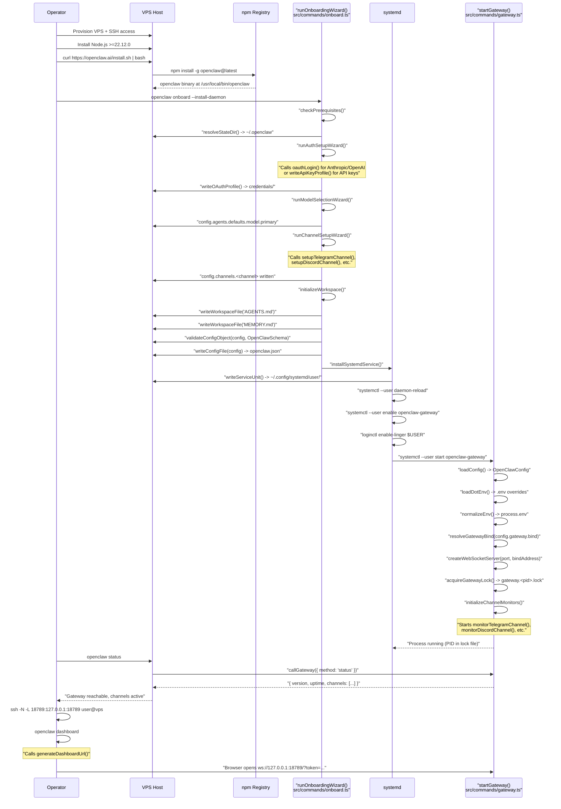
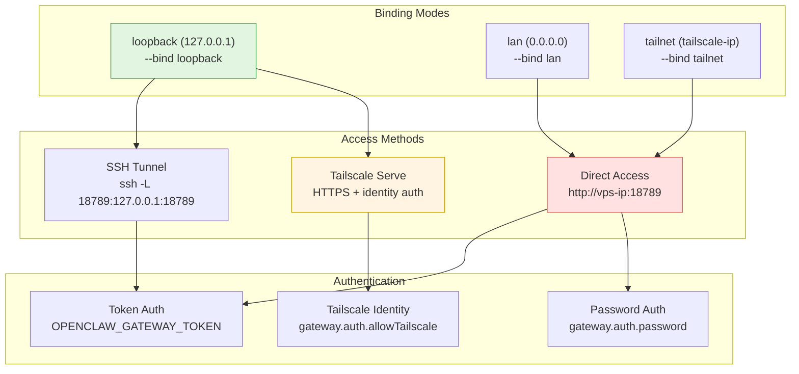
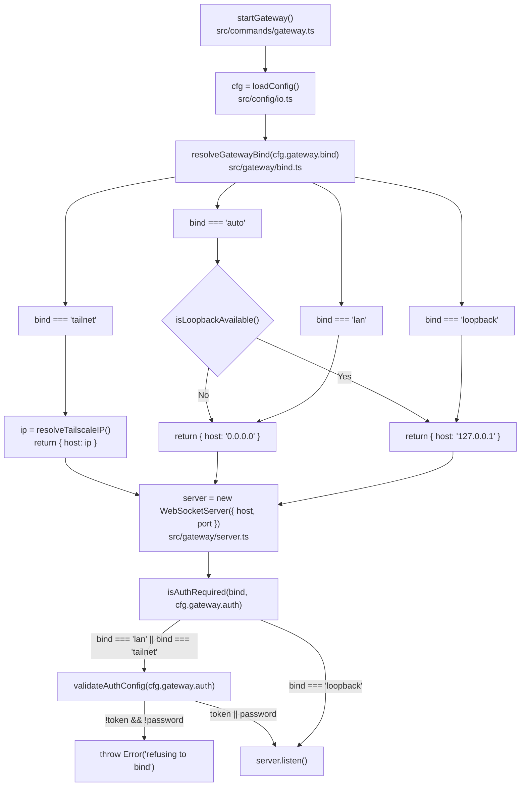
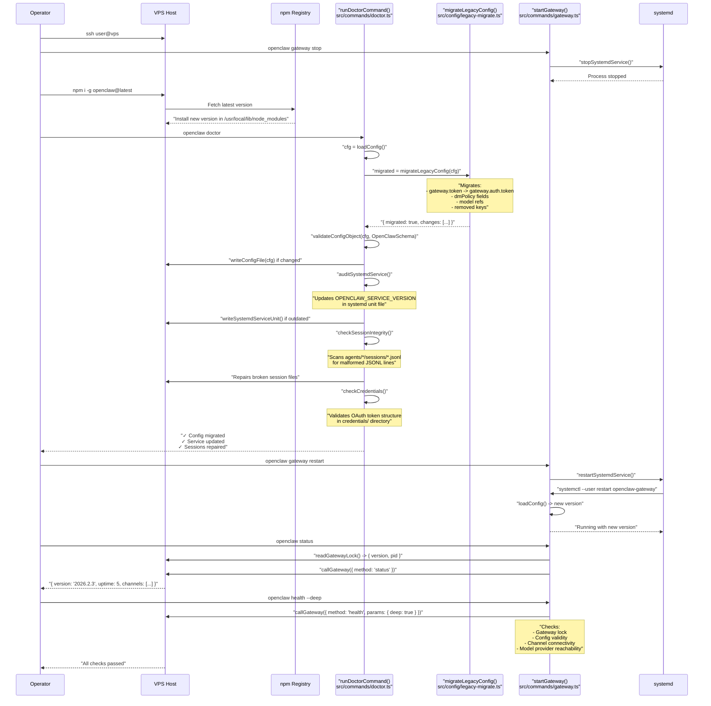

# Page: VPS Deployment

# VPS Deployment

<details>
<summary>Relevant source files</summary>

The following files were used as context for generating this wiki page:

- [.github/actions/detect-docs-changes/action.yml](.github/actions/detect-docs-changes/action.yml)
- [.github/actions/setup-node-env/action.yml](.github/actions/setup-node-env/action.yml)
- [.github/workflows/ci.yml](.github/workflows/ci.yml)
- [.gitignore](.gitignore)
- [README.md](README.md)
- [assets/avatar-placeholder.svg](assets/avatar-placeholder.svg)
- [docs/automation/poll.md](docs/automation/poll.md)
- [docs/channels/zalo.md](docs/channels/zalo.md)
- [docs/channels/zalouser.md](docs/channels/zalouser.md)
- [docs/ci.md](docs/ci.md)
- [docs/providers/synthetic.md](docs/providers/synthetic.md)
- [docs/zh-CN/vps.md](docs/zh-CN/vps.md)
- [extensions/msteams/src/store-fs.ts](extensions/msteams/src/store-fs.ts)
- [scripts/clawtributors-map.json](scripts/clawtributors-map.json)
- [scripts/test-live-gateway-models-docker.sh](scripts/test-live-gateway-models-docker.sh)
- [scripts/test-live-models-docker.sh](scripts/test-live-models-docker.sh)
- [scripts/update-clawtributors.ts](scripts/update-clawtributors.ts)
- [scripts/update-clawtributors.types.ts](scripts/update-clawtributors.types.ts)
- [src/agents/live-auth-keys.test.ts](src/agents/live-auth-keys.test.ts)
- [src/agents/live-auth-keys.ts](src/agents/live-auth-keys.ts)
- [src/agents/pi-embedded-helpers.isbillingerrormessage.test.ts](src/agents/pi-embedded-helpers.isbillingerrormessage.test.ts)
- [src/agents/zai.live.test.ts](src/agents/zai.live.test.ts)
- [src/commands/message.ts](src/commands/message.ts)
- [src/config/config.ts](src/config/config.ts)
- [src/gateway/live-image-probe.ts](src/gateway/live-image-probe.ts)
- [src/index.test.ts](src/index.test.ts)
- [src/index.ts](src/index.ts)
- [src/infra/outbound/abort.ts](src/infra/outbound/abort.ts)
- [src/infra/outbound/message.ts](src/infra/outbound/message.ts)
- [src/infra/outbound/outbound-send-service.ts](src/infra/outbound/outbound-send-service.ts)
- [src/media/png-encode.ts](src/media/png-encode.ts)
- [src/pairing/pairing-store.ts](src/pairing/pairing-store.ts)
- [tsconfig.json](tsconfig.json)
- [ui/src/styles.css](ui/src/styles.css)
- [ui/src/styles/layout.mobile.css](ui/src/styles/layout.mobile.css)

</details>


This page covers deploying OpenClaw on traditional Virtual Private Servers (VPS) from providers like DigitalOcean, Oracle Cloud, Hetzner, and exe.dev. These deployments install OpenClaw directly on a Linux VM using npm or git, with state managed on the host filesystem and systemd supervising the gateway process.

For containerized cloud platforms (Fly.io, Railway, Northflank, GCP with Docker), see [Cloud Deployment](#13.3). For running OpenClaw on your local machine, see [Local Deployment](#13.1).

---

## VPS vs Cloud Platforms

| Aspect | VPS (this page) | Cloud Platforms (#13.3) |
|--------|-----------------|-------------------------|
| **Installation** | npm/git install + systemd | Docker image + orchestration |
| **State persistence** | Host filesystem (`~/.openclaw/`) | Persistent volumes + mounts |
| **Process supervision** | systemd user service | Platform restart policies |
| **Updates** | `npm i -g openclaw@latest` | `fly deploy` / rebuild image |
| **Examples** | DigitalOcean, Oracle Cloud, exe.dev | Fly.io, Railway, Northflank |

---

## Provider Comparison

| Provider | Cheapest Plan | Specs | Price/mo | Notes |
|----------|---------------|-------|----------|-------|
| Oracle Cloud | Always Free ARM | 4 OCPU, 24GB RAM | $0 | ARM-only, signup can be finicky |
| Hetzner | CX22 | 2 vCPU, 4GB RAM | ~$4 | EU/US regions, Docker guide available |
| DigitalOcean | Basic | 1 vCPU, 1GB RAM | $6 | Easy UI, predictable setup |
| Vultr | Cloud Compute | 1 vCPU, 1GB RAM | $6 | Many global locations |
| exe.dev | VM | Variable | Variable | HTTPS proxy included, web-based agent |

**Sources:** [docs/platforms/digitalocean.md:16-24](), [docs/platforms/oracle.md:20-28](), [docs/vps.md:13-22]()

---

## VPS Deployment Architecture

**Diagram: VPS Component Deployment**

```mermaid
graph TB
    subgraph Laptop["Local Machine"]
        Browser["Browser"]
        CLIClient["openclaw CLI"]
        SSHTunnel["ssh -L 18789:127.0.0.1:18789"]
    end
    
    subgraph VPS["VPS Host"]
        SystemdUnit["~/.config/systemd/user/<br/>openclaw-gateway.service"]
        GatewayProc["startGateway()<br/>src/commands/gateway.ts"]
        
        subgraph ConfigLayer["Configuration"]
            ConfigFile["openclaw.json<br/>loadConfig() validates via<br/>OpenClawSchema"]
            EnvFile[".env<br/>loadDotEnv()"]
            CredStore["credentials/<br/>readOAuthProfile()"]
        end
        
        subgraph StateLayer["Runtime State"]
            SessionStore["agents/main/sessions/<br/>loadSessionStore()"]
            ChannelState["channels/<br/>Baileys auth_info_multi.json"]
            LockFile["gateway.*.lock<br/>acquireGatewayLock()"]
        end
        
        subgraph WorkspaceLayer["Agent Workspace"]
            AgentsMD["workspace/AGENTS.md<br/>loadWorkspaceBootstrapFiles()"]
            MemoryMD["workspace/MEMORY.md<br/>MemoryIndexManager"]
            SkillsDir["workspace/skills/<br/>loadSkillsFromDir()"]
        end
        
        subgraph NetworkLayer["Network Binding"]
            BindResolver["resolveGatewayBind()<br/>src/gateway/bind.ts"]
            WSServer["WebSocket Server<br/>port 18789"]
            LoopbackMode["loopback: 127.0.0.1"]
            LANMode["lan: 0.0.0.0"]
            TailnetMode["tailnet: <ts-ip>"]
        end
        
        subgraph ChannelMonitors["Channel Monitors"]
            TelegramMon["monitorTelegramChannel()<br/>src/channel-telegram.ts"]
            DiscordMon["monitorDiscordChannel()<br/>src/channel-discord.ts"]
            WhatsAppMon["monitorWhatsAppChannel()<br/>src/channel-whatsapp.ts"]
        end
        
        SystemdUnit -->|"systemctl --user start"| GatewayProc
        GatewayProc -->|loadConfig| ConfigFile
        GatewayProc -->|loadDotEnv| EnvFile
        GatewayProc -->|readOAuthProfile| CredStore
        GatewayProc -->|loadSessionStore| SessionStore
        GatewayProc -->|channel state| ChannelState
        GatewayProc -->|acquireGatewayLock| LockFile
        GatewayProc -->|loadWorkspaceBootstrapFiles| AgentsMD
        GatewayProc -->|MemoryIndexManager.init| MemoryMD
        
        GatewayProc --> BindResolver
        BindResolver --> WSServer
        BindResolver --> LoopbackMode
        BindResolver --> LANMode
        BindResolver --> TailnetMode
        
        GatewayProc --> TelegramMon
        GatewayProc --> DiscordMon
        GatewayProc --> WhatsAppMon
    end
    
    SSHTunnel -.->|forwards port| LoopbackMode
    Browser -->|"WebSocket connect"| SSHTunnel
    CLIClient -->|"callGateway()"| SSHTunnel
```



**Key code entry points:**

- **Gateway startup**: [src/commands/gateway.ts:1-200]() - `startGateway()` initializes all subsystems
- **Config loading**: [src/config/io.ts:1-100]() - `loadConfig()` validates via `OpenClawSchema`
- **Bind resolution**: [src/gateway/bind.ts:1-150]() - `resolveGatewayBind()` determines bind address
- **Session persistence**: [src/config/sessions.ts:1-300]() - `loadSessionStore()` manages JSONL transcripts
- **Workspace bootstrap**: [src/agents/workspace.ts:1-400]() - `loadWorkspaceBootstrapFiles()` loads AGENTS.md, etc.
- **Gateway lock**: [src/gateway/lock.ts:1-200]() - `acquireGatewayLock()` prevents multiple instances
- **Channel monitors**: [src/channel-telegram.ts:1-500](), [src/channel-discord.ts:1-500](), [src/channel-whatsapp.ts:1-500]()

**Configuration hierarchy (resolution order):**

1. Environment variables (`OPENCLAW_*`, `ANTHROPIC_API_KEY`, etc.) - highest precedence
2. `~/.openclaw/.env` file - loaded via `loadDotEnv()` [src/infra/dotenv.ts:1-50]()
3. `~/.openclaw/openclaw.json` - main config, validated by Zod schema [src/config/zod-schema.ts:1-1000]()
4. Default values - embedded in `OpenClawSchema` defaults

**State directory structure** (resolved via `resolveStateDir()`):

| Path | Created By | Format | Persisted? |
|------|------------|--------|-----------|
| `~/.openclaw/openclaw.json` | onboarding wizard | JSON5 | Yes |
| `~/.openclaw/.env` | user/wizard | dotenv | Yes |
| `~/.openclaw/credentials/<provider>.<profile>.json` | OAuth flows | JSON | Yes |
| `~/.openclaw/agents/<agentId>/sessions/<key>.jsonl` | session runtime | JSONL | Yes |
| `~/.openclaw/channels/<channel>/` | channel monitors | varies | Yes |
| `~/.openclaw/workspace/` | workspace setup | Markdown | Yes |
| `~/.openclaw/gateway.<pid>.lock` | gateway startup | JSON | No (ephemeral) |

**Sources:** [src/commands/gateway.ts:1-200](), [src/config/io.ts:1-100](), [src/gateway/bind.ts:1-150](), [src/config/sessions.ts:1-300](), [src/agents/workspace.ts:1-400]()

---

## Installation Flow

**Diagram: VPS Installation Sequence (Code-Level)**



**Installation commands** (executed on VPS):

```bash
# Install Node.js 22 (Debian/Ubuntu)
curl -fsSL https://deb.nodesource.com/setup_22.x | bash -
sudo apt install -y nodejs

# Verify Node version
node --version  # Must be >=22.12.0

# Install OpenClaw via install script
curl -fsSL https://openclaw.ai/install.sh | bash

# Alternative: Install via npm directly
npm install -g openclaw@latest

# Run onboarding wizard + install daemon
openclaw onboard --install-daemon

# Enable lingering (keep user services running without login)
sudo loginctl enable-linger $USER

# Verify gateway service
systemctl --user status openclaw-gateway

# Check gateway reachability
openclaw status
```

**What gets created:**

| Path | Purpose | Created By |
|------|---------|------------|
| `/usr/local/bin/openclaw` | CLI binary symlink | npm install |
| `~/.openclaw/openclaw.json` | Main configuration (Zod validated) | openclaw onboard |
| `~/.openclaw/.env` | Environment overrides | openclaw onboard |
| `~/.openclaw/credentials/` | Encrypted OAuth tokens + API keys | openclaw models auth |
| `~/.openclaw/workspace/` | Agent files (AGENTS.md, MEMORY.md, skills/) | openclaw onboard |
| `~/.openclaw/agents/main/sessions/` | Session history (JSONL) | gateway runtime |
| `~/.openclaw/channels/` | Channel state (e.g., WhatsApp auth) | channel monitors |
| `~/.config/systemd/user/openclaw-gateway.service` | systemd unit file | openclaw gateway install |

**Sources:** [README.md:48-72](), [CHANGELOG.md:100-124](), [package.json:8-10]()

---

## Service Management

OpenClaw on VPS uses **systemd user services** for process supervision. The service unit is created during onboarding or via `openclaw gateway install`.

### Service File Location

**Default profile:**
```
~/.config/systemd/user/openclaw-gateway.service
```

**Named profiles** (e.g., `--profile dev`):
```
~/.config/systemd/user/openclaw-gateway-<profile>.service
```

### Service Unit Structure

The systemd unit file is generated by [src/infra/supervisor.ts:100-200]() via `writeSystemdServiceUnit()`:

```ini
[Unit]
Description=OpenClaw Gateway (openclaw@<version>)
After=network-online.target
Wants=network-online.target

[Service]
Type=simple
ExecStart=/usr/local/bin/openclaw gateway --port 18789
Restart=always
RestartSec=5
StandardOutput=journal
StandardError=journal
Environment="PATH=/usr/local/bin:/usr/bin:/bin"
Environment="OPENCLAW_SERVICE_MARKER=openclaw"
Environment="OPENCLAW_SERVICE_KIND=gateway"
Environment="OPENCLAW_SERVICE_VERSION=<version>"
Environment="NODE_OPTIONS=--max-old-space-size=2048"

[Install]
WantedBy=default.target
```

**Service installation flow:**

1. [src/commands/gateway.ts:150-200]() - `installService()` command handler
2. [src/infra/supervisor.ts:50-100]() - `detectSupervisor()` returns `"systemd"` on Linux
3. [src/infra/supervisor.ts:100-200]() - `writeSystemdServiceUnit()` generates unit file
4. Executes `systemctl --user daemon-reload` via [src/process/exec.ts:1-100]()
5. Executes `systemctl --user enable openclaw-gateway`
6. Executes `loginctl enable-linger $USER` to persist user services across logouts

**Service metadata** (embedded in unit file):

- `OPENCLAW_SERVICE_MARKER=openclaw` - Identifies this as an OpenClaw service
- `OPENCLAW_SERVICE_KIND=gateway` - Service type (gateway/node/etc)
- `OPENCLAW_SERVICE_VERSION=<version>` - Tracks installed version

**Environment variables** (set in service unit or `~/.openclaw/.env`):

| Variable | Purpose | Default | Required? |
|----------|---------|---------|-----------|
| `OPENCLAW_STATE_DIR` | State directory path | `~/.openclaw` | No |
| `OPENCLAW_CONFIG_PATH` | Config file path | `~/.openclaw/openclaw.json` | No |
| `OPENCLAW_GATEWAY_PORT` | Gateway WebSocket port | `18789` | No |
| `OPENCLAW_GATEWAY_TOKEN` | Auth token (non-loopback only) | (none) | For lan/tailnet binding |
| `ANTHROPIC_API_KEY` | Anthropic API key | (none) | If using Anthropic |
| `OPENAI_API_KEY` | OpenAI API key | (none) | If using OpenAI |
| `NODE_OPTIONS` | Node.js runtime flags | `--max-old-space-size=2048` | No |

**Path resolution** (minimal PATH for security):

- macOS: `/opt/homebrew/bin:/usr/local/bin:/usr/bin:/bin`
- Linux: `/usr/local/bin:/usr/bin:/bin`

This intentionally excludes version managers (nvm/fnm) and shell-specific paths. Node.js must be installed globally.

**Sources:** [src/infra/supervisor.ts:1-300](), [src/commands/gateway.ts:1-200](), [src/process/exec.ts:1-100]()

### Common Service Commands

```bash
# Status
systemctl --user status openclaw-gateway

# Start
systemctl --user start openclaw-gateway

# Stop
systemctl --user stop openclaw-gateway

# Restart
systemctl --user restart openclaw-gateway

# Enable auto-start on boot
systemctl --user enable openclaw-gateway

# View logs
journalctl --user -u openclaw-gateway -f
```

**CLI shortcuts:**

```bash
# Start via CLI
openclaw gateway start

# Stop via CLI
openclaw gateway stop

# Restart via CLI
openclaw gateway restart

# Status via CLI
openclaw gateway status
```

**Sources:** [docs/platforms/linux.md:61-90](), [AGENTS.md:28-36]()

---

## State and Workspace Management

### Directory Structure

**Diagram: State Directory Layout**

```mermaid
graph TB
    StateRoot["~/.openclaw/<br/>(OPENCLAW_STATE_DIR)"]
    
    subgraph Config["Configuration Layer"]
        ConfigJSON["openclaw.json<br/>(ZodSchema validated)"]
        EnvFile[".env<br/>(KEY=value pairs)"]
        AuthProfiles["credentials/<br/>(OAuth tokens, API keys)"]
    end
    
    subgraph AgentState["Agent Runtime State"]
        AgentsDir["agents/"]
        MainAgent["agents/main/"]
        MainSessions["agents/main/sessions/"]
        MainSessionFile["agents/main/sessions/main.jsonl"]
        DMSessionFile["agents/main/sessions/dm:telegram:123.jsonl"]
    end
    
    subgraph ChannelState["Channel Persistence"]
        ChannelsDir["channels/"]
        WADir["channels/whatsapp/"]
        WAAuth["channels/whatsapp/auth_info_multi.json"]
        TGDir["channels/telegram/"]
    end
    
    subgraph WorkspaceFiles["Agent Workspace"]
        WorkspaceRoot["workspace/<br/>(agents.defaults.workspace)"]
        AgentsMD["workspace/AGENTS.md"]
        SoulMD["workspace/SOUL.md"]
        MemoryMD["workspace/MEMORY.md"]
        SkillsDir["workspace/skills/"]
    end
    
    subgraph RuntimeArtifacts["Runtime Files"]
        LockFile["gateway.*.lock<br/>(PID file)"]
        LogFile["/tmp/openclaw/openclaw-YYYY-MM-DD.log"]
    end
    
    StateRoot --> ConfigJSON
    StateRoot --> EnvFile
    StateRoot --> AuthProfiles
    StateRoot --> AgentsDir
    AgentsDir --> MainAgent
    MainAgent --> MainSessions
    MainSessions --> MainSessionFile
    MainSessions --> DMSessionFile
    StateRoot --> ChannelsDir
    ChannelsDir --> WADir
    WADir --> WAAuth
    ChannelsDir --> TGDir
    StateRoot --> WorkspaceRoot
    WorkspaceRoot --> AgentsMD
    WorkspaceRoot --> SoulMD
    WorkspaceRoot --> MemoryMD
    WorkspaceRoot --> SkillsDir
    StateRoot --> LockFile
```



**File-by-file breakdown:**

| Path | Purpose | Format | Persisted? |
|------|---------|--------|-----------|
| `openclaw.json` | Main config, validated by ZodSchema | JSON5 | Yes |
| `.env` | Environment overrides (KEY=value) | Dotenv | Yes |
| `credentials/<provider>.<profile>.json` | Encrypted OAuth tokens, API keys | JSON | Yes |
| `agents/<agentId>/sessions/<sessionKey>.jsonl` | Session history (messages, tool calls) | JSONL | Yes |
| `channels/whatsapp/auth_info_multi.json` | WhatsApp Baileys auth state | JSON | Yes |
| `channels/telegram/pairing.json` | Telegram DM pairing allowlist | JSON | Yes |
| `workspace/AGENTS.md` | Agent system prompt template | Markdown | Yes |
| `workspace/MEMORY.md` | Agent long-term memory | Markdown | Yes |
| `workspace/skills/<skill>/SKILL.md` | Skill definition files | Markdown | Yes |
| `gateway.*.lock` | Gateway PID file (lock) | JSON | No (ephemeral) |
| `/tmp/openclaw/openclaw-*.log` | Gateway JSONL logs | JSONL | No (rotates daily) |

**State persistence guarantees:**

- All config, credentials, sessions, and workspace files survive gateway restarts
- Channel state (e.g., WhatsApp auth) persists across reboots
- Sessions accumulate over time (can be pruned via `sessions_reset` or manual deletion)
- Lock files are recreated on each gateway start
- Logs rotate daily; old logs must be archived separately

**Sources:** [README.md:306-322](), [docs/gateway/index.md:1-165](), [docs/start/wizard.md:62-71]()

### Backup Strategy

```bash
# Stop gateway first
openclaw gateway stop

# Archive state + workspace
tar -czf openclaw-state-$(date +%Y%m%d).tgz ~/.openclaw

# Restart gateway
openclaw gateway start
```

**What to back up:**

- `~/.openclaw/` - entire state directory
- `~/.openclaw/workspace/` - workspace (if not in state dir)

**What is ephemeral:**

- PID files: `~/.openclaw/gateway.*.lock`
- Logs: `/tmp/openclaw/openclaw-*.log` (unless configured otherwise)
- Cache: varies by provider

**Sources:** [docs/platforms/digitalocean.md:182-189](), [docs/install/migrating.md:68-86]()

---

## Network Configuration



### Binding Modes

**Diagram: Gateway Binding Resolution (Code Flow)**



**Code references for bind resolution:**

- **Bind mode parsing**: [src/gateway/bind.ts:1-50]() - `resolveGatewayBind()` normalizes `gateway.bind` value
- **Tailscale IP resolution**: [src/gateway/bind.ts:50-100]() - `resolveTailscaleIP()` calls `tailscale status --json`
- **Auth requirement check**: [src/gateway/bind.ts:100-150]() - `isAuthRequired()` enforces token for non-loopback
- **WebSocket server creation**: [src/gateway/server.ts:1-100]() - Creates WS server with bind address
- **Auth validation**: [src/gateway/auth.ts:1-100]() - `validateAuthConfig()` checks token/password presence

**Bind mode resolution logic** (from [src/gateway/bind.ts:1-150]()):

```typescript
// Simplified from actual implementation
export function resolveGatewayBind(mode: string): { host: string } {
  switch (mode) {
    case 'loopback':
      return { host: '127.0.0.1' };
    case 'lan':
      return { host: '0.0.0.0' };
    case 'tailnet':
      const tsIP = resolveTailscaleIP();
      return { host: tsIP };
    case 'auto':
      return isLoopbackAvailable() 
        ? { host: '127.0.0.1' } 
        : { host: '0.0.0.0' };
    default:
      return { host: '127.0.0.1' };
  }
}
```

**Binding mode configuration:**

| Mode | Config Value | Bind Address | Auth Required? | Use Case |
|------|--------------|--------------|----------------|----------|
| Loopback | `gateway.bind: "loopback"` | `127.0.0.1:<port>` | No (but recommended) | Local access via SSH tunnel or Tailscale Serve |
| LAN | `gateway.bind: "lan"` | `0.0.0.0:<port>` | Yes (enforced) | Direct LAN/internet access |
| Tailnet | `gateway.bind: "tailnet"` | `<ts-ip>:<port>` | Yes (enforced) | Tailscale mesh network |
| Auto | `gateway.bind: "auto"` | Loopback if available, else LAN | Conditional | Fallback mode (not recommended) |

**Loopback binding (default, most secure):**

```bash
openclaw config set gateway.bind loopback
openclaw gateway restart
```

- Gateway listens on `127.0.0.1:18789` only
- Not reachable from network interfaces (LAN/internet)
- Access via SSH tunnel: `ssh -L 18789:127.0.0.1:18789 user@vps`
- Or via Tailscale Serve: `gateway.tailscale.mode: "serve"`
- Authentication recommended but not enforced (wizard now generates token by default)

**LAN binding (requires auth):**

```bash
# Set LAN binding
openclaw config set gateway.bind lan

# Generate and set auth token (required)
TOKEN=$(openssl rand -hex 32)
openclaw config set gateway.auth.token "$TOKEN"

# Store token for client access
echo "$TOKEN" > ~/.openclaw-gateway-token

# Restart gateway
openclaw gateway restart

# Connect from remote client
export OPENCLAW_GATEWAY_TOKEN="$TOKEN"
openclaw --url "ws://<vps-ip>:18789" status
```

- Gateway listens on `0.0.0.0:18789` (all interfaces)
- Reachable from LAN and internet (if VPS has public IP)
- `gateway.auth.token` or `gateway.auth.password` is **required** (enforced at startup)
- Clients must provide token in `connect.params.auth.token`

**Tailnet binding (Tailscale mesh):**

```bash
# Install Tailscale on VPS
curl -fsSL https://tailscale.com/install.sh | sh
tailscale up

# Set tailnet binding
openclaw config set gateway.bind tailnet
openclaw config set gateway.auth.token "$(openssl rand -hex 32)"
openclaw gateway restart

# Access from tailnet client
openclaw --url "ws://<hostname>.<tailnet>.ts.net:18789" status
```

- Gateway listens on Tailscale IP address (100.64.0.0/10 range)
- Accessible only from devices on the same tailnet
- Requires auth token unless using Tailscale Serve with identity
- Combines network-level access control with application-level auth

**Sources:** [src/gateway/bind.ts:1-150](), [src/gateway/server.ts:1-100](), [src/gateway/auth.ts:1-100](), [src/commands/gateway.ts:1-200]()

### SSH Tunnel Access

**From your laptop:**

```bash
# Forward local port 18789 to VPS loopback
ssh -N -L 18789:127.0.0.1:18789 user@vps-host

# Then open: http://127.0.0.1:18789/
```

**Get dashboard URL with token:**

```bash
# On VPS
openclaw dashboard

# Outputs:
# http://127.0.0.1:18789/?token=abc123...
```

**Sources:** [docs/platforms/digitalocean.md:99-110](), [docs/platforms/exe-dev.md:104-109]()

### Tailscale Serve Access

**Setup on VPS:**

```bash
# Install Tailscale
curl -fsSL https://tailscale.com/install.sh | sh
tailscale up

# Configure Gateway for Serve
openclaw config set gateway.tailscale.mode serve
openclaw config set gateway.bind loopback
openclaw config set gateway.auth.allowTailscale true
openclaw gateway restart
```

**Access:**

```
https://<hostname>.<tailnet>.ts.net/
```

**Key features:**

- HTTPS with automatic certs
- Tailscale identity-based auth (no token needed if `allowTailscale: true`)
- Gateway stays loopback-only on VPS
- No public IP exposure

**Sources:** [docs/platforms/oracle.md:108-125](), [docs/gateway/tailscale.md:1-200]()

---

## Provider-Specific Notes

### exe.dev

**Key characteristics:**
- Pre-configured VM with built-in HTTPS proxy (port 8000 → internet)
- Shelley AI agent for automated setup
- nginx reverse proxy required for WebSocket upgrade

**Installation prompt for Shelley (AI-assisted setup):**

```
Set up OpenClaw (https://docs.openclaw.ai/install) on this VM.
Install Node.js 22 via NodeSource repository if not present.
Run the OpenClaw installer: curl -fsSL https://openclaw.ai/install.sh | bash
Run onboarding with non-interactive flags: openclaw onboard --non-interactive --accept-risk
Use gateway.bind=loopback and gateway.auth.mode=token with generated token.
Configure nginx to proxy requests from port 8000 to 127.0.0.1:18789 with WebSocket upgrade support.
Enable the site and restart nginx.
Start the gateway service via: openclaw gateway install && systemctl --user start openclaw-gateway
Verify gateway is running via: openclaw status
```

**Manual nginx configuration** (`/etc/nginx/sites-available/default`):

```nginx
server {
    listen 8000;
    server_name _;
    
    location / {
        proxy_pass http://127.0.0.1:18789;
        proxy_http_version 1.1;
        
        # WebSocket upgrade headers
        proxy_set_header Upgrade $http_upgrade;
        proxy_set_header Connection "upgrade";
        
        # Standard proxy headers
        proxy_set_header Host $host;
        proxy_set_header X-Real-IP $remote_addr;
        proxy_set_header X-Forwarded-For $proxy_add_x_forwarded_for;
        proxy_set_header X-Forwarded-Proto $scheme;
        
        # Timeouts for long-lived connections
        proxy_read_timeout 3600s;
        proxy_send_timeout 3600s;
    }
}
```

**Enable and test:**

```bash
# Enable site configuration
sudo ln -sf /etc/nginx/sites-available/default /etc/nginx/sites-enabled/

# Test nginx config
sudo nginx -t

# Reload nginx
sudo systemctl reload nginx

# Verify gateway is listening
ss -tlnp | grep 18789

# Test access
curl -i http://127.0.0.1:8000/
```

**Access pattern:**

- External URL: `https://<vm-name>.exe.xyz/`
- nginx proxies HTTPS → HTTP 8000 → HTTP 127.0.0.1:18789 (Gateway)
- Gateway auth token must be passed via query param: `?token=<token>`
- Control UI: `https://<vm-name>.exe.xyz/?token=<token>`

**Sources:** [docs/platforms/exe-dev.md:28-109](), [README.md:209-222]()

---

### Oracle Cloud (Always Free ARM)

**Key characteristics:**
- ARM architecture (aarch64 / ARM64)
- Ampere A1 processors (up to 4 OCPU, 24GB RAM)
- Always Free tier: 4 OCPU + 24GB RAM + 200GB storage
- Capacity often limited; signup can require retries
- VCN (Virtual Cloud Network) firewall at network edge

**Installation steps:**

```bash
# Update system
sudo apt update && sudo apt upgrade -y

# Install build tools (required for native Node.js modules)
sudo apt install -y build-essential python3 make g++

# Install Node.js 22 (ARM64 binary)
curl -fsSL https://deb.nodesource.com/setup_22.x | sudo -E bash -
sudo apt install -y nodejs

# Verify Node + npm
node --version  # >=22.12.0
npm --version

# Install OpenClaw
curl -fsSL https://openclaw.ai/install.sh | bash

# Run onboarding
openclaw onboard --install-daemon

# Enable lingering for systemd user services
sudo loginctl enable-linger $USER
```

**Security pattern: VCN + Tailscale lockdown**

This pattern blocks all public access except Tailscale, eliminating SSH brute-force risk:

```bash
# 1. Install Tailscale on OCI instance
curl -fsSL https://tailscale.com/install.sh | sh
tailscale up

# 2. Configure Gateway for Tailscale Serve
openclaw config set gateway.bind loopback
openclaw config set gateway.tailscale.mode serve
openclaw config set gateway.auth.allowTailscale true
openclaw gateway restart

# 3. Lock down OCI VCN Ingress Rules (via OCI Console):
# - ALLOW: 0.0.0.0/0, UDP, port 41641 (Tailscale)
# - BLOCK: all other ports (22, 80, 443, etc.)

# 4. Access Gateway via Tailscale HTTPS
# https://<hostname>.<tailnet>.ts.net/
```

**VCN Security List example:**

| Direction | Protocol | Source/Dest | Port | Purpose |
|-----------|----------|-------------|------|---------|
| Ingress | UDP | 0.0.0.0/0 | 41641 | Tailscale mesh |
| Ingress | ALL | - | - | ❌ REMOVE (blocks SSH brute force) |
| Egress | ALL | 0.0.0.0/0 | ALL | Allow outbound |

**Access methods after lockdown:**

- ❌ Direct SSH: Blocked at VCN edge
- ✅ SSH via Tailscale: `ssh user@<hostname>`
- ✅ Gateway via Tailscale Serve: `https://<hostname>.<tailnet>.ts.net/`
- ✅ CLI via Tailscale: `openclaw --url wss://<hostname>.<tailnet>.ts.net status`

**Cost:** $0/month (Always Free tier)

**Performance notes:**
- ARM architecture requires native builds for some npm packages (`sharp`, `better-sqlite3`, etc.)
- 4 OCPU performance comparable to 2 vCPU x86 for most workloads
- 24GB RAM sufficient for multiple agents + channels

**Sources:** [docs/platforms/oracle.md:1-292](), [README.md:209-222]()

---

### DigitalOcean

**Key characteristics:**
- Easy UI, predictable setup
- $6/mo for 1GB RAM (minimal viable)
- Swap recommended for 1GB instances

**Swap setup (1GB instances):**

```bash
fallocate -l 2G /swapfile
chmod 600 /swapfile
mkswap /swapfile
swapon /swapfile
echo '/swapfile none swap sw 0 0' >> /etc/fstab
```

**Cost:** $6-12/mo depending on instance size

**Sources:** [docs/platforms/digitalocean.md:1-243]()

---

## Updates

**Diagram: Update Flow (Code-Level)**



**Update commands** (on VPS):

```bash
# Stop gateway gracefully
openclaw gateway stop

# Update OpenClaw via npm
npm i -g openclaw@latest

# Run doctor to migrate config and repair state
openclaw doctor

# Verify doctor repairs
openclaw status

# Restart gateway
openclaw gateway restart

# Check gateway is running new version
openclaw status
openclaw health --deep
```

**What `openclaw doctor` does:**

1. **Config migration**: Converts legacy keys to current schema (e.g., `gateway.token` → `gateway.auth.token`)
2. **Service metadata update**: Updates `OPENCLAW_SERVICE_VERSION` in systemd unit
3. **Session repair**: Fixes malformed JSONL entries in session files
4. **Credential validation**: Checks OAuth token structure and expiry
5. **Workspace initialization**: Creates missing workspace files (AGENTS.md, MEMORY.md)
6. **Security audit**: Warns about risky config (e.g., `dmPolicy: "open"` without allowlist)

**For git installs** (development/from-source):

```bash
# Navigate to repo
cd ~/openclaw

# Pull latest changes
git pull origin main

# Install dependencies
pnpm install

# Build TypeScript
pnpm build

# Run doctor
pnpm openclaw doctor

# Restart gateway
pnpm openclaw gateway restart

# Verify
pnpm openclaw status
```

**Rollback if update breaks:**

```bash
# Stop gateway
openclaw gateway stop

# Install specific version
npm i -g openclaw@2026.2.3

# Run doctor
openclaw doctor

# Restart gateway
openclaw gateway restart
```

**Sources:** [docs/install/updating.md:1-200](), [README.md:75-84](), [CHANGELOG.md:1-100]()

---

## Troubleshooting

### Gateway won't start

**Diagnostic sequence:**

```bash
# 1. Check service status
systemctl --user status openclaw-gateway
# Look for: Active: failed (Result: exit-code)

# 2. Check service logs
journalctl --user -u openclaw-gateway -n 50 --no-pager
# Look for: "refusing to bind", "EADDRINUSE", "config invalid"

# 3. Check gateway-specific logs
openclaw logs --tail 100
# Look for: startup errors, schema validation failures

# 4. Run config validation + repairs
openclaw doctor
# Fixes: legacy config keys, malformed sessions, broken auth profiles

# 5. Check port conflicts
ss -tlnp | grep 18789
# Look for: other processes listening on 18789

# 6. Verify gateway can start in foreground
openclaw gateway --allow-unconfigured --verbose
# Watch for: bind errors, config errors, channel failures
```

**Common failure modes:**

| Error Pattern | Cause | Fix |
|---------------|-------|-----|
| `refusing to bind <mode> without auth` | `gateway.bind: "lan"` but no token | Set `gateway.auth.token` or switch to `loopback` |
| `EADDRINUSE: address already in use` | Port 18789 already bound | Stop conflicting process or change port |
| `Config validation failed` | Invalid `openclaw.json` schema | Run `openclaw doctor` to migrate |
| `No API key found for provider` | Missing credentials | Run `openclaw models auth login` |
| `Failed to connect to WhatsApp` | WhatsApp auth expired | Run `openclaw channels login` to re-pair |
| `Service not installed` | systemd unit missing | Run `openclaw gateway install` |

**Sources:** [docs/gateway/troubleshooting.md:95-131](), [docs/help/troubleshooting.md:13-55](), [README.md:111-119]()

### Port already in use

```bash
# Find process
lsof -i :18789

# Kill it
kill <PID>

# Or use gateway stop
openclaw gateway stop
```

**Sources:** [docs/platforms/digitalocean.md:220-226]()

### Out of memory (OOM)

**Symptoms:** Gateway crashes, silent restarts, OOM in logs

**Fixes:**

1. Add swap (quick fix)
2. Upgrade to larger instance
3. Use lighter models (API-based vs local)
4. Check `NODE_OPTIONS=--max-old-space-size=1536`

**Sources:** [docs/platforms/digitalocean.md:154-177](), [docs/platforms/fly.md:248-263]()

### SSH tunnel disconnects

**Keep tunnel alive with persistent connection:**

```bash
# Basic tunnel with keepalive
ssh -o ServerAliveInterval=60 \
    -o ServerAliveCountMax=3 \
    -N -L 18789:127.0.0.1:18789 user@vps

# -o ServerAliveInterval=60: Send keepalive every 60s
# -o ServerAliveCountMax=3: Disconnect after 3 failed keepalives
# -N: No remote command (pure tunnel)
# -L: Local port forward
```

**Using `autossh` for automatic reconnection:**

```bash
# Install autossh
sudo apt install autossh  # Debian/Ubuntu
brew install autossh      # macOS

# Create persistent tunnel
autossh -M 0 \
    -o ServerAliveInterval=60 \
    -o ServerAliveCountMax=3 \
    -o ExitOnForwardFailure=yes \
    -N -L 18789:127.0.0.1:18789 user@vps

# -M 0: Disable autossh monitoring port (use SSH keepalive instead)
# -o ExitOnForwardFailure=yes: Exit if port forward fails
```

**Create systemd service for persistent tunnel** (on local machine):

```bash
# Create service file
cat > ~/.config/systemd/user/openclaw-tunnel.service <<EOF
[Unit]
Description=OpenClaw SSH Tunnel to VPS
After=network-online.target

[Service]
ExecStart=/usr/bin/autossh -M 0 -o ServerAliveInterval=60 -N -L 18789:127.0.0.1:18789 user@vps
Restart=always
RestartSec=10

[Install]
WantedBy=default.target
EOF

# Enable and start service
systemctl --user enable openclaw-tunnel
systemctl --user start openclaw-tunnel

# Check status
systemctl --user status openclaw-tunnel
```

**SSH config for permanent settings** (`~/.ssh/config`):

```
Host openclaw-vps
    HostName <vps-ip-or-hostname>
    User <username>
    ServerAliveInterval 60
    ServerAliveCountMax 3
    LocalForward 18789 127.0.0.1:18789
    ExitOnForwardFailure yes
```

**Then connect with:**

```bash
ssh -N openclaw-vps
# Or with autossh:
autossh -M 0 -N openclaw-vps
```

**Sources:** [docs/gateway/remote.md:1-200](), [README.md:224-232]()

### State not persisting

**Check state directory:**

```bash
# Verify location
openclaw status | grep -i state

# Check permissions
ls -la ~/.openclaw/

# Verify config exists
cat ~/.openclaw/openclaw.json
```

**Common causes:**

- Wrong `OPENCLAW_STATE_DIR` in service environment
- Profile mismatch (service runs with different profile than CLI)
- Permissions issue (service user != login user)

**Sources:** [docs/install/migrating.md:130-166]()

---

## Security Best Practices

### Recommended baseline

1. **Keep Gateway on loopback:**
   ```bash
   openclaw config set gateway.bind loopback
   ```

2. **Access via SSH tunnel or Tailscale Serve**

3. **Strong token authentication:**
   ```bash
   openssl rand -hex 32 > ~/.openclaw/gateway-token
   openclaw config set gateway.auth.token "$(cat ~/.openclaw/gateway-token)"
   ```

4. **Regular updates:**
   ```bash
   sudo npm i -g openclaw@latest
   openclaw gateway restart
   ```

5. **Backup state regularly:**
   ```bash
   tar -czf openclaw-backup-$(date +%Y%m%d).tgz ~/.openclaw
   ```

### If binding to lan/tailnet

1. **Require token or password:**
   ```bash
   openclaw config set gateway.auth.mode token
   openclaw config set gateway.auth.token "$(openssl rand -hex 32)"
   ```

2. **Firewall the port:**
   ```bash
   sudo ufw allow from <trusted-ip> to any port 18789
   ```

3. **Use Tailscale for VPN access instead of public IP**

4. **Enable HTTPS via reverse proxy (nginx/Tailscale Serve)**

**Sources:** [docs/gateway/security.md:1-200](), [docs/platforms/oracle.md:145-209]()

---

## Related Pages

- [Cloud Deployment](#13.3) - Docker-based cloud platforms
- [Local Deployment](#13.1) - Running on your local machine
- [Network Configuration](#13.4) - Detailed network/Tailscale setup
- [Gateway Configuration](#3.1) - All gateway config options
- [Remote Access](#3.4) - SSH tunnels, Tailscale patterns

---