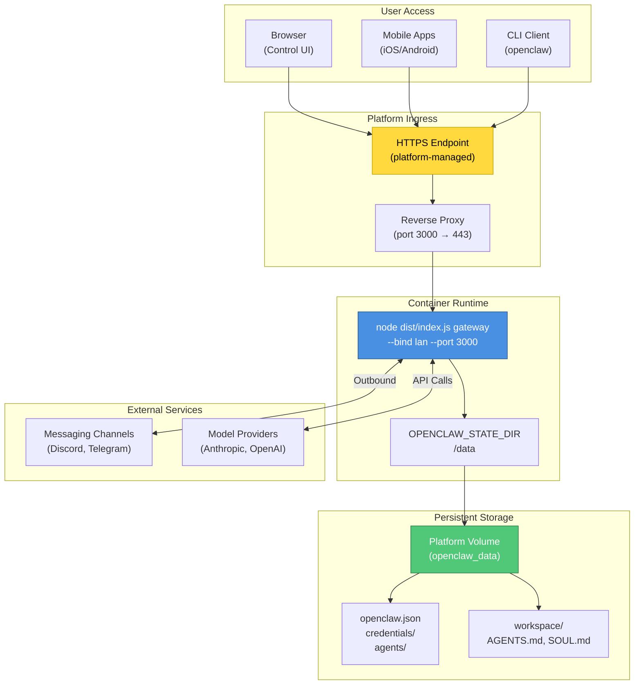
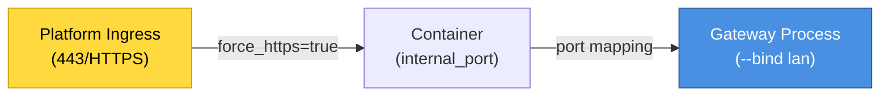
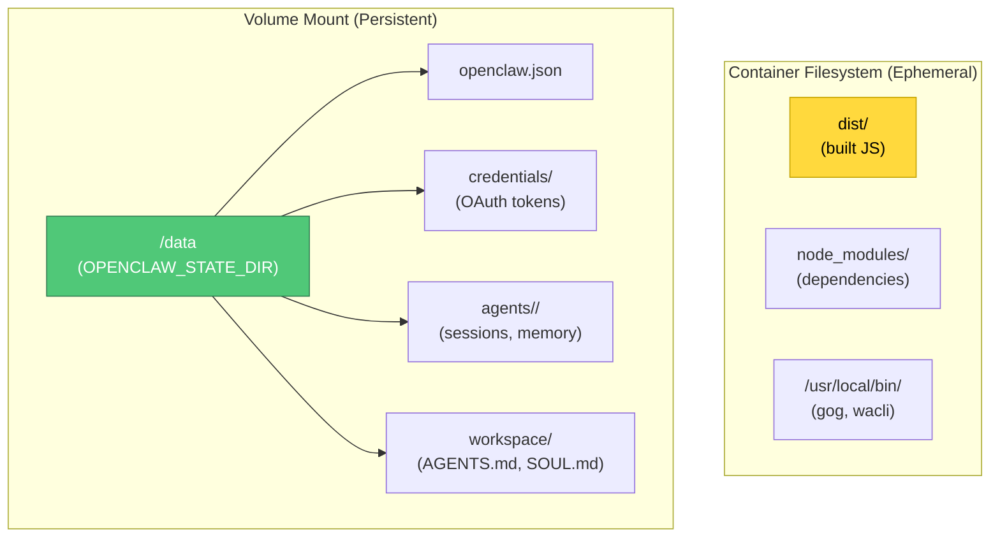
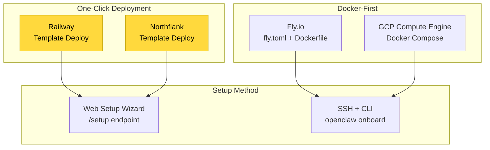
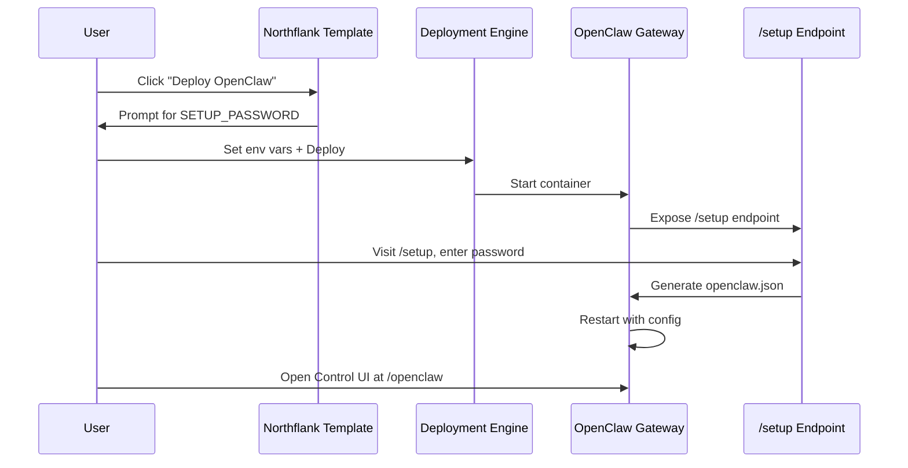
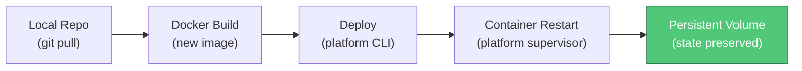

# Page: Docker Deployment

# Cloud Deployment

<details>
<summary>Relevant source files</summary>

The following files were used as context for generating this wiki page:

- [.github/actions/detect-docs-changes/action.yml](.github/actions/detect-docs-changes/action.yml)
- [.github/actions/setup-node-env/action.yml](.github/actions/setup-node-env/action.yml)
- [.github/workflows/ci.yml](.github/workflows/ci.yml)
- [.gitignore](.gitignore)
- [CHANGELOG.md](CHANGELOG.md)
- [docs/automation/poll.md](docs/automation/poll.md)
- [docs/ci.md](docs/ci.md)
- [docs/cli/memory.md](docs/cli/memory.md)
- [docs/cli/sandbox.md](docs/cli/sandbox.md)
- [docs/concepts/memory.md](docs/concepts/memory.md)
- [docs/gateway/configuration.md](docs/gateway/configuration.md)
- [docs/gateway/sandbox-vs-tool-policy-vs-elevated.md](docs/gateway/sandbox-vs-tool-policy-vs-elevated.md)
- [docs/gateway/sandboxing.md](docs/gateway/sandboxing.md)
- [docs/platforms/mac/skills.md](docs/platforms/mac/skills.md)
- [docs/providers/synthetic.md](docs/providers/synthetic.md)
- [docs/tools/elevated.md](docs/tools/elevated.md)
- [docs/tools/index.md](docs/tools/index.md)
- [docs/tools/skills-config.md](docs/tools/skills-config.md)
- [docs/zh-CN/vps.md](docs/zh-CN/vps.md)
- [extensions/msteams/src/store-fs.ts](extensions/msteams/src/store-fs.ts)
- [scripts/test-live-gateway-models-docker.sh](scripts/test-live-gateway-models-docker.sh)
- [scripts/test-live-models-docker.sh](scripts/test-live-models-docker.sh)
- [src/agents/live-auth-keys.test.ts](src/agents/live-auth-keys.test.ts)
- [src/agents/live-auth-keys.ts](src/agents/live-auth-keys.ts)
- [src/agents/memory-search.test.ts](src/agents/memory-search.test.ts)
- [src/agents/memory-search.ts](src/agents/memory-search.ts)
- [src/agents/pi-embedded-helpers.isbillingerrormessage.test.ts](src/agents/pi-embedded-helpers.isbillingerrormessage.test.ts)
- [src/agents/sandbox-explain.test.ts](src/agents/sandbox-explain.test.ts)
- [src/agents/sandbox.ts](src/agents/sandbox.ts)
- [src/agents/zai.live.test.ts](src/agents/zai.live.test.ts)
- [src/cli/memory-cli.test.ts](src/cli/memory-cli.test.ts)
- [src/cli/memory-cli.ts](src/cli/memory-cli.ts)
- [src/cli/models-cli.test.ts](src/cli/models-cli.test.ts)
- [src/commands/message.ts](src/commands/message.ts)
- [src/config/schema.ts](src/config/schema.ts)
- [src/config/types.tools.ts](src/config/types.tools.ts)
- [src/config/types.ts](src/config/types.ts)
- [src/config/zod-schema.agent-runtime.ts](src/config/zod-schema.agent-runtime.ts)
- [src/config/zod-schema.ts](src/config/zod-schema.ts)
- [src/gateway/live-image-probe.ts](src/gateway/live-image-probe.ts)
- [src/infra/outbound/abort.ts](src/infra/outbound/abort.ts)
- [src/infra/outbound/message.ts](src/infra/outbound/message.ts)
- [src/infra/outbound/outbound-send-service.ts](src/infra/outbound/outbound-send-service.ts)
- [src/media/png-encode.ts](src/media/png-encode.ts)
- [src/memory/embeddings.test.ts](src/memory/embeddings.test.ts)
- [src/memory/embeddings.ts](src/memory/embeddings.ts)
- [src/memory/manager.ts](src/memory/manager.ts)
- [src/pairing/pairing-store.ts](src/pairing/pairing-store.ts)

</details>


This page covers deploying OpenClaw Gateway to cloud platforms (Fly.io, Railway, Northflank, GCP) using containerized deployments with persistent volumes. For traditional VPS deployments (DigitalOcean, Hetzner, Oracle Cloud), see [VPS Deployment](#13.2). For local development and production on your own hardware, see [Local Deployment](#13.1). For network security and access patterns, see [Network Configuration](#13.4).

## Purpose and Scope

Cloud deployment refers to running the OpenClaw Gateway on Platform-as-a-Service (PaaS) offerings that provide:

- **Containerization**: Docker-based runtime isolation
- **Persistent volumes**: Durable storage for state/workspace that survives restarts
- **Managed ingress**: HTTPS endpoints and load balancing
- **Environment-based configuration**: Secrets via environment variables
- **Auto-restart**: Supervisor processes that recover from crashes

This deployment model differs from VPS deployment in that the platform manages the container lifecycle, networking, and TLS termination, while you provide the application image and configuration.

## Cloud Platform Architecture



**Sources:** [docs/platforms/fly.md:1-466](), [fly.toml:1-35]()

## Deployment Patterns

### Container Configuration

All cloud platforms use a similar container startup pattern. The Gateway process binds to a high port inside the container, and the platform's reverse proxy forwards HTTPS traffic to it.



**Fly.io Configuration** ([fly.toml:17-26]()):

```toml
[processes]
  app = "node dist/index.js gateway --allow-unconfigured --port 3000 --bind lan"

[http_service]
  internal_port = 3000
  force_https = true
  auto_stop_machines = false
  auto_start_machines = true
  min_machines_running = 1
```

**GCP Docker Compose** ([docs/platforms/gcp.md:242-280]()):

```yaml
services:
  openclaw-gateway:
    ports:
      - "127.0.0.1:${OPENCLAW_GATEWAY_PORT}:18789"
    command:
      [
        "node",
        "dist/index.js",
        "gateway",
        "--bind",
        "${OPENCLAW_GATEWAY_BIND}",
        "--port",
        "${OPENCLAW_GATEWAY_PORT}"
      ]
```

The `--bind lan` flag tells the Gateway to listen on `0.0.0.0` so the platform's proxy can reach it. Without this, the Gateway would bind to `127.0.0.1` only, making it unreachable from outside the container.

**Sources:** [fly.toml:17-26](), [docs/platforms/gcp.md:242-280]()

### State Persistence

Cloud deployments use **volume mounts** to persist state across container restarts. The container's ephemeral filesystem is discarded on rebuild, so all important data must live on the volume.



**Fly.io Volume Mount** ([fly.toml:32-34]()):

```toml
[mounts]
  source = "openclaw_data"
  destination = "/data"
```

The `OPENCLAW_STATE_DIR=/data` environment variable ([fly.toml:14]()) tells the Gateway to write all persistent state to the volume.

**GCP Volume Mount** ([docs/platforms/gcp.md:261-263]()):

```yaml
volumes:
  - ${OPENCLAW_CONFIG_DIR}:/home/node/.openclaw
  - ${OPENCLAW_WORKSPACE_DIR}:/home/node/.openclaw/workspace
```

GCP uses two separate mounts for config and workspace, both pointing to host directories.

**Sources:** [fly.toml:14-34](), [docs/platforms/gcp.md:261-263]()

### Persistence Mapping Table

| Component | Container Path | Volume Source | Rebuild Safe? |
|-----------|---------------|---------------|---------------|
| Gateway config | `/data/openclaw.json` | Platform volume | ✅ Yes |
| OAuth tokens | `/data/credentials/` | Platform volume | ✅ Yes |
| Session history | `/data/agents/<agentId>/sessions/` | Platform volume | ✅ Yes |
| Workspace files | `/data/workspace/` | Platform volume | ✅ Yes |
| WhatsApp session | `/data/credentials/` | Platform volume | ✅ Yes |
| Node runtime | `/usr/local/bin/node` | Container image | ❌ No (rebuilt) |
| External binaries | `/usr/local/bin/gog` | Container image | ❌ No (must bake) |
| npm packages | `/app/node_modules/` | Container image | ❌ No (rebuilt) |

**Sources:** [docs/platforms/gcp.md:406-418](), [docs/platforms/fly.md:77-89]()

## Platform Comparison



| Platform | Complexity | Setup Method | Cost | Best For |
|----------|-----------|--------------|------|----------|
| Railway | Low | Web wizard | $5+/mo | Quick start, no terminal |
| Northflank | Low | Web wizard | $10+/mo | Browser-only setup |
| Fly.io | Medium | fly CLI + SSH | $10-15/mo | Production, HTTPS |
| GCP | High | gcloud + Docker | $5-12/mo | Custom control, baked binaries |

**Sources:** [docs/platforms/fly.md:461-465](), [docs/northflank.mdx:1-54]()

## Fly.io Deployment

Fly.io is the most documented cloud platform in the codebase. It uses a Dockerfile build + persistent volumes + HTTPS ingress.

### Configuration Files

The repository includes two Fly.io configurations:

1. **Standard** ([fly.toml:1-35]()): Public HTTPS ingress
2. **Private** ([fly.private.toml:1-40]()): No public IP, proxy-only access

**Standard Configuration** ([fly.toml:1-35]()):

```toml
app = "openclaw"
primary_region = "iad"

[build]
  dockerfile = "Dockerfile"

[env]
  NODE_ENV = "production"
  OPENCLAW_PREFER_PNPM = "1"
  OPENCLAW_STATE_DIR = "/data"
  NODE_OPTIONS = "--max-old-space-size=1536"

[processes]
  app = "node dist/index.js gateway --allow-unconfigured --port 3000 --bind lan"

[http_service]
  internal_port = 3000
  force_https = true
  auto_stop_machines = false
  auto_start_machines = true
  min_machines_running = 1

[[vm]]
  size = "shared-cpu-2x"
  memory = "2048mb"

[mounts]
  source = "openclaw_data"
  destination = "/data"
```

**Key Settings**:

- `--allow-unconfigured`: Starts without `openclaw.json`, allowing post-deploy SSH config
- `internal_port = 3000`: Must match `--port 3000` for health checks
- `memory = "2048mb"`: 512MB too small; 2GB recommended ([docs/platforms/fly.md:252-264]())
- `OPENCLAW_STATE_DIR = "/data"`: Points to the persistent volume

**Sources:** [fly.toml:1-35](), [docs/platforms/fly.md:40-89]()

### Private Deployment

The private configuration ([fly.private.toml:1-40]()) removes the `[http_service]` block entirely, preventing public IP allocation. This is suitable for deployments that:

- Only make outbound calls (no inbound webhooks)
- Use `fly proxy` or WireGuard for access
- Want to avoid internet scanner discovery

**Access Methods** ([docs/platforms/fly.md:391-408]()):

```bash
# Local proxy (simplest)
fly proxy 3000:3000 -a my-openclaw

# WireGuard VPN
fly wireguard create

# SSH only
fly ssh console -a my-openclaw
```

**Sources:** [fly.private.toml:1-40](), [docs/platforms/fly.md:349-441]()

### Deployment Commands

```bash
# Create app and volume
fly apps create my-openclaw
fly volumes create openclaw_data --size 1 --region iad

# Set secrets (not in fly.toml)
fly secrets set OPENCLAW_GATEWAY_TOKEN=$(openssl rand -hex 32)
fly secrets set ANTHROPIC_API_KEY=sk-ant-...
fly secrets set DISCORD_BOT_TOKEN=MTQ...

# Deploy
fly deploy

# SSH to configure
fly ssh console
cat > /data/openclaw.json << 'EOF'
{...}
EOF

# Restart
fly machine restart <machine-id>
```

**Sources:** [docs/platforms/fly.md:24-207]()

### Common Issues

**1. Memory Issues** ([docs/platforms/fly.md:248-264]()):

512MB is too small. Symptoms: `SIGABRT`, `v8::internal::Runtime_AllocateInYoungGeneration`, silent restarts.

Fix:
```bash
fly machine update <machine-id> --vm-memory 2048 -y
```

**2. Gateway Lock Issues** ([docs/platforms/fly.md:265-278]()):

The PID lock file persists on the volume across restarts, causing "already running" errors.

Fix:
```bash
fly ssh console --command "rm -f /data/gateway.*.lock"
fly machine restart <machine-id>
```

**3. Port Binding** ([docs/platforms/fly.md:235-247]()):

If the Gateway binds to `127.0.0.1` instead of `0.0.0.0`, Fly's proxy can't reach it.

Fix: Add `--bind lan` to the process command ([fly.toml:18]()).

**Sources:** [docs/platforms/fly.md:234-305]()

## Northflank Deployment

Northflank provides a one-click template with browser-based setup. No terminal access required.

### Setup Flow



**Configuration** ([docs/northflank.mdx:14-18]()):

1. Set `SETUP_PASSWORD` environment variable
2. Deploy stack
3. Visit `https://<your-domain>/setup`
4. Configure model auth and channels via web form
5. Access Control UI at `https://<your-domain>/openclaw`

The setup wizard can approve Telegram pairing codes directly from the browser ([docs/northflank.mdx:35]()).

**Sources:** [docs/northflank.mdx:1-54]()

## GCP Compute Engine Deployment

The GCP guide ([docs/platforms/gcp.md:1-499]()) shows a production-grade Docker Compose setup with baked binaries.

### Binary Persistence Pattern

Installing binaries at runtime is a footgun. Anything installed inside a running container is lost on restart. External binaries must be baked into the image at build time.

**Example Dockerfile** ([docs/platforms/gcp.md:307-337]()):

```dockerfile
FROM node:22-bookworm

# Example: Gmail CLI
RUN curl -L https://github.com/steipete/gog/releases/latest/download/gog_Linux_x86_64.tar.gz \
  | tar -xz -C /usr/local/bin && chmod +x /usr/local/bin/gog

# Example: Google Places CLI
RUN curl -L https://github.com/steipete/goplaces/releases/latest/download/goplaces_Linux_x86_64.tar.gz \
  | tar -xz -C /usr/local/bin && chmod +x /usr/local/bin/goplaces

# Example: WhatsApp CLI
RUN curl -L https://github.com/steipete/wacli/releases/latest/download/wacli_Linux_x86_64.tar.gz \
  | tar -xz -C /usr/local/bin && chmod +x /usr/local/bin/wacli
```

After adding new binaries, rebuild and restart:

```bash
docker compose build
docker compose up -d
```

**Verification**:

```bash
docker compose exec openclaw-gateway which gog
docker compose exec openclaw-gateway which wacli
```

**Sources:** [docs/platforms/gcp.md:285-368]()

### Volume Mounts

GCP uses explicit host directory mounts ([docs/platforms/gcp.md:200-208]()):

```bash
mkdir -p ~/.openclaw
mkdir -p ~/.openclaw/workspace
```

Docker Compose configuration ([docs/platforms/gcp.md:261-263]()):

```yaml
volumes:
  - ${OPENCLAW_CONFIG_DIR}:/home/node/.openclaw
  - ${OPENCLAW_WORKSPACE_DIR}:/home/node/.openclaw/workspace
```

This two-mount pattern separates config/credentials from workspace files, making backups easier.

**Sources:** [docs/platforms/gcp.md:200-280]()

## Environment Variables

Cloud deployments prefer environment variables over config files for secrets. This keeps sensitive data out of `openclaw.json` and logs.

### Required Variables

| Variable | Purpose | Example |
|----------|---------|---------|
| `OPENCLAW_GATEWAY_TOKEN` | Auth for Control UI | `openssl rand -hex 32` |
| `OPENCLAW_STATE_DIR` | State/workspace location | `/data` (Fly.io), `~/.openclaw` (GCP) |
| `OPENCLAW_GATEWAY_PORT` | Internal listen port | `3000` (Fly.io), `18789` (GCP) |
| `OPENCLAW_GATEWAY_BIND` | Bind address | `lan` (public proxy), `loopback` (tunnel-only) |

### Provider Credentials

| Variable | Provider | Format |
|----------|----------|--------|
| `ANTHROPIC_API_KEY` | Anthropic | `sk-ant-...` |
| `OPENAI_API_KEY` | OpenAI | `sk-...` |
| `GOOGLE_API_KEY` | Google | API key string |
| `DISCORD_BOT_TOKEN` | Discord | `MTQ...` |

**Fly.io Secrets** ([docs/platforms/fly.md:89-105]()):

```bash
fly secrets set OPENCLAW_GATEWAY_TOKEN=$(openssl rand -hex 32)
fly secrets set ANTHROPIC_API_KEY=sk-ant-...
fly secrets set DISCORD_BOT_TOKEN=MTQ...
```

**GCP .env File** ([docs/platforms/gcp.md:215-228]()):

```bash
OPENCLAW_GATEWAY_TOKEN=change-me-now
OPENCLAW_GATEWAY_BIND=lan
OPENCLAW_CONFIG_DIR=/home/$USER/.openclaw
GOG_KEYRING_PASSWORD=change-me-now
```

The Discord token can come from either the environment or the config file ([docs/platforms/fly.md:196-200]()):

- Environment: `DISCORD_BOT_TOKEN` (recommended)
- Config: `channels.discord.token`

If using the env var, no need to add it to `openclaw.json`.

**Sources:** [docs/platforms/fly.md:89-105](), [docs/platforms/gcp.md:215-228](), [fly.toml:10-15]()

## Security Considerations

### Binding Modes

The `--bind` flag controls where the Gateway listens:

| Mode | Address | Use Case | Auth Required? |
|------|---------|----------|----------------|
| `loopback` | `127.0.0.1` | SSH tunnel, proxy | Token/password |
| `lan` | `0.0.0.0` | Platform proxy, public | Token/password |
| `tailnet` | Tailscale IP | Tailnet only | Optional |

**Fly.io Standard** ([fly.toml:18]()): `--bind lan` with token auth
**Fly.io Private** ([fly.private.toml:25]()): `--bind lan` but no public IP
**GCP Default** ([docs/platforms/gcp.md:266]()): `127.0.0.1:18789` (loopback via SSH)

### Public Exposure Trade-offs

**Standard Deployment** ([docs/platforms/fly.md:40-89]()):

- Public HTTPS URL (convenient)
- Discoverable by internet scanners (Shodan, Censys)
- Requires strong `OPENCLAW_GATEWAY_TOKEN`

**Private Deployment** ([docs/platforms/fly.md:343-441]()):

- No public IP allocation
- Hidden from scanners
- Access via `fly proxy` or WireGuard only
- Suitable for outbound-only use cases

**Security Benefits** ([docs/platforms/fly.md:443-450]()):

| Aspect | Public | Private |
|--------|--------|---------|
| Internet scanners | Discoverable | Hidden |
| Direct attacks | Possible | Blocked |
| Control UI access | Browser | Proxy/VPN |
| Webhook delivery | Direct | Via tunnel |

**Sources:** [fly.toml:20-26](), [fly.private.toml:24-31](), [docs/platforms/fly.md:343-450]()

### Webhook Callbacks

Private deployments can still receive webhooks via tunnels ([docs/platforms/fly.md:416-439]()):

1. **ngrok tunnel**: Run ngrok inside the container or as a sidecar
2. **Tailscale Funnel**: Expose specific paths via Tailscale
3. **Outbound-only**: Some providers (Twilio) work without webhooks

Example voice-call config with ngrok:

```json
{
  "plugins": {
    "entries": {
      "voice-call": {
        "enabled": true,
        "config": {
          "provider": "twilio",
          "tunnel": { "provider": "ngrok" }
        }
      }
    }
  }
}
```

The ngrok tunnel provides a public webhook URL without exposing the Fly app itself.

**Sources:** [docs/platforms/fly.md:416-439]()

## Update Strategy



### Fly.io

```bash
git pull
fly deploy
fly status
fly logs
```

**Sources:** [docs/platforms/fly.md:313-324]()

### GCP

```bash
cd ~/openclaw
git pull
docker compose build
docker compose up -d
```

**Sources:** [docs/platforms/gcp.md:423-430]()

### Update Safety

The persistent volume mount ensures that:

- Config survives image rebuilds
- OAuth tokens stay valid
- Session history is preserved
- WhatsApp login persists

The container itself is stateless and safe to rebuild/restart.

## Troubleshooting

### Port Conflicts

**Symptom**: "App is not listening on expected address"

**Cause**: Gateway bound to `127.0.0.1` instead of `0.0.0.0`

**Fix**: Add `--bind lan` to startup command ([docs/platforms/fly.md:235-240]())

### Health Check Failures

**Symptom**: Connection refused, service restarting

**Cause**: `internal_port` doesn't match `--port`

**Fix**: Ensure `internal_port = 3000` matches `--port 3000` ([docs/platforms/fly.md:241-247]())

### Memory Issues

**Symptom**: Silent restarts, `SIGABRT`, v8 allocation errors

**Cause**: 512MB too small for production workloads

**Fix**: Increase to 2GB ([docs/platforms/fly.md:252-264]())

```bash
# Fly.io
fly machine update <machine-id> --vm-memory 2048 -y

# GCP
# Stop, change machine type, restart
```

### Lock File Stale

**Symptom**: "Another gateway instance is already listening"

**Cause**: PID lock file persists on volume after crash

**Fix**: Delete lock file ([docs/platforms/fly.md:265-278]())

```bash
# Fly.io
fly ssh console --command "rm -f /data/gateway.*.lock"

# GCP
docker compose exec openclaw-gateway rm -f /home/node/.openclaw/gateway.*.lock
```

### Config Not Read

**Symptom**: Changes to `openclaw.json` not taking effect

**Cause**: Config written to wrong location, not on volume

**Verify**:

```bash
# Fly.io
fly ssh console --command "cat /data/openclaw.json"

# GCP
docker compose exec openclaw-gateway cat /home/node/.openclaw/openclaw.json
```

**Sources:** [docs/platforms/fly.md:234-305]()

## Cost Estimates (2026)

| Platform | Tier | Specs | Cost/mo | Notes |
|----------|------|-------|---------|-------|
| Fly.io | shared-cpu-2x | 2 vCPU, 2GB RAM | $10-15 | Includes volume |
| Railway | Starter | 0.5 vCPU, 512MB RAM | $5+ | Usage-based |
| Northflank | Basic | 1 vCPU, 1GB RAM | $10+ | Managed |
| GCP Compute | e2-small | 2 vCPU, 2GB RAM | ~$12 | Plus egress |
| GCP Compute | e2-micro | 2 vCPU, 1GB RAM | Free tier eligible | May OOM |

**Sources:** [docs/platforms/fly.md:461-465](), [docs/platforms/gcp.md:115-119]()

## Related Documentation

- VPS deployment patterns: [VPS Deployment](#13.2)
- Network binding and security: [Network Configuration](#13.4)
- Gateway configuration reference: [Gateway Configuration](#3.1)
- Remote access patterns: [Remote Access](#3.4)
- Docker installation: [Docker Install](/install/docker)

---