# Page: Network Configuration

# Network Configuration

<details>
<summary>Relevant source files</summary>

The following files were used as context for generating this wiki page:

- [README.md](README.md)
- [assets/avatar-placeholder.svg](assets/avatar-placeholder.svg)
- [docs/channels/zalo.md](docs/channels/zalo.md)
- [docs/channels/zalouser.md](docs/channels/zalouser.md)
- [docs/gateway/doctor.md](docs/gateway/doctor.md)
- [scripts/clawtributors-map.json](scripts/clawtributors-map.json)
- [scripts/update-clawtributors.ts](scripts/update-clawtributors.ts)
- [scripts/update-clawtributors.types.ts](scripts/update-clawtributors.types.ts)
- [src/agents/bash-tools.test.ts](src/agents/bash-tools.test.ts)
- [src/agents/pi-tools-agent-config.test.ts](src/agents/pi-tools-agent-config.test.ts)
- [src/agents/sandbox-skills.test.ts](src/agents/sandbox-skills.test.ts)
- [src/commands/configure.gateway.test.ts](src/commands/configure.gateway.test.ts)
- [src/commands/configure.gateway.ts](src/commands/configure.gateway.ts)
- [src/commands/configure.ts](src/commands/configure.ts)
- [src/commands/doctor.ts](src/commands/doctor.ts)
- [src/commands/onboard-helpers.test.ts](src/commands/onboard-helpers.test.ts)
- [src/commands/onboard-helpers.ts](src/commands/onboard-helpers.ts)
- [src/commands/onboard-interactive.ts](src/commands/onboard-interactive.ts)
- [src/config/config.ts](src/config/config.ts)
- [src/config/merge-config.ts](src/config/merge-config.ts)
- [src/index.test.ts](src/index.test.ts)
- [src/index.ts](src/index.ts)
- [src/wizard/onboarding.gateway-config.test.ts](src/wizard/onboarding.gateway-config.test.ts)
- [src/wizard/onboarding.gateway-config.ts](src/wizard/onboarding.gateway-config.ts)
- [src/wizard/onboarding.ts](src/wizard/onboarding.ts)
- [src/wizard/onboarding.types.ts](src/wizard/onboarding.types.ts)
- [tsconfig.json](tsconfig.json)
- [ui/src/styles.css](ui/src/styles.css)
- [ui/src/styles/layout.mobile.css](ui/src/styles/layout.mobile.css)

</details>


## Purpose and Scope

This document covers network configuration for the OpenClaw Gateway, including bind modes, port management, authentication, Tailscale integration, and webhook setup. Network configuration determines how the Gateway listens for connections and how external services reach it.

For Gateway service management (installation, start/stop), see [Gateway Service Management](#3.3). For remote access patterns, see [Remote Access](#3.4). For security policies, see the security documentation referenced in `README.md`.

---

## Gateway Bind Modes

The Gateway supports five bind modes that control which network interfaces accept connections:

| Bind Mode | Host Address | Use Case |
|-----------|--------------|----------|
| `loopback` | `127.0.0.1` | Local-only access (default for Tailscale) |
| `lan` | `0.0.0.0` | All network interfaces |
| `tailnet` | Tailscale IP | Bind to Tailscale network interface only |
| `auto` | `127.0.0.1` → `0.0.0.0` | Prefer loopback, fallback to LAN if unavailable |
| `custom` | User-specified IP | Bind to specific IP with `0.0.0.0` fallback |

### Bind Mode Resolution

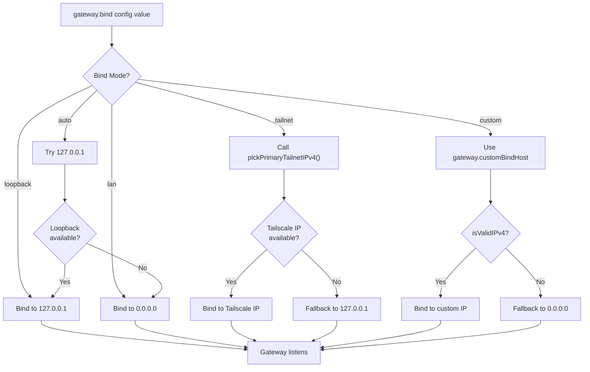

**Sources:**
- [src/wizard/onboarding.gateway-config.ts:42-286]()
- [src/commands/onboard-helpers.ts:437-466]()
- [src/gateway/net.js]() (referenced via imports)
- [src/infra/tailnet.js]() (referenced via `pickPrimaryTailnetIPv4`)

### Custom IP Validation

Custom bind mode requires a valid IPv4 address. Validation occurs during configuration:

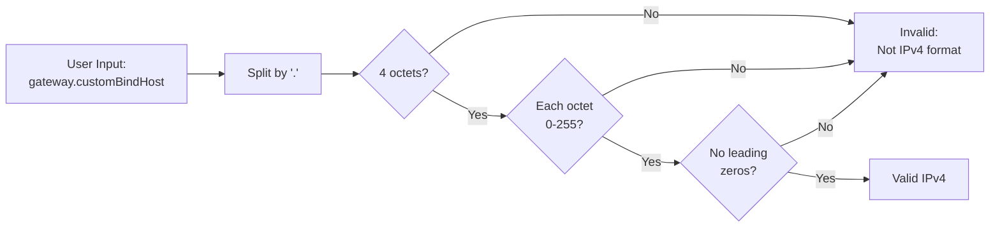

**Sources:**
- [src/wizard/onboarding.gateway-config.ts:73-106]()
- [src/commands/configure.gateway.ts:69-91]()

---

## Port Configuration

The Gateway listens on a single TCP port for HTTP/WebSocket connections. Default is `18789`.

### Port Resolution Chain

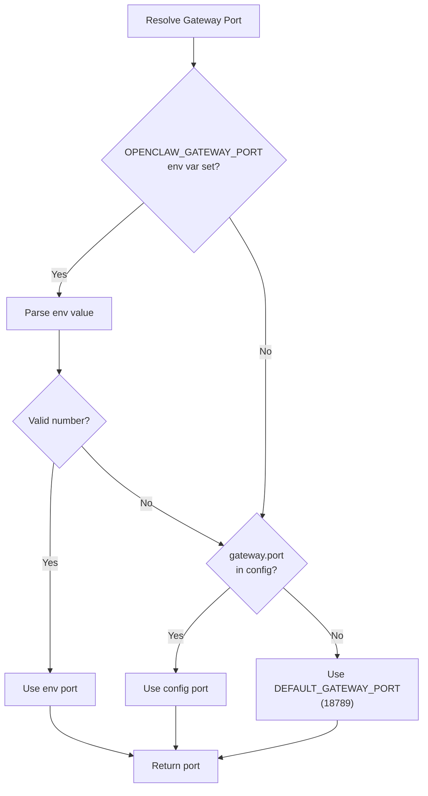

**Sources:**
- [src/config/config.ts]() (exports `DEFAULT_GATEWAY_PORT`, `resolveGatewayPort`)
- [src/wizard/onboarding.ts:294]()

### Port Conflict Detection

The Gateway checks port availability before starting. If the port is in use, it identifies the likely owner:

| Port Owner | Detection Method |
|------------|------------------|
| Another Gateway instance | Check for active WebSocket endpoint |
| SSH tunnel | Check for `ssh` process with `-L` flag |
| Other process | Report PID via `lsof` (Unix) or `netstat` (Windows) |

**Sources:**
- [src/infra/ports.ts]() (referenced via `ensurePortAvailable`, `handlePortError`, `describePortOwner`)
- [src/index.ts:26-28]()
- [docs/gateway/doctor.md:256-261]()

---

## Authentication

The Gateway requires authentication for all connections except when running in loopback mode with Tailscale Serve (which uses Tailscale identity headers).

### Authentication Modes

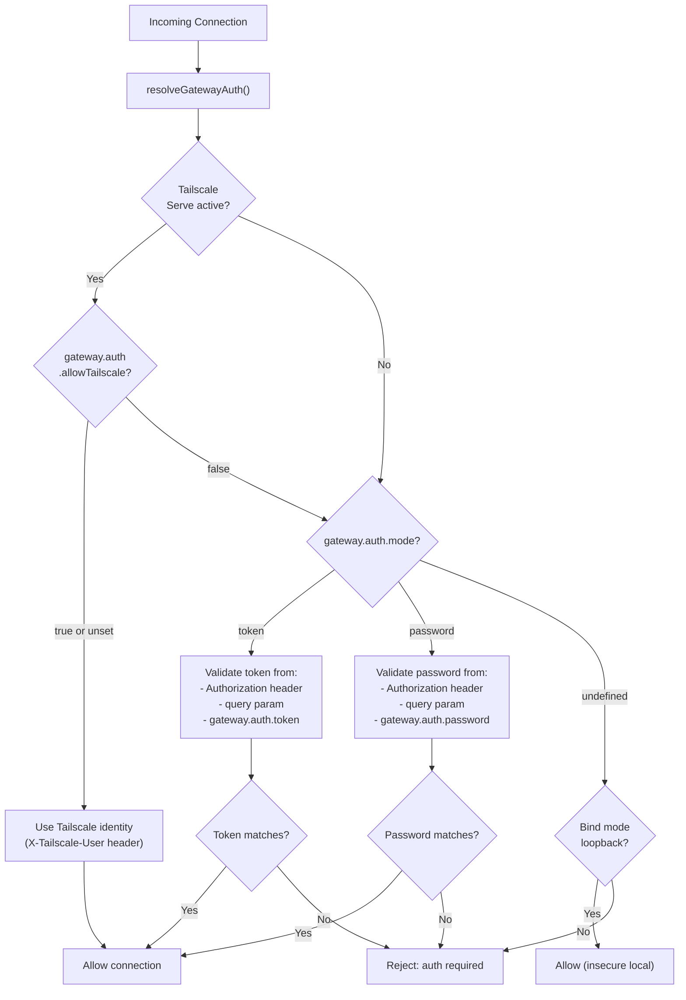

**Sources:**
- [src/gateway/auth.js]() (referenced via `resolveGatewayAuth`)
- [src/commands/doctor.ts:125-159]()
- [src/wizard/onboarding.gateway-config.ts:108-236]()

### Token Generation

When `authMode` is `token` and no token is provided, the system generates a random 48-character hex token:

**Sources:**
- [src/commands/onboard-helpers.ts:68-70]()
- [src/wizard/onboarding.gateway-config.ts:194-202]()

---

## Tailscale Integration

Tailscale provides zero-config VPN access to the Gateway. Two modes are supported:

| Mode | Access | HTTPS | Authentication |
|------|--------|-------|----------------|
| `serve` | Tailnet-only | Via Tailscale certificate | Tailscale identity (optional password override) |
| `funnel` | Public internet | Via Tailscale certificate | Password required |

### Tailscale Architecture

```mermaid
flowchart TB
    subgraph Gateway["Gateway Process"]
        GatewayBind["Gateway binds to<br/>127.0.0.1:18789"]
    end
    
    subgraph Tailscale["Tailscale Daemon"]
        TailscaleServe["tailscale serve<br/>or<br/>tailscale funnel"]
        TailscaleProxy["Reverse proxy<br/>(terminates HTTPS)"]
    end
    
    subgraph Clients["Clients"]
        TailnetClient["Tailnet device<br/>(https://machine-name.ts.net)"]
        InternetClient["Internet user<br/>(via Funnel)"]
    end
    
    TailnetClient -->|HTTPS request| TailscaleProxy
    InternetClient -->|HTTPS request<br/>(Funnel only)| TailscaleProxy
    
    TailscaleProxy -->|HTTP to localhost:18789| GatewayBind
    
    TailscaleServe -.->|Configures| TailscaleProxy
    
    GatewayBind -->|Enforces bind=loopback<br/>when Tailscale active| GatewayBind
```

**Sources:**
- [README.md:208-223]()
- [src/wizard/onboarding.gateway-config.ts:124-189]()
- [src/infra/tailscale.ts]() (referenced via `findTailscaleBinary`)

### Tailscale Constraints

The Gateway enforces constraints when Tailscale is enabled:

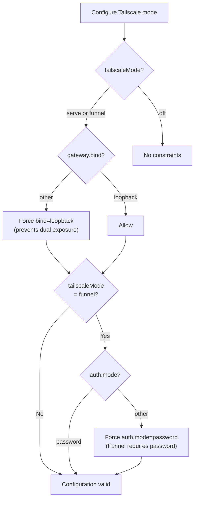

**Sources:**
- [src/wizard/onboarding.gateway-config.ts:180-189]()
- [README.md:216-221]()

---

## Webhook Configuration

Channels that support webhooks (Telegram, Zalo, BlueBubbles) can receive events via HTTP instead of polling.

### Webhook Routing

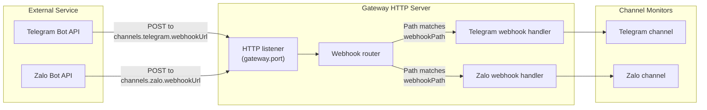

**Sources:**
- [docs/channels/zalo.md:113-119]()
- [src/commands/onboard-helpers.ts]() (webhook URL handling)

### Webhook Security

Webhooks validate requests using secrets:

| Channel | Header | Config Key |
|---------|--------|------------|
| Telegram | `X-Telegram-Bot-Api-Secret-Token` | `channels.telegram.webhookSecret` |
| Zalo | `X-Bot-Api-Secret-Token` | `channels.zalo.webhookSecret` |
| BlueBubbles | `bluebubbles-auth` | `channels.bluebubbles.password` |

**Sources:**
- [docs/channels/zalo.md:170-175]()

### Webhook vs Polling

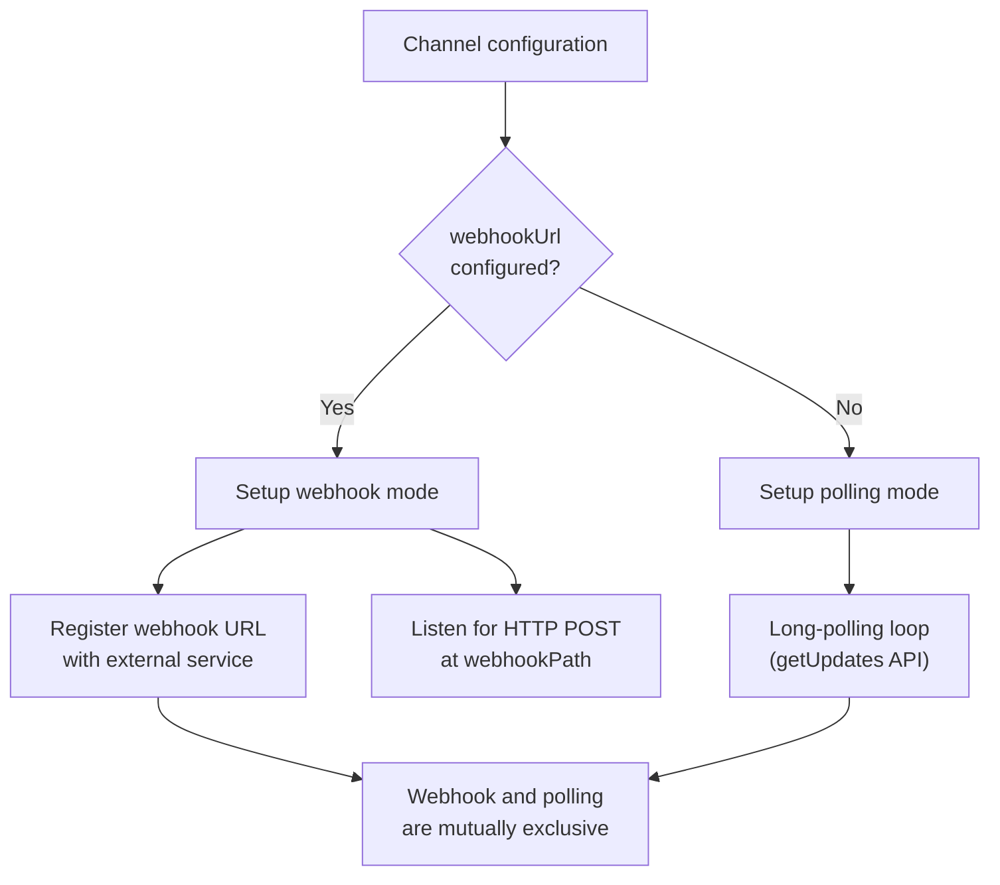

**Sources:**
- [docs/channels/zalo.md:111-119]()
- [README.md:343-344]()

---

## Network Diagnostics

### Gateway Health Check

The Gateway exposes a health endpoint for monitoring:

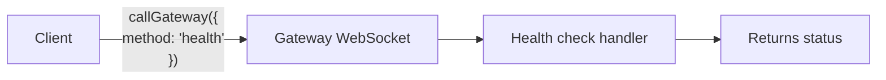

**Sources:**
- [src/commands/onboard-helpers.ts:360-382]()
- [src/gateway/call.js]() (referenced via `callGateway`)
- [docs/gateway/doctor.md:268-280]()

### Reachability Probing

The `probeGatewayReachable` function tests Gateway connectivity:

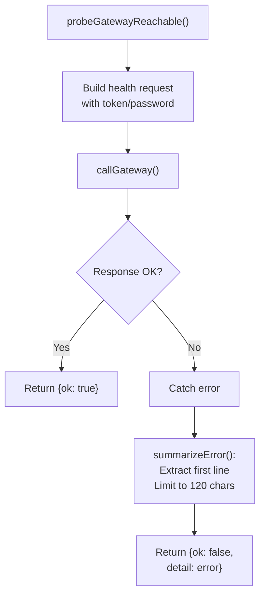

**Sources:**
- [src/commands/onboard-helpers.ts:360-433]()

---

## Firewall Considerations

### Required Ports

| Port | Protocol | Purpose | Required For |
|------|----------|---------|--------------|
| `gateway.port` (default 18789) | TCP | Gateway HTTP/WebSocket | All modes |
| 443 | TCP | Tailscale Serve/Funnel (outbound) | Tailscale modes |
| Variable | UDP | Tailscale WireGuard | Tailscale modes |

### Bind Mode Security

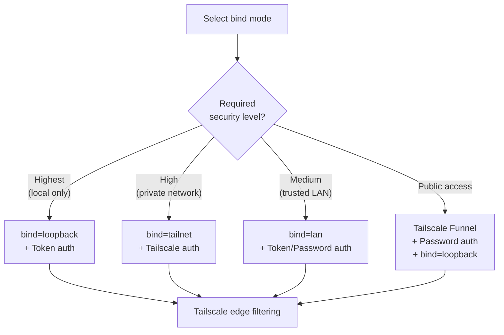

**Sources:**
- [README.md:107-120]()
- [src/wizard/onboarding.gateway-config.ts:180-189]()
- [src/wizard/onboarding.ts:47-88]()

---

## Configuration Reference

### Core Network Settings

```typescript
{
  gateway: {
    port: 18789,                    // TCP port for Gateway
    bind: "loopback",               // loopback | lan | tailnet | auto | custom
    customBindHost?: "192.168.1.100", // Required when bind=custom
    
    auth: {
      mode: "token",                // token | password
      token?: "...",                // Required when mode=token
      password?: "...",             // Required when mode=password
      allowTailscale?: true,        // Allow Tailscale identity auth
    },
    
    tailscale: {
      mode: "off",                  // off | serve | funnel
      resetOnExit: false,           // Reset Tailscale config on shutdown
    },
  }
}
```

**Sources:**
- [src/config/types.ts]() (type definitions)
- [src/wizard/onboarding.gateway-config.ts:237-286]()

### Webhook Configuration Example

```typescript
{
  channels: {
    telegram: {
      webhookUrl: "https://example.com/telegram",
      webhookSecret: "secure-secret-token",
      webhookPath: "/telegram",  // Defaults to URL path
    },
    
    zalo: {
      webhookUrl: "https://example.com/zalo",
      webhookSecret: "8-to-256-char-secret",
      webhookPath: "/zalo",
    },
  }
}
```

**Sources:**
- [docs/channels/zalo.md:170-176]()
- [README.md:343-354]()

---

## Control UI Access

The Control UI is accessible via HTTP at the Gateway's bound address:

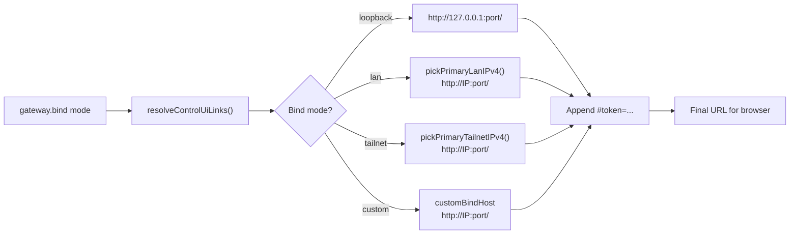

**Sources:**
- [src/commands/onboard-helpers.ts:437-466]()
- [README.md:208-223]()

---