# Page: Operations and Troubleshooting

# Operations and Troubleshooting

<details>
<summary>Relevant source files</summary>

The following files were used as context for generating this wiki page:

- [README.md](README.md)
- [assets/avatar-placeholder.svg](assets/avatar-placeholder.svg)
- [docs/channels/zalo.md](docs/channels/zalo.md)
- [docs/channels/zalouser.md](docs/channels/zalouser.md)
- [docs/gateway/doctor.md](docs/gateway/doctor.md)
- [scripts/clawtributors-map.json](scripts/clawtributors-map.json)
- [scripts/update-clawtributors.ts](scripts/update-clawtributors.ts)
- [scripts/update-clawtributors.types.ts](scripts/update-clawtributors.types.ts)
- [src/agents/bash-tools.test.ts](src/agents/bash-tools.test.ts)
- [src/agents/pi-tools-agent-config.test.ts](src/agents/pi-tools-agent-config.test.ts)
- [src/agents/sandbox-skills.test.ts](src/agents/sandbox-skills.test.ts)
- [src/commands/configure.gateway.test.ts](src/commands/configure.gateway.test.ts)
- [src/commands/configure.gateway.ts](src/commands/configure.gateway.ts)
- [src/commands/configure.ts](src/commands/configure.ts)
- [src/commands/doctor.ts](src/commands/doctor.ts)
- [src/commands/onboard-helpers.test.ts](src/commands/onboard-helpers.test.ts)
- [src/commands/onboard-helpers.ts](src/commands/onboard-helpers.ts)
- [src/commands/onboard-interactive.ts](src/commands/onboard-interactive.ts)
- [src/config/config.ts](src/config/config.ts)
- [src/config/merge-config.ts](src/config/merge-config.ts)
- [src/index.test.ts](src/index.test.ts)
- [src/index.ts](src/index.ts)
- [src/wizard/onboarding.gateway-config.test.ts](src/wizard/onboarding.gateway-config.test.ts)
- [src/wizard/onboarding.gateway-config.ts](src/wizard/onboarding.gateway-config.ts)
- [src/wizard/onboarding.ts](src/wizard/onboarding.ts)
- [src/wizard/onboarding.types.ts](src/wizard/onboarding.types.ts)
- [tsconfig.json](tsconfig.json)
- [ui/src/styles.css](ui/src/styles.css)
- [ui/src/styles/layout.mobile.css](ui/src/styles/layout.mobile.css)

</details>


This page provides operational guidance for running and maintaining OpenClaw deployments. It covers diagnostic workflows, service lifecycle management, health monitoring, and common troubleshooting patterns. For deep dives into specific topics, see:

- Health monitoring and status commands: [Health Monitoring](#14.1)
- Doctor command usage and migrations: [Doctor Command Guide](#14.2)
- Specific error messages and fixes: [Common Issues](#14.3)
- Moving installations and backup strategies: [Migration and Backup](#14.4)

For runtime failures and channel-specific issues, see [Troubleshooting](/gateway/troubleshooting).

---

## Operational Context

OpenClaw runs as a long-lived Gateway process that owns messaging channel connections and the WebSocket control plane. Operational tasks center on:

1. **Monitoring**: Gateway health, channel connectivity, model auth status
2. **Diagnostics**: Identifying why messages fail or the Gateway won't start
3. **Lifecycle**: Starting, stopping, restarting, upgrading
4. **Recovery**: Repairing broken state, migrating legacy data
5. **Maintenance**: Config updates, log rotation, backup

The CLI provides a layered diagnostic surface: fast local checks (`openclaw status`), remote Gateway probes (`openclaw health`), and repair automation (`openclaw doctor`).

---

## Diagnostic Workflow: First 60 Seconds

When something breaks, run these commands in order. Each provides progressively deeper insight.

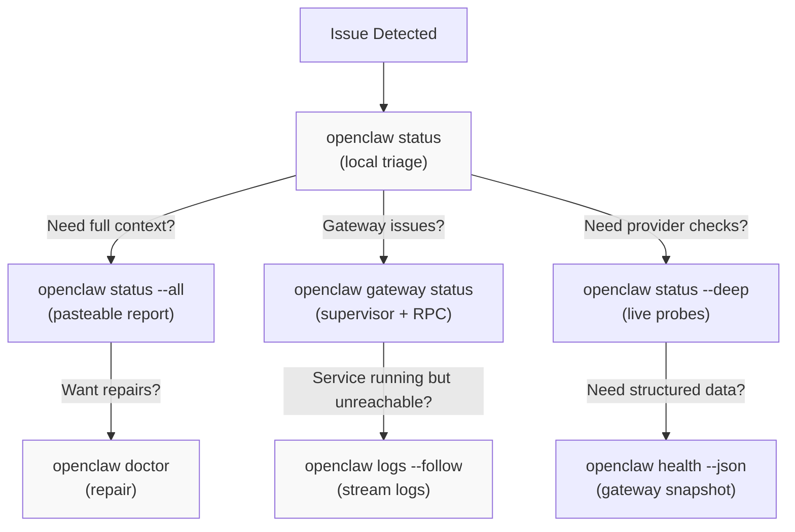

**Quick reference:**

| Command | What it shows | When to use |
|---------|--------------|-------------|
| `openclaw status` | OS/update, gateway reachability, agents/sessions, provider config | First check; fast local summary |
| `openclaw status --all` | Full diagnosis + log tail (tokens redacted) | Safe to share for debugging |
| `openclaw gateway status` | Supervisor runtime, RPC probe, config path mismatch | Gateway "running" but nothing responds |
| `openclaw status --deep` | Gateway health + provider probes (requires reachable gateway) | Configured but not working |
| `openclaw logs --follow` | Live log stream | Need the actual failure reason |
| `openclaw doctor` | Config validation + repair automation | Fix stale config/state |
| `openclaw health --verbose` | Gateway snapshot with target URL + config path on errors | Debug auth or network issues |

**Sources:** [docs/help/faq.md:196-244](), [docs/gateway/troubleshooting.md:14-30]()

---

## Diagnostic Command Architecture

The CLI provides three layers of diagnostics: local checks, remote probes, and repair actions. Understanding which layer each command operates in helps choose the right tool.

**Diagnostic Command Architecture**

```mermaid
graph TB
    subgraph LocalChecks["Local Checks (no Gateway required)"]
        StatusLocal["openclaw status<br/>statusCommand()"]
        GatewayStatus["openclaw gateway status<br/>resolveGatewayService()"]
        ConfigSnapshot["readConfigFileSnapshot()<br/>src/config/io.ts"]
        ServiceProbe["Service supervisor check<br/>isLoaded(), isRunning()"]
    end
    
    subgraph RemoteProbes["Remote Probes (require Gateway RPC)"]
        StatusDeep["openclaw status --deep<br/>checkGatewayHealth()"]
        Health["openclaw health<br/>callGateway('health')"]
        Logs["openclaw logs<br/>callGateway('logs.tail')"]
        ChannelsStatus["openclaw channels status<br/>callGateway('channels.status')"]
        SystemPresence["openclaw system presence<br/>callGateway('system-presence')"]
    end
    
    subgraph RepairActions["Repair Actions"]
        Doctor["openclaw doctor<br/>doctorCommand()"]
        ConfigApply["openclaw config set<br/>writeConfigFile()"]
        GatewayRestart["openclaw gateway restart<br/>service.restart()"]
        SandboxRecreate["openclaw sandbox recreate<br/>maybeRepairSandboxImages()"]
    end
    
    subgraph GatewayRPC["Gateway WebSocket RPC :18789"]
        RPCServer["Gateway RPC Handler<br/>src/gateway/server.ts"]
        HealthEndpoint["health method"]
        LogsEndpoint["logs.tail method"]
        ConfigEndpoint["config.get/set/apply methods"]
        PresenceEndpoint["system-presence method"]
    end
    
    StatusLocal --> ConfigSnapshot
    StatusLocal --> ServiceProbe
    GatewayStatus --> ServiceProbe
    
    StatusDeep --> RPCServer
    Health --> RPCServer
    Logs --> RPCServer
    ChannelsStatus --> RPCServer
    SystemPresence --> RPCServer
    
    RPCServer --> HealthEndpoint
    RPCServer --> LogsEndpoint
    RPCServer --> ConfigEndpoint
    RPCServer --> PresenceEndpoint
    
    Doctor --> ConfigSnapshot
    Doctor --> RPCServer
    Doctor --> ServiceProbe
    ConfigApply --> RPCServer
    GatewayRestart --> ServiceProbe
```

**Key code entities and their roles:**

| Component | File Path | Key Functions |
|-----------|-----------|---------------|
| Status command | [src/commands/status.ts]() | `statusCommand()`, local diagnostics |
| Gateway service | [src/daemon/service.ts]() | `resolveGatewayService()`, `isLoaded()`, `isRunning()` |
| Config loader | [src/config/io.ts]() | `readConfigFileSnapshot()`, schema validation |
| Config validation | [src/config/validation.ts]() | `validateConfigObjectWithPlugins()` |
| RPC client | [src/gateway/call.ts]() | `callGateway()`, `buildGatewayConnectionDetails()` |
| Gateway server | [src/gateway/server.ts]() | WebSocket RPC handler, method dispatch |
| Doctor flow | [src/commands/doctor.ts:65-313]() | `doctorCommand()`, orchestrates all checks |
| Gateway probe | [src/commands/onboard-helpers.ts:360-382]() | `probeGatewayReachable()`, connection test |

**Sources:** [src/gateway/server.ts](), [src/commands/doctor.ts](), [src/gateway/call.ts](), [src/daemon/service.ts](), [src/config/io.ts](), [src/config/validation.ts](), [src/commands/onboard-helpers.ts:360-382]()

---

## Gateway Lifecycle Management

The Gateway runs as a supervised background service (launchd on macOS, systemd on Linux, schtasks on Windows). The CLI manages the service through a unified interface.

### Service States

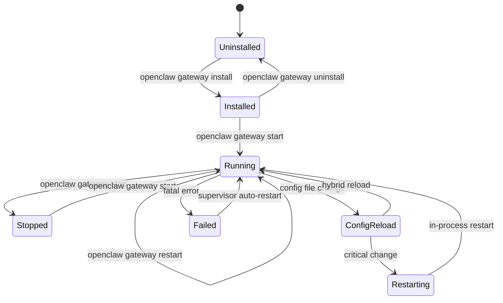

### Service Management Commands

```bash
# Install service (creates supervisor config)
openclaw gateway install --runtime node

# Check status (supervisor + RPC probe)
openclaw gateway status

# Lifecycle controls
openclaw gateway start
openclaw gateway stop
openclaw gateway restart

# Manual run (foreground, for debugging)
openclaw gateway --port 18789 --verbose

# Force restart (kill existing listener first)
openclaw gateway --force
```

**Service configuration paths:**

- macOS: `~/Library/LaunchAgents/bot.molt.openclaw.plist` (or profile-specific like `bot.molt.dev.plist`)
- Linux: `~/.config/systemd/user/openclaw-gateway.service` (or profile-specific like `openclaw-gateway-dev.service`)
- Windows: Task Scheduler task `OpenClaw Gateway` (or profile-specific)

**Code references:**

- Service resolution: [src/daemon/service.ts](), `resolveGatewayService()`
- Service interface: [src/daemon/service.ts](), abstract service methods `install()`, `start()`, `stop()`, `isLoaded()`, `isRunning()`
- macOS launchd implementation: [src/daemon/service.macos.ts](), label format `bot.molt.{profile}`
- Linux systemd implementation: [src/daemon/service.linux.ts](), unit name `openclaw-gateway{-profile}.service`
- Windows schtasks implementation: [src/daemon/service.windows.ts](), task name `OpenClaw Gateway{(profile)}`

**Sources:** [src/daemon/service.ts](), [src/daemon/service.macos.ts](), [src/daemon/service.linux.ts](), [src/daemon/service.windows.ts](), [src/commands/gateway.ts]()

---

## Configuration Hot Reload

The Gateway watches `openclaw.json` and applies changes without downtime when possible. The reload mode is controlled by `gateway.reload.mode`.

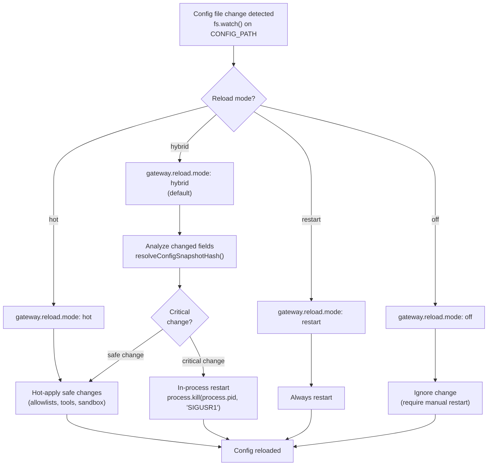

**Reload modes:**

- `hybrid` (default): Hot-apply safe changes, restart for critical changes
- `hot`: Always hot-apply with warnings for unsafe changes
- `restart`: Always restart on config change
- `off`: Require manual restart

**Critical changes (trigger restart in hybrid mode):**

- `gateway.port`, `gateway.bind`, `gateway.customBindHost`
- `gateway.auth.mode`, `gateway.auth.token`, `gateway.auth.password`
- Channel credentials and webhook URLs
- Model provider base URLs and API endpoints
- Agent workspace directory paths
- Sandbox Docker image configuration

**Safe hot-apply changes:**

- `channels.*.allowFrom`, `channels.*.groups`
- `tools.allow`, `tools.deny`, `tools.byProvider`
- `agents.*.tools`, sandbox tool policies
- `cron.jobs`, automation configuration
- Feature flags and non-critical settings

**Code references:**

- Config watcher: Gateway server config file watch implementation
- Hash comparison: [src/config/io.ts](), `resolveConfigSnapshotHash()`
- Reload logic: Gateway reload decision tree in server startup
- SIGUSR1 handler: Process signal handler for in-process restart

**Sources:** [src/gateway/server.ts](), [src/config/io.ts](), [src/config/config.ts]()

---

## Health Monitoring Surface

OpenClaw exposes health status through multiple surfaces. Each surface targets a different operational context.

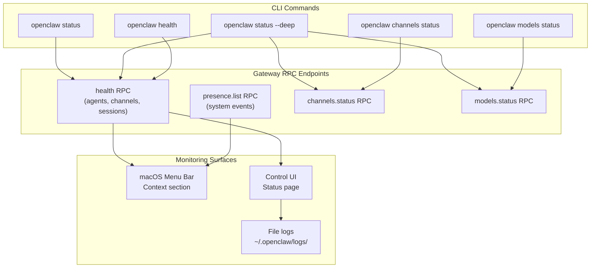

**Key status fields:**

- Gateway reachability: `openclaw gateway status` checks RPC probe
- Channel health: `openclaw channels status --probe` (WhatsApp/Telegram/Discord state)
- Model auth: `openclaw models status --probe` (OAuth expiry, API key validity)
- Session count: `openclaw status` shows active sessions
- System events: `openclaw system presence` shows recent events

**Sources:** [docs/cli/index.md:515-541](), [docs/gateway/troubleshooting.md:14-30]()

---

## Doctor Command Workflow

The `openclaw doctor` command automates common repair tasks. It runs a series of checks and offers fixes for detected issues. The command is implemented in [src/commands/doctor.ts:65-313]() and orchestrates multiple sub-modules.

**Doctor Command Execution Flow**

```mermaid
graph TB
    Start["doctorCommand()<br/>src/commands/doctor.ts:65"]
    
    UpdateCheck["maybeOfferUpdateBeforeDoctor()<br/>src/commands/doctor-update.ts"]
    UIProtocol["maybeRepairUiProtocolFreshness()<br/>src/commands/doctor-ui.ts"]
    ConfigLoad["loadAndMaybeMigrateDoctorConfig()<br/>src/commands/doctor-config-flow.ts"]
    
    AuthCheck["noteAuthProfileHealth()<br/>src/commands/doctor-auth.ts:28-119"]
    LegacyState["detectLegacyStateMigrations()<br/>src/commands/doctor-state-migrations.ts:48-50"]
    StateIntegrity["noteStateIntegrity()<br/>src/commands/doctor-state-integrity.ts"]
    
    SandboxCheck["maybeRepairSandboxImages()<br/>src/commands/doctor-sandbox.ts:44"]
    ServiceCheck["maybeRepairGatewayServiceConfig()<br/>src/commands/doctor-gateway-services.ts:34-36"]
    SecurityCheck["noteSecurityWarnings()<br/>src/commands/doctor-security.ts"]
    
    GatewayHealth["checkGatewayHealth()<br/>src/commands/doctor-gateway-health.ts"]
    GatewayRepair["maybeRepairGatewayDaemon()<br/>src/commands/doctor-gateway-daemon-flow.ts"]
    
    SystemdLinger["ensureSystemdUserLingerInteractive()<br/>src/commands/systemd-linger.ts:56"]
    
    WriteConfig["writeConfigFile()<br/>applyWizardMetadata()"]
    WorkspaceCheck["noteWorkspaceBackupTip()<br/>src/commands/doctor-state-integrity.ts:46"]
    
    Start --> UpdateCheck
    UpdateCheck --> UIProtocol
    UIProtocol --> ConfigLoad
    
    ConfigLoad --> AuthCheck
    AuthCheck --> LegacyState
    LegacyState --> StateIntegrity
    
    StateIntegrity --> SandboxCheck
    SandboxCheck --> ServiceCheck
    ServiceCheck --> SecurityCheck
    
    SecurityCheck --> GatewayHealth
    GatewayHealth --> GatewayRepair
    
    GatewayRepair --> SystemdLinger
    SystemdLinger --> WriteConfig
    WriteConfig --> WorkspaceCheck
    
    WorkspaceCheck --> Done["Doctor complete"]
```

**Doctor prompter modes:**

```typescript
// src/commands/doctor-prompter.ts
type DoctorOptions = {
  nonInteractive?: boolean;  // Skip all prompts, only safe migrations
  yes?: boolean;             // Accept all defaults
  repair?: boolean;          // Apply recommended fixes without prompts
  force?: boolean;           // Apply aggressive repairs (overwrite custom configs)
  deep?: boolean;            // Scan system services for extra gateway installs
  generateGatewayToken?: boolean;  // Force token generation in automation
  workspaceSuggestions?: boolean;  // Show workspace backup/memory tips
};
```

**Common repair functions:**

| Function | File | Purpose |
|----------|------|---------|
| `maybeRepairAnthropicOAuthProfileId()` | [src/commands/doctor-auth.ts:26]() | Normalize OAuth profile IDs |
| `maybeRemoveDeprecatedCliAuthProfiles()` | [src/commands/doctor-auth.ts:25]() | Remove old CLI auth profiles |
| `runLegacyStateMigrations()` | [src/commands/doctor-state-migrations.ts:49]() | Migrate sessions/agent dir/WhatsApp auth |
| `maybeRepairGatewayServiceConfig()` | [src/commands/doctor-gateway-services.ts:34]() | Update supervisor configs (launchd/systemd/schtasks) |
| `maybeRepairSandboxImages()` | [src/commands/doctor-sandbox.ts:44]() | Rebuild or switch sandbox Docker images |
| `maybeRepairGatewayDaemon()` | [src/commands/doctor-gateway-daemon-flow.ts]() | Fix service runtime issues |
| `ensureSystemdUserLingerInteractive()` | [src/commands/systemd-linger.ts:56]() | Enable systemd lingering on Linux |

**Sources:** [src/commands/doctor.ts:65-313](), [src/commands/doctor-auth.ts](), [src/commands/doctor-state-migrations.ts](), [src/commands/doctor-gateway-services.ts](), [src/commands/doctor-sandbox.ts](), [src/commands/systemd-linger.ts](), [docs/gateway/doctor.md:1-279]()

---

## Configuration Management

Configuration lives in `~/.openclaw/openclaw.json` (or `OPENCLAW_CONFIG_PATH`). The CLI provides helpers for safe config edits.

### Configuration Precedence

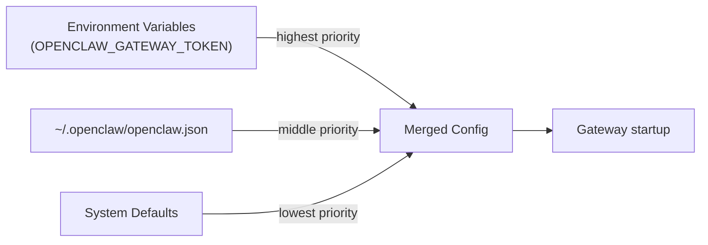

### Configuration Commands

```bash
# View current value
openclaw config get gateway.port

# Set value (JSON5 syntax)
openclaw config set agents.defaults.model "openai/gpt-4"
openclaw config set tools.allow '["read", "write", "exec"]'

# Remove value
openclaw config unset tools.exec.requireApproval

# Interactive wizard
openclaw configure

# Validate and apply via RPC (triggers reload)
openclaw gateway call config.apply --params '{"config": {...}, "baseHash": "..."}'
```

**Config validation:**

- Schema: [src/config/schema.ts](), Zod schemas
- Loader: [src/config/config.ts](), `readConfigFileSnapshot()`
- Migration: [src/commands/doctor-config-flow.ts](), `loadAndMaybeMigrateDoctorConfig()`

**Sources:** [src/config/config.ts](), [src/commands/configure.ts](), [docs/gateway/configuration.md]()

---

## Log Access Patterns

OpenClaw logs to multiple destinations depending on how the Gateway runs. Understanding log locations is critical for troubleshooting.

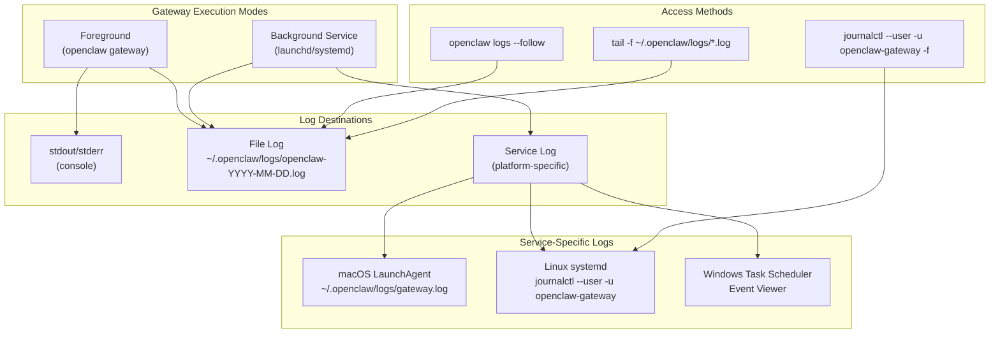

**Log commands:**

```bash
# Preferred (RPC-based, requires running Gateway)
openclaw logs --follow
openclaw logs --limit 200 --json

# Direct file access (always works)
tail -f "$(ls -t ~/.openclaw/logs/openclaw-*.log | head -1)"

# macOS LaunchAgent logs
tail -f ~/.openclaw/logs/gateway.log
tail -f ~/.openclaw/logs/gateway.err.log

# Linux systemd logs
journalctl --user -u openclaw-gateway.service -f -n 200

# Windows Task Scheduler
# Check Event Viewer → Task Scheduler History
```

**Log configuration:**

```json
{
  "logging": {
    "level": "info",
    "file": "~/.openclaw/logs/openclaw-{date}.log",
    "consoleLevel": "warn",
    "consoleStyle": "pretty"
  }
}
```

**Sources:** [docs/gateway/troubleshooting.md:95-124](), [docs/gateway/index.md:35-36]()

---

## Common Operational Patterns

### Pattern: Gateway Won't Start

**Symptom:** `openclaw gateway status` shows service loaded but RPC probe fails.

**Triage:**

```bash
# 1. Check supervisor state
openclaw gateway status

# 2. Check last gateway error in logs
openclaw logs --limit 50 | grep -i error

# 3. Run doctor
openclaw doctor
```

**Common causes:**

- `gateway.mode` not set to `"local"`: Fix with `openclaw config set gateway.mode local`
- Non-loopback bind without auth: Fix with `openclaw config set gateway.auth.token "..."`
- Port already in use: Fix with `openclaw gateway --force` or change port
- Invalid config: Fix with `openclaw doctor`

**Sources:** [docs/gateway/troubleshooting.md:122-215]()

---

### Pattern: Model Auth Expired

**Symptom:** Messages get no reply; logs show "No credentials found for profile".

**Triage:**

```bash
# Check auth status
openclaw models status

# Check for expiry
openclaw models status --probe
```

**Fix (Anthropic setup-token):**

```bash
# On gateway host
openclaw models auth setup-token --provider anthropic
openclaw models status
```

**Fix (OAuth refresh failed):**

```bash
# Re-run onboarding or paste new token
openclaw onboard
# or
openclaw models auth paste-token --provider anthropic
```

**Sources:** [docs/gateway/troubleshooting.md:39-73]()

---

### Pattern: Service Running But Config Mismatch

**Symptom:** `openclaw gateway status` shows different config paths for CLI vs service.

**Explanation:** The CLI and service use different config resolution. This happens when:

- Running CLI with `--profile` but service installed without it
- Running CLI with `OPENCLAW_STATE_DIR` set but service uses default
- Editing config after service install

**Diagnostic flow:**

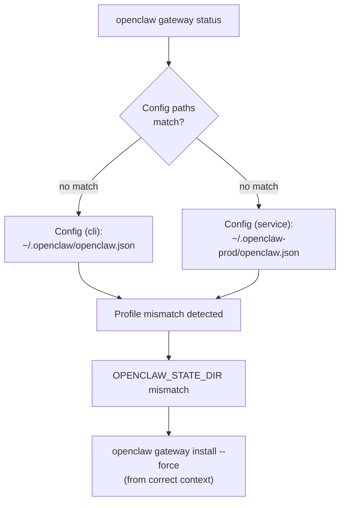

**Fix:**

```bash
# Reinstall service from same profile/state-dir context
openclaw gateway install --force

# Or restart from correct context
OPENCLAW_STATE_DIR=~/.openclaw-prod openclaw gateway restart
```

**Code references:**

- Config path resolution: [src/config/paths.ts](), `CONFIG_PATH` constant derived from `CONFIG_DIR`
- Profile state dir: [src/runtime.ts](), profile-specific state directory resolution
- Service install: [src/daemon/service.ts](), `install()` method with profile parameter
- Gateway status: [src/commands/gateway.ts](), status command with config path comparison

**Sources:** [docs/gateway/troubleshooting.md:162-214](), [src/config/paths.ts](), [src/runtime.ts](), [src/daemon/service.ts](), [src/commands/gateway.ts]()

---

### Pattern: Control UI "Unauthorized" Over HTTP

**Symptom:** Opening `http://<lan-ip>:18789/` shows "device identity required" or connect fails.

**Explanation:** Non-HTTPS contexts block WebCrypto, so device identity can't be generated.

**Fix options:**

1. Use HTTPS via Tailscale Serve:
   ```bash
   openclaw gateway --bind tailnet --tailscale serve
   # Open https://<magicdns>/
   ```

2. Use loopback (always HTTP-safe):
   ```bash
   # On gateway host
   open http://127.0.0.1:18789/
   ```

3. Allow insecure auth (token-only):
   ```json
   {
     "gateway": {
       "controlUi": {
         "allowInsecureAuth": true
       }
     }
   }
   ```

**Sources:** [docs/gateway/troubleshooting.md:76-87]()

---

## Session and State Integrity

OpenClaw maintains several types of state that must remain consistent. The `noteStateIntegrity()` function in [src/commands/doctor-state-integrity.ts]() validates these invariants.

**State Directory Structure and Integrity Checks**

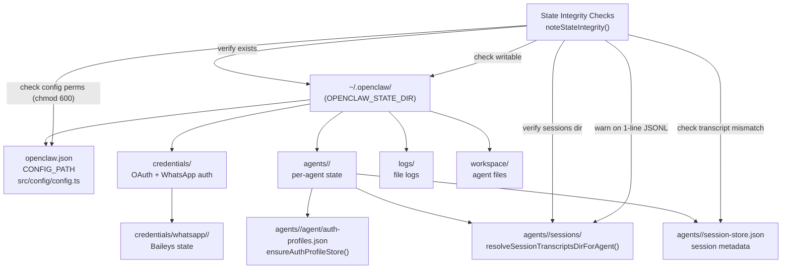

**State integrity checks performed by Doctor:**

| Check | Function | Purpose |
|-------|----------|---------|
| State dir exists | `noteStateIntegrity()` | Warn about catastrophic state loss |
| State dir writable | `noteStateIntegrity()` | Verify permissions, offer `chown` hint |
| Sessions dir exists | `resolveSessionTranscriptsDirForAgent()` | Ensure history persistence |
| Transcript mismatch | Session store validation | Warn when recent entries have missing files |
| 1-line main transcript | JSONL line count | Flag when main session isn't accumulating |
| Multiple state dirs | Directory scan | Warn when `~/openclaw` coexists with `~/.openclaw` |
| Config file perms | `fs.stat()` check | Warn if group/world readable, offer `chmod 600` |

**Code references for state management:**

- State dir resolution: [src/utils.ts](), `CONFIG_DIR` constant exported from config paths
- Session transcripts: [src/config/sessions.ts](), `resolveSessionTranscriptsDirForAgent()`, `resolveStorePath()`
- Session store: [src/config/sessions.ts](), `loadSessionStore()`, `saveSessionStore()`
- Auth profile store: [src/agents/auth-profiles.ts](), `ensureAuthProfileStore()`
- Config loading: [src/config/io.ts](), `readConfigFileSnapshot()`, `writeConfigFile()`
- Config validation: [src/config/validation.ts](), `validateConfigObjectWithPlugins()`
- State integrity checks: [src/commands/doctor-state-integrity.ts](), `noteStateIntegrity()`

**Sources:** [src/commands/doctor-state-integrity.ts](), [src/config/sessions.ts](), [src/agents/auth-profiles.ts](), [src/config/io.ts](), [src/config/validation.ts](), [src/utils.ts](), [docs/gateway/doctor.md:143-177]()

---

## Backup and State Management

**Minimal backup (config + auth only):**

```bash
tar czf openclaw-backup.tar.gz \
  ~/.openclaw/openclaw.json \
  ~/.openclaw/credentials/ \
  ~/.openclaw/agents/*/agent/auth-profiles.json
```

**Full backup (with sessions + workspace):**

```bash
tar czf openclaw-full-backup.tar.gz \
  ~/.openclaw/openclaw.json \
  ~/.openclaw/credentials/ \
  ~/.openclaw/agents/ \
  ~/.openclaw/workspace/
```

**Restore:**

```bash
tar xzf openclaw-backup.tar.gz -C ~/
openclaw doctor
openclaw gateway restart
```

**Sources:** [docs/help/faq.md:386-406]()

---

## Migration Between Machines

To move OpenClaw to a new machine (preserving sessions, auth, and memory):

1. Install OpenClaw on new machine
2. Copy state directory:
   ```bash
   # On old machine
   tar czf openclaw-state.tar.gz ~/.openclaw/
   
   # On new machine
   tar xzf openclaw-state.tar.gz -C ~/
   ```
3. Run doctor to validate:
   ```bash
   openclaw doctor
   ```
4. Restart service:
   ```bash
   openclaw gateway restart
   ```

**Important notes:**

- Workspace files contain memory; copy them to preserve agent memory
- Sessions are per-agent; copy `~/.openclaw/agents/<agentId>/sessions/`
- WhatsApp credentials are under `~/.openclaw/credentials/whatsapp/`
- OAuth tokens are in `auth-profiles.json` per agent

**Sources:** [docs/help/faq.md:386-406]()

---

## Multi-Gateway Operational Patterns

When running multiple isolated Gateways (rescue bot, dev/prod separation), each profile gets its own state directory, config file, and supervisor service.

**Multi-Gateway Isolation Architecture**

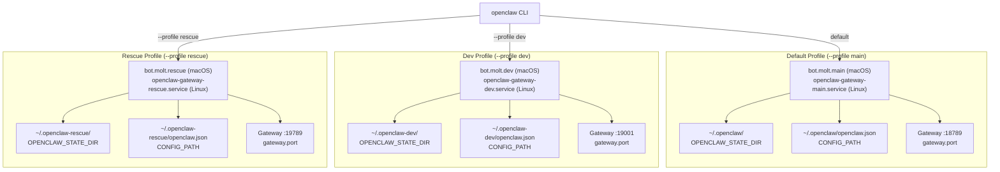

**Profile isolation commands:**

```bash
# Prod gateway (default profile)
openclaw gateway start

# Dev gateway (isolated profile, auto-derived ports)
openclaw --dev gateway --allow-unconfigured
# Defaults: port 19001, state dir ~/.openclaw-dev

# Custom profile (rescue bot)
openclaw --profile rescue gateway --port 19789

# Service install per profile
openclaw --profile prod gateway install --port 18789
openclaw --profile dev gateway install --port 19001
openclaw --profile rescue gateway install --port 19789

# Check which profile is active
openclaw status  # Shows "Profile: dev" when using --dev or --profile
```

**Service names by profile:**

| Platform | Service Name Pattern | Example (profile: rescue) |
|----------|---------------------|---------------------------|
| macOS launchd | `bot.molt.<profile>` | `bot.molt.rescue` |
| Linux systemd | `openclaw-gateway-<profile>.service` | `openclaw-gateway-rescue.service` |
| Windows schtasks | `OpenClaw Gateway (<profile>)` | `OpenClaw Gateway (rescue)` |

**Port spacing for profiles:**

The `--dev` flag uses auto-derived ports to avoid conflicts with the default profile:

| Port Type | Default Profile | Dev Profile (`--dev`) |
|-----------|----------------|---------------------|
| Gateway | 18789 | 19001 |
| Browser | 18791 | 19003 |
| Canvas | 18793 | 19005 |

**Code references:**

- Profile resolution: [src/runtime.ts](), `defaultRuntime` with profile property
- State dir by profile: [src/utils.ts](), `CONFIG_DIR` uses `OPENCLAW_STATE_DIR` or `~/.openclaw{-profile}`
- Service name generation: Platform-specific service implementations in [src/daemon/]()
- Port auto-increment: [src/config/config.ts](), `resolveGatewayPort()` with dev offset logic

**Sources:** [docs/gateway/multiple-gateways.md](), [src/daemon/service.ts](), [src/daemon/service.macos.ts](), [src/daemon/service.linux.ts](), [src/daemon/service.windows.ts](), [src/runtime.ts](), [src/utils.ts](), [src/config/config.ts]()

---

## Security Audit and Warnings

The CLI provides a security audit command that checks for common misconfigurations. Doctor also runs security checks automatically via `noteSecurityWarnings()` in [src/commands/doctor-security.ts]().

**Security Audit Commands**

```bash
# Local audit (config + state)
openclaw security audit

# Deep audit (probe running Gateway)
openclaw security audit --deep

# Auto-fix safe issues
openclaw security audit --fix
```

**Security checks performed:**

| Check | Function | Fix |
|-------|----------|-----|
| Gateway exposed without auth | `resolveGatewayAuth()` in [src/gateway/auth.ts]() | Set `gateway.auth.token` or `gateway.auth.password` |
| Weak DM policies | `noteSecurityWarnings()` in [src/commands/doctor-security.ts]() | Change `dmPolicy` to `"pairing"` or `"allowlist"` |
| Missing sandbox config | `noteSandboxScopeWarnings()` in [src/commands/doctor-sandbox.ts]() | Enable `agents.defaults.sandbox.mode: "non-main"` or `"all"` |
| World-readable config | `noteStateIntegrity()` in [src/commands/doctor-state-integrity.ts]() | Run `chmod 600 ~/.openclaw/openclaw.json` |
| Deprecated auth methods | Auth profile checks in [src/commands/doctor-auth.ts]() | Migrate to OAuth via `openclaw models auth add` |
| Open group policies | `noteSecurityWarnings()` in [src/commands/doctor-security.ts]() | Set `requireMention: true` or enable group allowlist |
| Elevated exec without restrictions | Security warnings | Add `tools.exec.elevated.allowFrom` restrictions |

**Common security warnings:**

The security audit checks for these risky configurations:

- `channels.*.dmPolicy === "open"` without allowlist (exposes bot to spam)
- `gateway.auth.mode === "off"` with non-loopback bind (unprotected network exposure)
- `gateway.bind === "lan"` without authentication (accessible from LAN)
- `tools.exec.elevated.enabled === true` without `allowFrom` restrictions (unrestricted root access)
- Group policies set to `"open"` without mention requirements (bot responds to all group messages)

**Code references:**

- Security warnings: [src/commands/doctor-security.ts](), `noteSecurityWarnings()` checks DM/group policies
- Sandbox scope warnings: [src/commands/doctor-sandbox.ts](), `noteSandboxScopeWarnings()` checks sandbox configuration
- State integrity: [src/commands/doctor-state-integrity.ts](), `noteStateIntegrity()` checks file permissions
- Gateway auth resolution: [src/gateway/auth.ts](), `resolveGatewayAuth()` determines effective auth mode
- Security audit command: [src/commands/security.ts](), orchestrates security checks

**Sources:** [docs/gateway/security.md](), [src/commands/security.ts](), [src/commands/doctor-security.ts](), [src/commands/doctor-sandbox.ts](), [src/commands/doctor-state-integrity.ts](), [src/gateway/auth.ts]()

---

## Operational Checklist for Production

**Pre-deployment:**

- [ ] Run `openclaw security audit --deep`
- [ ] Set `gateway.auth.token` (even for loopback)
- [ ] Configure channel allowlists or pairing
- [ ] Enable sandbox for untrusted sessions
- [ ] Set up log rotation
- [ ] Configure backup automation

**Post-deployment:**

- [ ] Verify `openclaw status --deep` shows healthy
- [ ] Test failover with `openclaw models status --probe`
- [ ] Confirm service auto-restart: `openclaw gateway stop && sleep 5 && openclaw gateway status`
- [ ] Test config hot-reload: edit `openclaw.json`, check logs
- [ ] Validate backup restore on a test machine

**Ongoing:**

- [ ] Weekly: `openclaw status --all` (check for expiring OAuth)
- [ ] Monthly: `openclaw doctor` (catch stale state)
- [ ] After updates: `openclaw doctor --deep` (validate service config)

**Sources:** [docs/gateway/security.md](), [docs/gateway/troubleshooting.md]()

---