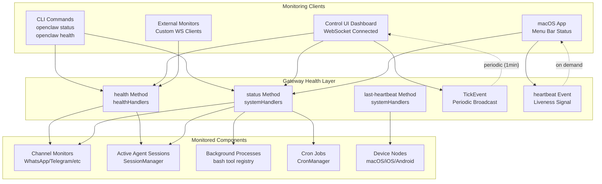
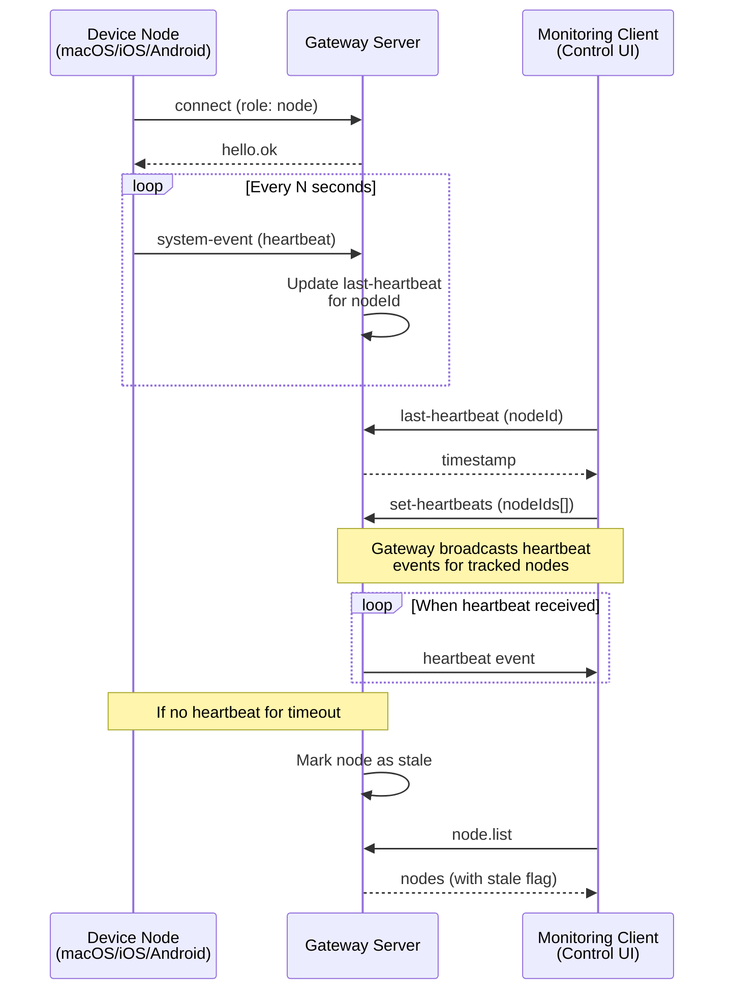
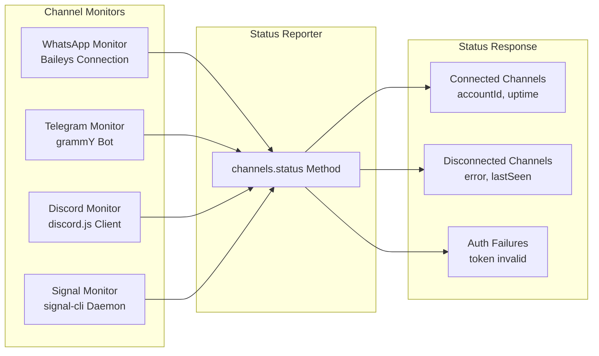
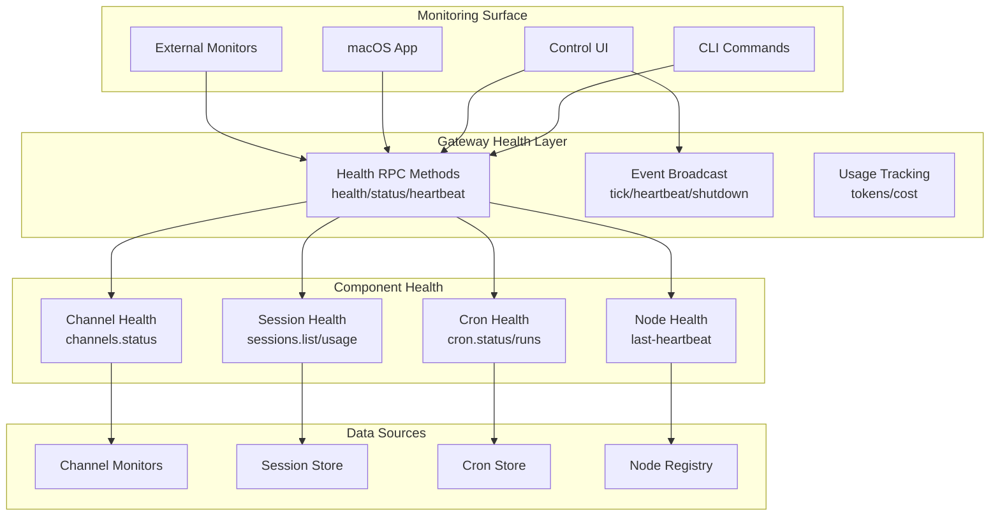

# Page: Health Monitoring

# Health Monitoring

<details>
<summary>Relevant source files</summary>

The following files were used as context for generating this wiki page:

- [README.md](README.md)
- [assets/avatar-placeholder.svg](assets/avatar-placeholder.svg)
- [docs/channels/zalo.md](docs/channels/zalo.md)
- [docs/channels/zalouser.md](docs/channels/zalouser.md)
- [scripts/clawtributors-map.json](scripts/clawtributors-map.json)
- [scripts/update-clawtributors.ts](scripts/update-clawtributors.ts)
- [scripts/update-clawtributors.types.ts](scripts/update-clawtributors.types.ts)
- [src/commands/agent.test.ts](src/commands/agent.test.ts)
- [src/commands/agent.ts](src/commands/agent.ts)
- [src/config/config.ts](src/config/config.ts)
- [src/cron/isolated-agent.ts](src/cron/isolated-agent.ts)
- [src/cron/run-log.test.ts](src/cron/run-log.test.ts)
- [src/cron/run-log.ts](src/cron/run-log.ts)
- [src/cron/store.ts](src/cron/store.ts)
- [src/gateway/protocol/index.ts](src/gateway/protocol/index.ts)
- [src/gateway/protocol/schema.ts](src/gateway/protocol/schema.ts)
- [src/gateway/protocol/schema/agents-models-skills.ts](src/gateway/protocol/schema/agents-models-skills.ts)
- [src/gateway/protocol/schema/protocol-schemas.ts](src/gateway/protocol/schema/protocol-schemas.ts)
- [src/gateway/protocol/schema/types.ts](src/gateway/protocol/schema/types.ts)
- [src/gateway/server-methods-list.ts](src/gateway/server-methods-list.ts)
- [src/gateway/server-methods.ts](src/gateway/server-methods.ts)
- [src/gateway/server-methods/agents.ts](src/gateway/server-methods/agents.ts)
- [src/gateway/server.ts](src/gateway/server.ts)
- [src/index.test.ts](src/index.test.ts)
- [src/index.ts](src/index.ts)
- [tsconfig.json](tsconfig.json)
- [ui/src/styles.css](ui/src/styles.css)
- [ui/src/styles/layout.mobile.css](ui/src/styles/layout.mobile.css)

</details>


Health monitoring in OpenClaw provides operational visibility into the Gateway, channels, sessions, and agent execution. It encompasses liveness checks, status endpoints, heartbeat mechanisms, and usage metrics exposed via WebSocket RPC and CLI commands. This system enables both automated monitoring and manual diagnostics.

For configuration of the Gateway itself, see [Gateway Configuration](#3.1). For troubleshooting procedures, see [Common Issues](#14.3).

---

## Health Check Architecture

The Gateway exposes multiple health and status methods through its WebSocket protocol, accessible to operator clients. These methods are read-scoped (no administrative privileges required) and provide real-time visibility into system state.



**Sources**: [src/gateway/server-methods.ts:13-14](), [src/gateway/server-methods.ts:52-76](), [src/gateway/server-methods-list.ts:3-91](), [src/gateway/protocol/schema.ts:1-17]()

---

## Gateway Health Method

The `health` method is the primary health check endpoint. It returns a lightweight status response indicating whether the Gateway is operational and ready to accept requests.

### Request Schema

```typescript
// No parameters required
method: "health"
params: {}
```

### Response Schema

The health handler responds with operational status and optionally includes component readiness:

| Field          | Type      | Description                              |
|----------------|-----------|------------------------------------------|
| `ok`           | `boolean` | Gateway is operational                   |
| `timestamp`    | `number`  | Server timestamp (ms since epoch)        |
| `version`      | `string`  | Gateway version (optional)               |
| `uptime`       | `number`  | Process uptime in seconds (optional)     |

### Authorization

- **Scope**: `operator.read` (or `operator.write`/`operator.admin`)
- **Role**: `operator` (not available to `node` role)
- Accessible to all authenticated operator connections

**Sources**: [src/gateway/server-methods.ts:52-76](), [src/gateway/server-methods.ts:93-163](), [src/gateway/server-methods-list.ts:4]()

---

## Heartbeat System

The heartbeat system tracks liveness of connected nodes and provides periodic liveness signals to monitoring clients.



### Last Heartbeat Method

Query the last heartbeat timestamp for a specific node:

```json5
{
  method: "last-heartbeat",
  params: {
    nodeId: "macbook-pro-m1"
  }
}
```

Response:
```json5
{
  timestamp: 1704067200000,  // ms since epoch
  age: 30000  // ms since last heartbeat
}
```

### Heartbeat Event

When a client subscribes via `set-heartbeats`, the Gateway emits `heartbeat` events:

```json5
{
  event: "heartbeat",
  data: {
    nodeId: "macbook-pro-m1",
    timestamp: 1704067200000
  }
}
```

**Sources**: [src/gateway/server-methods.ts:54-56](), [src/gateway/server-methods-list.ts:107](), [src/gateway/protocol/schema/frames.ts:89-90]()

---

## Status Method

The `status` method provides a comprehensive snapshot of Gateway state, including channel connectivity, active sessions, and resource usage.

### Request

```json5
{
  method: "status",
  params: {}  // or { verbose: true }
}
```

### Response Structure

| Field              | Type     | Description                           |
|--------------------|----------|---------------------------------------|
| `gateway`          | `object` | Gateway metadata                      |
| `gateway.version`  | `string` | OpenClaw version                      |
| `gateway.uptime`   | `number` | Process uptime (seconds)              |
| `gateway.pid`      | `number` | Process ID                            |
| `channels`         | `object` | Channel status map                    |
| `sessions`         | `object` | Session statistics                    |
| `sessions.active`  | `number` | Active agent sessions                 |
| `sessions.total`   | `number` | Total sessions in store               |
| `usage`            | `object` | Token/cost usage (if available)       |
| `cron`             | `object` | Cron job statistics                   |
| `nodes`            | `array`  | Connected device nodes                |

### Example Response

```json5
{
  gateway: {
    version: "2025.1.15",
    uptime: 86400,
    pid: 12345,
    bind: "loopback",
    port: 18789
  },
  channels: {
    whatsapp: { status: "connected", accountId: "default" },
    telegram: { status: "connected", accountId: "bot-token-123" },
    discord: { status: "disconnected", error: "token invalid" }
  },
  sessions: {
    active: 3,
    total: 47
  },
  cron: {
    jobs: 5,
    nextRun: 1704067800000
  },
  nodes: [
    { nodeId: "macbook-pro-m1", connected: true, capabilities: ["system.run", "camera.snap"] }
  ]
}
```

**Sources**: [src/gateway/server-methods.ts:55](), [src/gateway/server-methods-list.ts:8]()

---

## Usage Tracking

The Gateway tracks token usage and costs across sessions and models. Usage data is available via dedicated methods.

### Usage Status Method

```json5
{
  method: "usage.status",
  params: {
    sessionKey: "agent:main:main",  // optional: filter by session
    since: 1704067200000  // optional: timestamp filter
  }
}
```

Response includes:
- Total input/output tokens
- Cost breakdown by model/provider
- Session-level aggregates

### Usage Cost Method

```json5
{
  method: "usage.cost",
  params: {
    provider: "anthropic",  // optional: filter by provider
    model: "claude-opus-4-6"  // optional: filter by model
  }
}
```

**Sources**: [src/gateway/server-methods.ts:56-57](), [src/gateway/server-methods-list.ts:9-10]()

---

## Channel Status Monitoring

The `channels.status` method reports connectivity and health for all configured channels.



### Request

```json5
{
  method: "channels.status",
  params: {
    probe: true  // optional: trigger connection probe
  }
}
```

### Response

```json5
{
  channels: [
    {
      id: "whatsapp",
      accountId: "default",
      status: "connected",
      connectedAt: 1704067200000,
      uptime: 86400,
      lastMessage: 1704067195000
    },
    {
      id: "telegram",
      accountId: "bot-token-123",
      status: "disconnected",
      error: "polling error: network timeout",
      lastSeen: 1704067100000
    }
  ]
}
```

**Sources**: [src/gateway/server-methods.ts:53](), [src/gateway/server-methods-list.ts:7](), [src/gateway/protocol/schema/channels.ts:40-51]()

---

## Session Health Monitoring

The Gateway tracks active agent sessions and their resource consumption. Session health includes:

- **Active Sessions**: Ongoing agent executions
- **Token Usage**: Context window consumption per session
- **Session Locks**: Concurrent execution prevention
- **Compaction Status**: Whether sessions are approaching context limits

### Sessions List Method

```json5
{
  method: "sessions.list",
  params: {
    active: true  // optional: only active sessions
  }
}
```

Response includes per-session:
- `sessionId`, `sessionKey`
- `agentId`
- `model`, `provider`
- `tokenUsage` (input/output/total)
- `contextUsage` (percentage of context window)
- `lastActivity` (timestamp)
- `locked` (boolean, agent is running)

### Sessions Usage Method

Aggregate token usage across sessions:

```json5
{
  method: "sessions.usage",
  params: {
    agentId: "main",  // optional: filter by agent
    since: 1704000000000  // optional: time range
  }
}
```

**Sources**: [src/gateway/server-methods.ts:65-69](), [src/gateway/server-methods-list.ts:47-52](), [src/gateway/protocol/schema/sessions.ts:1-130]()

---

## Tick Events

The Gateway broadcasts periodic `tick` events to all connected clients. These events serve as liveness signals and provide a heartbeat for monitoring client connections.

### Tick Event Schema

```json5
{
  event: "tick",
  data: {
    timestamp: 1704067200000,
    uptime: 86400,
    activeSessions: 3
  }
}
```

### Tick Interval

- Default: **60 seconds**
- Configurable via Gateway implementation

Tick events are broadcast to all connected operator clients, enabling:
- Connection liveness detection
- Automatic reconnection triggers
- Dashboard refresh without polling

**Sources**: [src/gateway/protocol/schema/frames.ts:89-90](), [src/gateway/server-methods-list.ts:103-104]()

---

## Shutdown Events

When the Gateway initiates a graceful shutdown, it broadcasts a `shutdown` event to all connected clients. This allows clients to display shutdown notices and prepare for reconnection.

### Shutdown Event Schema

```json5
{
  event: "shutdown",
  data: {
    reason: "restart",  // or "manual", "signal", "error"
    timestamp: 1704067200000,
    gracePeriod: 5000  // ms before disconnect
  }
}
```

Clients receiving a shutdown event should:
1. Display a notification to the user
2. Stop sending new requests
3. Wait for the `gracePeriod` before reconnecting
4. Implement exponential backoff for reconnection attempts

**Sources**: [src/gateway/protocol/schema/frames.ts:89-90](), [src/gateway/server-methods-list.ts:105]()

---

## Cron Job Health

Cron jobs have their own health monitoring, accessible via `cron.status` and `cron.runs` methods.

### Cron Status Method

```json5
{
  method: "cron.status",
  params: {}
}
```

Response:
```json5
{
  jobs: [
    {
      id: "daily-backup",
      schedule: "0 2 * * *",
      enabled: true,
      nextRun: 1704067200000,
      lastRun: {
        timestamp: 1703980800000,
        status: "ok",
        durationMs: 1234
      }
    }
  ]
}
```

### Cron Runs Method

Retrieve execution history for a job:

```json5
{
  method: "cron.runs",
  params: {
    jobId: "daily-backup",
    limit: 10
  }
}
```

**Sources**: [src/gateway/server-methods.ts:72-79](), [src/gateway/server-methods-list.ts:73-79](), [src/cron/run-log.ts:1-122]()

---

## System Presence

The `system-presence` method provides a snapshot of all active system components, including:

- Connected WebSocket clients (operators, nodes)
- Active channel monitors
- Running agent sessions
- Background processes (bash tool)

### Request

```json5
{
  method: "system-presence",
  params: {}
}
```

### Response

```json5
{
  clients: [
    { clientId: "client-abc", role: "operator", connectedAt: 1704067200000 },
    { clientId: "node-macbook", role: "node", connectedAt: 1704067100000 }
  ],
  channels: [
    { id: "whatsapp", accountId: "default", status: "connected" }
  ],
  sessions: [
    { sessionKey: "agent:main:main", locked: true, runId: "run-xyz" }
  ],
  processes: [
    { processId: "proc-1", sessionKey: "agent:main:main", command: "npm run dev" }
  ]
}
```

**Sources**: [src/gateway/server-methods.ts:80](), [src/gateway/server-methods-list.ts:80]()

---

## CLI Health Commands

The OpenClaw CLI provides commands for manual health checks and diagnostics.

### openclaw status

```bash
openclaw status
```

Displays:
- Gateway version and uptime
- Channel connectivity (connected/disconnected)
- Active sessions count
- Node connections
- Cron job summary

### openclaw health

```bash
openclaw health
```

Performs a health check against the running Gateway:
- Connects to WebSocket
- Calls `health` method
- Verifies response
- Exits with code 0 (healthy) or 1 (unhealthy)

Suitable for monitoring scripts and health check probes.

### openclaw gateway status

```bash
openclaw gateway status
```

Reports Gateway process status from the system supervisor (launchd/systemd):
- Running/stopped state
- PID
- Restart count
- Last startup time

**Sources**: [README.md:268-276](), [README.md:439]()

---

## Control UI Health Dashboard

The Control UI (Web dashboard) displays real-time health status via WebSocket events:

- **Gateway Status Badge**: Green (connected), Yellow (degraded), Red (error)
- **Channel Status**: Per-channel connectivity indicators
- **Session Activity**: Active sessions count and recent activity
- **Heartbeat Indicator**: Visual pulse when tick events received

The UI subscribes to:
- `tick` events for liveness
- `presence` events for component updates
- `health` events (on demand)

**Sources**: [README.md:175-176](), [README.md:201-207]()

---

## Monitoring Best Practices

### Automated Health Checks

For production deployments, implement periodic health checks:

```bash
#!/bin/bash
# health-check.sh
if openclaw health; then
  echo "Gateway healthy"
  exit 0
else
  echo "Gateway unhealthy"
  # Optional: restart gateway
  openclaw gateway restart
  exit 1
fi
```

Run via cron or systemd timer:
```bash
*/5 * * * * /path/to/health-check.sh
```

### Heartbeat Monitoring

Monitor node heartbeats to detect stale connections:

1. Query `last-heartbeat` for critical nodes
2. If age > threshold (e.g., 5 minutes), alert
3. Optionally trigger node reconnection

### Usage Alerting

Set up alerts for resource exhaustion:

- Token usage approaching quotas (via `usage.cost`)
- Session context overflow (via `sessions.list` + `contextUsage`)
- Channel disconnections (via `channels.status`)

### Log Streaming

Use `logs.tail` for real-time log monitoring:

```json5
{
  method: "logs.tail",
  params: {
    follow: true,
    level: "error",  // filter by level
    subsystem: "channel.whatsapp"  // filter by subsystem
  }
}
```

**Sources**: [src/gateway/server-methods.ts:53](), [src/gateway/server-methods-list.ts:5](), [src/gateway/protocol/schema/logs-chat.ts:1-104]()

---

## Health Monitoring Architecture Summary



**Sources**: [src/gateway/server-methods.ts:1-220](), [src/gateway/server-methods-list.ts:1-118](), [src/gateway/protocol/index.ts:1-595]()

---