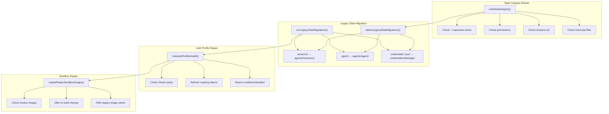
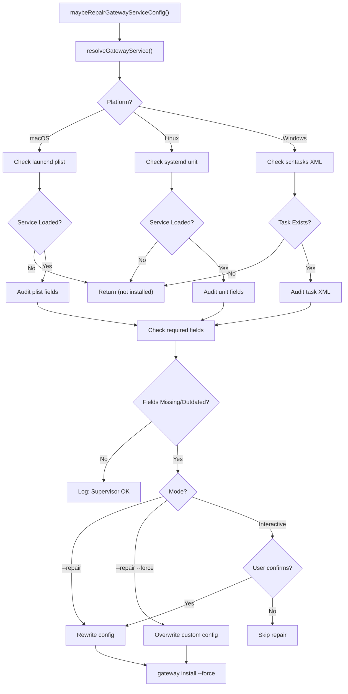
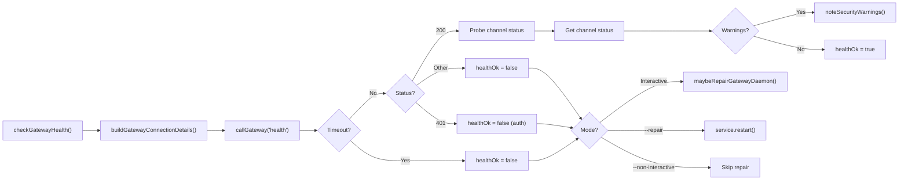
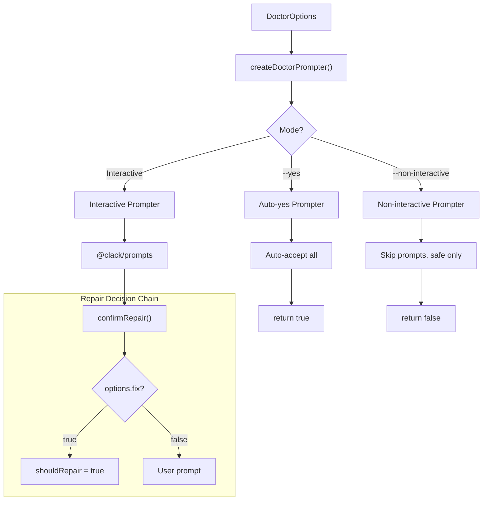
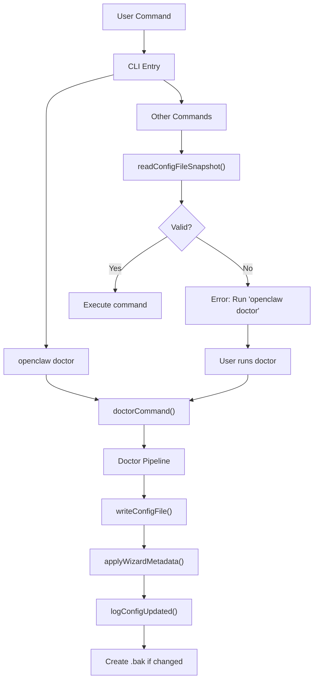

# Page: Doctor Command Guide

# Doctor Command Guide

Relevant source files

The following files were used as context for generating this wiki page:

- [docs/gateway/doctor.md](docs/gateway/doctor.md)
- [src/agents/bash-tools.test.ts](src/agents/bash-tools.test.ts)
- [src/agents/pi-tools-agent-config.test.ts](src/agents/pi-tools-agent-config.test.ts)
- [src/agents/sandbox-skills.test.ts](src/agents/sandbox-skills.test.ts)
- [src/commands/configure.gateway.test.ts](src/commands/configure.gateway.test.ts)
- [src/commands/configure.gateway.ts](src/commands/configure.gateway.ts)
- [src/commands/configure.ts](src/commands/configure.ts)
- [src/commands/doctor.ts](src/commands/doctor.ts)
- [src/commands/onboard-helpers.test.ts](src/commands/onboard-helpers.test.ts)
- [src/commands/onboard-helpers.ts](src/commands/onboard-helpers.ts)
- [src/commands/onboard-interactive.ts](src/commands/onboard-interactive.ts)
- [src/config/merge-config.ts](src/config/merge-config.ts)
- [src/wizard/onboarding.gateway-config.test.ts](src/wizard/onboarding.gateway-config.test.ts)
- [src/wizard/onboarding.gateway-config.ts](src/wizard/onboarding.gateway-config.ts)
- [src/wizard/onboarding.ts](src/wizard/onboarding.ts)
- [src/wizard/onboarding.types.ts](src/wizard/onboarding.types.ts)

This page documents the technical architecture and operation of the `openclaw doctor` command. Doctor is OpenClaw's diagnostic, repair, and migration tool that performs automated health checks, config normalization, state migrations, and system audits.

For general troubleshooting guidance, see [Common Issues](#14.3). For health monitoring concepts, see [Health Monitoring](#14.1). For config file structure, see [Configuration File Structure](#4.1).

---

## Purpose and Scope

The doctor command serves three primary functions:

1. **Config Migration**: Automatically migrates legacy config keys and normalizes config schema to current versions
2. **State Repair**: Detects and repairs on-disk state inconsistencies (sessions, credentials, workspace permissions)
3. **System Audit**: Validates gateway services, sandbox images, auth profiles, and supervisor configs

Doctor runs as an interactive wizard by default but supports fully automated modes for CI/CD and cron jobs. All repairs are reversible—doctor creates backups before modifying files.

Sources: [src/commands/doctor.ts:1-313]()

---

## Command Modes and Options

Doctor supports multiple execution modes controlled by CLI flags. The mode determines which checks run and whether repairs are applied automatically.

### Execution Modes

| Mode | Flags | Behavior |
|------|-------|----------|
| **Interactive** | (none) | Prompts for each repair decision; full checks |
| **Auto-fix** | `--fix` | Applies safe repairs without prompts; config migrations run automatically |
| **Auto-accept** | `--yes` | Accepts all default repair prompts; includes restarts and service repairs |
| **Repair-all** | `--repair` | Applies recommended repairs without prompting; skips aggressive fixes |
| **Repair-force** | `--repair --force` | Applies aggressive repairs including supervisor config overwrites |
| **Non-interactive** | `--non-interactive` | Runs without prompts; only safe migrations; skips user-confirmation steps |
| **Deep scan** | `--deep` | Scans system services for extra gateway installations (launchd/systemd/schtasks) |

### Additional Options

| Option | Purpose |
|--------|---------|
| `--generate-gateway-token` | Forces gateway token generation when auth is missing |
| `--workspace-suggestions=false` | Skips workspace backup and memory system suggestions |

Sources: [src/commands/doctor.ts:65-313](), [src/commands/doctor-prompter.ts:1-100](), [docs/gateway/doctor.md:1-283]()

---

## Doctor Execution Pipeline

Doctor follows a fixed pipeline of checks and repair operations. The pipeline is designed to handle dependencies: config must be valid before state checks, gateway must be healthy before channel checks.

### Execution Flow Diagram

```mermaid
flowchart TD
    Start["doctorCommand()"] --> Intro["intro('OpenClaw doctor')"]
    Intro --> Update["maybeOfferUpdateBeforeDoctor()"]
    
    Update --> UiProtocol["maybeRepairUiProtocolFreshness()"]
    UiProtocol --> SourceCheck["noteSourceInstallIssues()"]
    SourceCheck --> EnvCheck["noteDeprecatedLegacyEnvVars()"]
    
    EnvCheck --> LoadConfig["loadAndMaybeMigrateDoctorConfig()"]
    LoadConfig --> ConfigValid{Config Valid?}
    ConfigValid -->|No| Error["Error: Run doctor to repair"]
    ConfigValid -->|Yes| AuthRepair["Auth Profile Repairs"]
    
    AuthRepair --> AuthOAuth["maybeRepairAnthropicOAuthProfileId()"]
    AuthOAuth --> AuthCli["maybeRemoveDeprecatedCliAuthProfiles()"]
    AuthCli --> AuthHealth["noteAuthProfileHealth()"]
    
    AuthHealth --> GatewayAuth["Check Gateway Auth"]
    GatewayAuth --> TokenMissing{Token Missing?}
    TokenMissing -->|Yes| GenerateToken["Generate Token (if --generate-gateway-token)"]
    TokenMissing -->|No| StateMigration["Legacy State Migration"]
    GenerateToken --> StateMigration
    
    StateMigration --> Detect["detectLegacyStateMigrations()"]
    Detect --> HasLegacy{Has Legacy State?}
    HasLegacy -->|Yes| Migrate["runLegacyStateMigrations()"]
    HasLegacy -->|No| StateIntegrity["State Integrity Checks"]
    Migrate --> StateIntegrity
    
    StateIntegrity --> SandboxRepair["Sandbox Repairs"]
    SandboxRepair --> SandboxImages["maybeRepairSandboxImages()"]
    SandboxImages --> SandboxWarnings["noteSandboxScopeWarnings()"]
    
    SandboxWarnings --> ServiceScans["Service Scans"]
    ServiceScans --> ExtraServices["maybeScanExtraGatewayServices()"]
    ExtraServices --> ServiceConfig["maybeRepairGatewayServiceConfig()"]
    
    ServiceConfig --> PlatformChecks["Platform-Specific Checks"]
    PlatformChecks --> MacOverrides["noteMacLaunchAgentOverrides()"]
    MacOverrides --> MacEnv["noteMacLaunchctlGatewayEnvOverrides()"]
    
    MacEnv --> Security["noteSecurityWarnings()"]
    Security --> HooksModel["Validate hooks.gmail.model"]
    HooksModel --> Linger["systemd linger check (Linux)"]
    
    Linger --> WorkspaceStatus["noteWorkspaceStatus()"]
    WorkspaceStatus --> ShellCompletion["doctorShellCompletion()"]
    
    ShellCompletion --> GatewayHealth["checkGatewayHealth()"]
    GatewayHealth --> HealthOk{Gateway Healthy?}
    HealthOk -->|No| DaemonRepair["maybeRepairGatewayDaemon()"]
    HealthOk -->|Yes| WriteDecision{Should Write Config?}
    DaemonRepair --> WriteDecision
    
    WriteDecision -->|Yes| WriteConfig["writeConfigFile() + metadata"]
    WriteDecision -->|No| SkipWrite["Log: Run 'doctor --fix'"]
    
    WriteConfig --> WorkspaceTips["Workspace Tips"]
    SkipWrite --> WorkspaceTips
    WorkspaceTips --> FinalValidation["Final Config Validation"]
    FinalValidation --> Outro["outro('Doctor complete.')"]
```

Sources: [src/commands/doctor.ts:65-313]()

---

## Config Migration System

Doctor uses a modular migration system to update legacy config schemas. Migrations are idempotent and can run multiple times safely.

### Migration Pipeline

```mermaid
flowchart LR
    Load["readConfigFileSnapshot()"] --> Parse["Parse JSON"]
    Parse --> Validate["Zod Schema Validation"]
    Validate --> Valid{Valid?}
    
    Valid -->|Yes| Return["Return config"]
    Valid -->|No| Detect["Detect Legacy Keys"]
    
    Detect --> Legacy{Has Legacy Keys?}
    Legacy -->|No| Invalid["Return invalid snapshot"]
    Legacy -->|Yes| Migrate["Apply Migrations"]
    
    Migrate --> M1["routing.* → channels.*"]
    M1 --> M2["agent.* → agents.defaults.*"]
    M2 --> M3["identity → agents.list[].identity"]
    M3 --> M4["bindings[].match.accountID → accountId"]
    M4 --> M5["agent.model → agents.defaults.models"]
    
    M5 --> Revalidate["Re-validate"]
    Revalidate --> Success{Valid?}
    Success -->|Yes| Write["Write migrated config"]
    Success -->|No| Fail["Migration failed"]
    
    Write --> Return
```

### Key Migrations

The migration system handles these schema changes:

| Legacy Key | Current Key | Migration |
|------------|-------------|-----------|
| `routing.allowFrom` | `channels.whatsapp.allowFrom` | Moved to channel-specific config |
| `routing.groupChat.*` | `channels.*.groups.*` | Moved to per-channel group config |
| `routing.queue` | `messages.queue` | Renamed section |
| `routing.bindings` | `bindings` | Promoted to top-level |
| `identity` | `agents.list[].identity` | Moved to agent config |
| `agent.*` | `agents.defaults.*` | Renamed to plural + defaults |
| `agent.model` | `agents.defaults.model.primary` | Restructured to model config object |
| `bindings[].match.accountID` | `bindings[].match.accountId` | Camelcase fix |

Sources: [src/commands/doctor-config-flow.ts:1-200](), [docs/gateway/doctor.md:93-128]()

---

## State Repair Mechanisms

Doctor detects and repairs on-disk state issues through specialized repair modules.

### State Repair Architecture

### State Integrity Checks

Doctor validates these state invariants:

1. **State Directory**: `~/.openclaw` exists and is writable
2. **Session Persistence**: Sessions dir exists and transcripts are accessible
3. **Transcript Consistency**: Session store entries match transcript files
4. **Config Permissions**: `openclaw.json` is readable (warns if group/world-readable)
5. **Multiple State Dirs**: Warns if multiple `~/.openclaw` or `OPENCLAW_STATE_DIR` conflicts detected
6. **Remote Mode**: Reminds users to run doctor on remote host if `gateway.mode=remote`

Sources: [src/commands/doctor-state-integrity.ts:1-150](), [src/commands/doctor-state-migrations.ts:1-200](), [docs/gateway/doctor.md:154-178]()

---

## Supervisor Audit and Repair

Doctor audits platform-specific service supervisors (launchd, systemd, schtasks) and can repair outdated or missing service configs.

### Supervisor Repair Flow

### Audited Supervisor Fields

**systemd** (`~/.config/systemd/user/openclaw-gateway.service`):
- `After=network-online.target`
- `Wants=network-online.target`
- `RestartSec=5`
- `WorkingDirectory` set correctly
- Environment variables (`OPENCLAW_STATE_DIR`, `NODE_OPTIONS`)

**launchd** (`~/Library/LaunchAgents/ai.openclaw.gateway.plist`):
- `RunAtLoad=true`
- `KeepAlive=true`
- `StandardOutPath` and `StandardErrorPath` set
- `WorkingDirectory` matches current install
- Environment overrides detected (warns about `launchctl setenv`)

**schtasks** (Windows Task Scheduler):
- Trigger: At startup
- Action: Run `openclaw gateway run`
- Working directory set correctly

Sources: [src/commands/doctor-gateway-services.ts:1-250](), [src/daemon/service.ts:1-500](), [docs/gateway/doctor.md:240-276]()

---

## Health Checks and Diagnostics

Doctor performs runtime health checks and diagnostics to detect operational issues.

### Health Check Pipeline

### Gateway Daemon Repair

When the gateway is unhealthy, `maybeRepairGatewayDaemon()` offers repair actions:

1. **Port collision check**: Detects processes on gateway port (default `18789`)
2. **Service status**: Checks if service is installed but not running
3. **Last exit status**: Reports non-zero exits from supervisor logs
4. **Runtime detection**: Warns about Bun or version-manager Node paths
5. **Restart offer**: Prompts to restart gateway (auto-restarts in `--repair` mode)

Sources: [src/commands/doctor-gateway-health.ts:1-100](), [src/commands/doctor-gateway-daemon-flow.ts:1-200]()

---

## Interactive vs Non-Interactive Modes

Doctor supports both interactive prompts and fully automated operation. The mode determines which repairs are applied automatically.

### Prompter Architecture

### Repair Decision Matrix

| Check Type | Interactive | `--fix` | `--yes` | `--repair` | `--non-interactive` |
|------------|-------------|---------|---------|------------|---------------------|
| Config migration | Prompt | Auto | Auto | Auto | Auto |
| Legacy state migration | Prompt | Auto | Auto | Auto | Auto |
| Auth profile refresh | Prompt | Skip | Auto | Auto | Skip |
| Gateway token generation | Prompt | Skip | Auto | Skip | Skip |
| Sandbox image build | Prompt | Skip | Auto | Auto | Skip |
| Gateway restart | Prompt | Skip | Auto | Auto | Skip |
| Supervisor config rewrite | Prompt | Skip | Auto | Auto | Skip |
| Aggressive supervisor rewrite | Prompt | Skip | Auto | `--force` | Skip |

Sources: [src/commands/doctor-prompter.ts:1-100](), [src/commands/doctor.ts:65-313]()

---

## CLI Integration

Doctor is invoked via the CLI and can be triggered by other commands when they detect invalid config.

### Invocation Paths

### Gateway Auto-Repair

The gateway also auto-runs config migrations on startup:

1. Gateway starts → `loadAndMaybeMigrateDoctorConfig()`
2. If legacy keys detected → Apply migrations automatically
3. Write migrated config → Log migration
4. Continue startup with migrated config

This ensures stale configs are repaired without manual `doctor` invocation, but only for config schema migrations (state repairs still require explicit `doctor` runs).

Sources: [src/commands/doctor.ts:65-313](), [src/wizard/onboarding.ts:90-119](), [docs/gateway/doctor.md:93-128]()

---

## Exit Conditions and Error Handling

Doctor uses specific exit codes and error messages to communicate repair outcomes.

### Exit Scenarios

| Condition | Action | Exit Code |
|-----------|--------|-----------|
| Config invalid before migration | Error message + suggest doctor | `1` |
| Config invalid after migration | Error details + migration failure | `1` |
| User cancels interactive prompt | Cancel message | `0` (graceful) |
| Repair succeeds | Outro message | `0` |
| Non-interactive + unsafe action | Skip action, continue | `0` |

### Config Write Decisions

Doctor decides whether to write the config based on:

1. `prompter.shouldRepair` flag (set by `--fix`, `--repair`, or user confirmations)
2. `configResult.shouldWriteConfig` (set by migration system)
3. Any repair was applied (auth, sandbox, gateway, etc.)

If `shouldWriteConfig = false` and repairs were suggested:
- Log: `Run "openclaw doctor --fix" to apply changes.`
- Create backup: `~/.openclaw/openclaw.json.bak`

Sources: [src/commands/doctor.ts:282-312](), [src/commands/doctor-prompter.ts:1-100]()

---

## Related Commands

Doctor integrates with several related commands:

- **`openclaw onboard`** ([2.3](#2.3)): Can suggest running doctor for invalid configs before starting onboarding
- **`openclaw configure`** ([4.2](#4.2)): Manual config editing; doctor fixes schema issues afterward
- **`openclaw gateway install`** ([12.1](#12.1)): Reinstalls supervisor configs; doctor audits installed configs
- **`openclaw update`** ([Development](#15)): Doctor offers to update before running (git installs only)

Sources: [src/commands/doctor.ts:79-88](), [src/wizard/onboarding.ts:102-119]()

---