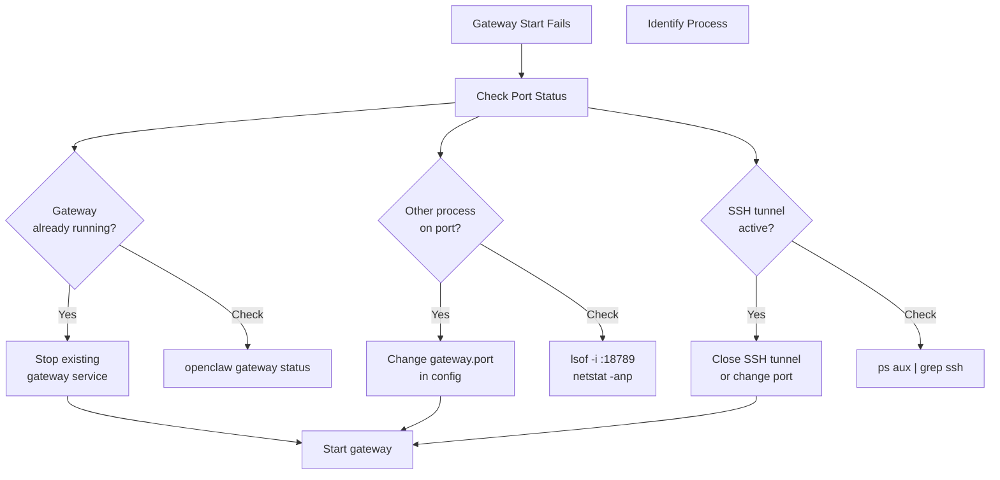
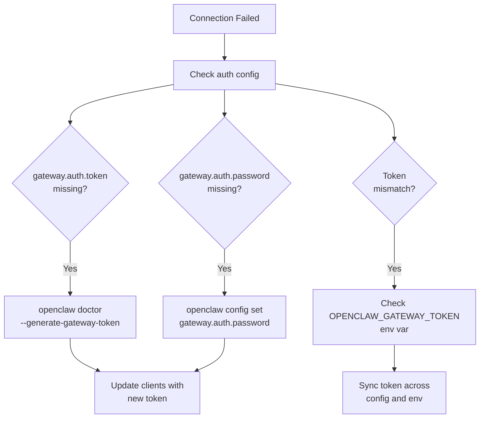
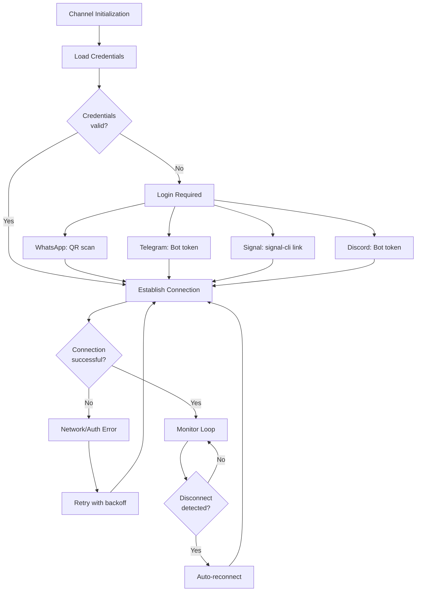
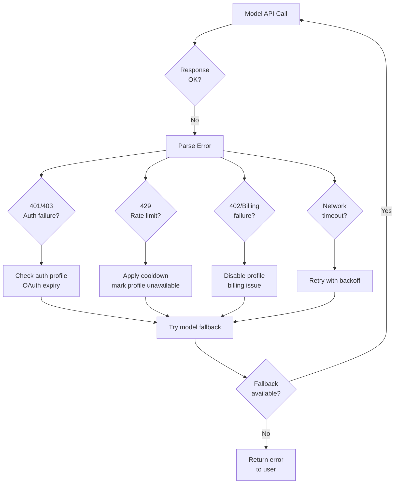
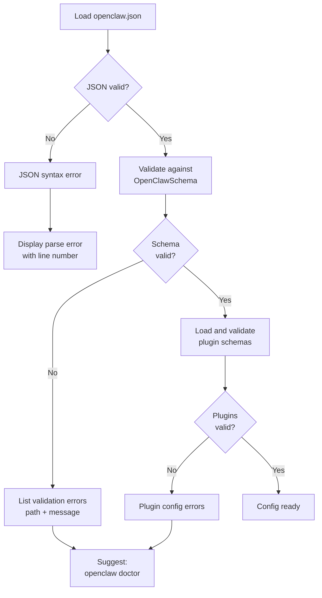
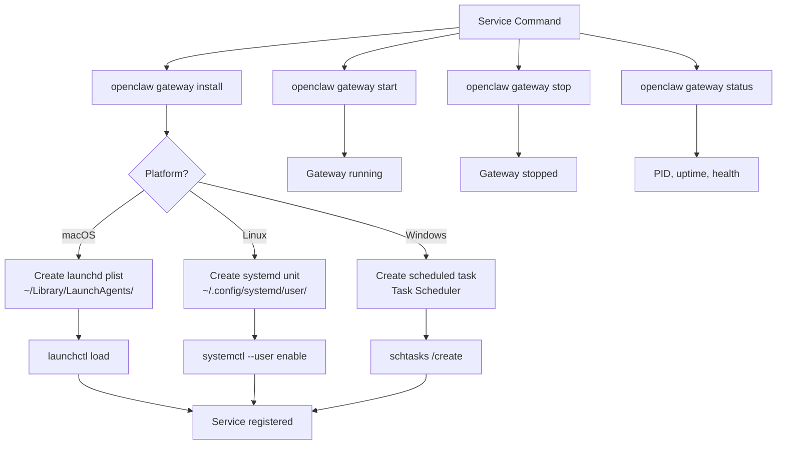
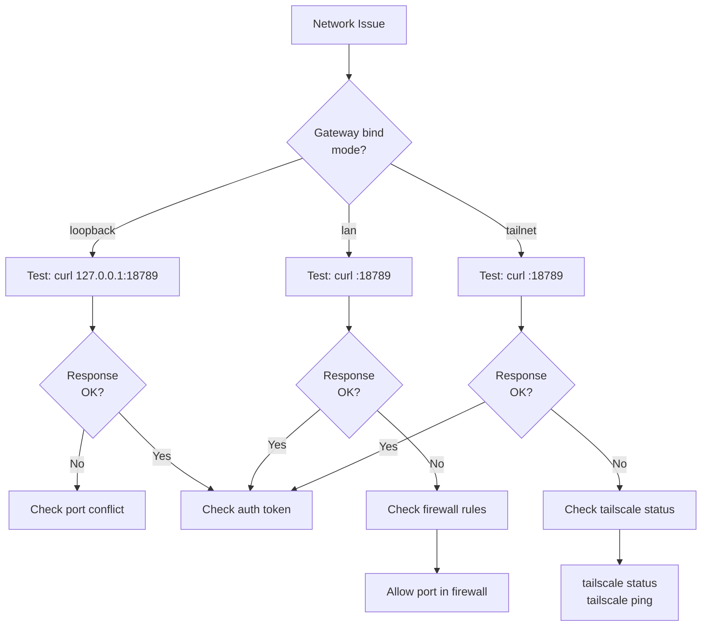
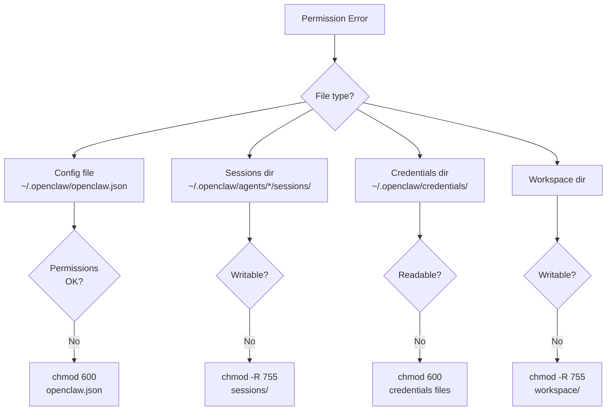

# Page: Common Issues

# Common Issues

<details>
<summary>Relevant source files</summary>

The following files were used as context for generating this wiki page:

- [README.md](README.md)
- [assets/avatar-placeholder.svg](assets/avatar-placeholder.svg)
- [docs/channels/zalo.md](docs/channels/zalo.md)
- [docs/channels/zalouser.md](docs/channels/zalouser.md)
- [docs/gateway/doctor.md](docs/gateway/doctor.md)
- [scripts/clawtributors-map.json](scripts/clawtributors-map.json)
- [scripts/update-clawtributors.ts](scripts/update-clawtributors.ts)
- [scripts/update-clawtributors.types.ts](scripts/update-clawtributors.types.ts)
- [src/agents/bash-tools.test.ts](src/agents/bash-tools.test.ts)
- [src/agents/pi-tools-agent-config.test.ts](src/agents/pi-tools-agent-config.test.ts)
- [src/agents/sandbox-skills.test.ts](src/agents/sandbox-skills.test.ts)
- [src/commands/configure.gateway.test.ts](src/commands/configure.gateway.test.ts)
- [src/commands/configure.gateway.ts](src/commands/configure.gateway.ts)
- [src/commands/configure.ts](src/commands/configure.ts)
- [src/commands/doctor.ts](src/commands/doctor.ts)
- [src/commands/onboard-helpers.test.ts](src/commands/onboard-helpers.test.ts)
- [src/commands/onboard-helpers.ts](src/commands/onboard-helpers.ts)
- [src/commands/onboard-interactive.ts](src/commands/onboard-interactive.ts)
- [src/config/config.ts](src/config/config.ts)
- [src/config/merge-config.ts](src/config/merge-config.ts)
- [src/index.test.ts](src/index.test.ts)
- [src/index.ts](src/index.ts)
- [src/wizard/onboarding.gateway-config.test.ts](src/wizard/onboarding.gateway-config.test.ts)
- [src/wizard/onboarding.gateway-config.ts](src/wizard/onboarding.gateway-config.ts)
- [src/wizard/onboarding.ts](src/wizard/onboarding.ts)
- [src/wizard/onboarding.types.ts](src/wizard/onboarding.types.ts)
- [tsconfig.json](tsconfig.json)
- [ui/src/styles.css](ui/src/styles.css)
- [ui/src/styles/layout.mobile.css](ui/src/styles/layout.mobile.css)

</details>


This page documents frequently encountered problems and their solutions. It covers operational failures that occur during gateway startup, runtime, and channel communication.

For proactive health monitoring, see [Health Monitoring](#14.1). For automated repair workflows, see [Doctor Command Guide](#14.2). For data preservation and version upgrades, see [Migration and Backup](#14.4).

---

## Port Conflicts

### Symptoms

Gateway fails to start with:
```
Error: Port 18789 is already in use
```

Or:
```
EADDRINUSE: address already in use
```

### Diagnosis Flow



**Sources:** [src/infra/ports.ts](), [src/index.ts:26-29]()

### Port Conflict Resolution

| Scenario | Detection | Solution |
|----------|-----------|----------|
| **Gateway already running** | `openclaw gateway status` shows `running` | `openclaw gateway restart` |
| **Multiple gateway instances** | Multiple PIDs in process list | `openclaw doctor --deep` to scan services, remove extras |
| **SSH tunnel collision** | `ps aux \| grep "ssh.*18789"` shows matches | Close tunnel or use different local port |
| **Other service** | `lsof -i :18789` shows non-gateway process | Change `gateway.port` in config or stop other service |

### Code References

Port availability check:
```typescript
// src/infra/ports.ts
ensurePortAvailable(port: number)
handlePortError(error: unknown, port: number)
class PortInUseError extends Error
```

Port owner detection:
```typescript
// src/infra/ports.ts
describePortOwner(port: number): Promise<string>
```

**Sources:** [src/infra/ports.ts](), [src/commands/doctor.ts:256-262]()

### Platform-Specific Commands

**macOS/Linux:**
```bash
# Find process using port
lsof -i :18789

# Change port in config
openclaw config set gateway.port 18790
```

**Windows:**
```powershell
# Find process using port
netstat -ano | findstr :18789

# Change port in config
openclaw config set gateway.port 18790
```

**Sources:** [src/infra/ports.ts](), [src/commands/onboard-helpers.ts:360-416]()

---

## Authentication Errors

### Gateway Connection Failures



**Sources:** [src/commands/doctor.ts:125-159](), [src/gateway/auth.ts]()

### Common Auth Scenarios

| Error | Cause | Solution |
|-------|-------|----------|
| `Unauthorized` | Token mismatch between gateway and client | Check `gateway.auth.token` matches `OPENCLAW_GATEWAY_TOKEN` |
| `Missing authentication` | `gateway.auth.mode` is `token` but no token set | Run `openclaw doctor --generate-gateway-token` |
| `Invalid password` | Password mismatch | Verify `gateway.auth.password` or `OPENCLAW_GATEWAY_PASSWORD` |
| `Token auth required` | Client trying password auth when gateway expects token | Set correct `gateway.auth.mode` |

### Configuration Keys

```typescript
// Config schema keys
gateway.auth.mode: "token" | "password" | "off"
gateway.auth.token: string
gateway.auth.password: string
gateway.auth.allowTailscale: boolean
```

### Doctor Auto-Repair

The doctor command detects missing tokens and offers to generate one:

```typescript
// src/commands/doctor.ts:125-159
const needsToken = auth.mode !== "password" && (auth.mode !== "token" || !auth.token);
if (needsToken) {
  const nextToken = randomToken();
  cfg = {
    ...cfg,
    gateway: {
      ...cfg.gateway,
      auth: { mode: "token", token: nextToken }
    }
  };
}
```

**Sources:** [src/commands/doctor.ts:125-159](), [src/commands/onboard-helpers.ts:68-77](), [src/gateway/auth.ts]()

---

## Channel Connection Issues

### Channel State Diagram



**Sources:** [src/channels/](), [src/wizard/onboarding.ts:434-450]()

### WhatsApp (Baileys) Issues

| Issue | Symptoms | Solution |
|-------|----------|----------|
| **QR code expired** | No connection after scan | Re-run `openclaw channels login --channel whatsapp` |
| **Session invalid** | "Session closed" errors | Clear `~/.openclaw/credentials/whatsapp/` and re-login |
| **Phone disconnected** | Messages stop flowing | Check phone has internet, re-pair if needed |
| **Multi-device limit** | Login fails | Unlink old devices in WhatsApp settings |

Credentials path:
```
~/.openclaw/credentials/whatsapp/<accountId>/
  ├── creds.json
  ├── keys.json
  └── ...
```

**Sources:** [README.md:335-339](), [src/commands/doctor.ts:142-153]()

### Telegram Bot Issues

| Issue | Symptoms | Solution |
|-------|----------|----------|
| **Invalid bot token** | `401 Unauthorized` | Verify `TELEGRAM_BOT_TOKEN` or `channels.telegram.botToken` |
| **Bot not responding** | No messages received | Check bot is not blocked by user, check allowlist |
| **Webhook conflicts** | Polling fails | Clear webhook: remove `channels.telegram.webhookUrl` |
| **Rate limiting** | `429 Too Many Requests` | Reduce message frequency, respect Telegram limits |

**Sources:** [README.md:341-354](), [src/channels/telegram.ts]()

### Signal Issues

| Issue | Symptoms | Solution |
|-------|----------|----------|
| **signal-cli not found** | `ENOENT` error | Install signal-cli: `brew install signal-cli` or from AUR |
| **Not registered** | "Not registered" error | Run `signal-cli -a +YOUR_NUMBER register` |
| **Daemon not running** | No messages received | Check `signal-cli daemon` is running |
| **Permission denied** | Cannot read socket | Check permissions on `~/.local/share/signal-cli/` |

Signal requires the daemon mode:
```bash
signal-cli -a +YOUR_NUMBER daemon
```

**Sources:** [README.md:375-377](), [docs/channels/troubleshooting.md]()

### Discord Bot Issues

| Issue | Symptoms | Solution |
|-------|----------|----------|
| **Invalid token** | `401 Unauthorized` | Verify `DISCORD_BOT_TOKEN` or `channels.discord.token` |
| **Missing intents** | No message events | Enable Message Content Intent in Discord Developer Portal |
| **Missing permissions** | Cannot send messages | Check bot has Send Messages permission in channel |
| **Rate limiting** | `429` responses | Respect Discord rate limits, reduce message frequency |

Required intents:
- `GUILDS`
- `GUILD_MESSAGES`
- `DIRECT_MESSAGES`
- `MESSAGE_CONTENT`

**Sources:** [README.md:360-373](), [src/channels/discord.ts]()

### Channel Health Probe

Doctor command probes channel health:

```typescript
// src/commands/doctor.ts:268-280
const { healthOk } = await checkGatewayHealth({
  runtime,
  cfg,
  timeoutMs: options.nonInteractive === true ? 3000 : 10_000,
});
```

**Sources:** [src/commands/doctor.ts:268-280](), [src/commands/doctor-gateway-health.ts]()

---

## Model Provider Failures

### Model Failure Resolution



**Sources:** [src/agents/model-selection.ts](), [src/agents/model-catalog.ts]()

### Auth Profile Issues

| Error | Cause | Detection | Solution |
|-------|-------|-----------|----------|
| **Token expired** | OAuth token past expiry | `openclaw doctor` checks expiry | Refresh token or re-authenticate |
| **Invalid API key** | Key revoked or incorrect | `401 Unauthorized` | Update `models.providers.<provider>.apiKey` |
| **Billing failure** | Payment issue, quota exceeded | `402`, `403` quota errors | Check provider billing, update payment |
| **Rate limit** | Too many requests | `429 Too Many Requests` | Wait for cooldown, check rate limits |

### Doctor Auth Health Check

```typescript
// src/commands/doctor.ts:113-119
cfg = await maybeRepairAnthropicOAuthProfileId(cfg, prompter);
cfg = await maybeRemoveDeprecatedCliAuthProfiles(cfg, prompter);
await noteAuthProfileHealth({
  cfg,
  prompter,
  allowKeychainPrompt: options.nonInteractive !== true && Boolean(process.stdin.isTTY),
});
```

**Sources:** [src/commands/doctor.ts:113-119](), [src/commands/doctor-auth.ts]()

### Model Fallback Chain

When primary model fails, OpenClaw tries fallbacks:

```typescript
// Model resolution chain
agents.defaults.model.primary → 
  agents.defaults.model.fallbacks[0] →
  agents.defaults.model.fallbacks[1] →
  ... →
  DEFAULT_MODEL
```

Configure fallbacks:
```json5
{
  agents: {
    defaults: {
      model: {
        primary: "anthropic/claude-opus-4-6",
        fallbacks: [
          "anthropic/claude-sonnet-4-6",
          "openai/gpt-4o"
        ]
      }
    }
  }
}
```

**Sources:** [src/agents/model-selection.ts](), [src/agents/defaults.ts:5-6]()

### Model Catalog Issues

| Issue | Symptoms | Solution |
|-------|----------|----------|
| **Model not in catalog** | "Model not found" | Check model key, update catalog if custom model |
| **Model not in allowlist** | Falls back to primary | Add to `agents.defaults.models` array |
| **Provider not configured** | API errors | Set API key in `models.providers.<provider>.apiKey` |
| **Invalid model ref** | Parsing error | Use format `provider/model-id` |

**Sources:** [src/agents/model-catalog.ts](), [src/commands/doctor.ts:197-233]()

---

## Configuration Problems

### Config Validation Flow



**Sources:** [src/config/validation.ts](), [src/config/zod-schema.ts](), [src/wizard/onboarding.ts:99-119]()

### Common Config Errors

| Error | Cause | Detection | Solution |
|-------|-------|-----------|----------|
| **Invalid JSON** | Syntax error, trailing commas | Parse fails | Fix JSON syntax, use JSON5 for comments |
| **Unknown keys** | Typo or deprecated key | Zod validation | Remove unknown keys, check docs |
| **Type mismatch** | Wrong type for value | Zod validation | Fix value type (string vs number, etc) |
| **Missing required** | Required field omitted | Zod validation | Add required field |
| **Legacy format** | Old config schema | Doctor detects | Run `openclaw doctor` to migrate |

### Config File Locations

```
~/.openclaw/
  ├── openclaw.json          # Main config
  ├── openclaw.json.bak      # Backup from last write
  └── credentials/           # Auth tokens
      ├── oauth.json
      ├── whatsapp/
      └── ...
```

**Sources:** [src/config/paths.ts](), [src/config/io.ts]()

### Validation Error Format

```typescript
// src/config/validation.ts
type ConfigIssue = {
  path: string;           // e.g., "gateway.port"
  message: string;        // Error description
  code?: string;          // Zod error code
};
```

When validation fails:
```
Invalid config:
- gateway.port: Expected number, received string
- channels.whatsapp.allowFrom: Required
```

**Sources:** [src/config/validation.ts:1-14](), [src/wizard/onboarding.ts:103-112]()

### Config Migration

Legacy config keys are auto-migrated:

| Old Key | New Key |
|---------|---------|
| `routing.allowFrom` | `channels.whatsapp.allowFrom` |
| `routing.queue` | `messages.queue` |
| `agent.model` | `agents.defaults.model.primary` |
| `agent.tools.*` | `tools.*` |
| `identity` | `agents.list[].identity` |

**Sources:** [src/config/legacy-migrate.ts](), [docs/gateway/doctor.md:112-128]()

### Doctor Config Repair

```typescript
// src/commands/doctor.ts:94-111
const configResult = await loadAndMaybeMigrateDoctorConfig({
  options,
  confirm: (p) => prompter.confirm(p),
});
let cfg: OpenClawConfig = configResult.cfg;

const configPath = configResult.path ?? CONFIG_PATH;
if (!cfg.gateway?.mode) {
  const lines = [
    "gateway.mode is unset; gateway start will be blocked.",
    `Fix: run ${formatCliCommand("openclaw configure")} and set Gateway mode (local/remote).`,
  ];
  note(lines.join("\n"), "Gateway");
}
```

**Sources:** [src/commands/doctor.ts:94-111](), [src/commands/doctor-config-flow.ts]()

---

## Service and Daemon Issues

### Service State Management



**Sources:** [src/daemon/service.ts](), [src/commands/gateway-service.ts]()

### Service Troubleshooting

| Issue | Platform | Detection | Solution |
|-------|----------|-----------|----------|
| **Service not found** | All | `openclaw gateway status` shows "not installed" | Run `openclaw gateway install` |
| **Service won't start** | All | Status shows "failed" | Check logs: `openclaw logs --follow` |
| **Permission denied** | macOS | `launchctl load` fails | Check plist permissions |
| **Service exits immediately** | Linux | systemd shows "inactive (dead)" | Check `journalctl --user -u openclaw-gateway` |
| **Stale PID** | All | PID exists but process dead | Remove lock file, restart service |

### Platform-Specific Commands

**macOS (launchd):**
```bash
# Check service status
launchctl list | grep openclaw

# View logs
tail -f ~/Library/Logs/openclaw/gateway.log

# Reload service after config change
launchctl kickstart gui/$UID/ai.openclaw.gateway
```

**Linux (systemd):**
```bash
# Check service status
systemctl --user status openclaw-gateway

# View logs
journalctl --user -u openclaw-gateway -f

# Reload service
systemctl --user restart openclaw-gateway
```

**Windows (Task Scheduler):**
```powershell
# Check task status
Get-ScheduledTask -TaskName "OpenClaw Gateway"

# View logs
Get-EventLog -LogName Application -Source "OpenClaw" -Newest 50
```

**Sources:** [src/daemon/launchd.ts](), [src/daemon/systemd.ts](), [src/daemon/windows-task.ts]()

### systemd Linger (Linux)

When the gateway service stops after logout:

```bash
# Check linger status
loginctl show-user $USER | grep Linger

# Enable linger
sudo loginctl enable-linger $USER
```

Doctor auto-checks this:
```typescript
// src/commands/doctor.ts:236-259
if (process.platform === "linux" && resolveMode(cfg) === "local") {
  await ensureSystemdUserLingerInteractive({
    runtime,
    prompter: { confirm, note },
    reason: "Gateway runs as a systemd user service...",
    requireConfirm: true,
  });
}
```

**Sources:** [src/commands/doctor.ts:236-259](), [src/commands/systemd-linger.ts]()

### Service Health Check

```typescript
// src/daemon/service.ts
interface GatewayService {
  install(params: { env?: NodeJS.ProcessEnv }): Promise<void>;
  uninstall(params: { env?: NodeJS.ProcessEnv }): Promise<void>;
  start(params: { env?: NodeJS.ProcessEnv }): Promise<void>;
  stop(params: { env?: NodeJS.ProcessEnv }): Promise<void>;
  restart(params: { env?: NodeJS.ProcessEnv }): Promise<void>;
  isLoaded(params: { env?: NodeJS.ProcessEnv }): Promise<boolean>;
  isRunning(params: { env?: NodeJS.ProcessEnv }): Promise<boolean>;
}
```

**Sources:** [src/daemon/service.ts](), [src/commands/doctor-gateway-daemon-flow.ts]()

---

## Network and Firewall Issues

### Network Diagnostic Flow



**Sources:** [src/commands/onboard-helpers.ts:360-416](), [src/gateway/net.ts]()

### Firewall Rules

| Platform | Default Firewall | Allow Command |
|----------|------------------|---------------|
| **macOS** | Application Firewall | System Preferences → Security & Privacy → Firewall |
| **Linux (ufw)** | UFW | `sudo ufw allow 18789/tcp` |
| **Linux (firewalld)** | firewalld | `sudo firewall-cmd --add-port=18789/tcp --permanent` |
| **Windows** | Windows Defender | PowerShell: `New-NetFirewallRule -DisplayName "OpenClaw" -Direction Inbound -LocalPort 18789 -Protocol TCP -Action Allow` |

**Sources:** [docs/gateway/configuration.md](), [src/commands/onboard-helpers.ts:436-466]()

### Tailscale Issues

| Issue | Symptoms | Solution |
|-------|----------|----------|
| **Not connected** | `tailscale status` shows disconnected | `tailscale up` |
| **No funnel access** | `tailscale funnel status` fails | Check Tailscale subscription supports funnel |
| **Serve not working** | Cannot reach gateway via tailnet | Check `gateway.bind = "loopback"` when using serve |
| **Certificate errors** | HTTPS errors | Wait for Tailscale cert provisioning |

Tailscale detection:
```typescript
// src/infra/tailscale.ts
async function findTailscaleBinary(): Promise<string | undefined>
function pickPrimaryTailnetIPv4(): string | undefined
```

**Sources:** [src/infra/tailscale.ts](), [src/wizard/onboarding.gateway-config.ts:124-159]()

### Remote Gateway Probe

Doctor and onboard probe gateway reachability:

```typescript
// src/commands/onboard-helpers.ts:360-382
export async function probeGatewayReachable(params: {
  url: string;
  token?: string;
  password?: string;
  timeoutMs?: number;
}): Promise<{ ok: boolean; detail?: string }>
```

**Sources:** [src/commands/onboard-helpers.ts:360-416]()

---

## Permission and File System Errors

### Permission Error Types



**Sources:** [src/commands/doctor-state-integrity.ts](), [src/utils.ts]()

### Common Permission Issues

| Error | Cause | Solution |
|-------|-------|----------|
| **EACCES config** | Config file not readable | `chmod 600 ~/.openclaw/openclaw.json` |
| **EACCES sessions** | Sessions dir not writable | `chmod -R 755 ~/.openclaw/agents/*/sessions/` |
| **ENOENT state dir** | State directory missing | `mkdir -p ~/.openclaw` |
| **Group/world readable** | Config exposed to other users | Doctor warns, offers to tighten permissions |

### State Directory Structure

```
~/.openclaw/                              # State root (OPENCLAW_STATE_DIR)
  ├── openclaw.json                       # Main config (chmod 600)
  ├── openclaw.json.bak                   # Backup
  ├── credentials/                        # Auth storage
  │   ├── oauth.json                      # OAuth tokens (chmod 600)
  │   ├── whatsapp/<accountId>/          # WhatsApp creds
  │   └── ...
  ├── agents/                             # Per-agent state
  │   └── <agentId>/
  │       ├── sessions/                   # Session transcripts
  │       │   ├── sessions.jsonl
  │       │   └── transcripts/
  │       └── agent/                      # Agent state
  ├── workspace/                          # Default workspace
  │   ├── IDENTITY.md
  │   ├── SKILLS.md
  │   └── skills/
  └── logs/                               # Gateway logs
      └── gateway.log
```

**Sources:** [src/config/paths.ts](), [src/commands/doctor-state-integrity.ts]()

### Doctor State Integrity Check

```typescript
// src/commands/doctor.ts:185
await noteStateIntegrity(cfg, prompter, configResult.path ?? CONFIG_PATH);
```

Checks:
- State directory exists and is writable
- Session store files exist
- Config file permissions (warns if group/world readable)
- Transcript files match session store entries

**Sources:** [src/commands/doctor.ts:185](), [src/commands/doctor-state-integrity.ts]()

### File System Errors

| Error | Cause | Solution |
|-------|-------|----------|
| **ENOENT** | File/directory missing | Create missing paths, check config paths |
| **EACCES** | Permission denied | Fix file/dir permissions |
| **ENOSPC** | Disk full | Free disk space, check log rotation |
| **EMFILE** | Too many open files | Increase ulimit, check for file handle leaks |

**Sources:** [src/utils.ts](), [src/config/io.ts]()

---

## Quick Reference: Error to Solution Map

| Error Pattern | Section | First Step |
|---------------|---------|------------|
| `EADDRINUSE`, `Port ... in use` | Port Conflicts | `openclaw gateway status` |
| `Unauthorized`, `Invalid token` | Authentication Errors | Check `gateway.auth.token` |
| `401 Unauthorized` (channel) | Channel Connection | Verify channel credentials |
| `429 Too Many Requests` | Model Provider Failures | Wait for rate limit reset |
| `Expected ..., received ...` | Configuration Problems | Run `openclaw doctor` |
| `Service not found` | Service and Daemon | `openclaw gateway install` |
| `Connection refused` | Network and Firewall | Check `gateway.bind` mode |
| `EACCES`, `Permission denied` | Permission Errors | Check file permissions |

**Sources:** [README.md](), [docs/gateway/doctor.md]()

---

**Sources:** [README.md](), [src/index.ts](), [src/commands/doctor.ts](), [src/wizard/onboarding.ts](), [src/commands/onboard-helpers.ts](), [src/infra/ports.ts](), [src/gateway/auth.ts](), [src/config/validation.ts](), [src/daemon/service.ts](), [docs/gateway/doctor.md](), [docs/channels/troubleshooting.md]()

---