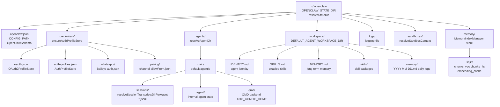
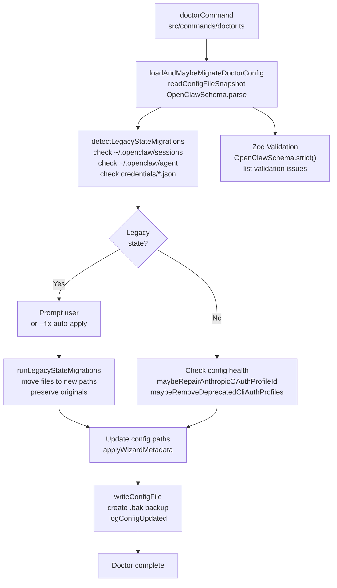
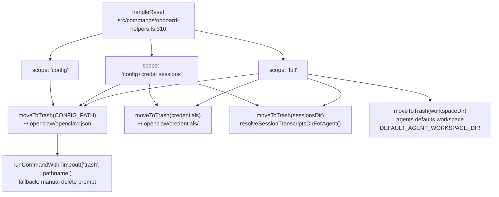

# Page: Migration and Backup

# Migration and Backup

<details>
<summary>Relevant source files</summary>

The following files were used as context for generating this wiki page:

- [CHANGELOG.md](CHANGELOG.md)
- [docs/cli/memory.md](docs/cli/memory.md)
- [docs/cli/sandbox.md](docs/cli/sandbox.md)
- [docs/concepts/memory.md](docs/concepts/memory.md)
- [docs/gateway/configuration.md](docs/gateway/configuration.md)
- [docs/gateway/doctor.md](docs/gateway/doctor.md)
- [docs/gateway/sandbox-vs-tool-policy-vs-elevated.md](docs/gateway/sandbox-vs-tool-policy-vs-elevated.md)
- [docs/gateway/sandboxing.md](docs/gateway/sandboxing.md)
- [docs/platforms/mac/skills.md](docs/platforms/mac/skills.md)
- [docs/tools/elevated.md](docs/tools/elevated.md)
- [docs/tools/index.md](docs/tools/index.md)
- [docs/tools/skills-config.md](docs/tools/skills-config.md)
- [src/agents/bash-tools.test.ts](src/agents/bash-tools.test.ts)
- [src/agents/memory-search.test.ts](src/agents/memory-search.test.ts)
- [src/agents/memory-search.ts](src/agents/memory-search.ts)
- [src/agents/pi-tools-agent-config.test.ts](src/agents/pi-tools-agent-config.test.ts)
- [src/agents/sandbox-explain.test.ts](src/agents/sandbox-explain.test.ts)
- [src/agents/sandbox-skills.test.ts](src/agents/sandbox-skills.test.ts)
- [src/agents/sandbox.ts](src/agents/sandbox.ts)
- [src/cli/memory-cli.test.ts](src/cli/memory-cli.test.ts)
- [src/cli/memory-cli.ts](src/cli/memory-cli.ts)
- [src/cli/models-cli.test.ts](src/cli/models-cli.test.ts)
- [src/commands/configure.gateway.test.ts](src/commands/configure.gateway.test.ts)
- [src/commands/configure.gateway.ts](src/commands/configure.gateway.ts)
- [src/commands/configure.ts](src/commands/configure.ts)
- [src/commands/doctor.ts](src/commands/doctor.ts)
- [src/commands/onboard-helpers.test.ts](src/commands/onboard-helpers.test.ts)
- [src/commands/onboard-helpers.ts](src/commands/onboard-helpers.ts)
- [src/commands/onboard-interactive.ts](src/commands/onboard-interactive.ts)
- [src/config/merge-config.ts](src/config/merge-config.ts)
- [src/config/schema.ts](src/config/schema.ts)
- [src/config/types.tools.ts](src/config/types.tools.ts)
- [src/config/types.ts](src/config/types.ts)
- [src/config/zod-schema.agent-runtime.ts](src/config/zod-schema.agent-runtime.ts)
- [src/config/zod-schema.ts](src/config/zod-schema.ts)
- [src/memory/embeddings.test.ts](src/memory/embeddings.test.ts)
- [src/memory/embeddings.ts](src/memory/embeddings.ts)
- [src/memory/manager.ts](src/memory/manager.ts)
- [src/wizard/onboarding.gateway-config.test.ts](src/wizard/onboarding.gateway-config.test.ts)
- [src/wizard/onboarding.gateway-config.ts](src/wizard/onboarding.gateway-config.ts)
- [src/wizard/onboarding.ts](src/wizard/onboarding.ts)
- [src/wizard/onboarding.types.ts](src/wizard/onboarding.types.ts)

</details>


This page covers backup strategies, version migration procedures, and restoration workflows for OpenClaw installations. It focuses on preserving workspace files, sessions, credentials, and configuration across upgrades or when moving between machines.

For general troubleshooting and health checks, see [14.1](#14.1). For the doctor command's migration capabilities, see [14.2](#14.2).

---

## Overview

OpenClaw stores state in `~/.openclaw/` (or `$OPENCLAW_STATE_DIR`). This includes:
- **Configuration** (`openclaw.json`)
- **Credentials** (API keys, OAuth tokens, channel auth)
- **Sessions** (conversation history per agent)
- **Workspace** (agent files, skills, memory)
- **Agent directory** (internal agent state)

Backups preserve this state. Migrations update legacy structures to current schema.

**Sources:** [src/commands/onboard-helpers.ts:301-311](), [docs/gateway/doctor.md:1-278]()

---

## State Directory Structure

Title: OpenClaw State Directory Layout



**Sources:** [src/config/paths.ts:1-50](), [src/agents/workspace.ts:1-200](), [src/commands/onboard-helpers.ts:258-280](), [src/config/sessions/paths.ts:1-100](), [src/memory/manager.ts:68-248](), [docs/concepts/memory.md:17-29]()

---

## What to Back Up

### Critical Files

| Component | Path | Contains | Frequency |
|-----------|------|----------|-----------|
| **Config** | `~/.openclaw/openclaw.json` | Gateway settings, model config, channel bindings | Before major changes |
| **Credentials** | `~/.openclaw/credentials/` | API keys, OAuth tokens, WhatsApp auth | After login/auth changes |
| **Sessions** | `~/.openclaw/agents/<agentId>/sessions/` | Conversation history (JSONL) | Daily or weekly |
| **Workspace** | `~/.openclaw/workspace/` (or custom) | Agent identity, skills, memory | After customization |
| **Agent Dir** | `~/.openclaw/agents/<agentId>/agent/` | Internal agent state | With sessions |

### Environment Variables

Backup your `.env` file if you override config via environment:
- `OPENCLAW_STATE_DIR`
- `OPENCLAW_GATEWAY_TOKEN`
- Model API keys (`ANTHROPIC_API_KEY`, `OPENAI_API_KEY`, etc.)

**Sources:** [docs/gateway/doctor.md:154-178](), [src/commands/onboard-helpers.ts:301-311]()

---

## Backup Procedures

### Manual Backup (Recommended)

```bash
# Create timestamped backup
BACKUP_DIR=~/openclaw-backup-$(date +%Y%m%d-%H%M%S)
mkdir -p "$BACKUP_DIR"

# Copy state directory
cp -r ~/.openclaw "$BACKUP_DIR/state"

# Export current config for reference
openclaw config get > "$BACKUP_DIR/config.json"

# Compress
tar -czf "$BACKUP_DIR.tar.gz" -C "$BACKUP_DIR" .
rm -rf "$BACKUP_DIR"

echo "Backup saved to $BACKUP_DIR.tar.gz"
```

### Selective Backup (Fast)

When you only need critical files:

```bash
BACKUP_DIR=~/openclaw-backup-$(date +%Y%m%d-%H%M%S)
mkdir -p "$BACKUP_DIR"

# Core state only
cp ~/.openclaw/openclaw.json "$BACKUP_DIR/"
cp -r ~/.openclaw/credentials "$BACKUP_DIR/"
cp -r ~/.openclaw/agents/main/sessions "$BACKUP_DIR/"
cp -r ~/.openclaw/workspace "$BACKUP_DIR/"
```

### Automated Backup (Cron)

Add to your crontab for daily backups:

```bash
# Daily backup at 3 AM
0 3 * * * /path/to/backup-openclaw.sh
```

Example `backup-openclaw.sh`:

```bash
#!/bin/bash
BACKUP_ROOT=~/openclaw-backups
BACKUP_DIR="$BACKUP_ROOT/openclaw-$(date +%Y%m%d)"
mkdir -p "$BACKUP_DIR"

# Backup with rotation (keep last 7 days)
cp -r ~/.openclaw "$BACKUP_DIR/state"
find "$BACKUP_ROOT" -type d -name "openclaw-*" -mtime +7 -exec rm -rf {} +
```

**Sources:** [docs/gateway/doctor.md:298-300](), [src/commands/onboard-helpers.ts:301-311]()

---

## Migration Between Versions

### Automatic Migrations (via Doctor)

The `openclaw doctor` command detects and applies migrations automatically:

```bash
# Check for migrations
openclaw doctor

# Apply all recommended migrations
openclaw doctor --fix

# Non-interactive (safe migrations only)
openclaw doctor --non-interactive
```

Title: Doctor Migration Flow



**Sources:** [src/commands/doctor.ts:65-313](), [src/commands/doctor-config-flow.ts:1-100](), [src/commands/doctor-state-migrations.ts:1-200](), [src/config/config.ts:1-100]()

### Legacy State Migrations

Doctor handles these on-disk layout changes via `detectLegacyStateMigrations` and `runLegacyStateMigrations`:

| Old Path | New Path | What | Migration Function |
|----------|----------|------|-------------------|
| `~/.openclaw/sessions/` | `~/.openclaw/agents/<agentId>/sessions/` | Session transcripts (JSONL) | `detectLegacyStateMigrations` |
| `~/.openclaw/agent/` | `~/.openclaw/agents/<agentId>/agent/` | Agent state directory | `detectLegacyStateMigrations` |
| `~/.openclaw/credentials/*.json` | `~/.openclaw/credentials/whatsapp/<accountId>/` | WhatsApp Baileys auth | `detectLegacyStateMigrations` |
| `.clawdbot/` legacy paths | `~/.openclaw/` | Full state directory migration | Legacy rename during install |

**Migration is idempotent and preserves originals as `.old` suffixes or separate backup paths.**

The migration logic:
- Detects legacy paths by checking `fs.existsSync()` on known old locations
- Prompts user interactively or auto-applies with `--fix`
- Uses `fs.rename()` to move directories atomically
- Logs all changes to the doctor output
- Updates config references to point to new paths

**Sources:** [src/commands/doctor-state-migrations.ts:1-200](), [src/commands/doctor.ts:161-183](), [docs/gateway/doctor.md:96-147]()

### Config Key Migrations

Doctor remaps deprecated config keys:

| Legacy Key | Current Key | Notes |
|------------|-------------|-------|
| `routing.allowFrom` | `channels.whatsapp.allowFrom` | Per-channel allowlists |
| `routing.groupChat.*` | `channels.<channel>.groups` + `messages.groupChat` | Split config |
| `routing.bindings` | Top-level `bindings` | Multi-agent routing |
| `agent.*` | `agents.defaults.*` + `tools.*` | Agent-scoped settings |
| `identity` | `agents.list[].identity` | Per-agent identity |
| `agent.model` | `agents.defaults.model.primary` | Model selection |

**Sources:** [docs/gateway/doctor.md:112-128](), [src/commands/doctor.ts:94-120]()

### Manual Migration Steps

When upgrading OpenClaw itself:

```bash
# 1. Backup current state
tar -czf ~/openclaw-backup-pre-upgrade.tar.gz ~/.openclaw

# 2. Update OpenClaw
npm install -g openclaw@latest
# or for git installs:
cd ~/openclaw && git pull && pnpm install && pnpm build

# 3. Run doctor to migrate
openclaw doctor --fix

# 4. Restart gateway
openclaw gateway restart

# 5. Verify
openclaw status
openclaw health
```

**Sources:** [docs/install/updating.md](), [docs/gateway/troubleshooting.md:513-533]()

---

## Restoration from Backup

### Full State Restore

```bash
# Stop gateway first
openclaw gateway stop

# Extract backup
cd ~
tar -xzf openclaw-backup-20250113.tar.gz

# Move current state aside (safety)
mv ~/.openclaw ~/.openclaw.old

# Restore from backup
mv state ~/.openclaw

# Fix permissions (config should be 600)
chmod 755 ~/.openclaw
chmod 600 ~/.openclaw/openclaw.json
chmod -R 755 ~/.openclaw/agents

# Restart gateway
openclaw gateway start

# Verify restoration
openclaw status
openclaw health
```

### Selective Restore

Restore only specific components:

```bash
# Restore config only (triggers hot-reload if gateway is running)
cp backup/openclaw.json ~/.openclaw/
# Gateway will reload via config file watcher (gateway.reload.mode)

# Restore credentials only
rm -rf ~/.openclaw/credentials
cp -r backup/credentials ~/.openclaw/

# Restore sessions for specific agent
# (Session files: resolveSessionTranscriptsDirForAgent)
cp -r backup/agents/main/sessions ~/.openclaw/agents/main/

# Restore memory index (MemoryIndexManager SQLite)
cp backup/memory/main.sqlite ~/.openclaw/memory/

# Apply any needed migrations
openclaw doctor --fix
```

**Note:** The gateway watches `CONFIG_PATH` for changes and applies hot-reload based on `gateway.reload.mode` (default: `hybrid`). Most config changes apply without restart, but `gateway.port`, `gateway.bind`, and infrastructure settings require a restart.

**Sources:** [src/commands/onboard-helpers.ts:310-320](), [docs/gateway/doctor.md:154-178](), [docs/gateway/configuration.md:327-365](), [src/config/config.ts:1-100]()

---

## Migration to New Machine

### Export from Old Machine

```bash
# On old machine
EXPORT_DIR=~/openclaw-export
mkdir -p "$EXPORT_DIR"

# Full state
cp -r ~/.openclaw "$EXPORT_DIR/state"

# Service config (if using daemon)
openclaw gateway status > "$EXPORT_DIR/service-status.txt"

# Compress
tar -czf ~/openclaw-export.tar.gz -C "$EXPORT_DIR" .
```

### Import to New Machine

```bash
# On new machine
# 1. Install OpenClaw
npm install -g openclaw@latest

# 2. Extract backup
tar -xzf openclaw-export.tar.gz
mv state ~/.openclaw

# 3. Update paths in config (if needed)
openclaw configure

# 4. Run doctor to fix any path issues
openclaw doctor --fix

# 5. Install service
openclaw gateway install

# 6. Start
openclaw gateway start
```

**Sources:** [src/wizard/onboarding.ts:89-470](), [docs/start/wizard.md:1-103]()

---

## Reset and Clean Install

### Scope Levels

The `handleReset` function in `onboard-helpers.ts` supports three reset scopes:

Title: Reset Scope Hierarchy (handleReset function)



The reset flow is invoked during onboarding wizard when user selects "Reset" action. The `moveToTrash` function attempts to use the `trash` CLI utility (if available) to move files to the system trash, allowing recovery. If `trash` is unavailable, it logs a manual delete instruction.

**Sources:** [src/commands/onboard-helpers.ts:293-320](), [src/wizard/onboarding.ts:168-186]()

### Clean Install Procedure

```bash
# 1. Backup first (if you want to keep anything)
tar -czf ~/openclaw-backup-before-reset.tar.gz ~/.openclaw

# 2. Stop gateway
openclaw gateway stop

# 3. Uninstall service
openclaw gateway uninstall

# 4. Remove state (or use reset during onboarding)
rm -rf ~/.openclaw

# 5. Re-onboard
openclaw onboard

# 6. Restore selective items if needed
# (e.g., copy back specific sessions or workspace files)
```

**Sources:** [src/commands/onboard-helpers.ts:301-311](), [docs/gateway/troubleshooting.md:262-298]()

---

## Common Migration Scenarios

### Scenario 1: Multiple Workspace Detection

**Symptom:** Doctor warns about extra workspace folders (e.g., `~/openclaw` and `~/.openclaw/workspace`)

**Fix:**

```bash
# 1. Determine which workspace is active
openclaw status | grep workspace

# 2. Archive inactive workspace
mv ~/openclaw ~/openclaw.old

# 3. Verify
openclaw doctor
```

**Sources:** [docs/gateway/troubleshooting.md:253-263]()

### Scenario 2: Config Invalid After Upgrade

**Symptom:** Gateway refuses to start, "configuration invalid"

**Fix:**

```bash
# 1. Check what's invalid
openclaw doctor

# 2. Apply migrations
openclaw doctor --fix

# 3. If still broken, validate manually
cat ~/.openclaw/openclaw.json | jq .

# 4. Worst case: reset config and restore from backup
mv ~/.openclaw/openclaw.json ~/.openclaw/openclaw.json.broken
openclaw onboard
# Then merge settings from .broken file
```

**Sources:** [docs/gateway/troubleshooting.md:459-478]()

### Scenario 3: WhatsApp Re-authentication After Migration

**Symptom:** WhatsApp logged out after moving state

**Fix:**

```bash
# 1. Check credentials exist
ls -la ~/.openclaw/credentials/whatsapp/

# 2. If missing, re-login
openclaw channels logout whatsapp
openclaw channels login whatsapp

# 3. Verify
openclaw status
openclaw channels status --probe
```

**Sources:** [docs/gateway/troubleshooting.md:399-424](), [docs/channels/whatsapp.md]()

### Scenario 4: Session History Lost

**Symptom:** Agent doesn't remember past conversations

**Fix:**

```bash
# 1. Check session files exist (resolveSessionTranscriptsDirForAgent)
ls -la ~/.openclaw/agents/main/sessions/

# 2. Verify session file format (should be JSONL)
head -n 1 ~/.openclaw/agents/main/sessions/*.jsonl

# 3. If missing, restore from backup
cp -r ~/backup/agents/main/sessions ~/.openclaw/agents/main/

# 4. Check permissions
chmod 755 ~/.openclaw/agents/main/sessions
chmod 644 ~/.openclaw/agents/main/sessions/*.jsonl

# 5. Check for transcript corruption (SessionManager)
openclaw sessions list --agent main

# 6. Restart gateway (clears in-memory session cache)
openclaw gateway restart
```

**Note:** Sessions are stored as JSONL files (one JSON object per line) at `~/.openclaw/agents/<agentId>/sessions/<sessionKey>.jsonl`. The `SessionManager` loads these on-demand and writes incrementally. If files are corrupt, the session will reset and start fresh.

**Sources:** [docs/gateway/troubleshooting.md:361-384](), [docs/gateway/doctor.md:154-178](), [src/config/sessions/paths.ts:1-50](), [src/sessions/transcript.ts:1-100]()

---

## Backup Best Practices

### What to Back Up Regularly

| Item | Path | Frequency | Priority | Notes |
|------|------|-----------|----------|-------|
| **Sessions** | `agents/<agentId>/sessions/*.jsonl` | Daily | High | Conversation history (JSONL transcripts) |
| **Config** | `openclaw.json` | Before changes | High | `OpenClawSchema` validated config |
| **Credentials** | `credentials/` | After login | Critical | `AuthProfileStore`, OAuth tokens, channel auth |
| **Workspace** | `workspace/` or custom path | Weekly | Medium | `IDENTITY.md`, `SKILLS.md`, `MEMORY.md`, `skills/`, `memory/` |
| **Memory Index** | `memory/<agentId>.sqlite` | Weekly | Medium | `MemoryIndexManager` vector + FTS index |
| **Agent Dir** | `agents/<agentId>/agent/` | Weekly | Low | Internal agent state (ephemeral) |

### Storage Recommendations

- **Local:** External drive or NAS
- **Cloud:** Encrypted backup to S3/Dropbox/Google Drive
- **Retention:** Keep last 7 daily + 4 weekly + 3 monthly

### Security Considerations

Backups contain sensitive data:
- API keys and OAuth tokens (`credentials/auth-profiles.json`, `credentials/oauth.json`)
- Conversation history (`agents/*/sessions/*.jsonl`)
- Gateway tokens (`gateway.auth.token` in `openclaw.json`)
- WhatsApp session keys (`credentials/whatsapp/<accountId>/auth.json`)

**Encrypt backups when storing off-machine:**

```bash
# Encrypt with gpg
tar -czf - ~/.openclaw | gpg --symmetric --cipher-algo AES256 > openclaw-backup.tar.gz.gpg

# Decrypt
gpg --decrypt openclaw-backup.tar.gz.gpg | tar -xzf -
```

**Note:** The `openclaw.json` config file should have `chmod 600` permissions locally to prevent unauthorized reads. Doctor checks this and warns if permissions are too open.

**Sources:** [docs/gateway/security/index.md](), [docs/gateway/doctor.md:174-178](), [src/commands/doctor.ts:65-313](), [src/memory/manager.ts:68-170]()

---

## Troubleshooting Migrations

### Doctor Won't Migrate

**Check:**

```bash
# Is config valid? (OpenClawSchema.parse will show validation errors)
openclaw doctor

# Permission issues?
ls -la ~/.openclaw/
ls -la ~/.openclaw/openclaw.json

# Fix permissions (doctor checks this via fs.access)
chmod 755 ~/.openclaw
chmod 600 ~/.openclaw/openclaw.json

# Check if config file is corrupted (invalid JSON5)
cat ~/.openclaw/openclaw.json | jq .

# Force migration with --fix
openclaw doctor --fix

# If still blocked, check logs
openclaw logs --follow
```

### State Mismatch After Restore

**Symptom:** Sessions don't load, or agent uses wrong workspace

**Fix:**

```bash
# 1. Verify paths in config match actual structure
openclaw config get agents.defaults.workspace
# Should match: resolveAgentWorkspaceDir returns this path

# 2. Check session directory exists (resolveSessionTranscriptsDirForAgent)
ls -la ~/.openclaw/agents/main/sessions/

# 3. Run integrity check (noteStateIntegrity in doctor)
openclaw doctor

# 4. Check for path resolution issues
openclaw status | grep -i workspace

# 5. If paths are wrong, update config (triggers validation)
openclaw configure

# 6. Verify migration applied correctly
openclaw doctor | grep -i migration
```

**Note:** The doctor command runs `noteStateIntegrity` which checks session directory permissions, config file permissions (chmod 600 required locally), and path resolution consistency.

**Sources:** [docs/gateway/doctor.md:154-178](), [docs/gateway/troubleshooting.md:361-398](), [src/commands/doctor.ts:185-313](), [src/commands/doctor-state-integrity.ts:1-100]()

---

## Related Documentation

- [14.1 Health Monitoring](#14.1) - Status checks and probes
- [14.2 Doctor Command Guide](#14.2) - Detailed doctor capabilities
- [14.3 Common Issues](#14.3) - Troubleshooting specific problems
- [4.2 Configuration Management](#4.2) - Config loading and validation
- [5.3 Session Management](#5.3) - Session file format and persistence

**Sources:** [docs/gateway/doctor.md](), [docs/gateway/troubleshooting.md](), [src/commands/doctor.ts](), [src/commands/onboard-helpers.ts]()

---