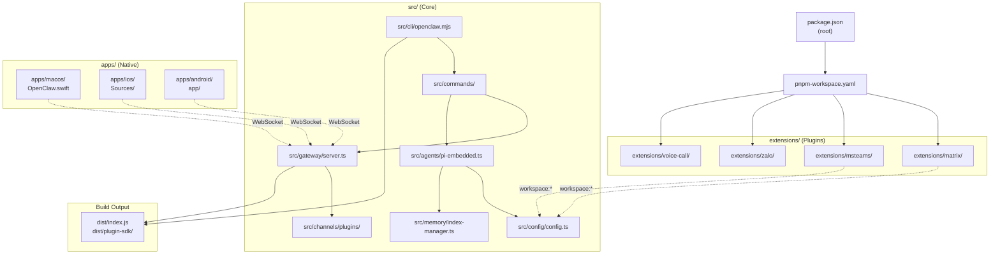
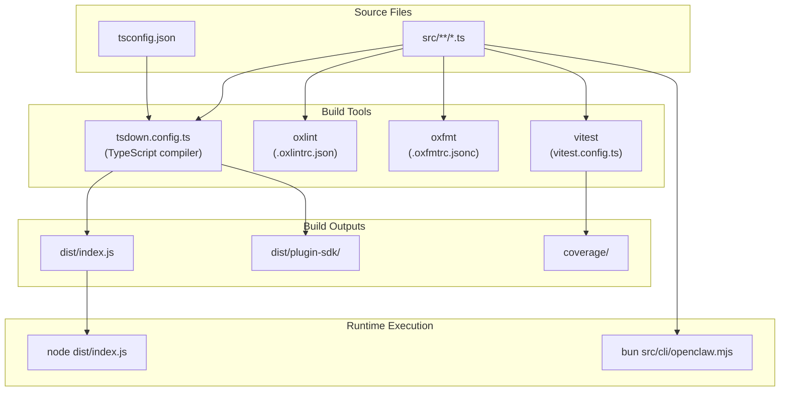
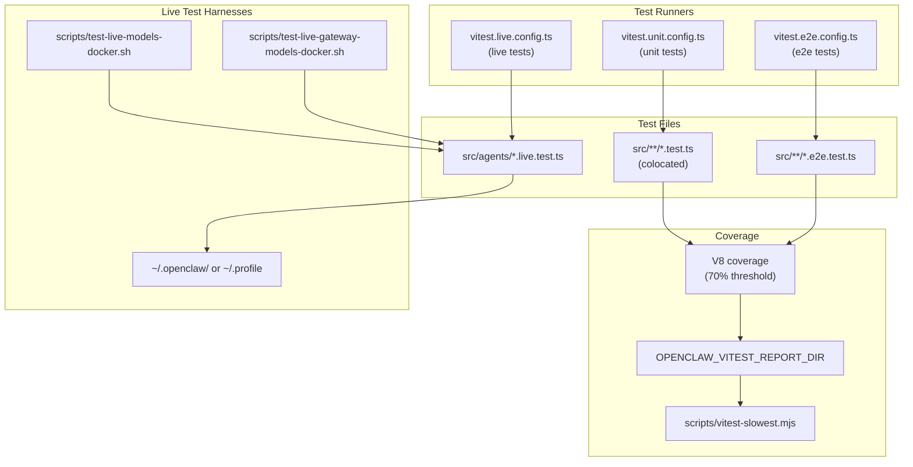
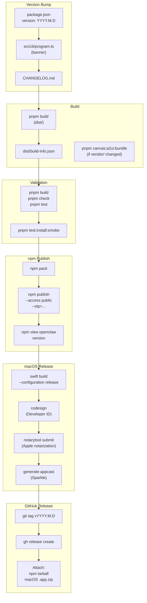
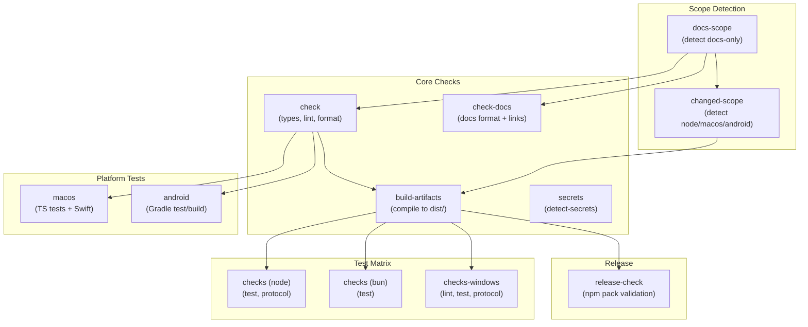

# Page: Development

# Development

<details>
<summary>Relevant source files</summary>

The following files were used as context for generating this wiki page:

- [.agents/skills/mintlify/SKILL.md](.agents/skills/mintlify/SKILL.md)
- [.github/ISSUE_TEMPLATE/bug_report.md](.github/ISSUE_TEMPLATE/bug_report.md)
- [.github/ISSUE_TEMPLATE/config.yml](.github/ISSUE_TEMPLATE/config.yml)
- [.github/ISSUE_TEMPLATE/feature_request.md](.github/ISSUE_TEMPLATE/feature_request.md)
- [.github/actions/detect-docs-changes/action.yml](.github/actions/detect-docs-changes/action.yml)
- [.github/actions/setup-node-env/action.yml](.github/actions/setup-node-env/action.yml)
- [.github/labeler.yml](.github/labeler.yml)
- [.github/workflows/auto-response.yml](.github/workflows/auto-response.yml)
- [.github/workflows/ci.yml](.github/workflows/ci.yml)
- [.github/workflows/labeler.yml](.github/workflows/labeler.yml)
- [.github/workflows/stale.yml](.github/workflows/stale.yml)
- [.gitignore](.gitignore)
- [AGENTS.md](AGENTS.md)
- [docs/automation/poll.md](docs/automation/poll.md)
- [docs/channels/index.md](docs/channels/index.md)
- [docs/ci.md](docs/ci.md)
- [docs/providers/synthetic.md](docs/providers/synthetic.md)
- [docs/zh-CN/channels/index.md](docs/zh-CN/channels/index.md)
- [docs/zh-CN/vps.md](docs/zh-CN/vps.md)
- [extensions/msteams/src/store-fs.ts](extensions/msteams/src/store-fs.ts)
- [scripts/sync-labels.ts](scripts/sync-labels.ts)
- [scripts/test-live-gateway-models-docker.sh](scripts/test-live-gateway-models-docker.sh)
- [scripts/test-live-models-docker.sh](scripts/test-live-models-docker.sh)
- [src/agents/live-auth-keys.test.ts](src/agents/live-auth-keys.test.ts)
- [src/agents/live-auth-keys.ts](src/agents/live-auth-keys.ts)
- [src/agents/pi-embedded-helpers.isbillingerrormessage.test.ts](src/agents/pi-embedded-helpers.isbillingerrormessage.test.ts)
- [src/agents/zai.live.test.ts](src/agents/zai.live.test.ts)
- [src/commands/message.ts](src/commands/message.ts)
- [src/gateway/live-image-probe.ts](src/gateway/live-image-probe.ts)
- [src/infra/outbound/abort.ts](src/infra/outbound/abort.ts)
- [src/infra/outbound/message.ts](src/infra/outbound/message.ts)
- [src/infra/outbound/outbound-send-service.ts](src/infra/outbound/outbound-send-service.ts)
- [src/media/png-encode.ts](src/media/png-encode.ts)
- [src/pairing/pairing-store.ts](src/pairing/pairing-store.ts)

</details>


OpenClaw is a TypeScript monorepo built with pnpm workspaces. This section covers the development environment, build system, testing infrastructure, and contribution workflow. Developers working on core features, extensions, or platform apps will find the technical details needed to build, test, and ship changes.

**Key Development Topics:**

- **[Architecture Deep Dive](#15.1):** Core modules, extension system, data flow patterns
- **[Protocol Specification](#15.2):** Gateway WebSocket RPC protocol and schemas
- **[Building from Source](#15.3):** Build process, TypeScript compilation, development workflows
- **[Release Process](#15.4):** Versioning, npm publishing, macOS notarization, Sparkle updates
- **[CI/CD Pipeline](#15.5):** GitHub Actions workflows, test matrix, platform-specific jobs
- **[Contributing Guidelines](#15.6):** Coding standards, commit conventions, PR process

## Repository Structure

OpenClaw is a pnpm workspace monorepo. The root `package.json` defines workspace packages under `extensions/*`, while core TypeScript source lives under `src/`. Built output goes to `dist/` (excluded from Git).

**Top-Level Directory Layout:**

| Path | Description |
|------|-------------|
| `src/` | Core TypeScript source (CLI, Gateway, agents, channels, tools) |
| `dist/` | Compiled JavaScript (generated by `pnpm build`) |
| `extensions/` | Plugin packages (workspace:* dependencies) |
| `apps/` | Native apps (macOS/iOS Swift, Android Kotlin) |
| `docs/` | Mintlify documentation site |
| `scripts/` | Build scripts, utilities, Docker test harnesses |
| `.github/` | CI workflows, actions, issue templates |

**Core Source Structure (`src/`):**

| Path | Purpose |
|------|---------|
| `src/cli/` | CLI entry point ([openclaw.mjs:1-6]()), command wiring |
| `src/commands/` | Command implementations (agent, gateway, message, etc.) |
| `src/infra/` | Infrastructure: Gateway server, session store, outbound delivery |
| `src/agents/` | Agent runtime (`runEmbeddedPiAgent`), workspace, auth profiles |
| `src/config/` | Configuration schema (Zod), validation, hot-reload |
| `src/channels/` | Channel plugin system, routing, pairing |
| `src/telegram/`, `src/discord/`, `src/slack/`, `src/signal/`, `src/imessage/`, `src/web/` | Built-in channel integrations |
| `src/memory/` | Memory indexing (SQLite), embedding providers |
| `src/media/` | Media pipeline (PNG encode, QR code generation) |
| `src/gateway/` | Gateway RPC protocol, control UI, health checks |

**Extension Packages (`extensions/`):**

Extensions are workspace packages with `workspace:*` dependencies on core. Plugin metadata is declared in `package.json` under `openclaw.channel`. Examples:

- `extensions/matrix/` — Matrix protocol channel
- `extensions/msteams/` — Microsoft Teams bot
- `extensions/zalo/`, `extensions/zalouser/` — Zalo integrations
- `extensions/voice-call/` — Twilio/Telnyx voice call provider
- `extensions/memory-lancedb/` — LanceDB memory backend
- `extensions/copilot-proxy/` — GitHub Copilot proxy

**Platform Apps (`apps/`):**

Native companion apps connect to the Gateway via WebSocket RPC:

- `apps/macos/` — macOS menu bar app (Swift Package Manager, Sparkle auto-update)
- `apps/ios/` — iOS node app (camera, screen, notifications)
- `apps/android/` — Android node app (Gradle, Kotlin)

**Diagram: Monorepo Module Graph**



**Plugin Installation:**

Plugins can be installed via npm or developed locally:

```bash
# Install published extension
pnpm add @openclaw/matrix

# Develop extension locally (already in workspace)
cd extensions/matrix && pnpm install
```

Plugin dependencies must live in the extension's `package.json` as `dependencies`, not `devDependencies`. Core `openclaw` should be in `peerDependencies` to avoid npm install breakage.

Sources: [AGENTS.md:6-18](), [.gitignore:1-86]()

## Development Environment

### Prerequisites

- **Node.js:** 22+ (baseline runtime)
- **pnpm:** 10.23.0+ (corepack managed)
- **Bun:** Latest (for TypeScript scripts and dev execution)
- **Docker:** Optional (for sandbox and Docker tests)

### Initial Setup

```bash
# Clone repository
git clone https://github.com/openclaw/openclaw.git
cd openclaw

# Install dependencies (pnpm workspace install)
pnpm install

# Install pre-commit hooks (runs CI checks locally)
prek install
```

**Pre-commit Hooks:** The `prek install` command sets up Git hooks that run `pnpm check` and `pnpm test` before commits, matching CI validation.

Sources: [AGENTS.md:50-64]()

### Build and Development Commands

**Diagram: Development Toolchain**



**Core Commands:**

| Command | Tool | Purpose |
|---------|------|---------|
| `pnpm build` | tsdown | Compile TypeScript to `dist/` |
| `pnpm tsgo` | tsc | Type-check only (no emit) |
| `pnpm check` | oxlint + oxfmt | Lint and format check |
| `pnpm format:fix` | oxfmt | Auto-fix formatting |
| `pnpm test` | vitest | Unit tests |
| `pnpm test:coverage` | vitest | Tests with V8 coverage |
| `pnpm test --watch` | vitest | Watch mode |
| `pnpm openclaw <args>` | bun | Run CLI without build |
| `pnpm dev` | bun | Alias for `pnpm openclaw` |
| `pnpm gateway:watch` | nodemon | Auto-reload gateway |

**Live Development Workflow:**

1. **Edit source:** Modify `src/**/*.ts` files
2. **Run without build:** `pnpm openclaw <command>` (Bun executes TypeScript directly)
3. **Type-check:** `pnpm tsgo` (fast check before commit)
4. **Lint/format:** `pnpm check` (auto-run by pre-commit hook)
5. **Test:** `pnpm test` (unit tests with coverage gate)
6. **Build:** `pnpm build` (only needed for release or `dist/` verification)

**Gateway Development:**

For Gateway changes, use `pnpm gateway:watch` to auto-restart on file changes. The watcher uses nodemon with TypeScript execution via Bun.

Sources: [AGENTS.md:50-67]()

## Testing

OpenClaw uses **Vitest** for unit and integration tests. Coverage thresholds (70% lines/branches/functions/statements) are enforced via V8 coverage. Tests are colocated with source files as `*.test.ts` and `*.e2e.test.ts`.

### Test Execution

**Diagram: Test Infrastructure**



**Test Commands:**

| Command | Config | Purpose |
|---------|--------|---------|
| `pnpm test` | `vitest.unit.config.ts` | Unit tests (colocated `*.test.ts`) |
| `pnpm test:coverage` | + V8 coverage | Unit tests with coverage report |
| `pnpm test:live` | `vitest.live.config.ts` | Live API tests (requires `OPENCLAW_LIVE_TEST=1`) |
| `pnpm test:docker:live-models` | Docker + profile keys | Live model tests in Docker |
| `pnpm test:docker:live-gateway` | Docker + profile keys | Live Gateway model tests |
| `pnpm test:docker:onboard` | Docker + installer | E2E onboarding test |

**Live Test Execution (Docker):**

Live tests require real API keys. The Docker harness mounts `~/.openclaw/` and `~/.profile` to provide credentials:

```bash
# Run live model tests in Docker
OPENCLAW_LIVE_TEST=1 pnpm test:live

# Run Docker-based live tests (profile keys)
pnpm test:docker:live-models
pnpm test:docker:live-gateway
```

The [scripts/test-live-models-docker.sh:1-34]() and [scripts/test-live-gateway-models-docker.sh:1-33]() scripts build the Docker image, mount config directories, and run live tests with environment variables.

### Coverage Thresholds

Vitest enforces coverage gates via V8 coverage:

- **Lines:** 70%
- **Branches:** 70%
- **Functions:** 70%
- **Statements:** 70%

If coverage drops below these thresholds, CI fails. The coverage report is written to `OPENCLAW_VITEST_REPORT_DIR` (CI sets this to `$RUNNER_TEMP/vitest-reports`). The [scripts/vitest-slowest.mjs:1-214]() script analyzes test timing from JSON reports.

### Test Organization

**Test File Patterns:**

| Pattern | Purpose | Example |
|---------|---------|---------|
| `*.test.ts` | Unit tests | [src/agents/pi-embedded-helpers.isbillingerrormessage.test.ts:1-68]() |
| `*.e2e.test.ts` | E2E integration tests | Gateway installer E2E |
| `*.live.test.ts` | Live API tests | [src/agents/zai.live.test.ts:1-55]() |

**Live Test Gating:**

Live tests use environment variables to conditionally run:

```typescript
const LIVE = isTruthyEnvValue(process.env.ZAI_LIVE_TEST) || isTruthyEnvValue(process.env.LIVE);
const describeLive = LIVE && ZAI_KEY ? describe : describe.skip;
```

This pattern prevents live tests from running in standard CI jobs. Live tests only run when `OPENCLAW_LIVE_TEST=1` or provider-specific flags are set.

**Billing Error Detection:**

Tests include safeguards to avoid false failures from billing/rate-limit errors. The [src/agents/live-auth-keys.ts:76-101]() module provides `isAnthropicBillingError()` and `isAnthropicRateLimitError()` to detect provider-specific error patterns. Tests use these to skip or retry when hitting billing limits.

Sources: [AGENTS.md:80-90](), [.github/workflows/ci.yml:177-224](), [scripts/test-live-models-docker.sh:1-34](), [scripts/test-live-gateway-models-docker.sh:1-33](), [src/agents/zai.live.test.ts:1-55](), [src/agents/live-auth-keys.ts:1-102]()

## Coding Standards and Conventions

### Language and Typing

- **Language:** TypeScript (ESM) with strict typing
- **Avoid `any`:** Use explicit types or `unknown` when types are truly dynamic
- **Type imports:** Use `import type` for type-only imports
- **File length:** Aim for ~500-700 LOC (guideline, not hard limit). Split/refactor when it improves clarity

### Code Style

**Formatting and Linting:**

- **Oxfmt:** Code formatting ([.oxfmtrc.jsonc]())
- **Oxlint:** Linting rules ([.oxlintrc.json]())
- **Run before commit:** `pnpm check` (enforced by pre-commit hooks)

**Code Comments:**

- Add brief comments for tricky or non-obvious logic
- Avoid over-commenting obvious code
- Use TODO comments with context: `// TODO: Verify the default timeout value`

### Naming Conventions

**Product Naming:**

- **Product/App:** Use **OpenClaw** for documentation headings and user-facing text
- **CLI/Package:** Use `openclaw` for CLI commands, package names, config keys, binary names

**File Naming:**

| File Type | Pattern | Example |
|-----------|---------|---------|
| Source | `kebab-case.ts` | `src/config/config.ts` |
| Tests | `*.test.ts` | `src/agents/workspace.test.ts` |
| E2E Tests | `*.e2e.test.ts` | `src/gateway/install.e2e.test.ts` |
| Live Tests | `*.live.test.ts` | `src/agents/zai.live.test.ts` |

### Tool Schema Guardrails

Tool input schemas must follow strict conventions to avoid LLM provider compatibility issues:

**Required Patterns:**

- **Top-level:** Always `type: "object"` with `properties`
- **No unions:** Avoid `Type.Union`, `anyOf`, `oneOf`, `allOf`
- **Enums:** Use `stringEnum()` or `optionalStringEnum()` from `Type.Unsafe` for string lists
- **Optional fields:** Use `Type.Optional(...)`, never `... | null`
- **Reserved keywords:** Avoid raw `format` property names (some validators treat it as reserved)

**Example (Good):**

```typescript
import { Type } from "@sinclair/typebox";
import { stringEnum } from "../utils/typebox.js";

const ToolInput = Type.Object({
  action: stringEnum(["send", "poll", "react"]),
  target: Type.String(),
  message: Type.Optional(Type.String()),
});
```

**Example (Bad):**

```typescript
// Avoid: union types break some providers
const ToolInput = Type.Union([
  Type.Object({ action: Type.Literal("send") }),
  Type.Object({ action: Type.Literal("poll") }),
]);

// Avoid: null unions
const ToolInput = Type.Object({
  message: Type.Union([Type.String(), Type.Null()]),
});
```

Sources: [AGENTS.md:65-72](), [AGENTS.md:169-170]()

## Contribution Workflow

For detailed contribution guidelines, see [Contributing Guidelines](#15.6). This section covers the essential workflow.

### Commit Conventions

**Use `scripts/committer` for Scoped Commits:**

The `scripts/committer` script creates properly scoped commits and prevents staging bleed:

```bash
# Syntax: scripts/committer "<message>" <file1> <file2> ...
scripts/committer "CLI: add verbose flag to send" src/commands/send.ts

# Multiple files
scripts/committer "Agent: fix session lock" src/agents/session.ts src/agents/session.test.ts
```

**Commit Message Style:**

- **Scope prefix:** Use a scope prefix (e.g., `CLI:`, `Gateway:`, `Agent:`, `Docs:`)
- **Action-oriented:** Start with a verb (e.g., "add", "fix", "refactor")
- **Concise:** Keep under 72 characters when possible
- **Group related changes:** Bundle logically related changes together
- **Avoid bundling:** Don't mix unrelated refactors or features

**Examples:**

```
CLI: add verbose flag to send command
Gateway: fix race condition in session lock
Docs: update onboarding wizard screenshots
Agent: refactor system prompt builder
```

Sources: [AGENTS.md:92-103]()

### Pull Request Process

**Creating a PR:**

1. **Branch from `main`:** Always create feature branches from `main`
2. **Run pre-commit checks:** `pnpm build && pnpm check && pnpm test`
3. **Write PR description:**
   - **Summary:** What the PR does
   - **Testing:** What tests were run
   - **User-facing changes:** New flags, breaking changes, behavior changes
4. **Add changelog entry:** Unless it's a pure test/doc change

**PR Review Guidelines:**

- **Review without switching branches:** Use `gh pr view` / `gh pr diff`
- **Discuss changes in comments:** Tag specific lines for clarification
- **Request changes via GitHub review:** Use "Request changes" for blocking issues

**Landing a PR (Maintainers):**

1. **Create temp branch:** `git checkout -b temp-pr-123 main`
2. **Merge PR branch:**
   - Prefer rebase for clean history: `git rebase pr-branch`
   - Use squash for messy history: `git merge --squash pr-branch`
3. **Add changelog entry:** Include PR number and thank contributor
4. **Run full gate:** `pnpm build && pnpm check && pnpm test`
5. **Merge to main:** `git checkout main && git merge temp-pr-123`
6. **Clean up:** `git branch -d temp-pr-123`
7. **Update clawtributors:** Run `bun scripts/update-clawtributors.ts` for new contributors

Sources: [AGENTS.md:97-109]()

## Release Overview

OpenClaw uses date-based semantic versioning (`YYYY.M.D`) with three release channels. For complete release procedures, see [Release Process](#15.4).

### Release Channels

| Channel | Tag Format | npm Dist-Tag | Purpose |
|---------|------------|--------------|---------|
| **stable** | `vYYYY.M.D` | `latest` | Production releases (includes macOS app) |
| **beta** | `vYYYY.M.D-beta.N` | `beta` | Pre-releases (may skip macOS app) |
| **dev** | (none) | (none) | Main branch HEAD (no tag, no publish) |

### Version Locations

Versions must be synchronized across multiple files:

**Core Version Files:**

- [package.json:2]() — `"version": "YYYY.M.D"`
- [src/cli/program.ts]() — CLI banner version string
- [src/provider-web.ts]() — Baileys user agent version

**Platform App Versions:**

- [apps/android/app/build.gradle.kts]() — `versionName`, `versionCode`
- [apps/ios/Sources/Info.plist]() — `CFBundleShortVersionString`, `CFBundleVersion`
- [apps/macos/Sources/OpenClaw/Resources/Info.plist]() — `CFBundleShortVersionString`, `CFBundleVersion`

**Documentation:**

- [docs/install/updating.md]() — Pinned npm version in examples
- [docs/platforms/mac/release.md]() — Example version strings

**Diagram: Release Artifact Flow**



### npm Publishing with 1Password OTP

All npm publishes require 1Password OTP for security. The [AGENTS.md:180-187]() section documents the workflow:

```bash
# Sign in to 1Password (in tmux session)
eval "$(op signin --account my.1password.com)"

# Get OTP
op read 'op://Private/Npmjs/one-time password?attribute=otp'

# Publish
npm publish --access public --otp="<otp>"

# Verify (without side effects)
npm view openclaw version --userconfig "$(mktemp)"
```

**Important:** Always run `op` commands inside a fresh tmux session to avoid environment contamination.

Sources: [AGENTS.md:74-79](), [AGENTS.md:148](), [AGENTS.md:180-187](), [docs/reference/RELEASING.md:1-121]()

## CI/CD Pipeline

For detailed pipeline documentation, see [CI/CD Pipeline](#15.5). This section provides an overview of the GitHub Actions workflows.

### Workflow Overview

**Main Workflows:**

| Workflow | Trigger | Purpose |
|----------|---------|---------|
| **ci.yml** | Push, PR | Build, lint, test, platform checks |
| **install-smoke.yml** | Push to main, PR, manual | Installer smoke tests (Docker) |
| **auto-response.yml** | Issue/PR labeled | Auto-respond to labeled items |
| **labeler.yml** | PR opened/synced | Auto-label PRs by changed files |
| **stale.yml** | Daily cron | Mark/close stale issues/PRs |

**Diagram: CI Job Dependencies**



### Smart Scoping

The CI pipeline uses smart scoping to skip expensive jobs when possible:

**docs-scope Job ([.github/actions/detect-docs-changes/action.yml:1-54]()):**

Detects docs-only changes. If all changes are under `docs/` or are `*.md`/`*.mdx` files, sets `docs_only=true`. When true:

- Skips: build-artifacts, checks, checks-windows, macos, android, release-check
- Runs: check (types/lint/format), check-docs, secrets

**changed-scope Job ([.github/workflows/ci.yml:33-124]()):**

Detects which heavy areas are touched:

- `run_node`: Changes to `src/`, `extensions/`, `scripts/`, configs → run Node checks
- `run_macos`: Changes to `apps/macos/`, `apps/ios/`, `apps/shared/` → run Swift checks
- `run_android`: Changes to `apps/android/`, `apps/shared/` → run Android checks

**Fail-Safe:** If detection fails, all checks run to avoid skipping necessary validation.

### Build Artifact Sharing

The [.github/workflows/ci.yml:127-150]() `build-artifacts` job compiles TypeScript once and uploads `dist/` as an artifact. Downstream jobs (checks, checks-windows, release-check) download the artifact instead of rebuilding.

**Artifact Retention:** 1 day (sufficient for PR validation)

### Platform-Specific Jobs

**macOS Job ([.github/workflows/ci.yml:412-483]()):**

Consolidated macOS job (runs on PR when macOS files change):

1. **TS tests:** `pnpm test` on macOS runner
2. **Xcode setup:** Select Xcode 26.1, install XcodeGen/SwiftLint/SwiftFormat
3. **Swift lint:** `swiftlint`, `swiftformat --lint`
4. **Swift build:** `swift build --configuration release` (3 retries)
5. **Swift test:** `swift test --parallel --enable-code-coverage` (3 retries)

**Android Job ([.github/workflows/ci.yml:645-689]()):**

Runs when Android files change:

1. **Setup:** Java 21, Android SDK, Gradle 8.11.1
2. **Test:** `./gradlew :app:testDebugUnitTest`
3. **Build:** `./gradlew :app:assembleDebug`

**Windows Job ([.github/workflows/ci.yml:285-406]()):**

Runs when Node files change:

1. **Windows Defender exclusions:** Best-effort exclusion to avoid process interception
2. **Matrix:** lint, test, protocol tasks
3. **Vitest workers:** Limited to 2 to avoid resource exhaustion on 4 vCPU runner

### Retry Strategies

Network operations include retry logic:

**Submodule Checkout ([.github/actions/setup-node-env/action.yml:25-37]()):**

```bash
for attempt in 1 2 3 4 5; do
  if git -c protocol.version=2 submodule update --init --force --depth=1 --recursive; then
    exit 0
  fi
  echo "Submodule update failed (attempt $attempt/5). Retrying…"
  sleep $((attempt * 10))
done
exit 1
```

**Swift Build ([.github/workflows/ci.yml:461-471]()):**

```bash
for attempt in 1 2 3; do
  if swift build --configuration release; then
    exit 0
  fi
  echo "swift build failed (attempt $attempt/3). Retrying…"
  sleep $((attempt * 20))
done
exit 1
```

Sources: [.github/workflows/ci.yml:1-690](), [.github/actions/detect-docs-changes/action.yml:1-54](), [.github/actions/setup-node-env/action.yml:1-84](), [docs/ci.md:1-52]()

## Security and Best Practices

### Secret Scanning

OpenClaw uses `detect-secrets` to prevent accidental credential leaks. The baseline is stored at [.secrets.baseline]().

**CI Enforcement ([.github/workflows/ci.yml:260-283]()):**

The `secrets` job runs on every push and PR:

```bash
detect-secrets scan --baseline .secrets.baseline
```

If this fails, the secret was detected. Follow the [secret scanning guide](/gateway/security#secret-scanning-detect-secrets) to either:

1. Remove the secret from the commit history
2. Update the baseline if it's a false positive

**Updating Baseline:**

```bash
# Scan and update baseline
detect-secrets scan > .secrets.baseline

# Audit false positives
detect-secrets audit .secrets.baseline
```

### Credential Storage

**File Locations:**

| Type | Path | Purpose |
|------|------|---------|
| Auth profiles | `~/.openclaw/credentials/` | OAuth tokens, API keys (OS keychain) |
| Environment | `~/.openclaw/.env` | Environment variables |
| Pairing allowlists | `~/.openclaw/credentials/*-allowFrom.json` | Channel pairing approvals |
| Pairing requests | `~/.openclaw/credentials/*-pairing.json` | Pending pairing codes |

**Never Commit:**

- Real phone numbers, email addresses
- API keys, OAuth tokens
- Live configuration values with sensitive data
- Video files, large media assets

Use obviously fake placeholders in docs, tests, and examples (e.g., `+15555550123`, `user@example.com`).

Sources: [.github/workflows/ci.yml:260-283](), [AGENTS.md:119-125](), [src/pairing/pairing-store.ts:1-491]()

### Multi-Agent Safety

When multiple agents work on the repository simultaneously:

**Do Not:**

- Create/apply/drop `git stash` entries (unless explicitly requested)
- Create/remove/modify `git worktree` checkouts
- Switch branches (unless explicitly requested)
- Run `git pull --rebase --autostash` (discards other agents' work)

**Do:**

- Use `scripts/committer` for scoped commits (prevents staging bleed)
- Focus on your assigned task and changes
- Use `git pull --rebase` to integrate latest changes (preserves other agents' work)
- Note unrecognized files in your report without modifying them

**Formatting Churn:**

- Auto-resolve formatting-only diffs without asking
- Include formatting fixes in the same commit if commit already requested
- Only ask for confirmation when changes are semantic (logic/data/behavior)

Sources: [AGENTS.md:155-166]()

---

## Additional Resources

- **Onboarding:** [Onboarding Wizard](#2.3) for guided setup
- **Gateway:** [Gateway Configuration](#3.1) and [Gateway Runbook](/gateway)
- **Tools:** [Tools and Skills](#6) for built-in tools and extensibility
- **Channels:** [Channel integration guides](#8)
- **Troubleshooting:** [Common Issues](/gateway/troubleshooting)

---

**Sources:**
- [AGENTS.md:1-189]()
- [.github/workflows/ci.yml:1-642]()
- [.github/workflows/install-smoke.yml:1-42]()
- [docs/reference/RELEASING.md:1-121]()
- [docs/gateway/index.md:1-329]()
- [scripts/docker/install-sh-e2e/run.sh:1-500]()
- [scripts/docker/install-sh-smoke/run.sh:1-74]()

---