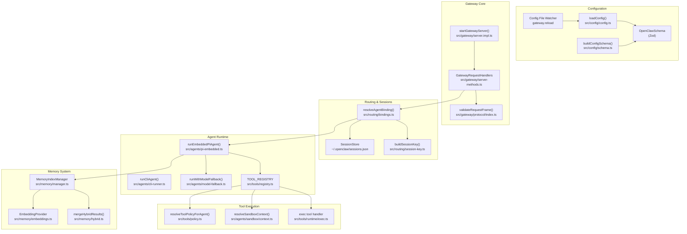
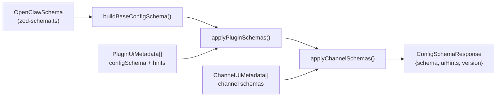
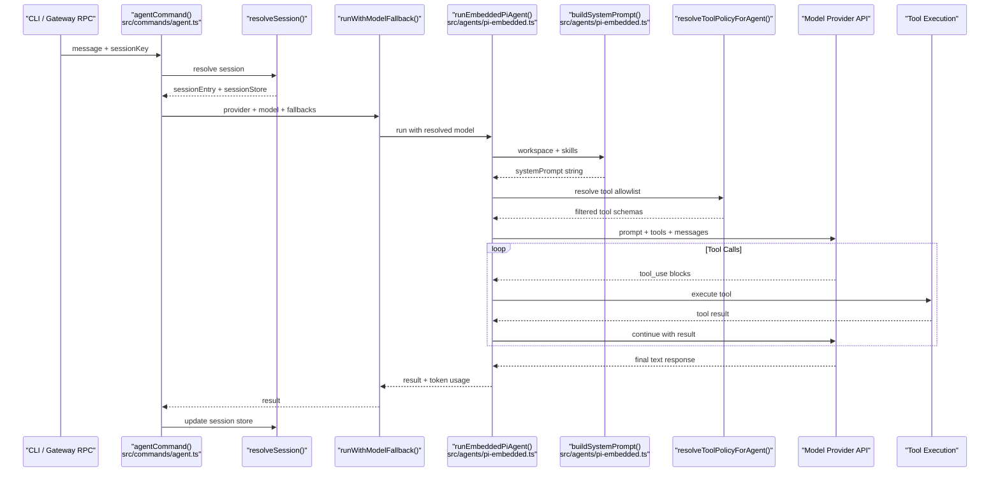
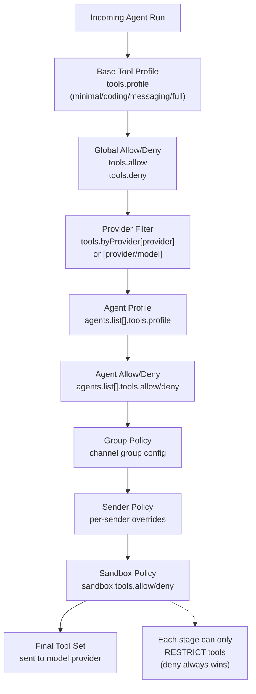
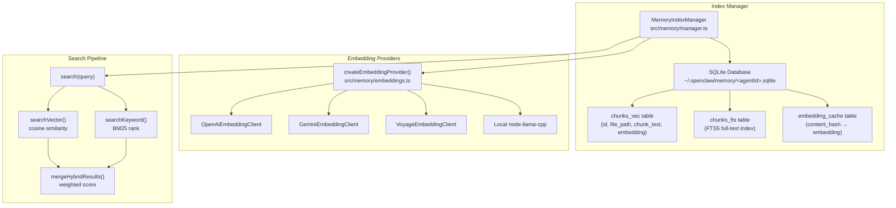
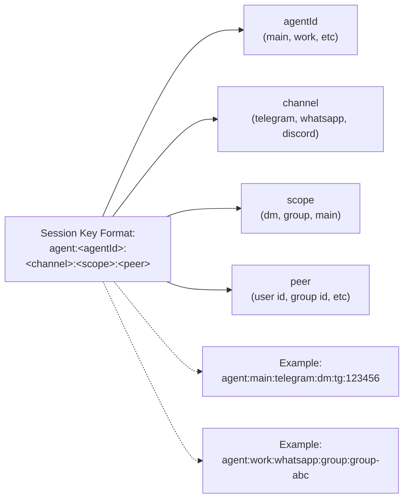
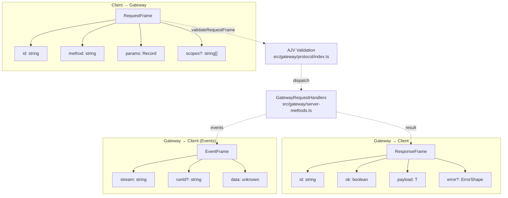
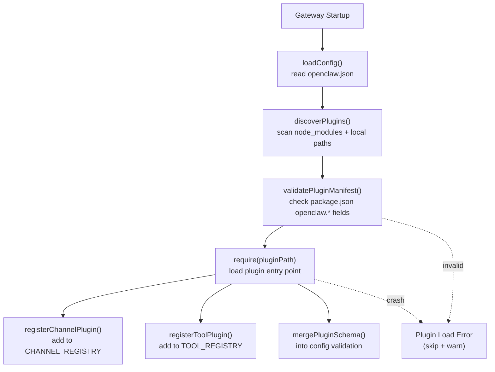
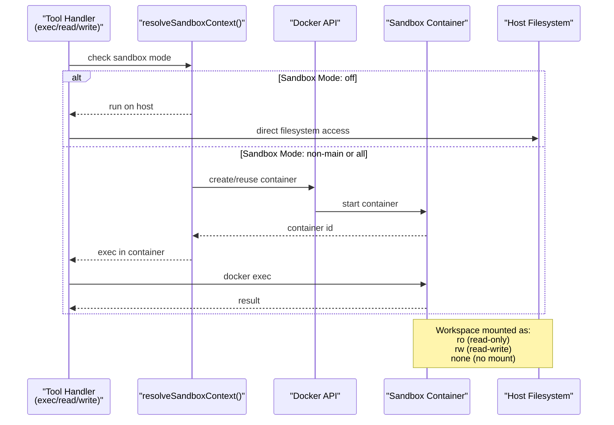
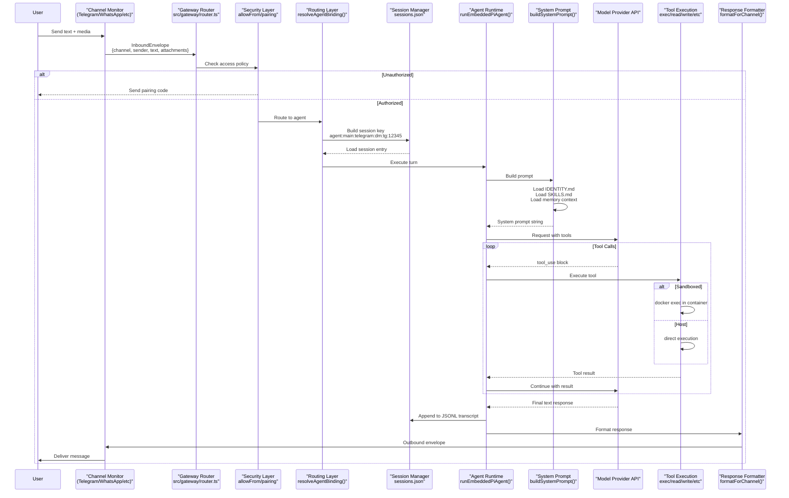

# Page: Architecture Deep Dive

# Architecture Deep Dive

<details>
<summary>Relevant source files</summary>

The following files were used as context for generating this wiki page:

- [.agents/skills/mintlify/SKILL.md](.agents/skills/mintlify/SKILL.md)
- [.github/ISSUE_TEMPLATE/bug_report.md](.github/ISSUE_TEMPLATE/bug_report.md)
- [.github/ISSUE_TEMPLATE/config.yml](.github/ISSUE_TEMPLATE/config.yml)
- [.github/ISSUE_TEMPLATE/feature_request.md](.github/ISSUE_TEMPLATE/feature_request.md)
- [.github/labeler.yml](.github/labeler.yml)
- [.github/workflows/auto-response.yml](.github/workflows/auto-response.yml)
- [.github/workflows/labeler.yml](.github/workflows/labeler.yml)
- [.github/workflows/stale.yml](.github/workflows/stale.yml)
- [AGENTS.md](AGENTS.md)
- [CHANGELOG.md](CHANGELOG.md)
- [docs/channels/index.md](docs/channels/index.md)
- [docs/cli/memory.md](docs/cli/memory.md)
- [docs/cli/sandbox.md](docs/cli/sandbox.md)
- [docs/concepts/memory.md](docs/concepts/memory.md)
- [docs/gateway/configuration.md](docs/gateway/configuration.md)
- [docs/gateway/sandbox-vs-tool-policy-vs-elevated.md](docs/gateway/sandbox-vs-tool-policy-vs-elevated.md)
- [docs/gateway/sandboxing.md](docs/gateway/sandboxing.md)
- [docs/platforms/mac/skills.md](docs/platforms/mac/skills.md)
- [docs/tools/elevated.md](docs/tools/elevated.md)
- [docs/tools/index.md](docs/tools/index.md)
- [docs/tools/skills-config.md](docs/tools/skills-config.md)
- [docs/zh-CN/channels/index.md](docs/zh-CN/channels/index.md)
- [scripts/sync-labels.ts](scripts/sync-labels.ts)
- [src/agents/memory-search.test.ts](src/agents/memory-search.test.ts)
- [src/agents/memory-search.ts](src/agents/memory-search.ts)
- [src/agents/sandbox-explain.test.ts](src/agents/sandbox-explain.test.ts)
- [src/agents/sandbox.ts](src/agents/sandbox.ts)
- [src/cli/memory-cli.test.ts](src/cli/memory-cli.test.ts)
- [src/cli/memory-cli.ts](src/cli/memory-cli.ts)
- [src/cli/models-cli.test.ts](src/cli/models-cli.test.ts)
- [src/commands/agent.test.ts](src/commands/agent.test.ts)
- [src/commands/agent.ts](src/commands/agent.ts)
- [src/config/schema.ts](src/config/schema.ts)
- [src/config/types.tools.ts](src/config/types.tools.ts)
- [src/config/types.ts](src/config/types.ts)
- [src/config/zod-schema.agent-runtime.ts](src/config/zod-schema.agent-runtime.ts)
- [src/config/zod-schema.ts](src/config/zod-schema.ts)
- [src/cron/isolated-agent.ts](src/cron/isolated-agent.ts)
- [src/cron/run-log.test.ts](src/cron/run-log.test.ts)
- [src/cron/run-log.ts](src/cron/run-log.ts)
- [src/cron/store.ts](src/cron/store.ts)
- [src/gateway/protocol/index.ts](src/gateway/protocol/index.ts)
- [src/gateway/protocol/schema.ts](src/gateway/protocol/schema.ts)
- [src/gateway/protocol/schema/agents-models-skills.ts](src/gateway/protocol/schema/agents-models-skills.ts)
- [src/gateway/protocol/schema/protocol-schemas.ts](src/gateway/protocol/schema/protocol-schemas.ts)
- [src/gateway/protocol/schema/types.ts](src/gateway/protocol/schema/types.ts)
- [src/gateway/server-methods-list.ts](src/gateway/server-methods-list.ts)
- [src/gateway/server-methods.ts](src/gateway/server-methods.ts)
- [src/gateway/server-methods/agents.ts](src/gateway/server-methods/agents.ts)
- [src/gateway/server.ts](src/gateway/server.ts)
- [src/memory/embeddings.test.ts](src/memory/embeddings.test.ts)
- [src/memory/embeddings.ts](src/memory/embeddings.ts)
- [src/memory/manager.ts](src/memory/manager.ts)

</details>


This document provides an in-depth technical explanation of OpenClaw's system architecture, covering core modules, data flow patterns, and extension points. For operational guidance on deployment and configuration, see [Deployment](#13) and [Configuration](#4).

---

## System Overview

OpenClaw is structured as a **hub-and-spoke architecture** with the Gateway Server as the central control plane. The Gateway coordinates:

- **Inbound message routing** from multiple channels (WhatsApp, Telegram, Discord, etc.)
- **Agent execution** with model provider integration, tool invocation, and session management
- **Outbound delivery** back to originating channels
- **Configuration management** with hot-reload and validation
- **Extension loading** for channels and capabilities

The system separates concerns across three primary layers:

1. **Transport Layer**: Gateway WebSocket RPC + HTTP endpoints
2. **Orchestration Layer**: Agent runtime, session management, routing
3. **Execution Layer**: Tool execution (sandboxed or host), memory search, model API calls

Sources: [src/gateway/server.ts:1-4](), [docs/gateway/configuration.md:1-480](), [AGENTS.md:1-180]()

---

## Core Module Organization



Sources: [src/config/config.ts:1-100](), [src/gateway/server-methods.ts:1-33](), [src/agents/pi-embedded.ts:1-50](), [src/memory/manager.ts:1-100](), [src/tools/policy.ts:1-50]()

---

## Configuration System Architecture

OpenClaw's configuration is validated through a **Zod schema pipeline** that merges core definitions with plugin/channel schemas at runtime.

### Schema Construction Pipeline



**Key Functions:**
- `buildConfigSchema()` ([src/config/schema.ts:313-335]()): Merges base + plugin + channel schemas
- `OpenClawSchema.toJSONSchema()` ([src/config/zod-schema.ts:95-632]()): Converts Zod to JSON Schema (draft-07)
- `validateConfigObjectWithPlugins()` ([src/config/config.ts]()): Runtime validation with error reporting

**Config Hot-Reload:**
The Gateway watches `openclaw.json` via `chokidar` and applies changes based on `gateway.reload.mode`:
- **`hybrid`** (default): Hot-apply safe changes, auto-restart for infrastructure changes
- **`hot`**: Hot-apply only, warn on unsafe changes
- **`restart`**: Always restart
- **`off`**: No file watching

Sources: [src/config/schema.ts:276-335](), [src/config/zod-schema.ts:95-632](), [docs/gateway/configuration.md:327-365]()

---

## Agent Execution Pipeline

The agent execution pipeline is the core orchestration flow from user message to model response.

### Execution Flow Diagram



**Key Pipeline Stages:**

1. **Session Resolution** ([src/commands/agent/session.ts]()): Determine `sessionKey` from `--to`, `--session-id`, or `--session-key`
2. **Workspace Setup** ([src/agents/workspace.ts]()): Ensure `IDENTITY.md`, `SKILLS.md`, bootstrap files exist
3. **Model Selection** ([src/agents/model-selection.ts]()): Resolve primary + fallbacks, check allowlists
4. **System Prompt Building** ([src/agents/pi-embedded.ts:200-300]()): Assemble identity + skills + memory + tools sections
5. **Tool Policy Resolution** ([src/tools/policy.ts]()): Apply cascading filters (global → provider → agent → group → sandbox)
6. **Model Prompting** ([src/agents/pi-embedded.ts:400-500]()): Call provider API with streaming
7. **Tool Execution Loop** ([src/tools/runtime/]()): Execute tools, return results, continue
8. **Session Persistence** ([src/config/sessions.ts]()): Append to JSONL transcript, update token usage

Sources: [src/commands/agent.ts:64-528](), [src/agents/pi-embedded.ts:1-100](), [src/tools/policy.ts:1-50]()

---

## Tool Policy Resolution Chain

Tool availability is determined by a **cascading policy chain** where each stage can only narrow (never expand) the tool set.

### Policy Resolution Sequence



**Resolution Algorithm** ([src/tools/policy.ts:100-300]()):

```typescript
// Pseudo-code representation
function resolveToolPolicy(context: AgentRunContext): Set<string> {
  let tools = ALL_TOOLS;
  
  // 1. Apply base profile
  if (config.tools.profile) {
    tools = intersect(tools, PROFILE_TOOLS[config.tools.profile]);
  }
  
  // 2. Apply global allow/deny
  if (config.tools.allow) {
    tools = intersect(tools, config.tools.allow);
  }
  tools = subtract(tools, config.tools.deny);
  
  // 3. Apply provider-specific filter
  const providerKey = `${context.provider}/${context.model}`;
  if (config.tools.byProvider[providerKey]) {
    const providerPolicy = config.tools.byProvider[providerKey];
    if (providerPolicy.allow) {
      tools = intersect(tools, providerPolicy.allow);
    }
    tools = subtract(tools, providerPolicy.deny);
  }
  
  // 4-7. Apply agent, group, sender, sandbox filters...
  // (each stage follows same intersect + subtract pattern)
  
  return tools;
}
```

**Tool Groups** ([src/tools/registry.ts:50-100]()):

Tool policies support `group:*` syntax that expands to multiple tools:
- `group:runtime` → `["exec", "bash", "process"]`
- `group:fs` → `["read", "write", "edit", "apply_patch"]`
- `group:sessions` → `["sessions_list", "sessions_history", "sessions_send", ...]`
- `group:openclaw` → all built-in tools (excludes plugin tools)

Sources: [src/tools/policy.ts:1-300](), [src/config/types.tools.ts:139-212](), [docs/tools/index.md:82-137]()

---

## Memory System Architecture

The memory system provides **hybrid search** (vector similarity + BM25 keyword) over workspace Markdown files and session transcripts.

### Memory Index Manager Structure



**Key Components:**

- **`MemoryIndexManager`** ([src/memory/manager.ts:111-1000]()): Central class managing indexing, search, and provider lifecycle
- **Chunking** ([src/memory/internal.ts:200-300]()): Markdown split into ~400 token chunks with 80-token overlap
- **Embedding Cache** ([src/memory/manager.ts:400-500]()): Content-hash keyed cache prevents redundant API calls
- **Hybrid Search** ([src/memory/hybrid.ts:1-100]()): Combines vector (70%) + BM25 (30%) scores
- **sqlite-vec Extension** ([src/memory/sqlite-vec.ts:1-50]()): Native vector search acceleration when available

**Search Flow:**

1. **Query Embedding** ([src/memory/manager.ts:296]()): Generate embedding for search query
2. **Vector Search** ([src/memory/manager-search.ts:50-150]()): Find top-K by cosine similarity
3. **Keyword Search** ([src/memory/manager-search.ts:200-300]()): Find top-K by BM25 rank
4. **Merge & Rerank** ([src/memory/hybrid.ts:50-100]()): Combine scores with configurable weights
5. **Snippet Formatting** ([src/memory/manager.ts:300-350]()): Truncate to ~700 chars, include line ranges

Sources: [src/memory/manager.ts:111-700](), [src/memory/hybrid.ts:1-100](), [docs/concepts/memory.md:78-442]()

---

## Session and Routing System

OpenClaw routes messages to agent sessions via **session keys** that encode routing context.

### Session Key Structure



**Session Scope Modes** ([src/config/types.base.ts:200-250]()):

| Scope | Session Key Pattern | Use Case |
|-------|-------------------|----------|
| `main` | `agent:main:*:main` | Single shared session across all channels |
| `per-peer` | `agent:main:*:dm:<peer>` | Separate session per user (channel-agnostic) |
| `per-channel-peer` | `agent:main:<channel>:dm:<peer>` | Separate session per user per channel |
| `per-account-channel-peer` | `agent:main:<channel>:<account>:dm:<peer>` | Separate session per account per channel per user |

**Session Store Structure:**

The session store is a JSON file (`~/.openclaw/sessions.json`) mapping session keys to session entries:

```typescript
// Type definition from src/config/sessions.ts
type SessionStore = Record<string, SessionEntry>;

type SessionEntry = {
  sessionId: string;
  updatedAt: number;
  channel?: string;
  chatType?: "direct" | "group";
  modelOverride?: string;
  providerOverride?: string;
  thinkingLevel?: ThinkLevel;
  verboseLevel?: VerboseLevel;
  authProfileOverride?: string;
  skillsSnapshot?: SkillsSnapshot;
  // ... additional fields
};
```

**Routing Algorithm** ([src/routing/bindings.ts:100-300]()):

1. **Match Bindings** ([src/routing/bindings.ts:150-200]()): Test `channel`, `accountId`, `chatType`, `sender` against `bindings[]` rules
2. **Resolve Agent** ([src/routing/bindings.ts:250-300]()): Select first matching agent or default agent
3. **Build Session Key** ([src/routing/session-key.ts:50-150]()): Construct key from agent + channel + scope + peer
4. **Load Session** ([src/config/sessions.ts:200-300]()): Read entry from store or create new

Sources: [src/routing/session-key.ts:1-200](), [src/config/sessions.ts:1-300](), [docs/concepts/session.md:1-100]()

---

## Gateway WebSocket Protocol

The Gateway exposes a **TypeBox-validated WebSocket RPC** protocol for all control-plane operations.

### Protocol Frame Structure



**Method Registry** ([src/gateway/server-methods.ts:29-100]()):

```typescript
const GATEWAY_METHODS: GatewayRequestHandlers = {
  // Authentication
  connect: { handler: connectHandlers.connect, auth: false },
  
  // Config management (operator.admin scope)
  "config.get": { handler: configHandlers.get, scopes: [ADMIN_SCOPE] },
  "config.set": { handler: configHandlers.set, scopes: [ADMIN_SCOPE] },
  "config.apply": { handler: configHandlers.apply, scopes: [ADMIN_SCOPE] },
  "config.patch": { handler: configHandlers.patch, scopes: [ADMIN_SCOPE] },
  
  // Agent operations (operator.write scope)
  "chat.send": { handler: chatHandlers.send, scopes: [WRITE_SCOPE] },
  "chat.history": { handler: chatHandlers.history, scopes: [READ_SCOPE] },
  "agent.wait": { handler: agentHandlers.wait, scopes: [WRITE_SCOPE] },
  
  // Session management
  "sessions.list": { handler: sessionsHandlers.list, scopes: [READ_SCOPE] },
  "sessions.compact": { handler: sessionsHandlers.compact, scopes: [WRITE_SCOPE] },
  
  // Cron jobs
  "cron.add": { handler: cronHandlers.add, scopes: [WRITE_SCOPE] },
  "cron.list": { handler: cronHandlers.list, scopes: [READ_SCOPE] },
  
  // ... 50+ additional methods
};
```

**Scope-Based Authorization:**

- `operator.admin`: Full config access, system commands
- `operator.write`: Agent runs, session management, cron
- `operator.read`: Status queries, logs, read-only operations
- `operator.approvals`: Exec approval grant/deny

Sources: [src/gateway/protocol/schema/frames.ts:1-100](), [src/gateway/server-methods.ts:1-150](), [src/gateway/protocol/index.ts:223-400]()

---

## Extension and Plugin System

OpenClaw supports **npm-packaged extensions** that register additional channels, tools, or capabilities.

### Plugin Loading Pipeline



**Plugin Package Structure:**

```json
{
  "name": "@openclaw/matrix",
  "openclaw": {
    "channel": {
      "id": "matrix",
      "label": "Matrix",
      "order": 50,
      "docs": "./docs/matrix.md"
    },
    "configSchema": { /* JSON Schema */ },
    "configUiHints": { /* UI metadata */ }
  },
  "exports": {
    "./channel": "./dist/channel.js"
  },
  "dependencies": {
    "matrix-js-sdk": "^x.y.z"
  },
  "devDependencies": {
    "openclaw": "workspace:*"
  }
}
```

**Channel Plugin Contract:**

```typescript
// Plugin SDK type (dist/plugin-sdk)
export type ChannelPlugin = {
  id: string;
  label: string;
  
  // Lifecycle hooks
  init(context: ChannelContext): Promise<void>;
  shutdown(): Promise<void>;
  
  // Message handling
  onInboundMessage(envelope: InboundEnvelope): Promise<void>;
  
  // Status probing
  probeStatus(): Promise<ChannelStatus>;
};
```

**Plugin Discovery** ([src/plugins/loader.ts:50-200]()):

1. Scan `node_modules/@openclaw/*` for packages with `openclaw.*` metadata
2. Check `plugins.load.paths` for local plugin directories
3. Validate `openclaw.channel` or `openclaw.tool` metadata
4. Load plugin module via `require()` or `import()`
5. Register with appropriate registry (`CHANNEL_REGISTRY`, `TOOL_REGISTRY`)

Sources: [AGENTS.md:11-18](), [src/config/schema.ts:209-248](), [docs/tools/index.md:166-178]()

---

## Sandboxing and Isolation

Tool execution can run in **Docker containers** for isolation. Sandboxing is opt-in and configured per-agent.

### Sandbox Execution Flow



**Sandbox Configuration** ([src/agents/sandbox/config.ts:50-200]()):

```typescript
// Resolved from agents.defaults.sandbox
type SandboxConfig = {
  mode: "off" | "non-main" | "all";  // When to sandbox
  scope: "session" | "agent" | "shared";  // Container lifecycle
  workspaceAccess: "none" | "ro" | "rw";  // Workspace mount
  docker: {
    image: string;  // Default: ghcr.io/openclaw/openclaw:sandbox
    containerPrefix: string;
    network: string;
    user: string;
    capDrop: string[];
    // ... resource limits
  };
  tools: {
    allow?: string[];
    deny?: string[];
  };
};
```

**Container Lifecycle** ([src/agents/sandbox/manage.ts:1-200]()):

- **`session`**: One container per session (destroyed on session end)
- **`agent`**: One container per agent (reused across sessions)
- **`shared`**: Single shared container (reused by all sessions)

**Workspace Access:**

- **`none`**: No workspace mount (tools read/write to container-local `/workspace`)
- **`ro`**: Read-only bind mount (tools can read workspace, writes fail)
- **`rw`**: Read-write bind mount (tools can mutate workspace files)

Sources: [src/agents/sandbox/context.ts:1-200](), [src/agents/sandbox/docker.ts:1-300](), [docs/gateway/sandboxing.md:1-100]()

---

## Data Flow: Inbound Message to Response

This diagram traces a complete message flow from channel ingestion to agent response.



**Key Transformation Points:**

1. **Envelope Normalization** ([src/channels/envelope.ts]()): Channel-specific format → standard `InboundEnvelope`
2. **Security Gating** ([src/routing/access-control.ts]()): `allowFrom` + pairing checks
3. **Session Key Construction** ([src/routing/session-key.ts]()): Build from channel + peer + scope
4. **Tool Policy Resolution** ([src/tools/policy.ts]()): Apply cascading filters
5. **Response Formatting** ([src/channels/formatting.ts]()): Standard format → channel-specific syntax

Sources: [src/gateway/router.ts:1-200](), [src/routing/bindings.ts:1-300](), [src/agents/pi-embedded.ts:1-500]()

---

## Summary

OpenClaw's architecture prioritizes **modularity** and **extensibility** through:

- **Clear separation** between transport (Gateway RPC), orchestration (routing/sessions), and execution (agents/tools)
- **Zod-based validation** with plugin schema merging for type-safe configuration
- **Cascading policy resolution** for tools, allowing fine-grained control without config duplication
- **Hybrid memory search** combining semantic (vector) and lexical (BM25) retrieval
- **Optional sandboxing** via Docker for reduced blast radius
- **Hot-reload** for most config changes without downtime
- **Extension SDK** enabling third-party channels and tools

This architecture enables OpenClaw to scale from single-user local deployments to multi-agent gateway hosts with isolated sandboxes and remote channel integrations.

For deployment-specific guidance, see [Deployment](#13). For configuration reference, see [Configuration Reference](#4).

---