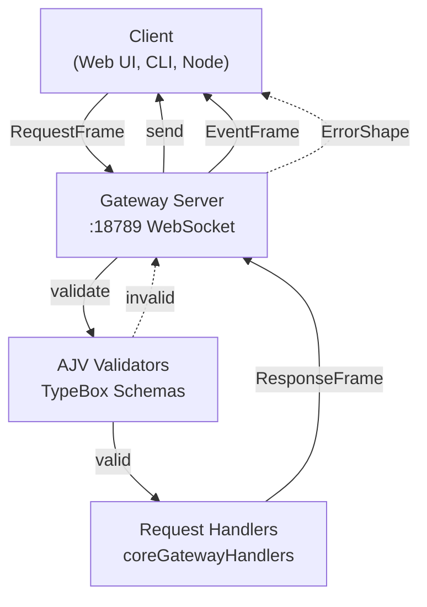
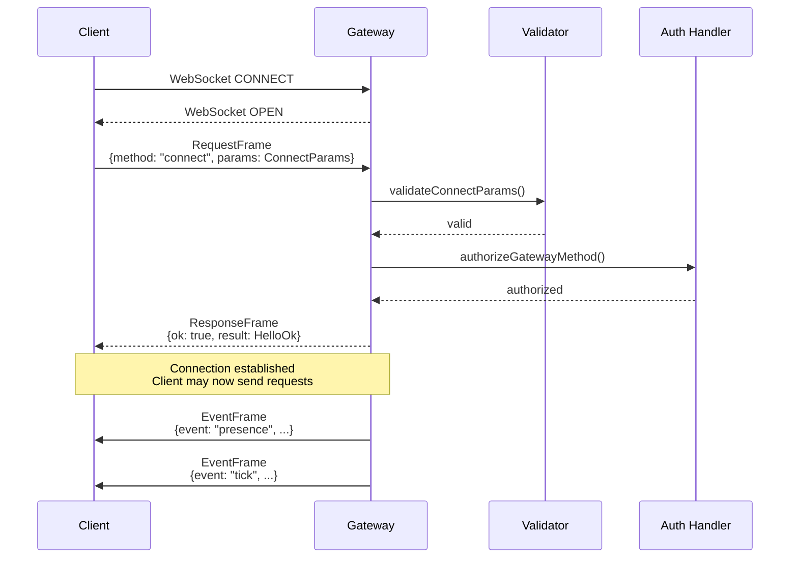
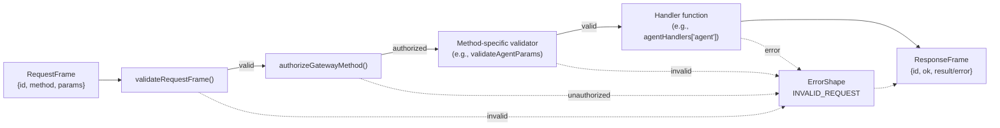
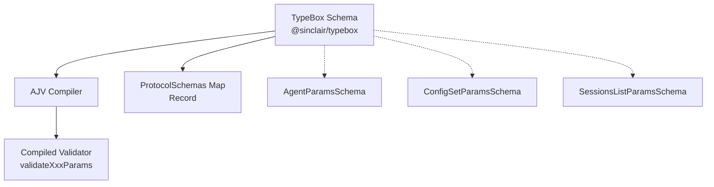
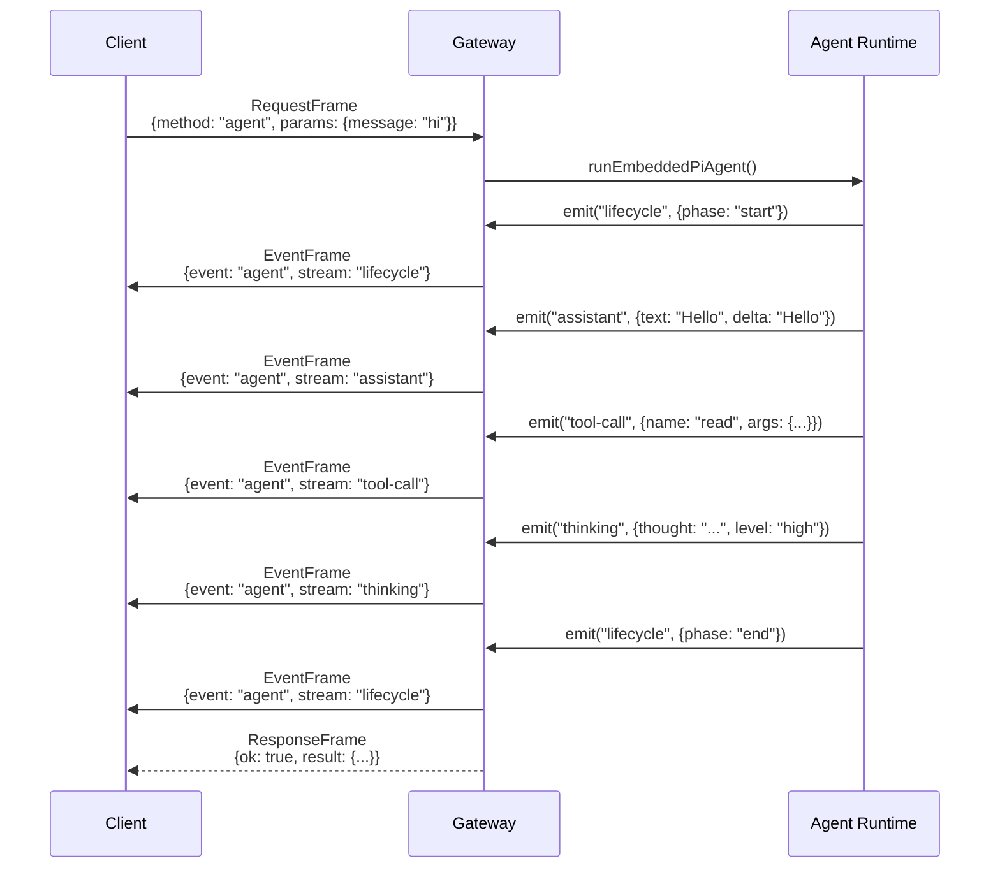
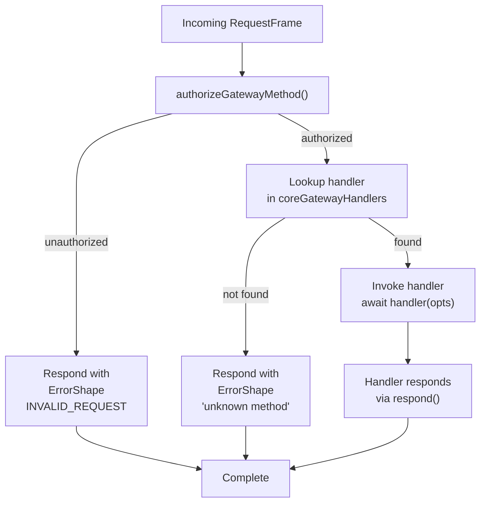

# Page: Protocol Specification

# Protocol Specification

<details>
<summary>Relevant source files</summary>

The following files were used as context for generating this wiki page:

- [src/commands/agent.test.ts](src/commands/agent.test.ts)
- [src/commands/agent.ts](src/commands/agent.ts)
- [src/cron/isolated-agent.ts](src/cron/isolated-agent.ts)
- [src/cron/run-log.test.ts](src/cron/run-log.test.ts)
- [src/cron/run-log.ts](src/cron/run-log.ts)
- [src/cron/store.ts](src/cron/store.ts)
- [src/gateway/protocol/index.ts](src/gateway/protocol/index.ts)
- [src/gateway/protocol/schema.ts](src/gateway/protocol/schema.ts)
- [src/gateway/protocol/schema/agents-models-skills.ts](src/gateway/protocol/schema/agents-models-skills.ts)
- [src/gateway/protocol/schema/protocol-schemas.ts](src/gateway/protocol/schema/protocol-schemas.ts)
- [src/gateway/protocol/schema/types.ts](src/gateway/protocol/schema/types.ts)
- [src/gateway/server-methods-list.ts](src/gateway/server-methods-list.ts)
- [src/gateway/server-methods.ts](src/gateway/server-methods.ts)
- [src/gateway/server-methods/agents.ts](src/gateway/server-methods/agents.ts)
- [src/gateway/server.ts](src/gateway/server.ts)

</details>


This document formally specifies the Gateway WebSocket RPC protocol used for client-server communication in OpenClaw. It covers frame types, validation schemas, authorization scopes, and error handling. This specification is intended for developers building clients, integrations, or extensions that communicate with the Gateway.

For information about the Gateway server implementation and lifecycle, see [Gateway Service Management](#3.3). For details on how the Gateway routes messages to agents, see [Message Flow](#8.3).

---

## Protocol Overview

The Gateway exposes a **WebSocket RPC protocol** on port 18789 (configurable via `gateway.port`). All communication uses structured JSON frames validated with TypeBox schemas and AJV validators. The protocol follows a request-response pattern for client-initiated operations, with server-initiated events for push notifications.

**Key characteristics:**
- Binary WebSocket transport with JSON payloads
- Strict schema validation using AJV (Ajv package)
- Protocol version negotiation via `PROTOCOL_VERSION`
- Role-based authorization with OAuth-style scopes
- Streaming support for long-running operations



**Sources:** [src/gateway/protocol/index.ts:1-595](), [src/gateway/server-methods.ts:193-219]()

---

## Frame Types

The protocol defines four primary frame types, all validated against TypeBox schemas compiled with AJV.

### Frame Type Reference

| Frame Type | Direction | Purpose | Schema |
|------------|-----------|---------|--------|
| `GatewayFrame` | Server → Client | Union type for all frames | `GatewayFrameSchema` |
| `RequestFrame` | Client → Server | Method invocation with params | `RequestFrameSchema` |
| `ResponseFrame` | Server → Client | Method result or error | `ResponseFrameSchema` |
| `EventFrame` | Server → Client | Server-initiated notifications | `EventFrameSchema` |

### RequestFrame

Client-initiated RPC calls. Each request includes a unique request ID for correlation.

```typescript
{
  id: number;           // Unique request identifier
  method: string;       // RPC method name (e.g., "agent", "config.set")
  params?: object;      // Method-specific parameters (validated per-method)
}
```

**Validation:** [src/gateway/protocol/index.ts:230]()

### ResponseFrame

Server responses to client requests. Includes success flag and either result data or error shape.

```typescript
{
  id: number;           // Matches request ID
  ok: boolean;          // true = success, false = error
  result?: unknown;     // Present when ok=true
  error?: ErrorShape;   // Present when ok=false
}
```

**Validation:** [src/gateway/protocol/index.ts:231]()

### EventFrame

Server-initiated push notifications. Events do not expect responses.

```typescript
{
  event: string;        // Event type (e.g., "agent", "chat", "presence")
  data?: unknown;       // Event-specific payload
}
```

**Validation:** [src/gateway/protocol/index.ts:232]()

### ErrorShape

Standard error format returned in failed responses.

```typescript
{
  code: number;         // ErrorCodes enum value
  message: string;      // Human-readable error description
  details?: unknown;    // Optional additional context
}
```

**Sources:** [src/gateway/protocol/schema/frames.ts:1-150](), [src/gateway/protocol/index.ts:229-233]()

---

## Connection Lifecycle

### 1. Connection Establishment

Clients connect via WebSocket and send a `connect` method with authentication credentials.



**ConnectParams Schema:**

```typescript
{
  version?: number;          // Protocol version (default: PROTOCOL_VERSION)
  role?: "operator" | "node"; // Connection role
  scopes?: string[];         // OAuth-style scopes
  token?: string;            // Authentication token
  password?: string;         // Password authentication
  deviceId?: string;         // Device pairing ID
}
```

**HelloOk Response:**

```typescript
{
  version: number;           // Server protocol version
  sessionId?: string;        // Assigned session identifier
  capabilities?: string[];   // Available features
}
```

**Sources:** [src/gateway/protocol/schema/frames.ts:1-50](), [src/gateway/server-methods/connect.ts:1-100]()

### 2. Authorization and Scopes

All methods (except `connect`) require role-based authorization. The `authorizeGatewayMethod` function enforces access control.

#### Authorization Scopes

| Scope | Access Level | Typical Use Case |
|-------|--------------|------------------|
| `operator.admin` | Full admin access | Configuration changes, agent management |
| `operator.write` | Read + write operations | Send messages, invoke agents |
| `operator.read` | Read-only operations | Status queries, session lists |
| `operator.approvals` | Exec approval management | Approve/reject command execution |
| `operator.pairing` | Device pairing | Pair nodes, manage tokens |

#### Role-Based Access

| Role | Default Scopes | Method Access |
|------|----------------|---------------|
| `operator` | Configurable via `scopes` | All operator.* methods |
| `node` | None (node-specific methods) | `node.invoke.result`, `node.event`, `skills.bins` |

**Method Authorization Examples:**

```typescript
// Read methods (require operator.read OR operator.write)
READ_METHODS = [
  "health", "logs.tail", "channels.status",
  "models.list", "agents.list", "sessions.list"
]

// Write methods (require operator.write)
WRITE_METHODS = [
  "send", "agent", "wake", "node.invoke", "chat.send"
]

// Admin methods (require operator.admin)
ADMIN_METHODS = [
  "config.*", "wizard.*", "agents.create",
  "sessions.delete", "cron.add"
]
```

**Sources:** [src/gateway/server-methods.ts:29-163]()

### 3. Request-Response Cycle

Standard method invocation follows the RPC pattern with strict validation.



**Sources:** [src/gateway/server-methods.ts:193-219]()

---

## Method Schemas and Validation

Every RPC method has a corresponding TypeBox schema and compiled AJV validator. The validation pipeline ensures type safety and prevents malformed requests.

### Schema Architecture



### Method Schema Examples

#### Agent Execution (`agent` method)

```typescript
// Schema: AgentParamsSchema
{
  message: string;           // Required: user prompt
  sessionId?: string;        // Optional: resume session
  to?: string;               // Optional: E.164 phone number
  thinking?: string;         // Optional: "low" | "high" | "off"
  verbose?: boolean;         // Optional: verbose mode
  images?: string[];         // Optional: image URLs
}

// Validator
validateAgentParams(params) // returns boolean
```

#### Configuration Update (`config.set` method)

```typescript
// Schema: ConfigSetParamsSchema
{
  key: string;               // Config path (e.g., "agents.defaults.model")
  value: unknown;            // New value (type-checked by config schema)
}

// Validator
validateConfigSetParams(params)
```

#### Session List (`sessions.list` method)

```typescript
// Schema: SessionsListParamsSchema
{
  limit?: number;            // Max results (default: 50)
  offset?: number;           // Pagination offset
  agentId?: string;          // Filter by agent
}

// Validator
validateSessionsListParams(params)
```

**Sources:** [src/gateway/protocol/index.ts:229-364](), [src/gateway/protocol/schema/protocol-schemas.ts:1-259]()

### Validation Error Formatting

Failed validation returns detailed error messages via `formatValidationErrors`:

```typescript
// Input: AJV ErrorObject[]
[
  {
    keyword: "additionalProperties",
    instancePath: "",
    params: { additionalProperty: "unknownField" }
  }
]

// Output: Formatted string
"at root: unexpected property 'unknownField'"
```

**Sources:** [src/gateway/protocol/index.ts:366-400]()

---

## Gateway Methods Reference

The Gateway exposes 90+ RPC methods across multiple functional domains. Methods are organized by prefix.

### Core Method Categories

| Prefix | Domain | Example Methods |
|--------|--------|-----------------|
| `agent*` | Agent execution | `agent`, `agent.wait`, `agent.identity.get` |
| `agents.*` | Agent management | `agents.list`, `agents.create`, `agents.delete` |
| `config.*` | Configuration | `config.get`, `config.set`, `config.apply` |
| `channels.*` | Channel control | `channels.status`, `channels.logout` |
| `sessions.*` | Session management | `sessions.list`, `sessions.patch`, `sessions.compact` |
| `cron.*` | Scheduled jobs | `cron.list`, `cron.add`, `cron.run` |
| `node.*` | Device nodes | `node.invoke`, `node.list`, `node.pair.request` |
| `skills.*` | Skill management | `skills.status`, `skills.install` |
| `wizard.*` | Onboarding wizard | `wizard.start`, `wizard.next` |
| `chat.*` | WebSocket chat | `chat.send`, `chat.history`, `chat.abort` |

### Complete Method List

The full method registry is maintained in `BASE_METHODS` and extended by channel plugins:

```typescript
// Base methods
const BASE_METHODS = [
  "health", "logs.tail", "channels.status",
  "config.get", "config.set", "agent",
  "sessions.list", "cron.add", ...
];

// Dynamic extension by plugins
function listGatewayMethods(): string[] {
  const channelMethods = listChannelPlugins()
    .flatMap(plugin => plugin.gatewayMethods ?? []);
  return [...BASE_METHODS, ...channelMethods];
}
```

**Sources:** [src/gateway/server-methods-list.ts:1-97]()

---

## Event Streaming

The Gateway pushes events to connected clients for real-time updates. Events do not require acknowledgment.

### Event Types

| Event | Trigger | Payload Schema |
|-------|---------|----------------|
| `agent` | Agent execution updates | `AgentEventSchema` |
| `chat` | WebSocket chat messages | `ChatEventSchema` |
| `presence` | Client presence changes | `PresenceEntry[]` |
| `tick` | Periodic heartbeat | `TickEventSchema` |
| `shutdown` | Gateway shutdown | `ShutdownEventSchema` |
| `cron` | Cron job execution | `CronJob` |
| `node.invoke.request` | Node capability invocation | `NodeInvokeParams` |
| `exec.approval.requested` | Exec approval needed | `ExecApprovalRequestParams` |

### Agent Event Streaming

Agent execution emits a stream of events tracking lifecycle, assistant responses, tool calls, and thinking:



**Agent Event Streams:**

| Stream | Purpose | Data Fields |
|--------|---------|-------------|
| `lifecycle` | Execution phases | `phase`, `startedAt`, `endedAt`, `aborted` |
| `assistant` | LLM responses | `text`, `delta` (streaming) |
| `tool-call` | Tool invocations | `name`, `args`, `id` |
| `tool-result` | Tool outputs | `result`, `id` |
| `thinking` | Reasoning tokens | `thought`, `level` |
| `error` | Execution errors | `error`, `message` |

**Sources:** [src/gateway/protocol/schema/agent.ts:1-100](), [src/gateway/server-methods-list.ts:98-118]()

---

## Error Handling

All errors follow the `ErrorShape` format with standardized error codes from the `ErrorCodes` enum.

### Error Code Reference

| Code | Constant | Meaning | Example Trigger |
|------|----------|---------|-----------------|
| 1000 | `INVALID_REQUEST` | Malformed request or unauthorized | Schema validation failure, missing scope |
| 1001 | `INTERNAL_ERROR` | Server-side error | Unhandled exception in handler |
| 1002 | `NOT_FOUND` | Resource not found | Unknown session ID |
| 1003 | `CONFLICT` | Resource conflict | Agent ID already exists |
| 1004 | `TIMEOUT` | Operation timeout | Agent execution exceeded limit |
| 1005 | `RATE_LIMIT` | Rate limit exceeded | Too many requests |

### Error Response Format

```typescript
// ResponseFrame with error
{
  id: 42,
  ok: false,
  error: {
    code: 1000,
    message: "invalid agents.create params: at root: unexpected property 'extra'",
    details: {
      validationErrors: [...]  // Optional: AJV error objects
    }
  }
}
```

### Error Helper Function

The `errorShape` helper constructs standardized error objects:

```typescript
function errorShape(
  code: number,
  message: string,
  details?: unknown
): ErrorShape {
  return { code, message, details };
}

// Usage in handlers
respond(false, undefined, errorShape(
  ErrorCodes.INVALID_REQUEST,
  "agent not found"
));
```

**Sources:** [src/gateway/protocol/schema/error-codes.ts:1-50](), [src/gateway/protocol/schema/frames.ts:50-100]()

---

## Protocol Versioning

The protocol includes a version constant to enable compatibility checks and gradual migration.

### Version Negotiation

```typescript
export const PROTOCOL_VERSION = 3 as const;

// Client sends version in connect
{
  method: "connect",
  params: {
    version: 3  // Client's supported version
  }
}

// Server responds with its version
{
  ok: true,
  result: {
    version: 3,  // Server's version
    ...
  }
}
```

If versions are incompatible, the server may reject the connection or enable compatibility mode. Version mismatches are logged but currently do not block connections.

**Version History:**
- **Version 1:** Initial WebSocket RPC protocol
- **Version 2:** Added agent events streaming, node pairing
- **Version 3:** Current version with chat WebSocket methods, exec approvals

**Sources:** [src/gateway/protocol/schema/protocol-schemas.ts:258]()

---

## Handler Implementation

Gateway methods are implemented as async functions in handler objects, grouped by functional domain.

### Handler Structure

```typescript
type GatewayRequestHandlers = Record<
  string,
  (opts: GatewayRequestOptions) => Promise<void>
>;

type GatewayRequestOptions = {
  req: RequestFrame;
  params: Record<string, unknown>;
  client: ConnectedClient;
  respond: (ok: boolean, result?: unknown, error?: ErrorShape) => void;
  context: ServerContext;
};
```

### Handler Example: `agents.list`

```typescript
export const agentsHandlers: GatewayRequestHandlers = {
  "agents.list": ({ params, respond }) => {
    // 1. Validate params
    if (!validateAgentsListParams(params)) {
      respond(false, undefined, errorShape(
        ErrorCodes.INVALID_REQUEST,
        `invalid agents.list params: ${formatValidationErrors(
          validateAgentsListParams.errors
        )}`
      ));
      return;
    }
    
    // 2. Load config
    const cfg = loadConfig();
    
    // 3. Execute business logic
    const result = listAgentsForGateway(cfg);
    
    // 4. Respond with result
    respond(true, result, undefined);
  }
};
```

### Handler Registry

All handlers are merged into the `coreGatewayHandlers` object:

```typescript
export const coreGatewayHandlers: GatewayRequestHandlers = {
  ...connectHandlers,
  ...agentHandlers,
  ...agentsHandlers,
  ...configHandlers,
  ...sessionsHandlers,
  ...channelsHandlers,
  // ... 15+ more handler groups
};
```

**Sources:** [src/gateway/server-methods.ts:165-191](), [src/gateway/server-methods/agents.ts:167-507]()

---

## Request Routing and Dispatch

The `handleGatewayRequest` function orchestrates validation, authorization, and handler dispatch.



**Implementation:**

```typescript
export async function handleGatewayRequest(
  opts: GatewayRequestOptions & { extraHandlers?: GatewayRequestHandlers }
): Promise<void> {
  const { req, respond, client } = opts;
  
  // 1. Authorize method
  const authError = authorizeGatewayMethod(req.method, client);
  if (authError) {
    respond(false, undefined, authError);
    return;
  }
  
  // 2. Lookup handler
  const handler = opts.extraHandlers?.[req.method] 
    ?? coreGatewayHandlers[req.method];
  if (!handler) {
    respond(false, undefined, errorShape(
      ErrorCodes.INVALID_REQUEST,
      `unknown method: ${req.method}`
    ));
    return;
  }
  
  // 3. Invoke handler
  await handler({
    req,
    params: req.params ?? {},
    client,
    respond,
    context: opts.context
  });
}
```

**Sources:** [src/gateway/server-methods.ts:193-219]()

---

## Type Safety and Code Generation

The protocol schemas serve dual purposes:
1. **Runtime validation** via AJV compiled validators
2. **TypeScript type generation** via `Static<typeof Schema>`

### Schema-to-Type Mapping

```typescript
// Schema definition
export const AgentsListParamsSchema = Type.Object({}, {
  additionalProperties: false
});

// Generated type
export type AgentsListParams = Static<typeof AgentsListParamsSchema>;
// Result: {}

// Schema definition
export const AgentsCreateParamsSchema = Type.Object({
  name: NonEmptyString,
  workspace: NonEmptyString,
  emoji: Type.Optional(Type.String()),
  avatar: Type.Optional(Type.String())
}, { additionalProperties: false });

// Generated type
export type AgentsCreateParams = Static<typeof AgentsCreateParamsSchema>;
// Result: { name: string; workspace: string; emoji?: string; avatar?: string; }
```

All protocol types are exported from the main protocol index for consumption by clients:

```typescript
export type {
  RequestFrame,
  ResponseFrame,
  EventFrame,
  AgentParams,
  ConfigSetParams,
  SessionsListParams,
  // ... 60+ more types
}
```

**Sources:** [src/gateway/protocol/schema/types.ts:1-241](), [src/gateway/protocol/index.ts:496-594]()

---

## Extension Points

The protocol supports extensibility through plugin-contributed methods.

### Plugin Gateway Methods

Channel plugins can declare additional RPC methods:

```typescript
// In plugin definition
export const customChannelPlugin = {
  id: "custom-channel",
  gatewayMethods: [
    "custom.login",
    "custom.send",
    "custom.status"
  ],
  handlers: {
    "custom.login": async ({ params, respond }) => {
      // Custom login logic
      respond(true, { ok: true }, undefined);
    }
  }
};
```

The Gateway merges plugin handlers with core handlers at startup:

```typescript
const extraHandlers = loadPluginHandlers();
await handleGatewayRequest({
  req,
  respond,
  client,
  context,
  extraHandlers  // Merged with coreGatewayHandlers
});
```

**Sources:** [src/gateway/server-methods-list.ts:93-96]()

---

## Summary

The Gateway WebSocket RPC protocol provides a strongly-typed, validated, and authorized communication layer for OpenClaw. Key design principles:

1. **Schema-First Design:** Every method has a TypeBox schema compiled to an AJV validator
2. **Type Safety:** TypeScript types generated from schemas ensure compile-time correctness
3. **Role-Based Authorization:** OAuth-style scopes control method access
4. **Structured Errors:** Standardized error codes and formatting for consistent error handling
5. **Event Streaming:** Real-time push notifications for agent execution and system events
6. **Extensibility:** Plugin system allows external methods without core modifications

**Primary Components:**
- Frame validators: `validateRequestFrame`, `validateResponseFrame`, `validateEventFrame` [src/gateway/protocol/index.ts:229-233]()
- Handler registry: `coreGatewayHandlers` [src/gateway/server-methods.ts:165-191]()
- Request dispatcher: `handleGatewayRequest` [src/gateway/server-methods.ts:193-219]()
- Error formatter: `errorShape`, `formatValidationErrors` [src/gateway/protocol/index.ts:366-400]()
- Method list: `listGatewayMethods()` [src/gateway/server-methods-list.ts:93-96]()

**Sources:** [src/gateway/protocol/index.ts:1-595](), [src/gateway/server-methods.ts:1-220](), [src/gateway/protocol/schema/protocol-schemas.ts:1-259]()

---