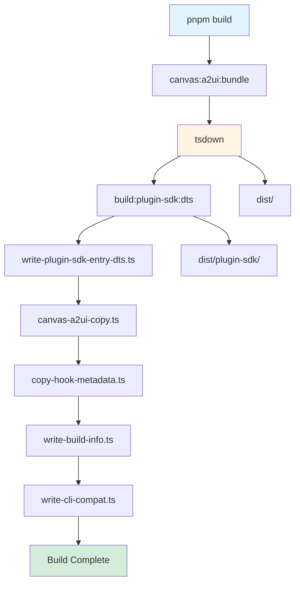
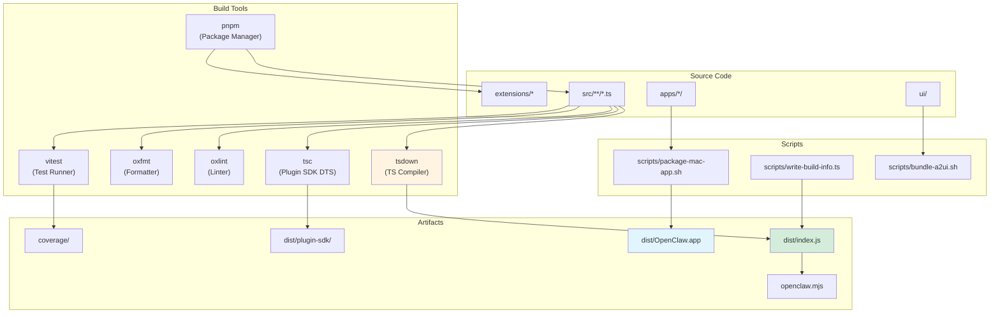

# Page: Building from Source

# Building from Source

<details>
<summary>Relevant source files</summary>

The following files were used as context for generating this wiki page:

- [.agents/skills/mintlify/SKILL.md](.agents/skills/mintlify/SKILL.md)
- [.github/ISSUE_TEMPLATE/bug_report.md](.github/ISSUE_TEMPLATE/bug_report.md)
- [.github/ISSUE_TEMPLATE/config.yml](.github/ISSUE_TEMPLATE/config.yml)
- [.github/ISSUE_TEMPLATE/feature_request.md](.github/ISSUE_TEMPLATE/feature_request.md)
- [.github/labeler.yml](.github/labeler.yml)
- [.github/workflows/auto-response.yml](.github/workflows/auto-response.yml)
- [.github/workflows/labeler.yml](.github/workflows/labeler.yml)
- [.github/workflows/stale.yml](.github/workflows/stale.yml)
- [AGENTS.md](AGENTS.md)
- [docs/channels/index.md](docs/channels/index.md)
- [docs/zh-CN/channels/index.md](docs/zh-CN/channels/index.md)
- [extensions/copilot-proxy/package.json](extensions/copilot-proxy/package.json)
- [extensions/google-antigravity-auth/package.json](extensions/google-antigravity-auth/package.json)
- [extensions/google-gemini-cli-auth/package.json](extensions/google-gemini-cli-auth/package.json)
- [extensions/matrix/CHANGELOG.md](extensions/matrix/CHANGELOG.md)
- [extensions/matrix/package.json](extensions/matrix/package.json)
- [extensions/memory-lancedb/package.json](extensions/memory-lancedb/package.json)
- [extensions/msteams/CHANGELOG.md](extensions/msteams/CHANGELOG.md)
- [extensions/msteams/package.json](extensions/msteams/package.json)
- [extensions/voice-call/CHANGELOG.md](extensions/voice-call/CHANGELOG.md)
- [extensions/voice-call/package.json](extensions/voice-call/package.json)
- [extensions/zalo/CHANGELOG.md](extensions/zalo/CHANGELOG.md)
- [extensions/zalo/package.json](extensions/zalo/package.json)
- [extensions/zalouser/package.json](extensions/zalouser/package.json)
- [package.json](package.json)
- [pnpm-lock.yaml](pnpm-lock.yaml)
- [scripts/sync-labels.ts](scripts/sync-labels.ts)

</details>


This page documents the process of building OpenClaw from source code, including dependency installation, TypeScript compilation, testing, and platform-specific builds. This covers the development build workflow used by contributors and maintainers.

For end-user installation methods, see [Installation](#2). For the release and publishing process, see [Release Process](#15.4). For CI/CD automation, see [CI/CD Pipeline](#15.5).

---

## Prerequisites

OpenClaw requires the following tools and runtimes for building from source:

| Requirement | Version | Purpose |
|-------------|---------|---------|
| **Node.js** | ≥22.12.0 | JavaScript runtime for compilation and execution |
| **pnpm** | 10.23.0 | Primary package manager (specified in `packageManager` field) |
| **Bun** | Latest | Alternative runtime for TypeScript execution (optional but recommended for dev) |
| **Git** | Latest | Version control and repository operations |

**Platform-specific requirements:**

- **macOS builds**: Xcode, Swift toolchain, `xcodegen`
- **iOS builds**: Xcode, iOS SDK, simulator or device
- **Android builds**: Android SDK, Gradle, Java/Kotlin toolchain
- **Docker builds**: Docker Engine (for sandbox and container testing)

Sources: [package.json:191-194]()

---

## Repository Structure

The build system operates on the following directory structure:

```
openclaw/
├── src/                  # TypeScript source code
├── dist/                 # Compiled JavaScript output
├── extensions/           # Plugin packages (workspace packages)
├── apps/
│   ├── macos/           # macOS app (Swift/SwiftUI)
│   ├── ios/             # iOS app (Swift/SwiftUI)
│   └── android/         # Android app (Kotlin/Gradle)
├── ui/                  # Web UI (Lit components)
├── scripts/             # Build and automation scripts
├── package.json         # Root package manifest
├── pnpm-lock.yaml       # Dependency lockfile
├── pnpm-workspace.yaml  # Workspace configuration
└── tsconfig.json        # TypeScript configuration
```

The repository uses pnpm workspaces for monorepo management. Extensions are separate packages under `extensions/*`, and they depend on the core `openclaw` package via `workspace:*` in development but use different resolution at runtime.

Sources: [package.json:11-22](), [AGENTS.md:6-13]()

---

## Development Setup

### Clone the repository

```bash
git clone https://github.com/openclaw/openclaw.git
cd openclaw
```

### Install dependencies

```bash
pnpm install
```

This command:
- Installs all dependencies declared in `package.json`
- Installs extension dependencies in `extensions/*/package.json`
- Applies patches from `pnpm.patchedDependencies` if present
- Links workspace packages

**Alternative with Bun:**

```bash
bun install
```

Bun is supported for dependency installation and TypeScript execution during development. Both `pnpm-lock.yaml` and Bun patching must be kept in sync when modifying dependencies.

### Set up pre-commit hooks

```bash
pnpm prek install
```

This installs pre-commit hooks via the `prek` tool, which runs the same validation checks as CI (linting, formatting, type-checking) before each commit. The hook configuration is stored in `.git/hooks/`.

Sources: [AGENTS.md:53-66](), [package.json:76]()

---

## Build System

### Build Pipeline

The build process consists of multiple phases executed sequentially:



**Phase breakdown:**

1. **`canvas:a2ui:bundle`** - Bundles the Canvas A2UI component library (script: [scripts/bundle-a2ui.sh]())
2. **`tsdown`** - Compiles TypeScript source to JavaScript in `dist/` directory
3. **`build:plugin-sdk:dts`** - Generates TypeScript declaration files for the plugin SDK
4. **`write-plugin-sdk-entry-dts.ts`** - Writes entry point type definitions for plugin SDK
5. **`canvas-a2ui-copy.ts`** - Copies Canvas A2UI bundle artifacts
6. **`copy-hook-metadata.ts`** - Copies hook metadata for runtime discovery
7. **`write-build-info.ts`** - Writes build metadata (version, timestamp, commit hash)
8. **`write-cli-compat.ts`** - Writes CLI compatibility information

Sources: [package.json:38]()

### Build Artifacts

The build produces the following artifacts:

| Artifact | Location | Purpose |
|----------|----------|---------|
| **Core library** | `dist/index.js` | Main entry point (ESM) |
| **Plugin SDK** | `dist/plugin-sdk/` | Public API for extensions |
| **CLI binary** | `openclaw.mjs` | CLI entry point (shebang script) |
| **Type definitions** | `dist/**/*.d.ts` | TypeScript declarations |
| **Canvas bundle** | `dist/canvas-a2ui/` | Bundled UI components |
| **Protocol schema** | `dist/protocol.schema.json` | Gateway protocol schema |

The `openclaw.mjs` file serves as the CLI entry point and is declared in the `bin` field of `package.json`. It dynamically loads the compiled `dist/` output.

Sources: [package.json:8-10](), [package.json:24-31]()

### TypeScript Compilation

TypeScript compilation uses `tsdown`, a fast bundler and compiler. Configuration is split across multiple files:

- **`tsconfig.json`** - Main TypeScript configuration (compiler options, include/exclude patterns)
- **`tsconfig.plugin-sdk.dts.json`** - Configuration for plugin SDK type generation

The compiler produces ES modules (ESM) as specified by `"type": "module"` in `package.json`. Output is written to `dist/` with corresponding `.d.ts` type declaration files.

Sources: [package.json:23]()

---

## Testing

### Test Architecture

OpenClaw uses Vitest as the test runner with coverage tracking via V8:

```mermaid
graph TB
    subgraph "Test Types"
        Unit[Unit Tests<br/>*.test.ts]
        E2E[E2E Tests<br/>*.e2e.test.ts]
        Live[Live Tests<br/>vitest.live.config.ts]
        Docker[Docker Tests<br/>scripts/test-*-docker.sh]
    end
    
    subgraph "Test Execution"
        Vitest[Vitest Runner]
        Coverage["V8 Coverage<br/>(70% threshold)"]
        Parallel[Parallel Execution<br/>(max 16 workers)]
    end
    
    subgraph "CI Integration"
        GHActions[GitHub Actions]
        Jobs[Test Jobs<br/>(Node, Bun, Platform-specific)]
    end
    
    Unit --> Vitest
    E2E --> Vitest
    Live --> Vitest
    Docker --> GHActions
    
    Vitest --> Coverage
    Vitest --> Parallel
    
    GHActions --> Jobs
    
    style Vitest fill:#fff4e1
    style Coverage fill:#ffe1e1
    style GHActions fill:#e1f5ff
```

### Test Commands

| Command | Purpose | Configuration |
|---------|---------|---------------|
| `pnpm test` | Run all unit tests in parallel | [scripts/test-parallel.mjs]() |
| `pnpm test:fast` | Run only unit tests | [vitest.unit.config.ts]() |
| `pnpm test:e2e` | Run end-to-end tests | [vitest.e2e.config.ts]() |
| `pnpm test:live` | Run tests against real APIs | [vitest.live.config.ts]() |
| `pnpm test:coverage` | Generate coverage report | [vitest.config.ts]() |
| `pnpm test:watch` | Watch mode for development | [vitest.config.ts]() |

**Docker-based test suites:**

```bash
pnpm test:docker:live-models        # Test model providers in containers
pnpm test:docker:live-gateway       # Test gateway in containers
pnpm test:docker:onboard            # Test onboarding flow in Docker
pnpm test:docker:gateway-network    # Test network configurations
pnpm test:docker:plugins            # Test plugin loading
```

Each Docker test runs in isolated containers with mounted API keys and validates specific scenarios.

Sources: [package.json:82-93](), [AGENTS.md:86-92]()

### Coverage Requirements

The test suite enforces minimum coverage thresholds via Vitest:

- **Lines**: 70%
- **Branches**: 70%
- **Functions**: 70%
- **Statements**: 70%

Coverage is measured using V8's built-in coverage instrumentation and is tracked per-file. The coverage report is generated in `coverage/` directory.

Sources: [AGENTS.md:86]()

### Live Testing

Live tests execute against real API providers (Anthropic, OpenAI, Google, etc.) and require valid API keys:

```bash
# OpenClaw-specific live tests
CLAWDBOT_LIVE_TEST=1 pnpm test:live

# All live tests (including provider tests)
LIVE=1 pnpm test:live
```

API keys are read from `~/.openclaw/openclaw.json` or environment variables. Tests detect billing errors and rate limits to prevent false failures.

Sources: [package.json:101](), [AGENTS.md:89]()

---

## Development Workflow

### Running in Development Mode

```bash
# Run CLI in development (via Bun)
pnpm openclaw <command>

# Alternative: direct dev script
pnpm dev <command>

# Run gateway in dev mode
pnpm gateway:dev

# Run gateway with file watching
pnpm gateway:watch
```

The `pnpm openclaw` command uses Bun to execute TypeScript directly without compilation. This is faster for development iteration.

### Linting and Formatting

OpenClaw uses Oxlint and Oxfmt for fast linting and formatting:

```bash
# Run all checks (format + type-check + lint)
pnpm check

# Format check only
pnpm format:check

# Format and fix
pnpm format

# Lint (with type-aware rules)
pnpm lint

# Lint and fix
pnpm lint:fix
```

The `pnpm check` command runs the same validation as CI pre-flight checks. It must pass before pushing changes.

**Configuration files:**

- **Oxlint**: Configured via `oxlint.config.json` or inline rules
- **Oxfmt**: Uses default configuration with project-specific overrides
- **TSGo**: Type-checking via `oxlint-tsgolint` plugin

Sources: [package.json:41-66](), [AGENTS.md:62-66]()

### Type Checking

```bash
# Type-check all source files
pnpm tsgo

# Type-check test files
pnpm tsgo:test
```

The `tsgo` command performs full TypeScript type-checking without compilation. It validates type correctness faster than `tsc`.

Sources: [package.json:104]()

---

## Platform-Specific Builds

### macOS App

The macOS app is built from Swift source in `apps/macos/`:

```bash
# Package the macOS app
pnpm mac:package

# Open in Xcode
pnpm mac:open

# Restart the app (for development)
pnpm mac:restart
```

The `mac:package` script ([scripts/package-mac-app.sh]()) compiles the Swift code, bundles dependencies, and creates `dist/OpenClaw.app`. This script defaults to the current architecture (arm64 or x86_64).

**Release checklist**: [docs/platforms/mac/release.md]()

Sources: [package.json:68-70](), [AGENTS.md:60]()

### iOS App

The iOS app is built from Swift source in `apps/ios/`:

```bash
# Generate Xcode project
pnpm ios:gen

# Open in Xcode
pnpm ios:open

# Build for simulator
pnpm ios:build

# Run in simulator
pnpm ios:run
```

The project uses `xcodegen` to generate `OpenClaw.xcodeproj` from `project.yml`. The default simulator target is "iPhone 17" but can be overridden with `IOS_DEST` and `IOS_SIM` environment variables.

Sources: [package.json:58-61]()

### Android App

The Android app is built from Kotlin source in `apps/android/`:

```bash
# Build debug APK
pnpm android:assemble

# Install on connected device
pnpm android:install

# Build, install, and run
pnpm android:run

# Run unit tests
pnpm android:test
```

The Android build uses Gradle with the standard Android plugin. Version information is stored in [apps/android/app/build.gradle.kts]().

Sources: [package.json:34-37]()

---

## Plugin Development

Extensions are developed in `extensions/*` as separate workspace packages. Each extension depends on `openclaw` via `devDependencies` or `peerDependencies`:

```json
{
  "devDependencies": {
    "openclaw": "workspace:*"
  }
}
```

**Plugin structure:**

- **Entry point**: `index.ts` (declared in `openclaw.extensions` field)
- **Metadata**: `openclaw.channel` field in `package.json` for channel plugins
- **Dependencies**: Extension-specific deps in `dependencies`, core in `devDependencies`

**Build process for plugins:**

1. Core OpenClaw is built first (`pnpm build`)
2. Plugin code is loaded via `jiti` (runtime loader) with alias resolution
3. Plugin SDK types are imported from `openclaw/plugin-sdk`

Sources: [extensions/matrix/package.json:1-36](), [extensions/zalo/package.json:1-35](), [AGENTS.md:11-12]()

---

## Troubleshooting

### Common Build Issues

| Problem | Solution |
|---------|----------|
| **`pnpm install` fails** | Delete `node_modules/` and `pnpm-lock.yaml`, then run `pnpm install` again |
| **Type errors after update** | Run `pnpm build` to regenerate type declarations |
| **Plugin not found** | Ensure plugin is listed in `pnpm-workspace.yaml` and run `pnpm install` |
| **Canvas bundle hash mismatch** | Run `pnpm canvas:a2ui:bundle` to regenerate the bundle |
| **Build info outdated** | Re-run `pnpm build` to update build metadata |

### Dependency Conflicts

OpenClaw uses `pnpm.overrides` to force specific versions of transitive dependencies:

- **fast-xml-parser**: 5.3.4 (security fix)
- **@sinclair/typebox**: 0.34.48 (version alignment)
- **tar**: 7.5.7 (security fix)

These overrides are declared in [package.json:197-204]().

### Platform-Specific Issues

**macOS builds:**

- Ensure Xcode command-line tools are installed: `xcode-select --install`
- For notarization, ensure App Store Connect credentials are in environment
- Team ID lookup: `security find-identity -p codesigning -v`

**iOS builds:**

- Simulator must be booted before running: `xcrun simctl boot "iPhone 17"`
- If simulator fails, reset: `xcrun simctl erase all`

**Android builds:**

- Ensure `ANDROID_HOME` is set correctly
- For device debugging, enable USB debugging and authorize the device
- Check connected devices: `adb devices`

Sources: [AGENTS.md:143-144]()

---

## Build System Diagram



Sources: [package.json:38-109](), [AGENTS.md:53-66]()

---

## Related Documentation

- **[Architecture Deep Dive](#15.1)** - In-depth system architecture and design patterns
- **[Protocol Specification](#15.2)** - Gateway WebSocket protocol formal specification
- **[Release Process](#15.4)** - Publishing, versioning, and deployment procedures
- **[CI/CD Pipeline](#15.5)** - Automated testing and deployment workflows
- **[Contributing Guidelines](#15.6)** - Coding standards and contribution process

---