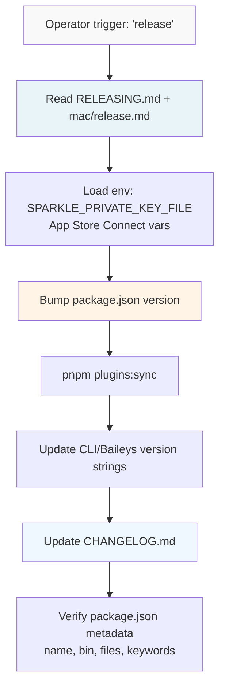
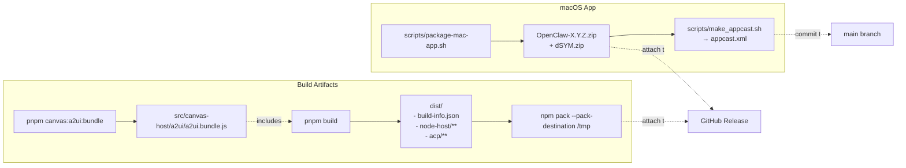
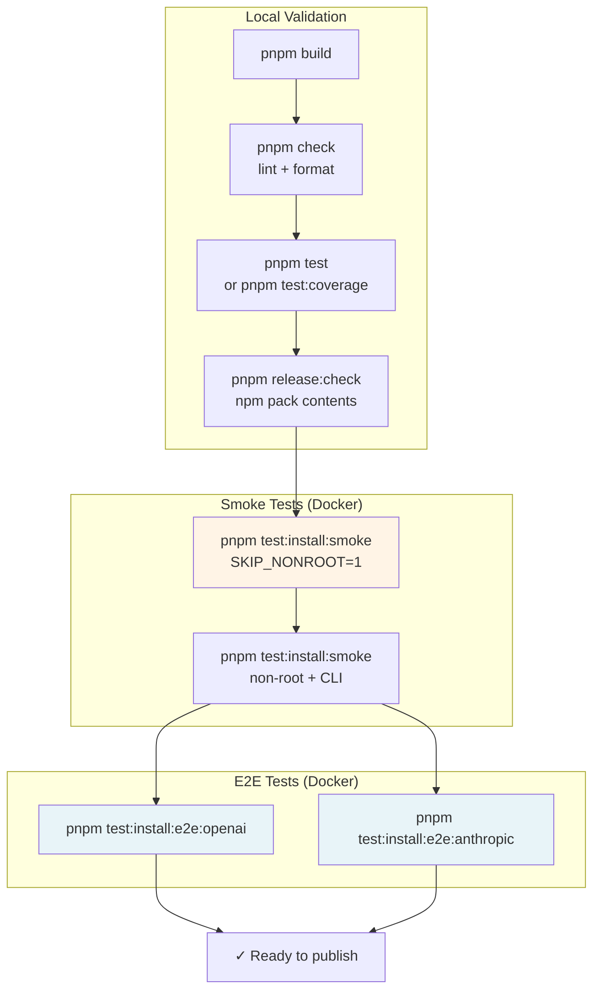
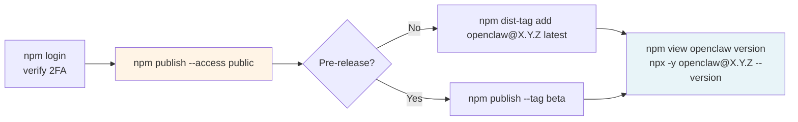
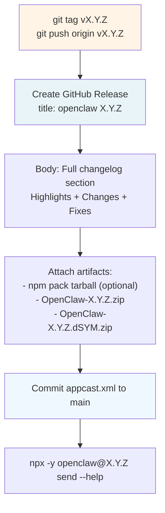
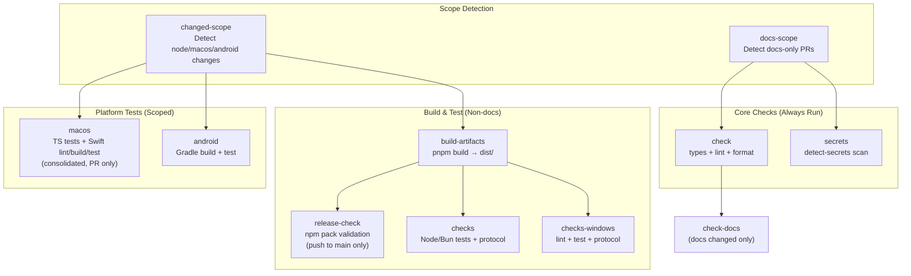
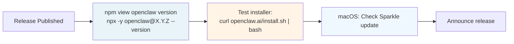

# Page: Release Process

# Release Process

<details>
<summary>Relevant source files</summary>

The following files were used as context for generating this wiki page:

- [.agents/skills/mintlify/SKILL.md](.agents/skills/mintlify/SKILL.md)
- [.github/ISSUE_TEMPLATE/bug_report.md](.github/ISSUE_TEMPLATE/bug_report.md)
- [.github/ISSUE_TEMPLATE/config.yml](.github/ISSUE_TEMPLATE/config.yml)
- [.github/ISSUE_TEMPLATE/feature_request.md](.github/ISSUE_TEMPLATE/feature_request.md)
- [.github/actions/detect-docs-changes/action.yml](.github/actions/detect-docs-changes/action.yml)
- [.github/actions/setup-node-env/action.yml](.github/actions/setup-node-env/action.yml)
- [.github/labeler.yml](.github/labeler.yml)
- [.github/workflows/auto-response.yml](.github/workflows/auto-response.yml)
- [.github/workflows/ci.yml](.github/workflows/ci.yml)
- [.github/workflows/labeler.yml](.github/workflows/labeler.yml)
- [.github/workflows/stale.yml](.github/workflows/stale.yml)
- [.gitignore](.gitignore)
- [AGENTS.md](AGENTS.md)
- [docs/automation/poll.md](docs/automation/poll.md)
- [docs/channels/index.md](docs/channels/index.md)
- [docs/ci.md](docs/ci.md)
- [docs/providers/synthetic.md](docs/providers/synthetic.md)
- [docs/zh-CN/channels/index.md](docs/zh-CN/channels/index.md)
- [docs/zh-CN/vps.md](docs/zh-CN/vps.md)
- [extensions/msteams/src/store-fs.ts](extensions/msteams/src/store-fs.ts)
- [scripts/sync-labels.ts](scripts/sync-labels.ts)
- [scripts/test-live-gateway-models-docker.sh](scripts/test-live-gateway-models-docker.sh)
- [scripts/test-live-models-docker.sh](scripts/test-live-models-docker.sh)
- [src/agents/live-auth-keys.test.ts](src/agents/live-auth-keys.test.ts)
- [src/agents/live-auth-keys.ts](src/agents/live-auth-keys.ts)
- [src/agents/pi-embedded-helpers.isbillingerrormessage.test.ts](src/agents/pi-embedded-helpers.isbillingerrormessage.test.ts)
- [src/agents/zai.live.test.ts](src/agents/zai.live.test.ts)
- [src/commands/message.ts](src/commands/message.ts)
- [src/gateway/live-image-probe.ts](src/gateway/live-image-probe.ts)
- [src/infra/outbound/abort.ts](src/infra/outbound/abort.ts)
- [src/infra/outbound/message.ts](src/infra/outbound/message.ts)
- [src/infra/outbound/outbound-send-service.ts](src/infra/outbound/outbound-send-service.ts)
- [src/media/png-encode.ts](src/media/png-encode.ts)
- [src/pairing/pairing-store.ts](src/pairing/pairing-store.ts)

</details>


This document describes the complete release workflow for OpenClaw, including npm package publishing, GitHub release creation, macOS app distribution via Sparkle, and validation testing. For CI/CD pipeline details, see [15.5](#15.5). For macOS app-specific release procedures, see the platform-specific guide at [docs/platforms/mac/release.md]().

---

## Release Channels

OpenClaw uses three release channels:

| Channel | Description | npm Tag | Version Format | GitHub Tag |
|---------|-------------|---------|----------------|------------|
| **stable** | Production releases | `latest` | `YYYY.M.D` | `vYYYY.M.D` |
| **beta** | Pre-release builds | `beta` | `YYYY.M.D-beta.N` | `vYYYY.M.D-beta.N` |
| **dev** | Development head | N/A | N/A | N/A (untagged `main`) |

**Sources:** [AGENTS.md:74-79]()

---

## Version Numbering

OpenClaw uses calendar versioning (`YYYY.M.D`) for stable releases and appends `-beta.N` for pre-releases. Version strings must be updated across multiple locations:

| Location | Purpose | Example |
|----------|---------|---------|
| [package.json]() | npm package version | `"version": "2026.1.29"` |
| [apps/android/app/build.gradle.kts]() | Android versionName/versionCode | `versionName = "2026.1.29"` |
| [apps/ios/Sources/Info.plist]() | iOS CFBundleShortVersionString/CFBundleVersion | `<string>2026.1.29</string>` |
| [apps/ios/Tests/Info.plist]() | iOS test bundle version | `<string>2026.1.29</string>` |
| [apps/macos/Sources/OpenClaw/Resources/Info.plist]() | macOS CFBundleShortVersionString/CFBundleVersion | `<string>2026.1.29</string>` |
| [docs/install/updating.md]() | Pinned example version | `npm install -g openclaw@2026.1.29` |
| [docs/platforms/mac/release.md]() | APP_VERSION/APP_BUILD examples | `APP_VERSION="2026.1.29"` |
| Peekaboo Xcode projects/Info.plists | MARKETING_VERSION/CURRENT_PROJECT_VERSION | Varies per project |

**Notes:**
- macOS `APP_BUILD` must be numeric and monotonic (no `-beta` suffix) for Sparkle version comparison
- Plugin versions sync automatically via `pnpm plugins:sync`
- Version string also embedded in CLI banner via [dist/build-info.json]() (generated during build)
- User agent version used by Baileys integration automatically reads from [package.json]()

**Sources:** [AGENTS.md:148]()

---

## Pre-Release Checklist



### Version & Metadata

1. **Bump version** in [package.json]()
2. **Sync plugin versions**: `pnpm plugins:sync` updates extension `package.json` and changelogs
3. **Update version strings**:
   - [src/cli/program.ts](): `.version("X.Y.Z")`
   - [src/provider-web.ts](): Baileys user agent `openclaw/${version}`
4. **Verify package metadata**: Ensure `bin` points to [openclaw.mjs]() and `files` includes all `dist/*` subdirectories

**Sources:** [docs/reference/RELEASING.md:21-27]()

### Changelog

Update [CHANGELOG.md]() with user-facing highlights. Format:
- **Strictly descending by version** (newest first)
- No `Unreleased` section (only versioned entries)
- Sections: Highlights, Changes, Fixes
- Include PR numbers and thank contributors

**Sources:** [docs/reference/RELEASING.md:37-40]()

---

## Build & Artifacts



### npm Package Build

1. **Rebuild A2UI bundle** (if vendor dependencies changed):
   ```bash
   pnpm canvas:a2ui:bundle
   ```
   - Bundles [vendor/a2ui/]() into [src/canvas-host/a2ui/a2ui.bundle.js]()
   - Updates [src/canvas-host/a2ui/.bundle.hash]() (auto-generated, commit separately)

2. **Build TypeScript**:
   ```bash
   pnpm build
   ```
   - Compiles via [tsdown.config.ts]() to `dist/`
   - Creates [dist/build-info.json]() with commit hash (used by CLI banner for npm installs)
   - Outputs [dist/node-host/](), [dist/acp/](), [dist/plugin-sdk/]()

3. **Verify package contents**:
   ```bash
   pnpm release:check
   # Or manually:
   npm pack --pack-destination /tmp
   tar -tzf /tmp/openclaw-*.tgz | grep -E '^package/dist/'
   ```
   - Confirm `dist/node-host/**`, `dist/acp/**`, `dist/plugin-sdk/**` are included
   - Ensure macOS app bundle (`dist/OpenClaw.app`) is **excluded** via `package.json` `files` whitelist
   - Verify [openclaw.mjs]() shim is included

**Sources:** [docs/reference/RELEASING.md:29-36](), [AGENTS.md:151-152](), [.gitignore:49-53]()

### macOS App (Sparkle)

For detailed macOS app signing and notarization, see [docs/platforms/mac/release.md](). Summary:

1. **Build and sign**:
   ```bash
   scripts/package-mac-app.sh
   ```
   - Outputs: `OpenClaw-X.Y.Z.zip`, optional `OpenClaw-X.Y.Z.dSYM.zip`

2. **Generate appcast**:
   ```bash
   scripts/make_appcast.sh
   ```
   - Updates [appcast.xml]() with HTML release notes
   - Requires `SPARKLE_PRIVATE_KEY_FILE` env var (EdDSA signature)

3. **Notarization** (if applicable):
   - Uses `openclaw-notary` keychain profile
   - Requires `APP_STORE_CONNECT_ISSUER_ID`, `APP_STORE_CONNECT_KEY_ID`, `APP_STORE_CONNECT_API_KEY_P8` env vars

**Important:** `APP_BUILD` must be numeric and monotonic (e.g., `20260129`, not `2026.1.29-beta`).

**Sources:** [docs/reference/RELEASING.md:59-65](), [AGENTS.md:153-154]()

---

## Validation



### Required Validation

Run before **every** release:

1. **Local checks**:
   ```bash
   pnpm build && pnpm check && pnpm test
   pnpm release:check  # Verifies npm pack contents via npm pack
   ```

2. **Install smoke test** (fast path, Docker):
   ```bash
   OPENCLAW_INSTALL_SMOKE_SKIP_NONROOT=1 pnpm test:install:smoke
   ```
   - Invokes [scripts/test-install-sh-docker.sh]()
   - Tests upgrade path from previous version → latest
   - Validates installer script: `https://openclaw.ai/install.sh`
   - **Required before release**

**Sources:** [docs/reference/RELEASING.md:43-50]()

### Optional Extended Validation

3. **Full smoke test** (adds non-root + CLI coverage):
   ```bash
   pnpm test:install:smoke
   ```
   - Runs [scripts/docker/install-sh-smoke/run.sh]() (root upgrade)
   - Runs [scripts/docker/install-sh-nonroot/run.sh]() (non-root install, git auto-install)
   - Runs CLI installer test: `https://openclaw.ai/install-cli.sh`

4. **E2E installer tests** (real tool calls):
   ```bash
   # Requires OPENAI_API_KEY + ANTHROPIC_API_KEY
   pnpm test:install:e2e
   ```
   - Invokes [scripts/test-install-sh-e2e-docker.sh]()
   - Onboards, configures models, runs agent turns with tool use
   - Validates session transcript tools via [scripts/docker/install-sh-e2e/run.sh]()
   - Uses live model keys to test real agent execution

**Sources:** [docs/reference/RELEASING.md:50-55](), [scripts/test-install-sh-docker.sh:1-33](), [scripts/test-install-sh-e2e-docker.sh:1-34]()

---

## npm Publishing



### Publishing Steps

1. **Ensure clean git state**: Commit and push all changes
2. **Login to npm** (if needed): `npm login` with 2FA enabled
3. **Use 1Password for OTP** (if required):
   - All `op` commands must run inside a fresh tmux session
   - Sign in: `eval "$(op signin --account my.1password.com)"`
   - Get OTP: `op read 'op://Private/Npmjs/one-time password?attribute=otp'`
   - Kill tmux session after publish
4. **Publish**:
   ```bash
   npm publish --access public --otp="<otp>"
   # For pre-releases:
   npm publish --access public --tag beta --otp="<otp>"
   ```

5. **Verify**:
   ```bash
   npm view openclaw version
   npm view openclaw dist-tags
   # Use fresh cache if needed:
   NPM_CONFIG_CACHE=/tmp/npm-cache-$(date +%s) npx -y openclaw@X.Y.Z --version
   ```

### Troubleshooting

| Issue | Solution |
|-------|----------|
| **Huge tarball (includes macOS app)** | Whitelist publish contents via `package.json` `files` array |
| **npm auth web loop (OTP)** | Use 1Password OTP: `op read 'op://Private/Npmjs/one-time password?attribute=otp'` |
| **`npx` ECOMPROMISED** | Retry with fresh cache: `NPM_CONFIG_CACHE=/tmp/npm-cache-$(date +%s) npx -y openclaw@X.Y.Z --version` |
| **Tag needs update** | Force-update: `git tag -f vX.Y.Z && git push -f origin vX.Y.Z` |

**Sources:** [docs/reference/RELEASING.md:67-82](), [AGENTS.md:180-187]()

---

## GitHub Release



### Steps

1. **Tag and push**:
   ```bash
   git tag vX.Y.Z
   git push origin vX.Y.Z
   ```

2. **Create GitHub release**:
   - **Title**: `openclaw X.Y.Z` (not just the tag)
   - **Body**: Full changelog section for this version (inline, no bare links, **do not repeat title**)
   - **Attach**:
     - `openclaw-X.Y.Z.tgz` (npm pack output, optional)
     - `OpenClaw-X.Y.Z.zip` (macOS app)
     - `OpenClaw-X.Y.Z.dSYM.zip` (if generated)

3. **Commit appcast**: Push updated [appcast.xml]() to `main` (Sparkle reads from HEAD)

4. **Verify**:
   ```bash
   # From clean temp directory (no local package.json)
   npx -y openclaw@X.Y.Z send --help
   ```

**Sources:** [docs/reference/RELEASING.md:84-91]()

---

## Plugin Publishing

OpenClaw only publishes **existing npm plugins** under the `@openclaw/*` scope. Bundled plugins that are disk-tree only (not on npm) remain in [extensions/]() but are **not** published.

### Published Plugins

| Package | Description |
|---------|-------------|
| `@openclaw/bluebubbles` | iMessage via BlueBubbles |
| `@openclaw/diagnostics-otel` | OpenTelemetry diagnostics |
| `@openclaw/discord` | Discord channel |
| `@openclaw/feishu` | Feishu/Lark channel |
| `@openclaw/lobster` | Lobster skill |
| `@openclaw/matrix` | Matrix channel |
| `@openclaw/msteams` | Microsoft Teams channel |
| `@openclaw/nextcloud-talk` | Nextcloud Talk channel |
| `@openclaw/nostr` | Nostr integration |
| `@openclaw/voice-call` | Voice call handling |
| `@openclaw/zalo` | Zalo channel |
| `@openclaw/zalouser` | Zalo user-mode channel |

**Process:**
1. Derive list: `npm search @openclaw --json` → intersect with [extensions/*/package.json]()
2. Publish only packages in the intersection
3. Call out **new bundled plugins** (not published, not enabled by default, e.g., `tlon`) in release notes

**Sources:** [docs/reference/RELEASING.md:92-121]()

---

## CI/CD Integration

The release process integrates with GitHub Actions workflows. See [15.5](#15.5) for complete CI/CD pipeline documentation.

### CI Workflow ([.github/workflows/ci.yml]())



**Job Responsibilities:**

| Job | Purpose | When |
|-----|---------|------|
| `docs-scope` | Detect docs-only changes to skip heavy jobs | Always |
| `changed-scope` | Detect which areas changed (node/macos/android) | Non-docs PRs |
| `check` | TypeScript types, lint (oxlint), format (oxfmt) | Non-docs |
| `check-docs` | Markdown lint + broken link validation | Docs changed |
| `secrets` | `detect-secrets` baseline scan | Always |
| `build-artifacts` | Build dist once, upload as artifact | Non-docs, node changes |
| `release-check` | Validate npm pack contents via `pnpm release:check` | Push to main only |
| `checks` | Node/Bun tests + protocol check | Non-docs, node changes |
| `checks-windows` | Windows-specific lint/test/protocol | Non-docs, node changes |
| `macos` | Consolidated TS tests + Swift lint/build/test | PRs with macos changes |
| `android` | Gradle assembleDebug + testDebugUnitTest | Non-docs, android changes |

**Smart Scoping:**
- Docs-only PRs skip: `build-artifacts`, `checks`, `checks-windows`, `macos`, `android`
- Changed-scope detects platform-specific changes to skip unrelated platform jobs
- Build artifacts created once and shared across dependent jobs (reduces build time)

**Sources:** [.github/workflows/ci.yml:1-690](), [docs/ci.md:1-52]()

---

## Post-Release Verification



### Verification Checklist

1. **npm registry**:
   ```bash
   npm view openclaw version  # Should show X.Y.Z
   npm view openclaw dist-tags  # Verify latest/beta tag
   ```

2. **CLI entrypoint** (from clean temp dir):
   ```bash
   npx -y openclaw@X.Y.Z send --help
   ```

3. **Installer script**:
   ```bash
   curl -fsSL https://openclaw.ai/install.sh | bash
   ```

4. **macOS Sparkle update**: Launch app, verify update notification appears

5. **Announce**: Share release notes and GitHub release URL

**Sources:** [docs/reference/RELEASING.md:84-91]()

---

## Release Guardrails

### Operator Consent Required

- **Never change version numbers without operator's explicit consent**
- **Always ask permission before running any npm publish/release step**
- **Read release docs before any release work**: [docs/reference/RELEASING.md]() and [docs/platforms/mac/release.md]()
- Do not ask routine questions once those docs answer them

**Sources:** [AGENTS.md:123-124,178-179]()

### NPM + 1Password Integration

The 1Password CLI (`op`) is used for secure OTP retrieval during npm publish:

```bash
# All op commands must run inside a fresh tmux session
eval "$(op signin --account my.1password.com)"  # App unlocked + integration on
op read 'op://Private/Npmjs/one-time password?attribute=otp'
npm publish --access public --otp="<otp>"
# Kill tmux session after publish
```

Verify without local npmrc side effects:
```bash
npm view <pkg> version --userconfig "$(mktemp)"
```

**Sources:** [AGENTS.md:180-187]()

---

**Sources:** [docs/reference/RELEASING.md](), [AGENTS.md:74-79,148,153-154,178-187](), [.github/workflows/ci.yml](), [.github/workflows/install-smoke.yml](), [scripts/test-install-sh-docker.sh](), [scripts/test-install-sh-e2e-docker.sh](), [scripts/docker/install-sh-smoke/run.sh](), [scripts/docker/install-sh-e2e/run.sh]()

---