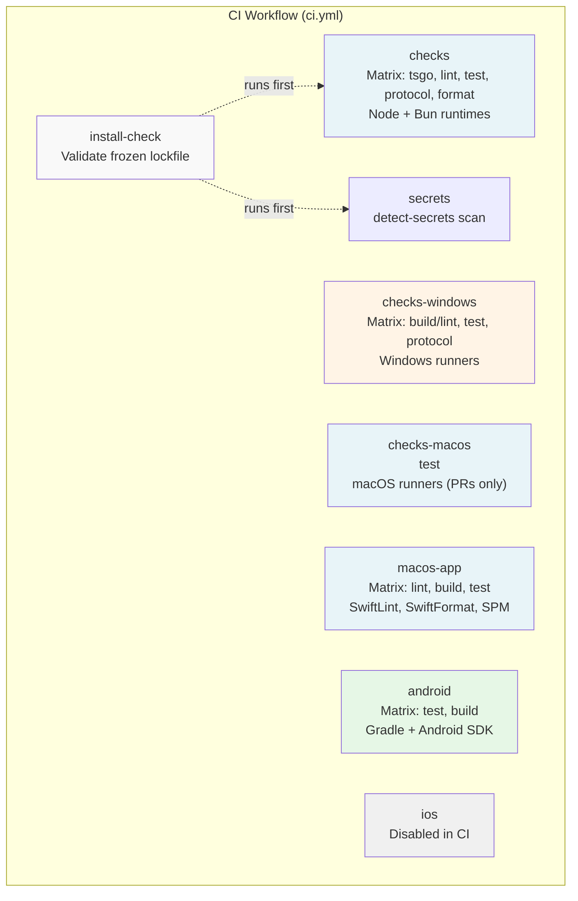
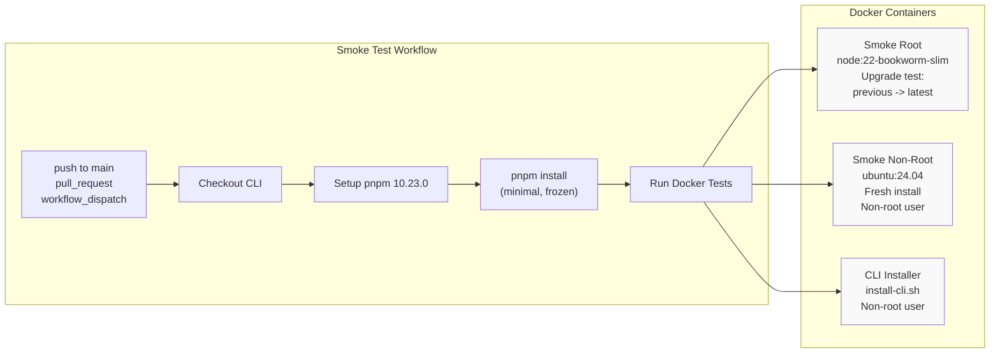

# Page: CI/CD Pipeline

# CI/CD Pipeline

<details>
<summary>Relevant source files</summary>

The following files were used as context for generating this wiki page:

- [.agents/skills/mintlify/SKILL.md](.agents/skills/mintlify/SKILL.md)
- [.github/ISSUE_TEMPLATE/bug_report.md](.github/ISSUE_TEMPLATE/bug_report.md)
- [.github/ISSUE_TEMPLATE/config.yml](.github/ISSUE_TEMPLATE/config.yml)
- [.github/ISSUE_TEMPLATE/feature_request.md](.github/ISSUE_TEMPLATE/feature_request.md)
- [.github/actions/detect-docs-changes/action.yml](.github/actions/detect-docs-changes/action.yml)
- [.github/actions/setup-node-env/action.yml](.github/actions/setup-node-env/action.yml)
- [.github/labeler.yml](.github/labeler.yml)
- [.github/workflows/auto-response.yml](.github/workflows/auto-response.yml)
- [.github/workflows/ci.yml](.github/workflows/ci.yml)
- [.github/workflows/labeler.yml](.github/workflows/labeler.yml)
- [.github/workflows/stale.yml](.github/workflows/stale.yml)
- [.gitignore](.gitignore)
- [AGENTS.md](AGENTS.md)
- [docs/automation/poll.md](docs/automation/poll.md)
- [docs/channels/index.md](docs/channels/index.md)
- [docs/ci.md](docs/ci.md)
- [docs/providers/synthetic.md](docs/providers/synthetic.md)
- [docs/zh-CN/channels/index.md](docs/zh-CN/channels/index.md)
- [docs/zh-CN/vps.md](docs/zh-CN/vps.md)
- [extensions/msteams/src/store-fs.ts](extensions/msteams/src/store-fs.ts)
- [scripts/sync-labels.ts](scripts/sync-labels.ts)
- [scripts/test-live-gateway-models-docker.sh](scripts/test-live-gateway-models-docker.sh)
- [scripts/test-live-models-docker.sh](scripts/test-live-models-docker.sh)
- [src/agents/live-auth-keys.test.ts](src/agents/live-auth-keys.test.ts)
- [src/agents/live-auth-keys.ts](src/agents/live-auth-keys.ts)
- [src/agents/pi-embedded-helpers.isbillingerrormessage.test.ts](src/agents/pi-embedded-helpers.isbillingerrormessage.test.ts)
- [src/agents/zai.live.test.ts](src/agents/zai.live.test.ts)
- [src/commands/message.ts](src/commands/message.ts)
- [src/gateway/live-image-probe.ts](src/gateway/live-image-probe.ts)
- [src/infra/outbound/abort.ts](src/infra/outbound/abort.ts)
- [src/infra/outbound/message.ts](src/infra/outbound/message.ts)
- [src/infra/outbound/outbound-send-service.ts](src/infra/outbound/outbound-send-service.ts)
- [src/media/png-encode.ts](src/media/png-encode.ts)
- [src/pairing/pairing-store.ts](src/pairing/pairing-store.ts)

</details>


This document describes OpenClaw's continuous integration and deployment pipeline, which runs automated checks on every push and pull request. The pipeline validates TypeScript code, runs tests across multiple platforms (Ubuntu, Windows, macOS, Android), and performs installer smoke tests to ensure distribution artifacts work correctly.

For information about the release process (version bumping, npm publishing, GitHub releases), see [Release Process](#15.4). For build system details (pnpm workspaces, TypeScript compilation), see [Building from Source](#15.3).

---

## Workflow Overview

OpenClaw uses GitHub Actions for CI/CD, with workflows defined in `.github/workflows/`. The primary workflow runs on every push and pull request, executing parallel jobs for different platforms and check types.

### Workflow Files

| File | Trigger | Purpose |
|------|---------|---------|
| `ci.yml` | push, pull_request | Main CI pipeline: lint, test, build, platform checks |
| `install-smoke.yml` | push to main, pull_request, manual dispatch | Installer validation (Docker-based) |

**Sources:** [.github/workflows/ci.yml:1-642](), [.github/workflows/install-smoke.yml:1-42]()

---

## Main CI Workflow Structure

The main workflow (`ci.yml`) defines multiple jobs that run in parallel. Most jobs use Ubuntu runners (`blacksmith-4vcpu-ubuntu-2404`), with platform-specific jobs using macOS or Windows runners.



**Sources:** [.github/workflows/ci.yml:7-642]()

---

## Job Details

### install-check

Validates that dependencies can be installed from a frozen lockfile without script execution errors. This job catches pnpm-lock.yaml drift and ensures reproducible builds.

**Key Steps:**
1. Checkout repository with submodule retry logic (5 attempts with backoff)
2. Setup Node.js 22.x with latest updates
3. Enable corepack and activate pnpm 10.23.0 with retry logic (3 attempts)
4. Install dependencies with `--frozen-lockfile --ignore-scripts=false`

**Runner:** `blacksmith-4vcpu-ubuntu-2404`

**Sources:** [.github/workflows/ci.yml:8-67]()

---

### checks

Matrix job that runs code quality checks and tests under both Node.js and Bun runtimes. This ensures OpenClaw remains compatible with both execution environments.

#### Matrix Configuration

| Runtime | Task | Command |
|---------|------|---------|
| node | tsgo | `pnpm tsgo` |
| node | lint | `pnpm build && pnpm lint` |
| node | test | `pnpm canvas:a2ui:bundle && pnpm test` |
| node | protocol | `pnpm protocol:check` |
| node | format | `pnpm format` |
| bun | test | `pnpm canvas:a2ui:bundle && bunx vitest run` |

**Retry Logic:**
- Submodule checkout: 5 attempts with 10-50s backoff
- pnpm setup: 3 attempts with 10-30s backoff
- Dependency install: 1 automatic retry on failure

**Test Execution:**
- Tests require bundled A2UI assets (`pnpm canvas:a2ui:bundle`)
- Vitest with V8 coverage thresholds (70% lines/branches/functions/statements)
- Both Node and Bun test suites must pass

**Runner:** `blacksmith-4vcpu-ubuntu-2404`

**Sources:** [.github/workflows/ci.yml:68-158](), [AGENTS.md:80-89]()

---

### secrets

Scans the codebase for accidentally committed secrets using `detect-secrets` 1.5.0. Compares against a baseline file to detect new leaks.

**Configuration:**
- Baseline: `.secrets.baseline`
- Tool: `detect-secrets==1.5.0` (Python package)
- Documentation: `docs/gateway/security.md#secret-scanning-detect-secrets`

**Runner:** `blacksmith-4vcpu-ubuntu-2404`

**Sources:** [.github/workflows/ci.yml:159-183]()

---

### checks-windows

Runs builds, lints, tests, and protocol checks on Windows runners to ensure platform compatibility.

#### Matrix Configuration

| Runtime | Task | Command |
|---------|------|---------|
| node | build & lint | `pnpm build && pnpm lint` |
| node | test | `pnpm canvas:a2ui:bundle && pnpm test` |
| node | protocol | `pnpm protocol:check` |

**Windows-Specific Configuration:**
- `NODE_OPTIONS: --max-old-space-size=4096` (increased heap for large workspace)
- `CLAWDBOT_TEST_WORKERS: 1` (single worker to avoid concurrency issues)
- Shell: `bash` (runs in Git Bash or WSL)

**Runner:** `blacksmith-4vcpu-windows-2025`

**Sources:** [.github/workflows/ci.yml:184-271]()

---

### checks-macos

Runs tests on macOS runners, but only for pull requests (not pushes to main). This validates macOS-specific behavior without excessive CI minutes.

**Configuration:**
- Trigger: `if: github.event_name == 'pull_request'`
- `NODE_OPTIONS: --max-old-space-size=4096`
- Command: `pnpm test`

**Runner:** `macos-latest`

**Sources:** [.github/workflows/ci.yml:272-343]()

---

### macos-app

Builds and tests the macOS native application using Swift Package Manager. Only runs on pull requests.

#### Matrix Configuration

| Task | Command |
|------|---------|
| lint | `swiftlint --config .swiftlint.yml`<br/>`swiftformat --lint apps/macos/Sources --config .swiftformat` |
| build | `swift build --package-path apps/macos --configuration release` (with retry) |
| test | `swift test --package-path apps/macos --parallel --enable-code-coverage` (with retry) |

**Toolchain Setup:**
1. Select Xcode 26.1
2. Install XcodeGen, SwiftLint, SwiftFormat via Homebrew
3. Display toolchain versions (`sw_vers`, `xcodebuild -version`, `swift --version`)

**Retry Logic:**
- Swift build: 3 attempts with 20-60s backoff
- Swift test: 3 attempts with 20-60s backoff

**Runner:** `macos-latest`

**Sources:** [.github/workflows/ci.yml:344-412]()

---

### ios

iOS build and test job is currently disabled (`if: false`) to conserve CI minutes. When enabled, it:
1. Generates Xcode project with XcodeGen
2. Runs unit tests on an iOS Simulator (prefers iPhone 16, falls back to latest available)
3. Reports code coverage via `xccov`
4. Enforces 43% line coverage gate

**Simulator Selection Logic:**
- Prefer existing iPhone simulator (prioritizing iPhone 16)
- Fall back to creating new simulator with latest iOS runtime
- Use Python script to query `xcrun simctl` for available devices

**Runner:** `macos-latest` (when enabled)

**Sources:** [.github/workflows/ci.yml:413-585]()

---

### android

Builds and tests the Android application using Gradle.

#### Matrix Configuration

| Task | Command |
|------|---------|
| test | `./gradlew --no-daemon :app:testDebugUnitTest` |
| build | `./gradlew --no-daemon :app:assembleDebug` |

**Toolchain Setup:**
1. Setup Java 21 (Temurin distribution)
2. Setup Android SDK with license acceptance
3. Setup Gradle 8.11.1
4. Install SDK packages: `platform-tools`, `platforms;android-36`, `build-tools;36.0.0`

**Working Directory:** `apps/android`

**Runner:** `blacksmith-4vcpu-ubuntu-2404`

**Sources:** [.github/workflows/ci.yml:586-642]()

---

## Installer Smoke Tests

OpenClaw includes comprehensive installer validation to ensure users can install and run the CLI from published npm packages or official install scripts.



**Sources:** [.github/workflows/install-smoke.yml:1-42](), [scripts/test-install-sh-docker.sh:1-71]()

---

### Smoke Test Infrastructure

OpenClaw uses Docker-based smoke tests to validate installers in clean environments. These tests run via wrapper scripts that build images and execute test runners.

#### Test Scripts

| Script | Purpose | Container Base |
|--------|---------|----------------|
| `scripts/test-install-sh-docker.sh` | Root + non-root smoke tests | `node:22-bookworm-slim`, `ubuntu:24.04` |
| `scripts/test-install-sh-e2e-docker.sh` | E2E with real model providers | `node:22-bookworm-slim` |

#### Smoke Test Types

**1. Root Installer Smoke Test**
- Container: `openclaw-install-smoke:local` (built from `scripts/docker/install-sh-smoke/`)
- Installs previous version first (forces upgrade path)
- Runs `curl -fsSL https://openclaw.ai/install.sh | bash`
- Verifies installed version matches latest npm release
- Runs `openclaw --help` as sanity check

**2. Non-Root Installer Smoke Test**
- Container: `openclaw-install-nonroot:local` (built from `scripts/docker/install-sh-nonroot/`)
- Uses non-root `app` user with sudo privileges
- Ensures git gets installed (not pre-installed in base image)
- Sets npm user prefix to `$HOME/.npm-global`
- Validates CLI is on PATH and runs correctly

**3. CLI-Only Installer Smoke Test**
- Uses same non-root container
- Runs `curl -fsSL https://openclaw.ai/install-cli.sh | bash -s -- --set-npm-prefix --no-onboard`
- Validates minimal install without gateway/onboarding

**Environment Variables:**

| Variable | Default | Purpose |
|----------|---------|---------|
| `OPENCLAW_INSTALL_URL` | `https://openclaw.ai/install.sh` | Installer script URL |
| `OPENCLAW_INSTALL_CLI_URL` | `https://openclaw.ai/install-cli.sh` | CLI-only installer URL |
| `OPENCLAW_INSTALL_SMOKE_SKIP_NONROOT` | `0` | Skip non-root tests (set to `1` in PR workflow) |
| `OPENCLAW_INSTALL_SMOKE_SKIP_CLI` | `0` | Skip CLI installer tests |
| `OPENCLAW_INSTALL_SMOKE_SKIP_PREVIOUS` | `0` | Skip preinstalling previous version |
| `OPENCLAW_INSTALL_SMOKE_PREVIOUS` | (auto-detect) | Explicit previous version |
| `OPENCLAW_NO_ONBOARD` | (unset) | Skip onboarding wizard |

**Sources:** [scripts/test-install-sh-docker.sh:1-71](), [scripts/docker/install-sh-smoke/run.sh:1-74](), [scripts/docker/install-sh-nonroot/run.sh:1-52]()

---

### E2E Installer Tests

E2E tests validate the complete install-to-execution flow with real AI model providers. These tests are not part of the standard CI workflow but can be run manually or in pre-release validation.

**Test Flow:**
1. Install previous version (optional, controlled by `SKIP_PREVIOUS`)
2. Run official installer one-liner
3. Verify installed version matches expected
4. Onboard with model provider (OpenAI or Anthropic)
5. Start gateway
6. Execute agent turns with multiple tools
7. Verify tool execution and session transcripts

#### Model Provider Support

The E2E test can run with three modes:

| Mode | Required Keys | Tested Providers |
|------|---------------|------------------|
| `both` | `OPENAI_API_KEY`, `ANTHROPIC_API_KEY`/`ANTHROPIC_API_TOKEN` | OpenAI + Anthropic |
| `openai` | `OPENAI_API_KEY` | OpenAI only |
| `anthropic` | `ANTHROPIC_API_KEY`/`ANTHROPIC_API_TOKEN` | Anthropic only |

**Test Profiles:**
- Each provider runs in isolated profile (`e2e-openai`, `e2e-anthropic`)
- Separate gateway ports (18789, 18799)
- Separate workspaces (`/tmp/openclaw-e2e-openai`, `/tmp/openclaw-e2e-anthropic`)

#### Tool Validation Tests

Each E2E run executes four agent turns to validate tool execution:

| Turn | Prompt | Tools Used | Validation |
|------|--------|------------|------------|
| 1 | Read proof.txt with exact contents | `read` | Reply matches random proof value |
| 2 | Write proof value to copy.txt, read it back | `write`, `read` | File contents match, reply matches |
| 3 | Run `cat /etc/hostname`, write to hostname.txt | `exec`, `write` | File matches container hostname |
| 4 | Analyze image colors, write marker to file | `image`, `write` | File contains "LEFT=RED RIGHT=GREEN" |

After all turns, the test validates the session transcript (`.jsonl` file) to ensure all expected tools were invoked.

**Helper Functions:**

- `run_agent_turn()`: Executes agent turn via `openclaw agent` CLI
- `assert_agent_json_ok()`: Validates response status, checks for errors/rate limits
- `assert_session_used_tools()`: Walks session JSONL to verify tool usage
- `write_png_lr_rg()`: Generates test PNG with red left half, green right half

**Sources:** [scripts/test-install-sh-e2e-docker.sh:1-30](), [scripts/docker/install-sh-e2e/run.sh:1-536]()

---

## Platform-Specific Build Requirements

### macOS Requirements

**Xcode Version:** 26.1 (selected via `sudo xcode-select -s`)

**Tools:**
- XcodeGen (project generation)
- SwiftLint (linting)
- SwiftFormat (formatting)

**Build Commands:**
```bash
swift build --package-path apps/macos --configuration release
swift test --package-path apps/macos --parallel --enable-code-coverage
```

**Coverage:**
- Reports via `xcrun xccov view --report`
- No enforced gate in CI (optional in release process)

**Sources:** [.github/workflows/ci.yml:396-412]()

---

### Windows Requirements

**Node Configuration:**
- `NODE_OPTIONS: --max-old-space-size=4096` (increased heap)
- `CLAWDBOT_TEST_WORKERS: 1` (single worker)

**Shell:** Bash (Git Bash or WSL)

**Build Process:**
1. Install pnpm via corepack
2. Build with `pnpm build` (generates `dist/`)
3. Lint with `pnpm lint` (oxlint + oxfmt)
4. Bundle A2UI assets before tests
5. Run tests with `pnpm test`

**Sources:** [.github/workflows/ci.yml:184-271]()

---

### Android Requirements

**Java:** 21 (Temurin distribution)

**Gradle:** 8.11.1

**Android SDK Packages:**
- `platform-tools`
- `platforms;android-36`
- `build-tools;36.0.0`

**Build Commands:**
```bash
./gradlew --no-daemon :app:testDebugUnitTest  # Unit tests
./gradlew --no-daemon :app:assembleDebug      # Build debug APK
```

**Sources:** [.github/workflows/ci.yml:586-642]()

---

## CI Reliability Features

### Retry Logic

OpenClaw's CI includes retry mechanisms for flaky operations:

| Operation | Attempts | Backoff | Location |
|-----------|----------|---------|----------|
| Submodule checkout | 5 | 10-50s | All jobs |
| pnpm setup (corepack) | 3 | 10-30s | All jobs |
| Dependency install | 2 | (automatic) | All jobs |
| Swift build | 3 | 20-60s | macos-app |
| Swift test | 3 | 20-60s | macos-app |
| apt-get update | 3 | 3s | Docker images |

**Retry Pattern:**
```bash
for attempt in 1 2 3; do
  if git -c protocol.version=2 submodule update --init --force --depth=1 --recursive; then
    exit 0
  fi
  echo "Submodule update failed (attempt $attempt/3). Retrying…"
  sleep $((attempt * 10))
done
exit 1
```

**Sources:** [.github/workflows/ci.yml:16-27](), [.github/workflows/ci.yml:35-47](), [.github/workflows/ci.yml:358-365]()

---

### Dependency Management

**Frozen Lockfile:**
All CI jobs install with `--frozen-lockfile` to ensure deterministic builds. Changes to `pnpm-lock.yaml` must be committed.

**Install Flags:**
- `--frozen-lockfile`: Fail if lockfile is outdated
- `--ignore-scripts=false`: Run install scripts (required for native deps)
- `--config.engine-strict=false`: Allow Node version flexibility
- `--config.enable-pre-post-scripts=true`: Run lifecycle hooks

**Automatic Retry:**
If the first install attempt fails, CI retries once with the same command (handles transient network errors).

**Sources:** [.github/workflows/ci.yml:58-67](), [.github/workflows/ci.yml:146-155]()

---

## Integration with Release Process

The CI pipeline is a prerequisite for releases but does not automatically publish artifacts. The release workflow is manual and documented separately.

### Pre-Release Validation

Before running `npm publish`, the release process requires:

1. **Full Gate Check:**
   ```bash
   pnpm build && pnpm check && pnpm test
   ```

2. **Installer Smoke Tests:**
   ```bash
   OPENCLAW_INSTALL_SMOKE_SKIP_NONROOT=1 pnpm test:install:smoke
   ```

3. **(Optional) Full Installer Suite:**
   ```bash
   pnpm test:install:smoke              # Includes non-root + CLI tests
   pnpm test:install:e2e:openai         # E2E with OpenAI (requires key)
   pnpm test:install:e2e:anthropic      # E2E with Anthropic (requires key)
   pnpm test:install:e2e                # Both providers
   ```

These commands wrap the same Docker-based infrastructure used in CI but run locally or in release automation.

**Sources:** [docs/reference/RELEASING.md:42-56](), [AGENTS.md:85-89]()

---

## Test Coverage Gates

### TypeScript Coverage (Vitest)

**Thresholds:** 70% for lines, branches, functions, and statements

**Framework:** Vitest with V8 coverage provider

**Configuration:** `vitest.config.ts` (not shown in provided files)

**Execution:**
```bash
pnpm test           # Run tests
pnpm test:coverage  # Run with coverage report
```

**Sources:** [AGENTS.md:82-83]()

---

### iOS Coverage

**Current Gate:** 43% line coverage for `Clawdis.app` target

**Reporting:**
```bash
xcrun xccov view --report --only-targets "$RESULT_BUNDLE_PATH"
```

**Gate Logic:**
The iOS job includes a Python script that:
1. Parses coverage JSON from `xccov`
2. Extracts `lineCoverage` for `Clawdis.app` target
3. Fails if coverage < 43% (with 1e-12 tolerance)

**Note:** iOS builds are currently disabled in CI (`if: false`) to conserve runner minutes.

**Sources:** [.github/workflows/ci.yml:551-584]()

---

## Manual Workflow Triggers

### Install Smoke Workflow

The `install-smoke.yml` workflow can be triggered manually via GitHub Actions UI (`workflow_dispatch`). This is useful for:
- Testing installer changes before merging
- Validating pre-release builds
- Debugging installer issues

**Manual Trigger:**
1. Go to Actions tab in GitHub
2. Select "Install Smoke" workflow
3. Click "Run workflow"
4. Choose branch

**Sources:** [.github/workflows/install-smoke.yml:7-8]()

---

## Environment Configuration

### CI-Specific Environment Variables

**Installer Tests:**
- `CLAWDBOT_INSTALL_URL`: Installer script URL (legacy alias for `OPENCLAW_INSTALL_URL`)
- `CLAWDBOT_INSTALL_CLI_URL`: CLI installer URL (legacy alias for `OPENCLAW_INSTALL_CLI_URL`)
- `CLAWDBOT_NO_ONBOARD`: Skip onboarding wizard
- `OPENCLAW_INSTALL_SMOKE_SKIP_CLI`: Skip CLI-only installer test
- `OPENCLAW_INSTALL_SMOKE_SKIP_NONROOT`: Skip non-root tests (enabled in PR workflow)
- `OPENCLAW_INSTALL_SMOKE_SKIP_PREVIOUS`: Skip preinstalling previous version

**Windows Tests:**
- `NODE_OPTIONS: --max-old-space-size=4096`
- `CLAWDBOT_TEST_WORKERS: 1`

**macOS Tests:**
- `NODE_OPTIONS: --max-old-space-size=4096`

**npm Configuration (Docker):**
- `NPM_CONFIG_FUND=false`: Disable funding messages
- `NPM_CONFIG_AUDIT=false`: Disable audit warnings

**Sources:** [.github/workflows/install-smoke.yml:34-41](), [.github/workflows/ci.yml:186-189](), [.github/workflows/ci.yml:340-342](), [scripts/docker/install-sh-nonroot/Dockerfile:23-24]()

---

## Summary Table

| Job | Runner | Platforms | Key Checks | Trigger |
|-----|--------|-----------|------------|---------|
| install-check | Ubuntu | Linux | Frozen lockfile install | All |
| checks | Ubuntu | Linux | tsgo, lint, test, protocol, format (Node + Bun) | All |
| secrets | Ubuntu | Linux | detect-secrets scan | All |
| checks-windows | Windows | Windows | build, lint, test, protocol | All |
| checks-macos | macOS | macOS | test | PRs only |
| macos-app | macOS | macOS | Swift lint, build, test | PRs only |
| android | Ubuntu | Android | Gradle test, build | All |
| ios | macOS | iOS | (disabled) | N/A |
| install-smoke | Ubuntu | Docker | Installer validation (root, non-root, CLI) | main, PRs, manual |

**Sources:** [.github/workflows/ci.yml:7-642](), [.github/workflows/install-smoke.yml:10-42]()

---