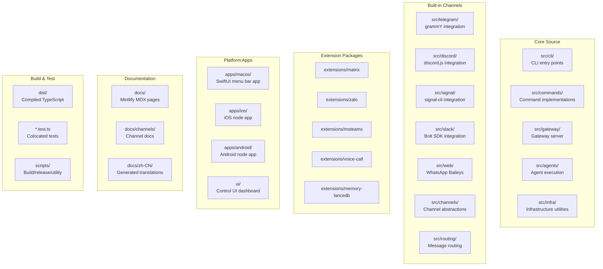
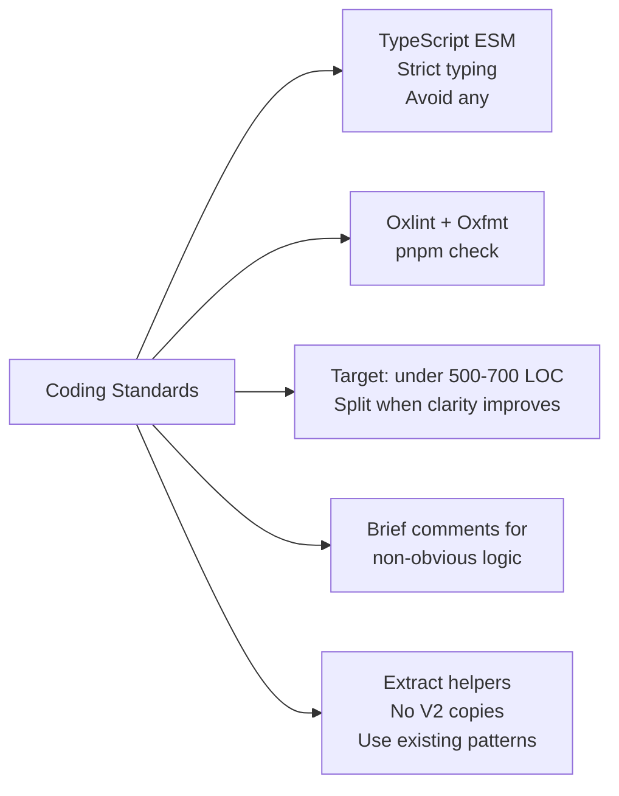
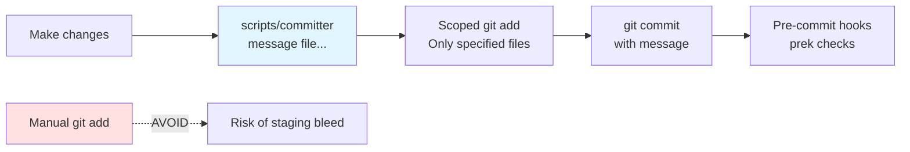
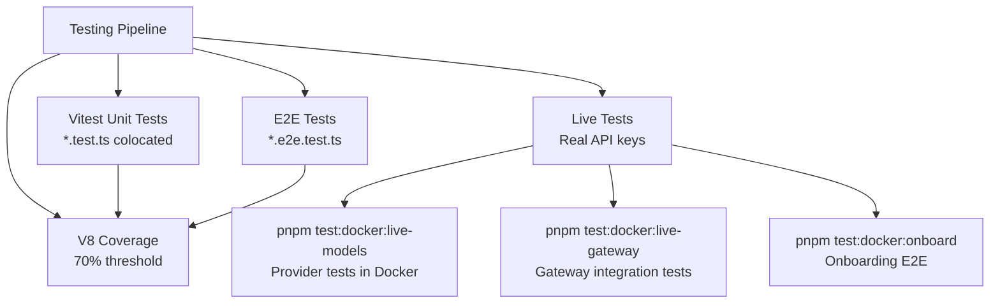
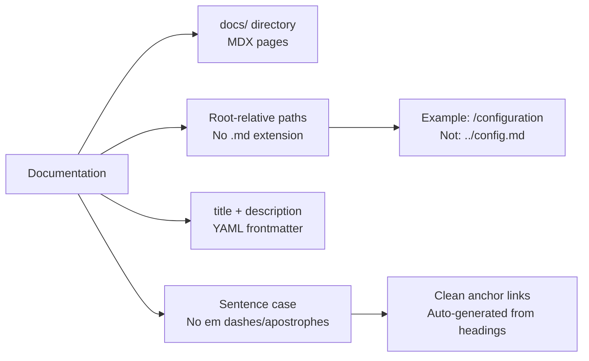
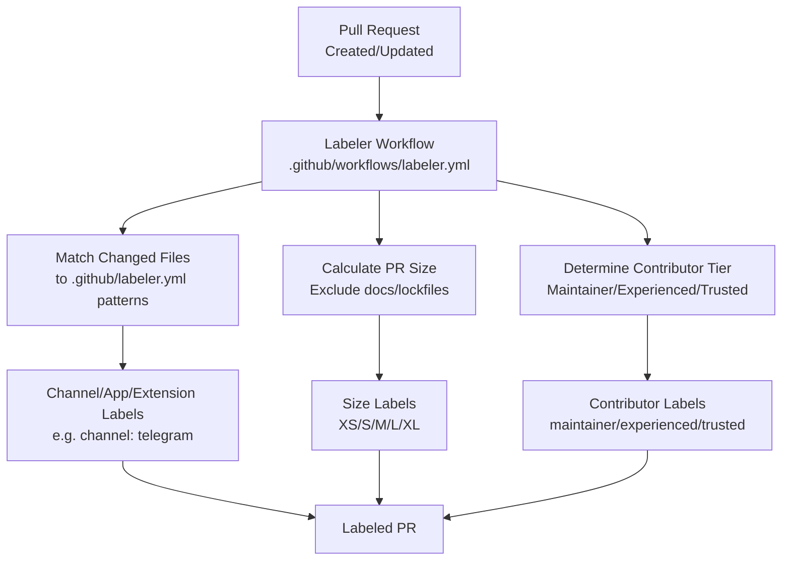
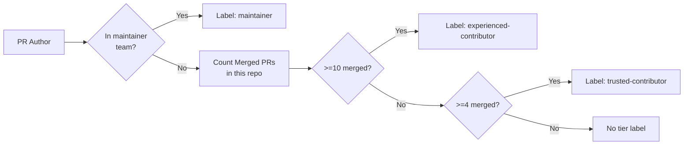
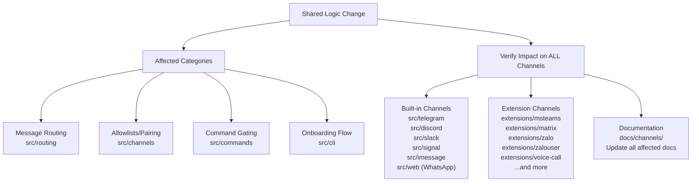
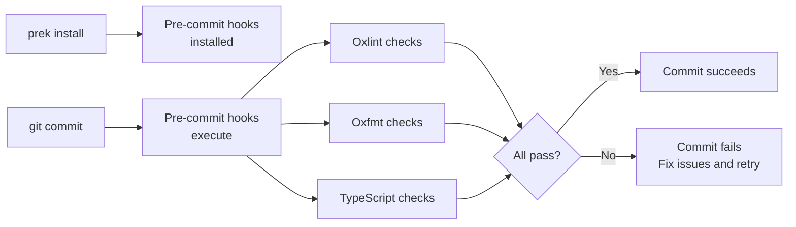

# Page: Contributing Guidelines

# Contributing Guidelines

<details>
<summary>Relevant source files</summary>

The following files were used as context for generating this wiki page:

- [.agents/skills/mintlify/SKILL.md](.agents/skills/mintlify/SKILL.md)
- [.github/ISSUE_TEMPLATE/bug_report.md](.github/ISSUE_TEMPLATE/bug_report.md)
- [.github/ISSUE_TEMPLATE/config.yml](.github/ISSUE_TEMPLATE/config.yml)
- [.github/ISSUE_TEMPLATE/feature_request.md](.github/ISSUE_TEMPLATE/feature_request.md)
- [.github/labeler.yml](.github/labeler.yml)
- [.github/workflows/auto-response.yml](.github/workflows/auto-response.yml)
- [.github/workflows/labeler.yml](.github/workflows/labeler.yml)
- [.github/workflows/stale.yml](.github/workflows/stale.yml)
- [AGENTS.md](AGENTS.md)
- [docs/channels/index.md](docs/channels/index.md)
- [docs/zh-CN/channels/index.md](docs/zh-CN/channels/index.md)
- [scripts/sync-labels.ts](scripts/sync-labels.ts)

</details>


This page documents the coding standards, commit conventions, testing requirements, and PR process for contributing to OpenClaw. It covers practical guidelines for writing code, submitting changes, and maintaining documentation quality.

For information about the system architecture and design patterns, see [Architecture Deep Dive](#15.1). For details about the CI/CD automation, see [CI/CD Pipeline](#15.5). For the release process, see [Release Process](#15.4).

---

## Repository Organization

### Project Structure

The OpenClaw repository follows a modular organization with clear separation between core functionality, channels, extensions, and platform-specific applications.



**Sources:** [AGENTS.md:6-19]()

### Module Organization Rules

| Location | Purpose | Dependency Policy |
|----------|---------|-------------------|
| `src/` | Core CLI and infrastructure | No external plugin dependencies |
| `src/cli` | CLI entry point and command wiring | Uses `src/commands` |
| `src/commands` | Command implementations | May import from any `src/` module |
| `src/gateway` | Gateway server and WebSocket RPC | Core runtime, no channel-specific imports |
| `src/agents` | Agent execution pipeline | Orchestrates tools, memory, sessions |
| `src/channels`, `src/routing` | Channel abstractions and routing | Shared by all channels |
| `src/telegram`, `src/discord`, etc | Built-in channel implementations | Must follow channel interface |
| `extensions/*` | Plugin packages | Use `workspace:*` for dev, avoid in runtime deps |
| `apps/` | Platform-specific native applications | Independent build systems |
| `docs/` | Mintlify documentation site | No code imports |
| `scripts/` | Build, release, and utility scripts | May use any tooling |

Extensions must declare runtime dependencies in `dependencies` (not `devDependencies` or `workspace:*`) to survive `npm install --omit=dev` during plugin installation. Core OpenClaw should be in `peerDependencies` to avoid duplication.

**Sources:** [AGENTS.md:6-12]()

---

## Coding Standards

### TypeScript Style



**Core principles:**

- **Language:** TypeScript with ESM imports. Prefer strict typing; avoid `any` types.
- **Formatting:** Automated via Oxlint and Oxfmt. Run `pnpm check` before commits.
- **File Size:** Aim for under 500-700 lines of code per file. This is a guideline, not a hard limit, but split files when it improves clarity or testability.
- **Comments:** Add brief comments for tricky or non-obvious logic. Avoid stating the obvious.
- **Patterns:** Extract helpers instead of creating "V2" versions. Use existing patterns from `createDefaultDeps` for CLI options and dependency injection.

**Sources:** [AGENTS.md:68-75]()

### Naming Conventions

| Context | Convention | Examples |
|---------|-----------|----------|
| Product/brand name (docs, UI) | **OpenClaw** | "OpenClaw is a multi-channel AI gateway" |
| CLI command | `openclaw` | `openclaw gateway run` |
| Package/binary name | `openclaw` | `npm install -g openclaw` |
| Config keys | `openclaw` | `~/.openclaw/openclaw.json` |
| TypeScript modules | camelCase for functions/vars, PascalCase for types | `createSession()`, `AgentConfig` |
| File names | Match existing patterns, prefer kebab-case | `agent-execution.ts`, `memory-search.ts` |

**Sources:** [AGENTS.md:75]()

### Tool Schema Guardrails

When defining tool input schemas for AI models:

- **Avoid `Type.Union`:** Some providers reject `anyOf`/`oneOf`/`allOf` in tool schemas.
- **Use `stringEnum`/`optionalStringEnum`:** For string lists, use `Type.Unsafe` enum wrappers.
- **Use `Type.Optional`:** Instead of `... | null` for optional fields.
- **Top-level must be object:** Keep tool schema as `type: "object"` with `properties`.
- **Avoid `format` as property name:** Some validators treat `format` as reserved.

**Sources:** [AGENTS.md:161-162]()

---

## Commit Process

### Using `scripts/committer`

All commits must be created using the `scripts/committer` tool to ensure proper scoping and prevent staging bleed across unrelated changes.



**Command syntax:**

```bash
scripts/committer "<message>" <file1> <file2> ...
```

**Example:**

```bash
scripts/committer "Gateway: add health check endpoint" \
  src/gateway/health.ts \
  src/gateway/server.ts
```

The tool automatically stages only the specified files, creates the commit with the message, and triggers pre-commit hooks.

**Sources:** [AGENTS.md:99]()

### Commit Message Format

Use concise, action-oriented commit messages following Conventional Commits patterns:

| Scope | Use For | Example |
|-------|---------|---------|
| `CLI` | CLI command changes | `CLI: add verbose flag to send` |
| `Gateway` | Gateway server changes | `Gateway: implement hot reload` |
| `Channels` | Channel-specific changes | `Channels: add Matrix pairing flow` |
| `Agents` | Agent execution changes | `Agents: fix session compaction retry` |
| `Docs` | Documentation updates | `Docs: update memory configuration guide` |
| `Tests` | Test additions/fixes | `Tests: add live gateway test` |
| `Refactor` | Code structure changes | `Refactor: extract session lock helper` |

**Group related changes together.** Avoid bundling unrelated refactors with feature work.

**Sources:** [AGENTS.md:99-103]()

### Multi-Agent Safety

When multiple agents or contributors are working simultaneously:

- **Do NOT create/apply/drop git stash entries** unless explicitly requested.
- **Do NOT switch branches** unless explicitly requested.
- **Do NOT modify `.worktrees/`** unless explicitly requested.
- **Focus commits on your changes only.** When committing, scope to your specific changes.
- **Pull before pushing:** Run `git pull --rebase` to integrate latest changes, never discard others' work.
- **Keep unrelated WIP untouched:** If you see unrecognized files, focus on your changes and commit only those.

**Sources:** [AGENTS.md:147-152]()

---

## Testing Requirements

### Test Framework and Coverage



**Coverage thresholds:**

- 70% for lines, branches, functions, and statements
- Enforced via Vitest with V8 coverage provider

**Sources:** [AGENTS.md:84-89]()

### Running Tests

| Command | Purpose |
|---------|---------|
| `pnpm test` | Run all tests |
| `pnpm test:coverage` | Run tests with coverage report |
| `pnpm test:live` | Live tests with real API keys (requires `CLAWDBOT_LIVE_TEST=1` or `LIVE=1`) |
| `pnpm test:docker:live-models` | Model provider live tests in Docker |
| `pnpm test:docker:live-gateway` | Gateway integration tests in Docker |
| `pnpm test:docker:onboard` | Onboarding E2E tests in Docker |

**Test workers:** Do not set test workers above 16. This has been tested and higher values cause issues.

**Sources:** [AGENTS.md:66, 89]()

### Test Naming Conventions

- **Match source names:** If testing `agent-execution.ts`, name the test `agent-execution.test.ts`.
- **E2E tests:** Use `*.e2e.test.ts` suffix for end-to-end tests.
- **Colocation:** Place tests next to the code they test (not in separate `test/` directories).

**Sources:** [AGENTS.md:86]()

### Changelog Policy

- **User-facing changes only:** Include changes that affect end users or operators.
- **Exclude internal/meta notes:** No version alignment, appcast reminders, or release process notes.
- **Test-only changes:** Pure test additions/fixes generally do **not** need changelog entries unless they alter user-facing behavior or the user explicitly requests one.

**Sources:** [AGENTS.md:91-92]()

---

## Documentation Standards

### Mintlify Conventions

Documentation uses Mintlify for rendering. Follow these conventions:



**Internal linking:**

- Use root-relative paths without `.md`/`.mdx` extensions: `[Config](/configuration)`
- Section anchors on root-relative paths: `[Hooks](/configuration#hooks)`
- **Never use** relative paths like `../config.md` or absolute URLs for internal pages

**Headings:**

- Use sentence case: "Getting started" (not "Getting Started")
- Avoid em dashes and apostrophes in headings (they break Mintlify anchor links)

**Sources:** [AGENTS.md:20-30](), [.agents/skills/mintlify/SKILL.md:106-152]()

### Documentation File Organization

| Location | Content |
|----------|---------|
| `docs/` | English documentation (Mintlify site) |
| `docs/channels/` | Channel-specific documentation |
| `docs/gateway/` | Gateway configuration and operations |
| `docs/platforms/` | Platform-specific guides (macOS, iOS, Android) |
| `docs/zh-CN/` | Generated Chinese translations (do not edit directly) |
| `docs/.i18n/` | Translation pipeline configuration |
| `README.md` | GitHub landing page (use absolute URLs) |

**Sources:** [AGENTS.md:10, 32-37]()

### i18n Pipeline

Chinese translations in `docs/zh-CN/` are auto-generated. Do not edit unless explicitly requested.

**Translation workflow:**

1. Update English docs
2. Adjust glossary: `docs/.i18n/glossary.zh-CN.json`
3. Run `scripts/docs-i18n`
4. Apply targeted fixes only if instructed

Translation memory is stored in `docs/.i18n/zh-CN.tm.jsonl`.

**Sources:** [AGENTS.md:32-38]()

---

## Pull Request Workflow

### Pre-Submission Checklist

Before submitting a PR, ensure:

- [ ] Pre-commit hooks installed: `prek install`
- [ ] Formatting and linting pass: `pnpm check`
- [ ] Tests pass: `pnpm test`
- [ ] Coverage meets 70% threshold (if applicable)
- [ ] Documentation updated for user-facing changes
- [ ] Commits follow scoping conventions (created with `scripts/committer`)
- [ ] No unrelated changes bundled in the same commit
- [ ] For channel/extension work, all channels considered (see below)

**Key documents to read:**

- [docs/help/submitting-a-pr.md]() for PR submission guidelines
- [docs/help/submitting-an-issue.md]() for issue submission guidelines
- `.agents/skills/PR_WORKFLOW.md` for full maintainer workflow (optional, use if specified)

**Sources:** [AGENTS.md:96-103]()

### Automated Labeling System



**Label categories:**

| Label Prefix | Purpose | Auto-Applied |
|--------------|---------|--------------|
| `channel:` | Channel-specific changes (telegram, discord, whatsapp, etc) | Yes, from `.github/labeler.yml` patterns |
| `app:` | Platform app changes (macos, ios, android, web-ui) | Yes |
| `extensions:` | Extension package changes (copilot-proxy, memory-lancedb, etc) | Yes |
| `size:` | PR size (XS < 50, S < 200, M < 500, L < 1000, XL ≥ 1000 changed lines) | Yes |
| `maintainer` | Author is in maintainer team | Yes |
| `trusted-contributor` | Author has 4+ merged PRs | Yes |
| `experienced-contributor` | Author has 10+ merged PRs | Yes |

**Size calculation excludes:**

- `docs.acp.md`
- `docs/**` (documentation files)
- Lockfiles: `pnpm-lock.yaml`, `package-lock.json`, `yarn.lock`, `bun.lockb`

**Sources:** [.github/workflows/labeler.yml:38-126](), [.github/labeler.yml:1-255]()

### Contributor Tiers

The labeling system automatically classifies contributors:



**Tier thresholds:**

- **Maintainer:** Member of `openclaw/maintainer` team
- **Experienced:** 10+ merged PRs in the repository
- **Trusted:** 4+ merged PRs in the repository

**Sources:** [.github/workflows/labeler.yml:127-196]()

---

## Channel and Extension Refactoring

### Cross-Channel Considerations

When refactoring shared logic that affects channels, **always consider all built-in and extension channels**:



**Critical areas requiring cross-channel verification:**

- **Routing logic:** Changes to message routing in `src/routing`
- **Allowlists and pairing:** Security policy changes in `src/channels`
- **Command gating:** Authorization changes in `src/commands`
- **Onboarding flow:** Setup wizard changes in `src/cli/onboard`
- **Documentation:** Channel overview and individual channel docs

**Channel locations:**

- **Core channels:** `src/telegram`, `src/discord`, `src/slack`, `src/signal`, `src/imessage`, `src/web`
- **Core abstractions:** `src/channels`, `src/routing`
- **Core docs:** `docs/channels/`
- **Extension channels:** `extensions/msteams`, `extensions/matrix`, `extensions/zalo`, `extensions/zalouser`, `extensions/voice-call`, etc.

**Sources:** [AGENTS.md:14-17]()

### Updating GitHub Labels

When adding new channels or extensions, update both the label configuration and GitHub itself:

1. Add patterns to `.github/labeler.yml` for auto-labeling
2. Run `scripts/sync-labels.ts` to create missing GitHub labels
3. Use existing color schemes from `COLOR_BY_PREFIX` map:
   - `channel:` → `1d76db` (blue)
   - `app:` → `6f42c1` (purple)
   - `extensions:` → `0e8a16` (green)

**Sources:** [AGENTS.md:18](), [scripts/sync-labels.ts:10-18]()

---

## Automated Systems

### Pre-Commit Hooks

Pre-commit hooks via `prek` run the same checks as CI, catching issues before push.



**Install command:**

```bash
prek install
```

This ensures formatting and linting errors are caught locally before CI runs.

**Sources:** [AGENTS.md:55]()

### Auto-Response Rules

Certain labels trigger automated responses and actions:

| Label | Action | Message |
|-------|--------|---------|
| `r: skill` | Close issue | "New skills should be published to [Clawhub](https://clawhub.ai)" |
| `r: support` | Close issue | "Please use [our support server](https://discord.gg/clawd)" |
| `r: testflight` | Close issue | "Not available, build from source." |
| `r: third-party-extension` | Close issue | "Better made as third-party extension with our SDK" |
| `r: moltbook` | Close + lock | "OpenClaw is not affiliated with Moltbook" |

The `trigger-response` label must be present for the rule to execute (automatically removed after processing).

**Sources:** [.github/workflows/auto-response.yml:29-61]()

### Stale Issue and PR Management

The stale workflow automatically marks and closes inactive items:

| Item | Stale After | Close After | Exempt Labels |
|------|------------|-------------|---------------|
| Issues | 7 days | 5 more days (12 total) | `enhancement`, `maintainer`, `pinned`, `security`, `no-stale` |
| PRs | 5 days | 3 more days (8 total) | `maintainer`, `no-stale` |

**Stale management features:**

- Runs daily at 03:17 UTC
- Processes up to 500 operations per run
- Exempts all assigned issues and PRs
- Removes stale label when updated
- Closes issues with reason: `not_planned`

**Escape hatch for PRs:** High-quality PRs that get auto-closed can be revived by posting in `#pr-thunderdome-dangerzone` on Discord.

**Sources:** [.github/workflows/stale.yml:22-51]()

---

## Development Commands Reference

### Build and Test Commands

| Command | Purpose |
|---------|---------|
| `pnpm install` | Install dependencies |
| `prek install` | Install pre-commit hooks |
| `pnpm build` | Type-check and compile TypeScript |
| `pnpm tsgo` | TypeScript type-checking only |
| `pnpm check` | Run Oxlint and Oxfmt checks |
| `pnpm format` | Check formatting (Oxfmt --check) |
| `pnpm format:fix` | Fix formatting (Oxfmt --write) |
| `pnpm test` | Run all tests |
| `pnpm test:coverage` | Run tests with coverage report |
| `pnpm openclaw ...` | Run CLI in development (via Bun) |
| `pnpm dev` | Alternative to `pnpm openclaw` |

### Platform-Specific Commands

| Command | Purpose |
|---------|---------|
| `scripts/package-mac-app.sh` | Build macOS app bundle (current arch) |
| `scripts/clawlog.sh` | Query macOS unified logs for OpenClaw subsystem |
| `scripts/restart-mac.sh` | Restart macOS gateway |

### Documentation Commands

| Command | Purpose |
|---------|---------|
| `mint dev` | Local preview at localhost:3000 |
| `mint broken-links` | Check internal links |
| `mint validate` | Validate documentation builds |
| `scripts/docs-i18n` | Generate Chinese translations |

**Sources:** [AGENTS.md:51-66](), [AGENTS.md:135]()

---

## Development Environment

### Runtime Requirements

- **Node.js:** Version 22+ (baseline runtime)
- **Bun:** Supported for TypeScript execution (scripts, dev, tests)
- **Package Manager:** pnpm (keep `pnpm-lock.yaml` in sync)

**Execution preferences:**

- Prefer Bun for TypeScript execution: `bun <file.ts>` or `bunx <tool>`
- Node remains supported for built output (`dist/*`) and production installs
- Both pnpm and Bun install are supported; keep lock files in sync when touching deps

**Sources:** [AGENTS.md:53-59]()

### Multi-Agent Workflows

When multiple agents or contributors are working:

- **Running multiple agents is OK** as long as each has its own session
- **Focus reports on your edits** only; avoid guard-rail disclaimers unless blocked
- **When multiple agents touch the same file,** continue if safe; note "other files present" briefly if relevant
- **Lint/format churn:** Auto-resolve formatting-only diffs without asking; include in same commit or tiny follow-up

**Sources:** [AGENTS.md:151-158]()

---

## Common Patterns and Gotchas

### Lobster Seam (Terminal Palette)

Use the shared CLI palette in `src/terminal/palette.ts` for all terminal UI output. No hardcoded colors.

Apply the palette to onboarding prompts, config prompts, and other TTY UI as needed.

**Sources:** [AGENTS.md:157]()

### CLI Progress Reporting

Use `src/cli/progress.ts` (built on `osc-progress` and `@clack/prompts` spinner). Do not hand-roll custom spinners or progress bars.

**Sources:** [AGENTS.md:132]()

### Status Output Conventions

- Keep tables and ANSI-safe wrapping via `src/terminal/table.ts`
- `status --all`: Read-only, pasteable output
- `status --deep`: Includes probes and detailed information

**Sources:** [AGENTS.md:133]()

### Dependency Patching

Patching dependencies (via pnpm patches, overrides, or vendored changes) requires **explicit approval**. Do not do this by default.

Any dependency with `pnpm.patchedDependencies` must use an exact version (no `^` or `~`).

**Sources:** [AGENTS.md:130-131]()

### Version Locations

When bumping versions, update all these locations:

| File | Fields |
|------|--------|
| `package.json` | `version` (CLI version) |
| `apps/android/app/build.gradle.kts` | `versionName`, `versionCode` |
| `apps/ios/Sources/Info.plist` | `CFBundleShortVersionString`, `CFBundleVersion` |
| `apps/ios/Tests/Info.plist` | `CFBundleShortVersionString`, `CFBundleVersion` |
| `apps/macos/Sources/OpenClaw/Resources/Info.plist` | `CFBundleShortVersionString`, `CFBundleVersion` |
| `docs/install/updating.md` | Pinned npm version examples |
| `docs/platforms/mac/release.md` | `APP_VERSION`, `APP_BUILD` examples |

**Do NOT touch `appcast.xml`** unless cutting a new macOS Sparkle release.

**Sources:** [AGENTS.md:139-140]()

---

## Summary Checklist

Before submitting any contribution:

- [ ] Code follows TypeScript style guidelines (strict typing, no `any`)
- [ ] Formatting passes: `pnpm check`
- [ ] Tests pass: `pnpm test`
- [ ] Coverage meets 70% threshold (if applicable)
- [ ] Commits created with `scripts/committer "<msg>" <files...>`
- [ ] Commit messages follow scope conventions (e.g., "CLI: add feature")
- [ ] Documentation updated for user-facing changes
- [ ] Internal links use root-relative paths without extensions
- [ ] For channel/extension work, verified impact on all channels
- [ ] `.github/labeler.yml` updated if adding new channel/extension/app
- [ ] No unrelated changes bundled together
- [ ] Read [docs/help/submitting-a-pr.md]() before submitting

**Sources:** [AGENTS.md:84-103](), [.github/labeler.yml:1-255]()