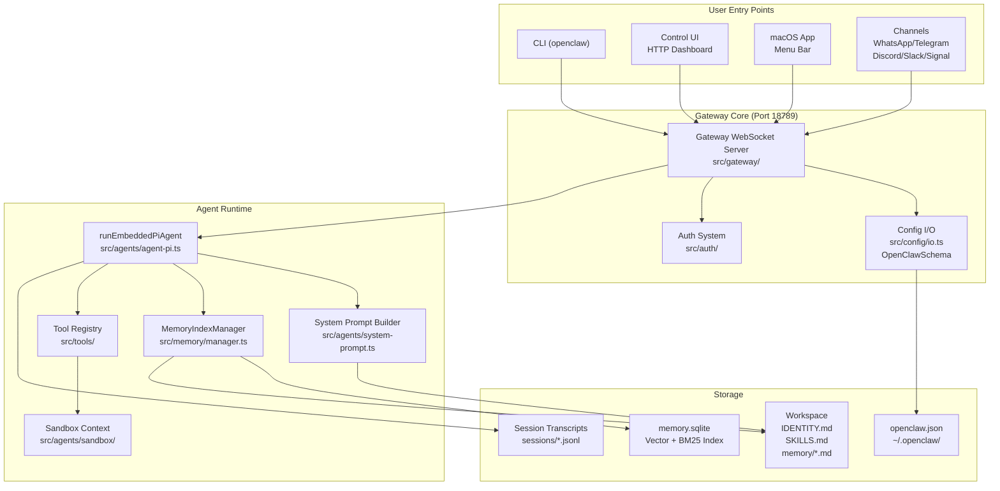
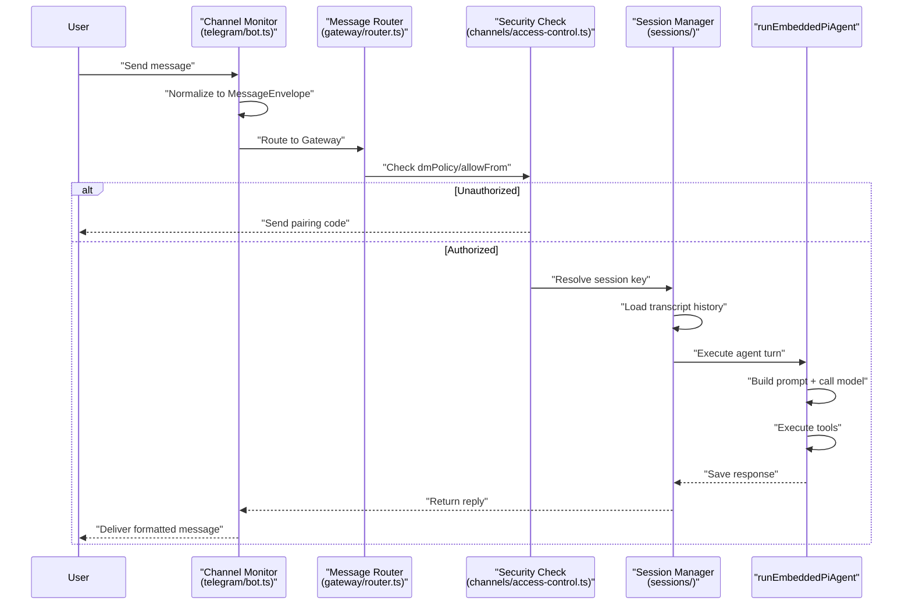

# ページ: 概要

# 概要

<details>
<summary>Relevant source files</summary>

The following files were used as context for generating this wiki page:

- [CHANGELOG.md](CHANGELOG.md)
- [README.md](README.md)
- [assets/avatar-placeholder.svg](assets/avatar-placeholder.svg)
- [docs/channels/zalo.md](docs/channels/zalo.md)
- [docs/channels/zalouser.md](docs/channels/zalouser.md)
- [docs/cli/memory.md](docs/cli/memory.md)
- [docs/cli/sandbox.md](docs/cli/sandbox.md)
- [docs/concepts/memory.md](docs/concepts/memory.md)
- [docs/gateway/configuration.md](docs/gateway/configuration.md)
- [docs/gateway/sandbox-vs-tool-policy-vs-elevated.md](docs/gateway/sandbox-vs-tool-policy-vs-elevated.md)
- [docs/gateway/sandboxing.md](docs/gateway/sandboxing.md)
- [docs/platforms/mac/skills.md](docs/platforms/mac/skills.md)
- [docs/tools/elevated.md](docs/tools/elevated.md)
- [docs/tools/index.md](docs/tools/index.md)
- [docs/tools/skills-config.md](docs/tools/skills-config.md)
- [extensions/copilot-proxy/package.json](extensions/copilot-proxy/package.json)
- [extensions/google-antigravity-auth/package.json](extensions/google-antigravity-auth/package.json)
- [extensions/google-gemini-cli-auth/package.json](extensions/google-gemini-cli-auth/package.json)
- [extensions/matrix/CHANGELOG.md](extensions/matrix/CHANGELOG.md)
- [extensions/matrix/package.json](extensions/matrix/package.json)
- [extensions/memory-lancedb/package.json](extensions/memory-lancedb/package.json)
- [extensions/msteams/CHANGELOG.md](extensions/msteams/CHANGELOG.md)
- [extensions/msteams/package.json](extensions/msteams/package.json)
- [extensions/voice-call/CHANGELOG.md](extensions/voice-call/CHANGELOG.md)
- [extensions/voice-call/package.json](extensions/voice-call/package.json)
- [extensions/zalo/CHANGELOG.md](extensions/zalo/CHANGELOG.md)
- [extensions/zalo/package.json](extensions/zalo/package.json)
- [extensions/zalouser/package.json](extensions/zalouser/package.json)
- [package.json](package.json)
- [pnpm-lock.yaml](pnpm-lock.yaml)
- [scripts/clawtributors-map.json](scripts/clawtributors-map.json)
- [scripts/update-clawtributors.ts](scripts/update-clawtributors.ts)
- [scripts/update-clawtributors.types.ts](scripts/update-clawtributors.types.ts)
- [src/agents/memory-search.test.ts](src/agents/memory-search.test.ts)
- [src/agents/memory-search.ts](src/agents/memory-search.ts)
- [src/agents/sandbox-explain.test.ts](src/agents/sandbox-explain.test.ts)
- [src/agents/sandbox.ts](src/agents/sandbox.ts)
- [src/cli/memory-cli.test.ts](src/cli/memory-cli.test.ts)
- [src/cli/memory-cli.ts](src/cli/memory-cli.ts)
- [src/cli/models-cli.test.ts](src/cli/models-cli.test.ts)
- [src/config/config.ts](src/config/config.ts)
- [src/config/schema.ts](src/config/schema.ts)
- [src/config/types.tools.ts](src/config/types.tools.ts)
- [src/config/types.ts](src/config/types.ts)
- [src/config/zod-schema.agent-runtime.ts](src/config/zod-schema.agent-runtime.ts)
- [src/config/zod-schema.ts](src/config/zod-schema.ts)
- [src/index.test.ts](src/index.test.ts)
- [src/index.ts](src/index.ts)
- [src/memory/embeddings.test.ts](src/memory/embeddings.test.ts)
- [src/memory/embeddings.ts](src/memory/embeddings.ts)
- [src/memory/manager.ts](src/memory/manager.ts)
- [tsconfig.json](tsconfig.json)
- [ui/src/styles.css](ui/src/styles.css)
- [ui/src/styles/layout.mobile.css](ui/src/styles/layout.mobile.css)

</details>


## 目的と範囲

このページでは、**OpenClaw** を紹介します。OpenClaw は、AIエージェントをメッセージングプラットフォーム（WhatsApp、Telegram、Discord、Slack、Signal など）に一元的なコントロールプレーンを通じて接続する、セルフホスト型のマルチチャネルAIゲートウェイです。本ページでは、システムのコアアーキテクチャ、主要コンポーネント、およびそれらの相互作用について説明します。

用語の詳細な定義については、[主要な概念](#1.1)を参照してください。インストールと初回起動の手順については、[クイックスタート](#1.2)を参照してください。詳細なアーキテクチャ図については、[アーキテクチャ図](#1.3)を参照してください。

---

## OpenClaw とは

OpenClaw は、自分自身のインフラストラクチャ上で動作する**パーソナルAIアシスタントフレームワーク**です。以下の機能を提供します：

- **マルチチャネルメッセージング**: 1つのAIエージェントを複数のメッセージングプラットフォームに同時接続
- **一元管理**: 単一のゲートウェイサーバー（`ws://127.0.0.1:18789`）がすべてのチャネル、エージェント、ツールを調整
- **ホットリロード設定**: ゲートウェイを再起動せずに設定を変更可能
- **サンドボックス実行**: セキュリティのため、エージェントのツールを隔離されたDockerコンテナ内で実行
- **エクステンションシステム**: npm でインストール可能なプラグインを通じて新しいチャネルや機能を追加
- **セッション管理**: ユーザー/チャネル/グループごとに隔離された会話コンテキスト

システムは**ハブ・アンド・スポーク型アーキテクチャ**を中心に構築されています。ゲートウェイが中央のコントロールプレーンとして機能し、チャネル、クライアント、エージェントが WebSocket RPC を介して接続します。

**出典**: [README.md:1-498](), [package.json:1-217]()

---

## システムアーキテクチャ概要



**主要なコードエンティティ**:
- **ゲートウェイサーバー**: [src/gateway/server.ts]()
- **エージェント実行エンジン**: [src/agents/agent-pi.ts]()
- **設定スキーマ**: [src/config/zod-schema.ts]()
- **メモリマネージャー**: [src/memory/manager.ts]()
- **ツールシステム**: [src/tools/]()

**出典**: [src/index.ts:1-94](), [src/config/zod-schema.ts:1-470](), [README.md:180-197]()

---

## コアコンポーネント

### ゲートウェイサーバー

**ゲートウェイ**は、すべてのシステムコンポーネントを調整する中央の WebSocket サーバー（デフォルトポート `18789`）です。[src/gateway/protocol.ts]() で定義された RPC プロトコルを公開しており、以下の操作が可能です：

- **設定管理**: `config.get`, `config.set`, `config.apply`, `config.patch`
- **エージェント制御**: `agent.send`, `agent.execute`
- **セッション操作**: `sessions.list`, `sessions.history`, `sessions.send`
- **チャネル管理**: `channels.status`, `channels.login`
- **システム診断**: `gateway.health`, `gateway.status`

ゲートウェイは、プラットフォーム固有のスーパーバイザーを使用して**バックグラウンドサービス**として動作します：
- macOS: `launchd` (LaunchAgent)
- Linux: `systemd` (ユーザーサービス)
- Windows: タスクスケジューラ

**設定**: ゲートウェイの動作は `gateway.*` 設定キーで制御されます：

| フィールド | 用途 | デフォルト値 |
|-------|---------|---------|
| `gateway.port` | WebSocket リッスンポート | `18789` |
| `gateway.bind` | ネットワークバインドモード | `"loopback"` |
| `gateway.auth.mode` | 認証タイプ | `"token"` |
| `gateway.reload.mode` | 設定ホットリロードの動作 | `"hybrid"` |
| `gateway.controlUi.enabled` | Web ダッシュボードの提供 | `true` |

**出典**: [src/config/types.gateway.ts](), [docs/gateway/configuration.md:1-480]()

---

### 設定システム

OpenClaw は、**厳密でホットリロード可能な**設定システムを使用しています：

1. **スキーマ**: [src/config/zod-schema.ts]() で Zod スキーマとして定義。すべての設定キーはスキーマに一致する必要があり、一致しない場合はゲートウェイの起動が拒否されます。
2. **ファイル**: `~/.openclaw/openclaw.json`（コメントと末尾カンマをサポートする JSON5 形式）
3. **バリデーション**: [src/config/validation.ts]() が読み込み時とプラグイン登録時に設定を検証
4. **ホットリロード**: [src/config/io.ts]() が設定ファイルを監視し、変更を自動的に適用

**リロードモード** (`gateway.reload.mode`):

| モード | 動作 |
|------|----------|
| `hybrid`（デフォルト） | 安全な変更はホット適用、インフラストラクチャの変更は自動再起動 |
| `hot` | ホット適用のみ、再起動が必要な変更については警告をログに記録 |
| `restart` | 設定変更時にゲートウェイを再起動 |
| `off` | ファイル監視なし、手動再起動が必要 |

**ホット適用 vs 再起動**:
- **ホット適用**: `channels.*`, `agents.*`, `tools.*`, `cron.*`, `hooks.*`, `session.*`, `messages.*`
- **再起動が必要**: `gateway.port`, `gateway.bind`, `gateway.auth`, `gateway.tailscale`, `gateway.tls`

**インクルードシステム**: 設定は `$include` ディレクティブをサポートし、大きな設定を分割できます：
```json5
{
  gateway: { port: 18789 },
  agents: { $include: "./agents.json5" },
  channels: { $include: ["./channels/telegram.json5", "./channels/discord.json5"] }
}
```

**出典**: [src/config/config.ts:1-15](), [src/config/zod-schema.ts:95-470](), [docs/gateway/configuration.md:327-366]()

---

### エージェントランタイム

**エージェントランタイム**は、[src/agents/agent-pi.ts]() の [runEmbeddedPiAgent]() を介してAIエージェントのターンを実行します。以下を統合的に制御します：

1. **システムプロンプトの構築**: [src/agents/system-prompt.ts]() がワークスペースファイル（`IDENTITY.md`, `SKILLS.md`, `MEMORY.md`）からプロンプトを組み立て
2. **ツールの作成**: [src/tools/registry.ts]() がポリシー解決に基づいてツールを提供
3. **メモリ検索**: [src/memory/manager.ts]() が `memory_search` ツールを介してセマンティック検索を処理
4. **モデルプロバイダー呼び出し**: [pi-ai SDK]() を介して Anthropic、OpenAI、Gemini などと統合
5. **セッション永続化**: [src/config/sessions/store.ts]() が JSONL 形式のトランスクリプトを書き込み

**ツールポリシー解決チェーン**:
```
Global tools.allow/deny
  → tools.byProvider[provider]
    → agents.list[agentId].tools
      → session-specific overrides (groups)
        → sandbox.tools (if sandboxed)
```

拒否（deny）は常に優先されます。`group:fs`、`group:runtime` などのツールグループは複数のツールに展開されます。

**出典**: [src/agents/agent-pi.ts](), [src/agents/system-prompt.ts](), [src/tools/index.ts](), [docs/tools/index.md:1-227]()

---

### メモリシステム

OpenClaw は、ハイブリッドなベクトル + BM25 インデックスを使用して、ワークスペースの Markdown ファイルとセッショントランスクリプトに対する**セマンティックメモリ検索**を提供します。

**アーキテクチャ**:
- **バックエンド**: [src/memory/manager.ts:111-1128]() の `MemoryIndexManager`
- **ストレージ**: `sqlite-vec` エクステンション（ベクトルテーブル）+ FTS5（キーワード検索）を備えた SQLite データベース
- **埋め込みプロバイダー**: OpenAI、Gemini、Voyage、またはローカルの `node-llama-cpp`
- **チャンキング**: 80トークンのオーバーラップを持つ400トークンチャンク
- **ハイブリッド検索**: ベクトル類似度（重み70%）と BM25 キーワード検索（重み30%）を組み合わせ

**設定例**:
```json5
{
  agents: {
    defaults: {
      memorySearch: {
        enabled: true,
        provider: "openai",  // or "gemini", "voyage", "local", "auto"
        sources: ["memory", "sessions"],
        sync: {
          watch: true,
          onSearch: true,
          intervalMinutes: 60
        }
      }
    }
  }
}
```

**メモリソース**:
1. **`memory`**: ワークスペース内の `MEMORY.md` + `memory/*.md`
2. **`sessions`**: `~/.openclaw/agents/<agentId>/sessions/*.jsonl` からのセッショントランスクリプト

**ツール**:
- `memory_search(query)`: ハイブリッドランキングによるセマンティック検索
- `memory_get(path)`: パスを指定して特定のメモリファイルを読み取り

**代替バックエンド**: QMD（`memory.backend = "qmd"`）は、BM25 + ベクトル + リランキングに外部の [qmd CLI]() を使用します。

**出典**: [src/memory/manager.ts:1-1128](), [src/agents/memory-search.ts:1-250](), [docs/concepts/memory.md:1-250]()

---

### チャネルシステム

チャネルは、ゲートウェイをメッセージングプラットフォームに接続します。OpenClaw には**組み込みチャネル**が含まれており、プラグインを介した**エクステンションチャネル**もサポートしています。

**組み込みチャネル**:
- WhatsApp ([Baileys]()), Telegram ([grammY]()), Discord ([discord.js]()), Slack ([Bolt]()), Signal ([signal-cli]()), Google Chat, BlueBubbles (iMessage), iMessage (レガシー), WebChat

**エクステンションチャネル** (npm プラグイン):
- Matrix (`@openclaw/matrix`), Zalo (`@openclaw/zalo`), Zalo Personal (`@openclaw/zalouser`), MS Teams (`@openclaw/msteams`)

**チャネルのライフサイクル**:


**アクセス制御** (`dmPolicy`):
- `pairing`（デフォルト）: ワンタイム承認コードが必要
- `allowlist`: `allowFrom` 配列内のユーザーのみ
- `open`: すべての DM を許可（`allowFrom: ["*"]` が必要）
- `disabled`: すべての DM を無視

**出典**: [src/channels/](), [docs/channels/](), [README.md:336-399]()

---

### ツールシステム

ツールは、エージェントに機能を提供します。システムには以下が含まれます：

**コアツール**（拒否されない限り常に利用可能）:
- **ファイル I/O**: `read`, `write`, `edit`, `apply_patch`
- **実行**: `exec`, `bash`, `process`
- **セッション**: `sessions_list`, `sessions_history`, `sessions_send`, `sessions_spawn`, `session_status`
- **メモリ**: `memory_search`, `memory_get`
- **Web**: `web_search`, `web_fetch`
- **UI**: `browser`, `canvas`
- **自動化**: `cron`, `gateway`
- **メッセージング**: `message`
- **ノード**: `nodes`（デバイス制御）
- **メディア**: `image`（画像理解）

**ツールプロファイル**（ベースの許可リスト）:
- `minimal`: `session_status` のみ
- `coding`: ファイル I/O + 実行 + セッション + メモリ
- `messaging`: メッセージングツール + セッションツール
- `full`: 制限なし

**ツールグループ**（省略記法）:
- `group:runtime`: `exec`, `bash`, `process`
- `group:fs`: `read`, `write`, `edit`, `apply_patch`
- `group:sessions`: すべてのセッションツール
- `group:memory`: `memory_search`, `memory_get`
- `group:web`: `web_search`, `web_fetch`
- `group:ui`: `browser`, `canvas`

**ポリシーの例**:
```json5
{
  tools: {
    profile: "coding",
    deny: ["browser", "canvas"],  // Disable UI tools
    byProvider: {
      "google-antigravity": {
        allow: ["group:fs", "sessions_list"]  // Restrict specific provider
      }
    }
  }
}
```

**出典**: [src/tools/](), [src/config/types.tools.ts:1-350](), [docs/tools/index.md:1-227]()

---

### サンドボックスシステム

**サンドボックスシステム**は、セキュリティリスクを低減するため、エージェントのツール実行を Docker コンテナ内で隔離します。

**設定**:
```json5
{
  agents: {
    defaults: {
      sandbox: {
        mode: "non-main",  // off | non-main | all
        scope: "session",  // session | agent | shared
        workspaceAccess: "rw",  // none | ro | rw
        tools: {
          allow: ["bash", "process", "read", "write", "sessions_list"],
          deny: ["browser", "canvas", "cron", "gateway"]
        }
      }
    }
  }
}
```

**モード**:
- `off`: サンドボックスなし（すべてのツールがホスト上で実行）
- `non-main`: DM 以外のセッション（グループ、チャネル）をサンドボックス化
- `all`: すべてのセッションをサンドボックス化

**スコープ**:
- `session`: セッションごとに1つのコンテナ（隔離）
- `agent`: エージェントごとに1つのコンテナ（セッション間で共有）
- `shared`: すべてのエージェントで1つのコンテナを共有

**ワークスペースアクセス**:
- `none`: ワークスペースのマウントなし
- `ro`: 読み取り専用のワークスペース
- `rw`: 読み書き可能なワークスペース

**イメージ**: デフォルトは `openclaw-sandbox:latest`。`scripts/sandbox-setup.sh` でビルドします。

**出典**: [src/agents/sandbox/](), [docs/gateway/sandboxing.md:1-120]()

---

## エクステンションとプラグインモデル

OpenClaw は、チャネルや機能プラグインを宣言する npm パッケージを介した**エクステンション**をサポートしています。

**プラグインメタデータ** (`package.json`):
```json5
{
  "openclaw": {
    "extensions": ["./index.ts"],
    "channel": {
      "id": "matrix",
      "label": "Matrix",
      "docsPath": "/channels/matrix",
      "order": 70
    }
  }
}
```

**プラグインの検出**:
1. コアが `node_modules/@openclaw/*` と `extensions/*/package.json` をスキャン
2. [src/plugins/loader.ts]() を介してエクステンションを読み込み
3. [src/config/schema.ts:209-248]() を介してプラグインスキーマを `OpenClawSchema` にマージ

**チャネルエクステンション**:
- [extensions/matrix/package.json:1-37](): Matrix プロトコル
- [extensions/zalo/package.json:1-36](): Zalo Bot API
- [extensions/zalouser/package.json:1-38](): Zalo 個人アカウント
- [extensions/msteams/package.json:1-32](): Microsoft Teams

**機能エクステンション**:
- [extensions/voice-call/package.json:1-20](): Twilio/Telnyx 音声通話
- [extensions/memory-lancedb/package.json:1-21](): LanceDB メモリバックエンド

**プラグイン SDK**: [dist/plugin-sdk/]()（パッケージエクスポートの `openclaw/plugin-sdk`）を介してエクスポートされます。

**出典**: [extensions/](), [src/plugins/](), [src/config/schema.ts:91-165]()

---

## データフロー: メッセージ処理

```mermaid
graph LR
    Inbound["Inbound Message<br/>channels/*/monitor.ts"]
    Normalize["Normalize Envelope<br/>MessageEnvelope"]
    Router["Route to Gateway<br/>gateway/router.ts"]
    AccessCheck["Access Control<br/>dmPolicy check"]
    SessionKey["Resolve Session Key<br/>deriveSessionKey()"]
    LoadHistory["Load Transcript<br/>sessions/*.jsonl"]
    BuildPrompt["Build System Prompt<br/>system-prompt.ts"]
    CallModel["Call AI Model<br/>runEmbeddedPiAgent"]
    ToolExec["Execute Tools<br/>tools/registry.ts"]
    Sandbox{"Sandboxed?"}
    DockerExec["Docker Container<br/>sandbox/context.ts"]
    HostExec["Host Execution"]
    SaveSession["Save Transcript<br/>JSONL append"]
    FormatReply["Format Reply<br/>channel-specific"]
    Deliver["Deliver to User"]

    Inbound --> Normalize
    Normalize --> Router
    Router --> AccessCheck
    AccessCheck -->|Denied| Deliver
    AccessCheck -->|Allowed| SessionKey
    SessionKey --> LoadHistory
    LoadHistory --> BuildPrompt
    BuildPrompt --> CallModel
    CallModel --> ToolExec
    ToolExec --> Sandbox
    Sandbox -->|Yes| DockerExec
    Sandbox -->|No| HostExec
    DockerExec --> SaveSession
    HostExec --> SaveSession
    SaveSession --> FormatReply
    FormatReply --> Deliver
```



**主要な関数**:
- **正規化**: [src/channels/envelope.ts]()
- **セッションキー**: [src/config/sessions.ts:deriveSessionKey]()
- **エージェント実行**: [src/agents/agent-pi.ts:runEmbeddedPiAgent]()
- **ツールレジストリ**: [src/tools/registry.ts]()
- **サンドボックスコンテキスト**: [src/agents/sandbox/context.ts]()

**出典**: [src/gateway/router.ts](), [src/channels/](), [src/agents/agent-pi.ts]()

---

## 主要なファイル構造

```
openclaw/
├── src/
│   ├── gateway/           # Gateway server, RPC protocol, router
│   ├── config/            # Schema (zod-schema.ts), validation, I/O
│   ├── agents/            # Agent runtime, system prompt, sandbox
│   ├── channels/          # Built-in channels (telegram, discord, etc.)
│   ├── memory/            # Memory index manager, embeddings, hybrid search
│   ├── tools/             # Tool registry, built-in tools (exec, read, etc.)
│   ├── sessions/          # Session management, transcript store
│   ├── cli/               # CLI commands (program.ts, agent-cli.ts, etc.)
│   └── infra/             # Infrastructure (env, errors, ports, dotenv)
├── extensions/            # Extension plugins (matrix, zalo, msteams)
│   ├── matrix/
│   ├── zalo/
│   ├── zalouser/
│   ├── msteams/
│   └── voice-call/
├── docs/                  # Documentation (configuration, channels, tools)
├── ui/                    # Control UI (Lit web components)
├── apps/                  # Native apps (macos, ios, android)
├── skills/                # Bundled skills (markdown files)
├── scripts/               # Build and maintenance scripts
└── openclaw.json          # User configuration file (~/.openclaw/)
```

**設定パス**:
- 設定ファイル: `~/.openclaw/openclaw.json`
- 状態ディレクトリ: `~/.openclaw/`（または `$OPENCLAW_STATE_DIR`）
- ワークスペース: `~/.openclaw/workspace/`（または `agents.defaults.workspace`）
- セッション: `~/.openclaw/agents/<agentId>/sessions/*.jsonl`
- メモリ DB: `~/.openclaw/agents/<agentId>/memory.sqlite`

**出典**: [src/](), [extensions/](), [README.md:309-311]()

---

## まとめ

OpenClaw は**ハブ・アンド・スポーク型のAIゲートウェイ**であり、以下のように構成されています：
- **ゲートウェイ**（ポート 18789）が中央のコントロールプレーン
- **エージェント**が `runEmbeddedPiAgent` を介してツールサポート付きでAIターンを実行
- **チャネル**がメッセージングプラットフォームのプロトコルを統一されたエンベロープに正規化
- **設定**はスキーマで検証され、ホットリロードが可能
- **メモリ**がワークスペースの Markdown とトランスクリプトに対するセマンティック検索を提供
- **サンドボックス**が Docker コンテナ内でツール実行を隔離
- **エクステンション**が npm プラグインを介して新しいチャネルや機能を追加

すべてのシステム状態は**ファイル**に保存されます：設定は `openclaw.json`、セッションは `*.jsonl` トランスクリプト、メモリは Markdown + SQLite、ワークスペースコンテキストは `IDENTITY.md`、`SKILLS.md` などに格納されます。

**出典**: [README.md:1-498](), [package.json:1-217](), [src/config/zod-schema.ts:95-470]()

---
