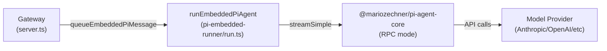
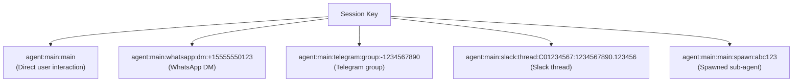
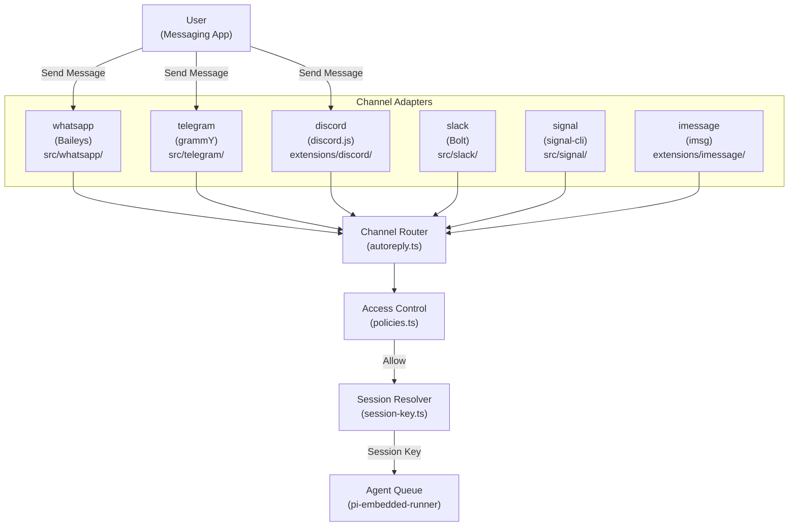
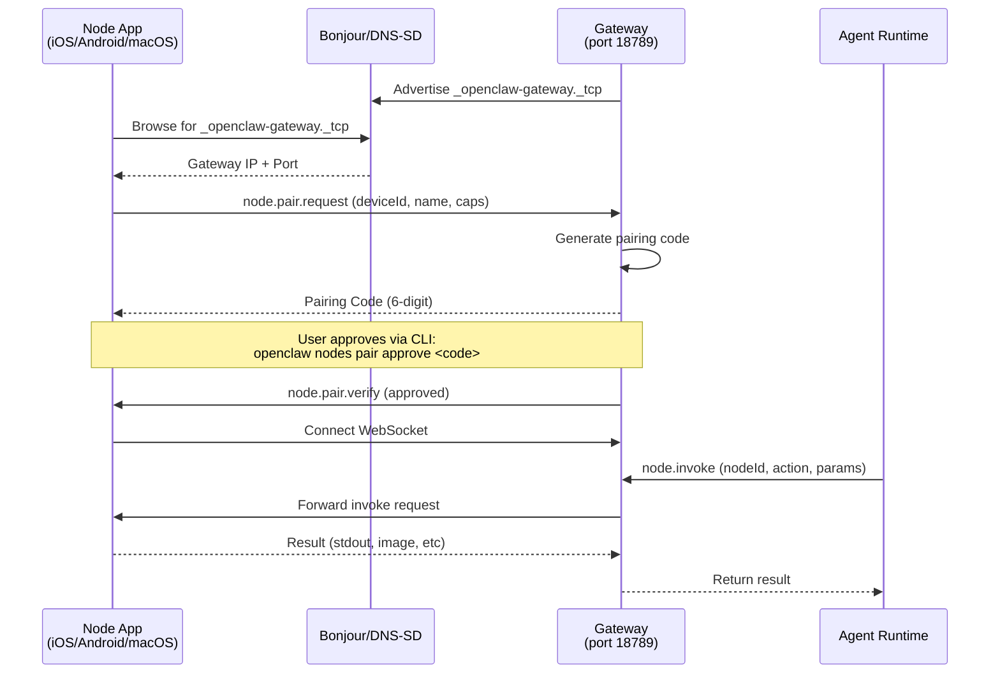
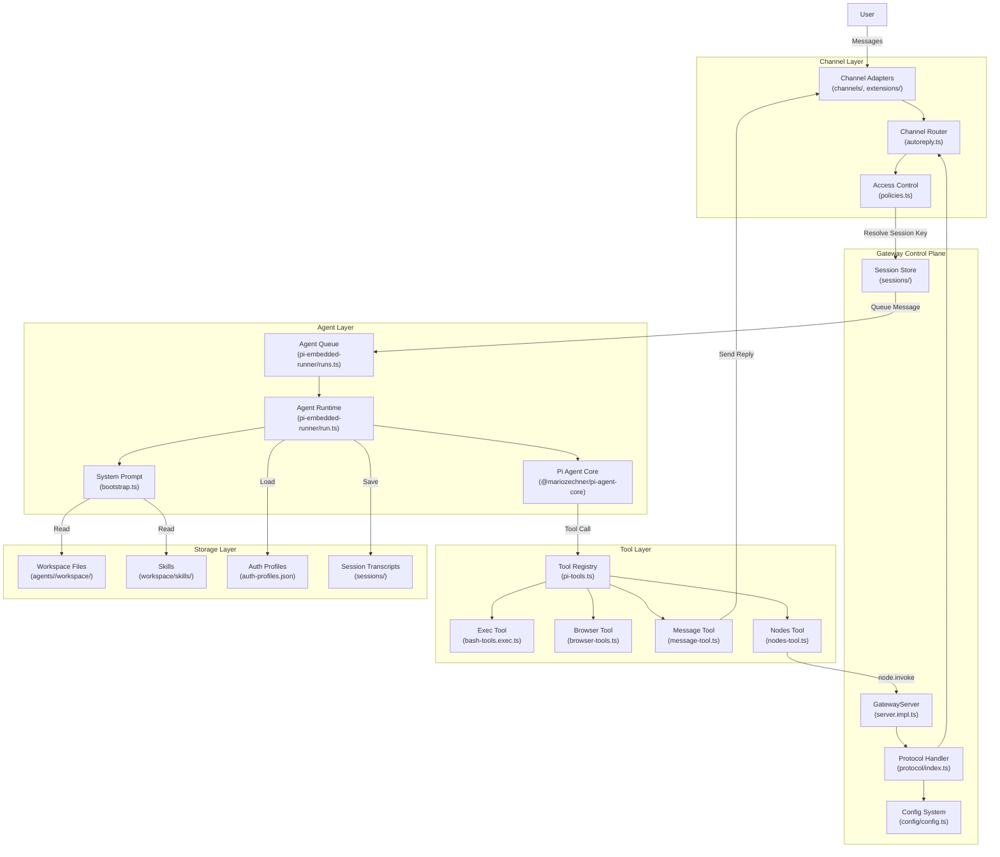

# ページ: 主要コンセプト

# 主要コンセプト

<details>
<summary>Relevant source files</summary>

The following files were used as context for generating this wiki page:

- [CHANGELOG.md](CHANGELOG.md)
- [README.md](README.md)
- [assets/avatar-placeholder.svg](assets/avatar-placeholder.svg)
- [docs/channels/zalo.md](docs/channels/zalo.md)
- [docs/channels/zalouser.md](docs/channels/zalouser.md)
- [docs/cli/memory.md](docs/cli/memory.md)
- [docs/cli/sandbox.md](docs/cli/sandbox.md)
- [docs/concepts/memory.md](docs/concepts/memory.md)
- [docs/gateway/configuration.md](docs/gateway/configuration.md)
- [docs/gateway/sandbox-vs-tool-policy-vs-elevated.md](docs/gateway/sandbox-vs-tool-policy-vs-elevated.md)
- [docs/gateway/sandboxing.md](docs/gateway/sandboxing.md)
- [docs/platforms/mac/skills.md](docs/platforms/mac/skills.md)
- [docs/tools/elevated.md](docs/tools/elevated.md)
- [docs/tools/index.md](docs/tools/index.md)
- [docs/tools/skills-config.md](docs/tools/skills-config.md)
- [scripts/clawtributors-map.json](scripts/clawtributors-map.json)
- [scripts/update-clawtributors.ts](scripts/update-clawtributors.ts)
- [scripts/update-clawtributors.types.ts](scripts/update-clawtributors.types.ts)
- [src/agents/memory-search.test.ts](src/agents/memory-search.test.ts)
- [src/agents/memory-search.ts](src/agents/memory-search.ts)
- [src/agents/sandbox-explain.test.ts](src/agents/sandbox-explain.test.ts)
- [src/agents/sandbox.ts](src/agents/sandbox.ts)
- [src/cli/memory-cli.test.ts](src/cli/memory-cli.test.ts)
- [src/cli/memory-cli.ts](src/cli/memory-cli.ts)
- [src/cli/models-cli.test.ts](src/cli/models-cli.test.ts)
- [src/config/config.ts](src/config/config.ts)
- [src/config/schema.ts](src/config/schema.ts)
- [src/config/types.tools.ts](src/config/types.tools.ts)
- [src/config/types.ts](src/config/types.ts)
- [src/config/zod-schema.agent-runtime.ts](src/config/zod-schema.agent-runtime.ts)
- [src/config/zod-schema.ts](src/config/zod-schema.ts)
- [src/index.test.ts](src/index.test.ts)
- [src/index.ts](src/index.ts)
- [src/memory/embeddings.test.ts](src/memory/embeddings.test.ts)
- [src/memory/embeddings.ts](src/memory/embeddings.ts)
- [src/memory/manager.ts](src/memory/manager.ts)
- [tsconfig.json](tsconfig.json)
- [ui/src/styles.css](ui/src/styles.css)
- [ui/src/styles/layout.mobile.css](ui/src/styles/layout.mobile.css)

</details>


このページでは、OpenClawのコアとなるアーキテクチャ概念である**ゲートウェイ**、**エージェント**、**セッション**、**チャネル**、**ノード**、**ツール**、**スキル**を定義します。これらの概念とその関係性を理解することは、OpenClawの設定、デプロイ、拡張に不可欠です。

インストールと初期セットアップについては[クイックスタート](#1.2)を参照してください。これらのコンポーネントの詳細な設定については[設定ファイル構造](#4.1)を参照してください。運用管理については[ゲートウェイサービス管理](#3.3)を参照してください。

---

## ゲートウェイ: コントロールプレーン

**ゲートウェイ**はOpenClawの中央調整ハブであり、すべてのシステムコンポーネントをオーケストレーションするWebSocketサーバーです。単一プロセスとして実行され（通常ポート18789）、エージェント、セッション、チャネル、ツール、ノードを管理します。

**ゲートウェイ コントロールプレーン** (`startGatewayServer`)
```
ws://127.0.0.1:18789  (default loopback bind)
```

ゲートウェイはWebSocket上でJSON-RPCスタイルのプロトコルを公開し、以下の接続を処理します:
- **クライアント接続**: CLI、コントロールUI、TUI、モバイルアプリ
- **チャネルアダプター**: WhatsApp、Telegram、Discord、Slack、Signalなど
- **デバイスノード**: iOS、Android、macOSコンパニオンアプリ
- **設定管理**: `config.get`、`config.patch`、`config.apply`
- **エージェントオーケストレーション**: メッセージルーティング、セッションライフサイクル、ツール呼び出し

**主な責務:**
| 責務 | 説明 |
|------|------|
| **プロトコルハンドラー** | RPCリクエストの検証とルーティング ([src/gateway/protocol/index.ts:1-400]()) |
| **セッション管理** | セッションキーごとの会話状態を追跡 ([src/config/sessions.ts]()) |
| **チャネルルーティング** | 受信メッセージをエージェントにルーティング ([src/web/autoreply.ts]()) |
| **設定システム** | `openclaw.json` の読み込みと検証 ([src/config/config.ts]()) |
| **プレゼンスとヘルスチェック** | チャネル接続性とエージェントステータスの監視 |
| **Cronスケジューラー** | スケジュールされたタスクの実行 ([src/cron/]()) |

**ゲートウェイのバインドモード:**
- `loopback` (127.0.0.1) - ローカルアクセスのみ、リモートクライアントにはSSHトンネルまたはプロキシが必要
- `tailnet` - TailscaleのIPにバインド、Tailscale IDで認証
- `lan` - 0.0.0.0にバインド、強力なトークン/パスワード認証が必要
- `auto` - デフォルトはloopback、Tailscaleが設定されている場合はtailnetに切り替え

**ソース:** [src/gateway/server.ts]()、[src/gateway/server.impl.ts]()、[docs/gateway/configuration.md:304-350]()、図1（全体システムアーキテクチャ）

---

## エージェント: AI実行ランタイム

**エージェント**は**Pi Agent Core**ランタイム（`@mariozechner/pi-agent-core`）に基づくAIアシスタントインスタンスです。各エージェントは独自のワークスペース、モデル設定、ツールポリシー、認証プロファイルを持ちます。

**エージェントランタイムチェーン**


**エージェント設定の階層:**
1. `agents.defaults` - 全エージェントに適用されるグローバルデフォルト
2. `agents.list[].` - エージェントごとのオーバーライド（ワークスペース、モデル、ツール、サンドボックス）
3. ランタイムディレクティブ - セッションごとのオーバーライド（`/model`、`/think`、`/elevated`）

**エージェントのIDとルーティング:**
- 各エージェントは `id` を持つ（例: `"main"`、`"work"`、`"support"`）
- デフォルトエージェント: `agents.list[].default: true`（フォールバックは最初のエージェントまたはidが `"main"` のエージェント）
- エージェントは専用の `workspace`、`agentDir`、`auth-profiles.json` を持つことができる
- バインディングによりメッセージが特定のエージェントにルーティングされる: `bindings[].agentId`

**エージェントのワークスペース構造:**
```
~/.openclaw/agents/<agentId>/
├── agent/
│   ├── auth-profiles.json     # OAuth + API key credentials
│   └── auth.json               # Runtime cache (managed by Pi Core)
├── sessions/
│   └── agent-<agentId>.json   # Session transcripts
└── workspace/                  # Files accessible to the agent
    ├── AGENTS.md               # System prompt bootstrap
    ├── SOUL.md                 # Identity/personality
    ├── TOOLS.md                # Tool guidance
    └── skills/                 # Skill bundles
```

**エージェントのツール実行:**
エージェントは `createOpenClawCodingTools` を通じてツールを実行し、以下を組み立てます:
- **ファイルシステムツール**: `read`、`write`、`edit`、`apply_patch` ([src/agents/pi-tools.ts:229-251]())
- **ランタイムツール**: `exec`、`process` ([src/agents/bash-tools.ts]())
- **OpenClawツール**: `browser`、`canvas`、`nodes`、`message`、`sessions_*`、`cron`、`gateway` ([src/agents/openclaw-tools.ts]())
- **プラグインツール**: エクステンションからのオプションツール ([src/plugins/tools.ts]())

**ソース:** [src/agents/pi-embedded-runner/run.ts]()、[src/agents/pi-tools.ts:152-367]()、[docs/gateway/configuration.md:214-249]()、図1（全体システムアーキテクチャ）、図6（エージェント処理とツール実行パイプライン）

---

## セッション: 会話状態管理

**セッション**は、独自のメッセージ履歴、モデル設定、ツール実行状態を持つ単一の会話コンテキストを表します。セッションはルーティング情報をエンコードした**セッションキー**によって識別されます。

**セッションキーのパターン**


**セッションキーのフォーマット:**
```
agent:{agentId}:{provider}:{scope}:{identifier}
```

コードからの例:
- `"agent:main:main"` - メインセッション ([src/routing/session-key.ts]())
- `"agent:main:whatsapp:dm:+15555550123"` - WhatsApp DM
- `"agent:work:telegram:group:-1234567890"` - "work"エージェントにバインドされたTelegramグループ
- `"agent:main:slack:thread:C01234567:1234567890.123456"` - Slackスレッド

**セッションスコープの解決:**
チャネルごとのDMスコーピング（`session.dmScope`）:
- `"global"`（デフォルト）- 送信者ごとに全アカウント共通で1つのセッション
- `"per-account"` - アカウントごとに個別のセッション（マルチアカウント分離）

**セッションライフサイクル:**
| 状態 | 説明 | ストレージ |
|------|------|-----------|
| **アクティブ** | メッセージ履歴あり、メモリ内またはディスク上 | `~/.openclaw/agents/<agentId>/sessions/` |
| **アイドル** | 最近のアクティビティなし、コンパクションされる可能性あり | トランスクリプトが永続化 |
| **リセット** | 履歴がクリア済み（手動 `/reset` またはポリシートリガー） | トランスクリプトがアーカイブまたは削除 |

**セッションリセットポリシー**（`session.reset`）:
- `mode: "idle"` - N分間の非アクティビティ後にリセット
- `mode: "daily"` - 毎日特定の時刻にリセット（ローカルタイム）
- `mode: "off"` - 手動リセットのみ
- チャネルごとのオーバーライド: `session.resetByChannel`

**セッションキューモード**（`routing.queue.mode`）:
- `"sequential"` - メッセージを1つずつ処理（同時実行をブロック）
- `"concurrent"` - エージェントの重複実行を許可
- `"collect"` - 処理前にメッセージをデバウンスしてバッチ処理

**セッション状態管理:**
セッションは以下のセッションごとのオーバーライドを維持します:
- `model` - アクティブモデル（エージェントデフォルトをオーバーライド）
- `thinkingLevel` - 推論の詳細度（`off`、`minimal`、`low`、`medium`、`high`、`xhigh`）
- `verboseLevel` - ツール出力の詳細度（`off`、`on`）
- `sendPolicy` - 応答配信の動作
- `groupActivation` - グループでのメンション要件
- `elevated` - ホスト実行モード（`off`、`on`、`ask`、`full`）

**ソース:** [src/routing/session-key.ts]()、[src/config/sessions.ts]()、[src/sessions/]()、[docs/gateway/configuration.md:880-960]()、図2（メッセージ処理データフロー）

---

## チャネル: メッセージングプラットフォーム統合

**チャネル**はOpenClawをメッセージングプラットフォームに接続するアダプターです。各チャネルはプラットフォーム固有の認証、メッセージフォーマット、配信を処理します。

**チャネルアーキテクチャ**


**組み込みチャネル:**
| チャネル | ライブラリ | ロケーション | マルチアカウント |
|----------|-----------|-------------|-----------------|
| WhatsApp | `@whiskeysockets/baileys` | [src/whatsapp/]() | 対応 |
| Telegram | `grammy` | [src/telegram/]() | 対応 |
| Discord | `discord.js` | [extensions/discord/]() | 対応 |
| Slack | `@slack/bolt` | [src/slack/]() | 対応 |
| Signal | `signal-cli` | [src/signal/]() | 非対応 |
| iMessage | `imsg` | [extensions/imessage/]() | 非対応 |
| Google Chat | Chat API | [extensions/googlechat/]() | 対応 |
| MS Teams | Bot Framework | [extensions/msteams/]() | 対応 |

**エクステンションチャネル:**
- BlueBubbles ([extensions/bluebubbles/]())
- Matrix ([extensions/matrix/]())
- Nostr ([extensions/nostr/]())
- LINE ([extensions/line/]())
- Tlon/Urbit ([extensions/tlon/]())
- Zalo ([extensions/zalo/]())
- その他15以上が [extensions/]() に収録

**チャネルアクセス制御:**

**DMポリシー**（`channels.<channel>.dmPolicy`）:
- `"pairing"`（デフォルト）- 不明な送信者にはペアリングコードが送信され、オーナーが承認する必要がある
- `"allowlist"` - `allowFrom` リストの送信者のみ許可
- `"open"` - すべてのDMを許可（`allowFrom: ["*"]` が必要）
- `"disabled"` - すべてのDMを無視

**グループポリシー**（`channels.<channel>.groupPolicy` / `groups`）:
- 許可リストベース: `groups` 設定にあるグループのみがアクティブ
- グループごとの `requireMention` で@メンションが必要かどうかを制御
- `mentionPatterns` でカスタムトリガーフレーズを許可（例: `["@bot", "hey bot"]`）

**チャネルルーティングフロー:**
1. メッセージがチャネルアダプターに到着
2. アダプターが送信者、コンテンツ、添付ファイル、スレッドコンテキストを抽出
3. ルーターがアクセスポリシーをチェック（`allowFrom`、`groupAllowFrom`、ペアリング）
4. セッションキーが解決される（`resolveSessionKey`）
5. メッセージがエージェント処理のためにキューに入れられる（`queueEmbeddedPiMessage`）

**ソース:** [src/web/autoreply.ts]()、[src/channels/]()、[extensions/]()、[docs/gateway/configuration.md:486-565]()、図2（メッセージ処理データフロー）

---

## ノード: デバイス機能プロバイダー

**ノード**はゲートウェイとペアリングするコンパニオンアプリ（iOS、Android、macOS）であり、`node.invoke` プロトコルを介してデバイスローカルの機能をエージェントに公開します。

**ノードの検出とペアリング**


**ノードの機能:**

| 機能 | iOS | Android | macOS | 説明 |
|------|-----|---------|-------|------|
| `system.run` | 非対応 | 非対応 | 対応 | macOSホストでシェルコマンドを実行 |
| `system.which` | 非対応 | 非対応 | 対応 | バイナリの存在を確認 |
| `system.notify` | 対応 | 対応 | 対応 | 通知を表示 |
| `camera.snap` | 対応 | 対応 | 対応 | 写真を撮影 |
| `camera.clip` | 対応 | 対応 | 非対応 | ビデオクリップを録画 |
| `screen.record` | 対応 | 対応 | 非対応 | 画面録画 |
| `location.get` | 対応 | 対応 | 対応 | GPS座標を取得 |
| `canvas.*` | 対応 | 対応 | 対応 | A2UIキャンバス制御 |

**ツールからのノード呼び出し:**

`nodes` ツールにより、エージェントは特定のノードをターゲットにできます:
```typescript
// exec tool with node targeting
exec({
  command: "ls -la",
  host: "node",
  node: "macbook-pro"  // Node id or name
})

// Direct node invocation
node.invoke({
  nodeId: "iphone-15",
  action: "camera.snap",
  params: { quality: "high" }
})
```

**ノード管理:**
- ノード一覧表示: `openclaw nodes list`
- 機能の説明: `openclaw nodes describe <nodeId>`
- ペアリング承認: `openclaw nodes pair approve <code>`
- ノード名変更: `openclaw nodes rename <nodeId> <newName>`

**ノードホストモード:**

macOSとLinuxは `openclaw node start` で「ノードホスト」として実行でき、完全なmacOSアプリなしでリモート実行用の `system.run`/`system.which` を公開します。

**ソース:** [src/gateway/protocol/schema/nodes.ts]()、[docs/nodes/]()、[README.md:222-229]()、図1（全体システムアーキテクチャ）

---

## ツール: エージェントの機能

**ツール**はエージェントが実行中に呼び出せる関数です。OpenClawはファイル操作、シェル実行、ブラウザ制御、メッセージング、システム統合のための組み込みツールを提供します。

**ツールの登録と実行**

```mermaid
graph TB
    CreateTools["createOpenClawCodingTools<br/>(pi-tools.ts:153)"]

    subgraph "Core Tools"
        FSTools["File System<br/>read, write, edit"]
        RuntimeTools["Runtime<br/>exec, process"]
        MemoryTools["Memory<br/>memory_search, memory_get"]
        WebTools["Web<br/>web_search, web_fetch"]
    end

    subgraph "OpenClaw Tools"
        BrowserTool["browser<br/>(browser-tools.ts)"]
        CanvasTool["canvas<br/>(canvas-tool.ts)"]
        NodesTool["nodes<br/>(nodes-tool.ts)"]
        MessageTool["message<br/>(message-tool.ts)"]
        SessionTools["sessions_*<br/>(sessions-tools.ts)"]
        CronTool["cron<br/>(cron-tool.ts)"]
        GatewayTool["gateway<br/>(gateway-tool.ts)"]
    end

    subgraph "Plugin Tools"
        LobsterTool["lobster<br/>(extensions/lobster)"]
        LLMTaskTool["llm-task<br/>(extensions/llm-task)"]
        ChannelTools["Channel tools<br/>(login, send, etc)"]
    end

    CreateTools --> FSTools
    CreateTools --> RuntimeTools
    CreateTools --> MemoryTools
    CreateTools --> WebTools
    CreateTools --> BrowserTool
    CreateTools --> CanvasTool
    CreateTools --> NodesTool
    CreateTools --> MessageTool
    CreateTools --> SessionTools
    CreateTools --> CronTool
    CreateTools --> GatewayTool
    CreateTools --> LobsterTool
    CreateTools --> LLMTaskTool
    CreateTools --> ChannelTools

    AgentRuntime["Agent Runtime"] -->|"Assemble tools"| CreateTools
    CreateTools -->|"Filtered tools"| ModelProvider["Model Provider"]
```


**ツールポリシーシステム:**

ツールは複数のポリシーレイヤーによってフィルタリングされます:
1. **ツールプロファイル**（`tools.profile`）: 基本的な許可リストプリセット
   - `"minimal"` - session_statusのみ
   - `"coding"` - ファイルシステム + ランタイム + メモリ
   - `"messaging"` - メッセージング + セッションツール
   - `"full"` - すべてのツール（デフォルト）

2. **グローバル許可/拒否**（`tools.allow`、`tools.deny`）: トップレベルのフィルター

3. **プロバイダー固有ポリシー**（`tools.byProvider`）: プロバイダーごとの制限
   ```json5
   {
     tools: {
       byProvider: {
         "google-antigravity": { profile: "minimal" },
         "openai/gpt-5.2": { allow: ["group:fs", "sessions_list"] }
       }
     }
   }
   ```

4. **エージェントオーバーライド**（`agents.list[].tools`）: エージェントごとのポリシー

5. **グループポリシー**（`channels.<channel>.groups.<groupId>.tools`）: グループごとの制限

6. **サンドボックスポリシー**（`tools.sandbox.tools`）: サンドボックスで利用可能なツール

**ツールグループ**（複数ツールの省略記法）:
- `group:runtime` → `exec`、`bash`、`process`
- `group:fs` → `read`、`write`、`edit`、`apply_patch`
- `group:sessions` → `sessions_list`、`sessions_history`、`sessions_send`、`sessions_spawn`、`session_status`
- `group:memory` → `memory_search`、`memory_get`
- `group:web` → `web_search`、`web_fetch`
- `group:ui` → `browser`、`canvas`
- `group:automation` → `cron`、`gateway`
- `group:messaging` → `message`
- `group:nodes` → `nodes`

**ツール実行のセキュリティ:**

**Execツールのホストターゲティング** ([src/agents/bash-tools.exec.ts]()):
- `host: "sandbox"` - Dockerコンテナ内で実行（サンドボックス時）
- `host: "gateway"` - ゲートウェイホスト上で実行
- `host: "node"` - ペアリング済みデバイスノード上で実行

**Execセキュリティモード**:
- `security: "deny"` - すべてのコマンドをブロック
- `security: "allowlist"` - 許可リストにないコマンドは承認が必要
- `security: "full"` - すべてのコマンドを許可

**Exec承認フロー** ([src/agents/bash-tools.exec.ts:300-450]()):
- `ask: "off"` - 承認プロンプトなし
- `ask: "on-miss"` - コマンドが許可リストにない場合にプロンプト
- `ask: "always"` - すべてのコマンドでプロンプト

**ソース:** [src/agents/pi-tools.ts:152-367]()、[src/agents/bash-tools.ts]()、[src/agents/openclaw-tools.ts]()、[docs/tools/index.md]()、図6（エージェント処理とツール実行パイプライン）

---

## スキル: バンドルされた知識と機能

**スキル**はプロンプト、スクリプト、メタデータを含む自己完結型のバンドルで、エージェントの機能を拡張します。エージェントのワークスペースに配置され、自動的に検出されてシステムプロンプトに注入されます。

**スキルの構造**
```
~/.openclaw/agents/<agentId>/workspace/skills/
├── github/
│   ├── SKILL.md           # Skill documentation (injected into prompt)
│   ├── package.json       # Metadata (name, description, dependencies)
│   └── bin/               # Optional binaries/scripts
├── slack/
│   ├── SKILL.md
│   └── package.json
└── custom-skill/
    ├── SKILL.md
    └── package.json
```

**スキルの種類:**

1. **バンドルスキル** - OpenClawに同梱され、オンボーディング時にインストール
   - リポジトリ内の場所: [skills/]()
   - 例: `github`、`slack`、`discord`、`notion`、`figma`

2. **マネージドスキル** - ClawdHubレジストリからダウンロード
   - インストール方法: `openclaw skills install <skillName>`
   - レジストリ: https://ClawdHub.com

3. **ワークスペーススキル** - エージェントワークスペース内のカスタムスキル
   - `workspace/skills/` に手動で作成
   - プロンプト内容と依存関係を完全に制御可能

**スキルの検出と注入:**

スキルは `workspace/skills/` をスキャンして、以下を含むディレクトリを検出します:
- `SKILL.md` - Markdownドキュメント（システムプロンプトの `TOOLS.md` セクションに注入）
- `package.json` - メタデータ（名前、説明、バージョン、依存関係）

**スキルメタデータ**（`package.json`）:
```json5
{
  "name": "github",
  "version": "1.0.0",
  "description": "GitHub API integration",
  "openclaw": {
    "skills": {
      "dependencies": {
        "tools": ["exec"],           // Required tools
        "binaries": ["gh"],          // Required binaries
        "envVars": ["GITHUB_TOKEN"]  // Required env vars
      }
    }
  }
}
```

**スキルのインストール:**

スキルは、初回有効化時に実行されるインストール手順を含めることができます:
- バイナリのダウンロード（例: `gh` CLI、`terraform`）
- パッケージマネージャー経由でのインストール（Homebrew、apt、npm）
- 環境変数の設定
- 認証のセットアップ

**スキル管理コマンド:**
- `openclaw skills list` - インストール済みスキルの表示
- `openclaw skills status` - 依存関係とヘルスのチェック
- `openclaw skills install <name>` - ClawdHubからのインストール
- `openclaw skills update` - すべてのスキルの更新
- `openclaw skills refresh` - スキルメタデータの再読み込み

**システムプロンプトへのスキル注入:**

システムプロンプトのビルド時（[src/agents/pi-embedded-helpers/bootstrap.ts]()）、OpenClawは:
1. `workspace/skills/` をスキャンして `SKILL.md` ファイルを検索
2. 各ファイルを読み込み（スキルごとに `bootstrapMaxChars` まで）
3. スキルドキュメントを `TOOLS.md` セクションに連結
4. `TOOLS.md` をフルシステムプロンプトに注入

これにより、手動でプロンプトを編集することなく、エージェントは利用可能なスキルを認識できます。

**ソース:** [src/agents/pi-embedded-helpers/bootstrap.ts]()、[docs/tools/skills.md]()、[README.md:247-250]()、[skills/]()

---

## コンポーネントの関係性

**システム統合マップ**


**主要なデータフロー:**

1. **受信メッセージフロー:**
   - ユーザーがメッセージを送信 → チャネルアダプターが受信
   - ルーターがアクセスポリシーをチェック（許可リスト/ペアリング/DMポリシー）
   - セッションキーが解決される（`resolveSessionKey`）
   - メッセージがエージェントのキューに入れられる（`queueEmbeddedPiMessage`）
   - エージェントがツールとモデルを使って処理
   - レスポンスがチャネル経由で返送

2. **設定フロー:**
   - `~/.openclaw/openclaw.json` が `loadConfig` によって読み込まれる
   - Zodスキーマに対して検証 ([src/config/zod-schema.ts]())
   - サブシステムに配布（チャネル、エージェント、ゲートウェイ）
   - `config.patch` RPCメソッドによるランタイム更新

3. **ツール実行フロー:**
   - エージェントランタイムがPi Agent Core経由でツールを呼び出し
   - ツールポリシーが利用可能なツールをフィルタリング
   - サンドボックス設定が実行場所を決定（Docker vs ホスト）
   - ツールが実行され、結果を返す
   - 結果がユーザーにストリーミングで返送

4. **セッション永続化フロー:**
   - メッセージ履歴が `~/.openclaw/agents/<agentId>/sessions/` に保存
   - セッション状態に含まれるもの: トランスクリプト、モデル設定、ツール結果
   - コンテキストオーバーフロー時にコンパクションがトリガー
   - リセットポリシーがアイドル時間またはスケジュールに基づいて履歴をクリア

**ソース:** [src/gateway/server.impl.ts]()、[src/web/autoreply.ts]()、[src/agents/pi-embedded-runner/run.ts]()、[src/agents/pi-tools.ts]()、図1-6（すべてのハイレベルアーキテクチャ図）

---

## 設定マッピング

**コア設定ドメイン**（すべて `~/.openclaw/openclaw.json` 内）

| 設定セクション | 制御対象 | ファイルリファレンス |
|---------------|---------|-------------------|
| `agents.defaults` | グローバルエージェント設定（ワークスペース、モデル、ツール） | [src/config/types.agents.ts]() |
| `agents.list[]` | エージェントごとの設定 | [src/config/types.agents.ts]() |
| `bindings[]` | エージェントルーティングルール | [src/config/types.agents.ts]() |
| `channels.*` | チャネル固有の設定 | [src/config/types.channels.ts]() |
| `tools.*` | ツールポリシーと制限 | [src/config/types.tools.ts]() |
| `session.*` | セッションライフサイクルとリセットポリシー | [src/config/types.base.ts]() |
| `gateway.*` | ゲートウェイのポート、バインド、認証 | [src/config/types.gateway.ts]() |
| `models.*` | モデルプロバイダーとフェイルオーバー | [src/config/types.models.ts]() |
| `browser.*` | ブラウザ制御の設定 | [src/config/types.browser.ts]() |
| `cron.*` | スケジュールタスクの設定 | [src/config/types.cron.ts]() |

**最小設定の例:**
```json5
{
  agents: {
    defaults: {
      workspace: "~/.openclaw/workspace",
      model: { primary: "anthropic/claude-sonnet-4-5" }
    }
  },
  channels: {
    whatsapp: {
      allowFrom: ["+15555550123"]
    }
  }
}
```

**ソース:** [src/config/types.ts]()、[docs/gateway/configuration.md:100-565]()、[docs/gateway/configuration-examples.md]()

---
