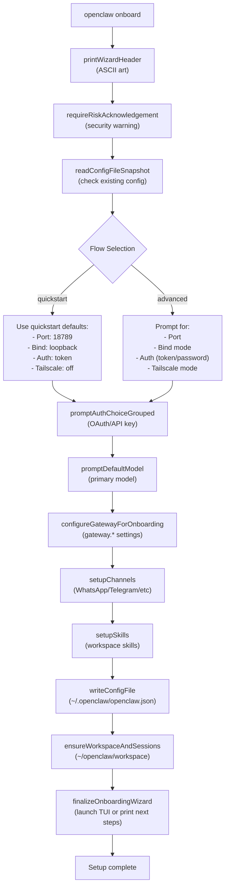
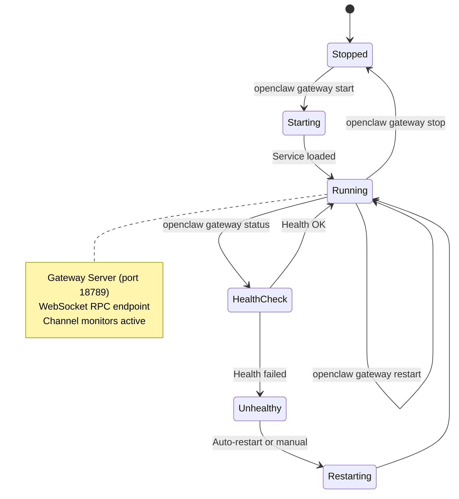
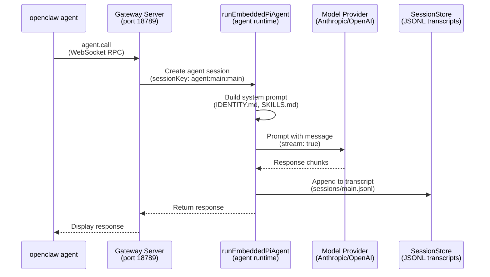
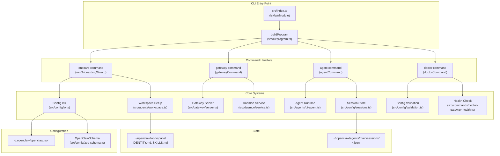

# ページ: クイックスタート

# クイックスタート

<details>
<summary>Relevant source files</summary>

The following files were used as context for generating this wiki page:

- [README.md](README.md)
- [assets/avatar-placeholder.svg](assets/avatar-placeholder.svg)
- [docs/channels/zalo.md](docs/channels/zalo.md)
- [docs/channels/zalouser.md](docs/channels/zalouser.md)
- [docs/gateway/doctor.md](docs/gateway/doctor.md)
- [scripts/clawtributors-map.json](scripts/clawtributors-map.json)
- [scripts/update-clawtributors.ts](scripts/update-clawtributors.ts)
- [scripts/update-clawtributors.types.ts](scripts/update-clawtributors.types.ts)
- [src/agents/bash-tools.test.ts](src/agents/bash-tools.test.ts)
- [src/agents/pi-tools-agent-config.test.ts](src/agents/pi-tools-agent-config.test.ts)
- [src/agents/sandbox-skills.test.ts](src/agents/sandbox-skills.test.ts)
- [src/commands/configure.gateway.test.ts](src/commands/configure.gateway.test.ts)
- [src/commands/configure.gateway.ts](src/commands/configure.gateway.ts)
- [src/commands/configure.ts](src/commands/configure.ts)
- [src/commands/doctor.ts](src/commands/doctor.ts)
- [src/commands/onboard-helpers.test.ts](src/commands/onboard-helpers.test.ts)
- [src/commands/onboard-helpers.ts](src/commands/onboard-helpers.ts)
- [src/commands/onboard-interactive.ts](src/commands/onboard-interactive.ts)
- [src/config/config.ts](src/config/config.ts)
- [src/config/merge-config.ts](src/config/merge-config.ts)
- [src/index.test.ts](src/index.test.ts)
- [src/index.ts](src/index.ts)
- [src/wizard/onboarding.gateway-config.test.ts](src/wizard/onboarding.gateway-config.test.ts)
- [src/wizard/onboarding.gateway-config.ts](src/wizard/onboarding.gateway-config.ts)
- [src/wizard/onboarding.ts](src/wizard/onboarding.ts)
- [src/wizard/onboarding.types.ts](src/wizard/onboarding.types.ts)
- [tsconfig.json](tsconfig.json)
- [ui/src/styles.css](ui/src/styles.css)
- [ui/src/styles/layout.mobile.css](ui/src/styles/layout.mobile.css)

</details>


このページでは、OpenClaw をインストールし、オンボーディングウィザードを実行して、最初のメッセージを送信するまでの最短手順を説明します。詳細なインストールオプションについては[インストール](#2)を、包括的な設定については[設定システム](#4)を参照してください。

---

## 前提条件

OpenClaw には **Node.js 22 以上** が必要です。バージョンを確認してください:

```bash
node --version
```

対応プラットフォーム: **macOS**、**Linux**、**Windows（WSL2 経由）**。Windows ネイティブのサポートは限定的であり、WSL2 の使用を強く推奨します。

**出典:** [README.md:47-48](), [src/infra/runtime-guard.ts]()

---

## インストール

npm または pnpm で OpenClaw をグローバルインストールします:

```bash
npm install -g openclaw@latest
# or
pnpm add -g openclaw@latest
```

インストールの確認:

```bash
openclaw --version
```

**出典:** [README.md:49-54](), [src/index.ts:1-93]()

---

## オンボーディングウィザード

オンボーディングウィザードは、認証、モデル選択、ゲートウェイ設定、チャネル設定といった初期セットアップをガイドします。

### ウィザードの実行

```bash
openclaw onboard --install-daemon
```

`--install-daemon` フラグを指定すると、ゲートウェイがシステムサービスとしてインストールされます（macOS では launchd、Linux では systemd、Windows では schtasks）。

**出典:** [README.md:53-56](), [src/wizard/onboarding.ts:90-483]()

### ウィザードの流れ



**ウィザードモード:**

| モード       | 説明                                                 |
|--------------|------------------------------------------------------|
| `quickstart` | 最小限のプロンプトで、適切なデフォルト値を使用       |
| `advanced`   | ゲートウェイ、チャネル、スキルを完全に制御           |

モードを明示的に指定する場合:

```bash
openclaw onboard --flow quickstart
openclaw onboard --flow advanced
```

**出典:** [src/wizard/onboarding.ts:90-483](), [src/wizard/onboarding.types.ts:1-26](), [src/wizard/onboarding.gateway-config.ts:42-286]()

### 設定の出力

ウィザードは設定内容を `~/.openclaw/openclaw.json` に書き出します。最小構成の例:

```json5
{
  "agents": {
    "defaults": {
      "workspace": "~/openclaw/workspace",
      "model": "anthropic/claude-opus-4-6"
    }
  },
  "gateway": {
    "mode": "local",
    "port": 18789,
    "bind": "loopback",
    "auth": {
      "mode": "token",
      "token": "<generated-token>"
    }
  }
}
```

**出典:** [src/wizard/onboarding.ts:355-368](), [src/config/config.ts:1-15](), [README.md:315-324]()

---

## ゲートウェイの起動

オンボーディング完了後、ゲートウェイはシステムサービスとしてインストールされています。起動するには:

```bash
openclaw gateway start
```

ステータスの確認:

```bash
openclaw gateway status
```

期待される出力:

```
Gateway: running (PID 12345)
Port: 18789
Bind: loopback (127.0.0.1)
Auth: token
```

手動起動（フォアグラウンド、詳細ログ出力）:

```bash
openclaw gateway run --verbose
```

**出典:** [README.md:67](), [src/daemon/service.ts](), [src/cli/program.ts]()

### ゲートウェイのライフサイクル



**出典:** [src/daemon/service.ts](), [src/gateway/server.ts](), [src/commands/gateway-start.ts]()

---

## 最初のメッセージ

CLI 経由でエージェントにメッセージを送信します:

```bash
openclaw agent --message "Hello, what can you do?"
```

または `message send` コマンドを使用してチャネル経由で配信します:

```bash
openclaw message send --to +15555550123 --message "Ship checklist"
```

### メッセージの流れ



**主要コンポーネント:**

- **`openclaw agent`**: エージェントと直接対話するための CLI コマンド ([src/cli/program.ts]())
- **ゲートウェイサーバー**: `ws://127.0.0.1:18789` の WebSocket RPC エンドポイント ([src/gateway/server.ts]())
- **`runEmbeddedPiAgent`**: コアとなるエージェント実行パイプライン ([src/agents/pi-agent.ts]())
- **SessionStore**: 会話履歴を `~/.openclaw/agents/main/sessions/main.jsonl` に永続化 ([src/config/sessions.ts]())

**出典:** [README.md:69-74](), [src/agents/pi-agent.ts](), [src/gateway/server.ts](), [src/config/sessions.ts]()

---

## 基本コマンド

OpenClaw には、チャット内コマンド（メッセージングチャネルから送信）と CLI コマンド（ターミナルで実行）があります。

### チャット内コマンド

WhatsApp、Telegram、またはその他の接続済みチャネルで以下を送信します:

| コマンド    | 説明                                      |
|-------------|-------------------------------------------|
| `/status`   | セッションのモデル、トークン数、コストを表示 |
| `/help`     | 利用可能なコマンドの一覧を表示            |
| `/new`      | セッションをリセット（履歴をクリア）      |
| `/compact`  | セッションを圧縮（履歴を要約）            |
| `/verbose`  | 詳細モードの切り替え                      |

例:

```
/status
```

レスポンス:

```
Model: anthropic/claude-opus-4-6
Tokens: 1,234 / 200,000
Cost: $0.05
```

**出典:** [README.md:265-277](), [src/commands/message-commands.ts]()

### CLI コマンド

ターミナルで以下を実行します:

| コマンド                         | 説明                                 |
|----------------------------------|--------------------------------------|
| `openclaw gateway status`        | ゲートウェイの状態を確認             |
| `openclaw agent --message "..."`  | エージェントにメッセージを送信       |
| `openclaw channels status`       | アクティブなチャネルの一覧を表示     |
| `openclaw sessions list`         | アクティブなセッションの一覧を表示   |
| `openclaw logs --follow`         | ゲートウェイのログをリアルタイム表示 |
| `openclaw doctor`                | ヘルスチェックと修復を実行           |

例:

```bash
openclaw channels status
```

**出典:** [src/cli/program.ts](), [README.md:265-277]()

---

## コマンド実行マップ



**出典:** [src/index.ts:1-93](), [src/cli/program.ts](), [src/wizard/onboarding.ts:90-483](), [src/commands/gateway-start.ts](), [src/commands/doctor.ts:65-313]()

---

## 次のステップ

ゲートウェイが設定された状態で OpenClaw が稼働しています。次に以下のトピックを確認してください:

- **[主要コンセプト](#1.1)**: エージェント、セッション、チャネル、ツールの理解
- **[ゲートウェイ設定](#3.1)**: ポート、バインドモード、認証のカスタマイズ
- **[チャネル設定](#8)**: WhatsApp、Telegram、Discord、その他のチャネルへの接続
- **[ツールシステム](#6)**: ファイル操作、シェル実行、メモリ検索の有効化
- **[マルチエージェント設定](#4.3)**: チャネルを分離されたエージェントワークスペースにルーティング

トラブルシューティングには以下を実行してください:

```bash
openclaw doctor
```

これにより、設定の健全性チェック、レガシー設定の移行、修復の提案が行われます。

**出典:** [README.md:410-427](), [docs/gateway/doctor.md:1-283]()

---
