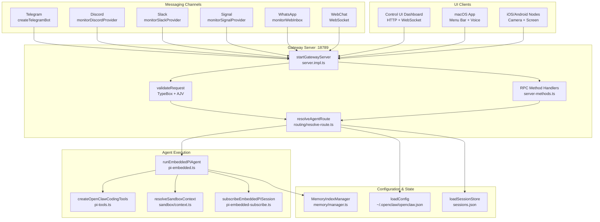
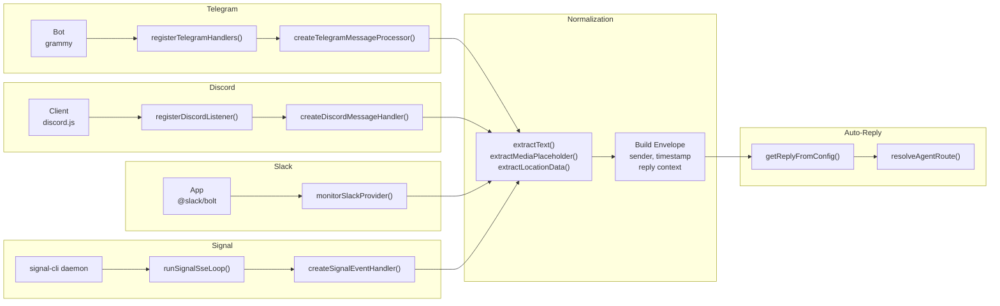
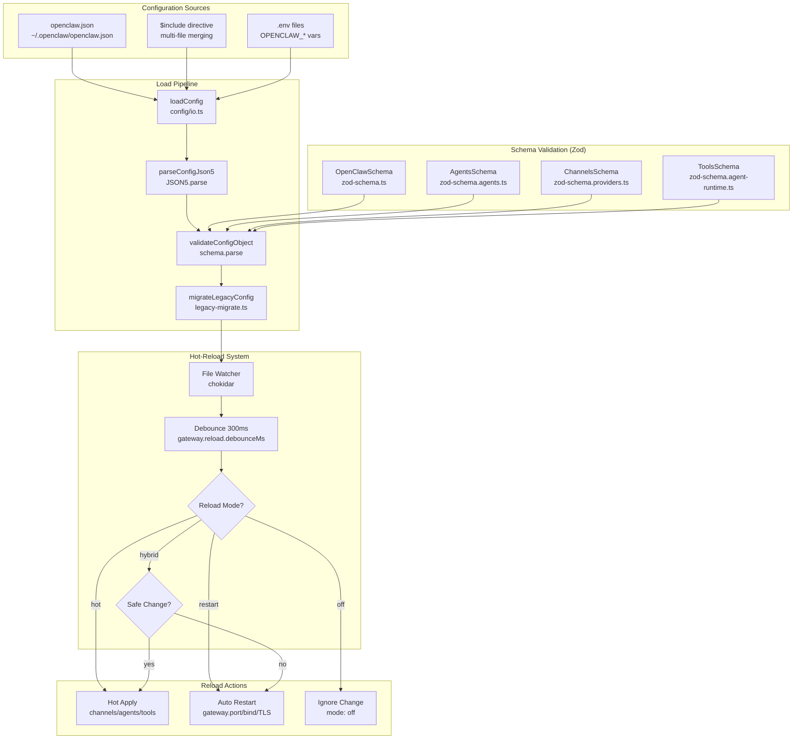
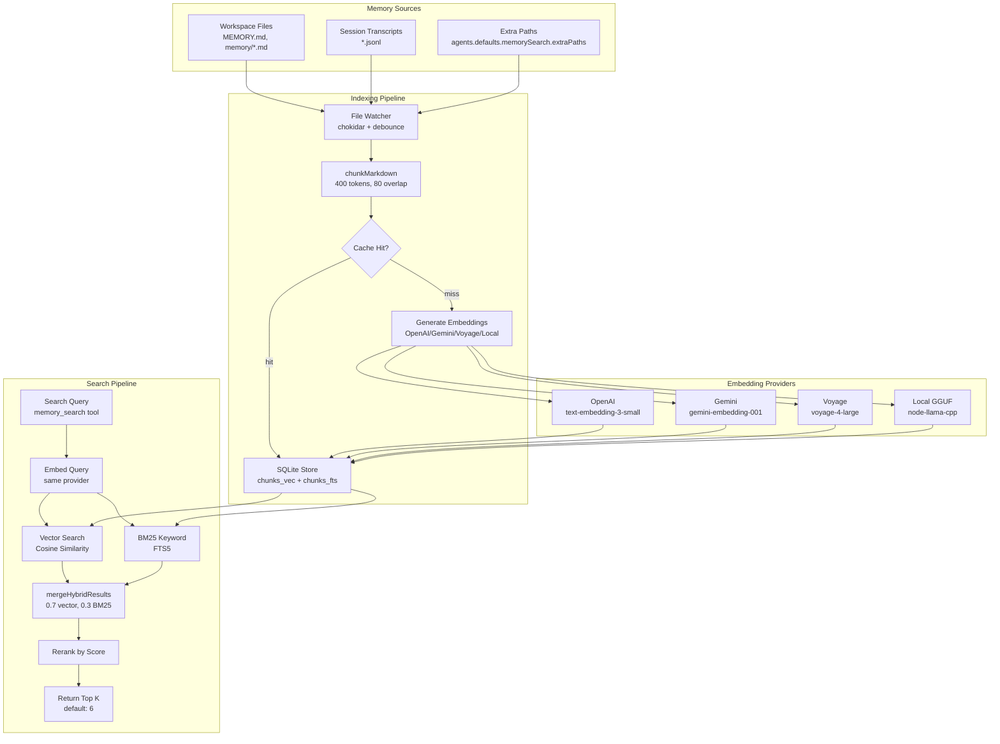
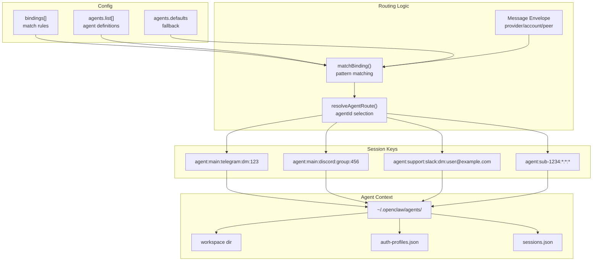

# ページ: アーキテクチャ図

# アーキテクチャ図

<details>
<summary>Relevant source files</summary>

The following files were used as context for generating this wiki page:

- [CHANGELOG.md](CHANGELOG.md)
- [README.md](README.md)
- [assets/avatar-placeholder.svg](assets/avatar-placeholder.svg)
- [docs/channels/zalo.md](docs/channels/zalo.md)
- [docs/channels/zalouser.md](docs/channels/zalouser.md)
- [docs/cli/memory.md](docs/cli/memory.md)
- [docs/cli/sandbox.md](docs/cli/sandbox.md)
- [docs/concepts/memory.md](docs/concepts/memory.md)
- [docs/gateway/configuration.md](docs/gateway/configuration.md)
- [docs/gateway/sandbox-vs-tool-policy-vs-elevated.md](docs/gateway/sandbox-vs-tool-policy-vs-elevated.md)
- [docs/gateway/sandboxing.md](docs/gateway/sandboxing.md)
- [docs/platforms/mac/skills.md](docs/platforms/mac/skills.md)
- [docs/tools/elevated.md](docs/tools/elevated.md)
- [docs/tools/index.md](docs/tools/index.md)
- [docs/tools/skills-config.md](docs/tools/skills-config.md)
- [scripts/clawtributors-map.json](scripts/clawtributors-map.json)
- [scripts/update-clawtributors.ts](scripts/update-clawtributors.ts)
- [scripts/update-clawtributors.types.ts](scripts/update-clawtributors.types.ts)
- [src/agents/memory-search.test.ts](src/agents/memory-search.test.ts)
- [src/agents/memory-search.ts](src/agents/memory-search.ts)
- [src/agents/sandbox-explain.test.ts](src/agents/sandbox-explain.test.ts)
- [src/agents/sandbox.ts](src/agents/sandbox.ts)
- [src/cli/memory-cli.test.ts](src/cli/memory-cli.test.ts)
- [src/cli/memory-cli.ts](src/cli/memory-cli.ts)
- [src/cli/models-cli.test.ts](src/cli/models-cli.test.ts)
- [src/commands/agent.test.ts](src/commands/agent.test.ts)
- [src/commands/agent.ts](src/commands/agent.ts)
- [src/config/config.ts](src/config/config.ts)
- [src/config/schema.ts](src/config/schema.ts)
- [src/config/types.tools.ts](src/config/types.tools.ts)
- [src/config/types.ts](src/config/types.ts)
- [src/config/zod-schema.agent-runtime.ts](src/config/zod-schema.agent-runtime.ts)
- [src/config/zod-schema.ts](src/config/zod-schema.ts)
- [src/cron/isolated-agent.ts](src/cron/isolated-agent.ts)
- [src/cron/run-log.test.ts](src/cron/run-log.test.ts)
- [src/cron/run-log.ts](src/cron/run-log.ts)
- [src/cron/store.ts](src/cron/store.ts)
- [src/gateway/protocol/index.ts](src/gateway/protocol/index.ts)
- [src/gateway/protocol/schema.ts](src/gateway/protocol/schema.ts)
- [src/gateway/protocol/schema/agents-models-skills.ts](src/gateway/protocol/schema/agents-models-skills.ts)
- [src/gateway/protocol/schema/protocol-schemas.ts](src/gateway/protocol/schema/protocol-schemas.ts)
- [src/gateway/protocol/schema/types.ts](src/gateway/protocol/schema/types.ts)
- [src/gateway/server-methods-list.ts](src/gateway/server-methods-list.ts)
- [src/gateway/server-methods.ts](src/gateway/server-methods.ts)
- [src/gateway/server-methods/agents.ts](src/gateway/server-methods/agents.ts)
- [src/gateway/server.ts](src/gateway/server.ts)
- [src/index.test.ts](src/index.test.ts)
- [src/index.ts](src/index.ts)
- [src/memory/embeddings.test.ts](src/memory/embeddings.test.ts)
- [src/memory/embeddings.ts](src/memory/embeddings.ts)
- [src/memory/manager.ts](src/memory/manager.ts)
- [tsconfig.json](tsconfig.json)
- [ui/src/styles.css](ui/src/styles.css)
- [ui/src/styles/layout.mobile.css](ui/src/styles/layout.mobile.css)

</details>


OpenClawは、ゲートウェイ（[src/gateway/server.impl.ts]()）を中央コントロールプレーンとするハブ・アンド・スポーク型アーキテクチャを採用しています。このページでは、アーキテクチャの概念を具体的なコードエンティティ（関数名、クラス名、ファイルパス）に対応付けるシステム図を示し、ハイレベルな設計から実装へのナビゲーションを可能にします。

ゲートウェイは、統合されたWebSocket/HTTPプロトコル（[src/gateway/protocol/index.ts]()）を通じて、すべてのメッセージングチャネル、エージェント実行、設定管理、およびクライアント接続を調整します。設定はZodスキーマ（[src/config/zod-schema.ts]()）で検証され、エージェントはオプションのDockerサンドボックス（[src/agents/sandbox.ts]()）を備えた隔離されたセッション内で実行されます。

**ナビゲーション:**
- 設定: [Configuration](#4.1) を参照
- エージェントランタイム: [Agent Execution Flow](#5.1) を参照
- セキュリティモデル: [Security](#14) を参照
- メモリシステム: [Memory System](#7) を参照

---

## システムトポロジー: ハブ・アンド・スポーク型アーキテクチャ

**コントロールプレーンとしてのゲートウェイ**

ゲートウェイ（[src/gateway/server.impl.ts]()）は中央コントロールプレーンとして機能し、デフォルトでは `ws://127.0.0.1:18789` にバインドされます。すべてのメッセージングチャネル、UIクライアント（WebChat、macOSアプリ、Control UI）、およびデバイスノードは、この単一のWebSocket/HTTPサーバーを介して接続します。ゲートウェイは `TypeBox` スキーマ（[src/gateway/protocol/schema.ts]()）を通じてすべてのリクエストを検証し、メッセージをエージェントセッション（[src/routing/resolve-route.ts]()）にルーティングし、購読しているクライアントにイベントをブロードキャストします。



**出典:** [src/gateway/server.impl.ts:1-50](), [src/gateway/protocol/index.ts:1-200](), [src/gateway/server-methods.ts:1-50](), [src/routing/resolve-route.ts:1-100](), [src/agents/pi-embedded.ts:1-50](), [src/agents/pi-tools.ts:166-271](), [src/agents/sandbox/context.ts:1-50](), [src/config/config.ts:1-20](), [src/config/sessions.ts:1-50](), [src/memory/manager.ts:1-100]()

---

## チャネル統合: メッセージ正規化パイプライン

各チャネルはモニターパターンを実装しており、受信メッセージをゲートウェイへのルーティング前に共通のエンベロープ形式に正規化します。



**出典:** [src/telegram/bot.ts:112-150](), [src/telegram/bot-handlers.ts](), [src/telegram/bot-message.ts](), [src/discord/monitor.ts:22](), [src/discord/monitor/listeners.ts](), [src/discord/monitor/message-handler.ts](), [src/slack/monitor.ts:3](), [src/slack/monitor/provider.ts](), [src/signal/monitor.ts:58-70](), [src/signal/sse-reconnect.ts](), [src/signal/monitor/event-handler.ts](), [src/web/inbound.ts:2-3](), [src/web/inbound/extract.ts](), [src/auto-reply/reply.ts](), [src/routing/resolve-route.ts]()

---

## エージェント実行パイプラインとツールポリシー解決

**実行フェーズ: プロンプト組み立て → モデル呼び出し → ツール実行 → ストリーミング**

エージェントパイプライン（[src/agents/pi-embedded.ts]()）は、プロンプトの組み立て、モデルAPI呼び出し、ツール実行、およびレスポンスのストリーミングをオーケストレーションします。ツールポリシー解決は、カスケードフィルターチェーン（グローバル → プロバイダー → エージェント → グループ → サンドボックス）を適用し、各段階ではツールを制限することのみ可能で、拡張することはできません。サンドボックス化されたセッションはDocker内でツールを実行し、信頼されたセッションはホスト上で実行されます。

```mermaid
graph TB
    subgraph Inbound["Inbound Message"]
        Msg[Message Envelope<br/>channel/account/peer]
        Access[Access Control<br/>DM pairing/allowlist]
        Session[resolveAgentRoute<br/>agent:ID:channel:peer]
    end

    subgraph ContextAssembly["Context Assembly"]
        LoadAgent[resolveAgentConfig<br/>agent-scope.ts]
        BuildPrompt[createSystemPromptOverride<br/>system-prompt.ts]
        LoadHistory[loadSessionMessages<br/>limitHistoryTurns]
        LoadSkills[buildWorkspaceSkillSnapshot<br/>skills.ts]
    end

    subgraph ToolPolicy["Tool Policy Chain"]
        Global[tools.allow/deny<br/>tools.profile]
        Provider[tools.byProvider<br/>per-provider restrict]
        Agent[agents.list[].tools]
        Group[group.toolPolicy]
        SandboxPolicy[sandbox.tools<br/>deny wins]
        FinalTools[Final Tool Set]
    end

    subgraph Execution["Agent Execution"]
        Runner[runEmbeddedPiAgent<br/>pi-embedded.ts]
        Auth[resolveAuthProfile<br/>model-auth.ts]
        Model[Model API Call<br/>pi-ai SDK]
        ToolExec[Tool Execution<br/>exec/read/write]
    end

    subgraph Sandbox["Sandbox System"]
        CheckSandbox{Sandboxed?}
        DockerExec[Docker Container<br/>sandbox/docker.ts]
        HostExec[Host Execution<br/>full workspace]
    end

    subgraph Streaming["Response Streaming"]
        Subscribe[subscribeEmbeddedPiSession<br/>pi-embedded-subscribe.ts]
        Chunker[EmbeddedBlockChunker<br/>block-chunker.ts]
        Stream[Channel Send<br/>onBlockReply]
    end

    Msg --> Access
    Access --> Session
    Session --> LoadAgent
    LoadAgent --> BuildPrompt
    LoadAgent --> LoadHistory
    LoadAgent --> LoadSkills

    Global --> Provider
    Provider --> Agent
    Agent --> Group
    Group --> SandboxPolicy
    SandboxPolicy --> FinalTools

    BuildPrompt --> Runner
    LoadHistory --> Runner
    LoadSkills --> Runner
    FinalTools --> Runner

    Runner --> Auth
    Auth --> Model
    Model --> ToolExec

    ToolExec --> CheckSandbox
    CheckSandbox -->|yes| DockerExec
    CheckSandbox -->|no| HostExec
    DockerExec --> Model
    HostExec --> Model

    Runner --> Subscribe
    Subscribe --> Chunker
    Chunker --> Stream
```

**出典:** [src/agents/pi-embedded.ts:1-50](), [src/agents/pi-embedded-runner/run.ts:1-200](), [src/agents/pi-embedded-runner/system-prompt.ts:1-100](), [src/agents/skills.ts:1-50](), [src/agents/pi-tools.policy.ts:28-54](), [src/agents/tool-policy.ts:47-100](), [src/agents/sandbox/context.ts:1-50](), [src/agents/sandbox/docker.ts:1-100](), [src/agents/pi-embedded-subscribe.ts:30-100](), [src/agents/pi-embedded-block-chunker.ts:1-50]()

---

## ツールシステムとサンドボックス分離

**ツールポリシー解決: カスケード型Deny-Winsフィルター**

ツールシステム（[src/agents/pi-tools.ts:166-271]()）は、コアツール（`exec`、`read`、`write`、`edit`、`process`、`bash`、`memory_search` など）を提供し、denyが常に優先するカスケードポリシーフィルターを適用します。ポリシーの段階: グローバル（`tools.allow`/`tools.deny`）→ プロバイダー固有（`tools.byProvider`）→ エージェント固有（`agents.list[].tools`）→ グループポリシー → サンドボックスポリシー。各段階ではツールセットを制限することのみ可能で、拡張することはできません。

**サンドボックスモード:**
- `off`: すべてのツールをホスト上で実行
- `non-main`: メイン以外のセッション（グループ）をDockerで実行
- `all`: すべてのセッションをサンドボックス化

**サンドボックススコープ:**
- `session`: セッションごとに1つのコンテナ
- `agent`: エージェントごとに1つのコンテナ
- `shared`: 単一の共有コンテナ

```mermaid
graph TB
    subgraph ToolCreation["Tool Registry"]
        Create[createOpenClawCodingTools<br/>pi-tools.ts]
        Exec[createExecTool<br/>bash-tools.exec.ts]
        Process[createProcessTool<br/>bash-tools.process.ts]
        Read[createReadTool<br/>pi-tools.ts]
        Write[createWriteTool<br/>pi-tools.ts]
        Memory[memory_search<br/>memory-tools.ts]
    end

    subgraph PolicyLayers["Policy Layers (Deny Wins)"]
        Profile[tools.profile<br/>minimal/coding/messaging]
        Global[tools.allow/deny<br/>global config]
        Provider[tools.byProvider<br/>per-provider restrict]
        Agent[agents.list[].tools]
        Group[group.toolPolicy]
        SandboxPol[sandbox.tools]
    end

    subgraph Resolution["Policy Resolution"]
        Resolve[resolveEffectiveToolPolicy<br/>tool-policy.ts]
        Filter[filterToolsByPolicy<br/>pi-tools.policy.ts]
        Check[isToolAllowedByPolicies]
        Final[Final Tool Set]
    end

    subgraph SandboxSystem["Sandbox System"]
        Config[resolveSandboxConfigForAgent<br/>sandbox/config.ts]
        Context[resolveSandboxContext<br/>sandbox/context.ts]
        Docker[buildSandboxCreateArgs<br/>sandbox/docker.ts]
        Container[Docker Container<br/>per-session/agent/shared]
        Workspace[Workspace Access<br/>none/ro/rw]
    end

    Create --> Exec
    Create --> Process
    Create --> Read
    Create --> Write
    Create --> Memory

    Profile --> Resolve
    Global --> Resolve
    Provider --> Resolve
    Agent --> Resolve
    Group --> Resolve
    SandboxPol --> Resolve

    Resolve --> Filter
    Filter --> Check
    Check --> Final

    Config --> Context
    Context --> Docker
    Context --> Workspace
    Docker --> Container

    Final --> Exec
    Final --> Process
    Context --> Exec
    Context --> Process
```

**出典:** [src/agents/pi-tools.ts:166-271](), [src/agents/bash-tools.ts:6-9](), [src/agents/bash-tools.exec.ts:1-100](), [src/agents/bash-tools.process.ts:1-100](), [src/agents/pi-tools.policy.ts:28-54](), [src/agents/tool-policy.ts:47-100](), [src/agents/sandbox.ts:1-45](), [src/agents/sandbox/config.ts:1-100](), [src/agents/sandbox/context.ts:1-100](), [src/agents/sandbox/docker.ts:1-100](), [src/config/types.tools.ts:1-200](), [docs/gateway/sandboxing.md:1-60]()

---

## 設定ライフサイクルとホットリロード

**厳密な検証 + ホットリロード**

OpenClawは、Zodスキーマ（[src/config/zod-schema.ts]()）による厳密な設定検証を行います。無効な設定はゲートウェイの起動を防止します。ゲートウェイは `~/.openclaw/openclaw.json` を監視し、3つのリロードモード（`hybrid`（デフォルト）、`hot`、`restart`）を通じて変更を自動的に適用します。安全な変更（チャネル、エージェント、ツール）は再起動なしでホットアプライされ、インフラストラクチャの変更（ポート、バインド、TLS）は `hybrid` モードで自動再起動をトリガーします。



**出典:** [src/config/config.ts:1-15](), [src/config/io.ts:1-100](), [src/config/zod-schema.ts:95-632](), [src/config/validation.ts:1-50](), [src/config/legacy-migrate.ts:1-50](), [src/gateway/reload.ts:1-100](), [docs/gateway/configuration.md:327-366]()

---

## セキュリティモデル: DMペアリング、サンドボックス、および認証情報の分離

**多層防御**

OpenClawは多層セキュリティを実装しています: DMペアリング（[src/pairing/pairing-store.ts]()）、オプションのDockerサンドボックス（[src/agents/sandbox.ts]()）、ツールポリシーの強制（[src/agents/tool-policy.ts]()）、exec承認（[src/config/types.approvals.ts]()）、およびエージェントごとの認証情報分離（[src/agents/auth-profiles.ts]()）。メインセッション（1:1 DM）はデフォルトでホスト上で実行され、グループセッションは `sandbox.mode: "non-main"` によりサンドボックス化できます。

**DMペアリングフロー:**
1. 不明な送信者がボットにDMを送信
2. ゲートウェイが `upsertChannelPairingRequest()` を呼び出し（[src/pairing/pairing-request.ts]()）
3. ボットがペアリングコードを送信
4. 運用者が `openclaw pairing approve <channel> <code>` を実行
5. 送信者が `<channel>-allowFrom.json` に追加される（[src/pairing/pairing-store.ts]()）

```mermaid
graph TB
    subgraph ChannelAccess["Channel Access Control"]
        DM[dmPolicy<br/>pairing/allowlist/open]
        Pairing[upsertChannelPairingRequest<br/>pairing-request.ts]
        AllowFrom[readChannelAllowFromStore<br/>pairing-store.ts]
        Approve[openclaw pairing approve]
    end

    subgraph SessionTypes["Session Isolation"]
        Main[Main Session<br/>agent:main:channel:dm:peer]
        Group[Group Session<br/>agent:main:channel:group:id]
        Subagent[Subagent Session<br/>agent:sub-*:*:*:*]
    end

    subgraph SandboxModes["Sandbox Modes"]
        Mode[sandbox.mode<br/>off/non-main/all]
        Scope[sandbox.scope<br/>session/agent/shared]
        Container[Docker Container<br/>isolated execution]
        WorkspaceAccess[workspace access<br/>none/ro/rw]
    end

    subgraph ToolSecurity["Tool Security"]
        Policy[Tool Policy Chain<br/>tool-policy.ts]
        Elevated[Elevated Mode<br/>/elevated on|full]
        Approval[Exec Approval<br/>approvals.exec]
    end

    subgraph CredentialIsolation["Credential Isolation"]
        AgentDir[~/.openclaw/agents/<agentId>]
        AuthProfiles[auth-profiles.json<br/>OAuth/API keys]
        Rotation[Profile Rotation<br/>cooldown tracking]
    end

    DM --> Pairing
    Pairing --> Approve
    Approve --> AllowFrom
    AllowFrom --> Main
    AllowFrom --> Group

    Main --> Mode
    Group --> Mode
    Subagent --> Mode

    Mode --> Scope
    Scope --> Container
    Container --> WorkspaceAccess

    Policy --> Elevated
    Elevated --> Approval

    Main --> AgentDir
    Group --> AgentDir
    AgentDir --> AuthProfiles
    AuthProfiles --> Rotation
```

**出典:** [src/pairing/pairing-store.ts:1-100](), [src/pairing/pairing-request.ts:1-50](), [src/config/types.channels.ts:1-100](), [src/agents/sandbox.ts:1-45](), [src/agents/sandbox/config.ts:1-100](), [src/agents/tool-policy.ts:1-100](), [src/config/types.approvals.ts:1-50](), [src/agents/auth-profiles.ts:1-100](), [docs/gateway/sandboxing.md:1-60](), [docs/gateway/sandbox-vs-tool-policy-vs-elevated.md:1-50]()

---

## メモリシステム: ハイブリッドベクトル + BM25検索

**ハイブリッド検索を備えたSQLiteベースのインデックス**

メモリシステム（[src/memory/manager.ts]()）は、ワークスペースのMarkdownファイル（`MEMORY.md`、`memory/*.md`）およびオプションのセッショントランスクリプトに対して、SQLiteインデックス（[src/memory/memory-schema.ts]()）を管理します。エンベディングはOpenAI、Gemini、Voyage、またはローカルモデル（[src/memory/embeddings.ts]()）を通じて生成されます。検索はベクトル類似度（コサイン）とBM25キーワードマッチング（[src/memory/hybrid.ts]()）を組み合わせ、デフォルトでは70/30の重み付けが行われます。

**インデキシングパイプライン:**
1. ファイルウォッチャーが変更を検出（[src/memory/manager.ts:ensureWatcher]()）
2. ファイルを約400トークンのセグメントに分割（80トークンのオーバーラップあり）（[src/memory/internal.ts:chunkMarkdown]()）
3. エンベディングをコンテンツハッシュでキャッシュ（[src/memory/manager.ts:EMBEDDING_CACHE_TABLE]()）
4. `chunks_vec`（ベクトル）および `chunks_fts`（全文検索）テーブルに格納

**検索パイプライン:**
1. クエリをエンベディング（[src/memory/manager.ts:embedQueryWithTimeout]()）
2. コサイン距離によるベクトル検索（[src/memory/manager-search.ts:searchVector]()）
3. BM25キーワード検索（[src/memory/manager-search.ts:searchKeyword]()）
4. 結果をマージしてリランキング（[src/memory/hybrid.ts:mergeHybridResults]()）



**出典:** [src/memory/manager.ts:1-1000](), [src/memory/memory-schema.ts:1-100](), [src/memory/embeddings.ts:1-200](), [src/memory/embeddings-openai.ts:1-100](), [src/memory/embeddings-gemini.ts:1-100](), [src/memory/embeddings-voyage.ts:1-100](), [src/memory/internal.ts:200-300](), [src/memory/manager-search.ts:1-100](), [src/memory/hybrid.ts:1-100](), [docs/concepts/memory.md:79-230]()

---

## マルチエージェントルーティング: バインディングとセッション解決

OpenClawは、`bindings` 設定を通じて、チャネル/アカウント/ピアベースのルーティングルールにより複数のエージェントをサポートします。



**出典:** [src/routing/resolve-route.ts](), [src/routing/session-key.ts](), [src/config/types.agents.ts](), [src/config/sessions.ts](), [docs/gateway/configuration.md:425-480](), [docs/multi-agent-sandbox-tools.md:1-40]()

---
