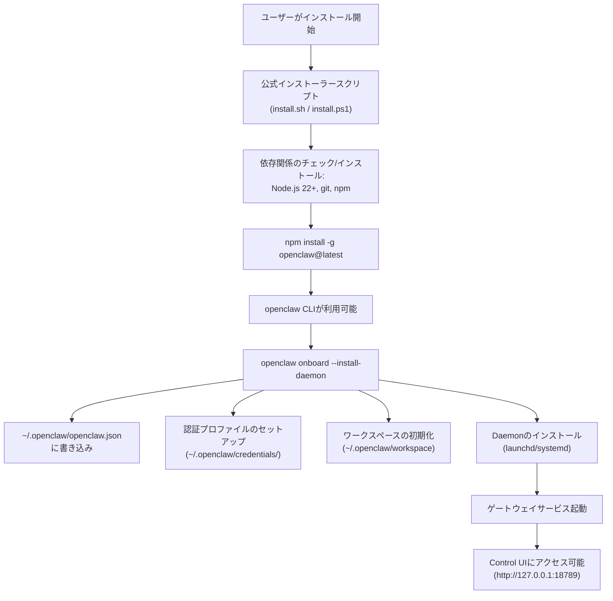
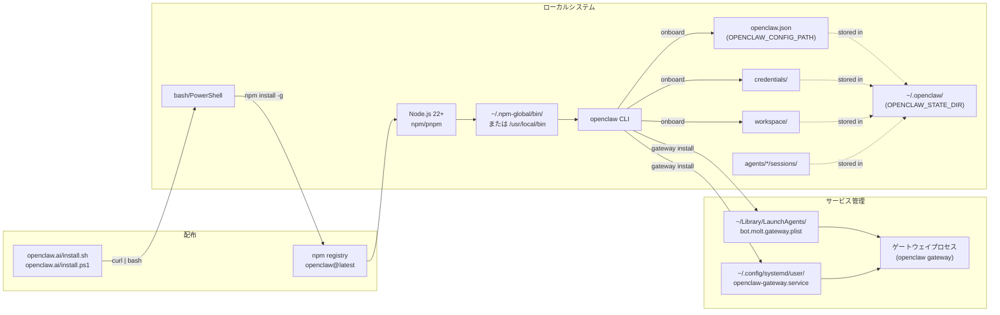
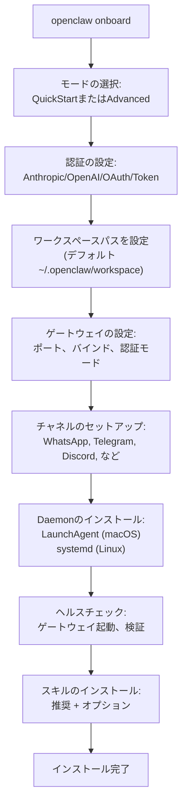

# インストール概要

# インストール概要

<details>
<summary>関連ソースファイル</summary>

このWikiページの作成に使用されたファイル：

- [README.md](README.md)
- [assets/avatar-placeholder.svg](assets/avatar-placeholder.svg)
- [docs/channels/zalo.md](docs/channels/zalo.md)
- [docs/channels/zalouser.md](docs/channels/zalouser.md)
- [docs/gateway/doctor.md](docs/gateway/doctor.md)
- [scripts/clawtributors-map.json](scripts/clawtributors-map.json)
- [scripts/update-clawtributors.ts](scripts/update-clawtributors.ts)
- [scripts/update-clawtributors.types.ts](scripts/update-clawtributors.types.ts)
- [src/agents/bash-tools.test.ts](src/agents/bash-tools.test.ts)
- [src/agents/pi-tools-agent-config.test.ts](src/agents/pi-tools-agent-config.test.ts)
- [src/agents/sandbox-skills.test.ts](src/agents/sandbox-skills.test.ts)
- [src/commands/configure.gateway.test.ts](src/commands/configure.gateway.test.ts)
- [src/commands/configure.gateway.ts](src/commands/configure.gateway.ts)
- [src/commands/configure.ts](src/commands/configure.ts)
- [src/commands/doctor.ts](src/commands/doctor.ts)
- [src/commands/onboard-helpers.test.ts](src/commands/onboard-helpers.test.ts)
- [src/commands/onboard-helpers.ts](src/commands/onboard-helpers.ts)
- [src/commands/onboard-interactive.ts](src/commands/onboard-interactive.ts)
- [src/config/config.ts](src/config/config.ts)
- [src/config/merge-config.ts](src/config/merge-config.ts)
- [src/index.test.ts](src/index.test.ts)
- [src/index.ts](src/index.ts)
- [src/wizard/onboarding.gateway-config.test.ts](src/wizard/onboarding.gateway-config.test.ts)
- [src/wizard/onboarding.gateway-config.ts](src/wizard/onboarding.gateway-config.ts)
- [src/wizard/onboarding.ts](src/wizard/onboarding.ts)
- [src/wizard/onboarding.types.ts](src/wizard/onboarding.types.ts)
- [tsconfig.json](tsconfig.json)
- [ui/src/styles.css](ui/src/styles.css)
- [ui/src/styles/layout.mobile.css](ui/src/styles/layout.mobile.css)

</details>


このドキュメントでは、異なるプラットフォームにおけるOpenClawのインストール方法、システム要件、初期設定フローについて説明します。インストール後の詳細な設定については[設定システム](#4)を参照してください。プラットフォーム固有の詳細については[システム要件](#2.1)と[インストール方法](#2.2)を参照してください。

## 目的と範囲

このページでは利用可能なインストールアプローチと全体のインストールアーキテクチャを紹介します。各メソッドの詳細な手順、システム要件、オンボーディングウィザードについては以下のサブページでカバーされています：

- [システム要件](#2.1) - Node.jsのバージョン、OSサポート、ハードウェア要件
- [インストール方法](#2.2) - 公式インストーラー、npm/pnpm、Docker、ソースビルド
- [オンボーディングウィザード](#2.3) - 認証、ワークスペース、ゲートウェイ、チャネルの対話型セットアップ
- [macOSアプリインストール](#2.4) - ネイティブアプリバンドルと権限設定

## インストール概要

OpenClawのインストールは以下のシーケンスに従います：

1. **前提条件** - Node.js 22以上、パッケージマネージャー
2. **インストール** - 公式インストーラースクリプトまたはnpmグローバルインストール
3. **オンボーディング** - 認証、ゲートウェイ、ワークスペースを設定する対話型ウィザード
4. **サービス設定** - Daemonをインストール（オプション）、LaunchAgent（macOS）またはsystemd（Linux）経由
5. **検証** - ゲートウェイ起動、Control UIへのアクセス

公式インストーラーは、必要に応じて依存関係（Node.js、git）のインストールを行い、npmグローバルインストールをデフォルトで行います。

### インストールフロー



**Sources:** docs/start/getting-started.md:29-72, docs/start/wizard.md:61-71, scripts/docker/install-sh-smoke/run.sh:3-52

### インストーラーアーキテクチャ



**Sources:** docs/start/getting-started.md:31-44, docs/gateway/index.md:200-243, scripts/docker/install-sh-smoke/run.sh:1-52, AGENTS.md:13-13

## インストール方法の概要

| メソッド | ユースケース | コマンド |
|--------|----------|---------|
| **公式インストーラー** | ほとんどのユーザーに推奨 | `curl -fsSL https://openclaw.ai/install.sh \| bash` (macOS/Linux)<br/>`iwr -useb https://openclaw.ai/install.ps1 \| iex` (Windows) |
| **npmグローバル** | 手動インストールまたはCI/CD | `npm install -g openclaw@latest` |
| **pnpmグローバル** | 代替パッケージマネージャー | `pnpm add -g openclaw@latest` |
| **Docker** | コンテナ化デプロイメント | [Docker](#2.2)を参照 |
| **macOSアプリ** | バンドルされたゲートウェイを含むネイティブUI | リリースからダウンロード、[macOSアプリ](#2.4)を参照 |
| **ソースビルド** | 開発またはカスタムビルド | `git clone && pnpm install && pnpm build` |

公式インストーラーは、サポートされているプラットフォームで依存関係のインストール（Node.js、git）を自動的に処理します。手動のnpm/pnpmインストールには、事前のNode.js 22+のインストールが必要です。

**Sources:** docs/index.md:31-44, docs/start/getting-started.md:31-44, AGENTS.md:13-13

## クイックスタートの例

### macOS / Linux

```bash
# 公式インストーラーでインストール
curl -fsSL https://openclaw.ai/install.sh | bash

# オンボーディングウィザードを実行
openclaw onboard --install-daemon

# ゲートウェイステータスを確認
openclaw gateway status

# Control UIを開く
openclaw dashboard
```

### Windows (PowerShell)

```powershell
# 公式インストーラーでインストール
iwr -useb https://openclaw.ai/install.ps1 | iex

# オンボーディングウィザードを実行
openclaw onboard --install-daemon

# ゲートウェイステータスを確認
openclaw gateway status
```

### 手動npmインストール

```bash
# Node.js 22+が既にインストールされている必要あり
npm install -g openclaw@latest

# インストールを確認
openclaw --version

# オンボーディングを実行
openclaw onboard
```

**Sources:** docs/index.md:100-115, docs/start/getting-started.md:31-72

## インストール後のディレクトリ構造

```
~/.openclaw/                          # 状態ディレクトリ (OPENCLAW_STATE_DIR)
├── openclaw.json                     # メイン設定ファイル (OPENCLAW_CONFIG_PATH)
├── credentials/                      # 認証プロファイル（暗号化済み）
│   └── profiles.json                 # 認証プロファイルストア
├── workspace/                        # デフォルトエージェントワークスペース
│   ├── AGENTS.md                     # エージェントID
│   ├── IDENTITY.md                   # ユーザーID
│   ├── USER.md                       # ユーザーコンテキスト
│   ├── SOUL.md                       # エージェントパーソナリティ
│   ├── TOOLS.md                      # ツールドキュメント
│   ├── MEMORY.md                     # メモリーインデックス
│   └── memory/                       # メモリードキュメント
├── agents/                           # エージェントごとの状態
│   └── main/                         # メインエージェント
│       └── sessions/                 # セッショントランスクリプト (*.jsonl)
└── logs/                             # ログファイル（ファイルロギングが有効な場合）
```

macOSでは、LaunchAgent plistは`~/Library/LaunchAgents/bot.molt.gateway.plist`に書き込まれます。Linuxでは、systemdユニットは`~/.config/systemd/user/openclaw-gateway.service`に書き込まれます。

**Sources:** docs/start/wizard.md:66-67, docs/gateway/index.md:200-298, AGENTS.md:122-122

## オンボーディングフロー

インストール後、オンボーディングウィザード（`openclaw onboard`）がシステムを設定します：



**QuickStartモード**は適切なデフォルトを使用します：
- ローカルゲートウェイ（loopbackバインド）
- ポート18789
- トークン認証（自動生成）
- Tailscaleオフ
- Telegram/WhatsAppの許可リストDMポリシー

**Advancedモード**はすべてのオプションをプロンプトで表示します。

**Sources:** docs/start/wizard.md:42-71, scripts/docker/install-sh-e2e/run.sh:340-378

## インストール後の検証

```bash
# CLIバージョンを確認
openclaw --version

# ゲートウェイステータスを確認
openclaw gateway status

# 設定を表示
openclaw status

# モデル認証を確認
openclaw models status

# Control UIを開く
openclaw dashboard
```

ゲートウェイがローカルで実行している場合、Control UIは`http://127.0.0.1:18789/`でアクセスできます。

**Sources:** docs/start/getting-started.md:59-72, docs/gateway/troubleshooting.md:18-29

## インストールテスト

CIパイプラインには包括的なインストーラーテストが含まれています：

```mermaid
graph TB
    subgraph "スモークテスト"
        SmokeBuild["Dockerイメージをビルド<br/>(node:22-bookworm-slim)"]
        SmokeRoot["ルートとして実行:<br/>install.sh -> npm -g"]
        SmokeVerify["openclaw --versionを検証"]
        SmokeNonroot["非ルートとして実行:<br/>~/.npm-global prefix"]
        SmokeCLI["CLIインストーラーテスト:<br/>install-cli.sh"]
    end

    subgraph "E2Eテスト"
        E2EBuild["Dockerイメージをビルド"]
        E2EPreinstall["以前のバージョンを事前インストール"]
        E2EInstall["インストーラー実行（アップグレードパス）"]
        E2EOnboard["openclaw onboard --non-interactive"]
        E2EModels["OpenAI/Anthropicを設定"]
        E2EAgent["エージェントターンの実行:<br/>execツール, writeツール"]
        E2EVerify["セッショントランスクリプトを検証"]
    end

    SmokeBuild --> SmokeRoot
    SmokeRoot --> SmokeVerify
    SmokeVerify --> SmokeNonroot
    SmokeNonroot --> SmokeCLI

    E2EBuild --> E2EPreinstall
    E2EPreinstall --> E2EInstall
    E2EInstall --> E2EOnboard
    E2EOnboard --> E2EModels
    E2EModels --> E2EAgent
    E2EAgent --> E2EVerify
```



スモークテストは基本的なインストール/アップグレードフローを検証します。E2Eテストは、実際のモデルプロバイダーを使用した完全なオンボーディングとエージェント実行を検証します。

**Sources:** .github/workflows/install-smoke.yml:1-42, scripts/test-install-sh-docker.sh:1-71, scripts/docker/install-sh-e2e/run.sh:1-100

## システム要件

OpenClawには以下が必要です：

- **Node.js**: 22以上（CIで[.github/workflows/ci.yml:32]()で検証）
- **パッケージマネージャー**: npm（Nodeにバンドル）またはpnpm 10.23.0+
- **オペレーティングシステム**: macOS, Linux, Windows（WSL2推奨）
- **ネットワーク**: モデルAPIとインストーラーダウンロードのためのインターネットアクセス
- **ストレージ**: インストールに約500MB、セッション/メモリに追加

詳細な要件とプラットフォーム固有の注意点については[システム要件](#2.1)を参照してください。

**Sources:** .github/workflows/ci.yml:29-40, docs/start/wizard.md:17-23, AGENTS.md:52-52

## 一般的なインストール問題のトラブルシューティング

| 問題 | 原因 | 修正方法 |
|-------|-------|-----|
| `openclaw: command not found` | CLIがPATHにない | npmグローバルbinをPATHに追加: `export PATH="$HOME/.npm-global/bin:$PATH"` (Linux) またはシェルを再起動 (macOS) |
| `npm ERR! code EACCES` | 権限拒否（グローバルインストール） | 公式インストーラーを使用（npmプレフィックスを自動設定）または `npm config set prefix ~/.npm-global` |
| `Node version mismatch` | Node < 22 | nvm、volta、またはシステムパッケージマネージャーでNode 22+をインストール |
| `Git not found` | Gitがない（インストールに必要） | 公式インストーラーはgitを自動インストール; 手動: `apt install git` / `brew install git` |
| ゲートウェイが起動しない | 設定無効またはポート競合 | `openclaw doctor`で設定を修復; `lsof -i :18789`でポートを確認 |

詳細なトラブルシューティングについては[ゲートウェイトラブルシューティング](#14.3)を参照してください。

**Sources:** docs/gateway/troubleshooting.md:1-665, scripts/docker/install-sh-nonroot/run.sh:8-51

## 関連ドキュメント

- [インストール方法](#2.2) - 各インストール方法の詳細な手順
- [オンボーディングウィザード](#2.3) - 対話型セットアップのウォークスルー
- [macOSアプリインストール](#2.4) - ネイティブmacOSアプリのセットアップ
- [設定システム](#4) - インストール後の設定リファレンス
- [ゲートウェイサービス管理](#12.1) - サービスライフサイクルコマンド
- [ゲートウェイトラブルシューティング](#14.3) - 一般的なランタイム問題

**Sources:** docs/docs.json:798-835

---