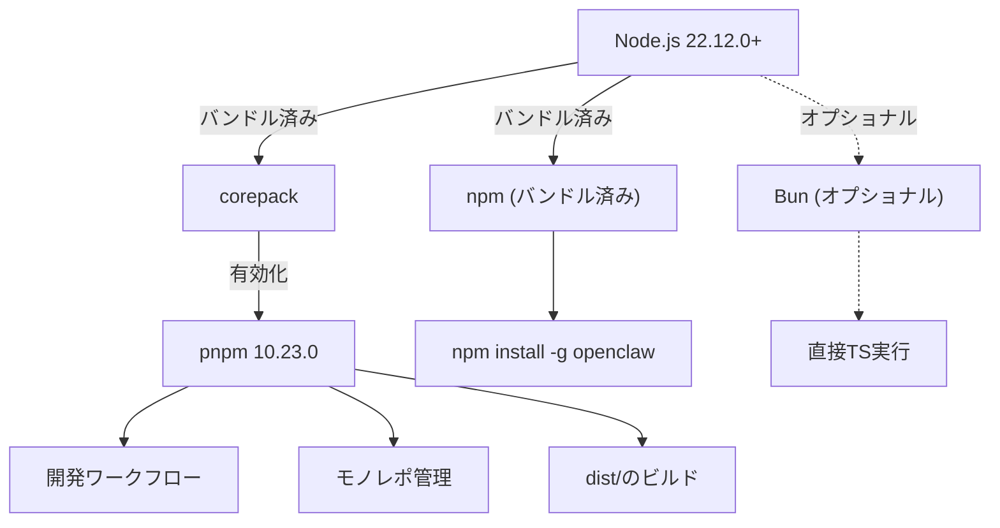
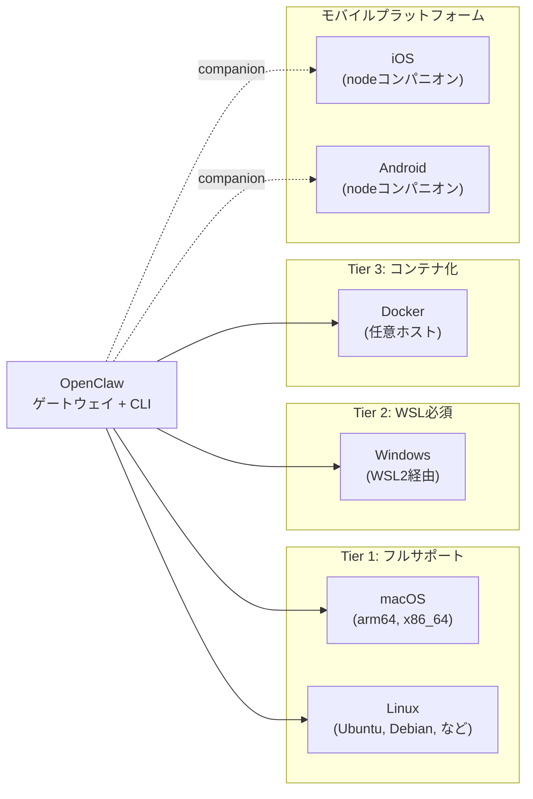
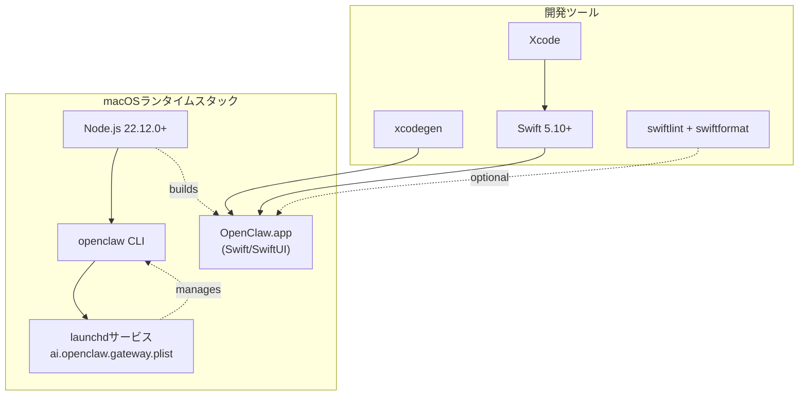
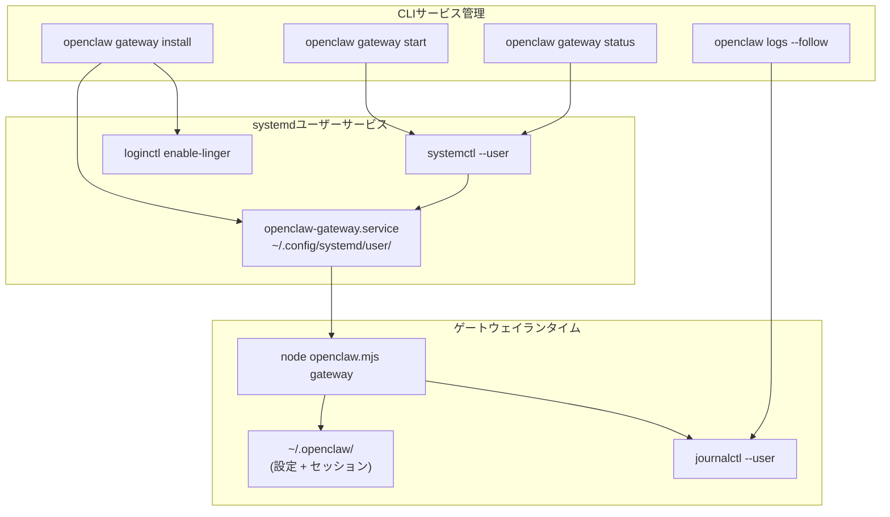
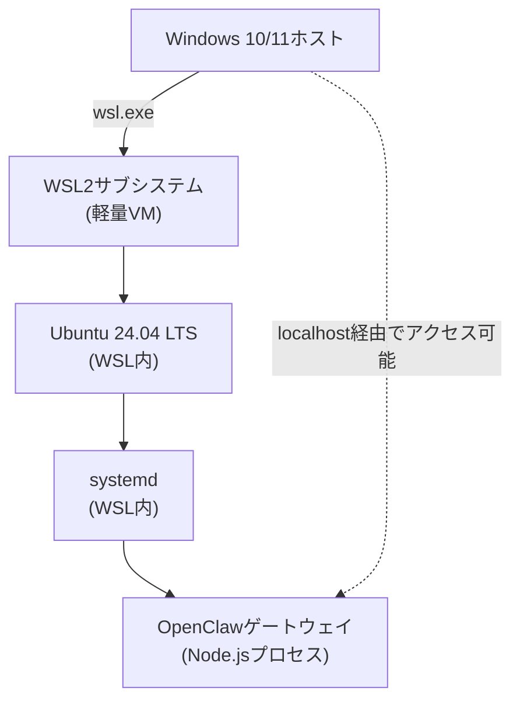
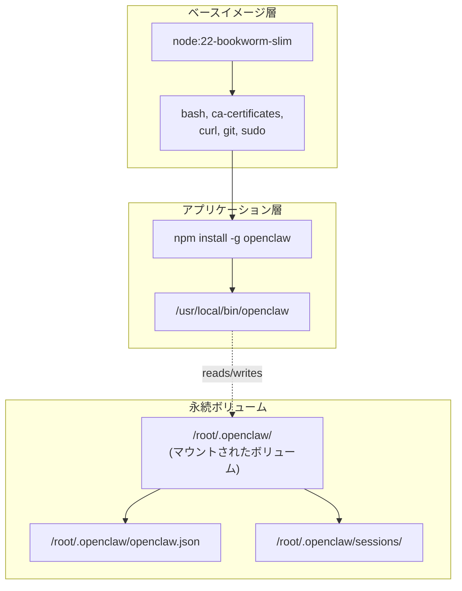
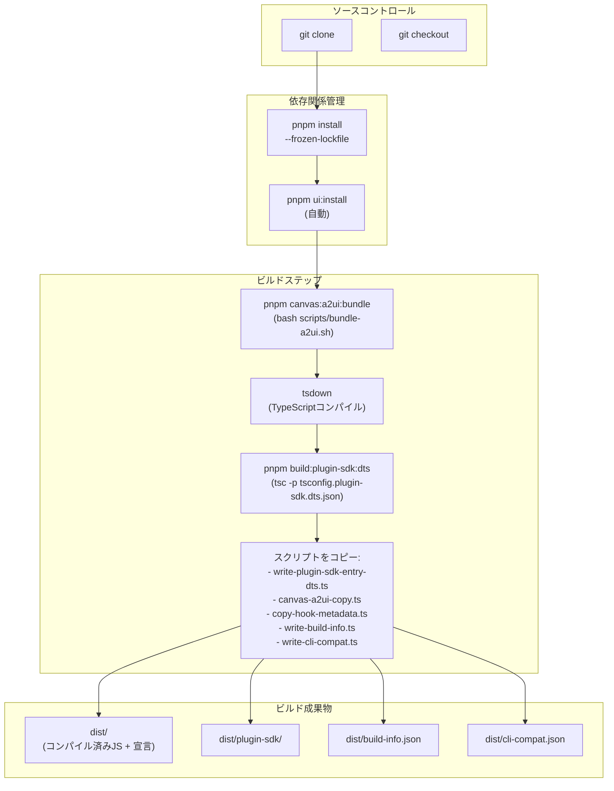
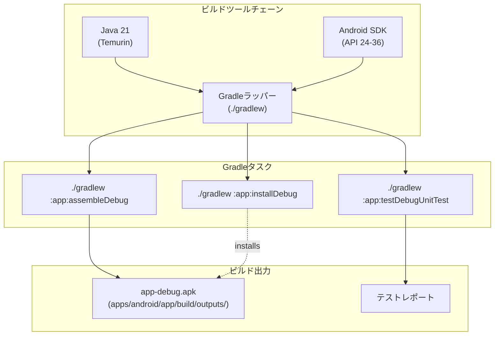
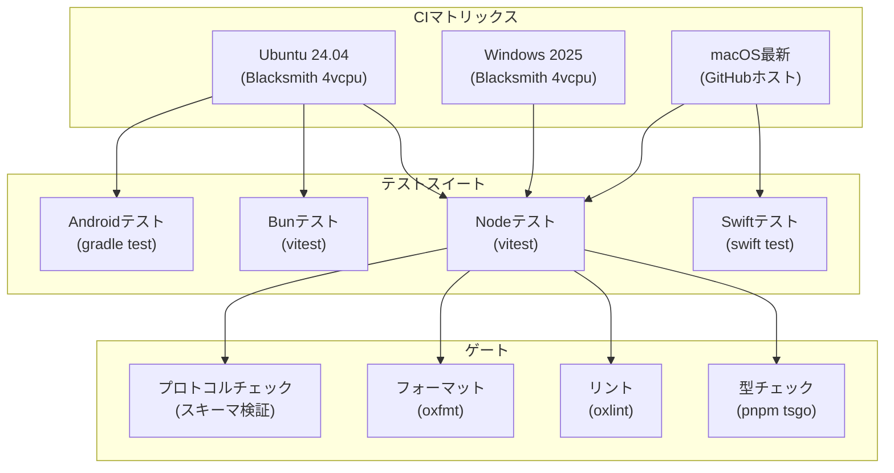
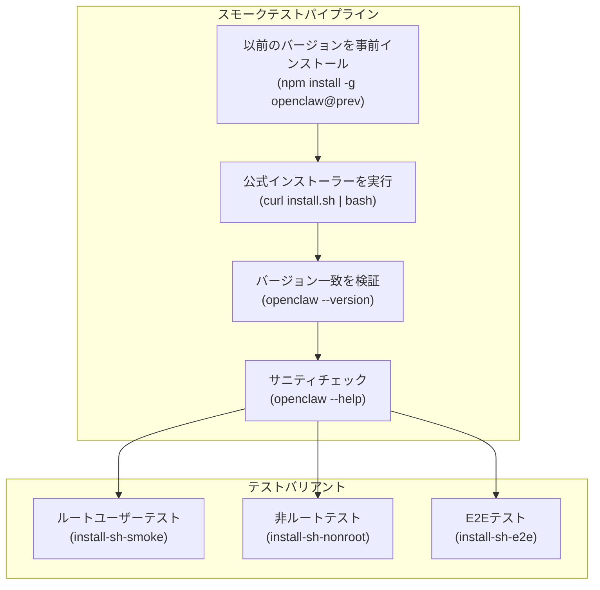

# システム要件

# システム要件

<details>
<summary>関連ソースファイル</summary>

このWikiページの作成に使用されたファイル：

- [README.md](README.md)
- [assets/avatar-placeholder.svg](assets/avatar-placeholder.svg)
- [docs/channels/zalo.md](docs/channels/zalo.md)
- [docs/channels/zalouser.md](docs/channels/zalouser.md)
- [extensions/copilot-proxy/package.json](extensions/copilot-proxy/package.json)
- [extensions/google-antigravity-auth/package.json](extensions/google-antigravity-auth/package.json)
- [extensions/google-gemini-cli-auth/package.json](extensions/google-gemini-cli-auth/package.json)
- [extensions/matrix/CHANGELOG.md](extensions/matrix/CHANGELOG.md)
- [extensions/matrix/package.json](extensions/matrix/package.json)
- [extensions/memory-lancedb/package.json](extensions/memory-lancedb/package.json)
- [extensions/msteams/CHANGELOG.md](extensions/msteams/CHANGELOG.md)
- [extensions/msteams/package.json](extensions/msteams/package.json)
- [extensions/voice-call/CHANGELOG.md](extensions/voice-call/CHANGELOG.md)
- [extensions/voice-call/package.json](extensions/voice-call/package.json)
- [extensions/zalo/CHANGELOG.md](extensions/zalo/CHANGELOG.md)
- [extensions/zalo/package.json](extensions/zalo/package.json)
- [extensions/zalouser/package.json](extensions/zalouser/package.json)
- [package.json](package.json)
- [pnpm-lock.yaml](pnpm-lock.yaml)
- [scripts/clawtributors-map.json](scripts/clawtributors-map.json)
- [scripts/update-clawtributors.ts](scripts/update-clawtributors.ts)
- [scripts/update-clawtributors.types.ts](scripts/update-clawtributors.types.ts)
- [src/config/config.ts](src/config/config.ts)
- [src/index.test.ts](src/index.test.ts)
- [src/index.ts](src/index.ts)
- [tsconfig.json](tsconfig.json)
- [ui/src/styles.css](ui/src/styles.css)
- [ui/src/styles/layout.mobile.css](ui/src/styles.css)

</details>


このドキュメントでは、OpenClawの実行と開発に必要なソフトウェアとハードウェアの要件を指定します。インストール手順については[インストール方法](#2.2)を参照してください。プラットフォーム固有のセットアップの詳細については、個別のプラットフォームガイド：[macOS](#2.4)、Linux、Windowsを参照してください。

---

## コアランタイム要件

### Node.js

OpenClawは**Node.js 22.12.0以上**をプライマリランタイムとして必要とします。

| コンポーネント | 最小バージョン | 推奨バージョン | 検証方法 |
|-----------|----------------|-------------|------------|
| Node.js | 22.12.0 | 22.12.0+（最新安定版） | `node --version` |
| npm | Nodeにバンドル | バンドル済み | `npm --version` |

**Sources:**
- [package.json:192]()
- [README.md:47]()
- [README.md:60]()

### パッケージマネージャー

プロジェクトは開発とモノレポ管理に**pnpm**をプライマリパッケージマネージャーとして使用します。npmとbunもサポートされています。

**パッケージマネージャーサポートマトリックス**

| マネージャー | バージョン | ユースケース | インストール方法 |
|---------|---------|----------|----------------|
| pnpm | 10.23.0 | 開発、モノレポ、ビルド | `corepack enable && corepack prepare pnpm@10.23.0 --activate` |
| npm | バンドル済み | プロダクションインストール、どこでも動作 | Node.jsにバンドル済み |
| Bun | 最新 | オプショナルランタイム、実行時開発 | 手動インストールまたは`setup-bun`アクション |



**Sources:**
- [package.json:194]()
- [README.md:30]()
- [README.md:89]()

---

## プラットフォームサポートマトリックス

OpenClawは、統合レベルが異なる複数のオペレーティングシステムで実行できます：



### サポートされているオペレーティングシステム

| プラットフォーム | ステータス | サービスマネージャー | 注意点 |
|----------|--------|-----------------|-------|
| macOS | ✅ フルサポート | launchd (LaunchAgent) | ネイティブアプリあり |
| Linux | ✅ フルサポート | systemd (ユーザーサービス) | `loginctl enable-linger`が必要 |
| Windows | ⚠️ WSL2必須 | systemd (WSL経由) | WSL2が強く推奨される |
| Docker | ✅ コンテナ | 直接プロセスまたはスーパーバイザー | プラットフォーム非依存 |
| iOS | 📱 Node | N/A | コンパニオンアプリ、Bonjour/WS経由でペアリング |
| Android | 📱 Node | N/A | コンパニオンアプリ、WS経由でペアリング |

**Sources:**
- [README.md:29]()
- [README.md:122-129]()

---

## プラットフォーム固有の要件

### macOS

**最小バージョン:** macOS 11.0 (Big Sur) 以降

**ランタイム要件：**
- Node.js 22.12.0+
- Xcode Command Line Tools（ネイティブモジュールのコンパイル用）

**開発要件（ソースからビルド）：**
- Xcode（最新）
- Swift 5.10+
- XcodeGen（プロジェクト生成用）
- SwiftLint（オプション、リンティング用）
- SwiftFormat（オプション、フォーマッティング用）

**macOS固有コンポーネント**



**Sources:**
- [README.md:284-291]()
- [package.json:54]()
- [package.json:69]()

### Linux

**サポートされているディストリビューション:** Ubuntu 24.04 LTS, Debian, RHELファミリー、および派生系

**ランタイム要件：**
- Node.js 22.12.0+
- systemd（サービス管理用）
- lsofまたはss（ポート競合検出用）

**システム依存関係：**
- bash, curl, git（インストーラースクリプト用）
- ca-certificates（HTTPS接続用）
- sudo（サービスインストール中の`loginctl enable-linger`用）

**Linuxサービスアーキテクチャ**



**Lingering要件:**
- `loginctl enable-linger $USER`を実行して、ログアウト後もユーザーサービスをアクティブに保つ必要がある
- ユーザーサービスは`~/.config/systemd/user/`に存在
- サービスの状態は`~/.openclaw/`に永続化

**Sources:**
- [README.md:29]()
- [README.md:56]()

### Windows (WSL2必須)

**最小バージョン:** Windows 10 version 2004 または Windows 11（WSL2サポート用）

**要件：**
- WSL2が有効で設定されている
- WSLにUbuntu 24.04 LTSまたはDebianディストリビューションがインストールされている
- WSLでsystemdが有効になっている（最新のWSLバージョンではデフォルト）

**サポートされていない：**
- ネイティブWindows（PowerShell/cmd）の実行は実験的で推奨されない
- タスクスケジューラサービス管理は実験的

**WSL2アーキテクチャ**



**セットアップの注意点：**
- OpenClawは完全にWSL2 Linux環境内で実行される
- ゲートウェイは設定されたポート経由でWindowsの`localhost`からアクセス可能
- すべてのLinuxの要件とサービス管理がWSL内で適用される

**Sources:**
- [README.md:29]()

### Docker

**最小Dockerバージョン:** Docker 20.10+

**公式ベースイメージ：**
- `node:22-bookworm-slim`（Node.js 22を含むDebian Bookworm）
- `ubuntu:24.04`（テストワークフロー用）

**コンテナリソース要件：**
- **RAM:** 512MB最小、2GB+推奨
- **ディスク:** ベースイメージ + OpenClawインストールで1GB最小
- **ネットワーク:** AIモデルプロバイダーのためのアウトバウンドHTTPSアクセス必須

**Dockerコンテナアーキテクチャ**



**ボリュームマウントの推奨：**
- `/root/.openclaw`または`/home/node/.openclaw`を永続化用にマウントすべき
- 設定とセッション履歴がコンテナの再起動間で保持される

**Sources:**
- [README.md:177]()

---

## 開発要件

### ソースからのビルド

**必要な開発ツール**

| ツール | バージョン | 用途 |
|------|---------|---------|
| Git | 2.0+ | リポジトリクローンとバージョン管理 |
| Node.js | 22.12.0+ | ランタイム環境 |
| pnpm | 10.23.0 | モノレポ依存関係管理 |
| TypeScript | ^5.9.3 | 型チェックとコンパイル |

**標準開発ワークフロー**

```bash
# リポジトリをクローン
git clone https://github.com/openclaw/openclaw.git
cd openclaw

# 依存関係をインストール（ロックファイル付き）
pnpm install --frozen-lockfile

# UIをビルド（自動的にUI依存関係をインストール）
pnpm ui:build

# ディストリビューションをビルド
pnpm build

# 型チェック（出力なし）
pnpm tsgo

# リントとフォーマット
pnpm check

# テストを実行
pnpm test
```

**ビルドパイプラインアーキテクチャ**



**Sources:**
- [package.json:38]()
- [package.json:94-96]()
- [README.md:89-102]()

### モバイル開発

#### iOS要件

**最小iOSバージョン:** iOS 15.0 以降

**開発ツール:**
- Xcode（最新安定版を推奨）
- Swift 5.10+
- XcodeGen（プロジェクトファイル生成用）
- iOSシミュレーターまたはテスト用の実機
- Apple Developerアカウント（デバイスデプロイメントと署名に必要）

**iOSビルドコマンド:**
```bash
# project.ymlからXcodeプロジェクトを生成
cd apps/ios
xcodegen generate

# Xcodeで開く
open OpenClaw.xcodeproj

# コマンドラインからビルド
xcodebuild -project OpenClaw.xcodeproj -scheme OpenClaw \
  -destination 'platform=iOS Simulator,name=iPhone 17' build
```

**Sources:**
- [package.json:58-61]()
- [README.md:293-299]()

#### Android要件

**最小SDK:** Android API 24 (Android 7.0)

**開発ツール:**
- Java 21（Temurinディストリビューション推奨）
- Android SDKと:
  - platform-tools
  - platforms;android-36
  - build-tools;36.0.0
- Gradleラッパー（プロジェクトに含まれる）

**Androidビルドコマンド:**
```bash
cd apps/android

# デバッグAPKをアセンブル
./gradlew :app:assembleDebug

# 接続されたデバイスにインストール
./gradlew :app:installDebug

# ユニットテストを実行
./gradlew :app:testDebugUnitTest

# ビルド、インストール、起動
./gradlew :app:installDebug && \
  adb shell am start -n ai.openclaw.android/.MainActivity
```

**Androidビルドチェーン**



**Sources:**
- [package.json:34-37]()
- [README.md:301-305]()

---

## ハードウェア推奨仕様

### 最小仕様

| コンポーネント | 最小 | 推奨 |
|-----------|---------|-------------|
| CPU | 2コア | 4+コア |
| RAM | 2GB | 4GB+ |
| ディスク | 2GB空き | 10GB+空き |
| ネットワーク | 1 Mbps | 10 Mbps+ |

### メモリ使用パターン

- **ゲートウェイプロセス:** 約200-400MBベースライン
- **セッションごとのメモリ:** 約50-100MB（会話履歴あり）
- **ブラウザ自動化（Playwright）:** アクティブ時+500MB
- **サンドボックスコンテナ（Docker）:** コンテナごと+100-200MB

**メモリのための設定オプション:**

```json5
{
  "session": {
    "historyLimit": 100  // メモリに保持する最大メッセージ数
  },
  "reply": {
    "timeoutSeconds": 1800  // 無限実行を防止
  }
}
```

**Sources:**
- [docs/gateway/troubleshooting.md:446-458]()

---

## CI/CDパイプライン要件

プロジェクトの継続的統合は、複数のプラットフォームでビルドを検証します：



**CI環境変数:**

| 変数 | 用途 | デフォルト |
|----------|---------|---------|
| `NODE_OPTIONS` | メモリ制限 | `--max-old-space-size=4096` |
| `CI` | CIモードフラグ | `true` |
| `CLAWDBOT_TEST_WORKERS` | Vitestワーカー | `1` (Windowsのみ) |

**Sources:**
- [.github/workflows/ci.yml:1-642]()
- [.github/workflows/install-smoke.yml:1-42]()

---

## インストーラースモークテスト

プロジェクトにはインストーラー機能を検証するためのDockerベースのスモークテストが含まれています：



**テスト環境:**

| テストタイプ | ベースイメージ | 用途 |
|-----------|------------|---------|
| ルートスモーク | `node:22-bookworm-slim` | sudoでのアップグレードパスを検証 |
| 非ルートスモーク | `ubuntu:24.04` | 非特権インストールを検証 |
| E2E | `node:22-bookworm-slim` | 完全なオンボーディング + エージェント実行 |

**Sources:**
- [scripts/docker/install-sh-smoke/run.sh:1-74]()
- [scripts/docker/install-sh-nonroot/run.sh:1-52]()
- [scripts/docker/install-sh-e2e/run.sh:1-387]()

---

## オプショナルコンポーネント

### ブラウザ自動化

**Playwright（`browser`ツール用）:**
- Playwright Coreバージョンは1.58.2で固定
- Chromiumブラウザバイナリは最初の使用時に自動ダウンロード
- 追加で約500MBのディスクスペース必要
- Linux: X11/Waylandディスプレイサーバーが必要（ヘッドレスモードあり）

**Sources:**
- [package.json:142-143]()

### ピア依存関係（オプショナル）

OpenClawは**必要ない**が追加機能を有効にするピア依存関係を定義します：

| パッケージ | バージョン | 用途 |
|---------|---------|---------|
| `@napi-rs/canvas` | ^0.1.89 | Canvasレンダリング（node-canvasの代替） |
| `node-llama-cpp` | 3.15.1 | llama.cppを使用したローカルLLM推論 |

**インストール:**
```bash
# canvasサポートをインストール（オプション）
npm install @napi-rs/canvas

# ローカルLLMサポートをインストール（オプション）
npm install node-llama-cpp
```

**Sources:**
- [package.json:188-189]()

### サンドボックス実行（Docker）

**Docker Engine（サンドボックス化されたツール実行用）:**
- Docker Engine 20.10+
- オプション: docker-compose（マルチコンテナオーケストレーション用）
- コンテナイメージは約200-500MB each消費
- `sandbox.mode: "non-main"`または`sandbox.mode: "all"`に必要

**Sources:**
- [README.md:330-332]()

### Signal CLI（Signalチャネル用）

**signal-cli（メッセージング統合用）:**
- PATHにsignal-cliバイナリ
- `channels.signal.enabled: true`の場合のみ必要
- インストール手順はSignalチャネルドキュメントを参照

### OAuth CLIツール

**Google Gemini CLI認証拡張:**
- `@google/gemini-cli`をグローバルにインストール（Gemini CLI認証プラグインを使用する場合）
- OAuth資格情報はインストールされたCLIから自動抽出
- オプショナル拡張: `@openclaw/google-gemini-cli-auth`

**Sources:**
- [extensions/google-gemini-cli-auth/package.json:1-15]()

---

## 検証コマンド

環境が要件を満たしているかを確認するには以下のコマンドを使用：

```bash
# Node.jsバージョンを確認（22.xである必要あり）
node --version

# npmを確認（Nodeにバンドル済み）
npm --version

# pnpmを確認（ソースから使用する場合）
corepack enable
corepack prepare pnpm@10.23.0 --activate
pnpm --version

# OpenClaw CLIをテスト（インストール後）
openclaw --version
openclaw status

# システム前提条件を確認（Linux）
command -v systemctl  # systemd
command -v lsof       # ポート検出
loginctl show-user $USER | grep Linger  # 永続性

# Dockerを確認（コンテナを使用する場合）
docker --version
docker info
```

**Sources:**
- [.github/workflows/ci.yml:49-53]()
- [docs/start/getting-started.md:24-26]()

---