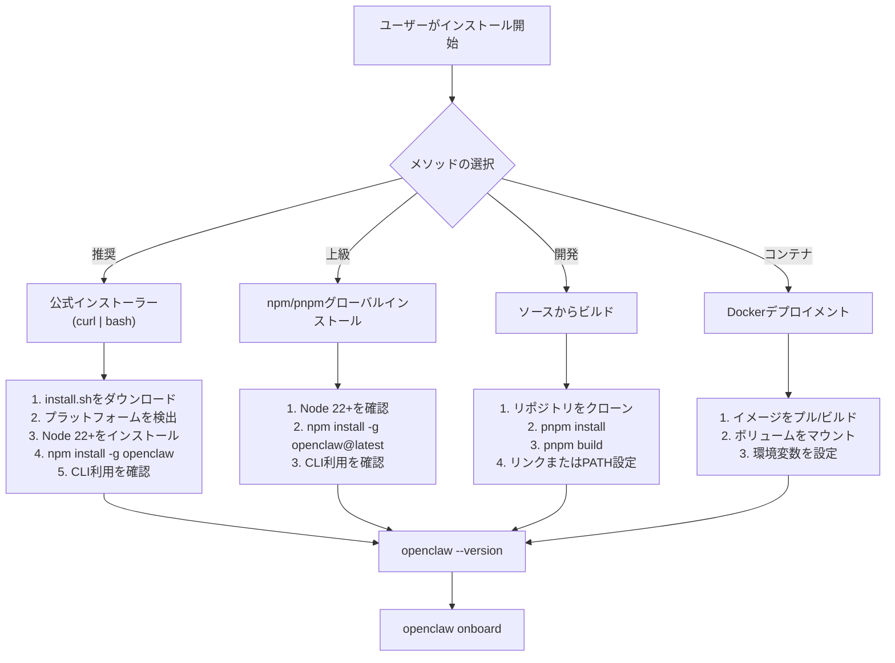
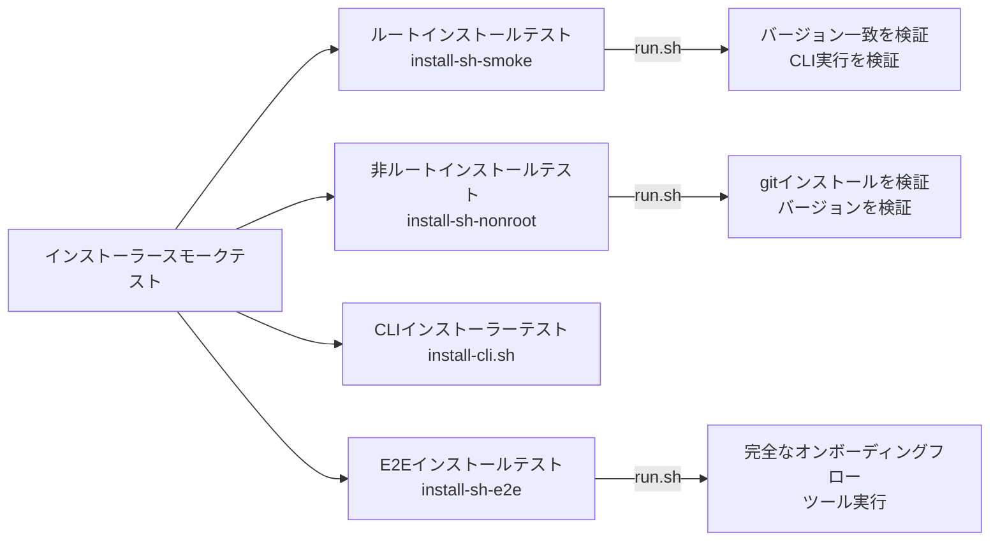
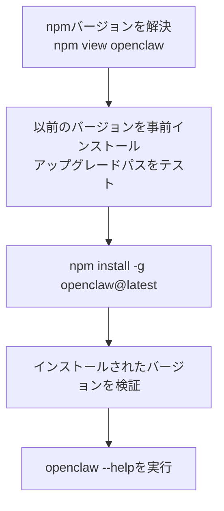
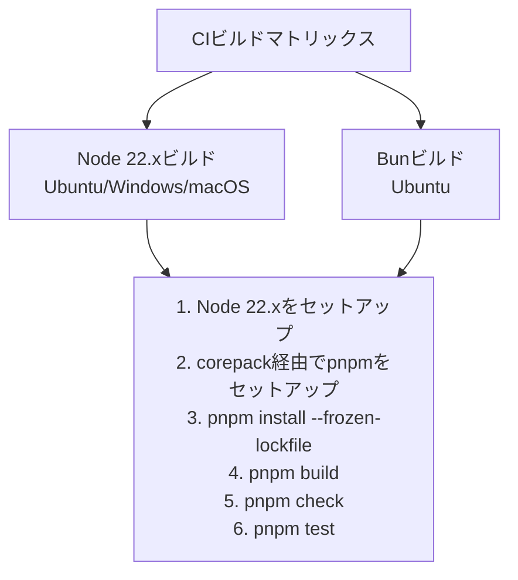
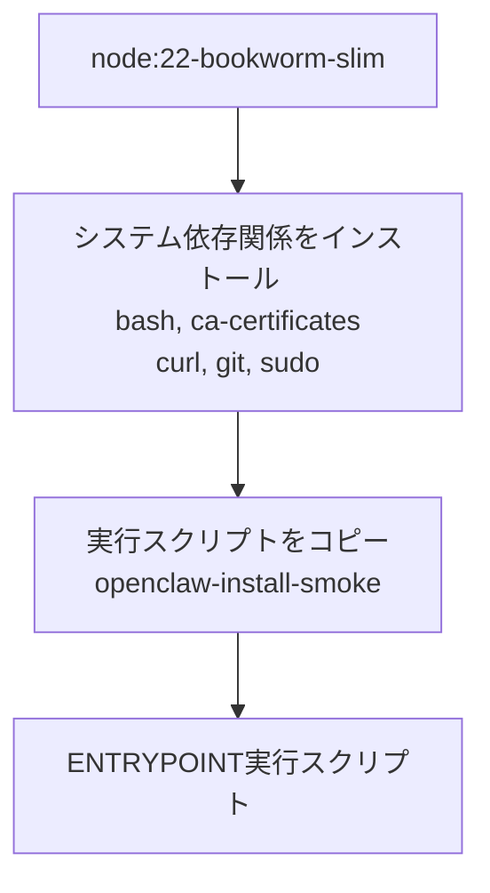
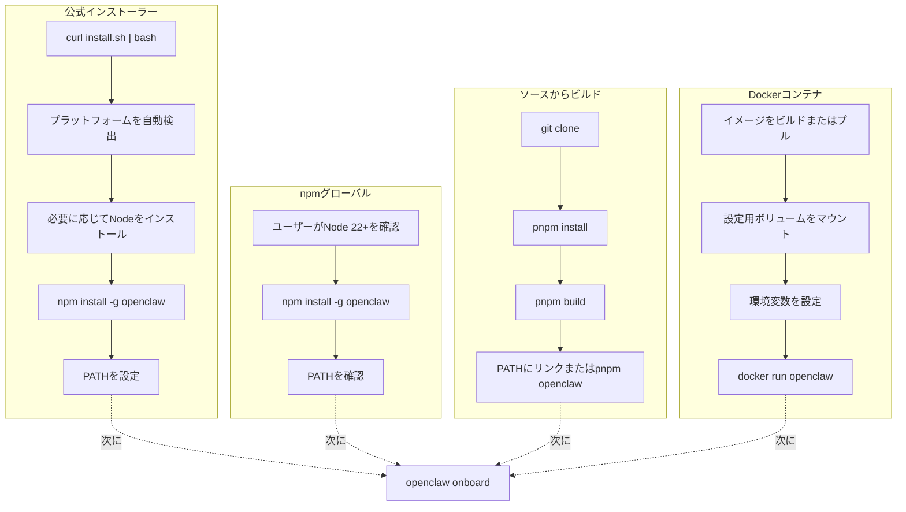

# インストール方法

# インストール方法

<details>
<summary>関連ソースファイル</summary>

このWikiページの作成に使用されたファイル：

- [.agents/skills/mintlify/SKILL.md](.agents/skills/mintlify/SKILL.md)
- [.github/ISSUE_TEMPLATE/bug_report.md](.github/ISSUE_TEMPLATE/bug_report.md)
- [.github/ISSUE_TEMPLATE/config.yml](.github/ISSUE_TEMPLATE/config.yml)
- [.github/ISSUE_TEMPLATE/feature_request.md](.github/ISSUE_TEMPLATE/feature_request.md)
- [.github/labeler.yml](.github/labeler.yml)
- [.github/workflows/auto-response.yml](.github/workflows/auto-response.yml)
- [.github/workflows/labeler.yml](.github/workflows/labeler.yml)
- [.github/workflows/stale.yml](.github/workflows/stale.yml)
- [AGENTS.md](AGENTS.md)
- [README.md](README.md)
- [assets/avatar-placeholder.svg](assets/avatar-placeholder.svg)
- [docs/channels/index.md](docs/channels/index.md)
- [docs/channels/zalo.md](docs/channels/zalo.md)
- [docs/channels/zalouser.md](docs/channels/zalouser.md)
- [docs/zh-CN/channels/index.md](docs/zh-CN/channels/index.md)
- [scripts/clawtributors-map.json](scripts/clawtributors-map.json)
- [scripts/sync-labels.ts](scripts/sync-labels.ts)
- [scripts/update-clawtributors.ts](scripts/update-clawtributors.ts)
- [scripts/update-clawtributors.types.ts](scripts/update-clawtributors.types.ts)
- [src/config/config.ts](src/config/config.ts)
- [src/index.test.ts](src/index.test.ts)
- [src/index.ts](src/index.ts)
- [tsconfig.json](tsconfig.json)
- [ui/src/styles.css](ui/src/styles.css)
- [ui/src/styles/layout.mobile.css](ui/src/styles.css)

</details>


このドキュメントでは、OpenClawのインストール方法とそれぞれのワークフローについて説明します。インストール前のシステム要件については[システム要件](#2.1)を参照してください。インストール後の設定（認証とワークスペース設定を含む）については[オンボーディングウィザード](#2.3)を参照してください。

## 概要

OpenClawは主に4つの方法でインストールできます：

| メソッド | 推奨対象 | 更新 | ゲートウェイサービス |
|--------|----------------|---------|----------------|
| 公式インストーラー | ほとんどのユーザー | 自動 | 自動設定 |
| npm/pnpmグローバル | CI/CD、上級ユーザー | 手動 (`npm update`) | 手動設定 |
| ソースからビルド | 貢献者、開発 | 手動 (`git pull`) | 手動設定 |
| Docker | コンテナデプロイメント | イメージ再ビルド | コンテナライフサイクル |

**Sources:** [docs/index.md:98-115](), [docs/start/getting-started.md:30-48]()

## インストールフロー概要



**Sources:** [docs/start/getting-started.md:30-72](), [docs/start/wizard.md:17-19]()

## 方法1: 公式インストーラー（推奨）

公式インストーラースクリプトは、プラットフォーム検出、依存関係インストール、CLI設定を含む完全なインストールプロセスを自動化します。

### macOSおよびLinux

```bash
curl -fsSL https://openclaw.ai/install.sh | bash
```

インストーラースクリプト（`install.sh`）は以下の手順を実行します：

1. プラットフォームを検出（macOS、Linux、WSL2）
2. Node.js 22+を検証またはインストール
3. `openclaw`パッケージをnpm経由でグローバルにインストール
4. PATHでのCLI利用可能性を検証
5. オプションでオンボーディングウィザードを実行

### Windows

```powershell
iwr -useb https://openclaw.ai/install.ps1 | iex
```

PowerShellインストーラーはWindows環境で同等の手順を実行します。

### インストーラースクリプトテスト



インストーラーは、DockerベースのスモークテストでCIでテストされています：

- **ルートインストールテスト**: [scripts/docker/install-sh-smoke/run.sh:1-74()] 以前のバージョンから最新バージョンへのアップグレードパスを検証
- **非ルートインストールテスト**: [scripts/docker/install-sh-nonroot/run.sh:1-52()] sudoなしとgitインストールを検証
- **E2Eインストールテスト**: [scripts/docker/install-sh-e2e/run.sh:1-500()] 実際のAPIキーとツール実行での完全なオンボーディングを実行

**Sources:** [docs/index.md:32-42](), [docs/start/getting-started.md:32-48](), [scripts/test-install-sh-docker.sh:1-71](), [scripts/test-install-sh-e2e-docker.sh:1-30](), [.github/workflows/install-smoke.yml:1-42]()

## 方法2: npm/pnpmグローバルインストール

直接的なパッケージマネージャーインストールは、インストールプロセスの手動制御を提供します。

### npmインストール

```bash
npm install -g openclaw@latest
```

### pnpmインストール

```bash
pnpm add -g openclaw@latest
```

### バージョン管理

```bash
# 特定バージョンをインストール
npm install -g openclaw@2026.1.29

# ベータチャネルをインストール
npm install -g openclaw@beta

# 最新に更新
npm update -g openclaw

# インストールを検証
openclaw --version
```

### インストール検証

スモークテストはCLI利用可能性とバージョン一致を検証します：



**Sources:** [scripts/docker/install-sh-smoke/run.sh:10-52](), [docs/index.md:98-103]()

## 方法3: ソースからビルド

ソースからのビルドは貢献者と開発ワークフローを意図しています。

### クローンとビルド

```bash
# リポジトリをクローン
git clone https://github.com/openclaw/openclaw.git
cd openclaw

# 依存関係をインストール（pnpmが必要）
pnpm install

# TypeScriptをビルド
pnpm build

# 開発でCLIを実行
pnpm openclaw --help
```

### 開発コマンド

| コマンド | 用途 |
|---------|---------|
| `pnpm build` | TypeScriptを`dist/`にコンパイル |
| `pnpm check` | リントとフォーマットチェックを実行 |
| `pnpm test` | vitestテストスイートを実行 |
| `pnpm openclaw ...` | bun経由でCLIを実行 |
| `pnpm dev` | ワッチモードでCLIを実行 |

### CIビルド検証

CIパイプラインはプラットフォーム間でビルドを検証します：



**Sources:** [.github/workflows/ci.yml:68-157](), [AGENTS.md:50-64]()

## 方法4: Dockerデプロイメント

Dockerインストールはコンテナ化されたOpenClawデプロイメントを使用します。

### Dockerfile構造

Dockerイメージはテストとデプロイメントのためにビルドされます：



### Dockerテストイメージ

プロジェクトはいくつかのDockerテストイメージを維持しています：

| イメージ | 用途 | Dockerfile |
|-------|---------|------------|
| `openclaw-install-smoke:local` | ルートインストールスモークテスト | [scripts/docker/install-sh-smoke/Dockerfile:1-22]() |
| `openclaw-install-nonroot:local` | 非ルーザーテスト | [scripts/docker/install-sh-nonroot/Dockerfile:1-32]() |
| `openclaw-install-e2e:local` | 完全なE2Eオンボーディング | [scripts/docker/install-sh-e2e/Dockerfile:1-32]() |

### Docker実行例

```bash
# イメージをビルド
docker build -t openclaw-install-smoke:local \
  -f scripts/docker/install-sh-smoke/Dockerfile \
  scripts/docker/install-sh-smoke

# スモークテストを実行
docker run --rm -t \
  -e OPENCLAW_INSTALL_URL="https://openclaw.ai/install.sh" \
  -e OPENCLAW_NO_ONBOARD=1 \
  openclaw-install-smoke:local
```

**Sources:** [scripts/docker/install-sh-smoke/Dockerfile:1-22](), [scripts/test-install-sh-docker.sh:1-71]()

## インストール後

### インストールを検証

```bash
# CLIが利用可能か確認
which openclaw

# バージョンを確認
openclaw --version

# 基本的なコマンドをテスト
openclaw --help
```

### オンボーディングを実行

インストール後、認証、ワークスペース、ゲートウェイを設定するためにオンボーディングウィザードに進みます：

```bash
openclaw onboard --install-daemon
```

完全なセットアップの詳細については[オンボーディングウィザード](#2.3)を参照してください。

### ゲートウェイサービスをインストール

公式インストーラーはオプションでゲートウェイをシステムサービスとしてインストールします：

- **macOS**: `~/Library/LaunchAgents/bot.molt.gateway.plist`のLaunchAgent
- **Linux**: `~/.config/systemd/user/openclaw-gateway.service`のsystemdユニット
- **Windows**: `schtasks`経由のスケジュールタスク

サービスインストールは[ゲートウェイサービス管理](#3.3)でカバーされています。

**Sources:** [docs/start/getting-started.md:52-72](), [docs/gateway/index.md:199-298]()

## インストールパスの比較



**Sources:** [docs/start/getting-started.md:30-98](), [AGENTS.md:50-64]()

## 環境変数

インストール動作は環境変数でカスタマイズできます：

| 変数 | 用途 | デフォルト |
|----------|---------|---------|
| `OPENCLAW_INSTALL_URL` | カスタムインストーラーURL | `https://openclaw.ai/install.sh` |
| `OPENCLAW_VERSION` | インストールする特定バージョン | `latest` |
| `OPENCLAW_BETA` | ベータチャネルをインストール | `0` |
| `OPENCLAW_NO_ONBOARD` | オンボーディングウィザードをスキップ | `0` |
| `OPENCLAW_STATE_DIR` | 状態ディレクトリのオーバーライド | `~/.openclaw` |
| `OPENCLAW_CONFIG_PATH` | 設定ファイルのオーバーライド | `~/.openclaw/openclaw.json` |

**Sources:** [scripts/docker/install-sh-smoke/run.sh:4-8](), [scripts/docker/install-sh-e2e/run.sh:4-33]()

## インストールのトラブルシューティング

一般的なインストール問題：

| 問題 | 解決策 |
|-------|----------|
| `npm: command not found` | 最初にNode.js 22+をインストール |
| `openclaw: command not found` | npmグローバルプレフィックスをPATHに追加 |
| バージョン不一致 | npmキャッシュをクリア: `npm cache clean --force` |
| 権限拒否（Linux） | 公式インストーラーを使用するかnpmプレフィックスを設定 |
| ソースからのビルドエラー | pnpmがインストールされていることを確認: `corepack enable` |

詳細なトラブルシューティングについては[トラブルシューティング](#14.3)を参照してください。

**Sources:** [docs/gateway/troubleshooting.md:513-561]()

## 関連ページ

- [システム要件](#2.1) - インストール前の前提条件
- [オンボーディングウィザード](#2.3) - インストール後のセットアップ
- [macOSアプリインストール](#2.4) - ネイティブmacOSアプリのセットアップ
- [ゲートウェイサービス管理](#3.3) - ゲートウェイデーモンの管理

---