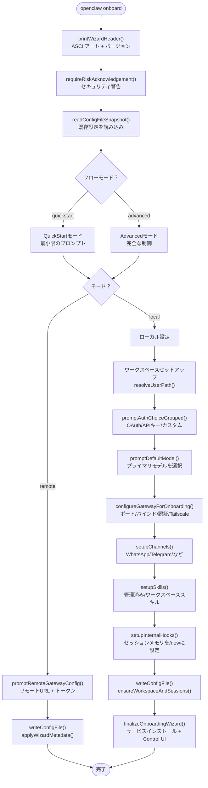
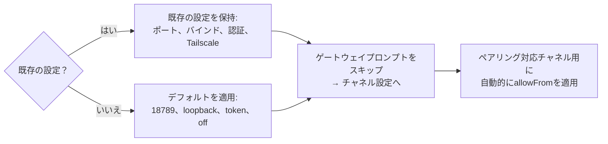
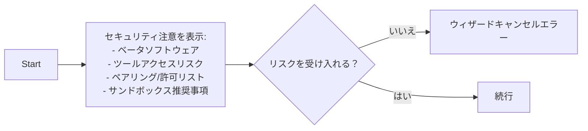
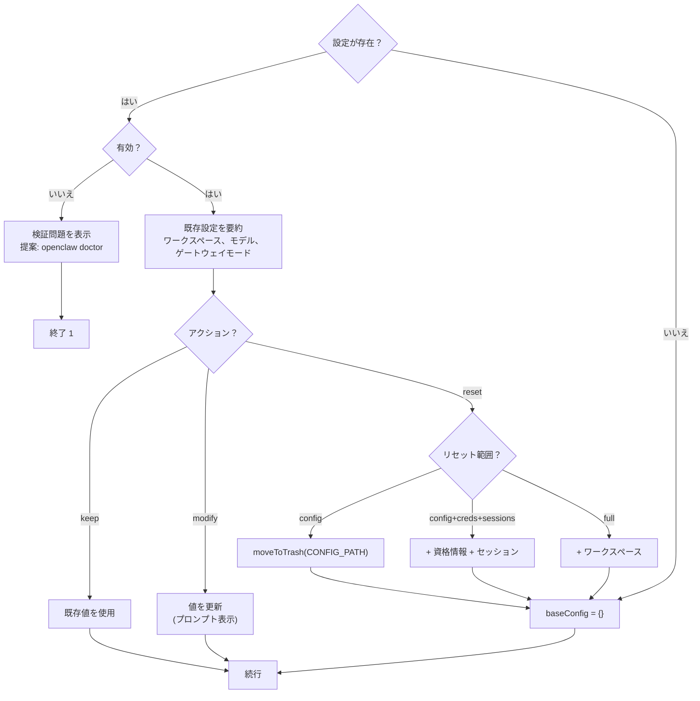
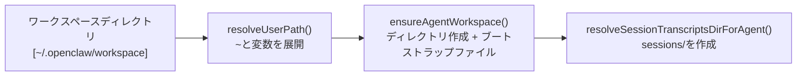
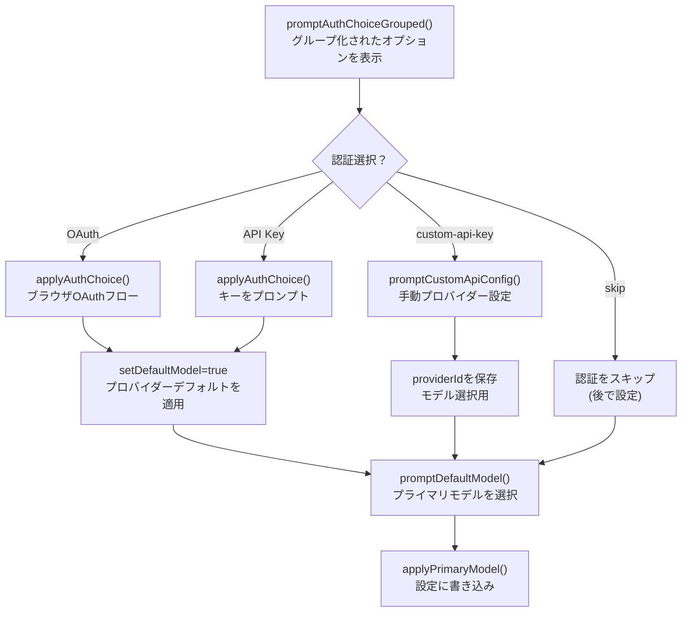
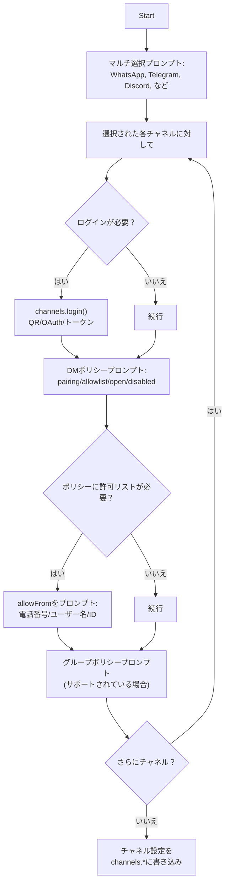
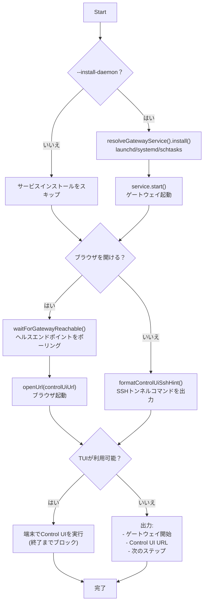
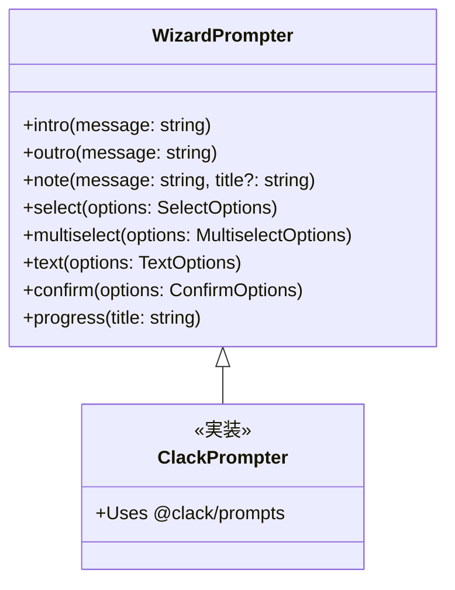

# オンボーディングウィザード

# オンボーディングウィザード

<details>
<summary>関連ソースファイル</summary>

このWikiページの作成に使用されたファイル：

- [README.md](README.md)
- [assets/avatar-placeholder.svg](assets/avatar-placeholder.svg)
- [docs/channels/zalo.md](docs/channels/zalo.md)
- [docs/channels/zalouser.md](docs/channels/zalouser.md)
- [docs/gateway/doctor.md](docs/gateway/doctor.md)
- [scripts/clawtributors-map.json](scripts/clawtributors-map.json)
- [scripts/update-clawtributors.ts](scripts/update-clawtributors.ts)
- [scripts/update-clawtributors.types.ts](scripts/update-clawtributors.types.ts)
- [src/agents/bash-tools.test.ts](src/agents/bash-tools.test.ts)
- [src/agents/pi-tools-agent-config.test.ts](src/agents/pi-tools-agent-config.test.ts)
- [src/agents/sandbox-skills.test.ts](src/agents/sandbox-skills.test.ts)
- [src/commands/configure.gateway.test.ts](src/commands/configure.gateway.test.ts)
- [src/commands/configure.gateway.ts](src/commands/configure.gateway.ts)
- [src/commands/configure.ts](src/commands/configure.ts)
- [src/commands/doctor.ts](src/commands/doctor.ts)
- [src/commands/onboard-helpers.test.ts](src/commands/onboard-helpers.test.ts)
- [src/commands/onboard-helpers.ts](src/commands/onboard-helpers.ts)
- [src/commands/onboard-interactive.ts](src/commands/onboard-interactive.ts)
- [src/config/config.ts](src/config/config.ts)
- [src/config/merge-config.ts](src/config/merge-config.ts)
- [src/index.test.ts](src/index.test.ts)
- [src/index.ts](src/index.ts)
- [src/wizard/onboarding.gateway-config.test.ts](src/wizard/onboarding.gateway-config.test.ts)
- [src/wizard/onboarding.gateway-config.ts](src/wizard/onboarding.gateway-config.ts)
- [src/wizard/onboarding.ts](src/wizard/onboarding.ts)
- [src/wizard/onboarding.types.ts](src/wizard/onboarding.types.ts)
- [tsconfig.json](tsconfig.json)
- [ui/src/styles.css](ui/src/styles.css)
- [ui/src/styles/layout.mobile.css](ui/src/styles.css)

</details>


オンボーディングウィザード（`openclaw onboard`）はOpenClawの推奨される初回実行セットアップ体験です。ユーザーを認証、モデル選択、ゲートウェイ設定、チャネルセットアップ、ワークスペース初期化の初期設定案内をします。ウィザードは検証された`openclaw.json`設定ファイルを生成し、ワークスペースディレクトリ構造をブートストラップします。

インストール後の設定変更については[設定コマンド](#12.5)を参照してください。システム要件については[システム要件](#2.1)を参照してください。手動設定のリファレンスについては[設定ファイル構造](#4.1)を参照してください。

---

## 概要

ウィザードは2つのモードをサポートします：

| モード | 説明 | ユースケース |
|------|-------------|----------|
| **QuickStart** | 適切なデフォルトで最小限のプロンプト | 初回ユーザー、ローカルゲートウェイ設定 |
| **Advanced** | 完全な設定制御 | リモートゲートウェイ、カスタムネットワーク設定 |

両モードともに2つのデプロイ先をサポートします：

| ターゲット | 説明 |
|--------|-------------|
| **Local** | ゲートウェイが現在のマシンで実行 |
| **Remote** | ゲートウェイが別のホストで実行; オンボーディングは接続の詳細のみを設定 |

---

## エントリーポイント

### CLIコマンド

```bash
openclaw onboard [options]
```

### 一般的なフラグ

| フラグ | 説明 |
|------|-------------|
| `--flow quickstart\|advanced` | 特定のウィザードモードを強制 |
| `--mode local\|remote` | ローカルまたはリモートゲートウェイ設定を強制 |
| `--workspace <path>` | ワークスペースディレクトリを設定（デフォルト: `~/.openclaw/workspace`） |
| `--auth-choice <choice>` | 認証方法を事前選択 |
| `--skip-channels` | チャネル設定をスキップ |
| `--skip-skills` | スキル設定をスキップ |
| `--accept-risk` | セキュリティ警告プロンプトをスキップ |
| `--install-daemon` | ゲートウェイサービス（launchd/systemd）をインストール |

Sources: [README.md:45-76](), [src/wizard/onboarding.ts:1-484]()

---

## ウィザードフロー

ウィザードはユーザーの選択に基づく分岐を持つ線形フローに従います：



Sources: [src/wizard/onboarding.ts:90-483](), [src/commands/onboard-helpers.ts:79-108]()

---

## QuickStartモード

QuickStartモードはデフォルトを適用することでプロンプトを最小化します：

### 適用されるデフォルト

| 設定 | デフォルト値 |
|---------|---------|
| ゲートウェイポート | 18789（または既存） |
| ゲートウェイバインド | `loopback` (127.0.0.1) |
| ゲートウェイ認証 | `token`（自動生成） |
| Tailscale | `off` |
| チャネルDMポリシー | ペアリング対象チャネル用 `pairing` |
| ゲートウェイノード拒否コマンド | カメラ/スクリーンレコーディング（プライバシー関連コマンド） |

### QuickStartロジック



QuickStartはローカルモードを強制します; リモートゲートウェイ設定にはAdvancedモードが必要です。

Sources: [src/wizard/onboarding.ts:121-292](), [src/wizard/onboarding.gateway-config.ts:42-286]()

---

## Advancedモード

Advancedモードはすべての設定オプションをプロンプトで表示します。

### ゲートウェイ設定プロンプト

#### ポート選択

検証付きでゲートウェイポートをプロンプト：

```
Gateway port: [18789]
```

Sources: [src/wizard/onboarding.gateway-config.ts:48-60]()

#### バインドモード選択

```
Gateway bind:
→ Loopback (127.0.0.1)
  LAN (0.0.0.0)
  Tailnet (Tailscale IP)
  Auto (Loopback → LAN)
  Custom IP
```

| モード | 説明 |
|------|-------------|
| `loopback` | 127.0.0.1にバインド（ローカルアクセスのみ） |
| `lan` | 0.0.0.0にバインド（すべてのネットワークインターフェース） |
| `tailnet` | プライマリTailscale IP (100.x.x.x)にバインド |
| `auto` | loopbackを優先、利用不可の場合はLANにフォールバック |
| `custom` | 検証付きで特定のIPv4アドレスをプロンプト |

Sources: [src/wizard/onboarding.gateway-config.ts:62-106]()

#### 認証モード選択

```
Gateway auth:
→ Token (推奨デフォルト)
  Password
```

トークンモードは、指定されていない場合に`randomToken()`経由でランダムな48文字の16進トークンを生成します。

Sources: [src/wizard/onboarding.gateway-config.ts:108-203]()

#### Tailscale公開

```
Tailscale exposure:
→ Off (No Tailscale exposure)
  Serve (Private HTTPS for tailnet)
  Funnel (Public HTTPS via Tailscale Funnel)
```

**強制される安全制約：**
- Tailscale serve/funnelには`bind=loopback`が必要（自動調整）
- Funnelには`authMode=password`が必要（自動調整）
- `findTailscaleBinary()`によるバイナリ検出で、Tailscaleがインストールされていない場合は警告

Sources: [src/wizard/onboarding.gateway-config.ts:124-189]()

---

## 設定ステップの詳細

### リスク認識

ウィザードは続行前にセキュリティ警告を表示します：



`--accept-risk`フラグでスキップ可能。

Sources: [src/wizard/onboarding.ts:47-88]()

### 設定処理

既存の設定が検出された場合：



Sources: [src/wizard/onboarding.ts:99-188](), [src/commands/onboard-helpers.ts:310-320]()

### ワークスペース設定

ワークスペースディレクトリは解決・検証されます：



`skipBootstrap`が設定されていない場合、以下のブートストラップファイルが作成されます：
- `IDENTITY.md`
- `SOUL.md`
- `TOOLS.md`
- `AGENTS.md`

Sources: [src/wizard/onboarding.ts:343-353](), [src/commands/onboard-helpers.ts:267-280]()

### 認証設定

認証フローは選択によって変化します：



Sources: [src/wizard/onboarding.ts:373-420](), [src/commands/onboard-helpers.ts:38-66]()

### チャネル設定

`setupChannels()`経由のチャネル設定：



**QuickStart動作：**
- DMポリシープロンプトをスキップ（`pairing`デフォルトを適用）
- ペアリング対応チャネルに自動的に`allowFrom`を適用
- 確認プロンプトをスキップ

Sources: [src/wizard/onboarding.ts:434-450]()

---

## ゲートウェイノードのデフォルト

新しいゲートウェイ設定（既存の`gateway.nodes`設定がない場合）では、ウィザードはプライバシー関連のノードコマンド用にデフォルトの拒否リストを適用します：

```typescript
denyCommands: [
  "camera.snap",
  "camera.clip",
  "screen.record",
  "calendar.add",
  "contacts.add",
  "reminders.add"
]
```

これらのコマンドは、拒否リストから削除するか、一時的な武装（例: `/phone arm` with phone-controlプラグイン）を使用することで明示的なオプトインが必要です。

Sources: [src/wizard/onboarding.gateway-config.ts:14-25](), [src/wizard/onboarding.gateway-config.ts:256-272]()

---

## 最終化

最終化ステップではサービスインストールとControl UIアクセスを処理します：



**ブラウザ開くロジック：**
- macOS: `open`
- Linux: `xdg-open`（WSL上では`wslview`）
- Windows: URL引用付きで`cmd /c start`
- ディスプレイなしのSSHセッション: トンネルヒントを出力

Sources: [src/wizard/onboarding.finalize.ts]()（参照されているがファイル内にない）, [src/commands/onboard-helpers.ts:127-265]()

---

## 主要コンポーネント

### コア関数

| 関数 | ファイル | 用途 |
|----------|------|---------|
| `runOnboardingWizard()` | [src/wizard/onboarding.ts:90-483]() | メインウィザードオーケストレーション |
| `requireRiskAcknowledgement()` | [src/wizard/onboarding.ts:47-88]() | セキュリティ警告プロンプト |
| `configureGatewayForOnboarding()` | [src/wizard/onboarding.gateway-config.ts:42-286]() | ゲートウェイ設定設定 |
| `setupChannels()` | [src/commands/onboard-channels.ts]()（参照） | チャネル設定フロー |
| `setupSkills()` | [src/commands/onboard-skills.ts]()（参照） | スキルインストール |
| `finalizeOnboardingWizard()` | [src/wizard/onboarding.finalize.ts]()（参照） | サービスインストール + UI起動 |

### ヘルパー関数

| 関数 | ファイル | 用途 |
|----------|------|---------|
| `printWizardHeader()` | [src/commands/onboard-helpers.ts:79-90]() | ASCIIアートヘッダー |
| `randomToken()` | [src/commands/onboard-helpers.ts:68-70]() | ゲートウェイトークン生成 |
| `applyWizardMetadata()` | [src/commands/onboard-helpers.ts:92-108]() | ウィザードメタデータをスタンプ |
| `ensureWorkspaceAndSessions()` | [src/commands/onboard-helpers.ts:267-280]() | ワークスペース構造作成 |
| `probeGatewayReachable()` | [src/commands/onboard-helpers.ts:360-382]() | ヘルスチェック |
| `waitForGatewayReachable()` | [src/commands/onboard-helpers.ts:384-416]() | ポーリングヘルスチェック |
| `openUrl()` | [src/commands/onboard-helpers.ts:216-245]() | プラットフォーム固有ブラウザ開き |
| `resolveBrowserOpenCommand()` | [src/commands/onboard-helpers.ts:127-173]() | 開きコマンドを検出 |

### 型

```typescript
type WizardFlow = "quickstart" | "advanced"
type OnboardMode = "local" | "remote"

type QuickstartGatewayDefaults = {
  hasExisting: boolean;
  port: number;
  bind: "loopback" | "lan" | "auto" | "custom" | "tailnet";
  authMode: GatewayAuthChoice;
  tailscaleMode: "off" | "serve" | "funnel";
  token?: string;
  password?: string;
  customBindHost?: string;
  tailscaleResetOnExit: boolean;
}

type GatewayWizardSettings = {
  port: number;
  bind: "loopback" | "lan" | "auto" | "custom" | "tailnet";
  customBindHost?: string;
  authMode: GatewayAuthChoice;
  gatewayToken?: string;
  tailscaleMode: "off" | "serve" | "funnel";
  tailscaleResetOnExit: boolean;
}
```

Sources: [src/wizard/onboarding.types.ts:1-26](), [src/commands/onboard-types.ts]()（参照）

---

## 設定出力

ウィザードは完全な`openclaw.json`にウィザードメタデータを書き込みます：

```json5
{
  // ウィザードメタデータ
  wizard: {
    lastRunAt: "2025-01-15T12:34:56.789Z",
    lastRunVersion: "2025.1.15",
    lastRunCommit: "abc123",
    lastRunCommand: "onboard",
    lastRunMode: "local"
  },

  // ゲートウェイ設定
  gateway: {
    mode: "local",
    port: 18789,
    bind: "loopback",
    auth: {
      mode: "token",
      token: "generated-48-char-hex-token"
    },
    tailscale: {
      mode: "off",
      resetOnExit: false
    },
    nodes: {
      denyCommands: ["camera.snap", "camera.clip", "screen.record", ...]
    }
  },

  // エージェント設定
  agents: {
    defaults: {
      workspace: "~/.openclaw/workspace",
      model: "anthropic/claude-opus-4-6"
    }
  },

  // チャネル設定
  channels: {
    whatsapp: {
      enabled: true,
      dmPolicy: "pairing"
    },
    telegram: {
      enabled: true,
      dmPolicy: "pairing",
      botToken: "<token>"
    }
  }
}
```

Sources: [src/commands/onboard-helpers.ts:92-108](), [src/wizard/onboarding.ts:467-469]()

---

## ウィザードプロンプターインターフェース

ウィザードはUIの一貫性のために`WizardPrompter`抽象化を使用します：



デフォルトの実装はターミナルUIに`@clack/prompts`を使用します。この抽象化により、テストと代替UIバックエンドが可能になります。

Sources: [src/wizard/prompts.ts]()（参照）、[src/wizard/clack-prompter.ts]()（参照）、[src/commands/onboard-interactive.ts:9-25]()

---