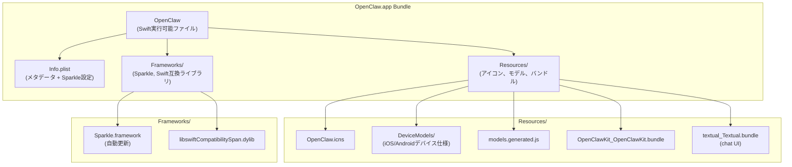
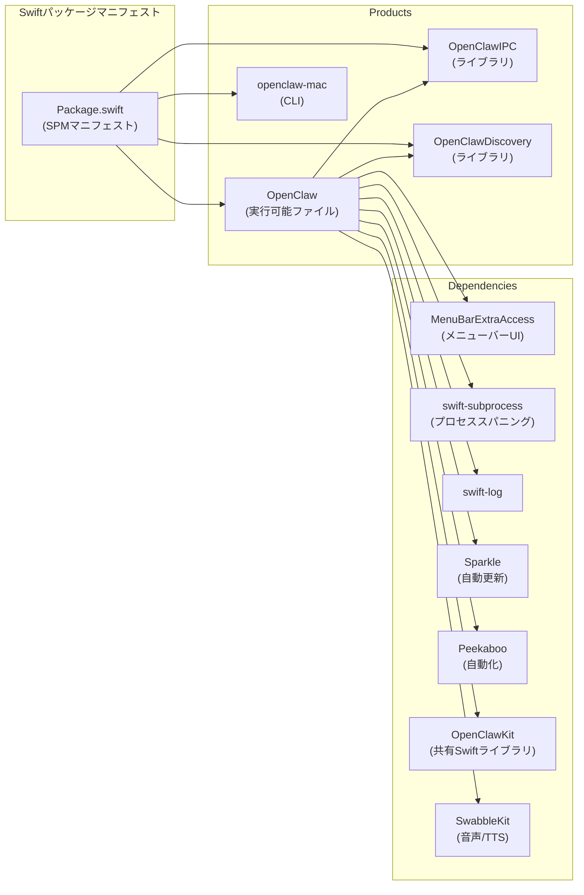
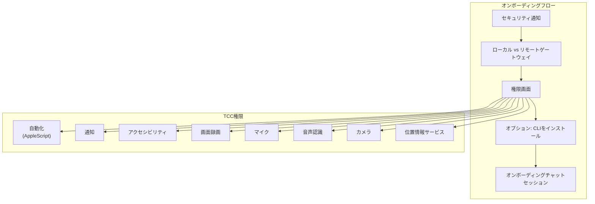
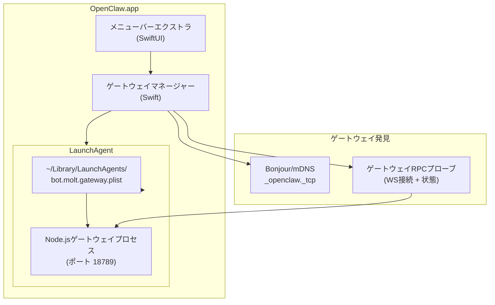
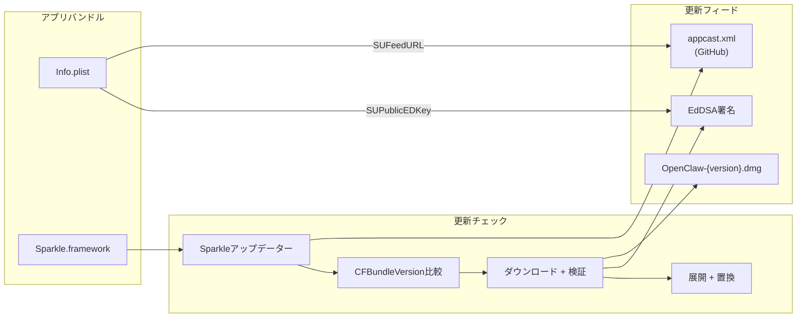

# macOSアプリインストール

# macOSアプリインストール

<details>
<summary>関連ソースファイル</summary>

このWikiページの作成に使用されたファイル：

- [README.md](README.md)
- [assets/avatar-placeholder.svg](assets/avatar-placeholder.svg)
- [docs/channels/zalo.md](docs/channels/zalo.md)
- [docs/channels/zalouser.md](docs/channels/zalouser.md)
- [scripts/clawtributors-map.json](scripts/clawtributors-map.json)
- [scripts/update-clawtributors.ts](scripts/update-clawtributors.ts)
- [scripts/update-clawtributors.types.ts](scripts/update-clawtributors.types.ts)
- [src/cli/nodes-cli.ts](src/cli/nodes-cli.ts)
- [src/cli/nodes-screen.test.ts](src/cli/nodes-screen.test.ts)
- [src/cli/nodes-screen.ts](src/cli/nodes-screen.ts)
- [src/cli/program.ts](src/cli/program.ts)
- [src/config/config.ts](src/config/config.ts)
- [src/index.test.ts](src/index.test.ts)
- [src/index.ts](src/index.ts)
- [tsconfig.json](tsconfig.json)
- [ui/src/styles.css](ui/src/styles.css)
- [ui/src/styles/layout.mobile.css](ui/src/styles/layout.mobile.css)

</details>


このドキュメントでは、ネイティブmacOSコンパニオンアプリ（`OpenClaw.app`）のインストールと設定について説明します。アプリはメニューバーインターフェースを提供し、ゲートウェイサービスのライフサイクルを管理し、macOS固有の権限を処理し、OpenClawゲートウェイとデバイス機能を調整します。

CLIベースのmacOSインストール（ネイティブアプリなし）については[インストール方法](#2.2)を参照してください。ゲートウェイサービス管理の概念については[ゲートウェイサービス管理](#3.3)を参照してください。初期設定フローについては[オンボーディングウィザード](#2.3)を参照してください。

---

## 目的と範囲

macOSアプリはSwiftネイティブアプリケーションであり、以下を実行します：
- 常に利用可能なUIを持つメニューバーとして実行
- LaunchAgent経由でゲートウェイサービスを管理
- macOS権限（TCC）の要求と調整
- ローカルデバイス機能（カメラ、スクリーンレコーディング、位置情報）を提供
- Sparkleフレームワーク経由での自動更新
- Control UIとWebChatインターフェースを埋め込み

このページはアプリのインストール、バンドル構造、権限、ゲートウェイサービス統合をカバーします。ゲートウェイ設定自体については[ゲートウェイ設定](#3.1)を参照してくださいし、チャネル設定については[チャネル](#8)を参照してください。

---

## インストール方法

### 公式リリース（推奨）

GitHub Releasesから最新の`.dmg`をダウンロード：

```bash
open https://github.com/openclaw/openclaw/releases
```

DMGをマウントし、`OpenClaw.app`を`/Applications`にドラッグして起動。アプリは以下を実行します：
1. macOS未検証アプリ警告を表示（初回起動のみ）
2. ローカルネットワーク権限を要求（ゲートウェイ発見用Bonjour）
3. オンボーディングフローを表示

### インストーラースクリプト経由

統合インストーラーはCLIとmacOSアプリの両方をインストールできます：

```bash
curl -fsSL https://openclaw.ai/install.sh | bash
```

スクリプトはmacOSを検出し、利用可能な場合に最新アプリバンドルをダウンロードすることを提案します。

### ソースからのビルド

開発またはカスタムビルド用：

```bash
git clone https://github.com/openclaw/openclaw
cd openclaw
./scripts/package-mac-app.sh
```

パッケージ化されたアプリは`dist/OpenClaw.app`に表示されます。スクリプトは：
- SwiftPM経由でSwiftパッケージをビルド
- リソース（アイコン、デバイスモデル、Textual UI）をバンドル
- 更新用にSparkle.frameworkを埋め込み
- バンドルにコード署名（デフォルトでad-hoc、または`SIGN_IDENTITY`付き）

**Sources:** [scripts/package-mac-app.sh:1-262]()

---

## アプリバンドル構造

### ハイレベルアーキテクチャ



**バンドル内容:**

| パス | 用途 |
|------|---------|
| `Contents/MacOS/OpenClaw` | Swift実行可能ファイル（マルチアーキ: arm64 + x86_64） |
| `Contents/Info.plist` | バンドルメタデータ、バージョン、SparkleフィードURL |
| `Contents/Resources/OpenClaw.icns` | アプリアイコン |
| `Contents/Resources/DeviceModels/` | ペアリング用のiOS/Androidデバイス仕様（JSON） |
| `Contents/Resources/models.generated.js` | `@mariozechner/pi-ai`からのモデルカタログ |
| `Contents/Resources/OpenClawKit_OpenClawKit.bundle` | 共有Swiftリソース |
| `Contents/Resources/textual_Textual.bundle` | チャットUIコンポーネント（`gonzalezreal/textual`から） |
| `Contents/Frameworks/Sparkle.framework` | 自動更新フレームワーク |
| `Contents/Frameworks/libswiftCompatibilitySpan.dylib` | Swift 6.2互換ライブラリ |

**ユニバーサルバイナリ:**

アプリはユニバーサルバイナリ（arm64 + x86_64）として配布されます。パッケージングスクリプトは各アーキテクチャを別々にビルドし、`lipo`でマージします：

```bash
lipo -create \
  apps/macos/.build/arm64/debug/OpenClaw \
  apps/macos/.build/x86_64/debug/OpenClaw \
  -output dist/OpenClaw.app/Contents/MacOS/OpenClaw
```

**Sources:** [scripts/package-mac-app.sh:138-173](), [scripts/package-mac-app.sh:177-192]()

---

## Swiftパッケージ構造



アプリはSwift Package Managerを使用してビルドされます。主要コンポーネント：

| ターゲット | タイプ | 用途 |
|--------|------|---------|
| `OpenClaw` | 実行可能ファイル | メインメニューバーアプリ |
| `OpenClawIPC` | ライブラリ | XPC/IPC通信 |
| `OpenClawDiscovery` | ライブラリ | Bonjour/mDNSゲートウェイ発見 |
| `openclaw-mac` | 実行可能ファイル | macOS固有CLIツール |

**Sources:** [apps/macos/Package.swift:1-93]()

---

## 権限設定

### TCC（Transparency, Consent, and Control）

アプリはオンボーディング中にデバイス機能のmacOS権限を要求します：



| 権限 | 用途 | 必須？ |
|-----------|---------|-----------|
| ローカルネットワーク | Bonjour経由のゲートウェイ発見 | はい（自動的にプロンプト） |
| 自動化 | AppleScript統合 | オプション |
| 通知 | システム通知 | オプション |
| アクセシビリティ | ピーカブー経由の画面自動化 | オプション |
| 画面録画 | スクリーンショット/クリップ用のキャプチャ | オプション |
| マイク | 音声入力（VoiceWake） | オプション |
| 音声認識 | 音声からテキスト | オプション |
| カメラ | node.invoke経由のカメラスナップショット | オプション |
| 位置情報 | 位置情報サービス | オプション |

**権限リセット:**

アプリが権限プロンプト中にクラッシュした場合（TCC競合状態）、権限をリセット：

```bash
tccutil reset All ai.openclaw.mac.debug
```

**Sources:** [docs/start/onboarding.md:52-67](), [docs/gateway/troubleshooting.md:618-631]()

---

## ゲートウェイ統合

### ゲートウェイ管理アーキテクチャ



アプリはゲートウェイサービスのライフサイクルを調整します：

1. **発見:** `_openclaw._tcp`サービスをアドバタイズするローカルゲートウェイをBonjourで発見
2. **LaunchAgent:** `~/Library/LaunchAgents/bot.molt.gateway.plist`（または名前付きプロファイル用`bot.molt.<profile>.plist`）をインストール/管理
3. **ヘルスモニタリング:** WebSocket（`ws://127.0.0.1:18789`）とRPC `status`メソッド経由でゲートウェイをプローブ
4. **自動起動:** `KeepAlive=true`で構成されたLaunchAgentは、ゲートウェイの失敗時に再起動を確保

**LaunchAgentラベルの進化:**

- 現在: `bot.molt.gateway`（または`bot.molt.<profile>`）
- レガシー: `com.openclaw.gateway`（`openclaw doctor`でクリーンアップ）

**Sources:** [docs/gateway/index.md:199-245](), [docs/gateway/troubleshooting.md:633-669]()

---

## LaunchAgent設定

### LaunchAgent構造

アプリはユーザーごとのLaunchAgentをインストールして、ゲートウェイプロセスを監視します。例のplist：

```xml
<?xml version="1.0" encoding="UTF-8"?>
<!DOCTYPE plist PUBLIC "-//Apple//DTD PLIST 1.0//EN" "http://www.apple.com/DTDs/PropertyList-1.0.dtd">
<plist version="1.0">
<dict>
    <key>Label</key>
    <string>bot.molt.gateway</string>
    <key>ProgramArguments</key>
    <array>
        <string>/usr/local/bin/openclaw</string>
        <string>gateway</string>
        <string>--port</string>
        <string>18789</string>
    </array>
    <key>EnvironmentVariables</key>
    <dict>
        <key>OPENCLAW_GATEWAY_TOKEN</key>
        <string></string>
        <key>OPENCLAW_STATE_DIR</key>
        <string>/Users/username/.openclaw</string>
    </dict>
    <key>KeepAlive</key>
    <true/>
    <key>RunAtLoad</key>
    <true/>
    <key>StandardOutPath</key>
    <string>/Users/username/.openclaw/logs/gateway.log</string>
    <key>StandardErrorPath</key>
    <string>/Users/username/.openclaw/logs/gateway.err.log</string>
    <key>WorkingDirectory</key>
    <string>/Users/username</string>
</dict>
</plist>
```

### サービスライフサイクルコマンド

```bash
# LaunchAgentをインストール（CLI経由）
openclaw gateway install

# サービス状態を確認
openclaw gateway status

# サービスを停止
launchctl bootout gui/$UID/bot.molt.gateway

# サービスを起動
launchctl bootstrap gui/$UID ~/Library/LaunchAgents/bot.molt.gateway.plist

# サービスを再起動（強制リロード）
launchctl kickstart -k gui/$UID/bot.molt.gateway
```

### サービスメタデータ

LaunchAgentは診断用にメタデータを埋め込みます：

```xml
<key>EnvironmentVariables</key>
<dict>
    <key>OPENCLAW_SERVICE_MARKER</key>
    <string>openclaw</string>
    <key>OPENCLAW_SERVICE_KIND</key>
    <string>gateway</string>
    <key>OPENCLAW_SERVICE_VERSION</key>
    <string>0.4.0</string>
</dict>
```

これにより`openclaw doctor`がレガシーサービス設定を検出して移行できます。

**Sources:** [docs/gateway/index.md:199-245](), [scripts/restart-mac.sh:142-149]()

---

## 開発ワークフロー

### 署名なし開発ビルド

コード署名なしでの高速イテレーション用：

```bash
# ビルドして起動（署名なし、ad-hoc署名）
./scripts/restart-mac.sh --no-sign --wait

# LaunchAgentインストールをスキップ（アプリはスタンドアロンで実行）
./scripts/restart-mac.sh --no-sign --attach-only
```

**署名なしフロー:**
- `ALLOW_ADHOC_SIGNING=1`と`SIGN_IDENTITY="-"`を設定
- LaunchAgent書き込みをスキップする`~/.openclaw/disable-launchagent`マーカーを作成
- Node.js CLI経由でゲートウェイLaunchAgentを個別にインストール（`node openclaw.mjs daemon install`）
- アプリ起動前にゲートウェイがリッスンするのを待機

**Sources:** [scripts/restart-mac.sh:163-184](), [scripts/restart-mac.sh:217-240]()

### 署名付き開発ビルド

署名キーが利用可能な場合：

```bash
# 署名キーを自動検出
./scripts/restart-mac.sh --wait

# 強制的に署名（キーがない場合は失敗）
./scripts/restart-mac.sh --sign
```

スクリプトは以下経由で署名IDを検出します：

```bash
security find-identity -p codesigning -v | grep -E '(Developer ID Application|Apple Distribution|Apple Development)'
```

**Sources:** [scripts/restart-mac.sh:73-76](), [scripts/restart-mac.sh:163-184]()

---

## 自動更新設定

### Sparkleフレームワーク統合

アプリは[Sparkle 2.8.1](https://sparkle-project.org/)を使用して自動更新を行います。



**Info.plist設定:**

| キー | 値 | 用途 |
|-----|-------|---------|
| `SUFeedURL` | `https://raw.githubusercontent.com/openclaw/openclaw/main/appcast.xml` | 更新フィードURL |
| `SUPublicEDKey` | `AGCY8w5vHirVfGGDGc8Szc5iuOqupZSh9pMj/Qs67XI=` | 署名検証用EdDSA公開キー |
| `SUEnableAutomaticChecks` | `true`（プロダクション） / `false`（デバッグ） | 起動時自動チェック |
| `CFBundleVersion` | `{BUILD_NUMBER}` | 数値ビルド番号（例: gitコミット数） |
| `CFBundleShortVersionString` | `{VERSION}` | セマンティックバージョン（例: `0.4.0`） |

**デバッグバンドル:**

`.debug`サフィックス付きのバンドル（例: `ai.openclaw.mac.debug`）では、Sparkleは無効になります：

```bash
if [[ "$BUNDLE_ID" == *.debug ]]; then
  SPARKLE_FEED_URL=""
  AUTO_CHECKS=false
fi
```

**Sources:** [scripts/package-mac-app.sh:25-35](), [scripts/package-mac-app.sh:154-162](), [apps/macos/Package.swift:54]()

---

## アプリメタデータとビルド情報

アプリは`Info.plist`にビルドメタデータを埋め込みます：

```xml
<key>CFBundleIdentifier</key>
<string>ai.openclaw.mac</string>

<key>CFBundleShortVersionString</key>
<string>0.4.0</string>

<key>CFBundleVersion</key>
<string>1234</string>

<key>OpenClawBuildTimestamp</key>
<string>2025-01-14T12:34:56Z</string>

<key>OpenClawGitCommit</key>
<string>abc1234</string>
```

| キー | ソース | 例 |
|-----|--------|---------|
| `CFBundleIdentifier` | `BUNDLE_ID`環境変数 | `ai.openclaw.mac`（プロダ）、`ai.openclaw.mac.debug`（デバッグ） |
| `CFBundleShortVersionString` | `package.json`バージョンまたは`APP_VERSION` | `0.4.0` |
| `CFBundleVersion` | Gitコミット数または`APP_BUILD` | `1234` |
| `OpenClawBuildTimestamp` | `date -u +"%Y-%m-%dT%H:%M:%SZ"` | `2025-01-14T12:34:56Z` |
| `OpenClawGitCommit` | `git rev-parse --short HEAD` | `abc1234` |

**Sources:** [scripts/package-mac-app.sh:12-17](), [scripts/package-mac-app.sh:148-162]()

---

## トラブルシューティング

### 一般的な問題

**アプリが権限付与時にクラッシュ：**

TCCキャッシュをリセットし、新しいバンドルIDで再ビルド：

```bash
tccutil reset All ai.openclaw.mac.debug
# package-mac-app.shでBUNDLE_IDを変更、例: .testを追加
BUNDLE_ID=ai.openclaw.mac.debug.test ./scripts/package-mac-app.sh
```

**ゲートウェイが"Starting..."でスタック：**

プロセスをキルする前にLaunchAgentスーパーバイザーを停止：

```bash
openclaw gateway status  # スーパーバイザーステートを確認
openclaw gateway stop    # LaunchAgentを停止
# または: launchctl bootout gui/$UID/bot.molt.gateway
```

**ポート18789がビジー：**

リスナーを見つけて終了：

```bash
lsof -nP -iTCP:18789 -sTCP:LISTEN
kill -TERM <PID>  # グレースフル停止
kill -9 <PID>     # 強制終了（最終手段）
```

**CLIバージョン不一致:**

アプリのバージョンと一致するグローバルCLIを確認：

```bash
openclaw --version
npm install -g openclaw@0.4.0
```

**Sources:** [docs/gateway/troubleshooting.md:618-666]()

---

## 関連ドキュメント

- [オンボーディング: macOSアプリ](#2.3) - 初回実行オンボーディングフロー
- [ゲートウェイサービス管理](#3.3) - サービスライフサイクルと監視
- [macOSアプリ開発セットアップ](platforms/mac/dev-setup) - Swiftビルド環境
- [macOS権限](platforms/mac/permissions) - TCC権限の詳細
- [macOS LaunchAgent](platforms/mac/bundled-gateway) - LaunchAgent設定
- [macOSアプリリリース](platforms/mac/release) - リリースと署名プロセス

---