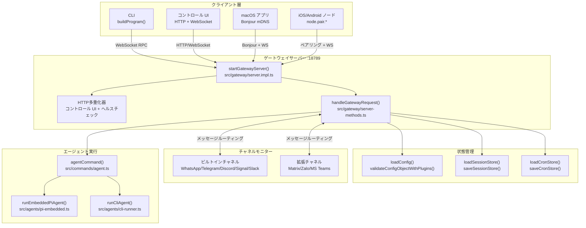
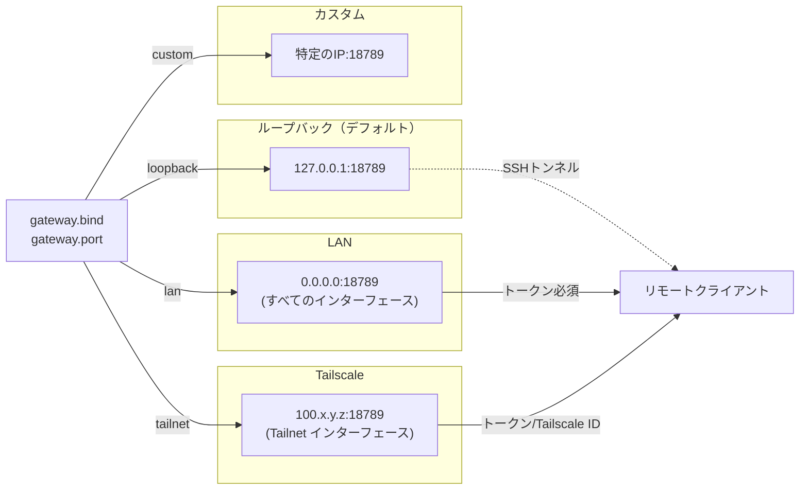
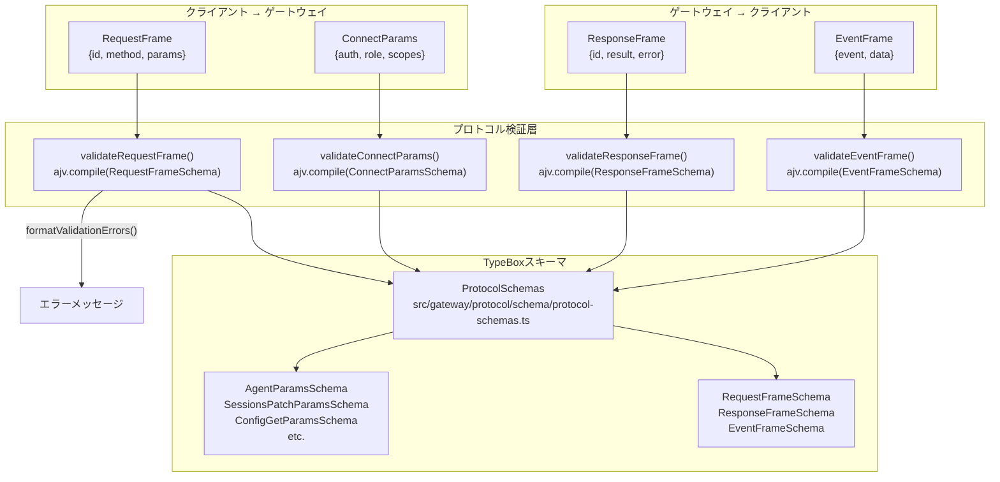
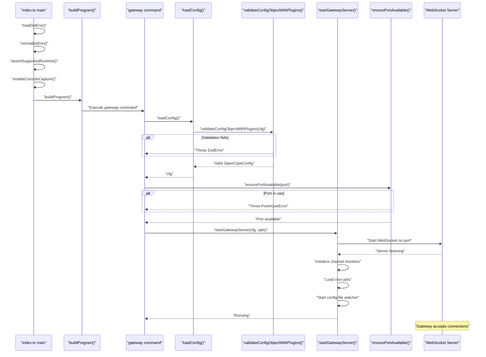
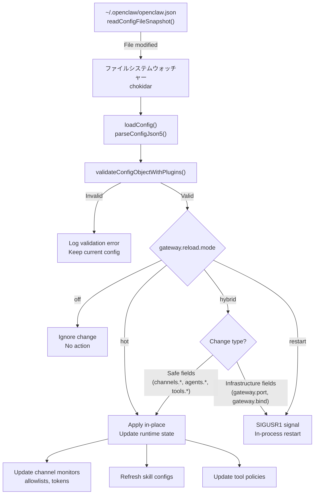
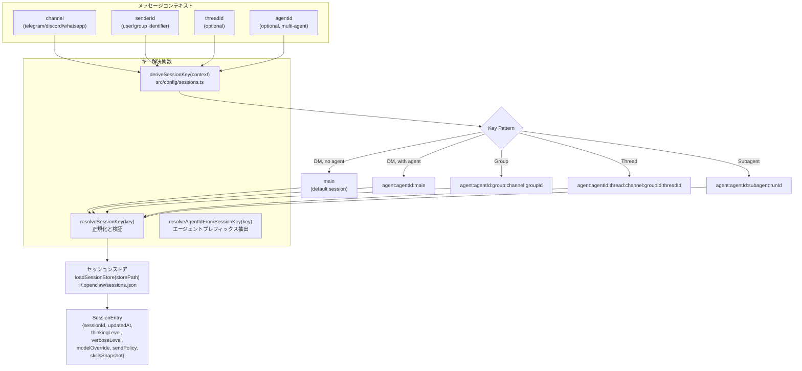
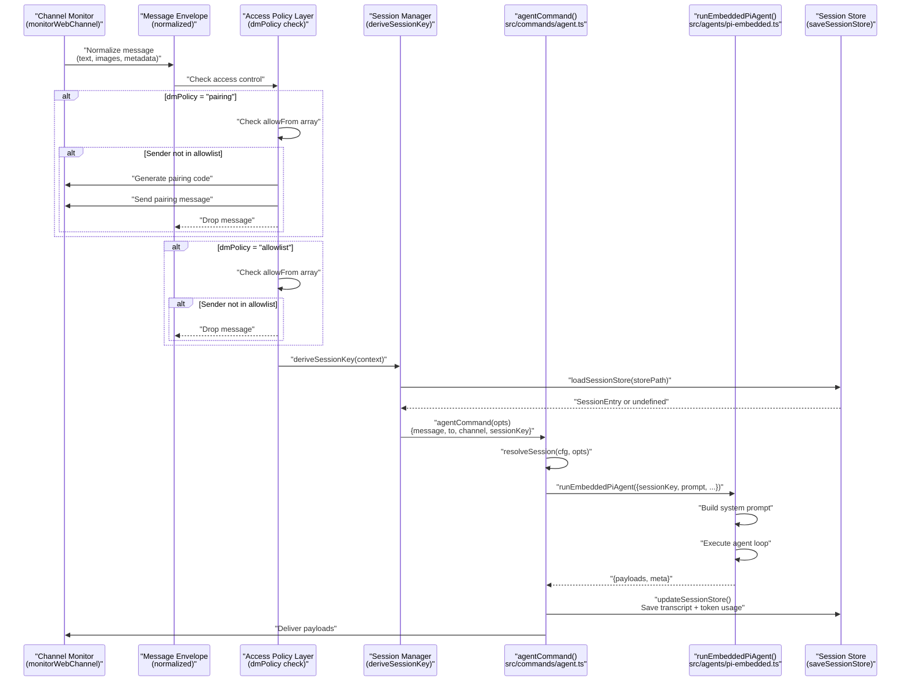
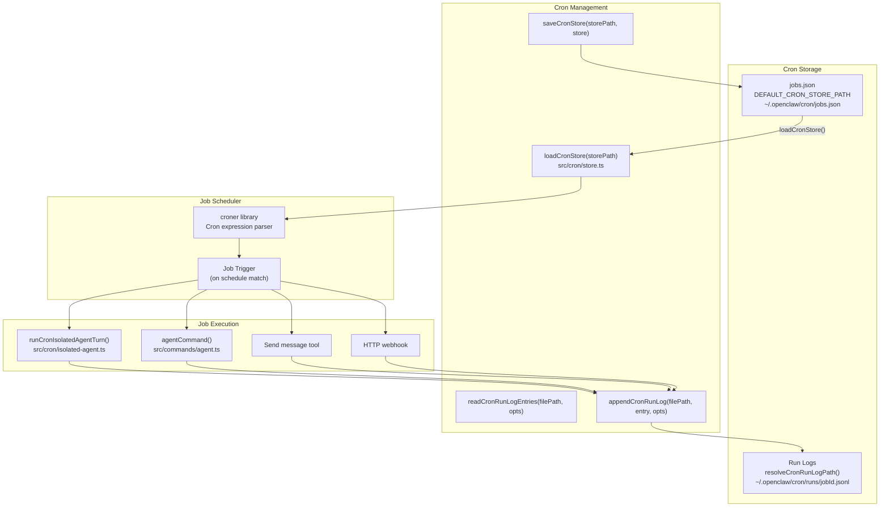
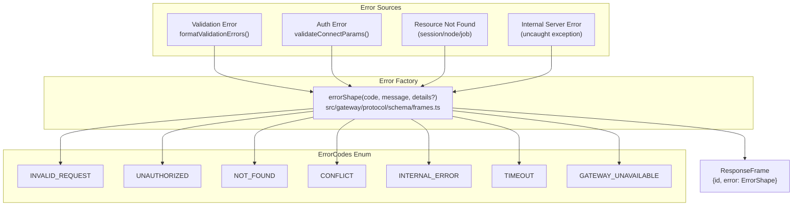

# ゲートウェイ概要

<details>
<summary>関連ソースファイル</summary>

以下のファイルがこのwikiページの作成に使用されました：

- [README.md](README.md)
- [assets/avatar-placeholder.svg](assets/avatar-placeholder.svg)
- [docs/channels/zalo.md](docs/channels/zalo.md)
- [docs/channels/zalouser.md](docs/channels/zalouser.md)
- [scripts/clawtributors-map.json](scripts/clawtributors-map.json)
- [scripts/update-clawtributors.ts](scripts/update-clawtributors.ts)
- [scripts/update-clawtributors.types.ts](scripts/update-clawtributors.types.ts)
- [src/commands/agent.test.ts](src/commands/agent.test.ts)
- [src/commands/agent.ts](src/commands/agent.ts)
- [src/config/config.ts](src/config/config.ts)
- [src/cron/isolated-agent.ts](src/cron/isolated-agent.ts)
- [src/cron/run-log.test.ts](src/cron/run-log.test.ts)
- [src/cron/run-log.ts](src/cron/run-log.ts)
- [src/cron/store.ts](src/cron/store.ts)
- [src/gateway/protocol/index.ts](src/gateway/protocol/index.ts)
- [src/gateway/protocol/schema.ts](src/gateway/protocol/schema.ts)
- [src/gateway/protocol/schema/agents-models-skills.ts](src/gateway/protocol/schema/agents-models-skills.ts)
- [src/gateway/protocol/schema/protocol-schemas.ts](src/gateway/protocol/schema/protocol-schemas.ts)
- [src/gateway/protocol/schema/types.ts](src/gateway/protocol/schema/types.ts)
- [src/gateway/server-methods-list.ts](src/gateway/server-methods-list.ts)
- [src/gateway/server-methods.ts](src/gateway/server-methods.ts)
- [src/gateway/server-methods/agents.ts](src/gateway/server-methods/agents.ts)
- [src/gateway/server.ts](src/gateway/server.ts)
- [src/index.test.ts](src/index.test.ts)
- [src/index.ts](src/index.ts)
- [tsconfig.json](tsconfig.json)
- [ui/src/styles.css](ui/src/styles.css)
- [ui/src/styles/layout.mobile.css](ui/src/styles/layout.mobile.css)

</details>


## 目的と範囲

ゲートウェイはOpenClawの中央コントロールプレーンです。`startGatewayServer()` という単一の長時間実行WebSocketサーバーがすべてのシステムコンポーネントを調整します。1つのポート（デフォルト18789）でHTTPとWebSocketトラフィックを多重化し、チャネル接続を管理、メッセージをエージェントにルーティング、セッション状態を維持、そしてすべてのクライアントに対して統一されたRPCインターフェースを公開します。

**主要な役割：**
- RPCプロトコル用のWebSocketサーバー（`validateRequestFrame`、`validateResponseFrame`）
- チャネルライフサイクル管理（WhatsApp/Telegram/Discord/Signal/Slackなど）
- セッション状態の永続化（`loadSessionStore`、`saveSessionStore`）
- 設定の読み込みとホットリロード（`loadConfig`、`validateConfigObjectWithPlugins`）
- Cronジョブスケジューリング（`loadCronStore`、`saveCronStore`）
- ノードペアリングと機能管理（iOS/Android/macOS）

**関連ページ：**
- ゲートウェイ設定オプション（ポート、バインドモード、認証）については[ゲートウェイ設定](#3.1)を参照
- WebSocketプロトコル仕様については[ゲートウェイプロトコル](#3.2)を参照
- サービスのインストールと管理については[ゲートウェイサービス管理](#3.3)を参照
- リモートアクセスパターンについては[リモートアクセス](#3.4)を参照

---

## アーキテクチャ概要

**図：ゲートウェイシステムアーキテクチャ**



**ソース：** [src/gateway/server.impl.ts](), [src/gateway/server-methods.ts:1-220](), [src/commands/agent.ts:64-528](), [src/index.ts:1-94]()

---

## 主要な役割

ゲートウェイは6つの主要なサブシステムをオーケストレートします：

| サブシステム | 主要な機能 | 実装ファイル |
|-----------|---------------|---------------------|
| **WebSocketサーバー** | `startGatewayServer()`, `handleGatewayRequest()` | [src/gateway/server.impl.ts](), [src/gateway/server-methods.ts:193-220]() |
| **プロトコル検証** | `validateRequestFrame()`, `validateResponseFrame()`, `formatValidationErrors()` | [src/gateway/protocol/index.ts:1-595]() |
| **セッション管理** | `loadSessionStore()`, `saveSessionStore()`, `deriveSessionKey()`, `resolveSessionKey()` | [src/config/sessions.ts:12-17]() |
| **設定** | `loadConfig()`, `validateConfigObjectWithPlugins()`, `writeConfigFile()` | [src/config/config.ts:1-15]() |
| **メッセージルーティング** | `getReplyFromConfig()`, `monitorWebChannel()`, チャネルアダプター | [src/index.ts:4-35]() |
| **Cronスケジューリング** | `loadCronStore()`, `saveCronStore()`, `appendCronRunLog()`, `readCronRunLogEntries()` | [src/cron/store.ts:8-62](), [src/cron/run-log.ts:18-122]() |

**ソース：** [src/gateway/server-methods.ts:1-220](), [src/config/sessions.ts:12-17](), [src/cron/store.ts:8-62]()

---

## ネットワークアーキテクチャ

### バインドモード

ゲートウェイは4つのバインドモードをサポートします：



**主要な設定フィールド：**
- `gateway.port`（デフォルト：`18789`、環境変数：`OPENCLAW_GATEWAY_PORT`）
- `gateway.bind`（値：`loopback`, `lan`, `tailnet`, `auto`, `custom`）
- `gateway.auth.mode`（値：`token`, `password`）
- `gateway.auth.token`（環境変数：`OPENCLAW_GATEWAY_TOKEN`）

**ポート割り当てパターン：**
- 基本ポート：`gateway.port`（例：18789）
- ブラウザ制御：基本 + 2（18791、ループバックのみ）
- Canvasホスト：基本 + 4（18793、`canvasHost.port`で設定可能）

**ソース：** [docs/gateway/index.md:15-50](), [docs/start/wizard.md:40-60]()

---

## プロトコルアーキテクチャ

### プロトコルフレームタイプ

**図：ゲートウェイプロトコルフレーム検証**



**RPCメソッドハンドラー：**

| メソッドカテゴリ | メソッド例 | ハンドラーファイル | スキーマファイル |
|-----------------|-----------------|--------------|-------------|
| **エージェント** | `agent`, `agent.wait`, `agent.identity.get` | [src/gateway/server-methods/agent.ts]() | [src/gateway/protocol/schema/agent.ts:1-10]() |
| **セッション** | `sessions.list`, `sessions.patch`, `sessions.reset`, `sessions.compact` | [src/gateway/server-methods/sessions.ts]() | [src/gateway/protocol/schema/sessions.ts:1-17]() |
| **チャネル** | `channels.status`, `channels.logout` | [src/gateway/server-methods/channels.ts]() | [src/gateway/protocol/schema/channels.ts:1-17]() |
| **設定** | `config.get`, `config.set`, `config.patch`, `config.apply` | [src/gateway/server-methods/config.ts]() | [src/gateway/protocol/schema/config.ts:1-17]() |
| **ノード** | `node.list`, `node.describe`, `node.invoke`, `node.pair.*` | [src/gateway/server-methods/nodes.ts]() | [src/gateway/protocol/schema/nodes.ts:1-17]() |
| **Cron** | `cron.list`, `cron.add`, `cron.run`, `cron.runs` | [src/gateway/server-methods/cron.ts]() | [src/gateway/protocol/schema/cron.ts:1-17]() |
| **エージェント** | `agents.list`, `agents.create`, `agents.update`, `agents.delete` | [src/gateway/server-methods/agents.ts:167-402]() | [src/gateway/protocol/schema/agents-models-skills.ts:35-210]() |

**プロトコル定数：**
- `PROTOCOL_VERSION = 3` - 現在のプロトコルバージョン ([src/gateway/protocol/schema/protocol-schemas.ts:258]())
- `ErrorCodes` - 標準化されたエラーコード列挙 ([src/gateway/protocol/schema/error-codes.ts]())

**ソース：** [src/gateway/protocol/index.ts:223-365](), [src/gateway/protocol/schema/protocol-schemas.ts:140-259](), [src/gateway/protocol/schema.ts:1-17]()

---

## 起動とライフサイクル

### 初期化シーケンス

**図：ゲートウェイ起動フロー**



**起動検証シーケンス：**

1. **ランタイムガード** ([src/index.ts:37-44]())
   - `assertSupportedRuntime()` - Node >= 22を強制
   - `loadDotEnv()` - `.env`ファイルを読み込み
   - `normalizeEnv()` - 環境変数を正規化
   - `enableConsoleCapture()` - 構造化ログ用にコンソール出力をキャプチャ

2. **設定検証** ([src/config/config.ts:1-15]())
   - `loadConfig()` - `openclaw.json`を読み込み
   - `validateConfigObjectWithPlugins()` - Zod + プラグインスキーマ検証
   - 無効な設定の場合は即座に失敗

3. **ポート可用性チェック** ([src/infra/ports.ts:24-29]())
   - `ensurePortAvailable(port)` - ポートが空いているかテスト
   - `describePortOwner(port)` - 競合プロセスを特定
   - ポートが既にバインドされている場合は`PortInUseError`をスロー

4. **サーバー初期化** ([src/gateway/server.impl.ts]())
   - `startGatewayServer(cfg, opts)` - メインサーバーファクトリー
   - WebSocket + HTTP多重化器を`gateway.port`にバインド
   - チャネルモニター、cronスケジューラー、設定ウォッチャーを初期化

**ソース：** [src/index.ts:36-93](), [src/config/config.ts:1-15](), [src/infra/ports.ts:24-29]()

---

## 設定のホットリロード

**図：設定ファイルウォッチャーとリロードロジック**



**ホットリロード可能な設定パス：**

| 設定パス | ホットリロード可 | 備考 |
|-------------|----------------|-------|
| `channels.*.allowFrom` | ✅ はい | リロードなしで許可リストを更新 |
| `channels.*.dmPolicy` | ✅ はい | 即座にアクセスポリシーを更新 |
| `channels.*.groupPolicy` | ✅ はい | グループルーティングルール |
| `skills.*` | ✅ はい | スキル有効化/無効化、環境変数 |
| `tools.allow` / `tools.deny` | ✅ はい | グローバルツールポリシー |
| `agents.*.model` | ✅ はい | エージェント固有のモデル上書き |
| `gateway.port` | ❌ いいえ | 再起動が必要（ソケット再バインド） |
| `gateway.bind` | ❌ いいえ | ネットワークインターフェース変更 |
| `gateway.auth.*` | ❌ いいえ | 認証には再起動が必要 |
| `agents.*.sandbox.*` | ❌ いいえ | Docker設定には再起動が必要 |

**リロードモードの動作：**

- `gateway.reload.mode = "off"` - すべての設定変更を無視、手動再起動が必要
- `gateway.reload.mode = "hot"` - 常にホットリロードを試行（安全でない変更には警告）
- `gateway.reload.mode = "hybrid"`（デフォルト）- 安全な変更をホットリロード、インフラストラクチャーは自動再起動
- `gateway.reload.mode = "restart"` - すべての変更で完全な再起動をトリガー

**ソース：** [src/config/config.ts:1-15](), [README.md:1-100]()

---

## 主要なコンポーネント

### WebSocketサーバー（`startGatewayServer`）

ゲートウェイのWebSocketサーバーは単一のポートでHTTPとWebSocketトラフィックを多重化します：

| パス | プロトコル | 用途 |
|------|----------|---------|
| `/` | WebSocket | RPCコントロールプレーン |
| `/` | HTTP GET | コントロールUI静的アセット |
| `/__openclaw__/*` | HTTP | 内部フック、ヘルスチェック |
| `/v1/chat/completions` | HTTP POST | OpenAI互換API |
| `/v1/responses` | HTTP POST | OpenResponses API |
| `/tools/invoke` | HTTP POST | ツールの直接呼び出し |

**接続フロー：**
1. クライアントが`connect`フレームと`auth.token`または`auth.password`を送信
2. サーバーが`validateConnectParams()`で検証
3. サーバーはプロトコルバージョンを含む`HelloOk`フレームで応答
4. 双方向のRPCとイベントが有効化

**ソース：** [src/gateway/server.ts:1-4](), [docs/gateway/index.md:30-35]()

---

### セッションマネージャー

**図：セッションキーの解決と保存**



**セッション保存関数：**

| 関数 | 用途 | ファイル |
|----------|---------|------|
| `deriveSessionKey(context)` | メッセージコンテキストからセッションキーを生成 | [src/config/sessions.ts:12]() |
| `resolveSessionKey(key)` | セッションキー文字列を正規化し検証 | [src/config/sessions.ts:14]() |
| `loadSessionStore(storePath)` | JSONファイルからセッション状態を読み込み | [src/config/sessions.ts:13]() |
| `saveSessionStore(storePath, store)` | セッション状態をディスクに永続化 | [src/config/sessions.ts:16]() |
| `updateSessionStore(storePath, fn)` | read-modify-writeによる原子更新 | [src/config/sessions.ts]() |
| `resolveAgentIdFromSessionKey(key)` | セッションキーからエージェントIDを抽出 | [src/config/sessions.ts:42]() |
| `resolveSessionFilePath(sessionId, entry, opts)` | JSONLトランスクリプトパスを取得 | [src/config/sessions.ts]() |

**セッションエントリーフィールド：**

```typescript
type SessionEntry = {
  sessionId: string;           // 一意のセッションID
  updatedAt: number;           // 最終更新タイムスタンプ
  thinkingLevel?: ThinkLevel;  // off/minimal/low/medium/high/xhigh
  verboseLevel?: VerboseLevel; // off/on/full
  modelOverride?: string;      // モデル名上書き
  providerOverride?: string;   // プロバイダー上書き
  sendPolicy?: SendPolicy;     // allow/deny/prompt
  skillsSnapshot?: object;     // キャッシュされたスキル状態
  channel?: string;            // 送信元チャネル
  chatType?: string;           // dm/group/thread
  spawnedBy?: string;          // 親セッションキー（サブエージェント用）
};
```

**ソース：** [src/config/sessions.ts:12-46](), [src/index.ts:12-18]()

---

## メッセージ処理パイプライン

**図：ゲートウェイを通受信メッセージフロー**



**アクセス制御の強制：**

| ポリシーモード | 動作 | 設定フィールド |
|-------------|----------|--------------|
| `dmPolicy="pairing"` | 未知の送信者用ペアリングコードを生成、メッセージをブロック | `channels.*.dmPolicy`, `channels.*.allowFrom` |
| `dmPolicy="allowlist"` | 許可リストに登録された送信者のみ許可、その他はドロップ | `channels.*.allowFrom` |
| `dmPolicy="open"` | すべてのDMを許可（`"*"`をallowlistに含める必要あり） | `channels.*.allowFrom = ["*"]` |
| `dmPolicy="disabled"` | すべてのDMを拒否 | `channels.*.dmPolicy = "disabled"` |
| `groupPolicy="open"` | すべてのグループを許可（デフォルト） | `channels.*.groupPolicy` |
| `groupPolicy="allowlist"` | 許可リストに登録されたグループのみ許可 | `channels.*.groups` |
| `groupPolicy="disabled"` | すべてのグループを拒否 | `channels.*.groupPolicy = "disabled"` |

**ソース：** [src/commands/agent.ts:64-528](), [src/agents/pi-embedded.ts](), [src/index.ts:4-35]()

---

## Cronとスケジューリング

**図：Cronジョブの保存と実行**



**Cronジョブストアスキーマ：**

```typescript
type CronStoreFile = {
  version: 1;
  jobs: Array<{
    id: string;              // 一意のジョブID
    schedule: string;        // Cron式（例："0 9 * * *"）
    enabled: boolean;        // ジョブ有効フラグ
    action: {
      type: "message" | "agent" | "webhook";
      params: Record<string, unknown>;
    };
    deliverTo?: string;      // ターゲットセッション/チャネル
  }>;
};
```

**実行ログエントリーフォーマット** ([src/cron/run-log.ts:4-16]())：

```typescript
type CronRunLogEntry = {
  ts: number;              // タイムスタンプ（エポックミリ秒）
  jobId: string;           // ジョブ識別子
  action: "finished";      // アクションタイプ
  status?: "ok" | "error" | "skipped";
  error?: string;          // エラーメッセージ（失敗時）
  summary?: string;        // ジョブ出力サマリー
  sessionId?: string;      // セッションID（エージェントジョブ時）
  sessionKey?: string;     // セッションキー（エージェントジョブ時）
  runAtMs?: number;        // 実際の実行時間
  durationMs?: number;     // 実行期間
  nextRunAtMs?: number;    // 次のスケジュール実行
};
```

**Cron関数：**

| 関数 | 用途 | ファイル |
|----------|---------|------|
| `resolveCronStorePath(storePath?)` | cronストアパスを解決（デフォルト：`~/.openclaw/cron/jobs.json`） | [src/cron/store.ts:11-20]() |
| `loadCronStore(storePath)` | cronジョブ定義をロードして解析 | [src/cron/store.ts:22-48]() |
| `saveCronStore(storePath, store)` | 原子書き込みでcronジョブを永続化 | [src/cron/store.ts:50-62]() |
| `resolveCronRunLogPath(params)` | ジョブIDの実行ログパスを解決 | [src/cron/run-log.ts:18-22]() |
| `appendCronRunLog(filePath, entry, opts)` | JSONLエントリを自動パージして追加 | [src/cron/run-log.ts:43-62]() |
| `readCronRunLogEntries(filePath, opts)` | 最新の実行ログエントリを読み込み | [src/cron/run-log.ts:64-122]() |
| `runCronIsolatedAgentTurn(opts)` | 分離セッションでエージェントジョブを実行 | [src/cron/isolated-agent.ts:1-2]() |

**ソース：** [src/cron/store.ts:8-62](), [src/cron/run-log.ts:4-122](), [src/cron/isolated-agent.ts:1-2]()

---

## サービス管理

ゲートウェイは監視されたバックグラウンドサービスとして実行できます：

| プラットフォーム | スーパーバイザー | サービス名パターン | 設定場所 |
|----------|------------|---------------------|-----------------|
| macOS | launchd | `bot.molt.<profile>` | `~/Library/LaunchAgents/` |
| Linux | systemd | `openclaw-gateway[-<profile>].service` | `~/.config/systemd/user/` |
| Windows | schtasks | `OpenClaw Gateway (<profile>)` | タスクスケジューラ |

**インストール：**
```bash
openclaw gateway install [--force]
```

**サービスコマンド：**
```bash
openclaw gateway status    # サービス状態を確認
openclaw gateway start     # サービスを開始
openclaw gateway stop      # サービスを停止
openclaw gateway restart   # サービスを再起動
openclaw gateway uninstall # サービスを削除
```

**サービスメタデータ（設定に埋め込まれる）：**
- `OPENCLAW_SERVICE_MARKER=openclaw`
- `OPENCLAW_SERVICE_KIND=gateway`
- `OPENCLAW_SERVICE_VERSION=<version>`
- `OPENCLAW_SERVICE_PROFILE=<profile>`（プロファイル使用時）

**ロギング：**
- macOS: `$OPENCLAW_STATE_DIR/logs/gateway.log`, `gateway.err.log`
- Linux: `journalctl --user -u openclaw-gateway[-<profile>].service`
- Windows: `schtasks /Query /TN "OpenClaw Gateway (<profile>)" /V`

**ソース：** [docs/gateway/index.md:50-100](), [docs/gateway/troubleshooting.md:90-125]()

---

## ヘルスモニタリング

### ヘルスチェックエンドポイント

| エンドポイント | 用途 | レスポンス |
|----------|---------|----------|
| `/__openclaw__/health` | ゲートウェイライブネス | `{"ok": true}` |
| `openclaw health` (CLI) | フルヘルスプローブ | サービス状態、チャネル状態、認証検証 |
| `openclaw status --deep` | 深層調査 | プロバイダープローブ、チャネルテストを含む |

### プレゼンスシステム

ゲートウェイは以下のプレゼンスを追跡します：
- **チャネル** - 接続状態、最終メッセージ時刻
- **ノード** - 接続中のiOS/Android/macOSノード、機能
- **エージェント** - アクティブなセッション、キュー深度

**プレゼンスエントリースキーマ：**
```typescript
type PresenceEntry = {
  id: string;              // エンティティID
  type: "channel" | "node" | "agent";
  status: "online" | "offline" | "error";
  lastSeenAt: number;      // タイムスタンプ
  metadata?: Record<string, unknown>;
};
```

**ソース：** [docs/gateway/troubleshooting.md:14-30](), [src/gateway/protocol/schema/types.ts]()

---

## エラーハンドリング

**図：ゲートウェイエラーレスポンスフロー**



**エラー形状スキーマ：**

```typescript
type ErrorShape = {
  code: ErrorCode;         // 標準化されたエラーコード
  message: string;         // 人間可読メッセージ
  details?: unknown;       // オプションのデバッグ情報
};
```

**エラーコードと使用法：**

| エラーコード | 使用時 | ハンドラーの場所 |
|------------|-----------|------------------|
| `INVALID_REQUEST` | スキーマ検証失敗、不正なRPCメソッド | [src/gateway/server-methods.ts:93-163]() |
| `UNAUTHORIZED` | 欠落/無効な`auth.token`、ロール不一致 | [src/gateway/server-methods.ts:93-110]() |
| `NOT_FOUND` | セッション、ノード、ジョブ、またはリソースが見つからない | ハンドラー実装 |
| `CONFLICT` | 状態競合（例：ジョブIDが既に存在） | ハンドラー実装 |
| `INTERNAL_ERROR` | キャッチされない例外、予期しないサーバーエラー | エラーバウンダリー |
| `TIMEOUT` | 操作がタイムアウト制限を超過 | エージェント実行、ツールコール |
| `GATEWAY_UNAVAILABLE` | ゲートウェイ到達不能、接続失敗 | クライアント側エラー |

**検証エラー形式化** ([src/gateway/protocol/index.ts:366-400]())：

```typescript
function formatValidationErrors(errors: ErrorObject[] | null | undefined): string {
  // Parses ajv validation errors and formats them as readable messages
  // Handles additionalProperties, type errors, required fields, etc.
  // Returns: "at /path/to/field: validation message"
}
```

**ソース：** [src/gateway/protocol/schema/error-codes.ts](), [src/gateway/protocol/index.ts:366-400](), [src/gateway/server-methods.ts:93-163]()

---

## マルチゲートウェイサポート

通常は不要ですが、OpenClawは同じホストで複数の分離されたゲートウェイの実行をサポートします：

**分離要件：**
- インスタンスごとに一意の`gateway.port`
- インスタンスごとに一意の`OPENCLAW_STATE_DIR`
- インスタンスごとに一意の`OPENCLAW_CONFIG_PATH`
- インスタンスごとに一意の`agents.defaults.workspace`
- ゲートウェイごとに個別のWhatsAppセッション

**一般的な使用例：**
1. **レスキューボット** - 異なる認証を持つ分離されたバックアップエージェント
2. **開発/本番** - 別々の環境（`--dev`プロファイル）
3. **マルチテナント** - ユーザーごとのゲートウェイ分離

**プロファイルベースの分離：**
```bash
# 開発インスタンス
openclaw --dev gateway --port 19001

# 本番インスタンス
openclaw gateway --port 18789

# カスタムプロファイル
openclaw --profile rescue gateway --port 20000
```

**ソース：** [docs/gateway/index.md:52-100](), [docs/gateway/troubleshooting.md:1-50]()

---