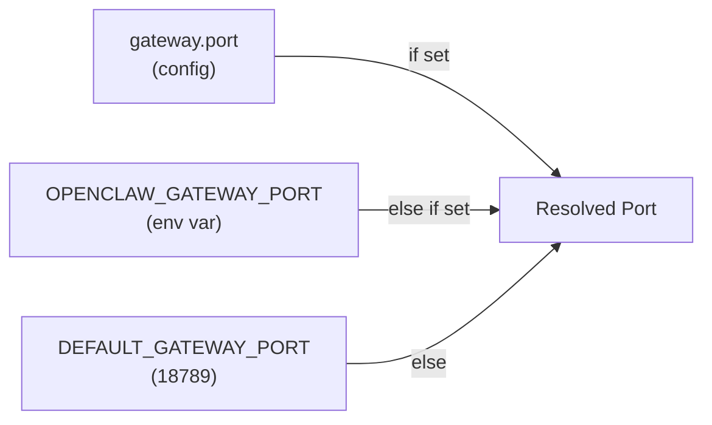
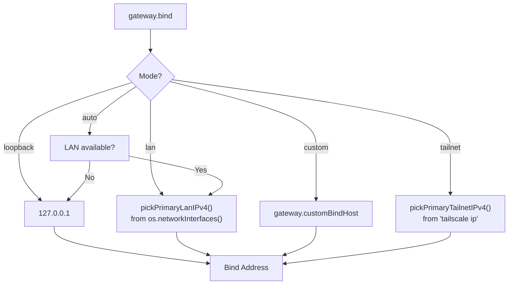
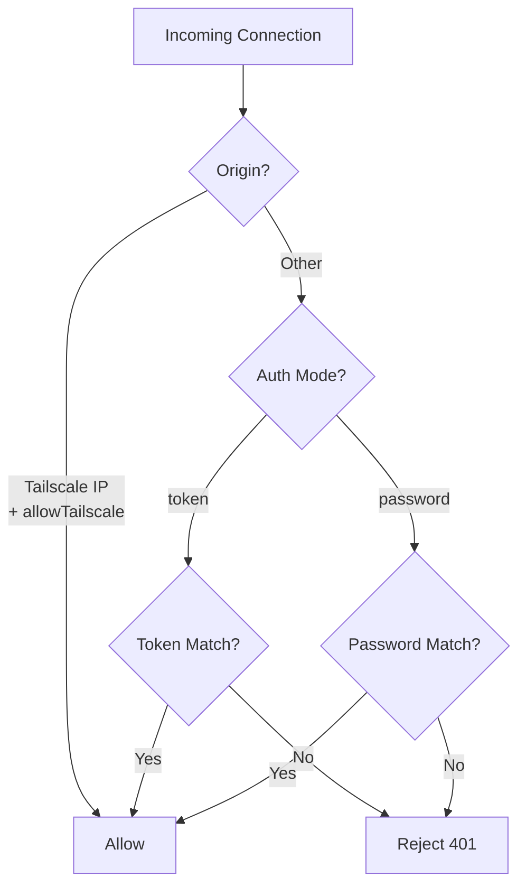
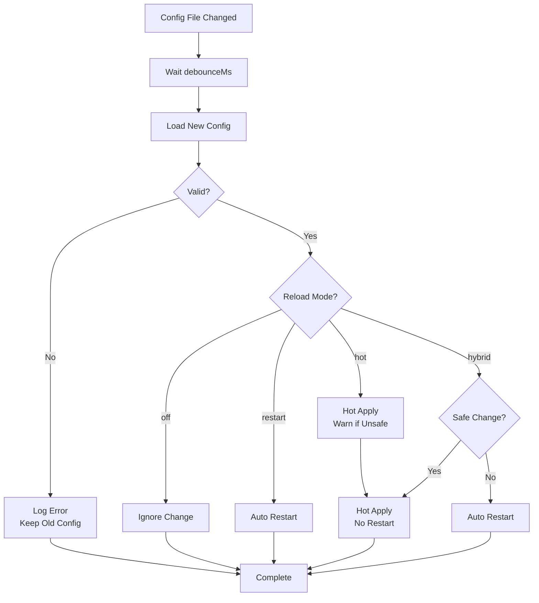

# ゲートウェイ設定

<details>
<summary>関連ソースファイル</summary>

以下のファイルがこのwikiページの作成に使用されました：

- [CHANGELOG.md](CHANGELOG.md)
- [docs/cli/memory.md](docs/cli/memory.md)
- [docs/cli/sandbox.md](docs/cli/sandbox.md)
- [docs/concepts/memory.md](docs/concepts/memory.md)
- [docs/gateway/configuration.md](docs/gateway/configuration.md)
- [docs/gateway/doctor.md](docs/gateway/doctor.md)
- [docs/gateway/sandbox-vs-tool-policy-vs-elevated.md](docs/gateway/sandbox-vs-tool-policy-vs-elevated.md)
- [docs/gateway/sandboxing.md](docs/gateway/sandboxing.md)
- [docs/platforms/mac/skills.md](docs/platforms/mac/skills.md)
- [docs/tools/elevated.md](docs/tools/elevated.md)
- [docs/tools/index.md](docs/tools/index.md)
- [docs/tools/skills-config.md](docs/tools/skills-config.md)
- [src/agents/bash-tools.test.ts](src/agents/bash-tools.test.ts)
- [src/agents/memory-search.test.ts](src/agents/memory-search.test.ts)
- [src/agents/memory-search.ts](src/agents/memory-search.ts)
- [src/agents/pi-tools-agent-config.test.ts](src/agents/pi-tools-agent-config.test.ts)
- [src/agents/sandbox-explain.test.ts](src/agents/sandbox-explain.test.ts)
- [src/agents/sandbox-skills.test.ts](src/agents/sandbox-skills.test.ts)
- [src/agents/sandbox.ts](src/agents/sandbox.ts)
- [src/cli/memory-cli.test.ts](src/cli/memory-cli.test.ts)
- [src/cli/memory-cli.ts](src/cli/memory-cli.ts)
- [src/cli/models-cli.test.ts](src/cli/models-cli.test.ts)
- [src/commands/configure.gateway.test.ts](src/commands/configure.gateway.test.ts)
- [src/commands/configure.gateway.ts](src/commands/configure.gateway.ts)
- [src/commands/configure.ts](src/commands/configure.ts)
- [src/commands/doctor.ts](src/commands/doctor.ts)
- [src/commands/onboard-helpers.test.ts](src/commands/onboard-helpers.test.ts)
- [src/commands/onboard-helpers.ts](src/commands/onboard-helpers.ts)
- [src/commands/onboard-interactive.ts](src/commands/onboard-interactive.ts)
- [src/config/merge-config.ts](src/config/merge-config.ts)
- [src/config/schema.ts](src/config/schema.ts)
- [src/config/types.tools.ts](src/config/types.tools.ts)
- [src/config/types.ts](src/config/types.ts)
- [src/config/zod-schema.agent-runtime.ts](src/config/zod-schema.agent-runtime.ts)
- [src/config/zod-schema.ts](src/config/zod-schema.ts)
- [src/memory/embeddings.test.ts](src/memory/embeddings.test.ts)
- [src/memory/embeddings.ts](src/memory/embeddings.ts)
- [src/memory/manager.ts](src/memory/manager.ts)
- [src/wizard/onboarding.gateway-config.test.ts](src/wizard/onboarding.gateway-config.test.ts)
- [src/wizard/onboarding.gateway-config.ts](src/wizard/onboarding.gateway-config.ts)
- [src/wizard/onboarding.ts](src/wizard/onboarding.ts)
- [src/wizard/onboarding.types.ts](src/wizard/onboarding.types.ts)

</details>


このページでは`gateway.*`設定セクションを文書化します。これはゲートウェイサーバーのネットワークバインド、認証、Tailscale統合、コントロールUI、実行時の動作を制御します。ゲートウェイはデフォルトでポート18789で実行されるOpenClawの中央WebSocket RPCサーバーです。

WebSocketプロトコルの詳細については[ゲートウェイプロトコル](#3.2)を参照してください。サービスのインストールとライフサイクルについては[ゲートウェイサービス管理](#3.3)を参照してください。Tailscale/SSHリモートアクセスパターンについては[リモートアクセス](#3.4)を参照してください。

---

## ゲートウェイ設定階層

```mermaid
graph TB
    Root["gateway.*"]
    Root --> Mode["mode<br/>(local | remote)"]
    Root --> Port["port<br/>(default: 18789)"]
    Root --> Bind["bind<br/>(loopback | lan | auto | custom | tailnet)"]
    Root --> Auth["auth.*"]
    Root --> ControlUi["controlUi.*"]
    Root --> Tailscale["tailscale.*"]
    Root --> Remote["remote.*"]
    Root --> Reload["reload.*"]
    Root --> TLS["tls.*"]
    Root --> HTTP["http.*"]
    Root --> Nodes["nodes.*"]
    Root --> TrustedProxies["trustedProxies"]

    Auth --> AuthMode["mode (token | password)"]
    Auth --> Token["token"]
    Auth --> Password["password"]
    Auth --> AllowTailscale["allowTailscale"]

    ControlUi --> UiEnabled["enabled"]
    ControlUi --> UiBasePath["basePath"]
    ControlUi --> UiRoot["root"]
    ControlUi --> UiOrigins["allowedOrigins"]
    ControlUi --> UiInsecure["allowInsecureAuth"]
    ControlUi --> UiDangerousDisable["dangerouslyDisableDeviceAuth"]

    Tailscale --> TsMode["mode (off | serve | funnel)"]
    Tailscale --> TsReset["resetOnExit"]

    Remote --> RemoteUrl["url"]
    Remote --> RemoteTransport["transport (ssh | direct)"]
    Remote --> RemoteToken["token"]
    Remote --> RemotePassword["password"]
    Remote --> RemoteTlsFingerprint["tlsFingerprint"]
    Remote --> RemoteSsh["sshTarget<br/>sshIdentity"]

    Reload --> ReloadMode["mode (off | restart | hot | hybrid)"]
    Reload --> ReloadDebounce["debounceMs"]

    TLS --> TlsEnabled["enabled"]
    TLS --> TlsAutoGen["autoGenerate"]
    TLS --> TlsCerts["certPath<br/>keyPath<br/>caPath"]

    HTTP --> Endpoints["endpoints.*"]
    Endpoints --> ChatCompletions["chatCompletions.enabled"]
    Endpoints --> Responses["responses.*"]

    Nodes --> NodeBrowser["browser.mode<br/>browser.node"]
    Nodes --> NodeAllow["allowCommands"]
    Nodes --> NodeDeny["denyCommands"]
```



**ソース：** [src/config/zod-schema.ts:370-516](), [docs/gateway/configuration.md:1-480]()

---

## ゲートウェイモード

`gateway.mode`フィールドは、このインスタンスがローカルゲートウェイを実行するかリモートのものに接続するかを決定します。

| モード | 説明 | 使用例 |
|------|-------------|----------|
| `local` | このマシンでゲートウェイサーバーを実行 | デフォルト；ローカルまたはVPSデプロイメント |
| `remote` | リモートゲートウェイに接続（クライアントのみ） | VPSゲートウェイに接続するラップトップ/デスクトップ |

`mode: "remote"`の場合、`gateway.remote.*`セクションが接続を設定します。その他のゲートウェイサーバー設定（`port`、`bind`、`auth`、`controlUi`）はリモートモードでは無視されます。

**例：**

```json5
{
  gateway: {
    mode: "local",
    port: 18789
  }
}
```

**ソース：** [src/config/zod-schema.ts:372](), [src/wizard/onboarding.ts:61-63]()

---

## ポートとネットワークバインディング

### ポート

`gateway.port`はWebSocketサーバーのTCPポートを設定します。デフォルト：`18789`。

```json5
{
  gateway: {
    port: 18789
  }
}
```

**解決：**



**ソース：** [src/config/config.ts:37](), [src/commands/onboard-helpers.ts:294]()

### バインドモード

`gateway.bind`はゲートウェイがどのネットワークインターフェースをリッスンするかを制御します。

| モード | 動作 | 解決済みアドレス |
|------|----------|------------------|
| `loopback` | `127.0.0.1`のみにバインド | `127.0.0.1` |
| `lan` | プライマリLAN IPv4にバインド | `pickPrimaryLanIPv4()` |
| `auto` | 自動検出（LANがあれば、それ以外はループバック） | LAN IPv4または`127.0.0.1` |
| `custom` | `gateway.customBindHost`にバインド | ユーザー指定のIP |
| `tailnet` | Tailscale IPにバインド | `pickPrimaryTailnetIPv4()` |

**デフォルト：** セキュリティのため`loopback`。

**バインド解決フロー：**



**例：**

```json5
{
  gateway: {
    bind: "lan",
    port: 18789
  }
}
```

カスタムバインドの場合：

```json5
{
  gateway: {
    bind: "custom",
    customBindHost: "192.168.1.100"
  }
}
```

**ソース：** [src/gateway/net.ts:1-100](), [src/commands/onboard-helpers.ts:190-239]()

---

## 認証

`gateway.auth`セクションはゲートウェイWebSocketエンドポイントのアクセス制御を設定します。

### 認証モード

| モード | 説明 | 資格情報 |
|------|-------------|-----------|
| `token` | ベアラートークン認証（推奨） | `gateway.auth.token`または`OPENCLAW_GATEWAY_TOKEN` |
| `password` | パスワード認証 | `gateway.auth.password`または`OPENCLAW_GATEWAY_PASSWORD` |

**デフォルト：** `token`モードはすべてのデプロイメント（ループバックを含む）に現在推奨されています。

### トークン認証（推奨）

```json5
{
  gateway: {
    auth: {
      mode: "token",
      token: "your-secure-random-token"
    }
  }
}
```

トークンを生成：

```bash
openclaw doctor --generate-gateway-token
```

または手動で：

```bash
node -e "console.log(require('crypto').randomBytes(24).toString('hex'))"
```

### パスワード認証

```json5
{
  gateway: {
    auth: {
      mode: "password",
      password: "your-secure-password"
    }
  }
}
```

### Tailscale認証バイパス

`gateway.auth.allowTailscale: true`の場合、Tailscale経由の接続は認証チェックをスキップします。`gateway.bind: "tailnet"`または`gateway.tailscale.mode: "serve" | "funnel"`が必要です。

```json5
{
  gateway: {
    bind: "tailnet",
    auth: {
      mode: "token",
      token: "fallback-token",
      allowTailscale: true
    }
  }
}
```

**認証解決：**



**ソース：** [src/gateway/auth.ts:1-150](), [src/config/zod-schema.ts:394-402]()

---

## コントロールUI

`gateway.controlUi`セクションは`http://<gateway>:18789/`で提供されるビルトインWebダッシュボードを設定します。

### オプション

| フィールド | タイプ | 説明 | デフォルト |
|-------|------|-------------|---------|
| `enabled` | `boolean` | コントロールUIを有効化 | `true` |
| `basePath` | `string` | URLパスプレフィックス（例：`/ui`） | `""`（ルート） |
| `root` | `string` | カスタムUIアセットディレクトリ | ビルトインUIバンドル |
| `allowedOrigins` | `string[]` | UIリクエストのCORSオリジン | `[]`（同一オリジンのみ） |
| `allowInsecureAuth` | `boolean` | 認証用HTTPS要件をスキップ | `false` |
| `dangerouslyDisableDeviceAuth` | `boolean` | デバイスID要件を無効化 | `false` |

**例：**

```json5
{
  gateway: {
    port: 18789,
    controlUi: {
      enabled: true,
      basePath: "/dashboard",
      allowedOrigins: ["https://openclaw.example.com"]
    }
  }
}
```

UIは`http://127.0.0.1:18789/dashboard/`でアクセスできます。

### ベースパスの正規化

`basePath`は`normalizeControlUiBasePath()`によって正規化されます：

- 先頭/末尾のスラッシュを削除
- `/`または偽の値の場合は空文字列を返す
- それ以外の場合は`/<cleaned-path>`を返す

**ソース：** [src/config/zod-schema.ts:383-393](), [src/gateway/control-ui-shared.ts:1-50]()

---

## Tailscale統合

OpenClawはTailscale Serve（プライベート）またはFunnel（パブリック）を介してゲートウェイを公開できます。

### モード

| モード | 説明 | アクセス |
|------|-------------|--------|
| `off` | Tailscaleを使用しない | N/A |
| `serve` | Tailscale Serve（プライベート） | Tailnetのみ |
| `funnel` | Tailscale Funnel（パブリック） | インターネットアクセス可能 |

### 設定

```json5
{
  gateway: {
    tailscale: {
      mode: "serve",
      resetOnExit: true
    }
  }
}
```

**フィールド：**

- `mode`: `"off" | "serve" | "funnel"`
- `resetOnExit`: `true`の場合、ゲートウェイシャットダウン時に`tailscale serve reset`を実行（デフォルト：`false`）

### Tailscale + Bindの相互作用

`tailscale.mode`が`serve`または`funnel`の場合、ゲートウェイは設定された`gateway.bind`アドレスにバインドされたままです。Tailscaleはトラフィックをそのバインドアドレスに転送します。

**推奨：**

```json5
{
  gateway: {
    bind: "loopback",
    tailscale: {
      mode: "serve"
    }
  }
}
```

これにより、ゲートウェイは`127.0.0.1`にバインドされたまま、Tailscaleが外部トラフィックをプロキシします。

**ソース：** [src/config/zod-schema.ts:404-410](), [src/commands/onboard-helpers.ts:222-227]()

---

## リモートゲートウェイ設定

`gateway.mode: "remote"`の場合、`gateway.remote`セクションがリモートゲートウェイへの接続を設定します。

### フィールド

| フィールド | タイプ | 説明 |
|-------|------|-------------|
| `url` | `string` | WebSocket URL（例：`wss://gateway.example.com`） |
| `transport` | `"ssh" \| "direct"` | 接続トランスポート |
| `token` | `string` | リモートゲートウェイの認証トークン |
| `password` | `string` | リモートゲートウェイの認証パスワード |
| `tlsFingerprint` | `string` | 予期されるTLS証明書フィンガープリント（オプション） |
| `sshTarget` | `string` | SSHトンネルターゲット（例：`user@host`） |
| `sshIdentity` | `string` | SSHキーパス |

### ダイレクトトランスポート

```json5
{
  gateway: {
    mode: "remote",
    remote: {
      url: "wss://gateway.example.com:18789",
      transport: "direct",
      token: "your-remote-token"
    }
  }
}
```

### SSHトランスポート

```json5
{
  gateway: {
    mode: "remote",
    remote: {
      url: "ws://127.0.0.1:18789",
      transport: "ssh",
      sshTarget: "user@remote-host",
      sshIdentity: "~/.ssh/id_ed25519",
      token: "remote-gateway-token"
    }
  }
}
```

SSHトランスポートは接続する前にSSHトンネル（`-L 18789:127.0.0.1:18789`）を確立します。

**ソース：** [src/config/zod-schema.ts:411-423](), [src/commands/onboard-remote.ts:1-100]()

---

## 設定のホットリロード

ゲートウェイは`~/.openclaw/openclaw.json`を監視し、変更を自動的に適用します。

### リロードモード

| モード | 動作 |
|------|----------|
| `hybrid`（デフォルト） | 安全な変更はホット適用、重要な変更は自動再起動 |
| `hot` | 安全な変更のみホット適用、重要な変更は警告 |
| `restart` | すべての設定変更で常に再起動 |
| `off` | ファイル監視なし、変更は手動再起動時に適用 |

### 設定

```json5
{
  gateway: {
    reload: {
      mode: "hybrid",
      debounceMs: 300
    }
  }
}
```

**フィールド：**

- `mode`: `"off" | "restart" | "hot" | "hybrid"`
- `debounceMs`: 検出された変更を処理前の遅延（デフォルト：`300`）

### ホットリロードの決定ツリー



### 安全 vs 再起動必須の変更

**安全（ホット適用）：**

- `channels.*`
- `agents.*`
- `tools.*`
- `hooks.*`
- `cron.*`
- `session.*`
- `messages.*`
- `browser.*`
- `skills.*`
- `ui.*`
- `logging.*`

**再起動必須：**

- `gateway.port`
- `gateway.bind`
- `gateway.customBindHost`
- `gateway.auth.mode`
- `gateway.auth.token`
- `gateway.auth.password`
- `gateway.tailscale.mode`
- `gateway.tls.*`
- `gateway.http.*`
- `plugins.*`
- `discovery.*`
- `canvasHost.*`

**注意：** `gateway.reload`と`gateway.remote`の変更は**再起動をトリガーしません**。

**ソース：** [docs/gateway/configuration.md:327-366](), [src/config/zod-schema.ts:423-436]()

---

## TLS設定

`gateway.tls`セクションはHTTPS/WSSサポートを有効にします。

### フィールド

| フィールド | タイプ | 説明 |
|-------|------|-------------|
| `enabled` | `boolean` | TLSを有効化 |
| `autoGenerate` | `boolean` | 自己署名証明書を自動生成 |
| `certPath` | `string` | TLS証明書へのパス |
| `keyPath` | `string` | TLS秘密鍵へのパス |
| `caPath` | `string` | CA証明書へのパス（オプション） |

### 自動生成証明書

```json5
{
  gateway: {
    tls: {
      enabled: true,
      autoGenerate: true
    }
  }
}
```

ゲートウェイは起動時に自己署名証明書を生成します。TLS 1.3以上が必要です。

### カスタム証明書

```json5
{
  gateway: {
    tls: {
      enabled: true,
      certPath: "/etc/openclaw/cert.pem",
      keyPath: "/etc/openclaw/key.pem"
    }
  }
}
```

**ソース：** [src/config/zod-schema.ts:437-445]()

---

## HTTPエンドポイント

`gateway.http.endpoints`セクションはOpenAI互換のHTTPエンドポイントを有効にします。

### Chat Completions

`/v1/chat/completions`エンドポイントを有効化：

```json5
{
  gateway: {
    http: {
      endpoints: {
        chatCompletions: {
          enabled: true
        }
      }
    }
  }
}
```

### Responses API

マルチモーダル入力用の`/v1/responses`エンドポイントを有効化：

```json5
{
  gateway: {
    http: {
      endpoints: {
        responses: {
          enabled: true,
          maxBodyBytes: 10485760,
          files: {
            allowUrl: true,
            allowedMimes: ["application/pdf", "text/plain"],
            maxBytes: 5242880,
            maxChars: 100000,
            maxRedirects: 3,
            timeoutMs: 30000,
            pdf: {
              maxPages: 50,
              maxPixels: 2073600,
              minTextChars: 100
            }
          },
          images: {
            allowUrl: true,
            allowedMimes: ["image/png", "image/jpeg"],
            maxBytes: 5242880,
            maxRedirects: 3,
            timeoutMs: 15000
          }
        }
      }
    }
  }
}
```

**ソース：** [src/config/zod-schema.ts:446-497]()

---

## ノード管理

`gateway.nodes`セクションはノードのペアリングとコマンド実行を制御します。

### ブラウザノードルーティング

```json5
{
  gateway: {
    nodes: {
      browser: {
        mode: "auto",
        node: "office-mac"
      }
    }
  }
}
```

**フィールド：**

- `mode`: `"auto" | "manual" | "off"`
  - `auto`: ブラウザツールをペアリングされたノードに自動ルーティング
  - `manual`: 指定されている場合のみ`browser.node`を使用
  - `off`: ノードにルーティングしない
- `node`: ブラウザルーティングのデフォルトノードID/名前

### コマンド許可リスト

```json5
{
  gateway: {
    nodes: {
      allowCommands: ["ls", "echo", "cat"],
      denyCommands: ["rm", "dd"]
    }
  }
}
```

ノードが`system.run`を実行する場合、これらのリストが許可されるバイナリーを制限します。

**ソース：** [src/config/zod-schema.ts:498-513]()

---

## トラストプロキシ

`gateway.trustedProxies`フィールドはヘッダー転送のためのプロキシIP信頼を設定します。

```json5
{
  gateway: {
    trustedProxies: ["127.0.0.1", "10.0.0.0/8"]
  }
}
```

ゲートウェイがリバースプロキシ（nginx、Caddy、Tailscale）の背後にある場合、この設定によりヘッダー転送（`X-Forwarded-For`、`X-Real-IP`）が許可されます。

**ソース：** [src/config/zod-schema.ts:403]()

---

## 設定コードエンティティマップ

以下の図は設定キーをリゾルバー関数とデータ構造にマッピングします：

```mermaid
graph TB
    Config["OpenClawConfig<br/>(types.openclaw.ts)"]
    Config --> GatewayConfig["gateway: GatewayConfig"]

    GatewayConfig --> GatewayMode["mode: GatewayMode<br/>(resolveMode)"]
    GatewayConfig --> GatewayPort["port: number<br/>(resolveGatewayPort)"]
    GatewayConfig --> GatewayBind["bind: GatewayBindMode<br/>(resolveBindAddress)"]
    GatewayConfig --> GatewayAuth["auth: GatewayAuthConfig<br/>(resolveGatewayAuth)"]
    GatewayConfig --> GatewayControlUi["controlUi: GatewayControlUiConfig<br/>(normalizeControlUiBasePath)"]
    GatewayConfig --> GatewayTailscale["tailscale: GatewayTailscaleConfig"]
    GatewayConfig --> GatewayRemote["remote: GatewayRemoteConfig<br/>(buildGatewayConnectionDetails)"]
    GatewayConfig --> GatewayReload["reload: GatewayReloadConfig"]
    GatewayConfig --> GatewayTls["tls: GatewayTlsConfig"]
    GatewayConfig --> GatewayHttp["http: GatewayHttpConfig"]
    GatewayConfig --> GatewayNodes["nodes: GatewayNodesConfig"]
    GatewayConfig --> TrustedProxies["trustedProxies: string[]"]

    Resolvers["Resolver Functions"]
    Resolvers --> ResolveGatewayPort["resolveGatewayPort()<br/>src/config/config.ts:37"]
    Resolvers --> ResolveMode["resolveMode()<br/>src/commands/doctor.ts:61"]
    Resolvers --> ResolveBindAddress["resolveBindAddress()<br/>gateway/net.ts"]
    Resolvers --> ResolveGatewayAuth["resolveGatewayAuth()<br/>gateway/auth.ts"]
    Resolvers --> BuildConnectionDetails["buildGatewayConnectionDetails()<br/>gateway/call.ts"]
    Resolvers --> NormalizeBasePath["normalizeControlUiBasePath()<br/>gateway/control-ui-shared.ts"]

    Schema["Zod Schema"]
    Schema --> OpenClawSchema["OpenClawSchema<br/>src/config/zod-schema.ts:95-632"]
    OpenClawSchema --> GatewaySchema["gateway: z.object()<br/>lines 370-516"]
```



**ソース：** [src/config/types.gateway.ts:1-100](), [src/config/config.ts:37](), [src/gateway/auth.ts:1-150](), [src/gateway/net.ts:1-100]()

---

## ゲートウェイ設定例

### 最小ローカルゲートウェイ

```json5
{
  gateway: {
    mode: "local",
    port: 18789,
    auth: {
      mode: "token",
      token: "your-token-here"
    }
  }
}
```

### VPSゲートウェイ（LANバインド + トークン認証）

```json5
{
  gateway: {
    mode: "local",
    port: 18789,
    bind: "lan",
    auth: {
      mode: "token",
      token: "secure-random-token"
    },
    controlUi: {
      enabled: true
    }
  }
}
```

### Tailscaleプライベートゲートウェイ

```json5
{
  gateway: {
    mode: "local",
    bind: "loopback",
    tailscale: {
      mode: "serve"
    },
    auth: {
      mode: "token",
      token: "fallback-token",
      allowTailscale: true
    }
  }
}
```

### リモートゲートウェイクライアント

```json5
{
  gateway: {
    mode: "remote",
    remote: {
      url: "wss://gateway.example.com:18789",
      transport: "direct",
      token: "remote-token"
    }
  }
}
```

### カスタムバインド + TLS

```json5
{
  gateway: {
    bind: "custom",
    customBindHost: "192.168.1.100",
    tls: {
      enabled: true,
      certPath: "/etc/certs/openclaw.crt",
      keyPath: "/etc/certs/openclaw.key"
    },
    auth: {
      mode: "token",
      token: "production-token"
    }
  }
}
```

**ソース：** [docs/gateway/configuration.md:26-34](), [src/wizard/onboarding.ts:355-368]()

---

## 関連設定

ゲートウェイは他のサブシステムの設定セクションを介して連携します：

- **チャネル** (`channels.*`): ゲートウェイはチャネルからの受信メッセージをエージェントにルーティング
- **エージェント** (`agents.*`): ゲートウェイはエージェントセッションとツール実行を生成
- **ディスカバリー** (`discovery.*`): ゲートウェイはmDNS/広域ディスカバリーを介して自身をアドバタイズ
- **キャンバスホスト** (`canvasHost.*`): ゲートウェイとは別のオプションHTTPサーバー

ホットリロードはほとんどのセクションでゲートウェイの再起動なしに適用されます。詳細は[設定のホットリロード](#config-hot-reload)を参照してください。

**ソース：** [src/config/zod-schema.ts:95-632](), [docs/gateway/configuration.md:327-366]()

---