# ゲートウェイプロトコル

<details>
<summary>関連ソースファイル</summary>

以下のファイルがこのwikiページの作成に使用されました：

- [src/commands/agent.test.ts](src/commands/agent.test.ts)
- [src/commands/agent.ts](src/commands/agent.ts)
- [src/cron/isolated-agent.ts](src/cron/isolated-agent.ts)
- [src/cron/run-log.test.ts](src/cron/run-log.test.ts)
- [src/cron/run-log.ts](src/cron/run-log.ts)
- [src/cron/store.ts](src/cron/store.ts)
- [src/gateway/protocol/index.ts](src/gateway/protocol/index.ts)
- [src/gateway/protocol/schema.ts](src/gateway/protocol/schema.ts)
- [src/gateway/protocol/schema/agents-models-skills.ts](src/gateway/protocol/schema/agents-models-skills.ts)
- [src/gateway/protocol/schema/protocol-schemas.ts](src/gateway/protocol/schema/protocol-schemas.ts)
- [src/gateway/protocol/schema/types.ts](src/gateway/protocol/schema/types.ts)
- [src/gateway/server-methods-list.ts](src/gateway/server-methods-list.ts)
- [src/gateway/server-methods.ts](src/gateway/server-methods.ts)
- [src/gateway/server-methods/agents.ts](src/gateway/server-methods/agents.ts)
- [src/gateway/server.ts](src/gateway/server.ts)

</details>


ゲートウェイプロトコルはすべてのクライアントがOpenClawゲートウェイと対話するために使用するWebSocketベースの通信プロトコルです。このページではフレーム構造、認証モデル、メソッドカタログ、スキーマ検証システムについて説明します。ゲートウェイサーバーの設定とデプロイの詳細については[ゲートウェイ設定](#3.1)を参照してください。リモートアクセスパターンの詳細については[リモートアクセス](#3.4)を参照してください。

---

## 概要

ゲートウェイはデフォルトで`ws://127.0.0.1:18789`に単一のWebSocketエンドポイントを公開し、以下を処理します：

- CLIコマンド（`openclaw agent`、`openclaw send`など）
- コントロールUIダッシュボード操作
- macOS/iOS/Androidコンパニオンアプリ接続
- デバイスノードのペアリングと呼び出し
- リアルタイムイベントストリーミング（エージェント実行、プレゼンス更新、cronジョブ）

すべての通信はJSON-RPCスタイルの要求/レスポンスパターンに従い、Ajvで検証された型付きスキーマを使用します。プロトコルは**オペレーター**クライアント（人間、ダッシュボード）と**ノード**クライアント（デバイスコンパニオン）を区別し、役割ベースのメソッド認証を提供します。

**ソース：** [src/gateway/protocol/index.ts:1-595](), [src/gateway/server-methods.ts:1-220]()

---

## フレームタイプ

プロトコルは3つのフレームタイプを使用し、すべてJSONとしてWebSocketメッセージにシリアライズされます：

| フレームタイプ | 方向 | 用途 |
|------------|-----------|---------|
| `RequestFrame` | クライアント → サーバー | ゲートウェイメソッドを呼び出す |
| `ResponseFrame` | サーバー → クライアント | 要求の結果またはエラーを返す |
| `EventFrame` | サーバー → クライアント | 非同期通知をプッシュ（エージェントイベント、プレゼンス、cron） |

### RequestFrame構造

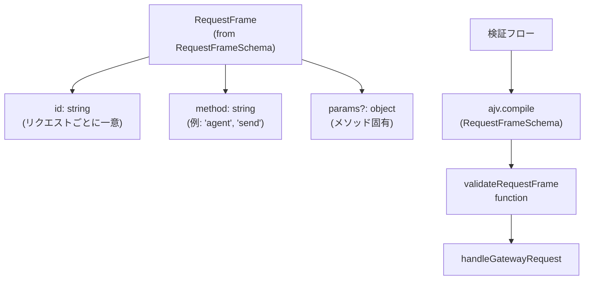

**検証：** `validateRequestFrame`関数はAjvを使用して[src/gateway/protocol/index.ts:230]()で`RequestFrameSchema`からコンパイルされます。

**ソース：** [src/gateway/protocol/schema/frames.ts](), [src/gateway/protocol/index.ts:230](), [src/gateway/server-methods.ts:193-219]()

---

### ResponseFrame構造

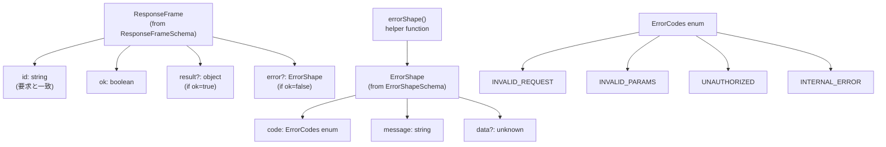

**ErrorShape構築：** [src/gateway/protocol/schema/error-codes.ts]()の`errorShape()`ヘルパー関数は、適切な構造を持つエラーレスポンスを構築します。

**ソース：** [src/gateway/protocol/schema/frames.ts](), [src/gateway/protocol/schema/error-codes.ts](), [src/gateway/protocol/index.ts:231]()

---

### EventFrame構造

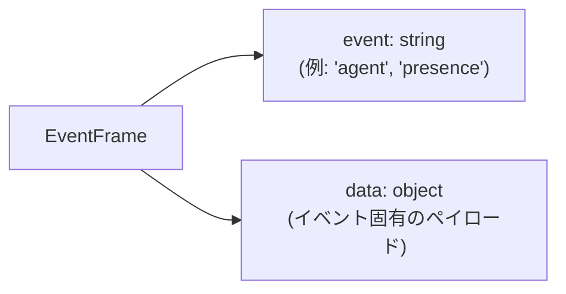

**イベントタイプ（`GATEWAY_EVENTS`から）：**
- `agent` → エージェント実行ストリーム（ライフサイクル、アシスタント、ツール、推論、デバッグ）
- `chat` → WebChatメッセージイベント
- `presence` → セッション/エージェント状態の更新
- `tick` → 定期キープアライブ（20秒ごと）
- `shutdown` → ゲートウェイシャットダウン通知
- `cron` → Cronジョブライフサイクルイベント
- `node.pair.requested`, `node.pair.resolved` → ノードペアリングワークフロー
- `device.pair.requested`, `device.pair.resolved` → デバイスペアリングワークフロー
- `exec.approval.requested`, `exec.approval.resolved` → 実行承認プロンプト
- `connect.challenge` → 初期接続チャレンジ
- `talk.mode` → トークモードの変更
- `heartbeat` → ハートビートイベント
- `voicewake.changed` → ボイスウェイク設定の変更
- `health` → ヘルス状態の更新
- `node.invoke.request` → ノード呼び出し要求

**ソース：** [src/gateway/protocol/schema/frames.ts](), [src/gateway/server-methods-list.ts:98-117]()

---

## 接続ライフサイクル

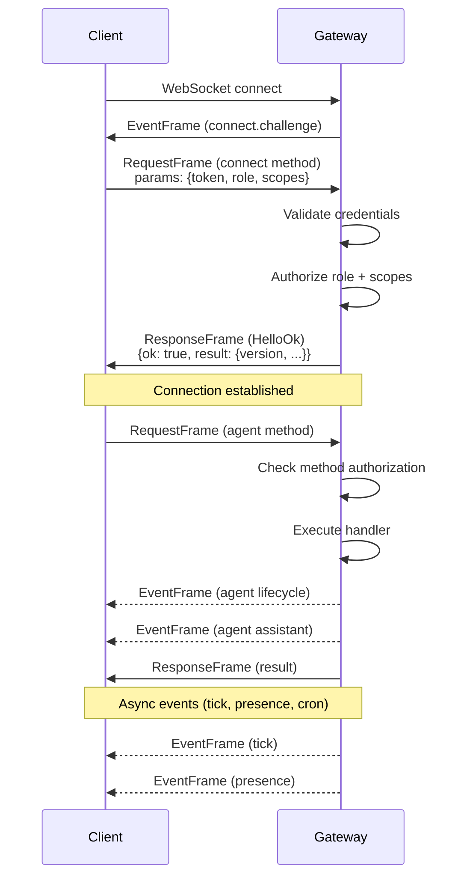

**ソース：** [src/gateway/protocol/schema/frames.ts](), [src/gateway/server-methods/connect.ts]()

---

## 認証と認可

### 接続役割

プロトコルは`ConnectParams.role`で定義された2つの役割をサポートします：

- **`operator`**（デフォルト）：人間クライアント、ダッシュボード、CLI。トークン/パスワード認証が必要。
- **`node`**：デバイスコンパニオン（macOS/iOS/Androidアプリ）。Bonjour/mDNS検出 + ペアリングフローを使用。

### オペレータースコープ

オペレーターは`ConnectParams.scopes[]`を介して複数のスコープを付与できます：

| スコープ | 許可されるメソッド |
|-------|-----------------|
| `operator.admin` | フルアクセス：`config.*`, `wizard.*`, `update.*`, `channels.logout`, `skills.install`, `skills.update`, `cron.add/update/remove`, `sessions.patch/reset/delete/compact`, `exec.approvals.*` |
| `operator.read` | 読み取り専用：`health`, `logs.tail`, `channels.status`, `status`, `usage.*`, `models.list`, `agents.list`, `sessions.list`, `cron.list/status`, `node.list/describe` |
| `operator.write` | 実行：`send`, `agent`, `agent.wait`, `wake`, `talk.mode`, `tts.*`, `voicewake.*`, `node.invoke`, `chat.send/abort`, `browser.request` |
| `operator.approvals` | 実行承認フロー：`exec.approval.request`, `exec.approval.resolve` |
| `operator.pairing` | デバイス管理：`node.pair.*`, `device.pair.*`, `device.token.*`, `node.rename` |

**デフォルトスコープ：** クライアントが有効なトークン/パスワードで接続するが明示的なスコープがない場合、サーバーは`operator.admin`（フルアクセス）を付与します。

**認可の強制：** [src/gateway/server-methods.ts:93-163]()

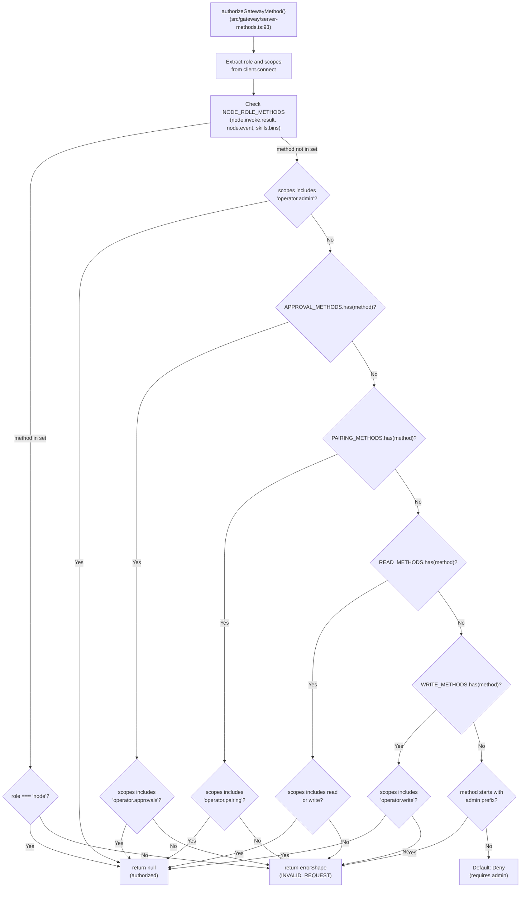

**メソッドセット：** 認可ロジックは事前定義されたセットを使用します：
- `NODE_ROLE_METHODS`（行36）：`node.invoke.result`、`node.event`、`skills.bins`
- `APPROVAL_METHODS`（行35）：`exec.approval.request`、`exec.approval.resolve`
- `PAIRING_METHODS`（行37-49）：すべての`node.pair.*`、`device.pair.*`、`device.token.*`、`node.rename`
- `ADMIN_METHOD_PREFIXES`（行50）：`exec.approvals.*`
- `READ_METHODS`（行51-75）：ステータス/リスト操作
- `WRITE_METHODS`（行76-91）：実行操作

**ソース：** [src/gateway/server-methods.ts:29-163](), [src/gateway/server-methods.ts:193-219]()

---

## メソッドカタログ

ゲートウェイは12の機能領域で80以上のメソッドを公開します。すべてのメソッドは`listGatewayMethods()`にリストされています。

### コアメソッド

すべてのメソッドは`coreGatewayHandlers` [src/gateway/server-methods.ts:165-191]()に登録され、`BASE_METHODS` [src/gateway/server-methods-list.ts:3-91]()にリストされています。

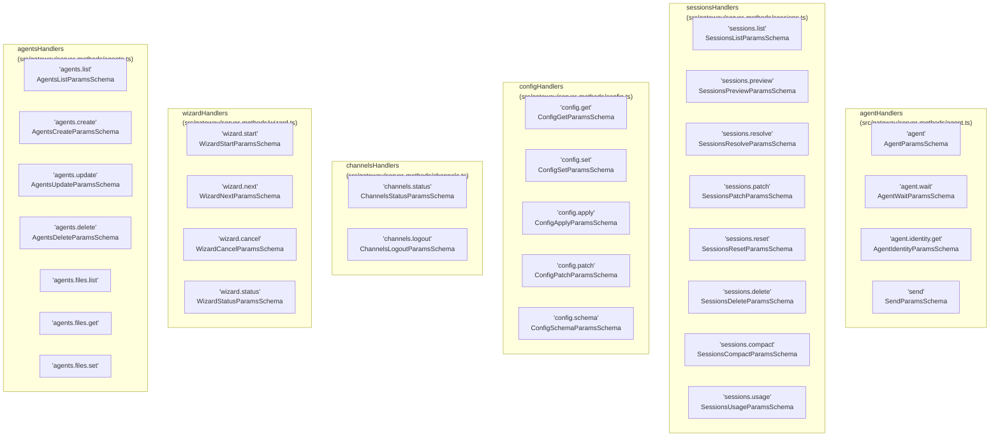

**ソース：** [src/gateway/server-methods-list.ts:3-91](), [src/gateway/server-methods.ts:165-191]()

---

### ノード & デバイスメソッド

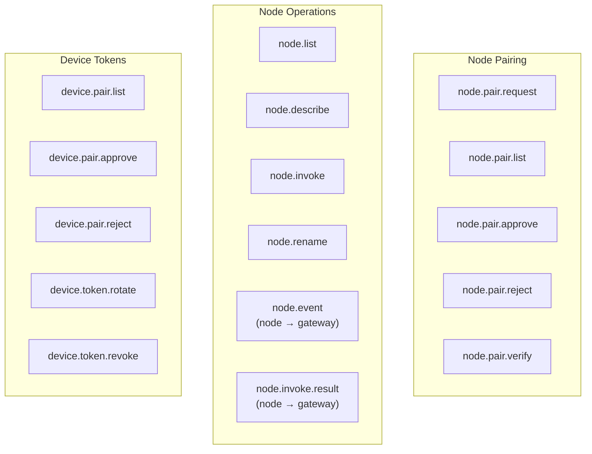

**ソース：** [src/gateway/server-methods-list.ts:37-49](), [src/gateway/server-methods/nodes.ts]()

---

### 管理メソッド

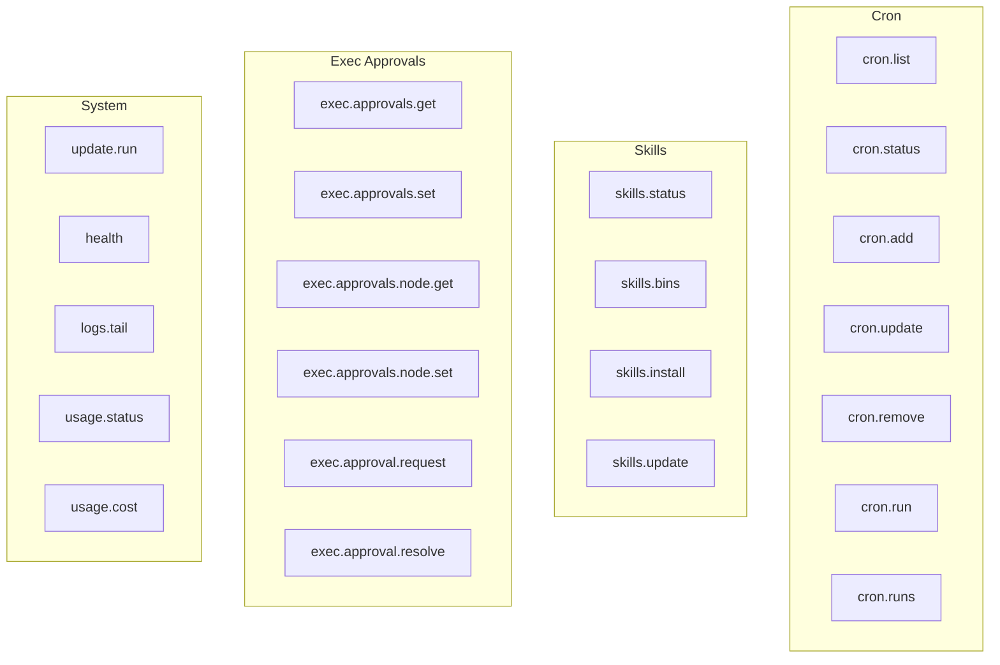

**ソース：** [src/gateway/server-methods-list.ts:40-76](), [src/gateway/server-methods/cron.ts](), [src/gateway/server-methods/skills.ts](), [src/gateway/server-methods/exec-approvals.ts]()

---

### WebChatメソッド

WebChatはリアルタイムチャットの特別なメソッドセットを使用します：

- `chat.history` → 以前のメッセージを取得
- `chat.send` → ユーザーメッセージを送信、`chat`イベントを介してエージェント応答をストリーミング
- `chat.abort` → 実行中の実行をキャンセル
- `chat.inject` → システムメッセージを注入（例：ファイル添付通知）

**ソース：** [src/gateway/server-methods/chat.ts](), [src/gateway/server-methods-list.ts:84-87]()

---

## スキーマ検証

すべてのプロトコルメッセージは**Ajv**と**TypeBox**スキーマを使用して検証されます。検証層は不正な要求を防止し、TypeScriptクライアントとゲートウェイ間の型安全性を確保します。

### バリデーターレジストリ

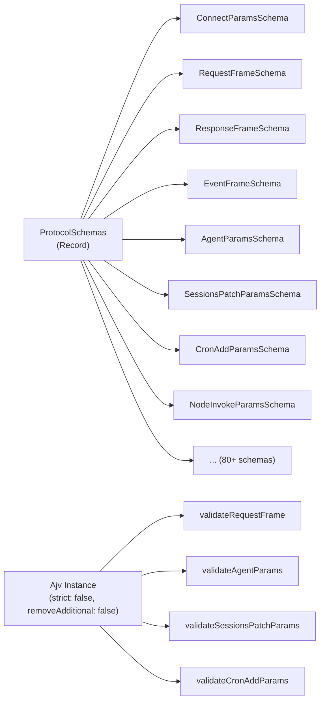

**スキーマからコンパイルされた主要なバリデーター：**
- `validateConnectParams` → [src/gateway/protocol/index.ts:229]()
- `validateRequestFrame` → [src/gateway/protocol/index.ts:230]()
- `validateResponseFrame` → [src/gateway/protocol/index.ts:231]()
- `validateEventFrame` → [src/gateway/protocol/index.ts:232]()
- `validateAgentParams` → [src/gateway/protocol/index.ts:235]()
- `validateSessionsPatchParams` → [src/gateway/protocol/index.ts:281]()
- `validateCronAddParams` → [src/gateway/protocol/index.ts:317]()
- `validateNodeInvokeParams` → [src/gateway/protocol/index.ts:269]()

**エラー形式化：** 検証が失敗した場合、`formatValidationErrors()` [src/gateway/protocol/index.ts:366-400]()はAjvエラーオブジェクトを人間可読のメッセージに変換し、インスタンスパスを提供します。例：
- `"at /params/message: must be non-empty string"`
- `"at root: unexpected property 'extraField'"`

この関数は`additionalProperties`エラーを特別に処理し、予期しないフィールドについてより明確なメッセージを提供します。

**ソース：** [src/gateway/protocol/index.ts:229-400](), [src/gateway/protocol/schema/protocol-schemas.ts:1-259]()

---

## プロトコルバージョン

プロトコルバージョンは[src/gateway/protocol/schema/protocol-schemas.ts:258]()で`PROTOCOL_VERSION = 3`として定義されています。この定数は成功した接続後の`HelloOk`応答で送信され、クライアントが互換性チェックに使用できます。

**バージョンハンドシェイク：**
1. クライアントが接続し、`ConnectParams`と共に`connect`要求を送信
2. ゲートウェイが`authorizeGatewayMethod()`で資格情報と役割を検証
3. ゲートウェイが`version: PROTOCOL_VERSION`を含む`HelloOk`で応答
4. クライアントがバージョンを保存し、機能検出に使用

プロトコルバージョンはフレーム構造またはコアメソッドシグネチャに重大な変更がある場合にインクリメントされます。

**ソース：** [src/gateway/protocol/schema/protocol-schemas.ts:258](), [src/gateway/protocol/schema/frames.ts](), [src/gateway/server-methods/connect.ts]()

---

## リクエストハンドラーパイプライン

すべての受信要求はこのパイプラインを通過します：

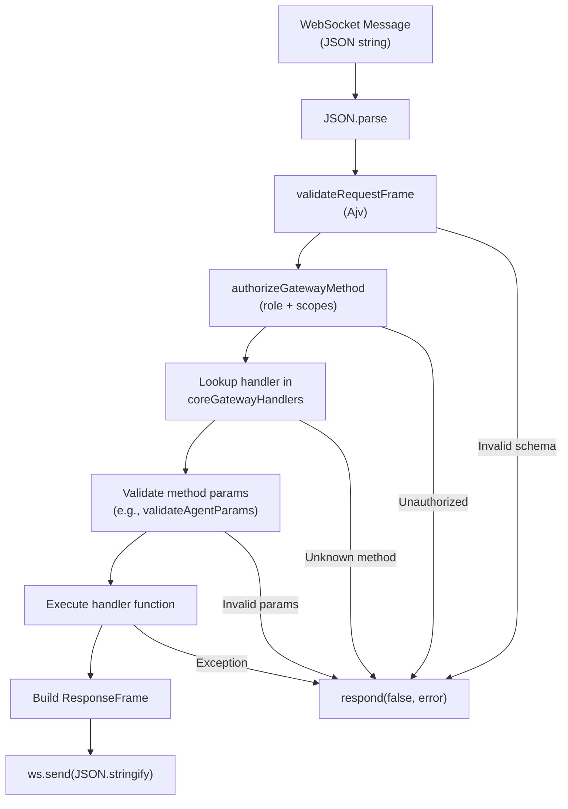

**ハンドラー登録：** すべてのコアハンドラーは`coreGatewayHandlers` [src/gateway/server-methods.ts:165-191]()でマージされます。

```mermaid
graph TB
    coreGatewayHandlers["coreGatewayHandlers<br/>(GatewayRequestHandlers)"]
    coreGatewayHandlers --> connectHandlers["connectHandlers<br/>server-methods/connect.ts"]
    coreGatewayHandlers --> logsHandlers["logsHandlers<br/>server-methods/logs.ts"]
    coreGatewayHandlers --> voicewakeHandlers["voicewakeHandlers<br/>server-methods/voicewake.ts"]
    coreGatewayHandlers --> healthHandlers["healthHandlers<br/>server-methods/health.ts"]
    coreGatewayHandlers --> channelsHandlers["channelsHandlers<br/>server-methods/channels.ts"]
    coreGatewayHandlers --> chatHandlers["chatHandlers<br/>server-methods/chat.ts"]
    coreGatewayHandlers --> cronHandlers["cronHandlers<br/>server-methods/cron.ts"]
    coreGatewayHandlers --> deviceHandlers["deviceHandlers<br/>server-methods/devices.ts"]
    coreGatewayHandlers --> execApprovalsHandlers["execApprovalsHandlers<br/>server-methods/exec-approvals.ts"]
    coreGatewayHandlers --> webHandlers["webHandlers<br/>server-methods/web.ts"]
    coreGatewayHandlers --> modelsHandlers["modelsHandlers<br/>server-methods/models.ts"]
    coreGatewayHandlers --> configHandlers["configHandlers<br/>server-methods/config.ts"]
    coreGatewayHandlers --> wizardHandlers["wizardHandlers<br/>server-methods/wizard.ts"]
    coreGatewayHandlers --> talkHandlers["talkHandlers<br/>server-methods/talk.ts"]
    coreGatewayHandlers --> ttsHandlers["ttsHandlers<br/>server-methods/tts.ts"]
    coreGatewayHandlers --> skillsHandlers["skillsHandlers<br/>server-methods/skills.ts"]
    coreGatewayHandlers --> sessionsHandlers["sessionsHandlers<br/>server-methods/sessions.ts"]
    coreGatewayHandlers --> systemHandlers["systemHandlers<br/>server-methods/system.ts"]
    coreGatewayHandlers --> updateHandlers["updateHandlers<br/>server-methods/update.ts"]
    coreGatewayHandlers --> nodeHandlers["nodeHandlers<br/>server-methods/nodes.ts"]
    coreGatewayHandlers --> sendHandlers["sendHandlers<br/>server-methods/send.ts"]
    coreGatewayHandlers --> usageHandlers["usageHandlers<br/>server-methods/usage.ts"]
    coreGatewayHandlers --> agentHandlers["agentHandlers<br/>server-methods/agent.ts"]
    coreGatewayHandlers --> agentsHandlers["agentsHandlers<br/>server-methods/agents.ts"]
    coreGatewayHandlers --> browserHandlers["browserHandlers<br/>server-methods/browser.ts"]
```

**ハンドラー実行：** `handleGatewayRequest()` [src/gateway/server-methods.ts:193-219]()は各メソッドをそのハンドラーにルーティングします：

1. `authorizeGatewayMethod()`で認可
2. `coreGatewayHandlers`または`extraHandlers`でハンドラーを検索
3. 検証されたパラメータでハンドラーを実行
4. `respond()`コールバック経由で`ResponseFrame`を返す

**ソース：** [src/gateway/server-methods.ts:1-220](), [src/gateway/server.impl.ts]()

---

## イベントストリーミング

イベントは対応する要求なしにゲートウェイからクライアントにプッシュされます。イベントは以下のために使用されます：

- **リアルタイムエージェント更新：** `agent`イベントはライフサイクルフェーズ、アシスタントテキストデルタ、ツールコール、推論トレース、デバッグログを運びます。`runId`フィールドはイベントを元の要求に関連付けます。
- **プレゼンス更新：** `presence`イベントはセッション/エージェントがアクティブまたはアイドルになったときに通知します。
- **Cron通知：** `cron`イベントはジョブ開始/完了を報告します。
- **ペアリングワークフロー：** `node.pair.requested` → オペレーターが承認 → `node.pair.resolved`。
- **実行承認：** `exec.approval.requested` → オペレーターが承認 → `exec.approval.resolved`。

**イベント発行アーキテクチャ：**

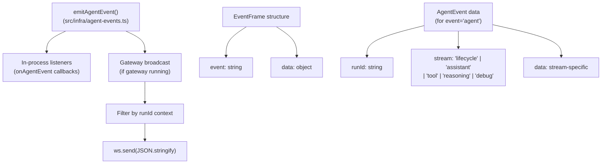

ゲートウェイサーバーは起動時にエージェントイベントリスナーを登録し、接続されたWebSocketクライアントにイベントをブロードキャストします。エージェントイベントの`runId`フィールドにより、クライアントはイベントを特定の要求に関連付けることができます。

**ソース：** [src/gateway/protocol/schema/frames.ts](), [src/infra/agent-events.ts](), [src/gateway/protocol/schema/agent.ts]()

---

## エラーコード

プロトコルは`ErrorCodes`列挙でエラーコードを定義します：

| コード | 意味 |
|------|---------|
| `INVALID_REQUEST` | 不正な形式の要求、不明なメソッド、未認可 |
| `INVALID_PARAMS` | メソッドパラメータのスキーマ検証失敗 |
| `METHOD_NOT_FOUND` | メソッドのハンドラーが登録されていない |
| `INTERNAL_ERROR` | ハンドラーでキャッチされない例外 |
| `UNAUTHORIZED` | トークン/パスワード認証失敗 |
| `FORBIDDEN` | 役割/スコープ検査失敗 |
| `NOT_FOUND` | リソース（セッション、ジョブ、ノード）が見つからない |
| `CONFLICT` | 状態競合（例：セッションが既に存在） |
| `RATE_LIMIT` | 要求が多すぎる |

**ソース：** [src/gateway/protocol/schema/error-codes.ts]()

---

## リクエスト/レスポンスフローの例

### エージェント実行

**リクエスト：**
```json
{
  "id": "req-123",
  "method": "agent",
  "params": {
    "message": "Hello",
    "sessionKey": "agent:main:telegram:12345",
    "thinking": "low",
    "deliver": true
  }
}
```

**レスポンス：**
```json
{
  "id": "req-123",
  "ok": true,
  "result": {
    "runId": "run-abc",
    "sessionId": "sess-456",
    "delivered": true
  }
}
```

**イベント（実行中にストリーミング）：**
```json
{"event": "agent", "data": {"runId": "run-abc", "stream": "lifecycle", "data": {"phase": "start"}}}
{"event": "agent", "data": {"runId": "run-abc", "stream": "assistant", "data": {"delta": "Hello! "}}}
{"event": "agent", "data": {"runId": "run-abc", "stream": "assistant", "data": {"delta": "How can I help?"}}}
{"event": "agent", "data": {"runId": "run-abc", "stream": "lifecycle", "data": {"phase": "end"}}}
```

**ソース：** [src/gateway/server-methods/agent.ts](), [src/commands/agent.ts:64-528]()

---

## WebSocket接続の例（TypeScript）

```typescript
import WebSocket from 'ws';

const ws = new WebSocket('ws://127.0.0.1:18789');

ws.on('open', () => {
  // Send connect handshake
  ws.send(JSON.stringify({
    id: 'connect-1',
    method: 'connect',
    params: {
      token: process.env.GATEWAY_TOKEN,
      role: 'operator',
      scopes: ['operator.write']
    }
  }));
});

ws.on('message', (data) => {
  const frame = JSON.parse(data.toString());

  if (frame.id === 'connect-1' && frame.ok) {
    console.log('Connected, version:', frame.result.version);

    // Now send agent request
    ws.send(JSON.stringify({
      id: 'agent-1',
      method: 'agent',
      params: { message: 'Hello', sessionKey: 'agent:main:main' }
    }));
  }

  if (frame.event === 'agent') {
    console.log('Agent event:', frame.data);
  }

  if (frame.id === 'agent-1') {
    console.log('Agent response:', frame.result);
  }
});
```

**ソース：** [src/gateway/protocol/index.ts:1-595](), [src/gateway/server.impl.ts]()

---

## 外部クライアント用スキーマエクスポート

ゲートウェイは`config.schema`メソッドを介して完全なJSONスキーマを外部クライアントにエクスポートできます。これにより、非TypeScriptクライアント（Swift、Python、Go）は型とバリデーターを生成できます。

**リクエスト：**
```json
{"id": "1", "method": "config.schema", "params": {}}
```

**レスポンス：**
```json
{
  "id": "1",
  "ok": true,
  "result": {
    "schemas": {
      "ConnectParams": { "$schema": "...", "type": "object", ... },
      "RequestFrame": { ... },
      "AgentParams": { ... }
    }
  }
}
```

macOS/iOSアプリはこれを使用して`scripts/protocol-gen-swift.ts`を介してSwift Codableモデルを生成します。

**ソース：** [src/gateway/server-methods/config.ts](), [scripts/protocol-gen-swift.ts]()

---