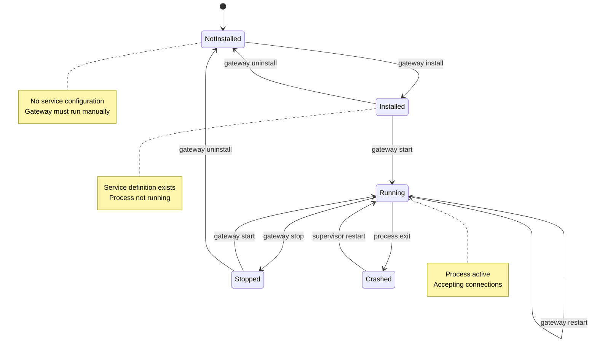
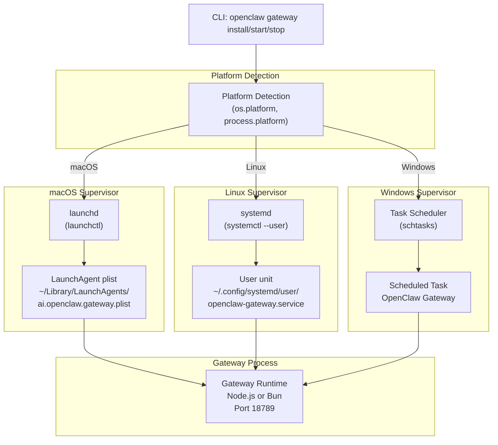
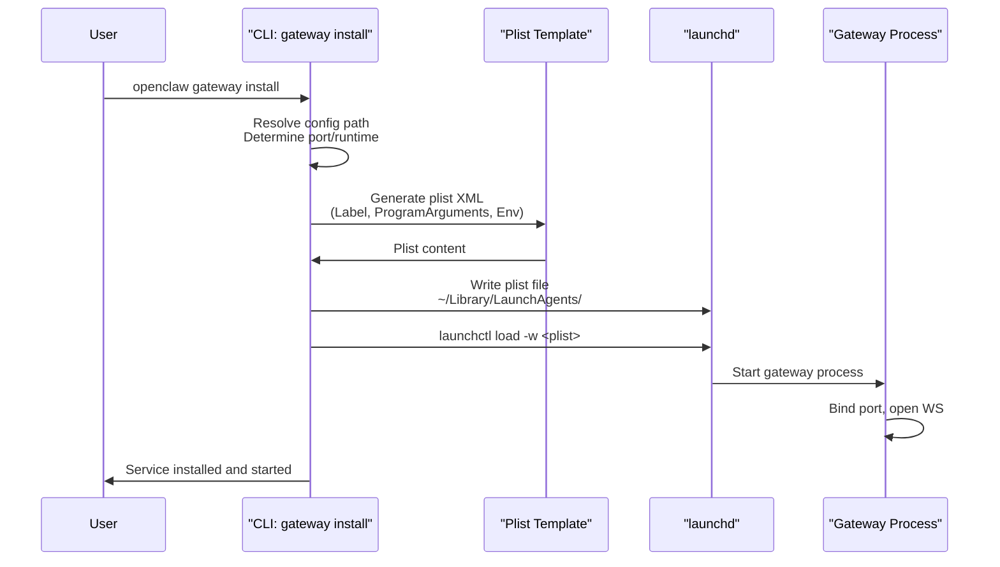
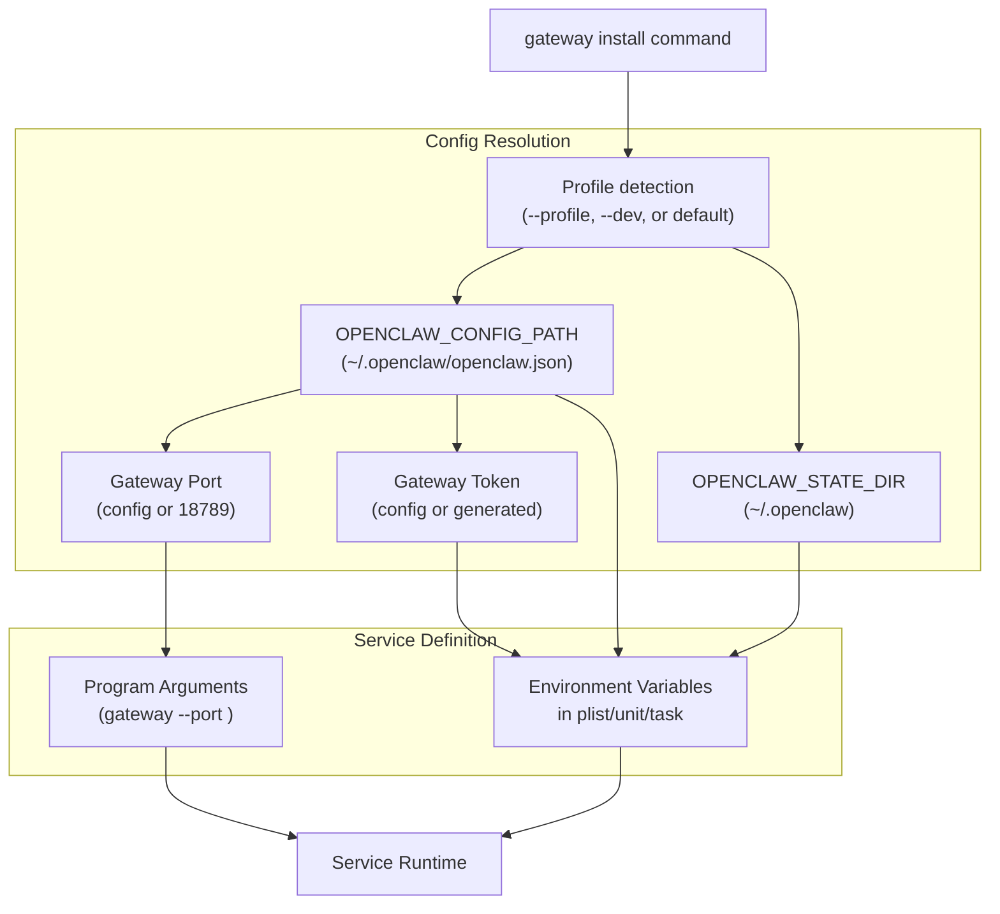
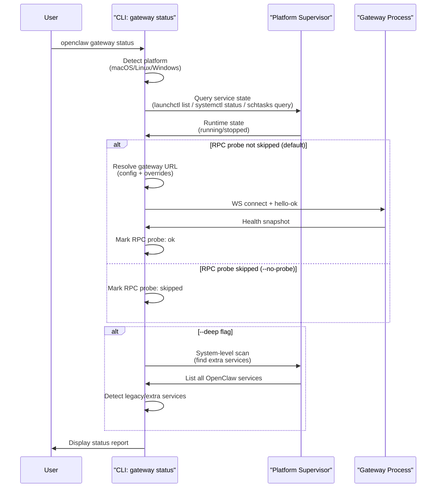
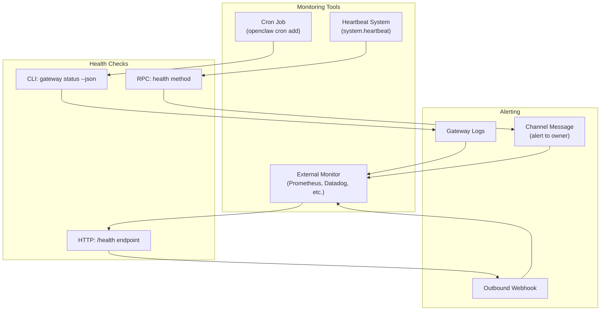
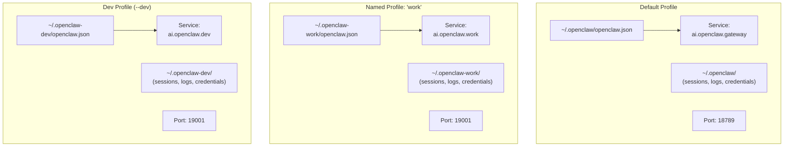
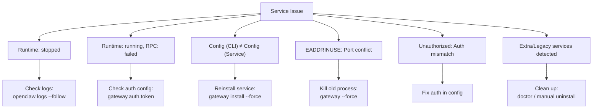

# ゲートウェイサービス管理

<details>
<summary>関連ソースファイル</summary>

以下のファイルがこのwikiページの作成に使用されました：

- [README.md](README.md)
- [assets/avatar-placeholder.svg](assets/avatar-placeholder.svg)
- [docs/channels/zalo.md](docs/channels/zalo.md)
- [docs/channels/zalouser.md](docs/channels/zalouser.md)
- [docs/cli/index.md](docs/cli/index.md)
- [docs/docs.json](docs/docs.json)
- [docs/gateway/index.md](docs/gateway/index.md)
- [docs/gateway/troubleshooting.md](docs/gateway/troubleshooting.md)
- [docs/index.md](docs/index.md)
- [docs/start/getting-started.md](docs/start/getting-started.md)
- [docs/start/hubs.md](docs/start/hubs.md)
- [docs/start/onboarding.md](docs/start/onboarding.md)
- [docs/start/wizard.md](docs/start/wizard.md)
- [scripts/clawtributors-map.json](scripts/clawtributors-map.json)
- [scripts/update-clawtributors.ts](scripts/update-clawtributors.ts)
- [scripts/update-clawtributors.types.ts](scripts/update-clawtributors.types.ts)
- [src/config/config.ts](src/config/config.ts)
- [src/index.test.ts](src/index.test.ts)
- [src/index.ts](src/index.ts)
- [tsconfig.json](tsconfig.json)
- [ui/src/styles.css](ui/src/styles.css)
- [ui/src/styles/layout.mobile.css](ui/src/styles/layout.mobile.css)

</details>


このドキュメントでは、監視されたバックグラウンドサービスとしてのゲートウェイの運用ライフサイクルを扱います：インストール、設定、開始/停止/再起動操作、プラットフォーム固有のスーパーバイザー統合（launchd、systemd、Windowsタスクスケジューラ）、ヘルスモニタリング、およびマルチインスタンス管理。

ゲートウェイの実行時設定と設定については[ゲートウェイ設定](#3.1)を参照してください。WebSocketプロトコルとRPCメソッドについては[ゲートウェイプロトコル](#3.2)を参照してください。ネットワークアクセスとリモート接続については[リモートアクセス](#3.4)を参照してください。

---

## 目的と範囲

ゲートウェイはチャネル接続、セッション状態、WebSocket制御プレーン接続を維持する長時間実行プロセスとして実行されます。本番および開発のワークフローでは、ゲートウェイはブート時に自動的に開始し、クラッシュ時に再起動する監視サービスとして実行されるべきです。

このページでは以下を文書化します：
- サービスのインストールとアンインストール手順
- プラットフォーム固有のスーパーバイザー統合（launchd、systemd、schtasks）
- サービスライフサイクル操作（開始、停止、再起動、状態確認）
- ヘルスチェックメカニズムとモニタリング
- マルチプロファイルとマルチインスタンスのデプロイパターン
- 一般的なサービス障害モードと回復手順

---

## サービスライフサイクル概要

ゲートウェイサービスライフサイクルはすべてのプラットフォームで標準的なスーパーバイザーパターンに従います。CLIはプラットフォーム固有の実装に委譲する統一インターフェースを提供します。

### サービスステートマシン



**ソース：** [docs/gateway/index.md:119-162](), [docs/cli/index.md:652-700]()

### コアサービスコマンド

| コマンド | 目的 | 効果 |
|---------|---------|--------|
| `gateway install` | サービス定義を作成 | launchd plist / systemdユニット / タスクを書き込み |
| `gateway uninstall` | サービス定義を削除 | プロセスを停止しサービスファイルを削除 |
| `gateway start` | サービスプロセスを開始 | スーパーバイザー経由でアクティブ化（launchd load / systemctl start / schtasks run） |
| `gateway stop` | サービスプロセスを停止 | スーパーバイザー経由で非アクティブ化 |
| `gateway restart` | サービスプロセスを再起動 | 停止 + 開始のアトミック操作 |
| `gateway status` | サービス状態を照会 | 実行時状態とオプションのRPCプローブを表示 |

**ソース：** [docs/cli/index.md:678-700](), [docs/gateway/index.md:122-162]()

---

## プラットフォーム固有の実装

ゲートウェイサービスは各プラットフォームのネイティブスーパーバイザーと統合し、自動起動、クラッシュ時の回復、クリーンシャットダウンを保証します。

### アーキテクチャ概要



**ソース：** [docs/gateway/index.md:119-162](), [README.md:56]()

### macOS: launchd

ゲートウェイはログイン時に自動的に開始する**LaunchAgent**（ユーザーごとのサービス）としてインストールされます。

#### サービスラベルパターン

- デフォルトプロファイル：`ai.openclaw.gateway`
- 名前付きプロファイル：`ai.openclaw.<profile>`

#### サービスファイルの場所

```
~/Library/LaunchAgents/ai.openclaw.gateway.plist
~/Library/LaunchAgents/ai.openclaw.<profile>.plist  # named profiles
```

#### インストールフロー



**ソース：** [docs/gateway/index.md:123-133](), [README.md:56]()

#### サービス操作

```bash
# Install service (creates plist + loads)
openclaw gateway install

# Start service
openclaw gateway start
# or: launchctl start ai.openclaw.gateway

# Stop service
openclaw gateway stop
# or: launchctl stop ai.openclaw.gateway

# Restart service
openclaw gateway restart
# or: launchctl restart ai.openclaw.gateway

# Check status
openclaw gateway status

# Uninstall service (stops + removes plist)
openclaw gateway uninstall
```

**Plistでの主要な設定パラメータ：**
- `Label`: サービス識別子（例：`ai.openclaw.gateway`）
- `ProgramArguments`: node/bunへのパス + CLIスクリプト + 引数
- `WorkingDirectory`: 状態ディレクトリ（例：`~/.openclaw`）
- `EnvironmentVariables`: `OPENCLAW_CONFIG_PATH`、`OPENCLAW_STATE_DIR`、認証トークン
- `StandardOutPath` / `StandardErrorPath`: ログファイルパス
- `KeepAlive`: 再起動ポリシー（通常は`true`）
- `RunAtLoad`: ブート時に開始（通常は`true`）

**ソース：** [docs/gateway/index.md:123-133](), [docs/cli/index.md:678-700]()

---

### Linux: systemd（ユーザーサービス）

ゲートウェイは現在のユーザーのセッションで実行される**systemdユーザーサービス**としてインストールされます。システム全体のサービスについては、以下のシステムサービスパターンを参照してください。

#### サービスユニットパターン

- デフォルトプロファイル：`openclaw-gateway.service`
- 名前付きプロファイル：`openclaw-gateway-<profile>.service`

#### サービスファイルの場所

```
~/.config/systemd/user/openclaw-gateway.service
~/.config/systemd/user/openclaw-gateway-<profile>.service  # named profiles
```

#### インストールフロー

```bash
# Install service (generates unit file)
openclaw gateway install

# Enable service to start on boot
systemctl --user enable openclaw-gateway.service

# Start service now
systemctl --user start openclaw-gateway.service

# Enable lingering (persist after logout)
sudo loginctl enable-linger $USER
```

**ソース：** [docs/gateway/index.md:136-149](), [README.md:56]()

#### サービス操作

```bash
# Install service
openclaw gateway install

# Enable + start
systemctl --user enable --now openclaw-gateway.service

# Stop service
systemctl --user stop openclaw-gateway.service

# Restart service
systemctl --user restart openclaw-gateway.service

# Check status
systemctl --user status openclaw-gateway.service
# or: openclaw gateway status

# View logs
journalctl --user -u openclaw-gateway.service -f

# Uninstall service
openclaw gateway uninstall
```

**ユニットファイルでの主要な設定パラメータ：**
- `[Unit]`セクション：`Description`、`After=network.target`
- `[Service]`セクション：
  - `Type=simple`
  - `ExecStart`: node/bunへのパス + CLIスクリプト + 引数
  - `WorkingDirectory`: 状態ディレクトリ
  - `Environment`: 設定パス、状態ディレクトリ、認証トークン
  - `Restart=always`（クラッシュ時の自動再起動）
  - `StandardOutput=journal` / `StandardError=journal`
- `[Install]`セクション：`WantedBy=default.target`

#### リンガリングによる永続化：

デフォルトでは、ユーザーサービスはユーザーがログアウトすると停止します。ゲートウェイをログアウト後も実行し続けるには：

```bash
sudo loginctl enable-linger $USER
```

**ソース：** [docs/gateway/index.md:136-149]()

---

### Linux: systemd（システムサービス）

マルチユーザーホストまたは常時稼働デプロイメントの場合、ゲートウェイはユーザーセッションから独立して実行される**システムサービス**としてインストールします。

#### サービスファイルの場所

```
/etc/systemd/system/openclaw-gateway.service
/etc/systemd/system/openclaw-gateway-<profile>.service  # named profiles
```

#### インストール時の考慮事項

- サービスのインストールと管理には`sudo`が必要
- サービスは専用ユーザー（例：`openclaw`）として実行
- 設定ファイルと状態ディレクトリはサービスユーザーからアクセス可能でなければならない
- 環境変数はユニットファイルで設定される必要がある

#### サービス操作

```bash
# Install system service (manual or via deployment script)
sudo cp openclaw-gateway.service /etc/systemd/system/
sudo systemctl daemon-reload

# Enable + start
sudo systemctl enable --now openclaw-gateway.service

# Stop service
sudo systemctl stop openclaw-gateway.service

# Restart service
sudo systemctl restart openclaw-gateway.service

# Check status
sudo systemctl status openclaw-gateway.service

# View logs
sudo journalctl -u openclaw-gateway.service -f
```

**ソース：** [docs/gateway/index.md:151-162]()

---

### Windows: タスクスケジューラ（schtasks）

ゲートウェイはユーザーログオン時に実行される**スケジュールされたタスク**としてインストールされます。Windowsサポートは主にWSL2経由ですが、ネイティブWindowsデプロイではタスクスケジューラがサービス管理に使用されます。

#### サー�icスタスクパターン

- デフォルトプロファイル：`OpenClaw Gateway`
- 名前付きプロファイル：`OpenClaw Gateway (<profile>)`

#### インストールフロー

```powershell
# Install service (creates scheduled task)
openclaw gateway install

# Start service
openclaw gateway start

# Stop service
openclaw gateway stop

# Check status
openclaw gateway status
```

**タスクでの主要な設定パラメータ：**
- タスク名：`OpenClaw Gateway`または`OpenClaw Gateway (<profile>)`
- トリガー：現在のユーザーのログオン時
- アクション：プログラムを開始（node.exeまたはbun.exe）と引数
- 作業ディレクトリ：状態ディレクトリ
- ユーザーがログオンしていなくても実行（パスワードが必要）
- 失敗時の再起動ポリシー

**ソース：** [docs/gateway/index.md:119-162]()

---

## サービスインストールと設定

### インストールコマンド

`gateway install`コマンドはプラットフォーム固有のサービス定義を作成し、オプションでサービスを開始します。

```bash
# Install with defaults
openclaw gateway install

# Install with specific port
openclaw gateway install --port 19001

# Install with specific runtime (Node recommended, Bun not recommended for WhatsApp/Telegram)
openclaw gateway install --runtime node

# Install with explicit token (stored in service env)
openclaw gateway install --token <token>

# Install for named profile
openclaw --profile myprofile gateway install

# Force reinstall (overwrites existing service)
openclaw gateway install --force

# JSON output for scripting
openclaw gateway install --json
```

**ソース：** [docs/cli/index.md:697-700](), [docs/gateway/index.md:122-133]()

### 設定解決

サービス定義には、一貫した設定を保証するために以下の環境変数が埋め込まれます：



**ソース：** [docs/gateway/index.md:174-194](), [docs/cli/index.md:693-694]()

### ランタイム選択

`--runtime`フラグはサービスプロセスのNode.jsまたはBun実行ファイルを選択します。

| ランタイム | 推奨 | 備考 |
|---------|----------------|-------|
| `node` | ✅ 推奨 | デフォルト；安定したWhatsApp/Telegramサポート |
| `bun` | ⚠️ 非推奨 | WhatsApp/Telegramのバグ；開発/テストのみに使用 |

**ソース：** [docs/cli/index.md:699](), [docs/gateway/index.md:699]()

---

## サービス操作

### サービスの開始

```bash
# Start via CLI (delegates to platform supervisor)
openclaw gateway start

# Platform-specific alternatives:
# macOS:
launchctl start ai.openclaw.gateway

# Linux (user):
systemctl --user start openclaw-gateway.service

# Windows:
schtasks /Run /TN "OpenClaw Gateway"
```

**期待される動作：**
- プロセスが開始し、設定されたポート（デフォルト18789）にバインド
- WebSocketサーバーが接続を受け付け
- チャネルモニターが初期化（WhatsApp、Telegram、Discordなど）
- ヘルスエンドポイントが利用可能に
- ログに"Gateway started"と表示

**ソース：** [docs/gateway/index.md:23-55](), [docs/cli/index.md:687-689]()

### サービスの停止

```bash
# Stop via CLI
openclaw gateway stop

# Platform-specific alternatives:
# macOS:
launchctl stop ai.openclaw.gateway

# Linux (user):
systemctl --user stop openclaw-gateway.service

# Windows:
schtasks /End /TN "OpenClaw Gateway"
```

**期待される動作：**
- WebSocketサーバーが適切にクローズ
- アクティブな接続が`shutdown`イベントを受信
- チャネル接続がクリーンに切断
- プロセスがコード0で終了

**ソース：** [docs/gateway/index.md:87-98](), [docs/cli/index.md:688]()

### サービスの再起動

```bash
# Restart via CLI (atomic stop + start)
openclaw gateway restart

# Platform-specific alternatives:
# macOS:
launchctl restart ai.openclaw.gateway

# Linux (user):
systemctl --user restart openclaw-gateway.service

# Windows:
schtasks /End /TN "OpenClaw Gateway" && schtasks /Run /TN "OpenClaw Gateway"
```

**再起動が必要な場合：**
- プロセスの再起動を必要とする設定変更後（ポート、バインド、認証など）
- npmパッケージのインストールまたは依存関係の更新後
- ホットリロードが失敗または無効の場合（`gateway.reload.mode=off`または`restart`）

**ソース：** [docs/gateway/index.md:127-129](), [docs/cli/index.md:689]()

### サービス状態とヘルス

`gateway status`コマンドは実行中サービスの運用可視性を提供します。

```bash
# Basic status (shows runtime state + RPC probe)
openclaw gateway status

# Skip RPC probe (just check supervisor state)
openclaw gateway status --no-probe

# Deep scan (includes system-level supervisor audit)
openclaw gateway status --deep

# JSON output for scripting
openclaw gateway status --json
```

**状態出力には以下が含まれます：**
- **Runtime:** `running | stopped | unknown`
- **RPC Probe:** `ok | failed | skipped`
- **Config Path (CLI):** CLIコマンドが使用したパス
- **Config Path (Service):** サービス定義に埋め込まれたパス（異なる場合あり）
- **Gateway URL:** 解決されたプローブ対象（プロトコル、ホスト、ポートを表示）
- **Extra Services:** 検出されたレガシーまたは名前付きプロファイルのサービス（警告あり）

**ソース：** [docs/cli/index.md:684-695](), [docs/gateway/index.md:139-142]()

### 状態フローダイアグラム



**ソース：** [docs/cli/index.md:684-695](), [docs/gateway/troubleshooting.md:92-120]()

---

## ヘルスモニタリング

ゲートウェイは運用モニタリングと自動アラート用に複数のヘルスチェックメカニズムを提供します。

### ヘルスチェックエンドポイントとメソッド

| メソッド | タイプ | 目的 |
|--------|------|---------|
| `gateway status` | CLI | スーパーバイザー状態 + オプションのRPCプローブ |
| `health` RPCメソッド | WebSocket | コントロールプレーン経由のヘルススナップショット |
| `health` CLIコマンド | CLI | RPC経由の直接ヘルス照会 |
| HTTP `/health` (if exposed) | HTTP | 基本的なライブネスチェック |

**ソース：** [docs/gateway/index.md:139-142](), [docs/cli/index.md:596-604]()

### ヘルスチェックデータ構造

ヘルススナップショットには以下が含まれます：

- **uptime:** プロセスの稼働時間（ミリ秒）
- **stateVersion:** 状態バージョンカウンター（設定の再読み込み時に増加）
- **channels:** チャネルごとの接続状態（接続済み/未接続）
- **nodes:** ペアリングされたデバイスノードの状態（オンライン/オフライン）
- **sessions:** アクティブセッション数
- **constraints:** レート制限とクォータの状態

**ソース：** [docs/gateway/index.md:196-208]()

### 自動化ヘルスモニタリングパターン



**ソース：** [docs/gateway/index.md:219-227](), [docs/automation/cron-jobs.md](), [docs/gateway/heartbeat.md]()

### ヘルスチェックスクリプトの例

```bash
#!/bin/bash
# Example health check script for cron or monitoring systems

STATUS_JSON=$(openclaw gateway status --json --timeout 10000)
RUNTIME=$(echo "$STATUS_JSON" | jq -r '.runtime')
PROBE=$(echo "$STATUS_JSON" | jq -r '.probe')

if [ "$RUNTIME" != "running" ] || [ "$PROBE" != "ok" ]; then
  echo "Gateway unhealthy: runtime=$RUNTIME probe=$PROBE"
  exit 1
fi

echo "Gateway healthy"
exit 0
```

**ソース：** [docs/cli/index.md:694]()

---

## マルチプロファイルとマルチインスタンス

ゲートウェイはプロファイルを使用して同じホスト上で複数の分離されたインスタンスを実行をサポートします。各プロファイルは独立した設定、状態、サービス登録を持ちます。

### プロファイルの分離



**ソース：** [docs/gateway/index.md:164-194](), [docs/cli/index.md:56-61]()

### プロファイル管理

```bash
# Default profile
openclaw gateway install
openclaw gateway start

# Named profile
openclaw --profile work gateway install --port 19001
openclaw --profile work gateway start

# Dev profile (predefined isolation)
openclaw --dev gateway install
openclaw --dev gateway start
```

**プロファイル固有のサービスラベル：**
- macOS: `ai.openclaw.<profile>`
- Linux: `openclaw-gateway-<profile>.service`
- Windows: `OpenClaw Gateway (<profile>)`

**ソース：** [docs/gateway/index.md:164-194](), [docs/cli/index.md:56-58]()

### マルチインスタンスチェックリスト

同じホスト上で複数のゲートウェイインスタンスを実行する場合、各インスタンスが以下を持つことを確認してください：

- ✅ **一意のポート**（設定の`gateway.port`または`--port`フラグ）
- ✅ **一意の設定パス**（`OPENCLAW_CONFIG_PATH`または`--profile`）
- ✅ **一意の状態ディレクトリ**（`OPENCLAW_STATE_DIR`または`--profile`）
- ✅ **一意のワークスペース**（設定の`agents.defaults.workspace`）
- ✅ **一意のサービスラベル**（`--profile`使用時は自動）

**ソース：** [docs/gateway/index.md:164-194]()

---

## サービス問題のトラブルシューティング

### 一般的な障害モード



**ソース：** [docs/gateway/troubleshooting.md:92-120]()

### 診断コマンド階層

サービス問題のトラブルシューティング時に順番にこれらのコマンドを実行します：

```bash
# 1. Check service status (basic)
openclaw gateway status

# 2. Check deep status (includes system-level audit)
openclaw gateway status --deep

# 3. View live logs
openclaw logs --follow

# 4. Run config/service diagnostics
openclaw doctor

# 5. Check channel connectivity
openclaw channels status --probe
```

**ソース：** [docs/gateway/troubleshooting.md:14-55](), [docs/gateway/index.md:96-99]()

### サービスが実行されていない

**症状：**
- `gateway status`が`Runtime: stopped`を表示
- スーパーバイザー照会がサービスが読み込まれていないまたは非アクティブを表示

**解決手順：**

```bash
# Check supervisor state
# macOS:
launchctl list | grep openclaw
launchctl print user/$(id -u)/ai.openclaw.gateway

# Linux:
systemctl --user status openclaw-gateway.service

# If service not installed:
openclaw gateway install

# If service installed but stopped:
openclaw gateway start

# If service keeps crashing:
openclaw logs --follow  # check exit reason
openclaw doctor         # check config validity
```

**一般的な原因：**
- サービスがインストールされていない（`gateway install`が実行されていない）
- 無効な設定（`doctor`で検出）
- ポート競合（`EADDRINUSE`）
- 認証設定ミス（非ループバックバインドで認証なし）

**ソース：** [docs/gateway/troubleshooting.md:92-120]()

### サービスは実行されているが応答しない

**症状：**
- `gateway status`が`Runtime: running`を表示するが`RPC probe: failed`を表示
- WebSocketまたはCLIで接続できない

**解決手順：**

```bash
# Check actual bind address
openclaw logs --follow | grep "Gateway started"
# Look for: "Gateway started on ws://127.0.0.1:18789"

# Check auth configuration
openclaw config get gateway.auth.mode
openclaw config get gateway.auth.token

# Try explicit connection
openclaw gateway health --url ws://127.0.0.1:18789 --token <token>

# If auth is the issue:
openclaw config set gateway.auth.token <token>
openclaw gateway restart
```

**一般的な原因：**
- 認証トークンの不一致（CLI vsサービス）
- バインドアドレスの不一致（サービスが異なるインターフェースにバインド）
- ファイアウォールによるループバック接続のブロック
- ゲートウェイがバインドしているが接続を受け入れていない（クラッシュループ）

**ソース：** [docs/gateway/troubleshooting.md:73-91](), [docs/gateway/index.md:106-116]()

### 設定パスの不一致

**症状：**
- `gateway status`がCLIとサービスで異なる設定パスを表示
- 設定の変更が実行中のサービスに影響しない

**解決手順：**

```bash
# Check config paths
openclaw gateway status
# Look for "Config (cli): X" vs "Config (service): Y"

# Option 1: Update CLI to match service
export OPENCLAW_CONFIG_PATH=/path/to/service/config.json

# Option 2: Reinstall service to match CLI
openclaw gateway install --force
openclaw gateway restart
```

**一般的な原因：**
- サービス用に環境変数が設定されているがCLI用ではない
- あいまいな設定解決を持つ複数のプロファイル
- 明示的な`--profile`でインストールされたサービスだが、CLIがそれなしで実行

**ソース：** [docs/cli/index.md:693-694](), [docs/gateway/troubleshooting.md:249-313]()

### ポート競合

**症状：**
- サービスが`EADDRINUSE`エラーで開始に失敗
- ログに"another gateway instance is already listening"と表示

**解決手順：**

```bash
# Find process using the port
lsof -i :18789        # macOS/Linux
netstat -ano | findstr :18789  # Windows

# Kill the process
kill <pid>            # macOS/Linux
taskkill /PID <pid>   # Windows

# Or force restart (kills conflicting process)
openclaw gateway --force

# For service:
openclaw gateway restart --force
```

**一般的な原因：**
- 同じポート上の複数のゲートウェイインスタンス
- 前のプロセスが適切に終了していない
- サービス定義に間違ったポートがあり、CLIオーバーライドと競合

**ソース：** [docs/gateway/troubleshooting.md:92-120](), [docs/gateway/index.md:229-236]()

### 余分またはレガシーサービス

**症状：**
- `gateway status --deep`に余分なサービスに関する警告が表示
- 意図せず複数のインスタンスが実行されている

**解決手順：**

```bash
# Audit services
openclaw gateway status --deep
openclaw doctor --deep

# Uninstall extra services (example for macOS):
launchctl unload ~/Library/LaunchAgents/ai.openclaw.gateway-old.plist
rm ~/Library/LaunchAgents/ai.openclaw.gateway-old.plist

# For Linux:
systemctl --user stop openclaw-gateway-old.service
systemctl --user disable openclaw-gateway-old.service
rm ~/.config/systemd/user/openclaw-gateway-old.service
systemctl --user daemon-reload

# Note: Profile-named services (e.g., ai.openclaw.work) are NOT flagged as extra
```

**余分なサービスが有効な場合：**
- 名前付きプロファイル（例：`--profile work`）は正当な独立したサービスを作成
- これらはファーストクラスとして扱われ、フラグは立てられない

**ソース：** [docs/gateway/troubleshooting.md:289-295](), [docs/cli/index.md:694-695]()

---

## サービス設定リファレンス

### サービス定義での環境変数

サービス定義にはゲートウェイの実行時を制御する環境変数が埋め込まれます：

| 変数 | 目的 | 例 |
|----------|---------|---------|
| `OPENCLAW_CONFIG_PATH` | 設定ファイルの場所 | `~/.openclaw/openclaw.json` |
| `OPENCLAW_STATE_DIR` | 状態ディレクトリ | `~/.openclaw` |
| `OPENCLAW_GATEWAY_PORT` | ゲートウェイポート（オーバーライド） | `18789` |
| `OPENCLAW_GATEWAY_TOKEN` | 認証トークン（オーバーライド） | `abc123...` |
| `OPENCLAW_GATEWAY_PASSWORD` | 認証パスワード（オーバーライド） | `hunter2` |

**ソース：** [docs/help/environment.md](), [docs/gateway/index.md:70-78]()

### サービス定義テンプレート

各プラットフォームはサービス定義に異なるテンプレート形式を使用します。CLIは`gateway install`中にこれらを自動的に生成します。

**macOS Launchd Plist (XML)：**
- テンプレートに含まれる：Label、ProgramArguments、WorkingDirectory、EnvironmentVariables、StandardOutPath、StandardErrorPath、KeepAlive、RunAtLoad

**Linux Systemd Unit (INI)：**
- テンプレートに含まれる：[Unit] Description/After、[Service] Type/ExecStart/WorkingDirectory/Environment/Restart、[Install] WantedBy

**Windows Task Scheduler (XML)：**
- テンプレートに含まれる：タスク名、トリガー（At logon）、アクション（Start program）、設定（Restart on failure）

**ソース：** [docs/gateway/index.md:123-162]()

---

## 関連ドキュメント

- [ゲートウェイ設定](#3.1) - ゲートウェイ設定、ポート、バインドモード、認証を設定
- [ゲートウェイプロトコル](#3.2) - WebSocket RPCプロトコルとメッセージスキーマ
- [リモートアクセス](#3.4) - SSHトンネル、Tailscale、リモートゲートウェイパターン
- [ゲートウェイ実行マニュアル](/gateway/index) - 運用手順と日次操作
- [ゲートウェイトラブルシューティング](/gateway/troubleshooting) - 深層診断手順

---