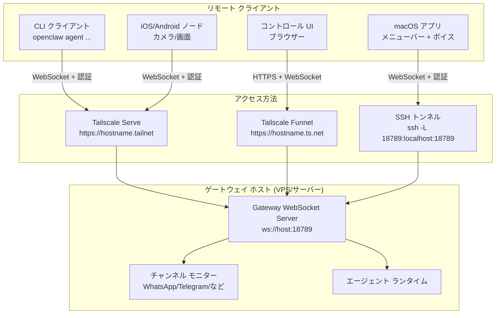
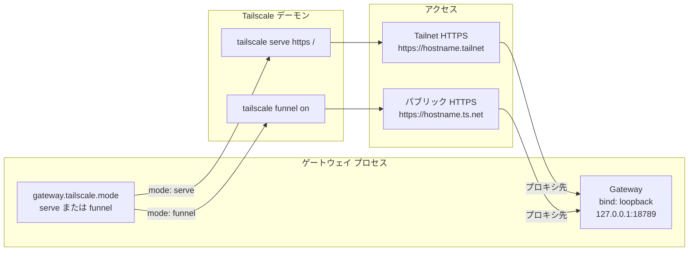
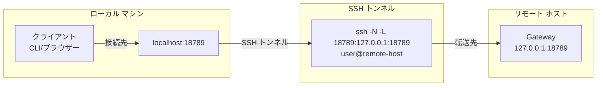
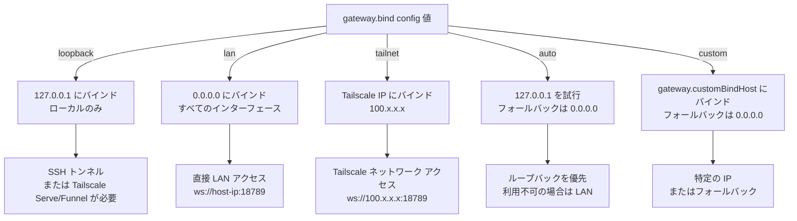
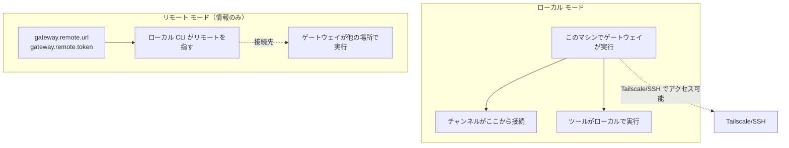
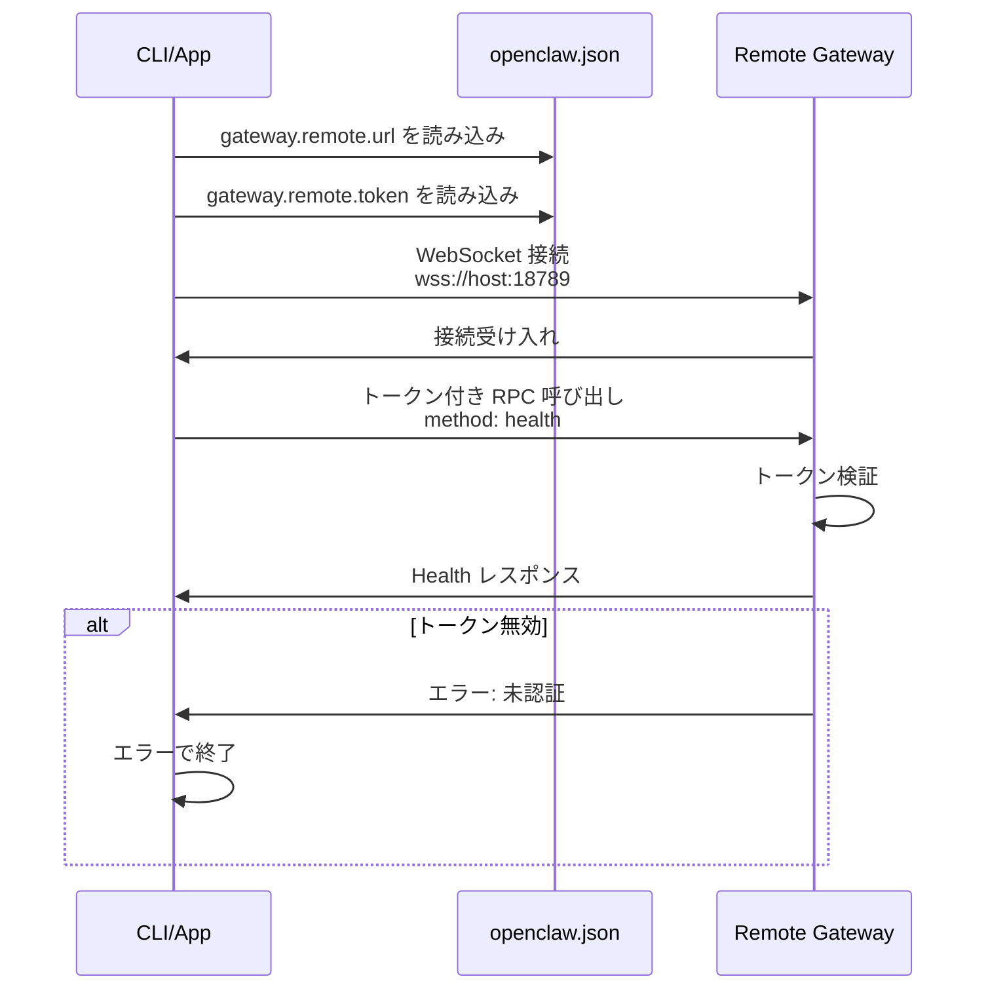
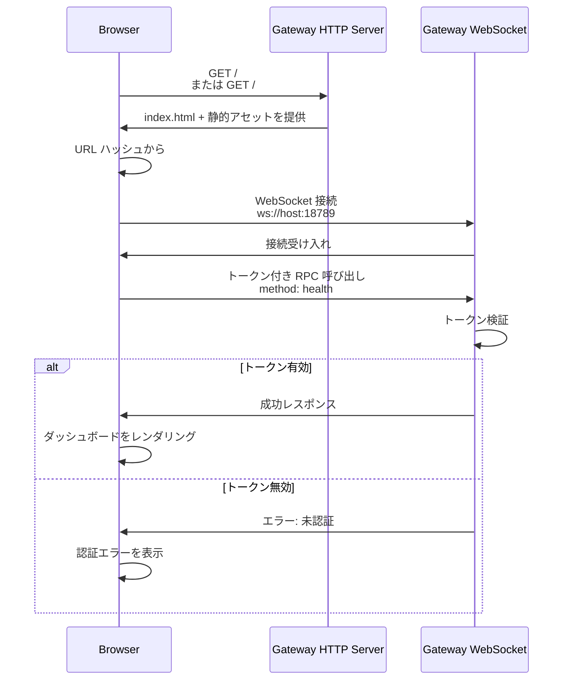
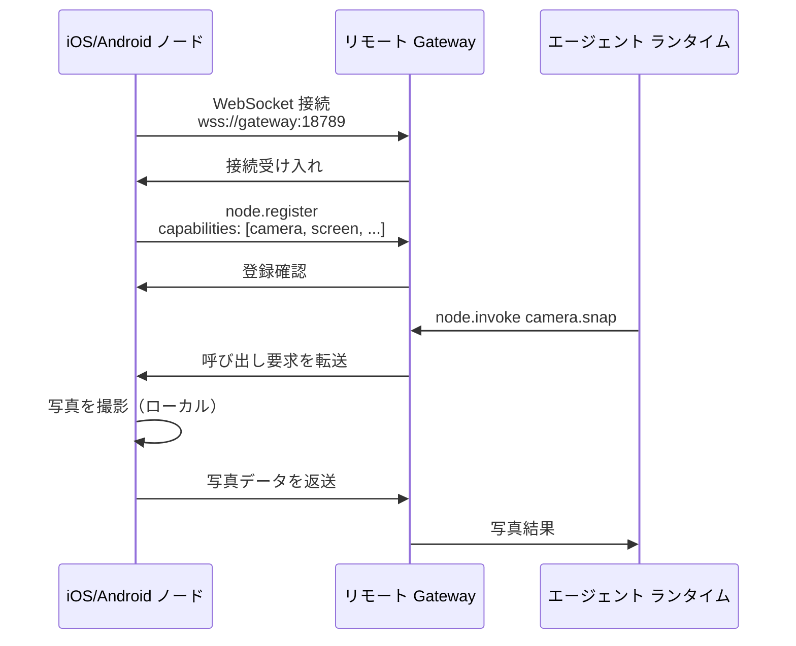

# ページ: リモートアクセス

# リモートアクセス

<details>
<summary>関連ソースファイル</summary>

この wiki ページの作成に使用されたコンテキストとして、以下のファイルが利用されました：

- [README.md](README.md)
- [assets/avatar-placeholder.svg](assets/avatar-placeholder.svg)
- [docs/channels/zalo.md](docs/channels/zalo.md)
- [docs/channels/zalouser.md](docs/channels/zalouser.md)
- [docs/gateway/doctor.md](docs/gateway/doctor.md)
- [scripts/clawtributors-map.json](scripts/clawtributors-map.json)
- [scripts/update-clawtributors.ts](scripts/update-clawtributors.ts)
- [scripts/update-clawtributors.types.ts](scripts/update-clawtributors.types.ts)
- [src/agents/bash-tools.test.ts](src/agents/bash-tools.test.ts)
- [src/agents/pi-tools-agent-config.test.ts](src/agents/pi-tools-agent-config.test.ts)
- [src/agents/sandbox-skills.test.ts](src/agents/sandbox-skills.test.ts)
- [src/commands/configure.gateway.test.ts](src/commands/configure.gateway.test.ts)
- [src/commands/configure.gateway.ts](src/commands/configure.gateway.ts)
- [src/commands/configure.ts](src/commands/configure.ts)
- [src/commands/doctor.ts](src/commands/doctor.ts)
- [src/commands/onboard-helpers.test.ts](src/commands/onboard-helpers.test.ts)
- [src/commands/onboard-helpers.ts](src/commands/onboard-helpers.ts)
- [src/commands/onboard-interactive.ts](src/commands/onboard-interactive.ts)
- [src/config/config.ts](src/config/config.ts)
- [src/config/merge-config.ts](src/config/merge-config.ts)
- [src/index.test.ts](src/index.test.ts)
- [src/index.ts](src/index.ts)
- [src/wizard/onboarding.gateway-config.test.ts](src/wizard/onboarding.gateway-config.test.ts)
- [src/wizard/onboarding.gateway-config.ts](src/wizard/onboarding.gateway-config.ts)
- [src/wizard/onboarding.ts](src/wizard/onboarding.ts)
- [src/wizard/onboarding.types.ts](src/wizard/onboarding.types.ts)
- [tsconfig.json](tsconfig.json)
- [ui/src/styles.css](ui/src/styles.css)
- [ui/src/styles/layout.mobile.css](ui/src/styles/layout.mobile.css)

</details>


このページでは、ゲートウェイが実行されているホスト以外のマシンから OpenClaw ゲートウェイにアクセスする方法について説明します。リモートアクセスの主な 2 つの方法（Tailscale と SSH トンネリング）、ゲートウェイのリモート接続設定方法、クライアントがリモート ゲートウェイ インスタンスに接続する方法を解説します。

一般的なゲートウェイ設定オプションについては、[ゲートウェイ設定](#3.1) を参照してください。
ゲートウェイサービスのインストールと管理については、[ゲートウェイサービス管理](#3.3) を参照してください。
デバイス ノードのペアリングとローカル実行については、[デバイス ノード](#11) を参照してください。
VPS や Docker のセットアップを含むデプロイ パターンについては、[デプロイ](#13) を参照してください。

---

## リモートアクセス アーキテクチャ

OpenClaw は、ゲートウェイ WebSocket サーバーがネットワーク境界を越えて複数のクライアント タイプからの接続を受け付けるハブ・アンド・スポーク モデルを通じてリモートアクセスをサポートします。

**リモートアクセス アーキテクチャ**



**主要な概念：**

- **Gateway Host**: ゲートウェイ サーバーを実行しているマシン（ツール、チャンネル、エージェント ランタイムすべてここで実行）
- **Remote Clients**: 他のマシンから接続する CLI、アプリ、またはブラウザー セッション
- **Device Nodes**: `node.invoke` を通じてデバイスローカルのアクション（カメラ、画面、通知）を実行するペアリングされたモバイル/デスクトップ デバイス
- **Access Layer**: Tailscale または SSH がゲートウェイ WebSocket への安全なネットワーク アクセスを提供

ソース: [README.md:208-234](), [src/commands/onboard-helpers.ts:383-467]()

---

## Tailscale Serve/Funnel（推奨）

Tailscale は設定不要なセキュアなリモートアクセスを自動 TLS 証明書と共に提供します。OpenClaw は、ゲートウェイをループバックにバインドしたまま、自動的に Tailscale Serve（プライベート）または Funnel（パブリック）の露出設定ができます。

**Tailscale 統合フロー**



### Serve モード（プライベート Tailnet）

Tailscale Serve は、ゲートウェイを Tailscale ネットワーク上のデバイスのみに公開します。個人的な使用には推奨されるモードです。

**設定：**

```json5
{
  gateway: {
    port: 18789,
    bind: "loopback",  // Tailscale に必須
    auth: {
      mode: "token",   // Serve はトークン認証をサポート
      token: "your-token-here"
    },
    tailscale: {
      mode: "serve",
      resetOnExit: false  // ゲートウェイ停止後も serve を維持
    }
  }
}
```

**動作：**
- ゲートウェイは `127.0.0.1:18789` にバインド
- Tailscale デーモンは `https://<hostname>.tailnet:443` に HTTPS プロキシを作成
- コントロール UI は `https://<hostname>.tailnet/` で利用可能
- WebSocket は `wss://<hostname>.tailnet/`
- Tailscale ネットワーク上のデバイスのみがゲートウェイにアクセス可能

ソース: [README.md:208-224](), [src/wizard/onboarding.gateway-config.ts:124-175]()

### Funnel モード（パブリック インターネット）

Tailscale Funnel は、Tailscale が管理する HTTPS エンドポイントを介してゲートウェイをインターネットに公開します。**パスワード認証が必須**です。

**設定：**

```json5
{
  gateway: {
    port: 18789,
    bind: "loopback",  // Tailscale に必須
    auth: {
      mode: "password",  // Funnel に必須
      password: "strong-password-here"
    },
    tailscale: {
      mode: "funnel",
      resetOnExit: true  // ゲートウェイ停止時に無効化
    }
  }
}
```

**セキュリティ制約：**
- `gateway.bind` は `"loopback"` である必要あり（起動時に強制）
- `gateway.auth.mode` は `"password"` である必要あり（公開向けにはトークン認証は許可されない）
- パブリック URL 形式: `https://<hostname>.ts.net/`

ソース: [README.md:208-224](), [src/wizard/onboarding.gateway-config.ts:186-189]()

### Tailscale バイナリ検出

ゲートウェイは `PATH` または macOS の `/Applications/Tailscale.app/Contents/MacOS/Tailscale` に `tailscale` バイナリを必要とします。

オンボーディング中、`findTailscaleBinary()` が利用可能かを確認します：

```typescript
// src/infra/tailscale.ts
async function findTailscaleBinary(): Promise<string | undefined>
```

見つからない場合、ウィザードは警告を発行しますがセットアップは続行可能です（Serve/Funnel は実行時に失敗します）。

ソース: [src/wizard/onboarding.gateway-config.ts:145-159](), [src/commands/configure.gateway.ts:127-142]()

---

## SSH トンネリング

SSH ポート転送は、Tailscale なしで手動で柔軟なリモートアクセスを提供します。これは以下の場合に役立ちます：
- Tailscale が利用できない
- カスタム ルーティングまたはポート マッピングが必要
- SSH ベースのセキュリティを好む場合

**SSH トンネル設定**



### フォワード トンネル（ローカル → リモート）

リモート ゲートウェイにローカル マシンからアクセスするには：

```bash
ssh -N -L 18789:127.0.0.1:18789 user@remote-host
```

その後、クライアントを `ws://127.0.0.1:18789` または `http://127.0.0.1:18789/`（コントロール UI）に接続します。

**認証ありの場合：**

ゲートウェイがトークン認証を必要とする場合、WebSocket URL またはコントロール UI のハッシュにトークンを含めます：

```bash
# トークン付き CLI
OPENCLAW_GATEWAY_TOKEN=your-token openclaw gateway health

# トークン付きコントロール UI
open http://localhost:18789/#token=your-token
```

### SSH トンネル ヒント（GUI なし）

オンボーディング ウィザードは SSH セッションを検出し、ブラウザーを開けない場合にトンネル指示を出力します：

```typescript
// src/commands/onboard-helpers.ts:183-207
export function formatControlUiSshHint(params: {
  port: number;
  basePath?: string;
  token?: string;
}): string
```

出力例：
```
GUI が検出できません。コンピューターから開いてください：
ssh -N -L 18789:127.0.0.1:18789 user@remote-host
次に開いてください：
http://localhost:18789/
http://localhost:18789/#token=abc123...
```

ソース: [src/commands/onboard-helpers.ts:183-214](), [src/wizard/onboarding.ts:296-308]()

---

## ゲートウェイ バインド モード

`gateway.bind` 設定は、ゲートウェイがどのネットワーク インターフェースでリッスンするかを制御します。これはリモートアクセスが可能かどうか、およびクライアントがどのように接続するかを決定します。

**バインド モード解決フロー**



### バインド モード リファレンス

| モード | バインド先 | リモートアクセス | セキュリティ |
|--------|------------|------------------|--------------|
| `loopback` | `127.0.0.1` | SSH トンネルまたは Tailscale 必須 | ✅ 最も安全（ローカルのみバインド） |
| `lan` | `0.0.0.0` | LAN からの直接アクセス | ⚠️ ローカル ネットワークに公開 |
| `tailnet` | Tailscale IP | Tailscale ネットワークのみ | ✅ 安全（Tailscale ACL 適用） |
| `auto` | `127.0.0.1` → `0.0.0.0` | フォールバックに依存 | ⚠️ LAN に公開される可能性あり |
| `custom` | `gateway.customBindHost` | IP に依存 | 様々 |

**Tailscale 制約：**

`gateway.tailscale.mode` が `"serve"` または `"funnel"` の場合、ゲートウェイは `bind: "loopback"` を強制し、別の値に設定されている場合はオンボーディング中にリセットします：

```typescript
// src/wizard/onboarding.gateway-config.ts:180-184
if (tailscaleMode !== "off" && bind !== "loopback") {
  await prompter.note("Tailscale は bind=loopback を必要とします。bind を loopback に調整します。", "注記");
  bind = "loopback";
  customBindHost = undefined;
}
```

ソース: [src/wizard/onboarding.gateway-config.ts:62-106](), [src/commands/configure.gateway.ts:30-93]()

---

## ゲートウェイ モード：ローカル vs リモート

OpenClaw は、ゲートウェイ プロセスがどこで実行され、クライアントがどのように接続するかを決定する 2 つのゲートウェイ運用モードをサポートします。

**ゲートウェイ モード比較**



### ローカル モード（デフォルト）

ローカル モードでは、ゲートウェイは現在のマシンで実行され、オプションで Tailscale または SSH 経由でリモート接続を受け付けます。

**設定：**

```json5
{
  gateway: {
    mode: "local",
    port: 18789,
    bind: "loopback",
    auth: { mode: "token", token: "..." },
    tailscale: { mode: "serve" }  // オプション：リモートアクセス有効化
  }
}
```

**特徴：**
- ゲートウェイ プロセスがローカルで実行
- チャンネル（WhatsApp、Telegram など）はこのマシンから接続
- ツール（`exec`、`bash`）はゲートウェイ ホストで実行
- クライアントは設定されていれば Tailscale/SSH 経由で接続可能

### リモート モード（クライアント設定）

リモート モードは、**クライアント側設定**であり、CLI/アプリが他の場所で実行されているゲートウェイに接続するように指示します。ローカル ゲートウェイは起動しません。

**設定：**

```json5
{
  gateway: {
    mode: "remote",
    remote: {
      url: "wss://gateway.example.com:18789",
      token: "remote-gateway-token"
    }
  }
}
```

**ユースケース：**
- ラップトップから VPS ゲートウェイに CLI 接続
- 複数のクライアントが単一のゲートウェイ インスタンスを共有
- ワーク マシンからホーム サーバー ゲートウェイにアクセス

**オンボーディング リモート モード：**

オンボーディング ウィザードはリモート モード設定をサポートします：

```typescript
// src/wizard/onboarding.ts:309-342
const mode = opts.mode ?? (flow === "quickstart" ? "local" :
  (await prompter.select({
    message: "何をセットアップしますか？",
    options: [
      { value: "local", label: "ローカル ゲートウェイ（このマシン）", ... },
      { value: "remote", label: "リモート ゲートウェイ（情報のみ）", ... }
    ]
  })) as OnboardMode);

if (mode === "remote") {
  let nextConfig = await promptRemoteGatewayConfig(baseConfig, prompter);
  // ... 設定を保存して終了
}
```

ソース: [src/wizard/onboarding.ts:309-342](), [src/commands/doctor.ts:61-63]()

---

## リモート ゲートウェイ設定

リモート ゲートウェイに接続するようにクライアントを設定する場合、WebSocket URL と認証資格情報を提供します。

**リモート ゲートウェイ接続フロー**



### リモート設定のプロンプト

`promptRemoteGatewayConfig` 関数はオンボーディング中にリモート ゲートウェイの詳細を収集します：

```typescript
// src/commands/onboard-remote.ts（使用から推測）
async function promptRemoteGatewayConfig(
  baseConfig: OpenClawConfig,
  prompter: WizardPrompter
): Promise<OpenClawConfig>
```

以下をプロンプトします：
- リモート ゲートウェイ URL（WebSocket 形式: `ws://` または `wss://`）
- 認証トークン
- オプション：SSH トンネル指示

### ゲートウェ到達性のプローブ

リモート設定を保存する前に、OpenClaw は接続を確認するためにゲートウェイをプローブします：

```typescript
// src/commands/onboard-helpers.ts:360-382
export async function probeGatewayReachable(params: {
  url: string;
  token?: string;
  password?: string;
  timeoutMs?: number;
}): Promise<{ ok: boolean; detail?: string }>
```

**プローブ動作：**
1. `params.url` への WebSocket 接続を試行
2. 認証付き `health` RPC メソッドを呼び出し
3. ゲートウェイが応答した場合 `{ ok: true }` を返す
4. 失敗時は `{ ok: false, detail: "エラーメッセージ" }` を返す

**オンボーディングでの使用：**

```typescript
// src/wizard/onboarding.ts:296-308
const localProbe = await probeGatewayReachable({
  url: localUrl,
  token: baseConfig.gateway?.auth?.token ?? process.env.OPENCLAW_GATEWAY_TOKEN,
  password: baseConfig.gateway?.auth?.password ?? process.env.OPENCLAW_GATEWAY_PASSWORD,
});

const remoteProbe = remoteUrl ? await probeGatewayReachable({
  url: remoteUrl,
  token: baseConfig.gateway?.remote?.token,
}) : null;
```

ウィザードはモード選択プロンプトでプローブ結果を表示します：
- ✅ "ゲートウェイに到達可能（ws://127.0.0.1:18789）"
- ❌ "ゲートウェイが検出されません（ws://127.0.0.1:18789）"

ソース: [src/commands/onboard-helpers.ts:360-433](), [src/wizard/onboarding.ts:294-333]()

---

## リモートアクセス認証

リモートアクセスはトークンまたはパスワード認証を必要とします。ゲートウェイはすべての WebSocket RPC 呼び出しで資格情報を検証します。

**認証方法**

| モード | セキュリティ | ユースケース | Tailscale 互換性 |
|--------|--------------|--------------|------------------|
| トークン | 高い（ランダム 48 文字 16 進数） | 推奨デフォルト | ✅ Serve + Funnel |
| パスワード | 中程度（ユーザー選択） | 人間に覚えやすい共有秘密 | ✅ Serve + Funnel に必須 |
| Tailscale Identity | 高い（Tailscale ユーザー ID） | Serve モードのみ（オプション） | ✅ Serve のみ |

### トークン認証（推奨）

トークン認証は、ランダムに生成された 48 文字の 16 進数（24 バイト）を使用します。

**生成：**

```typescript
// src/commands/onboard-helpers.ts:68-70
export function randomToken(): string {
  return crypto.randomBytes(24).toString("hex");
}
```

**設定：**

```json5
{
  gateway: {
    auth: {
      mode: "token",
      token: "abc123def456..." // 48 文字
    }
  }
}
```

**クライアントでの使用：**

```bash
# 環境変数
export OPENCLAW_GATEWAY_TOKEN=abc123def456...
openclaw gateway health

# 設定ファイル（gateway.remote.token）
openclaw gateway health
```

### パスワード認証

パスワード認証は、ユーザーが選択した共有秘密を使用します。**Tailscale Funnel**（公開向け）では必須です。

**設定：**

```json5
{
  gateway: {
    auth: {
      mode: "password",
      password: "your-strong-password"
    }
  }
}
```

**クライアントでの使用：**

```bash
# 環境変数
export OPENCLAW_GATEWAY_PASSWORD=your-password
openclaw gateway health

# コントロール UI プロンプト（ブラウザー ベース）
# ユーザーは UI ダイアログでパスワードを入力
```

### Tailscale Identity ヘッダー（Serve モード）

`gateway.auth.allowTailscale: true`（デフォルト）で Tailscale Serve を使用する場合、ゲートウェイはトークンまたはパスワードなしに Tailscale ID ヘッダー経由でユーザーを認証できます。

**制約：** Serve モードでのみ機能（Funnel または直接バインドではない）

ソース: [README.md:208-224](), [src/wizard/onboarding.gateway-config.ts:191-236]()

---

## コントロール UI リモートアクセス

コントロール UI（Web ダッシュボード）は、ゲートウェイのベース パスで HTTP/HTTPS にアクセス可能です。リモートからアクセスされる場合、認証は URL ハッシュ パラメーターで処理されます。

**コントロール UI リモートアクセス フロー**



### URL 形式

**トークン付き（自動ログイン）：**

```
http://localhost:18789/#token=abc123def456...
https://hostname.tailnet/#token=abc123def456...
```

UI は URL ハッシュからトークンを抽出し、WebSocket RPC 呼び出しに含めます。

**トークンなし（プロンプト）：**

```
http://localhost:18789/
https://hostname.tailnet/
```

UI は `gateway.auth.mode: "password"` の場合はパスワードをプロンプトします。

### SSH トンネル + コントロール UI

リモート ゲートウェイへの SSH トンネリング時、オンボーディング ウィザードは埋め込みトークン付き URL を提供します：

```typescript
// src/commands/onboard-helpers.ts:186-206
export function formatControlUiSshHint(params: {
  port: number;
  basePath?: string;
  token?: string;
}): string {
  const localUrl = `http://localhost:${params.port}${uiPath}`;
  const authedUrl = params.token
    ? `${localUrl}#token=${encodeURIComponent(params.token)}`
    : undefined;

  return [
    "GUI が検出できません。コンピューターから開いてください：",
    `ssh -N -L ${params.port}:127.0.0.1:${params.port} ${sshTarget}`,
    "次に開いてください：",
    localUrl,
    authedUrl,
    "ドキュメント：",
    "https://docs.openclaw.ai/gateway/remote"
  ].filter(Boolean).join("\n");
}
```

ソース: [src/commands/onboard-helpers.ts:183-214]()

---

## ゲートウェイ ホスト vs デバイス ノード

リモート デプロイでは、異なるアクションの実行場所を理解することが重要です。OpenClaw は実行を**ゲートウェイ ホスト**（ゲートウェイが実行される場所）と**デバイス ノード**（電話/タブレットなどのペアリングされたデバイス）に分割します。

**ツールによる実行場所**

```mermaid
graph TB
    subgraph "ゲートウェイ ホスト (VPS/サーバー)"
        GatewayProcess[Gateway プロセス]
        ExecTool[exec ツール<br/>bash ツール]
        ProcessTool[プロセス ツール]
        BrowserTool[browser ツール]
        ChannelTools[チャンネル モニター]
        SessionTools[sessions_* ツール]

        GatewayProcess --> ExecTool
        GatewayProcess --> ProcessTool
        GatewayProcess --> BrowserTool
        GatewayProcess --> ChannelTools
        GatewayProcess --> SessionTools
    end

    subgraph "デバイス ノード（ペアリング済み）"
        iOSNode[iOS ノード]
        AndroidNode[Android ノード]
        MacNode[macOS ノード]

        iOSCamera[camera.snap<br/>camera.clip]
        iOSScreen[screen.record]
        iOSLocation[location.get]
        iOSNotify[notification.send]

        AndroidCamera[camera.snap<br/>camera.clip]
        AndroidScreen[screen.record]

        MacSystemRun[system.run]
        MacSystemNotify[system.notify]
        MacCamera[camera.snap]

        iOSNode --> iOSCamera
        iOSNode --> iOSScreen
        iOSNode --> iOSLocation
        iOSNode --> iOSNotify

        AndroidNode --> AndroidCamera
        AndroidNode --> AndroidScreen

        MacNode --> MacSystemRun
        MacNode --> MacSystemNotify
        MacNode --> MacCamera
    end

    GatewayProcess -.->|node.invoke| iOSNode
    GatewayProcess -.->|node.invoke| AndroidNode
    GatewayProcess -.->|node.invoke| MacNode
```



### ゲートウェイ ホストでの実行

ゲートウェイ ホストで実行されるツール：
- `exec` / `bash`: シェル コマンド実行
- `process`: バックグラウンド プロセス管理
- `read` / `write` / `edit`: ファイル システム操作
- `browser`: ヘッドレス ブラウザー制御（Linux では X11/Wayland または Xvfb 必須）
- `memory_search`: メモリー システム クエリ
- `sessions_*`: セッション管理ツール
- チャンネル モニター（WhatsApp、Telegram など）

**デプロイの考慮事項：**
ゲートウェイ ホストには必要な依存関係がインストールされている必要があります（例：`browser` ツール用の Chrome/Chromium、`signal-cli` 用の Signal など）。

### デバイス ノードでの実行

`node.invoke` 経由でペアリングされたデバイス ノード上で実行されるツール：
- `camera.snap` / `camera.clip`: カメラ撮影
- `screen.record`: 画面録画
- `location.get`: GPS 位置情報
- `notification.send`: プッシュ通知
- `system.run`（macOS のみ）: TCC 権限のあるローカル シェル実行
- `system.notify`（macOS のみ）: macOS 通知センター

**ペアリング：**
デバイス ノードは WebSocket 接続経由でゲートウェイとペアリングし、機能をアドバタイズします。エージェント ランタイムは `node.invoke` 呼び出しを適切なペアリングされたノードにルーティングします。

ソース: [README.md:225-234]()

---

## リモートアクセス ユースケース

### VPS デプロイ

VPS でゲートウェイを実行することは、常時利用可能な場合の一般的なパターンです。

**アーキテクチャ：**

- VPS: Gateway を systemd サービスとして実行する Ubuntu/Debian サーバー
- チャンネル: VPS からメッセージング プラットフォームに接続
- クライアント: CLI/macOS アプリは Tailscale または SSH 経由で接続
- ノード: カメラ/画面アクション用のペアリング済みモバイル デバイス

**設定：**

```json5
{
  gateway: {
    mode: "local",
    port: 18789,
    bind: "loopback",
    auth: { mode: "token", token: "..." },
    tailscale: { mode: "serve" }
  },
  agents: {
    defaults: {
      workspace: "/var/lib/openclaw/workspace"
    }
  }
}
```

**セットアップ手順：**

1. VPS にゲートウェイをインストール: `npm install -g openclaw`
2. オンボーディング実行: `openclaw onboard --non-interactive`
3. systemd サービスをインストール: `openclaw gateway install`
4. リモートアクセス用に Tailscale Serve を設定
5. クライアント マシンでリモート モードを設定：
   ```json5
   {
     gateway: {
       mode: "remote",
       remote: {
         url: "wss://vps-hostname.tailnet:443",
         token: "..."
       }
     }
   }
   ```

ソース: [README.md:225-234]()

### リモート クライアント付きホーム サーバー

ホーム サーバー（NAS、Raspberry Pi、Mac Mini）は、Tailscale 経由のリモートアクセスでゲートウェイをホストできます。

**利点：**
- 低消費電力（VPS と比較）
- ローカル ネットワーク リソースへの直接アクセス
- VPS コストなし

**考慮事項：**
- 信頼性の高いホーム インターネットが必要
- SSH 使用時は動的 DNS が必要（Tailscale は自動的に処理）

### リモート ゲートウェイ付きモバイル デバイス ノード

モバイル デバイスは、ゲートウェイがリモートで実行されていてもノードとしてペアリングします：

1. ゲートウェイは VPS/ホーム サーバーで実行
2. 電話に iOS/Android アプリをインストール
3. アプリは Tailscale/SSH トンネル経由でゲートウェイとペアリング
4. エージェントは `node.invoke` 経由でカメラ/画面アクションを呼び出し
5. ノードはローカルでアクションを実行し結果を返す

**ペアリング フロー：**



ソース: [README.md:225-234]()

---

## リモートアクセスのトラブルシューティング

### ゲートウェイに到達できない

**症状:** クライアントがリモート ゲートウェイに接続できない。

**診断：**

1. ローカルでゲートウェイのヘルスを確認：
   ```bash
   # ゲートウェイ ホストで
   openclaw gateway health
   ```

2. クライアントからプローブ：
   ```bash
   # クライアント マシンで
   OPENCLAW_GATEWAY_URL=ws://remote-host:18789 \
   OPENCLAW_GATEWAY_TOKEN=your-token \
   openclaw gateway health
   ```

3. ネットワーク パスを確認：
   ```bash
   # 生 TCP 接続をテスト
   telnet remote-host 18789

   # TLS をテスト（Tailscale）
   openssl s_client -connect hostname.tailnet:443
   ```

**一般的な原因：**
- ゲートウェイが実行されていない: `openclaw gateway status` を確認
- ファイアウォールがポート 18789 をブロッキング: VPS ファイアウォール ルールを確認
- バインド モードが不適切: `lan`、`tailnet`、またはトンネル経由でアクセス可能な必要あり
- クライアントで Tailscale に接続されていない: `tailscale status` を確認

### 認証エラー

**症状:** ゲートウェイは応答するが、"unauthorized" エラーで RPC 呼び出しを拒否。

**診断：**

1. トークンが一致するか確認：
   ```bash
   # ゲートウェイ ホストで
   openclaw config get gateway.auth.token

   # クライアントで
   openclaw config get gateway.remote.token
   ```

2. 環境変数を確認（設定ファイルを上書き）：
   ```bash
   echo $OPENCLAW_GATEWAY_TOKEN
   echo $OPENCLAW_GATEWAY_PASSWORD
   ```

3. 明示的なトークンでテスト：
   ```bash
   OPENCLAW_GATEWAY_TOKEN=correct-token openclaw gateway health
   ```

**一般的な原因：**
- ゲートウェイとクライアント設定間のトークン不一致
- 環境変数による設定ファイルの上書き
- ゲートウェイでのパスワード モードに対するクライアントでのトークン提供
- 期限切れまたは失効した資格情報

ソース: [src/commands/onboard-helpers.ts:360-433]()

### Tailscale の問題

**症状:** Tailscale Serve/Funnel が機能しない。

**診断：**

1. Tailscale バイナリを確認：
   ```bash
   which tailscale
   tailscale version
   ```

2. Tailscale が実行されているか確認：
   ```bash
   tailscale status
   ```

3. serve/funnel 状態を確認：
   ```bash
   tailscale serve status
   tailscale funnel status
   ```

4. ゲートウェイ ログを確認：
   ```bash
   openclaw logs --follow | grep -i tailscale
   ```

**一般的な原因：**
- Tailscale がインストールされていない: https://tailscale.com/download からインストール
- Tailscale デーモンが実行されていない: `sudo systemctl start tailscaled`
- アカウントで Funnel が有効になっていない: Tailscale Funnel 機能が必要
- バインド モードが `loopback` でない: ゲートウェイがこの制約を強制

ソース: [src/wizard/onboarding.gateway-config.ts:145-159]()

### SSH トンネルが切断される

**症状:** SSH トンネルが頻繁に切断される。

**解決策：**

1. SSH 設定に keep-alive を追加（`~/.ssh/config`）：
   ```
   Host remote-gateway
       HostName remote-host
       User youruser
       ServerAliveInterval 60
       ServerAliveCountMax 3
   ```

2. autossh を使用して自動再接続：
   ```bash
   autossh -M 0 -N -L 18789:127.0.0.1:18789 remote-host
   ```

3. tmux/screen で永続的にトンネルを実行：
   ```bash
   tmux new-session -d -s gateway-tunnel \
     'ssh -N -L 18789:127.0.0.1:18789 remote-host'
   ```

### ドクター リモート モード チェック

`openclaw doctor` コマンドにはリモート モード チェックが含まれます：

```typescript
// src/commands/doctor.ts:61-63
function resolveMode(cfg: OpenClawConfig): "local" | "remote" {
  return cfg.gateway?.mode === "remote" ? "remote" : "local";
}
```

リモート モードで doctor を実行する場合、リモート ホスト（状態ファイルが存在する場所）で doctor を実行するよう促します：

> "リモート モードの注意: `gateway.mode=remote` の場合、doctor はリモート ホスト（状態がそこにあります）で実行するよう促します。"

ソース: [docs/gateway/doctor.md:172-177]()

---

## 設定リファレンス

### ゲートウェイ バインド設定

```json5
{
  gateway: {
    bind: "loopback" | "lan" | "tailnet" | "auto" | "custom",
    customBindHost: "192.168.1.100",  // bind: "custom" の場合必須
    port: 18789
  }
}
```

ソース: [src/wizard/onboarding.gateway-config.ts:62-106]()

### ゲートウェイ認証設定

```json5
{
  gateway: {
    auth: {
      mode: "token" | "password",
      token: "abc123...",       // 48 文字 16 進数（mode: "token" の場合）
      password: "strong-pass",  // ユーザー選択（mode: "password" の場合）
      allowTailscale: true      // Tailscale ID を許可（Serve のみ）
    }
  }
}
```

ソース: [src/wizard/onboarding.gateway-config.ts:191-236]()

### Tailscale 設定

```json5
{
  gateway: {
    tailscale: {
      mode: "off" | "serve" | "funnel",
      resetOnExit: false  // ゲートウェイ停止時に serve/funnel を元に戻す
    }
  }
}
```

ソース: [src/wizard/onboarding.gateway-config.ts:124-175]()

### リモート ゲートウェイ設定

```json5
{
  gateway: {
    mode: "remote",
    remote: {
      url: "wss://hostname.tailnet:443",
      token: "remote-gateway-token"
    }
  }
}
```

ソース: [src/wizard/onboarding.ts:301-342]()

---

## セキュリティの考慮事項

### ネットワーク公開レベル

| 設定 | 公開レベル | 推奨認証 |
|------|------------|----------|
| `bind: "loopback"` | ローカル マシンのみ | トークン（オプション） |
| `bind: "loopback"` + SSH トンネル | SSH アクセスのあるマシン | トークン |
| `bind: "loopback"` + Tailscale Serve | Tailnet デバイス | トークンまたは Tailscale ID |
| `bind: "loopback"` + Tailscale Funnel | パブリック インターネット | パスワード（必須） |
| `bind: "lan"` | ローカル ネットワーク | トークン（必須） |
| `bind: "tailnet"` | Tailscale ネットワーク | トークン |

### ベストプラクティス

1. **個人的な使用には Tailscale Serve を使用**: ポートを公開せずに安全なプライベートアクセスを提供。

2. **常に認証を必須に**: ループバックでも、ローカルでの権限昇格を防ぐためにトークン認証を使用。

3. **Funnel を控えめに使用**: 必要な場合のみ（例：webhook 受信用）ゲートウェイをインターネットに公開。

4. **トークンを定期的にローテーション**: `openclaw config set gateway.auth.token $(openssl rand -hex 24)` で新しいトークンを生成。

5. **アクセス ログを監視**: 未認証の接続試行をゲートウェイ ログで確認。

6. **SSH キー認証を使用**: トンネル ベースのアクセスにはパスワードよりも SSH キーを優先。

7. **定期的に doctor を実行**: `openclaw doctor` はセキュリティ誤設定を確認します。

ソース: [README.md:107-120](), [README.md:208-224]()

---